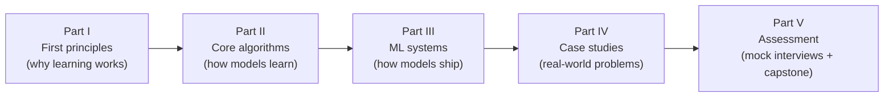

# Machine Learning: From First Principles to Production Systems

A one-semester course for computer science students that goes from **core algorithms**
(derived from first principles, visualised with Mermaid diagrams) to **real-world ML
systems** (fraud detection, feeds, search, ads, moderation, ETA, LLM assistants).

**Outcome:** a student who finishes this course can (1) explain *why* each core
algorithm works, not just call it, and (2) pass an **ML System Design interview** by
driving a structured 45-minute design of a production ML system.



## The teaching philosophy in one paragraph

Every topic is taught in the same order: **Problem → First principles → Algorithm →
Diagram → Code → Real-world use → System-design hook → Pitfalls → Exercises.**
We never introduce a formula before the student knows what problem it solves, and we
never introduce a tool before the student could, in principle, build a toy version of it.
The final third of the course re-uses every algorithm inside complete production systems,
because that is exactly what the ML system design interview tests.

## Repository map

| Folder | What is inside |
|---|---|
| [`SYLLABUS.md`](SYLLABUS.md) | 15-week schedule, learning outcomes, grading |
| [`modules/`](modules/) | Parts I–II: first principles and core algorithms (M01–M09) |
| [`system-design/`](system-design/) | Part III: the design framework, data/training infra, serving & monitoring (M10–M12) |
| [`case-studies/`](case-studies/) | Part IV: eight end-to-end real-world system designs |
| [`labs/`](labs/) | Runnable NumPy implementations from scratch, one per algorithm family |
| [`assessments/`](assessments/) | Quizzes, mock interview bank, grading rubric, capstone project |
| [`genai-databricks/`](genai-databricks/) | Exam prep for the **Databricks Generative AI Engineer Associate** certification: one page per exam domain, cheat sheet, 120 practice questions, timed mock exams on the website |
| [`docs/`](docs/) | Instructor guide, authoring template, the [AI-assisted learning guide](docs/ai-assisted-learning.md), and [tracking & analytics](docs/tracking-and-analytics.md) |
| [`website/`](website/) | Builds the course website (MkDocs Material, in-browser lab runner, progress tracker) |
| [`.claude/skills/`](.claude/skills/), [`AGENTS.md`](AGENTS.md) | AI study partner setup: tutor rules for any coding assistant + Claude Code slash commands |

## Course website

**https://maiphong0411.github.io/machine-learning-worldclass/** has the same material as a
searchable site with rendered diagrams and math. Labs **run in the browser** (Python + NumPy
via Pyodide, nothing to install), and a **My progress** page tracks which pages you've finished.
The site is built from [`website/`](website/) by GitHub Actions on every push to `main`.

## Quick start

```bash
python3 -m pip install numpy        # the only dependency for the labs
python3 labs/01_gradient_descent.py # each lab runs standalone and self-checks
```

## Study with an AI assistant

The repo is pre-configured so that Claude Code (or any assistant that reads `AGENTS.md`)
acts as a **tutor, not a solution generator**. You still do the thinking; the assistant
gives graded hints, quizzes you, reviews your code, and plays the interviewer:

```text
claude                         # start Claude Code in the repo root, then:
/tutor bias-variance           # first-principles explanation, Socratic
/hint 6 2                      # one hint level at a time for lab 6, exercise 2
/review-my-code labs/06_neural_network_backprop.py
/quiz-me M04                   # adaptive retrieval practice
/explain-back attention        # Feynman technique: you explain, it finds the gaps
/mock-interview P10            # timed ML system design interview, scored with the rubric
```

See [docs/ai-assisted-learning.md](docs/ai-assisted-learning.md) for the learning science,
setup for other assistants, and what is allowed in each assessment.

All diagrams are [Mermaid](https://mermaid.js.org/) and render natively on GitHub.

## Certification track: Databricks Generative AI Engineer Associate

[`genai-databricks/`](genai-databricks/README.md) applies the course's GenAI material (M08,
case study 07) to the Databricks platform. It follows the six domains of the exam guide that has
been live since March 2026, and adds a question bank and a timed
[practice exam](https://maiphong0411.github.io/machine-learning-worldclass/genai-databricks/practice-exam/).

## Suggested path for a student short on time

1. [M01 First principles](modules/01-ml-first-principles.md) – what "learning" actually means.
2. [M04 Evaluation](modules/04-evaluation-and-data.md) – how to know a model is good.
3. [M10 The ML system design framework](system-design/10-ml-system-design-framework.md).
4. Any two [case studies](case-studies/), then the [mock interview bank](assessments/mock-interview-bank.md).
