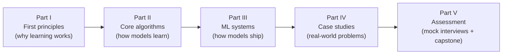

# Machine Learning: From First Principles to Production Systems

A one-semester course for computer science students that goes from **core algorithms**
(derived from first principles, visualised with Mermaid diagrams) to **real-world ML
systems** (fraud detection, feeds, search, ads, moderation, ETA, LLM assistants).

**Outcome:** a student who finishes this course can (1) explain *why* each core
algorithm works, not just call it, and (2) pass an **ML System Design interview** by
driving a structured 45-minute design of a production ML system.



## The teaching philosophy in one paragraph

Every topic is taught in the same order: **Problem → First principles → Algorithm →
Diagram → Code → Real-world use → System-design hook → Pitfalls → Exercises.**
We never introduce a formula before the student knows what problem it solves, and we
never introduce a tool before the student could, in principle, build a toy version of it.
The final third of the course re-uses every algorithm inside complete production systems,
because that is exactly what the ML system design interview tests.

## Repository map

| Folder | What is inside |
|---|---|
| [`SYLLABUS.md`](SYLLABUS.md) | 15-week schedule, learning outcomes, grading |
| [`modules/`](modules/) | Parts I–II: first principles and core algorithms (M01–M09) |
| [`system-design/`](system-design/) | Part III: the design framework, data/training infra, serving & monitoring (M10–M12) |
| [`case-studies/`](case-studies/) | Part IV: eight end-to-end real-world system designs |
| [`labs/`](labs/) | Runnable NumPy implementations from scratch, one per algorithm family |
| [`assessments/`](assessments/) | Quizzes, mock interview bank, grading rubric, capstone project |
| [`docs/`](docs/) | Instructor guide and the authoring template every module follows |

## Quick start

```bash
python3 -m pip install numpy        # the only dependency for the labs
python3 labs/01_gradient_descent.py # each lab runs standalone and self-checks
```

All diagrams are [Mermaid](https://mermaid.js.org/) and render natively on GitHub.

## Suggested path for a student short on time

1. [M01 First principles](modules/01-ml-first-principles.md) – what "learning" actually means.
2. [M04 Evaluation](modules/04-evaluation-and-data.md) – how to know a model is good.
3. [M10 The ML system design framework](system-design/10-ml-system-design-framework.md).
4. Any two [case studies](case-studies/), then the [mock interview bank](assessments/mock-interview-bank.md).
