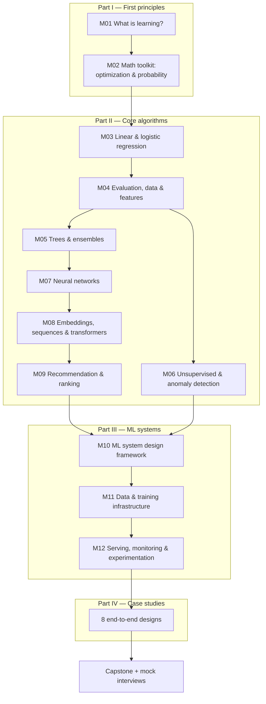
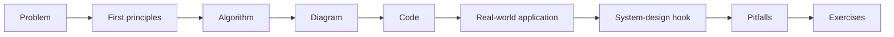

# Syllabus

**Audience:** 3rd/4th-year CS undergraduates or 1st-year master's students.
**Prerequisites:** programming in Python, basic linear algebra (vectors, matrices),
basic calculus (derivatives, chain rule), basic probability (expectation, conditional probability).
**Format:** 15 weeks × (2 × 90-min lectures + 1 × 2-hour lab).

## Course learning outcomes

By the end of the course, students will be able to:

1. **Explain** from first principles why a model trained on past data can predict the future
   (generalization, bias–variance, the role of the loss function and the data distribution).
2. **Derive and implement** the core algorithms (linear/logistic regression, trees and boosting,
   k-means/PCA, neural networks, embeddings/attention, collaborative filtering) from scratch.
3. **Choose and defend** an evaluation metric that reflects a business objective, and detect
   leakage, imbalance, and distribution shift.
4. **Design** an end-to-end ML system: problem framing, data, features, model, training,
   serving, monitoring, and experimentation — under latency, scale, and cost constraints.
5. **Communicate** a design under interview conditions using a repeatable framework.

## Course map

## Weekly schedule

| Week | Lecture topic | Reading | Lab | Real-world anchor |
|---|---|---|---|---|
| 1 | M01 What is learning? Generalization, bias–variance | [M01](modules/01-ml-first-principles.md) | Lab 0: setup, NumPy refresher | Spam filter: why rules stop scaling |
| 2 | M02 Optimization (GD/SGD/Adam), MLE, regularization as priors | [M02](modules/02-math-toolkit.md) | [Lab 1](labs/01_gradient_descent.py) | Why every model is "minimize a loss" |
| 3 | M03 Linear & logistic regression | [M03](modules/03-linear-and-logistic-regression.md) | [Lab 2](labs/02_linear_logistic_regression.py) | House prices; click-through prediction |
| 4 | M04 Metrics, validation, leakage, features | [M04](modules/04-evaluation-and-data.md) | [Lab 3](labs/03_metrics_from_scratch.py) | Medical screening: recall vs precision |
| 5 | M05 Decision trees, random forests, gradient boosting | [M05](modules/05-trees-and-ensembles.md) | [Lab 4](labs/04_decision_tree_and_boosting.py) | Credit scoring, fraud |
| 6 | M06 k-means, PCA, anomaly detection | [M06](modules/06-unsupervised-learning.md) | [Lab 5](labs/05_kmeans_pca.py) | Customer segmentation, intrusion detection |
| 7 | M07 Neural networks & backpropagation, CNNs | [M07](modules/07-neural-networks.md) | [Lab 6](labs/06_neural_network_backprop.py) | Image classification, defect detection |
| 8 | **Midterm** (Parts I–II through M07) | [Quiz bank](assessments/quizzes.md) | — | — |
| 9 | M08 Embeddings, RNNs, attention, transformers, LLMs | [M08](modules/08-embeddings-and-transformers.md) | [Lab 7](labs/07_attention_and_embeddings.py) | Semantic search, translation |
| 10 | M09 Collaborative filtering, two-tower, learning to rank | [M09](modules/09-recommendation-and-ranking.md) | [Lab 8](labs/08_matrix_factorization.py) | Netflix/YouTube recommendations |
| 11 | M10 The ML system design framework | [M10](system-design/10-ml-system-design-framework.md) | Design studio: framing drills | Turning a vague ask into an ML task |
| 12 | M11 Data pipelines, feature stores, training at scale | [M11](system-design/11-data-and-training-infrastructure.md) | Design studio: feature store | Uber Michelangelo-style platforms |
| 13 | M12 Serving, monitoring, drift, A/B testing | [M12](system-design/12-serving-monitoring-experimentation.md) | Design studio: A/B test analysis | Shipping a ranking model safely |
| 14 | Case studies (all eight, flipped classroom) | [case-studies/](case-studies/) | Mock interviews in pairs | Fraud, feed, search, ads, moderation, ETA, RAG, visual search |
| 15 | Capstone presentations + final mock interview | [Capstone](assessments/capstone-project.md) | — | Student-chosen |

## Grading

| Component | Weight | Notes |
|---|---|---|
| Labs (8) | 25% | Auto-checked: each lab ends with assertions that must pass |
| Quizzes (weekly, short) | 10% | From [quizzes.md](assessments/quizzes.md) |
| Midterm (written) | 20% | Derivations + algorithm tracing |
| Mock ML system design interview | 20% | Graded with [the rubric](assessments/ml-system-design-rubric.md) |
| Capstone project | 25% | Design doc + working prototype + presentation |

## How each module is structured

Every module in `modules/` and `system-design/` follows the same template
(see [docs/module-template.md](docs/module-template.md)), so students always know where to look:

