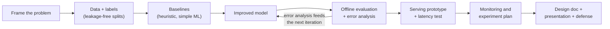
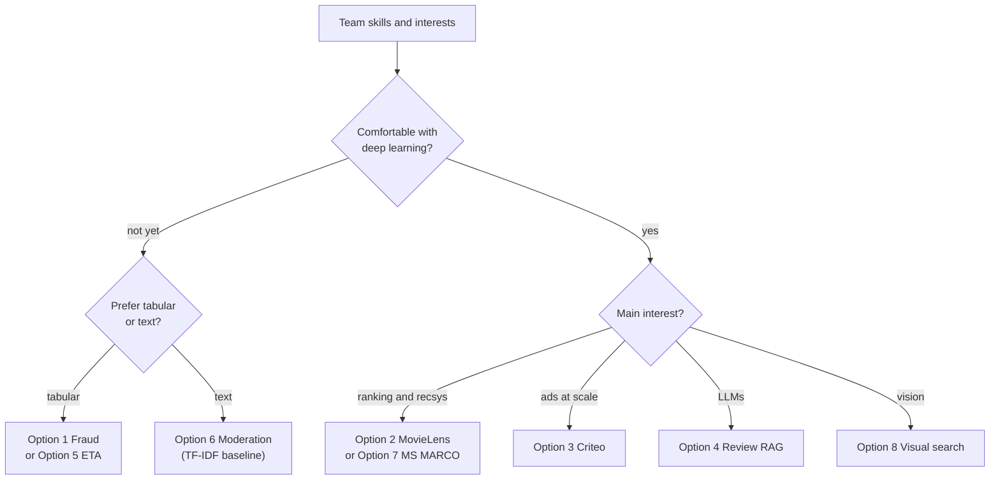
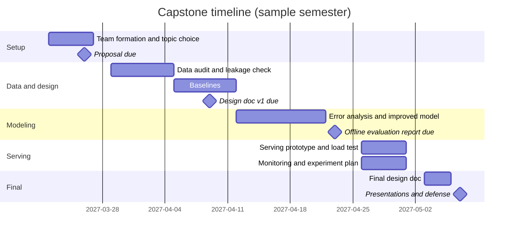
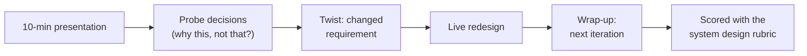

# Capstone Project: Build and Defend a Production-Style ML System

> **Big idea.** Knowing algorithms is not the same as shipping a system. In the capstone your team takes a
> real-world problem with a public dataset from **framing to a served, monitored prototype**, writes the
> design doc an industry team would write, and then **defends it in a system design interview**.

**Weight:** 25% of the course grade ([SYLLABUS](../SYLLABUS.md)) · **Team size:** 2–3 · **Duration:** Weeks 9–15 ·
**Graded with:** the table in [§7](#7-grading-rubric) and, for the defense, the
[ML system design rubric](ml-system-design-rubric.md).

## Contents

1. [Learning goals](#1-learning-goals)
2. [Choosing a problem — eight options](#2-choosing-a-problem--eight-options)
3. [Deliverables](#3-deliverables)
4. [Timeline and milestones](#4-timeline-and-milestones)
5. [Technical guidance](#5-technical-guidance)
6. [Presentation and defense](#6-presentation-and-defense)
7. [Grading rubric](#7-grading-rubric)
8. [Design doc template](#8-design-doc-template)
9. [Rules, ethics, and FAQ](#9-rules-ethics-and-faq)

---

## 1. Learning goals

By the end of the capstone your team will be able to:

1. **Frame** an ambiguous real-world problem as an ML task with a business objective, an ML objective, labels, and
   explicit non-functional requirements (latency, throughput, cost).
2. **Build** a reproducible pipeline: data validation → leakage-free splits → heuristic baseline → ML baseline → improved model.
3. **Evaluate** offline with metrics that match how predictions are used, including segment analysis and error analysis.
4. **Serve** the model behind an HTTP API and **measure** latency under load (p50/p95/p99).
5. **Plan** monitoring, retraining, and an online experiment for a hypothetical launch.
6. **Defend** every decision under questioning, exactly as in an ML system design interview.



---

## 2. Choosing a problem — eight options

Each option maps to one of the course [case studies](../case-studies/), so your design doc can build on a worked
example — but **you must go beyond it** with your own data analysis, modeling choices, and measurements.
Teams may propose their own problem (see [§9](#9-rules-ethics-and-faq)); it must be approved by Week 9.

### 2.1 Overview

| # | Problem | Dataset | Archetype / case study | Primary offline metric | Difficulty |
|---|---|---|---|---|---|
| 1 | Real-time card fraud scoring | **IEEE-CIS Fraud Detection** (Kaggle, Vesta) | Fraud — [CS 1](../case-studies/01-fraud-detection.md) | PR-AUC; recall at fixed FPR | ★★ |
| 2 | Movie recommendation | **MovieLens 25M** (GroupLens) | Feed / RecSys — [CS 2](../case-studies/02-news-feed-recommendation.md) | Recall@k, NDCG@k | ★★ |
| 3 | Ad click-through prediction | **Criteo Display Advertising Challenge** (Kaggle, ~45M rows) | Ads — [CS 4](../case-studies/04-ad-click-prediction.md) | Log-loss, calibration, AUC | ★★★ |
| 4 | Review-grounded shopping assistant | **Amazon Reviews 2023** (McAuley Lab, one category) | RAG — [CS 7](../case-studies/07-rag-assistant.md) | Retrieval recall@k, faithfulness | ★★★ |
| 5 | Trip duration (ETA) prediction | **NYC Taxi Trip Duration** (Kaggle) | Regression — [CS 6](../case-studies/06-eta-prediction.md) | RMSLE, MAE, interval coverage | ★ |
| 6 | Toxic comment moderation | **Jigsaw Toxic Comment Classification** (+ Unintended Bias in Toxicity) | Moderation — [CS 5](../case-studies/05-content-moderation.md) | Per-label PR-AUC, bias AUCs | ★★ |
| 7 | Passage search ranking | **MS MARCO Passage Ranking** | Search — [CS 3](../case-studies/03-search-ranking.md) | MRR@10, Recall@100 | ★★★ |
| 8 | Visual "shop the look" search | **Fashion Product Images** (Kaggle, small version ~44k) | Visual search — [CS 8](../case-studies/08-visual-search.md) | Recall@k, mAP | ★★ |

### 2.2 Option cards

Each card gives the realistic **scenario** you design for, the minimum **baseline**, ideas for the **improved model**,
the **serving** story, and the **traps** previous teams fell into.

#### Option 1 — Real-time card fraud scoring (IEEE-CIS)

- **Scenario:** a payment processor must score each transaction at authorization within 50 ms of model time.
- **Data:** ~590k transactions, ~3.5% fraud, transaction + identity tables, anonymized `V`/`C`/`D` features, a relative time column `TransactionDT`.
- **Baseline:** rule-based heuristic (amount + product code) → logistic regression with a handful of features.
- **Improved:** LightGBM/XGBoost with engineered card/entity identifiers and velocity-style aggregates (computed **only from past rows**).
- **Serving:** FastAPI endpoint receiving one transaction + a mocked in-memory "online feature store" holding per-card aggregates.
- **Traps:** random split (use time — the Kaggle test set is later in time); aggregates computed over the full dataset (future leakage); reporting accuracy.

#### Option 2 — Movie recommendation (MovieLens 25M)

- **Scenario:** "Top picks for you" row on a streaming home page, 100 ms budget.
- **Data:** 25M ratings, 162k users, 62k movies, timestamps, tags, genome scores.
- **Baseline:** popularity (global and per-genre) → item-item co-occurrence.
- **Improved:** matrix factorization (ALS/BPR) or a two-tower model for retrieval + a GBDT/MLP ranker with content features; optional sequence model on recent history.
- **Serving:** precompute item embeddings, ANN index (FAISS/hnswlib), user embedding computed at request time.
- **Traps:** random split of ratings (use a per-user temporal split: last N interactions held out); evaluating only on popular movies; treating ratings ≥ 4 vs all ratings without stating the choice.

#### Option 3 — Ad click-through prediction (Criteo)

- **Scenario:** pCTR for a display ad auction, used as $\text{bid} \times \text{pCTR}$; ~10 ms model budget.
- **Data:** ~45M rows (7 days), 13 integer + 26 hashed categorical features, ~26% positives (already downsampled).
- **Baseline:** logistic regression on hashed one-hot features.
- **Improved:** factorization machines / DeepFM / DCN with embeddings; negative downsampling experiments with re-calibration.
- **Serving:** batch-friendly endpoint; measure latency at batch sizes 1, 32, 256.
- **Traps:** using AUC alone (calibration matters for auctions); shuffling across days (use day 7 as test); out-of-memory — subsample responsibly and say so.

#### Option 4 — Review-grounded shopping assistant (Amazon Reviews 2023)

- **Scenario:** shoppers ask "Is this blender loud?"; the assistant answers from product reviews with citations.
- **Data:** pick **one category** (e.g. Appliances or Musical Instruments): reviews + item metadata.
- **Baseline:** BM25 retrieval over review chunks + extractive answer (top sentence).
- **Improved:** hybrid retrieval (BM25 + dense embeddings) + cross-encoder re-ranker + an LLM (small open model or an API) prompted to answer only from retrieved reviews with citations.
- **Evaluation:** build your own labelled set of ≥ 100 questions (written by the team from product pages, **before** looking at system outputs) with relevant review IDs and reference answers; measure retrieval recall@k and faithfulness (human + calibrated LLM judge).
- **Traps:** no evaluation set ("it looks good"); answering from other products' reviews; ignoring cost per query; prompt injection inside review text.

#### Option 5 — Trip duration / ETA (NYC Taxi Trip Duration)

- **Scenario:** a ride app shows an estimated trip duration at booking time.
- **Data:** ~1.46M trips with pickup/dropoff coordinates and times; optionally external weather data.
- **Baseline:** haversine distance / city-average speed by hour of day.
- **Improved:** GBDT on distance, time, location clusters (k-means on coordinates), and optional OSRM routing features; quantile models for a prediction interval.
- **Serving:** endpoint returning median and 80% interval; latency test.
- **Traps:** using `dropoff_datetime` or trip-level fields only known after the trip (leakage); not handling outlier trips (e.g. 0 s or > 24 h); only random splits — also evaluate on a later month.
- **Stretch (required for teams of 3):** asymmetric loss motivated by "late is worse than early", and interval coverage analysis per borough.

#### Option 6 — Toxic comment moderation (Jigsaw)

- **Scenario:** a discussion platform auto-hides very likely toxic comments and sends uncertain ones to human review (capacity: 2% of traffic).
- **Data:** ~160k Wikipedia comments, six labels (toxic, severe_toxic, obscene, threat, insult, identity_hate); Unintended Bias dataset adds identity annotations.
- **Baseline:** TF-IDF + logistic regression per label.
- **Improved:** fine-tuned small transformer (e.g. DistilBERT) multi-label; threshold per label and per action band.
- **Fairness:** measure subgroup AUC / BPSN / BNSP on identity mentions; show at least one mitigation and its effect.
- **Traps:** single softmax for a multi-label problem; ignoring that "identity_hate" has very few positives; measuring only overall AUC.

#### Option 7 — Passage search ranking (MS MARCO)

- **Scenario:** a search engine returns the 10 best passages for a natural-language query; 150 ms budget.
- **Data:** ~8.8M passages, ~500k training queries with sparse relevance labels; official dev set.
- **Baseline:** BM25 (e.g. Pyserini or rank_bm25 on a subset).
- **Improved:** dense retrieval (pretrained bi-encoder) + cross-encoder re-ranking of top-100; or a fine-tuned bi-encoder with hard negatives.
- **Serving:** two-stage pipeline; latency breakdown per stage; index memory footprint.
- **Traps:** treating unlabelled passages as definitely irrelevant (sparse labels); evaluating on training queries; ignoring index build time. Using a subset of the corpus is fine if stated and justified.

#### Option 8 — Visual "shop the look" search (Fashion Product Images)

- **Scenario:** a user uploads a product photo and gets visually similar catalogue items, filterable by gender/category.
- **Data:** ~44k product images with category, colour, season, usage metadata.
- **Baseline:** pretrained CNN (ResNet-50) global-pooled embeddings + cosine similarity, brute force.
- **Improved:** fine-tuned embedding with a metric-learning loss (triplet / supervised contrastive using `articleType` + colour as similarity), or CLIP embeddings; ANN index; metadata re-ranking.
- **Evaluation:** recall@k where "relevant" = same article type and colour (state your definition), plus a human-judged sample.
- **Traps:** query images present in the index (trivial self-match); no augmentation to simulate user photos; brute-force search reported as "scalable".

### 2.3 Picking well



**Compute budget.** Every option is feasible on a laptop or a free-tier GPU notebook if you subsample sensibly.
State your subsample and its effect on conclusions — that is itself a design decision the defense will probe.

---

## 3. Deliverables

| # | Deliverable | Format | Due |
|---|---|---|---|
| D0 | Project proposal (1 page) | Markdown in team repo | End of Week 9 |
| D1 | Design doc v1 (sections 1–5 of the template) | Markdown | End of Week 11 |
| D2 | Baseline + improved model, offline evaluation | Code + notebook/report | End of Week 13 |
| D3 | Serving prototype with latency measurement | Code + `LATENCY.md` | End of Week 14 |
| D4 | Monitoring and experiment plan | Section of design doc | End of Week 14 |
| D5 | Final design doc (all sections) | Markdown, ≤ 12 pages excluding appendix | Week 15, 48 h before presentation |
| D6 | 10-min presentation + 15-min defense | Slides + live session | Week 15 |

### 3.1 D0 — Proposal (1 page)

Problem and user · business objective · ML task (input → output) · dataset and its licence · primary metric and why ·
baseline you will beat · the biggest risk you foresee · who does what.

### 3.2 D1/D5 — Design doc

Use the [template in §8](#8-design-doc-template). It follows the [case study template](../docs/module-template.md) so
your doc reads like the eight course case studies — and like a real industry design review.

### 3.3 D2 — Models and offline evaluation

Minimum requirements:

1. **Data validation report:** row counts, label distribution, missing values, duplicates, time range; explicit leakage audit (every feature: "available at prediction time? computed only from the past?").
2. **Split strategy** justified (time-based / group-based / per-user temporal).
3. **Three levels of models:** (a) heuristic / non-ML baseline, (b) simple ML baseline, (c) improved model. Each improvement must be justified by an **error analysis** of the previous one, not by "we tried a bigger model".
4. **Metrics:** primary metric + at least two secondary (one of which is calibration or an operating-point metric where relevant), with **confidence intervals** (bootstrap) or multiple seeds.
5. **Segment analysis:** at least three segments (e.g. new vs returning users, borough, product category, identity mention).
6. **Ablation:** remove your most important feature group or component and report the effect.
7. **Reproducibility:** `make train` (or one command) reproduces the reported numbers from raw data; random seeds fixed; environment pinned.

### 3.4 D3 — Serving prototype and latency measurement

- An HTTP service (FastAPI recommended) with `POST /predict` (or `/recommend`, `/search`) and `GET /health`.
- Model and any index loaded **once** at startup; feature lookups simulated with an in-memory dict or SQLite/Redis as an "online store".
- Input validation (pydantic), a model version in each response, and a **fallback** when the model fails (e.g. popularity list, rules score).
- A load test reporting **p50 / p95 / p99 latency and throughput** at at least two concurrency levels, with hardware stated.
- A `LATENCY.md` with a **latency budget table** (per stage) and one optimization you tried (batching, caching, quantization, smaller model, ANN parameters) with before/after numbers.

See [§5.3](#53-serving-skeleton-and-latency-measurement) for a starting skeleton.

### 3.5 D4 — Monitoring and experiment plan

A section of the design doc that answers:

- **What to monitor** before labels arrive (inputs, outputs, system) and after (delayed-label performance), with concrete thresholds.
- **Drift detection** method (e.g. PSI per feature against the training window) — demonstrate it once by simulating drift on your test data (e.g. a later time period or a perturbed segment).
- **Retraining** cadence and trigger, with justification.
- **Rollout**: shadow → canary → A/B; primary metric, guardrails, minimum detectable effect, and a rough sample size calculation.
- **Failure modes and fallbacks**, including feedback loops specific to your problem.

### 3.6 D6 — Presentation and defense

See [§6](#6-presentation-and-defense).

---

## 4. Timeline and milestones

The dates below are for a sample semester starting in late January 2027; instructors shift them to the actual calendar.



| Week | Milestone | Checkpoint with TA (15 min) | What the TA checks |
|---|---|---|---|
| 9 | Proposal (D0) | Topic approval | Problem is well-scoped; dataset accessible; metric fits the use |
| 10 | Data audit | Leakage review | Split strategy; feature availability table; label definition |
| 11 | Design doc v1 (D1) + baselines | Framing review | Requirements, ML framing, baseline numbers |
| 12 | Improved model in progress | Error analysis review | Improvements are driven by analysis, not random search |
| 13 | Offline evaluation (D2) | Metrics review | CIs, segments, ablation, reproducibility |
| 14 | Serving (D3) + monitoring plan (D4) | Mock defense (practice) | Latency numbers credible; fallbacks exist |
| 15 | Final doc (D5) + presentation (D6) | — | Graded |

**Late policy:** milestone deliverables D0–D4 lose 10% per day late (max 3 days). D5/D6 cannot be late.

---

## 5. Technical guidance

### 5.1 Recommended repository layout

```text
capstone-<team>/
├── README.md              # how to reproduce everything, team roles
├── DESIGN.md              # the design doc (template in section 8)
├── LATENCY.md             # load test results and latency budget
├── Makefile               # make data / make train / make eval / make serve / make loadtest
├── requirements.txt       # pinned versions
├── data/                  # raw data NOT committed; download script instead
├── src/
│   ├── data.py            # loading, validation, splits
│   ├── features.py        # feature definitions shared by training AND serving
│   ├── train.py
│   ├── evaluate.py        # metrics, bootstrap CIs, segments
│   └── serve.py           # FastAPI app
├── tests/                 # at least: feature parity test, API smoke test
└── reports/               # figures and evaluation outputs
```

**Key principle:** `features.py` is imported by both `train.py` and `serve.py`. One definition, two uses → no
training/serving skew. Write a test that computes features for the same raw input via both paths and asserts equality.

### 5.2 Evaluation helpers

Bootstrap confidence interval for any metric:

```python
import numpy as np

def bootstrap_ci(y_true, y_score, metric, n_boot=1000, alpha=0.05, seed=0):
    rng = np.random.default_rng(seed)
    n = len(y_true)
    stats = []
    for _ in range(n_boot):
        idx = rng.integers(0, n, n)
        stats.append(metric(y_true[idx], y_score[idx]))
    lo, hi = np.quantile(stats, [alpha / 2, 1 - alpha / 2])
    return metric(y_true, y_score), lo, hi
```

Population Stability Index for drift monitoring (bins from the reference/training window):

```python
def psi(reference, current, bins=10, eps=1e-6):
    edges = np.quantile(reference, np.linspace(0, 1, bins + 1))
    edges[0], edges[-1] = -np.inf, np.inf
    r = np.histogram(reference, edges)[0] / len(reference) + eps
    c = np.histogram(current, edges)[0] / len(current) + eps
    return float(np.sum((c - r) * np.log(c / r)))
# Rule of thumb: PSI < 0.1 stable, 0.1–0.25 moderate shift, > 0.25 investigate.
```

### 5.3 Serving skeleton and latency measurement

```python
# src/serve.py — minimal skeleton; adapt the schema to your problem
import time, joblib
from fastapi import FastAPI
from pydantic import BaseModel
from features import build_features          # shared with training

MODEL_VERSION = "gbdt-2027-04-20"
app = FastAPI()
model = joblib.load("artifacts/model.joblib")  # loaded once at startup
online_store = joblib.load("artifacts/card_aggregates.joblib")  # simulated feature store

class Txn(BaseModel):
    card_id: str
    amount: float
    product_code: str

@app.get("/health")
def health():
    return {"status": "ok", "model_version": MODEL_VERSION}

@app.post("/predict")
def predict(txn: Txn):
    t0 = time.perf_counter()
    try:
        x = build_features(txn.model_dump(), online_store.get(txn.card_id, {}))
        score = float(model.predict_proba([x])[0, 1])
        source = "model"
    except Exception:
        score, source = 0.0, "fallback"        # e.g. defer to rules engine
    return {"score": score, "source": source, "model_version": MODEL_VERSION,
            "server_ms": round((time.perf_counter() - t0) * 1000, 2)}
```

```python
# loadtest.py — measures end-to-end latency percentiles at a given concurrency
import asyncio, time, httpx, numpy as np

async def worker(client, payloads, latencies):
    for p in payloads:
        t0 = time.perf_counter()
        r = await client.post("http://127.0.0.1:8000/predict", json=p)
        r.raise_for_status()
        latencies.append((time.perf_counter() - t0) * 1000)

async def main(payloads, concurrency=16):
    latencies = []
    chunks = [payloads[i::concurrency] for i in range(concurrency)]
    async with httpx.AsyncClient() as client:
        t0 = time.perf_counter()
        await asyncio.gather(*(worker(client, c, latencies) for c in chunks))
        wall = time.perf_counter() - t0
    p50, p95, p99 = np.percentile(latencies, [50, 95, 99])
    print(f"n={len(latencies)} conc={concurrency} p50={p50:.1f}ms "
          f"p95={p95:.1f}ms p99={p99:.1f}ms throughput={len(latencies)/wall:.0f} req/s")
```

Run the server with `uvicorn serve:app --workers 2`, **warm up** with ~100 requests before measuring, use ≥ 2,000
requests per measurement, and report the hardware. Tools like `locust` or `hey` are equally acceptable.

**`LATENCY.md` budget table (example for Option 2):**

| Stage | Budget (ms) | Measured p95 (ms) | Notes |
|---|---|---|---|
| Request parsing + validation | 2 | 0.8 | pydantic |
| User feature lookup | 5 | 1.9 | in-memory dict |
| Candidate retrieval (ANN, k = 500) | 15 | 6.4 | hnswlib, `ef = 100` |
| Ranking 500 candidates | 40 | 31.0 | LightGBM, batched |
| Re-ranking + filters | 5 | 1.2 | remove watched, diversity |
| Network / framework overhead | 33 | — | headroom |
| **Total** | **100** | **52.7** (end-to-end, client side) | 2 vCPU laptop, concurrency 8 |

### 5.4 Things the defense will certainly ask

- "Show me the split. Why is there no leakage?"
- "What does your heuristic baseline score, and is the improvement worth the complexity?"
- "What is the p99 latency, on what hardware, at what concurrency?"
- "Which segment does your model fail on, and why?"
- "What will you monitor in the first week after launch? What is the fallback?"
- "If you had 10× the data / 10× the traffic, what changes?"

---

## 6. Presentation and defense

### 6.1 Format (25 minutes per team)

| Part | Time | Content |
|---|---|---|
| Presentation | 10 min | Problem and framing (2) · data and labels (2) · models and results (3) · serving and latency (1.5) · monitoring plan (1) · lessons (0.5) |
| Defense | 15 min | Two examiners act as interviewers in an ML system design interview. Each team member must answer at least one question **alone**. |

### 6.2 How the defense works

The defense is run as a system design interview about **your** system, followed by a twist:

1. **Probe (≈ 8 min):** examiners pick 3–4 decisions from your doc and ask "why this and not that?" using the
   probes in the [mock interview bank](mock-interview-bank.md#5-universal-follow-up-probes).
2. **Twist (≈ 5 min):** a changed requirement, e.g. "traffic is now 50k QPS", "labels arrive 30 days late",
   "it must run on a phone", "regulators require explanations". The team redesigns live, at the whiteboard.
3. **Wrap-up (≈ 2 min):** "What would you build next and why?"



Examiners score the defense with the [ML system design rubric](ml-system-design-rubric.md) (team score, with
individual adjustment of ±1 level on D8 based on each member's solo answer).

### 6.3 Slide guidance

- At most 12 slides. One architecture diagram, one results table with CIs, one latency table, one monitoring slide.
- Lead every slide with its conclusion as the title ("GBDT beats LR by 9 PR-AUC points; gains come from velocity features").
- Show at least one **failure** honestly — examiners reward insight into failure more than polished success.

---

## 7. Grading rubric

### 7.1 Component weights

| Component | Weight | What earns full marks |
|---|---|---|
| Design doc (D1 + D5) | 25% | Complete template; precise framing; numbers for requirements; trade-offs explicit; readable by an engineer outside the team |
| Models (D2: baseline + improved) | 15% | Three model levels; improvements motivated by error analysis; ablation; reproducible with one command |
| Offline evaluation (D2) | 15% | Leakage-free split justified; metrics fit the decision; CIs; segment analysis; calibration where relevant |
| Serving prototype (D3) | 15% | Working API with validation, versioning, fallback; credible load test; latency budget; one measured optimization |
| Monitoring & experiment plan (D4) | 10% | Concrete metrics and thresholds; drift demo; retraining trigger; A/B design with sample size; feedback loops addressed |
| Presentation + defense (D6) | 20% | Clear 10-min story; strong answers under probing; handles the twist; rubric level Lean hire or above |
| **Total** | **100%** | |

Milestone check-ins (D0, D1 v1) are pass/fail gates: a team that misses a gate without agreement loses 5 points from the total.

### 7.2 Level descriptors per component

| Component | Excellent (90–100%) | Good (75–89%) | Adequate (60–74%) | Insufficient (< 60%) |
|---|---|---|---|---|
| **Design doc** | Reads like a real design review; every choice has an alternative and a reason; numbers throughout | Complete and correct; some choices unjustified | Sections present but generic; few numbers | Missing sections; framing unclear or wrong |
| **Models** | Clear progression driven by error analysis; ablations explain gains | Progression present; some improvements ad hoc | Baseline + one model; little analysis | No baseline, or results not reproducible |
| **Offline evaluation** | Metrics map to the business decision; CIs, segments, calibration, honest failure analysis | Right metrics and split; limited segments | Some metric issues (e.g. no CIs) but no leakage | Leakage, wrong split, or misleading metric (e.g. accuracy on imbalanced data) |
| **Serving** | Robust API, fallback, versioning; measured p50/p95/p99 at two loads; optimization with before/after | Working API and load test; budget table | API works; latency measured informally | Not runnable, or no latency measurement |
| **Monitoring plan** | Specific thresholds; drift demonstrated; feedback loops and adversaries considered; A/B sized | Concrete plan, minor gaps | Generic ("monitor drift, retrain monthly") | Missing |
| **Presentation + defense** | Strong hire on rubric; twist handled with quantified trade-offs | Lean hire; minor gaps | Lean no; needed several nudges | No hire; could not explain own decisions |

### 7.3 Individual contribution

Each member submits a short peer assessment (confidential). Large imbalances, confirmed by git history and the
solo defense answers, can move an individual grade by up to ±10% of the capstone mark.

---

## 8. Design doc template

Copy this into `DESIGN.md`. Keep it ≤ 12 pages excluding appendices. Write for a reader who is a strong engineer
but has not seen your project.

```markdown
# <System name> — Design Doc

**Team:** names · **Option:** # · **Dataset:** name + version + licence · **Last updated:** date

> **One-paragraph summary.** What the system does, for whom, the headline result
> (e.g. "catches 72% of fraud dollars at a 0.5% decline rate, p99 = 18 ms"), and the main open risk.

## 1. Clarify requirements
- **Users and use case:** who calls the system, when, and what they do with the output.
- **Functional requirements:** bullet list.
- **Non-functional requirements (table):**

| Requirement | Target | Rationale |
|---|---|---|
| Latency (p99, model service) | e.g. 50 ms | authorization budget |
| Throughput (assumed peak) | e.g. 2,000 QPS | back-of-envelope below |
| Freshness of features | e.g. velocity features < 1 min | attack speed |
| Cost / hardware | e.g. CPU only | ... |

- **Back-of-envelope estimate:** traffic, storage, memory (show the arithmetic).
- **Assumptions:** everything the dataset cannot tell you, stated explicitly.

## 2. Frame as an ML problem
- **Business objective →** **ML objective →** **label →** **input / output.**
- **Decision policy:** how the prediction becomes an action (threshold, ranking, bands).
- **Non-ML baseline:** what you would ship with no model.
- **Proxy vs true objective:** where they diverge and how you guard against it.

## 3. Data
- Sources, size, time range, label definition and distribution.
- Data quality findings (missing, duplicates, outliers) and what you did.
- **Leakage audit table:** feature group · available at prediction time? · computed only from the past? · action.
- Split strategy and why; sampling / imbalance handling; privacy and licence notes.

## 4. Features

| Feature | Type | Entity | Source | Online/offline | Freshness | Notes |
|---|---|---|---|---|---|---|

## 5. Model
- Heuristic baseline → simple ML baseline → improved model: for each, what and **why**.
- Loss function, negatives, class weighting, calibration.
- Multi-stage design if applicable (diagram).
- Alternatives considered and rejected (table: option · pros · cons · decision).

## 6. Training
- Pipeline (diagram), hyper-parameter search, reproducibility (seeds, versions, one-command run).
- Retraining cadence (hypothetical production) and data window, considering label delay.

## 7. Evaluation
- **Offline:** primary + secondary metrics with 95% CIs; results table for all model levels.
- Segment analysis, error analysis (with examples), ablation, calibration plot if relevant.
- **Online (planned):** A/B design — unit of randomization, primary metric, guardrails, MDE, sample size, duration.

## 8. Serving architecture
- Request-path diagram (Mermaid).
- Latency budget table: budget vs measured p50/p95/p99, hardware, concurrency.
- Fallbacks and graceful degradation; model versioning; rollout plan (shadow → canary → A/B → ramp).

## 9. Monitoring & iteration
- Metrics to monitor (system / input / output / business / delayed-label) with alert thresholds.
- Drift detection and the simulated-drift demonstration.
- Feedback loops, adversarial behaviour, fairness monitoring.
- Retraining triggers and the iteration roadmap (next 3 things, ranked by expected impact).

## 10. Trade-offs & extensions
- The 3–5 most important trade-offs you made, each with the alternative and what would change your mind.
- Responsible-ML considerations: who could be harmed, how you would know, mitigation.

## 11. Anticipated interviewer follow-ups
- 5 questions you expect in the defense, each with a 3–5 sentence answer.

## Appendix
- Full results tables, extra plots, hyper-parameters, environment.
```

### 8.1 Design doc quality checklist (run before submitting)

- [ ] The summary contains a headline number and a latency number.
- [ ] Every requirement has a numeric target.
- [ ] The label definition includes the event, the time window, and how negatives are defined.
- [ ] The leakage audit covers every feature group.
- [ ] Each model level has a reason grounded in data or error analysis.
- [ ] Every metric has a confidence interval or seed variance.
- [ ] The serving diagram matches the code.
- [ ] Monitoring has thresholds, not just metric names.
- [ ] At least three trade-offs list the rejected alternative.
- [ ] A reader outside the team could reproduce the results from README + Makefile.

---

## 9. Rules, ethics, and FAQ

### 9.1 Rules

- **Own problem?** Allowed if it has a public dataset, a clear decision that the model supports, and a serving story.
  Submit a proposal by the end of Week 9; the instructor may ask you to rescope.
- **Libraries and pretrained models** are allowed (scikit-learn, LightGBM, PyTorch, Hugging Face, FAISS). You must be able
  to explain what each component does in the defense — "the library does it" is not an answer.
- **Kaggle notebooks and public solutions:** you may read them; you must cite anything you reuse, and the analysis and design
  must be your own. Copying a leaderboard solution without understanding it will be evident in the defense.
- **AI coding assistants:** allowed for code, with a short note in the README on how they were used. All design decisions
  must be defended by the team.
- **Data licences:** respect each dataset's terms (several Kaggle competition datasets are for non-commercial/research use only).
  Do not commit raw data to the repository.

### 9.2 Ethics

- Options 1, 4, 6, and 8 involve people's behaviour or content. Your doc must include a short section on potential harms
  (false positives on legitimate customers, biased moderation of identity-related speech, privacy in reviews).
- Report segment metrics even when they are unflattering. Hiding a failure is graded more harshly than reporting it.

### 9.3 FAQ

**Our improved model barely beats the baseline. Will we lose marks?**
No — if your error analysis explains why and your conclusion is honest. A well-understood negative result is worth more than
an unexplained gain. Industry teams kill projects for exactly this reason, and the decision itself is valuable.

**The dataset is too big for our laptops.**
Subsample (by time window or by users, not randomly by rows if that breaks sequences), state it, and discuss in the doc what
would change at full scale. That discussion is a good defense topic.

**Do we need a real A/B test?**
No. You need a credible *plan*: unit of randomization, metrics, guardrails, MDE, and sample size.

**Do we need Docker / Kubernetes?**
No. A reproducible environment (`requirements.txt` pinned, or a Dockerfile if you like) and a runnable service are enough.
Spend your time on evaluation and design decisions, not infrastructure.

**What separates an A capstone from a B?**
Specificity and evidence. A-level teams show numbers for every claim, motivate each change with analysis, measure latency
properly, and handle the defense twist by reasoning from their own measurements.
