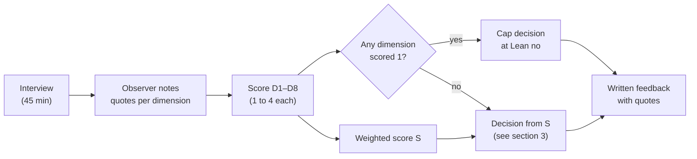
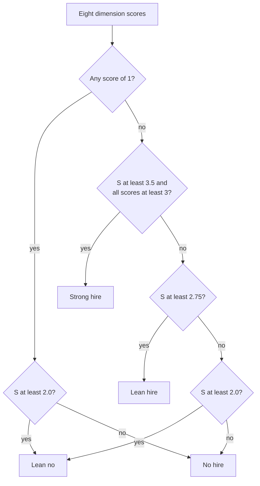

# ML System Design Rubric

> **Purpose.** One rubric, used everywhere in this course: for the graded mock interview (20% of the
> course grade), for the capstone defense, and for peer mocks. It deliberately mirrors the scorecards
> used by industry interview panels: **eight dimensions**, each scored on **four levels** with concrete
> behavioural anchors, so two graders watching the same interview land within one level of each other.

**Used with:** [Mock interview bank](mock-interview-bank.md) · [Capstone project](capstone-project.md) ·
[M10 framework](../system-design/10-ml-system-design-framework.md)

## Contents

1. [How the rubric works](#1-how-the-rubric-works)
2. [The eight dimensions](#2-the-eight-dimensions)
3. [From scores to a decision](#3-from-scores-to-a-decision)
4. [Scoring sheet template](#4-scoring-sheet-template)
5. [Self-assessment checklist](#5-self-assessment-checklist)
6. [Weak vs strong answers for the same step](#6-weak-vs-strong-answers-for-the-same-step)
7. [Calibration guide for graders](#7-calibration-guide-for-graders)

---

## 1. How the rubric works

### 1.1 The four levels

| Level | Score | Meaning in one sentence | Industry equivalent |
|---|---|---|---|
| **No hire** | 1 | Missing, incorrect, or only buzzwords; the interviewer had to drive. | "Would not want on the team for this skill." |
| **Lean no** | 2 | Correct but generic or shallow; needed nudges; little justification. | "Might grow into it; not there yet." |
| **Lean hire** | 3 | Correct, specific to the problem, justified, with at least one trade-off. | "Can do this job with normal support." |
| **Strong hire** | 4 | Lean hire **plus** anticipates problems, quantifies, and adapts under probing. | "Would raise the bar of the team." |

**Anchoring principle:** a level is earned by *observable behaviour* — something the candidate said or drew —
never by the grader's impression of potential. Graders write down the quote or moment that justifies each score.

### 1.2 Dimensions and weights

| # | Dimension | Weight | Core question the grader asks |
|---|---|---|---|
| D1 | Problem framing | 15% | Did they turn a vague ask into the right ML task with measurable goals? |
| D2 | Data & labels | 15% | Do they know where labels come from and how they are biased? |
| D3 | Features | 10% | Are features specific, available at prediction time, and organized? |
| D4 | Modeling | 15% | Baseline → production model, justified by data and constraints? |
| D5 | Evaluation | 15% | Offline and online metrics tied to the business goal, with guardrails? |
| D6 | Serving & scale | 10% | Would it meet latency/throughput/cost? Is the architecture coherent? |
| D7 | Monitoring & iteration | 10% | How will they know it breaks, and how does it improve over time? |
| D8 | Communication & trade-offs | 10% | Structured, clear, collaborative; explicit trade-offs throughout? |

The weighted score is $S = \sum_{d=1}^{8} w_d \cdot s_d$, with $s_d \in \{1,2,3,4\}$ and $\sum_d w_d = 1$,
so $S \in [1, 4]$.



---

## 2. The eight dimensions

Each dimension lists behavioural anchors per level, the **probes** graders use to discriminate between
Lean hire and Strong hire, and **red flags** that immediately cap the score.

### D1 — Problem framing (15%)

| Level | Behavioural anchors |
|---|---|
| **1 No hire** | Starts with a model ("I'd use a transformer") before asking anything. No business objective. Cannot state what the model predicts. |
| **2 Lean no** | Asks a few generic questions (scale, latency) but does not use the answers. States an ML task, but the label or output is vague ("predict relevance"). |
| **3 Lean hire** | Clarifies the business goal, users, scale, and latency; states the ML objective, label, input and output precisely; proposes a non-ML baseline; writes requirements down. |
| **4 Strong hire** | All of Lean hire, plus: identifies the gap between proxy and true objective (e.g. clicks vs satisfaction) and designs around it; uses numbers to derive architecture (QPS → multi-stage); recognizes the archetype and adapts it rather than reciting it. |

- **Discriminating probes:** "Why that label and not X?" · "What happens if we optimize your objective perfectly — what goes wrong?"
- **Red flags:** no clarifying questions at all; optimizing a metric the interviewer said is not the goal.

### D2 — Data & labels (15%)

| Level | Behavioural anchors |
|---|---|
| **1 No hire** | "We'll use the data we have." No label source. Random train/test split for time-dependent data without noticing. |
| **2 Lean no** | Names a label source (e.g. clicks) but not its biases; mentions imbalance only as "use SMOTE". |
| **3 Lean hire** | Defines labels concretely (event, window, positive/negative definition); discusses imbalance, sampling, time-based splits, privacy; plans a human-labelled evaluation set where needed. |
| **4 Strong hire** | Anticipates *label pathologies*: delay, selection bias (blocked fraud has no labels), position/exposure bias, feedback loops, label noise — and proposes concrete fixes (exploration traffic, IPW, matured-label windows, inter-annotator agreement). |

- **Discriminating probes:** "Your model decides what gets shown — how does that affect next month's labels?" · "How long until a label is final?"
- **Red flags:** using the old system's prediction as the label; leakage the candidate cannot see when prompted.

### D3 — Features (10%)

| Level | Behavioural anchors |
|---|---|
| **1 No hire** | "We'll use user and item features." No concrete examples. |
| **2 Lean no** | Lists concrete features but unordered; ignores availability at prediction time and freshness. |
| **3 Lean hire** | Organizes features by entity (user, item, context, cross/interaction); specifies type, source, batch vs real-time; handles high-cardinality IDs (embeddings, hashing); checks point-in-time availability. |
| **4 Strong hire** | Prioritizes features by expected signal vs cost; designs streaming aggregates where freshness matters (velocity features); addresses training/serving skew (shared definitions, log-and-train); notes privacy-sensitive features to exclude. |

- **Discriminating probes:** "Which three features matter most and why?" · "Which feature would you drop if latency doubled?"
- **Red flags:** features that leak the label (e.g. "number of chargebacks on this transaction").

### D4 — Modeling (15%)

| Level | Behavioural anchors |
|---|---|
| **1 No hire** | Names a fashionable model with no justification, or cannot describe its input/output and loss. |
| **2 Lean no** | Reasonable model choice but no baseline; loss function unstated; cannot explain why it suits the data. |
| **3 Lean hire** | Heuristic → simple ML baseline → production model, each justified by data size, feature types, latency, and interpretability; states loss and training procedure (negatives, class weights); multi-stage when scale demands. |
| **4 Strong hire** | Explains *why* the model's inductive bias fits (e.g. GBDT for heterogeneous tabular; two-tower for factorized retrieval); discusses multi-task vs single-task, calibration, cold start; knows when not to add complexity and how to measure if it pays off. |

- **Discriminating probes:** "Why not a deep model here?" · "How do you handle a new item with no interactions?"
- **Red flags:** cannot explain the loss; a single model scoring a billion items per request.

### D5 — Evaluation (15%)

| Level | Behavioural anchors |
|---|---|
| **1 No hire** | "Accuracy" for an imbalanced problem, or no evaluation plan at all. |
| **2 Lean no** | Names appropriate offline metrics (AUC, NDCG) but no link to business; online testing is "we'd A/B test it". |
| **3 Lean hire** | Offline metrics chosen for the decision (PR-AUC, recall at fixed FPR, NDCG@k, calibration); time-based validation; online A/B with primary metric, guardrails, and duration; segment analysis. |
| **4 Strong hire** | Explains offline/online mismatch and how to reduce it; sizes the experiment (power, minimum detectable effect); handles interference (switchback for marketplaces), novelty effects, peeking; uses counterfactual/off-policy evaluation where relevant. |

- **Discriminating probes:** "Offline improved by 2%, online flat — what are three causes?" · "How long does the test run and why?"
- **Red flags:** shipping on offline metrics only; no guardrails for a system with obvious side effects.

### D6 — Serving & scale (10%)

| Level | Behavioural anchors |
|---|---|
| **1 No hire** | No architecture, or one box labelled "model". No latency consideration. |
| **2 Lean no** | Draws a plausible request path but cannot estimate load or latency; ignores where features come from at request time. |
| **3 Lean hire** | Coherent diagram (request → features → candidate generation → ranking → post-processing); latency budget per stage; batch vs online prediction choice; caching; back-of-envelope QPS and storage. |
| **4 Strong hire** | Quantifies bottlenecks and cost (GPU vs CPU, ANN index memory, quantization/distillation); designs fallbacks and graceful degradation; deployment safety (shadow → canary → A/B → ramp, rollback). |

- **Discriminating probes:** "Traffic grows 10× — what breaks first?" · "The feature store times out — what does the user see?"
- **Red flags:** latency budget wildly off (a 2-second model in a 100 ms path) without noticing.

### D7 — Monitoring & iteration (10%)

| Level | Behavioural anchors |
|---|---|
| **1 No hire** | "We'd monitor accuracy." No retraining plan. |
| **2 Lean no** | Mentions drift and periodic retraining without specifics. |
| **3 Lean hire** | Monitors system metrics, input and output distributions, business metrics, and delayed-label performance; retraining cadence justified by drift speed; alerting thresholds; human escalation path. |
| **4 Strong hire** | Designs for feedback loops and adversaries; defense in depth (rules + model + review); regression test sets of known failures; a concrete iteration roadmap prioritized by expected impact. |

- **Discriminating probes:** "How do you know it broke at 3 a.m.?" · "What would you work on in the next quarter?"
- **Red flags:** no fallback when the model service fails.

### D8 — Communication & trade-offs (10%)

| Level | Behavioural anchors |
|---|---|
| **1 No hire** | Disorganized; long silences or monologues; does not respond to hints; defensive when challenged. |
| **2 Lean no** | Follows a structure but rigidly; trade-offs only when asked; runs out of time before serving or monitoring. |
| **3 Lean hire** | States a plan up front; checks in; diagrams support the explanation; names alternatives at key decisions; covers all phases within 45 minutes. |
| **4 Strong hire** | Drives the conversation like a tech lead; quantifies trade-offs ("+20 ms for ~1% recall"); adapts depth to the interviewer's interest; summarizes decisions and open risks at the end. |

- **Discriminating probes:** interrupting with a change of requirements mid-way ("now it must run on-device").
- **Red flags:** ignoring direct interviewer questions; dismissing constraints.

---

## 3. From scores to a decision

| Weighted score $S$ | Decision | Course points (out of 20) |
|---|---|---|
| $S \ge 3.5$ and no dimension below 3 | **Strong hire** | 18–20 |
| $2.75 \le S < 3.5$ and no dimension at 1 | **Lean hire** | 14–17 |
| $2.0 \le S < 2.75$, or any dimension at 1 | **Lean no** | 10–13 |
| $S < 2.0$ | **No hire** | 0–9 |

**Worked example.** Scores D1–D8 = 4, 3, 3, 3, 3, 2, 3, 3 with the weights above:
$S = 0.15\cdot4 + 0.15\cdot3 + 0.10\cdot3 + 0.15\cdot3 + 0.15\cdot3 + 0.10\cdot2 + 0.10\cdot3 + 0.10\cdot3 = 3.05$
→ **Lean hire**, about 15/20. The feedback focuses on D6 (serving), the one dimension below 3.



**Level expectations by seniority.** This course targets the *new-grad / junior ML engineer* bar: Lean hire on
all dimensions is a strong result. Industry panels for senior roles expect Strong hire on D1, D2, D5, and D8 in
particular — the dimensions about judgment rather than knowledge.

---

## 4. Scoring sheet template

Copy this into your notes for every mock interview. Fill quotes **during** the interview; assign scores **after**.

```text
=====================================================================
ML SYSTEM DESIGN — SCORING SHEET
Candidate: ______________   Interviewer: ______________   Observer: ______________
Prompt ID: P__ (mock-interview-bank.md)   Date: ________   Start: __:__   End: __:__
=====================================================================
TIMELINE (minute marks)
  Framing statement made at: ___   Data discussed at: ___   Model at: ___
  Evaluation at: ___   Serving at: ___   Monitoring at: ___   Nudges given: ___

DIMENSION                       WEIGHT  SCORE(1-4)  EVIDENCE (quote / moment)
D1 Problem framing               0.15     ___       ______________________________
D2 Data & labels                 0.15     ___       ______________________________
D3 Features                      0.10     ___       ______________________________
D4 Modeling                      0.15     ___       ______________________________
D5 Evaluation                    0.15     ___       ______________________________
D6 Serving & scale               0.10     ___       ______________________________
D7 Monitoring & iteration        0.10     ___       ______________________________
D8 Communication & trade-offs    0.10     ___       ______________________________

WEIGHTED SCORE S = sum(weight x score) = _____
DECISION (circle):  No hire  |  Lean no  |  Lean hire  |  Strong hire

STRENGTHS (2, with quotes):
  1.
  2.
GROWTH AREAS (2, each with a concrete practice action):
  1.
  2.
=====================================================================
```

### Markdown version (for submission on the course site)

| Dimension | Weight | Score (1–4) | Weighted | Evidence |
|---|---|---|---|---|
| D1 Problem framing | 0.15 | | | |
| D2 Data & labels | 0.15 | | | |
| D3 Features | 0.10 | | | |
| D4 Modeling | 0.15 | | | |
| D5 Evaluation | 0.15 | | | |
| D6 Serving & scale | 0.10 | | | |
| D7 Monitoring & iteration | 0.10 | | | |
| D8 Communication & trade-offs | 0.10 | | | |
| **Total** | **1.00** | | **S =** | **Decision:** |

---

## 5. Self-assessment checklist

Tick each item honestly right after a mock (before reading the observer's sheet). Each unticked item maps to a
dimension: practise that dimension next.

**Problem framing (D1)**
- [ ] I restated the prompt and stated my plan within the first 2 minutes.
- [ ] I asked about the business objective, not only scale.
- [ ] I asked for numbers: users, QPS, catalogue size, latency budget.
- [ ] I stated the ML task as "given X, predict Y, used to decide Z".
- [ ] I named a non-ML baseline.
- [ ] I identified where the proxy metric diverges from the real goal.

**Data & labels (D2)**
- [ ] I defined exactly what event produces a positive label and over what time window.
- [ ] I discussed at least two label biases (delay, selection, position, noise).
- [ ] I used a time-based split where time matters.
- [ ] I addressed class imbalance and how it affects calibration.
- [ ] I mentioned privacy or consent constraints on the data.

**Features (D3)**
- [ ] I grouped features by entity (user / item / context / cross).
- [ ] For each important feature I knew whether it is batch or real-time.
- [ ] I checked every feature is available at prediction time (no leakage).
- [ ] I described how high-cardinality IDs are represented.

**Modeling (D4)**
- [ ] I proposed a baseline before the production model.
- [ ] I justified the model by data type, size, latency, and interpretability.
- [ ] I stated the loss function and how negatives are formed.
- [ ] I handled cold start.
- [ ] I used multiple stages if the candidate set is large.

**Evaluation (D5)**
- [ ] My offline metric matches how predictions are used (ranking, threshold, calibration).
- [ ] I proposed an A/B test with a primary metric, guardrails, and duration.
- [ ] I explained at least one reason offline and online results could disagree.
- [ ] I mentioned segment-level analysis (new users, regions, devices).

**Serving & scale (D6)**
- [ ] I drew the request path end-to-end.
- [ ] I gave a latency budget per stage that sums to the total.
- [ ] I did one back-of-envelope estimate (QPS, storage, or memory).
- [ ] I described a fallback when the model or a dependency fails.
- [ ] I described a safe rollout (shadow, canary, ramp, rollback).

**Monitoring & iteration (D7)**
- [ ] I listed what to monitor before labels arrive.
- [ ] I chose a retraining cadence and justified it.
- [ ] I addressed feedback loops or adversarial adaptation.
- [ ] I proposed a next iteration.

**Communication (D8)**
- [ ] I checked in with the interviewer at least three times.
- [ ] I named an alternative and why I rejected it at three or more decisions.
- [ ] I finished all phases in 45 minutes.
- [ ] I summarized key trade-offs and risks at the end.

**Scoring yourself:** count ticks per dimension. Below 60% of a dimension's items ≈ Lean no or worse on that dimension.

---

## 6. Weak vs strong answers for the same step

The difference between levels is rarely *knowledge* — it is specificity, justification, and anticipation.
Each pair below answers the same question in the same prompt.

### 6.1 Framing — "Design a fraud detection system" (D1)

> **Weak (Lean no):** "This is a classification problem: fraud or not fraud. I'd collect transaction data,
> train a model, and block transactions the model thinks are fraud."

> **Strong (Strong hire):** "The decision happens synchronously at authorization with about 50 ms for the model.
> The output I want is a calibrated $p(\text{fraud})$, because the action depends on cost: with a \$120 average loss
> per fraud and \$15 per false decline, declining makes sense above roughly $p = 0.11$, while a cheaper step-up
> challenge can cover a middle band. So I'll evaluate in dollars caught at a fixed decline rate, not accuracy."

*Why it scores higher:* it ties output → decision → business cost, and derives the threshold from numbers.

### 6.2 Labels — "Design a news feed ranker" (D2)

> **Weak (Lean no):** "Labels are clicks. Clicked = 1, not clicked = 0."

> **Strong (Strong hire):** "Each impression is a row; positives are clicks with dwell over 10 seconds, so accidental
> taps don't count. Unclicked impressions below the last-seen position are negatives only if the user actually
> scrolled past them — otherwise we never know they saw it. Because the current model chose what was shown, I'll
> keep a 1% exploration slot to collect less biased labels and use it for offline evaluation."

*Why:* precise label definition, awareness of what is observable, explicit fix for exposure bias.

### 6.3 Features — "Design ad click prediction" (D3)

> **Weak (Lean no):** "User features, ad features, and context features."

> **Strong (Lean hire / Strong hire):** "User: demographics bucket, 7-day and 30-day CTR on this ad category
> (batch, daily). Ad: advertiser ID and creative ID as embeddings, historical CTR smoothed with a prior for new ads.
> Context: placement, device, hour. Crosses: user-category × ad-category CTR. The 30-minute session click count is
> real-time from the stream. All of these are logged at serving time and the training set is built from those logs,
> so training and serving can't diverge."

*Why:* concrete, organized by entity, freshness specified, skew prevented.

### 6.4 Modeling — "Design visual product search" (D4)

> **Weak (Lean no):** "I'd use a CNN like ResNet to compare the images."

> **Strong (Strong hire):** "A classifier's features are trained to separate categories, not to make same-product
> images close, so I'd fine-tune an image encoder with a contrastive loss on pairs of user photos and catalogue photos
> of the same product — mined from purchase-after-photo-search logs and a small labelled set. Embeddings go into an
> HNSW index; at 500M items × 256 dims × 4 bytes that's ~512 GB, so I'd use product quantization to bring it near
> 32 GB per replica, accepting a few points of recall that a re-ranking step on the top 200 recovers."

*Why:* explains *why* the default fails, chooses a loss for the objective, quantifies the memory trade-off.

### 6.5 Evaluation — "Design search ranking" (D5)

> **Weak (Lean no):** "I'd use NDCG offline and then A/B test it."

> **Strong (Strong hire):** "Offline: NDCG@10 on a human-judged set of 5k queries stratified by head/torso/tail, plus
> click-based metrics on logged data with position-bias correction. Online: primary metric purchases per search,
> guardrails on latency p99, zero-result rate, and revenue. The baseline conversion is 3% and I want to detect a 1%
> relative change, so I need on the order of millions of searches per arm — about a week at our traffic, which also
> covers weekly seasonality. I'd also do an interleaving test first because it needs far less traffic to detect ranking differences."

*Why:* metric per purpose, stratification, power reasoning, and a faster pre-test.

### 6.6 Serving — "Design a video recommender" (D6)

> **Weak (Lean no):** "The model is deployed on a server and returns recommendations through an API."

> **Strong (Strong hire):** "Budget 200 ms: 20 ms feature fetch from the online store in parallel with 40 ms for
> candidate retrieval from four sources; 80 ms to rank 500 candidates on GPU with batching; 20 ms for re-ranking and
> policy filters; the rest is network headroom. If the ranker times out, we serve the retrieval order with a cached
> popularity blend instead of an error. New models go shadow → 1% canary → A/B → ramp, with automatic rollback on
> error-rate or latency regressions."

*Why:* a budget that adds up, a degradation plan, and deployment safety.

### 6.7 Monitoring — "Design content moderation" (D7)

> **Weak (Lean no):** "We'd monitor the model's accuracy and retrain it every month."

> **Strong (Strong hire):** "Labels lag, so day to day I'd watch the score distribution and auto-action rate per
> category and language, reviewer overturn rates, and appeal success rates — a rise in overturns is the fastest signal
> of over-enforcement. Weekly, a stratified random sample is human-reviewed to estimate prevalence, which is the true
> outcome metric. Adversaries adapt, so new evasion patterns found by reviewers go into a regression set every model
> must pass, and a rules layer lets policy teams respond in hours."

*Why:* leading indicators before labels, a real outcome metric, adversarial loop closed.

### 6.8 Communication — any prompt (D8)

> **Weak (Lean no):** *(speaks for 12 minutes about model architecture, then)* "...so that's the model. Oh, I should
> probably also talk about data."

> **Strong (Strong hire):** "I've covered framing and data; I'm planning to spend about eight minutes on the model and
> then go to evaluation and serving. Before I go on — is there an area you'd like me to go deeper on? ... Okay, you're
> interested in cold start, so I'll focus the modeling section there."

*Why:* signposting, time awareness, adapting to the interviewer.

---

## 7. Calibration guide for graders

Before grading the official mock interviews, every grader (TAs and instructor) scores the same two recorded
mocks independently, then compares.

1. **Agreement target:** at least 80% of dimension scores within ±1 level across graders; any 2-level disagreement is
   discussed until the anchor that applies is agreed.
2. **Score the behaviour, not the person.** Confidence, accent, and speed are not evidence. Quotes are.
3. **Don't double-penalize.** If a candidate missed label delay (D2), do not also lower D7 for the same omission unless
   it appears separately (e.g. no retraining plan at all).
4. **Nudges count.** If an item appeared only after a nudge, score at most Lean hire for that dimension.
5. **Breadth vs depth.** A candidate who goes deep on two dimensions and skips serving entirely gets a 1 on D6 —
   coverage within 45 minutes is part of the skill (D8).
6. **Write feedback the candidate can act on**: "Next time, state the label window explicitly" beats "Be more specific".

| Common grading error | Correction |
|---|---|
| Rewarding jargon ("we'd use a feature store and Kubernetes") | Ask: did they say *why* and *what for*? If not, it is Lean no at most. |
| Halo effect from a strong opening | Score each dimension from its own evidence. |
| Penalizing a different-but-valid design | The rubric rewards justified choices, not the instructor's favourite architecture. |
| Grading on the final answer of a probe only | Credit the reasoning process, including corrected mistakes. |
