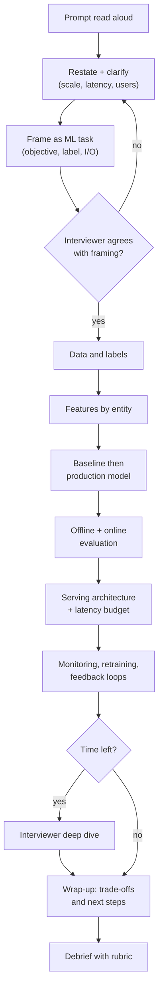
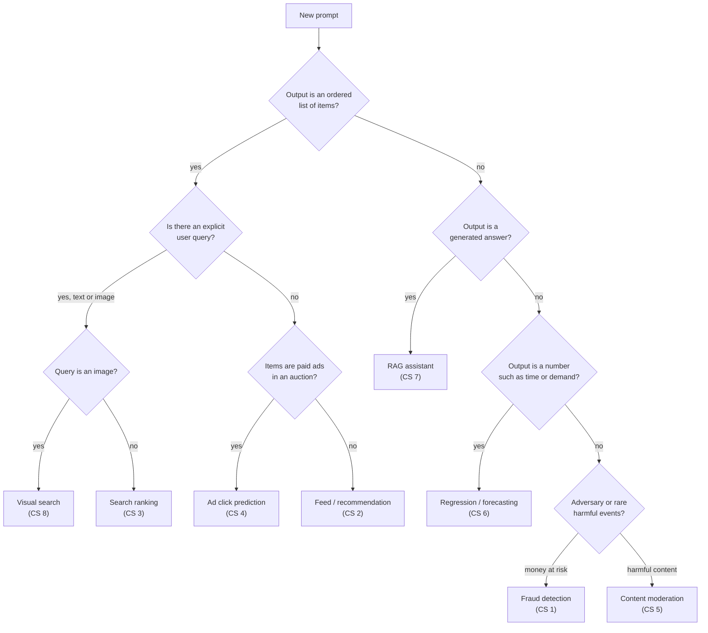

# ML System Design Mock Interview Bank

> **Purpose.** The ML system design interview is a skill, and skills are built by repetition under
> realistic conditions. This bank gives you **24 prompts** across eight domains, each with the
> clarifying questions a strong candidate asks, the core ML framing, the points an interviewer expects
> to hear, the traps that sink candidates, and follow-up probes. Three prompts include a **sample
> transcript** of a strong answer.

**Prerequisites:** [M10 framework](../system-design/10-ml-system-design-framework.md),
[M11 infrastructure](../system-design/11-data-and-training-infrastructure.md),
[M12 serving & monitoring](../system-design/12-serving-monitoring-experimentation.md), and at least
two [case studies](../case-studies/). **Grading:** [ML system design rubric](ml-system-design-rubric.md).

## Contents

1. [How to run a mock interview](#1-how-to-run-a-mock-interview)
2. [Which archetype is this prompt?](#2-which-archetype-is-this-prompt)
3. [Prompt bank](#3-prompt-bank) — [RecSys](#31-recommendation-systems) · [Search](#32-search-and-information-retrieval) ·
   [Ads](#33-ads-and-marketplaces) · [Trust & safety](#34-trust-and-safety) · [Forecasting](#35-forecasting-and-regression) ·
   [NLP/LLM](#36-nlp-and-llm-systems) · [Vision](#37-computer-vision) · [Maps/logistics](#38-maps-and-logistics)
4. [Sample transcripts](#4-sample-transcripts)
5. [Universal follow-up probes](#5-universal-follow-up-probes)

---

## 1. How to run a mock interview

### 1.1 Roles

Every mock uses **three people**, rotating roles so that each student plays every role at least twice
during Weeks 14–15.

| Role | Responsibilities | Common mistakes to avoid |
|---|---|---|
| **Interviewer** | Reads the prompt verbatim; answers clarifying questions with realistic constraints (invent them consistently and write them down); keeps time; pushes with follow-up probes; never teaches during the interview. | Over-helping; accepting vague answers ("we'd use a neural net"); not pushing on trade-offs. |
| **Candidate** | Drives the conversation using the [framework](../system-design/10-ml-system-design-framework.md); thinks out loud; draws diagrams; states assumptions; checks in with the interviewer. | Silence; jumping to models; monologuing for 10 minutes without a check-in. |
| **Observer** | Silently scores using the [rubric scoring sheet](ml-system-design-rubric.md#4-scoring-sheet-template), timestamps key moments, notes exact quotes for feedback. | Joining the discussion; writing only generic feedback ("good job"). |

### 1.2 The 45-minute clock

| Minutes | Phase | What "good" looks like |
|---|---|---|
| 0–2 | Prompt | Interviewer reads the prompt; candidate repeats it in their own words. |
| 2–8 | Clarify & frame | Business goal, users, scale, latency, constraints → ML objective, label, inputs/outputs. Candidate writes the agreed requirements down. |
| 8–15 | Data & features | Data sources, label generation, bias in labels, sampling, a feature table grouped by entity (user / item / context / cross). |
| 15–25 | Modeling | Heuristic baseline → first ML model → production model; multi-stage if needed; loss and training data. |
| 25–32 | Evaluation | Offline metrics tied to the business goal; online A/B design; guardrails. |
| 32–40 | Serving & monitoring | Architecture diagram, latency budget, scaling, monitoring, retraining, feedback loops. |
| 40–45 | Deep dive / wrap-up | Interviewer probes one area deeply; candidate summarizes trade-offs and next steps. |
| +10 | Debrief | Observer gives scores and quotes; candidate self-assesses first; interviewer adds. |

### 1.3 The interview flow



### 1.4 Rules for the interviewer

1. **Have a hidden "fact sheet"** before starting: DAU, QPS, latency budget, label availability, and
   one twist (e.g. "labels arrive 30 days late", "the catalogue changes hourly"). Reveal facts only when asked.
2. **Probe at least three times** with the follow-up probes listed for the prompt. A candidate who is never
   pushed cannot be distinguished from one who memorized a template.
3. If the candidate is stuck for more than 60 seconds, give one **neutral nudge** ("How would you get labels
   for this?") and note it on the sheet — needing nudges is evidence for the rubric.
4. Stop at 45:00 exactly. Running over hides time-management problems.

### 1.5 Rules for the candidate

- Say your **plan** in the first two minutes ("I'll clarify, frame, then go data → model → eval → serving").
- Every time you make a choice, name **one alternative and why you rejected it**.
- **Numbers beat adjectives**: "100M items, p99 under 200 ms" rather than "lots of items, fast".
- Check in every ~8 minutes: "Is there an area you'd like me to go deeper on?"

---

## 2. Which archetype is this prompt?

Almost every ML design prompt is one of six archetypes. Identifying the archetype in the first minute tells
you the default framing, metrics, and architecture — and which [case study](../case-studies/) to reuse.



| Archetype | Case study | Default framing | Signature trade-off |
|---|---|---|---|
| Feed / recommendation | [CS 2](../case-studies/02-news-feed-recommendation.md) | Multi-stage retrieval + multi-task ranking | Engagement vs long-term value; exploration |
| Search ranking | [CS 3](../case-studies/03-search-ranking.md) | Query understanding + retrieval + LTR | Relevance vs freshness/personalization |
| Ads | [CS 4](../case-studies/04-ad-click-prediction.md) | Calibrated pCTR/pCVR × bid | Calibration; revenue vs user experience |
| Fraud / abuse | [CS 1](../case-studies/01-fraud-detection.md) | Rare-event classification + rules + review | Precision vs recall under label delay |
| Content moderation | [CS 5](../case-studies/05-content-moderation.md) | Multi-label, multimodal classification + human review | Over- vs under-enforcement; policy changes |
| Regression / ETA | [CS 6](../case-studies/06-eta-prediction.md) | Regression with uncertainty | Accuracy vs bias direction (under- vs over-estimate) |
| RAG / LLM | [CS 7](../case-studies/07-rag-assistant.md) | Retrieval + generation + guardrails | Groundedness vs helpfulness; cost/latency |
| Visual search | [CS 8](../case-studies/08-visual-search.md) | Embedding learning + ANN | Recall vs index cost; freshness of index |

---

## 3. Prompt bank

Each prompt follows the same structure. Difficulty: ★ (first mock) · ★★ (standard) · ★★★ (senior-level twist).

| # | Prompt | Domain | Archetype | ★ |
|---|---|---|---|---|
| P1 | Video home feed | RecSys | Feed | ★★ |
| P2 | "People you may know" | RecSys | Feed (graph) | ★★ |
| P3 | Music playlist continuation | RecSys | Feed (sequence) | ★★★ |
| P4 | E-commerce product search | Search | Search | ★★ |
| P5 | Query autocomplete | Search | Search | ★ |
| P6 | Job–candidate matching | Search | Search (two-sided) | ★★★ |
| P7 | Ad click-through prediction | Ads | Ads | ★★ |
| P8 | Sponsored products in a marketplace | Ads | Ads | ★★★ |
| P9 | Promotion/coupon targeting | Ads | Uplift | ★★★ |
| P10 | Payment fraud detection | T&S | Fraud | ★★ |
| P11 | Harmful content moderation | T&S | Moderation | ★★ |
| P12 | Fake account detection | T&S | Fraud (graph) | ★★★ |
| P13 | Food delivery ETA | Forecasting | Regression | ★★ |
| P14 | Grocery demand forecasting | Forecasting | Regression | ★★ |
| P15 | Dynamic pricing for rides | Forecasting | Regression + control | ★★★ |
| P16 | Customer-support RAG assistant | NLP/LLM | RAG | ★★ |
| P17 | Email smart reply | NLP/LLM | Generation | ★ |
| P18 | Support ticket routing | NLP/LLM | Classification | ★ |
| P19 | Visual product search | Vision | Visual search | ★★ |
| P20 | Manufacturing defect detection | Vision | Classification | ★ |
| P21 | Photo auto-tagging and dedup | Vision | Embeddings | ★★ |
| P22 | Ride–driver matching | Maps | Optimization + ML | ★★★ |
| P23 | Map point-of-interest correction | Maps | Classification | ★★ |
| P24 | Delivery route time-window prediction | Maps | Regression | ★★ |

---

### 3.1 Recommendation systems

#### P1 — Video home feed ★★

> "Design the home-page recommendation system for a video-sharing platform with 500M daily active users."

- **Clarifying questions:** What is success — clicks, watch time, satisfaction, retention? Logged-in only,
  or also anonymous? Catalogue size and upload rate (fresh videos matter)? Latency budget for the page?
  Short-form or long-form? Any creator-side goals (fairness to new creators)?
- **Key ML framing:** Multi-stage ranking. Retrieval (two-tower + co-watch + subscriptions + trending) →
  multi-task ranker predicting $p(\text{click})$, $E[\text{watch time}]$, $p(\text{like})$, $p(\text{dislike})$ →
  value model $\text{score} = \sum_k w_k \hat y_k$ → re-ranking for diversity and policy.
- **Must-mention:** watch time over clicks (clickbait); implicit-feedback labels and their bias; candidate
  generation from multiple sources; negative sampling for retrieval; position bias; freshness / cold-start for
  new uploads; A/B on long-term metrics with guardrails; ANN index refresh cadence.
- **Common traps:** one giant model scoring the whole catalogue; optimizing CTR only; random train/test split
  over time; ignoring that the model creates its own training data.
- **Follow-up probes:**
  1. "Watch time went up but daily active users went down in the A/B test. What do you do?"
  2. "How do you give a brand-new video from a small creator a fair chance?"
  3. "Your ranker needs 30 ms per 100 candidates on CPU; the page budget is 150 ms. Walk me through the latency budget."
- **Maps to:** [CS 2 News feed](../case-studies/02-news-feed-recommendation.md), [M09](../modules/09-recommendation-and-ranking.md). Full transcript in [§4.1](#41-transcript-a--video-home-feed-p1).

#### P2 — "People you may know" ★★

> "Design the friend-suggestion feature for a social network."

- **Clarifying questions:** Objective — sent requests, *accepted* requests, or downstream engagement between
  the new friends? Graph size (nodes/edges)? Privacy constraints (contacts upload, location)? How often are
  suggestions refreshed?
- **Key ML framing:** Link prediction. Candidate generation by graph walks (friends-of-friends, shared groups,
  schools) → binary classifier for $p(\text{request sent and accepted})$ → ranking.
- **Must-mention:** label = accepted connection (sent-but-ignored is a weak negative); graph features (mutual
  friend count, Adamic–Adar), embeddings (node2vec/GNN); batch precomputation is acceptable (daily), with
  incremental updates after new connections; asymmetric harm (suggesting an abuser or an ex).
- **Common traps:** scoring all $N^2$ pairs; ignoring privacy-sensitive signals; evaluating with random edge
  splits that leak via triangle closure (split by time instead).
- **Follow-up probes:**
  1. "How do you evaluate offline when acceptance depends on what was shown?"
  2. "A user complains we suggested their therapist. What signals do you remove or guard?"
  3. "How do you handle a brand-new user with zero connections?"
- **Maps to:** [CS 2](../case-studies/02-news-feed-recommendation.md), [M09](../modules/09-recommendation-and-ranking.md).

#### P3 — Music playlist continuation ★★★

> "Users build playlists. Design a system that suggests the next tracks to add."

- **Clarifying questions:** Is the playlist the only context (no user history)? Catalogue size (~100M tracks)?
  Are suggestions shown while editing (interactive latency)? Do we care about artist diversity and new releases?
- **Key ML framing:** Sequence / set-based recommendation: the playlist is a "query" made of tracks. Retrieval
  via track embeddings (co-occurrence in playlists, audio embeddings for cold tracks) + a sequence model
  (transformer over the playlist) for ranking.
- **Must-mention:** self-supervised labels (hold out the last tracks of existing playlists); audio/content
  features to solve cold-start for new releases; coherence (tempo, genre) vs discovery; popularity bias.
- **Common traps:** treating it as user-level CF only; ignoring order; evaluating only on head tracks.
- **Follow-up probes:**
  1. "How do you recommend a song released an hour ago?"
  2. "Offline recall@50 looks great but users skip suggestions. What could be wrong?"
  3. "How would you control the mix of familiar vs new artists?"
- **Maps to:** [CS 2](../case-studies/02-news-feed-recommendation.md), [CS 8](../case-studies/08-visual-search.md) (embeddings + ANN), [M08](../modules/08-embeddings-and-transformers.md).

---

### 3.2 Search and information retrieval

#### P4 — E-commerce product search ★★

> "Design the search ranking system for an online store with 50M products."

- **Clarifying questions:** Business metric — conversion, GMV, revenue per search? Query volume and latency
  (p99 < 200 ms)? Are there sponsored results in the same list? Languages? Is personalization desired?
- **Key ML framing:** Query understanding (spell correction, category classification) → hybrid retrieval
  (BM25 + dense embeddings) → learning-to-rank (GBDT LambdaMART or neural) on ~1,000 candidates → business re-rank.
- **Must-mention:** labels from clicks/add-to-cart/purchase with graded relevance; position bias correction;
  human relevance judgments for an evaluation set; NDCG@10 offline, conversion online; null/low-result queries;
  head vs tail queries behave differently.
- **Common traps:** using only clicks as relevance; ignoring out-of-stock items; dense retrieval only (fails on
  exact SKUs and model numbers).
- **Follow-up probes:**
  1. "Your new ranker wins on NDCG but loses on revenue. Explain possible causes."
  2. "How do you handle the query 'iphone 15 case' vs 'iphone 15'?"
  3. "How fresh must the index be when a price changes?"
- **Maps to:** [CS 3 Search ranking](../case-studies/03-search-ranking.md).

#### P5 — Query autocomplete ★

> "Design query autocomplete for a search engine."

- **Clarifying questions:** Latency per keystroke (< 50 ms)? Personalized? Languages? Policy on offensive completions?
- **Key ML framing:** Candidate generation from a prefix trie of popular past queries → lightweight ranker
  (popularity, recency, personalization, context) → safety filter. Optionally a small language model for tail prefixes.
- **Must-mention:** extreme latency budget → precomputed top-k per prefix, edge caching; trending queries
  (streaming counts); blocklist + classifier for harmful completions; metric = keystrokes saved, acceptance rate.
- **Common traps:** calling a large LLM on every keystroke; no safety layer; not handling typos.
- **Follow-up probes:**
  1. "A breaking news event happens — how fast do suggestions update?"
  2. "How do you stop autocomplete from suggesting defamatory phrases about a person?"
  3. "What would you cache, and where?"
- **Maps to:** [CS 3](../case-studies/03-search-ranking.md), [M12](../system-design/12-serving-monitoring-experimentation.md).

#### P6 — Job–candidate matching ★★★

> "Design a system that recommends jobs to job seekers and candidates to recruiters."

- **Clarifying questions:** Which side is primary? Success = applications, recruiter replies, hires? Legal
  constraints (protected attributes, explainability)? Job freshness (postings expire)?
- **Key ML framing:** Two-sided marketplace matching. Retrieval by embeddings of resume/job text + structured
  filters (location, seniority) → ranker for $p(\text{apply}) \times p(\text{recruiter responds} \mid \text{apply})$.
- **Must-mention:** mutual-interest objective (avoid flooding popular jobs); congestion / capacity constraints;
  fairness auditing across groups; delayed and sparse hire labels → use intermediate labels; never use protected attributes or close proxies.
- **Common traps:** optimizing applications only (popular jobs get 1,000 applicants, others none); ignoring legal constraints.
- **Follow-up probes:**
  1. "How do you detect and mitigate bias against a demographic group?"
  2. "The hire label arrives months later. What do you train on?"
  3. "How do you avoid sending every strong candidate to the same five jobs?"
- **Maps to:** [CS 3](../case-studies/03-search-ranking.md), [CS 2](../case-studies/02-news-feed-recommendation.md).

---

### 3.3 Ads and marketplaces

#### P7 — Ad click-through prediction ★★

> "Design the system that predicts click-through rate for ads shown in a social feed."

- **Clarifying questions:** Pricing model (CPC, CPM, oCPM)? Auction type? Scale (impressions/day, QPS)?
  Latency per request? How quickly do new ads/campaigns appear?
- **Key ML framing:** Binary classification $p(\text{click} \mid \text{user, ad, context})$, **calibrated**, used
  in the auction as $\text{bid} \times \text{pCTR}$ (expected value). Model: logistic regression with hashed
  crosses → DLRM/DeepFM-style deep model with embeddings.
- **Must-mention:** calibration (log-loss / normalized entropy, calibration plots), negative downsampling and
  re-calibration, online/continual training (hourly), feature hashing for huge cardinality, cold-start for new
  ads (smoothed CTR priors), delayed conversions, privacy.
- **Common traps:** evaluating by AUC only; forgetting downsampling distorts probabilities; ignoring advertiser
  and user sides of the marketplace.
- **Follow-up probes:**
  1. "You downsampled negatives at 1%. Show me how to correct the predicted probability."
  2. "AUC improved but revenue dropped. Why?"
  3. "How do you train when conversions arrive up to 7 days after the click?"
- **Maps to:** [CS 4 Ad click prediction](../case-studies/04-ad-click-prediction.md).

#### P8 — Sponsored products in a marketplace ★★★

> "Design how sponsored products are selected and placed within search results on a marketplace."

- **Clarifying questions:** How many ad slots and where? Must ads be relevant to the query (minimum relevance)?
  Pricing (CPC, second price)? Goals — ad revenue vs organic conversion?
- **Key ML framing:** Relevance model (shared with organic search) + pCTR/pCVR models → auction ranking by
  $\text{bid} \times \text{pCTR} \times \text{quality}$ → whole-page allocation with organic results.
- **Must-mention:** relevance threshold as a guardrail; cannibalization of organic purchases (measure incremental
  revenue); calibration across ad and organic; budget pacing; A/B design that holds marketplace effects in mind.
- **Common traps:** maximizing ad revenue with no user-experience guardrail; independent optimization of ads and organic.
- **Follow-up probes:**
  1. "How do you measure whether ads cannibalize organic sales?"
  2. "Advertisers complain about spending budgets too early in the day. What is happening?"
  3. "How do the ad model and the organic model share features without leaking?"
- **Maps to:** [CS 4](../case-studies/04-ad-click-prediction.md), [CS 3](../case-studies/03-search-ranking.md).

#### P9 — Promotion / coupon targeting ★★★

> "We have a budget for discount coupons. Design a system deciding which users get one."

- **Clarifying questions:** Objective — incremental purchases or revenue net of discount cost? Budget size?
  Do we have historical randomized coupon experiments?
- **Key ML framing:** **Uplift modelling** (causal): estimate $\tau(x) = E[Y \mid x, T=1] - E[Y \mid x, T=0]$ and
  target users with the highest uplift per unit cost — not the highest purchase probability.
- **Must-mention:** need for randomized data (treatment/control); T-learner / X-learner / uplift trees; Qini
  curve evaluation; "sure things" and "sleeping dogs"; budget-constrained allocation.
- **Common traps:** predicting $p(\text{purchase})$ and giving coupons to people who would buy anyway.
- **Follow-up probes:**
  1. "How do you evaluate an uplift model when you never observe both outcomes for one user?"
  2. "There is no randomized history. What do you do first?"
  3. "How do you prevent users learning to wait for coupons?"
- **Maps to:** [CS 4](../case-studies/04-ad-click-prediction.md), [M12 experimentation](../system-design/12-serving-monitoring-experimentation.md).

---

### 3.4 Trust and safety

#### P10 — Payment fraud detection ★★

> "Design a real-time fraud detection system for card payments at a payment processor."

- **Clarifying questions:** Decision at authorization time (synchronous)? Latency budget (~100 ms)? Fraud rate?
  Cost of a missed fraud vs a declined good customer? Label source and delay (chargebacks)? Actions available
  (approve / decline / step-up authentication / review)?
- **Key ML framing:** Rare-event binary classification with **cost-sensitive thresholds** and multiple actions.
  GBDT on tabular + velocity features, rules layer, human review queue.
- **Must-mention:** label delay (chargebacks up to 60–90 days); streaming velocity features; point-in-time
  correct training data; time-based validation; PR-AUC and dollar-weighted recall at a fixed decline rate;
  adversarial drift; feedback loop (declined transactions have no label → hold-out/exploration).
- **Common traps:** accuracy; random split; forgetting that blocked transactions produce no labels.
- **Follow-up probes:**
  1. "Declined transactions never get a chargeback label. How does that bias your next model?"
  2. "A new card-testing attack appears on Friday night. What catches it before retraining?"
  3. "How do you set the threshold?"
- **Maps to:** [CS 1 Fraud detection](../case-studies/01-fraud-detection.md). Full transcript in [§4.2](#42-transcript-b--payment-fraud-detection-p10).

#### P11 — Harmful content moderation ★★

> "Design a system to detect and act on harmful posts (text and images) on a social platform."

- **Clarifying questions:** Which policy categories? Actions (remove, downrank, label, send to review)? Volume
  (posts/day)? Human reviewer capacity? Pre-publication or post-publication? Languages?
- **Key ML framing:** Multi-label, multimodal classification; per-category thresholds; **three bands** (auto-action
  / human review / allow); prioritization of the review queue by predicted harm × expected reach.
- **Must-mention:** policy ↔ label definitions and inter-annotator agreement; class imbalance; precision at the
  auto-action threshold; adversarial evasion (text in images, leetspeak); appeals as a label source; prevalence
  as the online metric (sampled human audit); fairness across dialects.
- **Common traps:** one binary "bad" classifier; no human in the loop; measuring only reports.
- **Follow-up probes:**
  1. "The policy for one category changes tomorrow. What happens to your labels and models?"
  2. "How do you measure how much harmful content you are missing?"
  3. "Reviewers can handle 50k items/day; the model flags 400k. What do you do?"
- **Maps to:** [CS 5 Content moderation](../case-studies/05-content-moderation.md).

#### P12 — Fake account detection ★★★

> "Design a system to detect fake and spam accounts at sign-up and over their lifetime."

- **Clarifying questions:** Actions (block sign-up, challenge with CAPTCHA/phone, restrict, ban)? Cost of
  false positives (real users locked out)? Available signals (device, IP, behaviour, graph)?
- **Key ML framing:** Two models at different times: **sign-up** (thin features, low latency) and
  **behavioural** (activity sequences, graph). Clustering/graph methods to catch coordinated rings.
- **Must-mention:** adversaries probe the system → keep thresholds/features hidden, use friction instead of hard
  blocks for borderline cases; graph features (shared devices/IPs); labels from bans, appeals, honeypots; ring detection.
- **Common traps:** per-account only (missing coordinated networks); evaluating on old attack types only.
- **Follow-up probes:**
  1. "Attackers start creating accounts slowly to look human. What changes?"
  2. "How do you avoid locking out users in countries with shared IPs (carrier NAT)?"
  3. "What is your labelling strategy when bans are themselves model-driven?"
- **Maps to:** [CS 1](../case-studies/01-fraud-detection.md), [M06 anomaly detection](../modules/06-unsupervised-learning.md).

---

### 3.5 Forecasting and regression

#### P13 — Food delivery ETA ★★

> "Design the system that predicts delivery time shown to customers when they order food."

- **Clarifying questions:** Shown pre-order and updated live? Cost asymmetry — is late worse than early?
  Components (restaurant prep, courier assignment, travel)? Latency? Cities?
- **Key ML framing:** Regression; decompose into prep time + pickup wait + travel time, or predict end-to-end
  with component features. Predict quantiles to show a range.
- **Must-mention:** label = actual delivery time; real-time features (restaurant load, courier supply, traffic);
  asymmetric loss / quantile loss; MAE and % within ±5 min; calibration of intervals; feedback (the ETA shown
  influences behaviour).
- **Common traps:** using the previously displayed ETA as the label; RMSE only; ignoring live updates.
- **Follow-up probes:**
  1. "Business says late deliveries hurt 3× more than early. How does the loss change?"
  2. "A stadium event creates unusual demand. How does the model react?"
  3. "How do you evaluate per city with very different volumes?"
- **Maps to:** [CS 6 ETA prediction](../case-studies/06-eta-prediction.md).

#### P14 — Grocery demand forecasting ★★

> "Forecast daily demand for every product in every store of a grocery chain to drive ordering."

- **Clarifying questions:** Horizon (1–14 days)? Number of series (store × SKU ≈ 10M)? Cost of overstock
  (waste, perishables) vs stockout? Promotions/holidays known in advance?
- **Key ML framing:** Global model across many series (GBDT with lag/rolling features, or a deep forecaster)
  predicting quantiles that feed an inventory policy.
- **Must-mention:** censored demand (sales ≠ demand when out of stock); rolling-origin backtests; hierarchical
  consistency; promotions/holidays as known-future features; metrics (WAPE, pinball loss) linked to waste and stockouts.
- **Common traps:** random cross-validation; per-series ARIMA for 10M series; ignoring stockout censoring.
- **Follow-up probes:**
  1. "How do you forecast a product launched last week?"
  2. "During a stockout, sales were zero — what label do you use?"
  3. "Why predict quantiles rather than the mean?"
- **Maps to:** [CS 6](../case-studies/06-eta-prediction.md), [M04](../modules/04-evaluation-and-data.md).

#### P15 — Dynamic pricing for rides ★★★

> "Design the surge-pricing system for a ride-hailing platform."

- **Clarifying questions:** Objective — completed trips, revenue, reliability (wait time)? Regulatory price
  caps? Geographic granularity (hexagons) and update frequency (every minute)?
- **Key ML framing:** Forecast short-term demand and supply per cell + estimate price elasticity → a control/
  optimization layer that sets multipliers to balance the market. ML predicts; policy decides.
- **Must-mention:** causal estimation of elasticity (price is endogenous — needs experiments); switchback
  experiments (user-level A/B breaks because of marketplace interference); fairness and price caps; stability (no oscillation).
- **Common traps:** user-level A/B tests in a two-sided market; predicting price directly from history.
- **Follow-up probes:**
  1. "Why would a user-level A/B test give a biased result here?"
  2. "How do you prevent drivers from gaming surge zones?"
  3. "What happens to the model during a city-wide outage of public transport?"
- **Maps to:** [CS 6](../case-studies/06-eta-prediction.md), [M12](../system-design/12-serving-monitoring-experimentation.md).

---

### 3.6 NLP and LLM systems

#### P16 — Customer-support RAG assistant ★★

> "Design an assistant that answers customer questions using our help-center articles and past tickets."

- **Clarifying questions:** Customer-facing or agent-assist? Corpus size and update rate? Must answers cite
  sources? Allowed to take actions (refunds)? Languages? Latency and cost budget per answer? Escalation path?
- **Key ML framing:** Retrieval-augmented generation: query rewriting → hybrid retrieval → re-ranker → LLM with
  grounded prompt and citations → guardrails (groundedness, PII, policy) → answer or escalate.
- **Must-mention:** chunking strategy; embedding + BM25 hybrid; evaluation set of real questions with reference
  answers; metrics: retrieval recall@k, answer faithfulness, resolution/deflection rate, escalation rate; LLM-as-judge
  calibrated against humans; prompt-injection risk from retrieved content; caching; cost per query.
- **Common traps:** fine-tuning the LLM on docs instead of retrieval (stale, no citations); no evaluation set;
  ignoring access control on documents.
- **Follow-up probes:**
  1. "How do you know the assistant is not making up a refund policy?"
  2. "A help article is updated. How quickly is the answer updated?"
  3. "Cost is 3× the budget. What do you change first?"
- **Maps to:** [CS 7 RAG assistant](../case-studies/07-rag-assistant.md). Full transcript in [§4.3](#43-transcript-c--customer-support-rag-assistant-p16).

#### P17 — Email smart reply ★

> "Suggest three short replies to an incoming email."

- **Clarifying questions:** On-device or server? Languages? Privacy constraints? Latency (suggestions must be ready when the email opens)?
- **Key ML framing:** Response selection from a curated set of ~20k replies (dual-encoder retrieval) is safer
  and cheaper than free generation; optionally a small generative model with a filter.
- **Must-mention:** privacy (no training on raw content without consent, differential privacy/federated options);
  diversity of the 3 suggestions (not "Thanks!", "Thanks!!", "Thank you"); triggering model (only suggest when appropriate);
  metric = suggestion usage rate.
- **Common traps:** free-form generation with no safety filter; three near-duplicate suggestions.
- **Follow-up probes:**
  1. "How do you decide not to show suggestions at all?"
  2. "How do you avoid suggesting an inappropriate reply to a condolence email?"
  3. "How would you personalize to a user's tone?"
- **Maps to:** [CS 7](../case-studies/07-rag-assistant.md), [M08](../modules/08-embeddings-and-transformers.md).

#### P18 — Support ticket routing ★

> "Route incoming support tickets to the right team and priority."

- **Clarifying questions:** Number of teams/classes? Do labels exist (historical routing, with re-routes)? Cost of mis-routing?
- **Key ML framing:** Multi-class text classification + priority regression/classification; confidence threshold
  with fallback to a human triage queue.
- **Must-mention:** noisy labels (first assignment may be wrong — use the *final* team); class imbalance; a
  fine-tuned small transformer vs TF-IDF + logistic regression baseline; taxonomy changes; per-class precision.
- **Common traps:** using initial assignment as ground truth; no "unsure" path.
- **Follow-up probes:**
  1. "A new product launches with a new support team. How do you handle the new class?"
  2. "Would you use an LLM zero-shot here? When?"
  3. "What would you monitor weekly?"
- **Maps to:** [M08](../modules/08-embeddings-and-transformers.md), [CS 5](../case-studies/05-content-moderation.md).

---

### 3.7 Computer vision

#### P19 — Visual product search ★★

> "A user takes a photo of a product; return visually similar items from our catalogue."

- **Clarifying questions:** Catalogue size (10M–1B images)? Exact match vs similar style? Latency? Mobile upload constraints?
- **Key ML framing:** Object detection/cropping → embedding model trained with metric learning (contrastive/
  triplet) → ANN index (HNSW/IVF-PQ) → re-ranking with metadata and availability.
- **Must-mention:** domain gap (user photos vs studio catalogue images) and training pairs that bridge it;
  recall@k offline; index build/refresh; memory of the index (quantization); filtering out-of-stock items.
- **Common traps:** using an ImageNet classifier's logits as embeddings without adaptation; brute-force search at scale.
- **Follow-up probes:**
  1. "How large is your index in memory for 500M items with 256-d float vectors? How do you shrink it?"
  2. "How do you get training pairs of street photos and catalogue photos?"
  3. "New items are added every minute. How do they get into the index?"
- **Maps to:** [CS 8 Visual search](../case-studies/08-visual-search.md).

#### P20 — Manufacturing defect detection ★

> "Detect defective parts on a production line from camera images."

- **Clarifying questions:** Line speed (images/sec)? Defect rate? Cost of a missed defect vs false rejection?
  Edge or cloud inference? Number of defect types and new ones over time?
- **Key ML framing:** Image classification or segmentation with transfer learning; with very few defect examples,
  anomaly detection (train on good parts only).
- **Must-mention:** extreme imbalance; recall-first threshold with human re-inspection; edge deployment
  (quantized model, < 50 ms); lighting/camera drift; data collection protocol avoiding shortcuts (background, mat colour).
- **Common traps:** random split with near-duplicate frames (leakage); ignoring camera changes.
- **Follow-up probes:**
  1. "A new defect type appears. How does the system notice?"
  2. "Consecutive frames are near-identical. How do you split data?"
  3. "The camera is replaced with a new model. What do you do before go-live?"
- **Maps to:** [M07](../modules/07-neural-networks.md), [M06](../modules/06-unsupervised-learning.md).

#### P21 — Photo auto-tagging and near-duplicate detection ★★

> "In a photo storage app, automatically tag photos (beach, dog, receipt) and group near-duplicates."

- **Clarifying questions:** On-device vs cloud (privacy)? Fixed tag vocabulary or open? Billions of photos?
- **Key ML framing:** Multi-label classification (or zero-shot with an image–text embedding model) + embedding-based
  near-duplicate clustering (perceptual hashes + embeddings + threshold).
- **Must-mention:** privacy, on-device inference; sensitive tags policy; per-tag thresholds; backfill cost for
  billions of existing photos; evaluation of dedup precision (deleting is irreversible → suggest, don't auto-delete).
- **Common traps:** single-label softmax for a multi-label problem; auto-deleting duplicates.
- **Follow-up probes:**
  1. "How would you add a new tag without retraining?"
  2. "How do you compute the backfill for 10B photos cost-effectively?"
  3. "What threshold do you choose for 'duplicate' and how?"
- **Maps to:** [CS 8](../case-studies/08-visual-search.md), [M08](../modules/08-embeddings-and-transformers.md).

---

### 3.8 Maps and logistics

#### P22 — Ride–driver matching ★★★

> "Design the system that assigns drivers to ride requests."

- **Clarifying questions:** Objective — minimize rider wait, maximize completed trips, driver earnings? Batch
  matching window (e.g. 2 s) or greedy? Scale per city?
- **Key ML framing:** ML predicts inputs to an optimizer: ETA to pickup, $p(\text{driver accepts})$, $p(\text{rider cancels})$;
  a bipartite matching solver (Hungarian / min-cost flow) maximizes expected value per batch.
- **Must-mention:** separation of prediction and optimization; batched matching vs greedy; switchback
  experiments due to interference; real-time features (driver location, traffic); fairness for drivers.
- **Common traps:** "train a model that outputs the driver ID"; user-level A/B tests.
- **Follow-up probes:**
  1. "Why might greedy nearest-driver be worse than batched matching?"
  2. "How do you A/B test a new matching algorithm?"
  3. "What fails if the ETA model is biased low in rain?"
- **Maps to:** [CS 6](../case-studies/06-eta-prediction.md), [M12](../system-design/12-serving-monitoring-experimentation.md).

#### P23 — Map point-of-interest (POI) correction ★★

> "Detect places on the map that have closed, moved, or have wrong opening hours."

- **Clarifying questions:** Signals available (user reports, visit traffic, web data, street imagery)? Action —
  auto-update vs send to an operator? Global scale (100M POIs)?
- **Key ML framing:** Per-POI classification ($p(\text{closed})$, $p(\text{hours wrong})$) from multiple weak signals;
  prioritization for human verification; automated updates only at high precision.
- **Must-mention:** weak supervision (combining noisy sources), seasonal closures, verification as labels, regional
  differences, precision of auto-edits (a wrongly "closed" business is harmful).
- **Common traps:** treating visit drop as closure (holidays, renovation); ignoring rural sparsity.
- **Follow-up probes:**
  1. "How do you distinguish 'temporarily closed' from 'permanently closed'?"
  2. "How do you allocate a limited operator budget?"
  3. "How do you get ground-truth labels at scale?"
- **Maps to:** [CS 5](../case-studies/05-content-moderation.md) (review queues), [M04](../modules/04-evaluation-and-data.md).

#### P24 — Delivery time-window prediction ★★

> "A parcel carrier wants to tell each customer a 2-hour delivery window on the morning of delivery."

- **Clarifying questions:** Routes planned in the morning? Window width fixed? Cost of missing the window?
  Live updates during the day?
- **Key ML framing:** Predict arrival time per stop along a planned route (sequence regression) with quantiles;
  choose the window to hit a target coverage (e.g. 90%).
- **Must-mention:** errors accumulate along the route (later stops are less certain); driver deviation from planned
  order; quantile regression / conformal prediction for coverage; live re-estimation from GPS.
- **Common traps:** predicting each stop independently; point estimates without coverage guarantees.
- **Follow-up probes:**
  1. "How do you guarantee 90% of customers get the parcel inside the window?"
  2. "Drivers reorder stops. How does that affect labels?"
  3. "What would you display when uncertainty is very high?"
- **Maps to:** [CS 6](../case-studies/06-eta-prediction.md).

---

## 4. Sample transcripts

These excerpts show **what a strong answer sounds like**, not a script to memorize. Notice the patterns:
the candidate states a plan, asks for numbers, names alternatives, checks in, and quantifies trade-offs.
Annotations in *[italics]* explain why a move scores well on the [rubric](ml-system-design-rubric.md).

### 4.1 Transcript A — Video home feed (P1)

> **Interviewer:** Design the home-page recommendation system for a video platform with 500M daily active users.
>
> **Candidate:** Let me restate to make sure we agree: when a user opens the app, we show a personalized grid of
> videos, and we want to choose and order them. My plan: clarify the goal and constraints, frame it as an ML problem,
> then go through data, features, models, evaluation, and serving. Does that work?
> *[Signals structure early — Communication.]*
>
> **Interviewer:** Sounds good.
>
> **Candidate:** What is the business goal? Clicks are easy to measure but invite clickbait. Is the company
> optimizing watch time, satisfaction, or long-term retention?
>
> **Interviewer:** Leadership cares about long-term retention, but the team is measured on daily watch time.
>
> **Candidate:** Then I'll optimize a combination of short-term signals that correlate with retention — watch time and
> satisfaction (likes, survey responses) — with DAU and 7-day retention as guardrails in experiments. Scale: 500M DAU —
> how many feed loads per user per day, and what is the latency budget?
>
> **Interviewer:** Say 10 loads per day and 200 ms server-side for the whole page.
>
> **Candidate:** So 5 billion requests a day, about 58k QPS average, maybe 150k at peak. And catalogue size?
>
> **Interviewer:** Around a billion videos, with 500k new ones per hour.
>
> **Candidate:** That rules out scoring the catalogue per request, so this is a **multi-stage funnel**: retrieve a few
> thousand candidates, rank a few hundred with a heavier model, then re-rank the top for diversity and policy.
> *[Derives architecture from numbers — Problem framing, Serving.]*
>
> The ML task for the ranker: given (user, video, context), predict several outcomes — $p(\text{click})$, expected watch
> time given click, $p(\text{like})$, $p(\text{dislike or 'not interested'})$ — and combine them into one score
> $s = \hat p_{click}\cdot \hat E[\text{watch}] + \alpha\,\hat p_{like} - \beta\,\hat p_{dislike}$. The weights are a product
> decision tuned by A/B tests. I prefer multi-task over predicting watch time alone because negative feedback is a
> strong satisfaction signal that watch time misses.
>
> **Interviewer:** Why not just train one model to predict watch time directly on every impression?
>
> **Candidate:** Two reasons. Watch time on impressions is zero-inflated — most impressions aren't clicked — so
> decomposing into click and conditional watch time is easier to learn and to debug. And having separate heads lets
> us change the business trade-off by re-weighting without retraining. The cost is calibration: each head must be
> calibrated for the product of heads to be meaningful, so I'd monitor calibration per head.
> *[Answers a challenge with two reasons and a cost — Trade-offs.]*
>
> **Interviewer:** Let's talk about training data.
>
> **Candidate:** Labels come from impression logs joined with engagement events: each impression is a row, with click,
> watch seconds, like, dislike. Three biases to handle. First, **position bias** — I'll include position as a training
> feature and set it to a fixed value at serving. Second, **exposure bias** — we only observe outcomes for what the old
> model showed, so I'd reserve maybe 1% of traffic for exploration to get less biased data and to evaluate offline.
> Third, **label delay** for watch time — I'd close the label window about an hour after impression. For splits, I'd
> train on days 1 to N and evaluate on day N+1, never randomly, because user tastes and the catalogue drift.
> *[Names specific biases and fixes — Data & labels.]*
>
> **Interviewer:** And retrieval?
>
> **Candidate:** Several candidate sources in parallel, each returning a few hundred: a **two-tower model** — a user tower
> over watch history and context, a video tower over content and metadata — trained with in-batch sampled softmax, and
> served via an ANN index; subscriptions; co-watch ("people who watched X watched Y"); and a fresh-and-trending source
> so new uploads can surface. The video tower uses content features, not only an ID embedding, so a video uploaded ten
> minutes ago gets a reasonable embedding. New videos are added to the index incrementally every few minutes.
>
> **Interviewer:** Watch time went up 2% in the A/B test, but 7-day retention went down 0.3%. What do you do?
>
> **Candidate:** I wouldn't ship. Retention was declared a guardrail, so a regression blocks the launch even with a primary
> win. Then I'd diagnose: segment by user tenure and by content type — often the new model shifts toward long, binge-able
> or sensational content that boosts session time but leaves people less satisfied. I'd check dislike rates and survey
> scores in the treatment arm. Fixes could be raising $\beta$, adding a satisfaction head trained on surveys, or capping
> per-session repetition. Longer-term I'd build a proxy metric that predicts retention, validated across past experiments,
> so we can optimize toward it directly.
> *[Treats guardrails as binding; diagnosis before fix — Evaluation, Monitoring/iteration.]*

### 4.2 Transcript B — Payment fraud detection (P10)

> **Interviewer:** Design a real-time fraud detection system for card payments at a payment processor.
>
> **Candidate:** A few questions first. Is the decision made synchronously during authorization? What latency do we have?
>
> **Interviewer:** Yes, synchronous. The whole authorization must complete in 300 ms; you get 50 ms for the model.
>
> **Candidate:** What's the fraud rate and what are the costs? I want to know the price of a missed fraud versus the price
> of declining a legitimate customer.
>
> **Interviewer:** About 0.1% of transactions. Average fraud loss is around \$120. A false decline loses the merchant's
> margin and annoys the customer — call it \$15 all-in.
>
> **Candidate:** And actions — only approve or decline, or also step-up authentication like a 3-D Secure challenge?
>
> **Interviewer:** All three, plus sending to manual review for high-value transactions.
>
> **Candidate:** Great, that matters a lot. So the ML output is a calibrated probability of fraud, $p$, and a policy maps
> $p$ and the amount to an action. With these costs, if the score were calibrated, declining is worth it when
> $120\,p > 15\,(1-p)$, so $p > 15/135 \approx 0.11$ — but step-up authentication costs much less than a decline, so a
> middle band from maybe 0.03 to 0.11 gets a challenge. I'd tune those bands on validation data in dollars, not on accuracy.
> *[Converts business costs into a decision rule — Problem framing, Evaluation.]*
>
> **Interviewer:** Where do labels come from?
>
> **Candidate:** Chargebacks and confirmed fraud reports — which arrive late, up to 60–90 days. So the label is "this
> transaction was charged back as fraud within 90 days". Two consequences. First, the training window must end 90 days ago
> for complete labels; to stay fresh I'd add a second, more recent window labelled with faster signals — customer fraud
> reports and analyst decisions — weighted appropriately. Second, **declined transactions never receive labels**, since
> the money never moved. If the model declines a pattern, the next model sees no fraud for it and may learn that it's safe.
> To counter that, I'd let a tiny randomized fraction of would-be declines under a low amount through or to step-up instead,
> and use inverse-propensity weighting when training and evaluating.
> *[Identifies the selective-labels problem unprompted — strong signal for Data & labels.]*
>
> **Interviewer:** What features?
>
> **Candidate:** Grouped by entity. **Transaction:** amount, currency, merchant category, card-present or not, time of day.
> **Card / customer history:** average amount, distance from usual location, new device, account age. **Velocity**,
> computed in streaming: number of transactions on this card in the last 1, 10, 60 minutes; number of distinct merchants in
> the last hour; number of cards used on this device today. **Merchant:** historical chargeback rate, smoothed for small
> merchants. **Graph:** whether this device or email is linked to previously confirmed fraud. The velocity features are
> the most important for card-testing attacks and they need a streaming pipeline — Kafka plus a stream processor writing to
> an online key-value store — with the same definitions used to generate training data, point-in-time correct, to avoid skew.
>
> **Interviewer:** Model?
>
> **Candidate:** Start with rules that exist today as the baseline — they're also a safety net. First ML model: gradient-boosted
> trees. Tabular, heterogeneous features, missing values, fast inference — a few hundred trees score in well under 5 ms on CPU.
> I'd validate with a time-based split: train on months 1–6, validate on month 7, test on month 8, and report PR-AUC plus the
> metric the business cares about: **fraud dollars caught at a 0.5% decline rate**. Later, a sequence model over the card's
> recent transactions could add signal, but I'd only add it if it beats GBDT on that metric enough to justify the latency.
>
> **Interviewer:** A new card-testing attack appears Friday night. Your model retrains weekly. What happens?
>
> **Candidate:** Three layers. Velocity features may catch it immediately even if the pattern is new, because testing many
> small amounts quickly is visible regardless of merchant. Second, monitoring: I'd alert on shifts in score distribution and
> decline rate per merchant and BIN range, and on spikes in small-amount authorization volume. Third, the rules layer lets
> analysts deploy a targeted rule within minutes, without waiting for retraining. On Monday the confirmed cases go into the
> training data, and I'd add this attack to a regression test set so future models must keep catching it.
> *[Defense in depth, fast human-in-the-loop path — Monitoring/iteration.]*

### 4.3 Transcript C — Customer-support RAG assistant (P16)

> **Interviewer:** Design an assistant that answers customer questions using our help-center articles and past tickets.
>
> **Candidate:** Is the assistant talking directly to customers, or drafting answers for human agents?
>
> **Interviewer:** Directly to customers, in the chat widget.
>
> **Candidate:** Then a wrong answer goes straight to a customer, so I'll prioritize faithfulness and a good escalation path
> over coverage. How big is the corpus, and how often does it change?
>
> **Interviewer:** About 5,000 help articles, updated weekly, plus 2 million resolved tickets.
>
> **Candidate:** Can the assistant take actions, like issuing refunds, or only answer?
>
> **Interviewer:** Answer only, for now.
>
> **Candidate:** And success metrics — I'd propose **resolution rate without escalation**, confirmed by the customer not
> contacting support again within 72 hours, with guardrails on CSAT and on a sampled audit of answer correctness.
>
> **Interviewer:** Agreed.
>
> **Candidate:** Architecture: the user message plus conversation history goes to a **query rewriter** that produces a
> standalone search query. Then **hybrid retrieval** — BM25 for exact terms like error codes and product names, plus dense
> embeddings for paraphrases — over chunked articles, fused and passed to a **cross-encoder re-ranker** that keeps the top 5
> chunks. The LLM gets a prompt with those chunks, instructions to answer only from them, cite chunk IDs, and say "I'm not
> sure" otherwise. After generation, a **groundedness check** verifies that each claim is supported by a cited chunk; if
> not, or if the topic is sensitive like billing disputes, we escalate to a human.
> *[Every stage has a reason — Modeling, Serving.]*
>
> **Interviewer:** What about the 2 million tickets?
>
> **Candidate:** I'd be careful. Tickets contain personal data and sometimes wrong or outdated answers. I wouldn't put raw
> tickets into the retrieval index. I'd use them in three safer ways: to **build the evaluation set** — sample real
> questions with the agents' final resolutions as references; to **find gaps** — cluster frequent questions that no article
> covers and send them to the docs team; and possibly to **fine-tune the retriever** with question-to-article pairs where the
> agent linked an article.
>
> **Interviewer:** How do you evaluate before launch?
>
> **Candidate:** Two levels. **Retrieval:** recall@5 — does the right article appear in the top 5 — on about 1,000 labelled
> questions. If retrieval misses, the generator can't recover, so I fix retrieval first. **Generation:** faithfulness,
> correctness, and helpfulness scored by an LLM judge, which I'd first calibrate against human ratings on a couple of hundred
> answers to make sure it agrees. Plus a red-team set: prompt injection, requests for other customers' data, off-topic
> questions. Online, I'd start with agent-assist mode — agents see drafts — measure acceptance rate, then a gradual rollout
> to customers with an A/B test on resolution rate.
>
> **Interviewer:** Cost is three times the budget. What do you change first?
>
> **Candidate:** First measure where tokens go. Usually the prompt dominates: five long chunks per turn plus history. Options,
> in order of risk: cache answers for frequent questions — a large share of support traffic is the same 50 questions;
> shorten chunks and keep the top 3 instead of 5 if recall@3 is close; summarize long histories; route simple, high-confidence
> questions to a smaller model and keep the large model for hard ones. Each change is checked against the offline faithfulness
> set before rollout, because cost cuts that quietly reduce faithfulness are the main risk.
> *[Measure first, ordered options, explicit risk — Trade-offs.]*

---

## 5. Universal follow-up probes

Interviewers can attach these to *any* prompt to test depth.

| Area | Probe | What a strong answer includes |
|---|---|---|
| Framing | "What if we had no ML budget at all — what would you ship?" | A credible heuristic baseline and how ML improves on it |
| Labels | "Your labels are noisy. How do you know, and what do you do?" | Inter-annotator agreement, audit sample, noise-robust losses, relabelling |
| Data | "How could the training data leak information from the future?" | Point-in-time joins, time splits, label-derived features |
| Features | "Which feature would you drop if latency doubled?" | Feature cost vs importance; precompute vs real-time |
| Modeling | "Why not a large deep model from day one?" | Baseline first, data volume, latency, debuggability |
| Evaluation | "Offline improved, online flat. Why?" | Skew, metric mismatch, under-powered test, feedback loops |
| Serving | "Traffic increases 10×. What breaks first?" | Concrete bottleneck: feature store reads, ranker compute, ANN index memory |
| Monitoring | "How do you know the model is broken at 3 a.m.?" | Input/output distribution alerts, business-metric alerts, fallbacks |
| Iteration | "What is the next thing you would build after launch?" | Prioritized by expected impact and evidence |
| Responsible ML | "Who could be harmed by this system and how would you know?" | Segment metrics, fairness audits, appeals, human review |

### Debrief template (observer)

```text
Prompt: P__        Candidate: ________     Interviewer: ________     Date: ______
Time to first framing statement: __ min    Nudges needed: __
Best moment (quote):
Biggest gap (quote):
Rubric scores (see ml-system-design-rubric.md): Framing _ Data _ Features _ Modeling _ Eval _ Serving _ Monitoring _ Comms _
One thing to practise before the next mock:
```
