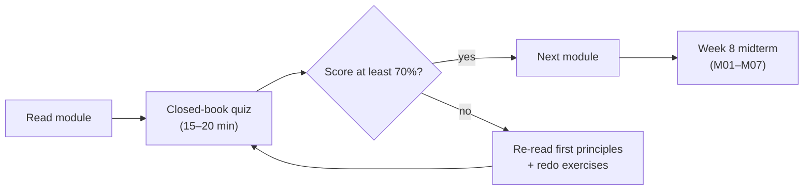
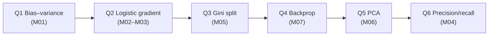
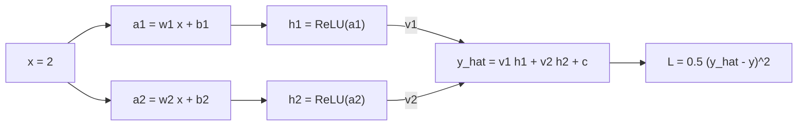

# Quiz Bank and Midterm Sample Paper

> **Purpose.** Short weekly quizzes (15–20 minutes each) that check whether the *first-principles*
> idea of each module has landed, plus a sample midterm paper with fully worked derivations.
> Every quiz mixes four question types on purpose: recall is not enough to pass an ML interview,
> so each quiz also asks you to **calculate** something by hand and to **spot a bug or a leak** in a
> realistic scenario.

**How to use this file**

- **Students:** attempt each quiz closed-book *before* opening any `
` block. A score below
  70% means: re-read the module's "First principles" section and redo its exercises.
- **Instructors:** pick 5–6 questions per week for the graded quiz (10% of the course grade, see
  [SYLLABUS](../SYLLABUS.md)); keep the rest for practice. The midterm (Week 8) covers M01–M07.

**Question-type legend:** **[MC]** multiple choice · **[SA]** short answer (2–4 sentences) ·
**[CALC]** small calculation, show your working · **[BUG]** spot the bug / leak in a scenario.

## Contents

| Quiz | Module | Topics |
|---|---|---|
| [Q01](#quiz-m01--what-is-learning) | [M01](../modules/01-ml-first-principles.md) | Generalization, bias–variance, inductive bias |
| [Q02](#quiz-m02--math-toolkit) | [M02](../modules/02-math-toolkit.md) | GD/SGD/Adam, MLE, regularization as priors |
| [Q03](#quiz-m03--linear-and-logistic-regression) | [M03](../modules/03-linear-and-logistic-regression.md) | Normal equations, sigmoid, cross-entropy |
| [Q04](#quiz-m04--evaluation-data-and-features) | [M04](../modules/04-evaluation-and-data.md) | Metrics, validation, leakage, imbalance |
| [Q05](#quiz-m05--trees-and-ensembles) | [M05](../modules/05-trees-and-ensembles.md) | Gini/entropy, bagging, boosting |
| [Q06](#quiz-m06--unsupervised-learning) | [M06](../modules/06-unsupervised-learning.md) | k-means, PCA, anomaly detection |
| [Q07](#quiz-m07--neural-networks) | [M07](../modules/07-neural-networks.md) | Backprop, activations, CNNs |
| [Q08](#quiz-m08--embeddings-and-transformers) | [M08](../modules/08-embeddings-and-transformers.md) | Embeddings, attention, transformers, LLMs |
| [Q09](#quiz-m09--recommendation-and-ranking) | [M09](../modules/09-recommendation-and-ranking.md) | CF, two-tower, learning to rank |
| [Q10](#quiz-m10--ml-system-design-framework) | [M10](../system-design/10-ml-system-design-framework.md) | Framing, requirements, estimation |
| [Q11](#quiz-m11--data-and-training-infrastructure) | [M11](../system-design/11-data-and-training-infrastructure.md) | Pipelines, feature stores, distributed training |
| [Q12](#quiz-m12--serving-monitoring-and-experimentation) | [M12](../system-design/12-serving-monitoring-experimentation.md) | Serving, drift, A/B testing |
| [Midterm](#midterm-sample-paper-parts-iii) | M01–M07 | Six long derivation / tracing questions |

---

## Quiz M01 — What is learning?

**Q1 [MC].** A model has 0.5% training error and 14% validation error. The most likely diagnosis is:

(a) high bias (b) high variance (c) irreducible noise (d) a bug in the loss function

Answer

**(b) high variance.** The large gap between training and validation error means the model has
fit idiosyncrasies of the training sample that do not transfer. Fixes: more data, regularization,
a simpler hypothesis class, early stopping, or bagging.

**Q2 [MC].** Which assumption is *required* for the standard generalization argument
("low training error + enough data ⇒ low test error")?

(a) features are Gaussian (b) training and test examples are drawn i.i.d. from the same distribution
(c) the model is linear (d) labels are balanced

Answer

**(b).** All classical generalization bounds assume train and test come from the same distribution.
Most real-world ML failures (fraud patterns shift, user tastes change) are violations of exactly
this assumption — which is why monitoring for drift exists (M12).

**Q3 [SA].** Explain in your own words why a lookup table that memorizes every training example
is a bad learner, even though it achieves zero training error.

Answer

A lookup table has no *inductive bias*: it says nothing about inputs it has not seen, and in a
high-dimensional input space almost every future input is unseen. Learning means compressing the
data into a rule that also holds on new points; memorization achieves zero training error with
zero compression, so it has no reason to generalize.

**Q4 [SA].** Give one real-world example where a hand-written rule system is preferable to ML,
and one where ML clearly wins. Justify each in one sentence.

Answer

*Rules win:* a hard legal constraint, e.g. "never ship alcohol to a region where it is banned" —
deterministic, auditable, no data needed. *ML wins:* spam filtering — the patterns are numerous,
fuzzy, and adversarially changing, so maintaining thousands of rules does not scale while a model
can be retrained on fresh labels daily.

**Q5 [CALC].** For a fixed input $x$ the true function value is $f(x)=5$ and label noise has
variance $\sigma^2=1$. You train the same model on three independent datasets and get predictions
$\hat f(x) = 2, 4, 6$. Estimate bias², variance, and expected squared error at $x$.

Answer

Mean prediction $\bar f = (2+4+6)/3 = 4$.
Bias² $= (\bar f - f)^2 = (4-5)^2 = 1$.
Variance $= \frac{1}{3}[(2-4)^2 + (4-4)^2 + (6-4)^2] = 8/3 \approx 2.67$.
Expected error $= \sigma^2 + \text{bias}^2 + \text{variance} = 1 + 1 + 2.67 \approx 4.67$.

**Q6 [MC].** Increasing the training set size (same model class) typically:

(a) reduces bias (b) reduces variance (c) reduces irreducible noise (d) reduces all three

Answer

**(b).** More samples average out the sampling fluctuations of the fitted model. Bias is a property
of the hypothesis class and noise is a property of the data-generating process; neither moves.

**Q7 [SA].** What is the difference between the *learning objective* you optimize and the
*business objective* you care about? Give an example where they diverge.

Answer

The learning objective is a differentiable proxy (e.g. log-loss of predicted click probability);
the business objective is what the company actually wants (e.g. long-term user satisfaction or
revenue). Optimizing clicks on a news feed can increase clickbait, raising the proxy while hurting
retention — the classic proxy/objective gap.

**Q8 [BUG].** A student builds a model to predict whether a patient will be readmitted to hospital.
They shuffle all records, split 80/20, and report 97% validation accuracy. Each patient has on
average 6 visits in the data. What is wrong?

Answer

**Group leakage.** Visits of the same patient appear in both train and validation, so the model
can memorize patient identity (age + diagnosis codes + hospital) rather than learn readmission
risk. Split **by patient** (group k-fold), and ideally **by time** (train on earlier admissions,
validate on later ones) to mimic deployment.

**Q9 [MC].** "No Free Lunch" implies that:

(a) deep learning is always best (b) averaged over all possible problems, no learner beats another
(c) more data never helps (d) you should always use the simplest model

Answer

**(b).** A learner only does well because its inductive bias matches the structure of the problems
we actually care about. Choosing a model is choosing an assumption about the world.

---

## Quiz M02 — Math toolkit

**Q1 [MC].** Minimizing mean squared error for linear regression is equivalent to maximum
likelihood estimation under which noise model?

(a) Laplace (b) Gaussian (c) Bernoulli (d) Poisson

Answer

**(b) Gaussian.** $-\log \prod_i \mathcal N(y_i; w^\top x_i, \sigma^2) = \frac{1}{2\sigma^2}\sum_i (y_i - w^\top x_i)^2 + \text{const}$.
Laplace noise gives mean *absolute* error; Bernoulli gives log-loss.

**Q2 [MC].** L2 regularization $\lambda \lVert w\rVert^2$ corresponds to MAP estimation with a:

(a) uniform prior (b) Gaussian prior on $w$ (c) Laplace prior on $w$ (d) Beta prior

Answer

**(b).** $-\log \mathcal N(w; 0, \tau^2 I) = \frac{1}{2\tau^2}\lVert w\rVert^2 + c$, so $\lambda = \frac{1}{2\tau^2}$
(up to the noise scale). A Laplace prior gives L1 (lasso), which produces sparse weights.

**Q3 [CALC].** Minimize $f(w) = (w-3)^2$ by gradient descent from $w_0 = 0$ with learning rate
$\eta = 0.1$. Compute $w_1$ and $w_2$. What happens with $\eta = 1.1$?

Answer

$f'(w) = 2(w-3)$.
$w_1 = 0 - 0.1 \cdot 2(0-3) = 0.6$.
$w_2 = 0.6 - 0.1 \cdot 2(0.6-3) = 0.6 + 0.48 = 1.08$.
In general $w_{t+1} - 3 = (1 - 2\eta)(w_t - 3)$. With $\eta = 1.1$, $1-2\eta = -1.2$, so the error
flips sign and grows by 20% every step: **divergence**. Convergence needs $0 < \eta < 1$ here
(in general $\eta < 2/L$ where $L$ is the curvature).

**Q4 [SA].** Why does stochastic gradient descent work at all, given that each mini-batch gradient
is "wrong"?

Answer

The mini-batch gradient is an **unbiased estimate** of the full gradient: its expectation over
random batches equals the true gradient. The noise averages out over many steps (with a decaying
or small learning rate), and each step is far cheaper than a full pass. The noise can even help
escape sharp minima and saddle points.

**Q5 [MC].** Adam differs from plain SGD with momentum mainly by:

(a) using second-order Hessian information (b) per-parameter step sizes scaled by a running
estimate of squared gradients (c) not needing a learning rate (d) being guaranteed to find the global optimum

Answer

**(b).** Adam keeps an exponential moving average of gradients (momentum, $m_t$) and of squared
gradients ($v_t$), and steps by $\eta\, \hat m_t / (\sqrt{\hat v_t} + \epsilon)$. Rarely-updated
parameters (e.g. embeddings of rare items) get relatively larger steps.

**Q6 [SA].** A coin lands heads 9 times in 10 flips. Give the MLE of $p$ and a MAP estimate with a
$\text{Beta}(2,2)$ prior. Which would you trust for a brand-new advertiser's click-through rate?

Answer

MLE $= 9/10 = 0.9$. MAP with $\text{Beta}(\alpha,\beta)$: $\frac{k + \alpha - 1}{n + \alpha + \beta - 2} = \frac{9+1}{10+2} = 10/12 \approx 0.833$.
For a new advertiser with few impressions, the **MAP / smoothed estimate** — it shrinks noisy
small-sample rates toward a prior (in practice the platform-wide CTR), which is exactly how
cold-start CTR features are smoothed in ads systems.

**Q7 [MC].** A convex loss function guarantees that:

(a) gradient descent converges in one step (b) every local minimum is a global minimum
(c) the minimum is unique (d) no regularization is needed

Answer

**(b).** Uniqueness additionally requires *strict* convexity (e.g. adding L2).

**Q8 [BUG].** A teammate standardizes features as `X = (X - X.mean()) / X.std()` **on the full
dataset**, then splits into train and test. Is this a problem, and why do people still argue it is
harmless?

Answer

It is **leakage of test-set statistics** into training. For mean/std on large i.i.d. data the
effect is small, which is why people call it harmless — but the same habit applied to target
encoding, imputation with label-dependent statistics, or time series (future values shift the
mean) causes real, sometimes large, optimism. Rule: **fit every transform on train only**, then
apply to validation/test (e.g. a scikit-learn `Pipeline`).

**Q9 [SA].** Your training loss oscillates wildly and occasionally becomes `NaN`. List three
things you check, in order.

Answer

1. **Learning rate** too high → reduce by 10×, add warm-up.
2. **Input scale / bad values**: unnormalized features, infinities, division by zero, `log(0)` in the loss (use `log(p + eps)` or logits-based loss).
3. **Exploding gradients**: log gradient norms; add gradient clipping.

---

## Quiz M03 — Linear and logistic regression

**Q1 [MC].** The closed-form solution of ordinary least squares is:

(a) $w = X^\top y$ (b) $w = (X^\top X)^{-1} X^\top y$ (c) $w = (XX^\top)^{-1} y$ (d) $w = X^{-1}y$

Answer

**(b)**, from setting $\nabla_w \lVert Xw - y\rVert^2 = 2X^\top(Xw - y) = 0$. In practice solve via
QR/Cholesky or add ridge $(X^\top X + \lambda I)^{-1}$ when $X^\top X$ is ill-conditioned.

**Q2 [SA].** Why don't we fit logistic regression by minimizing squared error on the sigmoid output?

Answer

Squared error on $\sigma(w^\top x)$ is **non-convex** in $w$ and its gradient contains the factor
$\sigma(1-\sigma)$, which vanishes when the model is confidently *wrong*, so learning stalls.
Cross-entropy (the Bernoulli negative log-likelihood) is convex and its gradient is simply
$(\sigma(z) - y)x$ — the error times the input.

**Q3 [CALC].** $w = [1, -2]$, $b = 0.5$, $x = [2, 1]$, true label $y = 1$. Compute $p = \sigma(w^\top x + b)$,
the log-loss, and the gradient with respect to $w$.

Answer

$z = 1\cdot 2 + (-2)\cdot 1 + 0.5 = 0.5$; $p = \sigma(0.5) = 1/(1+e^{-0.5}) \approx 0.622$.
Log-loss $= -\log 0.622 \approx 0.474$.
$\nabla_w = (p - y)x = (-0.378)[2, 1] = [-0.755, -0.378]$; $\partial L/\partial b = -0.378$.
A gradient step *increases* $w_1$ and $w_2$, pushing $z$ and therefore $p$ up — as it should for $y=1$.

**Q4 [MC].** In logistic regression the coefficient of feature $x_j$ equals 0.7. Holding other
features fixed, increasing $x_j$ by 1:

(a) increases the probability by 0.7 (b) multiplies the odds by $e^{0.7} \approx 2.0$
(c) increases the log-loss by 0.7 (d) multiplies the probability by 0.7

Answer

**(b).** Logistic regression is linear in **log-odds**: $\log\frac{p}{1-p} = w^\top x + b$. This
interpretability is why it is still used in credit scoring, where regulators require
explanations.

**Q5 [SA].** Why is logistic regression still a standard model for large-scale ad click prediction?

Answer

It trains on billions of sparse, hashed, crossed features with online SGD/FTRL; inference is a
sparse dot product (microseconds); outputs are naturally **calibrated probabilities**, which ad
auctions need (bid × pCTR); and it is easy to debug. Modern systems often keep it as a baseline
or as the final "wide" component of wide-and-deep models.

**Q6 [MC].** Your training data is perfectly linearly separable and you train unregularized
logistic regression. What happens?

(a) training fails to start (b) weights grow without bound (c) loss is stuck at $\log 2$ (d) the model is perfectly calibrated

Answer

**(b).** The likelihood keeps increasing as $\lVert w\rVert \to \infty$ (sigmoid gets steeper), so
no finite optimum exists. L2 regularization or early stopping restores a finite solution.

**Q7 [SA].** How do you extend logistic regression to $K > 2$ classes, and what is the gradient?

Answer

Softmax regression: $p_k = \frac{e^{z_k}}{\sum_j e^{z_j}}$ with $z_k = w_k^\top x$, trained with
categorical cross-entropy. The gradient for class $k$ is $(p_k - y_k)x$ with one-hot $y$ — the same
"prediction minus target, times input" form as the binary case.

**Q8 [BUG].** A house-price model uses features including `price_per_sqft` (computed from the sale
record) and `sqft`. It reaches $R^2 = 0.999$. What is going on?

Answer

**Target leakage.** `price_per_sqft × sqft = price`: the label is reconstructed from the features.
At prediction time (house not yet sold) `price_per_sqft` does not exist. Ask of every feature:
"is this value **available at prediction time**, computed only from information before the
prediction?"

**Q9 [MC].** Adding a feature that is an exact copy of an existing feature to OLS will:

(a) improve $R^2$ (b) make $X^\top X$ singular (c) halve the coefficients automatically (d) have no effect

Answer

**(b)** — perfect collinearity. The normal equations have infinitely many solutions; ridge
regularization picks the one that splits weight equally.

---

## Quiz M04 — Evaluation, data, and features

**Q1 [MC].** For a fraud model where 0.1% of transactions are fraud, which metric is *least*
informative?

(a) PR-AUC (b) recall at 1% false-positive rate (c) accuracy (d) precision at top-k alerts

Answer

**(c) accuracy.** Predicting "never fraud" scores 99.9%. Prefer metrics focused on the positive
class or tied to an operating point (analyst capacity, FPR budget).

**Q2 [CALC].** 1,000 transactions, 20 of them fraud. The model flags 50, of which 15 are fraud.
Compute precision, recall, F1, and accuracy. Compare with the "flag nothing" baseline.

Answer

TP = 15, FP = 35, FN = 5, TN = 945.
Precision $= 15/50 = 0.30$; recall $= 15/20 = 0.75$;
F1 $= 2 \cdot 0.30 \cdot 0.75 / (0.30 + 0.75) = 0.45/1.05 \approx 0.43$;
accuracy $= (15 + 945)/1000 = 0.96$.
"Flag nothing" has accuracy **0.98** — higher than the model — yet catches zero fraud. Accuracy
misleads under imbalance.

**Q3 [SA].** When would you choose PR-AUC over ROC-AUC?

Answer

When positives are rare and you care about the quality of the positive predictions. ROC-AUC uses
FPR $= FP/(FP+TN)$; with a huge TN count, many false positives barely move FPR, so ROC looks great.
PR-AUC uses precision, which directly exposes the false-positive burden on, e.g., fraud analysts.

**Q4 [MC].** You predict next-week product demand. The correct validation scheme is:

(a) random k-fold (b) stratified k-fold (c) time-based split / rolling-origin backtest (d) leave-one-out

Answer

**(c).** Random folds let the model train on the future and test on the past, inflating scores.
Production always predicts forward in time.

**Q5 [BUG].** A churn model uses the feature `num_support_tickets_last_30d`, computed in a nightly
batch on **today's** snapshot. Labels are "churned within the 30 days after the snapshot date
`d`", and training rows use snapshots from months ago, joined with the *current* feature table.
What is the bug?

Answer

**Point-in-time (temporal) leakage.** Joining old labels to *current* features means features
include tickets filed **after** `d` — often complaint tickets filed while churning. Features must
be computed **as of** each row's snapshot date (point-in-time correct joins, as a feature store
provides). Symptom: offline AUC much higher than online performance.

**Q6 [SA].** What is target encoding, and how do you prevent it from leaking?

Answer

Replacing a high-cardinality category (e.g. merchant ID) with the mean label for that category.
Computed naively on the same rows you train on, each row's own label leaks into its feature.
Fix: **out-of-fold** encoding (compute from other folds), smoothing toward the global mean for rare
categories, and in time-series data compute only from strictly earlier data.

**Q7 [MC].** Your offline AUC improved from 0.80 to 0.82 but the A/B test shows no change in the
business metric. The *least* likely explanation is:

(a) offline/online feature skew (b) the metric gap is too small to matter for decisions near the
operating threshold (c) the A/B test is under-powered (d) AUC is always identical to the business metric

Answer

**(d)** — it is false, which is the point. (a)–(c) are all common, and so is "the model improved
ranking in a region of scores where no decision changes".

**Q8 [SA].** Name three ways to handle a 1:1000 class imbalance and one risk of each.

Answer

1. **Downsample negatives** — fast training; probabilities become biased (re-calibrate: $p' = p / (p + (1-p)/w)$ with $w$ the negative sampling rate).
2. **Class weights** in the loss — no data loss; can make optimization noisy and also distorts calibration.
3. **Threshold tuning on a cost curve** — no retraining; requires a reliable validation set with enough positives.
(Oversampling/SMOTE is another option; risk: overfitting duplicated or synthetic minority points.)

**Q9 [MC].** A model's predicted probabilities are on average 0.3 for a segment whose true positive
rate is 0.1. This is a problem of:

(a) discrimination (b) calibration (c) variance (d) recall

Answer

**(b) calibration.** Ranking can still be perfect (high AUC) while probabilities are wrong. Fix with
Platt scaling or isotonic regression on a held-out set. Calibration matters whenever the
probability itself is used (auctions, expected-cost thresholds).

---

## Quiz M05 — Trees and ensembles

**Q1 [CALC].** A node has 10 samples: 5 positive, 5 negative. A split sends (4 pos, 1 neg) left and
(1 pos, 4 neg) right. Compute Gini impurity of parent and children and the impurity decrease.

Answer

Gini $= 1 - \sum_k p_k^2$. Parent: $1 - (0.5^2 + 0.5^2) = 0.5$.
Left: $1 - (0.8^2 + 0.2^2) = 1 - 0.68 = 0.32$; right is symmetric, 0.32.
Weighted children: $0.5 \cdot 0.32 + 0.5 \cdot 0.32 = 0.32$. Decrease $= 0.5 - 0.32 = 0.18$.

**Q2 [MC].** Random forests reduce error primarily by reducing:

(a) bias (b) variance (c) noise (d) training time

Answer

**(b).** Averaging $B$ deep (low-bias, high-variance) trees reduces variance; feature subsampling
decorrelates trees so the averaging is effective. For correlation $\rho$ between trees, the
variance of the average is $\rho\sigma^2 + \frac{1-\rho}{B}\sigma^2$.

**Q3 [MC].** Gradient boosting with squared loss fits each new tree to:

(a) the original labels (b) the residuals $y - F_{m-1}(x)$ (c) random labels (d) the misclassified examples only

Answer

**(b).** More generally, to the **negative gradient** of the loss w.r.t. the current prediction; for
squared loss that equals the residual. For log-loss it is $y - p$.

**Q4 [SA].** Why are gradient-boosted trees the default for tabular problems like credit scoring
and fraud, rather than neural networks?

Answer

They handle heterogeneous features (counts, amounts, categories) with no scaling, capture
non-linear interactions and missing values natively, are robust to monotone transforms and
outliers, train fast on CPUs, and give feature importances. On medium-sized tabular data they
usually match or beat neural networks with far less tuning.

**Q5 [MC].** Which hyper-parameter change most directly reduces overfitting in gradient boosting?

(a) raise learning rate and reduce trees (b) lower learning rate, add trees, limit depth, use
subsampling (c) remove early stopping (d) increase max depth

Answer

**(b).** Shrinkage + more trees + shallow trees + row/column subsampling, with early stopping on a
validation set.

**Q6 [SA].** What is wrong with "impurity-based feature importance" as the final word on what
drives a model?

Answer

It is biased toward high-cardinality and continuous features (more split points to choose from),
is computed on training data (rewarding overfit splits), and splits credit arbitrarily between
correlated features. Use permutation importance on held-out data or SHAP values, and remember that
importance is not causation.

**Q7 [BUG].** A fraud model's top feature is `transaction_id`, treated as numeric. Validation AUC
is 0.97 on a random split. Explain.

Answer

IDs are assigned **sequentially in time**, and fraud rates vary over time (e.g. a fraud ring was
active during one period, or labelling policy changed). The tree splits on ID ranges = time
ranges — memorizing *when* fraud happened. On future data, IDs are out of range and the feature is
useless. Drop identifiers, and use a time-based split, which would expose the problem immediately.

**Q8 [MC].** Bagging is most beneficial for:

(a) high-bias, low-variance models like linear regression (b) high-variance models like deep
decision trees (c) k-nearest neighbors with large k (d) models with no randomness

Answer

**(b).** Bagging a stable, high-bias model leaves its bias unchanged and has little variance to remove.

**Q9 [SA].** How does XGBoost/LightGBM choose a split efficiently on 100M rows?

Answer

**Histogram binning**: each feature is bucketed into, e.g., 256 bins once; for each node, gradient
and hessian sums are accumulated per bin in one pass, and every bin boundary is evaluated as a
candidate split in $O(\text{bins})$. LightGBM adds gradient-based one-side sampling and leaf-wise
growth; both parallelize across features and machines.

---

## Quiz M06 — Unsupervised learning

**Q1 [CALC].** Run k-means ($k=2$) on 1-D points $\{1, 2, 3, 8, 9, 10\}$ with initial centroids
$c_1 = 2$, $c_2 = 3$. Show each iteration until convergence.

Answer

*Iteration 1 — assign:* 1, 2 → $c_1$; 3, 8, 9, 10 → $c_2$. *Update:* $c_1 = 1.5$, $c_2 = 7.5$.
*Iteration 2 — assign:* 1, 2, 3 → $c_1$ (3 is 1.5 from $c_1$, 4.5 from $c_2$); 8, 9, 10 → $c_2$.
*Update:* $c_1 = 2$, $c_2 = 9$.
*Iteration 3:* assignments unchanged → converged. Within-cluster SSE $= (1+0+1)+(1+0+1) = 4$.

**Q2 [MC].** k-means implicitly assumes clusters are:

(a) arbitrarily shaped (b) roughly spherical and of similar size (c) hierarchical (d) density-connected

Answer

**(b).** It minimizes squared Euclidean distance to the centroid. For elongated or nested shapes use
GMMs (with full covariances), DBSCAN, or spectral clustering.

**Q3 [SA].** Why must you standardize features before PCA (when features have different units)?

Answer

PCA finds directions of maximum **variance**; a feature measured in grams instead of kilograms
has $10^6$ times the variance and dominates the first component purely because of units.
Standardizing puts features on comparable scales (equivalent to PCA on the correlation matrix).

**Q4 [MC].** The first principal component is:

(a) the feature with the largest variance (b) the eigenvector of the covariance matrix with the
largest eigenvalue (c) the cluster centroid (d) the direction of the largest residual

Answer

**(b).** Its eigenvalue equals the variance of the data projected onto it.

**Q5 [SA].** Describe how Isolation Forest scores anomalies and why it suits intrusion detection.

Answer

It builds random trees by picking a random feature and a random split value; anomalies are few
and different, so they get **isolated in fewer splits** (short average path length → high anomaly
score). It needs no labels (attacks are rare and novel), scales linearly, and works in moderately
high dimensions — but its scores need a human-reviewed threshold.

**Q6 [MC].** How do you choose $k$ in k-means for customer segmentation for a marketing team?

(a) always $k = 2$ (b) elbow / silhouette **plus** whether segments are actionable and stable
(c) the $k$ that minimizes SSE (d) $k = n$

Answer

**(b).** SSE always decreases with $k$ (it is zero at $k = n$). The final choice is a product
decision: can marketing build a distinct campaign per segment, and are segments stable across
re-runs and months?

**Q7 [BUG].** An anomaly detector for server metrics is trained on the last 30 days of data, then
evaluated on the same 30 days by checking whether it flags the 3 known incidents. It flags all 3
at a 1% alert rate. The team ships it. What is wrong with the evaluation?

Answer

The incidents were **in the training data**, so the model may have partially learned them as
"normal" (or the threshold was tuned to exactly these 3) — and it is evaluated on the data it was
fit on. Also, 3 incidents give an extremely noisy recall estimate, and the 1% alert rate may mean
hundreds of false alarms a day. Train on clean historical windows, evaluate forward in time,
inject synthetic anomalies, and report alerts/day alongside recall.

**Q8 [SA].** What is the difference between PCA and an autoencoder for dimensionality reduction?

Answer

PCA is a **linear** projection with a closed-form solution (eigendecomposition / SVD), orthogonal
components ordered by variance. An autoencoder learns a **non-linear** encoder/decoder by
gradient descent; a linear autoencoder with squared loss recovers the PCA subspace. Autoencoders
capture curved manifolds but need more data, tuning, and give no ordering of components.

**Q9 [MC].** K-means++ initialization:

(a) picks all centroids uniformly at random (b) picks each new centroid with probability
proportional to squared distance from the nearest existing centroid (c) uses PCA (d) guarantees
the global optimum

Answer

**(b).** It spreads initial centroids out and gives an $O(\log k)$ approximation guarantee in
expectation; still run several restarts.

---

## Quiz M07 — Neural networks

**Q1 [MC].** Without non-linear activations, a 10-layer MLP is equivalent to:

(a) a 10-layer MLP with ReLUs (b) a single linear layer (c) a decision tree (d) a CNN

Answer

**(b).** A product of linear maps is linear: $W_{10}\cdots W_1 x = Wx$.

**Q2 [CALC].** Count parameters of an MLP 784 → 128 → 10 (with biases) and a 3×3 convolution with
3 input channels and 16 output channels (with biases).

Answer

MLP: $784 \cdot 128 + 128 = 100{,}480$; $128 \cdot 10 + 10 = 1{,}290$; total **101,770**.
Conv: $3 \cdot 3 \cdot 3 \cdot 16 + 16 = 448$ — independent of image size, thanks to weight sharing.

**Q3 [SA].** Why did ReLU largely replace sigmoid in hidden layers?

Answer

Sigmoid's derivative is at most 0.25 and near zero when saturated, so gradients shrink
multiplicatively through layers (**vanishing gradients**). ReLU has derivative 1 for positive inputs,
is cheap, and yields sparse activations. Downside: "dead" ReLUs (always negative input, zero gradient)
— mitigated by Leaky ReLU/GELU and careful initialization.

**Q4 [MC].** Backpropagation is:

(a) a different optimizer from gradient descent (b) reverse-mode automatic differentiation — the chain rule
applied from the output backwards, reusing intermediate results (c) a regularization method (d) a way to initialize weights

Answer

**(b).** It computes all parameter gradients in roughly the cost of ~2 forward passes. The optimizer
(SGD, Adam) then uses those gradients.

**Q5 [SA].** What two properties make convolutions a good inductive bias for images?

Answer

**Locality** (pixels interact mostly with neighbours → small kernels) and **translation
equivariance via weight sharing** (a defect detector useful in one corner is useful everywhere).
Together they cut parameters by orders of magnitude versus a dense layer on raw pixels.

**Q6 [MC].** Your network's training loss is not decreasing at all from the first step. The *first* debugging step is:

(a) add more layers (b) try to overfit a tiny batch of ~10 examples (c) collect more data (d) add dropout

Answer

**(b).** A correct model + pipeline should reach ~zero loss on 10 examples. If it cannot, the bug is
in code (labels misaligned, wrong loss input such as probabilities passed to a logits-based loss,
learning rate, frozen parameters), not in data volume.

**Q7 [BUG].** A defect-detection CNN is trained on images from Factory A (defects photographed on a
blue mat for labelling) and reaches 99% accuracy; on Factory B it performs at chance. What happened?

Answer

**Shortcut learning / spurious correlation:** the model learned "blue background ⇒ defect" instead
of the defect itself. Detect with saliency maps (Grad-CAM) and by evaluating on a held-out site;
fix with consistent capture conditions, augmentation, cropping to the object, and multi-site data.

**Q8 [SA].** What does batch normalization do, and what changes between training and inference?

Answer

It normalizes each feature over the mini-batch to zero mean/unit variance and then applies a learned
scale and shift, stabilizing and speeding up training. At inference there is no batch, so it uses
**running averages** of mean/variance collected during training. Forgetting `model.eval()` is a
classic bug: predictions then depend on the batch composition.

**Q9 [MC].** Transfer learning from an ImageNet-pretrained CNN is most valuable when:

(a) you have millions of labelled images in your domain (b) you have few labelled images in a
related visual domain (c) your inputs are tabular (d) you need a smaller model

Answer

**(b).** Early layers learn generic edges/textures; fine-tune the top layers on the small dataset.

---

## Quiz M08 — Embeddings and transformers

**Q1 [MC].** Why use embeddings instead of one-hot vectors for 10M product IDs?

(a) one-hot is non-differentiable (b) embeddings are dense, low-dimensional, and place similar items near
each other, enabling generalization (c) embeddings need no training (d) one-hot cannot be stored

Answer

**(b).** One-hot vectors are all orthogonal — "item 17 is as different from item 18 as from item
9,000,000". Learned embeddings share statistical strength between similar items.

**Q2 [CALC].** Scaled dot-product attention with $d_k = 4$: query $q = [1,0,1,0]$, keys
$k_1 = [1,0,1,0]$, $k_2 = [0,1,0,1]$, values $v_1 = [1,0]$, $v_2 = [0,1]$. Compute the output.

Answer

Scores: $q\cdot k_1 = 2$, $q \cdot k_2 = 0$; scaled by $\sqrt{4} = 2$: $[1, 0]$.
Softmax: $[e/(e+1), 1/(e+1)] \approx [0.731, 0.269]$.
Output $= 0.731\, v_1 + 0.269\, v_2 = [0.731, 0.269]$.

**Q3 [SA].** Why divide by $\sqrt{d_k}$ in attention?

Answer

If query and key components are independent with unit variance, $q\cdot k$ has variance $d_k$. For
large $d_k$ the logits become large, softmax saturates to nearly one-hot, and gradients vanish.
Dividing by $\sqrt{d_k}$ restores unit variance.

**Q4 [MC].** Self-attention over a sequence of length $n$ costs:

(a) $O(n)$ (b) $O(n \log n)$ (c) $O(n^2 d)$ (d) $O(d^2)$ only

Answer

**(c)** — every token attends to every token. This is why long context is expensive and why
KV-caching, sparse/linear attention, and retrieval (RAG) matter in production.

**Q5 [SA].** What is the role of positional encodings?

Answer

Attention is permutation-equivariant: without position information "dog bites man" and "man bites
dog" produce the same set of representations. Positional encodings (sinusoidal, learned, or
rotary/RoPE) inject order.

**Q6 [CALC].** One self-attention block with $d_{model} = 512$ has projections $W_Q, W_K, W_V, W_O$,
each $512 \times 512$. How many parameters (ignore biases)? Does it depend on the number of heads?

Answer

$4 \cdot 512^2 = 4 \cdot 262{,}144 = 1{,}048{,}576$. **No** — with $h$ heads of size $d_{model}/h$ the
total projection size is unchanged; heads split the same dimensions into parallel subspaces.

**Q7 [BUG].** A team builds a semantic search index by embedding documents with model v1. Months
later they upgrade the query encoder to model v2 to "improve quality" but do not re-embed the
corpus. Relevance collapses. Why?

Answer

Embeddings from different models live in **different, incompatible vector spaces**; cosine
similarity between a v2 query and v1 documents is meaningless. Query and document encoders must be
versioned together: re-embed (backfill) the corpus, run both indexes during migration, and switch
atomically.

**Q8 [MC].** Contrastive training of a two-tower text retrieval model typically uses:

(a) only positive pairs (b) positive pairs plus in-batch and hard negatives with a softmax/InfoNCE
loss (c) squared error on labels (d) no labels at all

Answer

**(b).** Without negatives the trivial solution maps everything to the same vector.

**Q9 [SA].** Name two reasons an LLM-based assistant "hallucinates" and one system-level mitigation.

Answer

The model is trained to produce *plausible* continuations, not *verified* facts; and its knowledge is
frozen at training time and compressed lossily. Mitigation: **retrieval-augmented generation** with
citation requirements, plus a groundedness check / abstention when retrieved context does not
support an answer (see [case study 7](../case-studies/07-rag-assistant.md)).

---

## Quiz M09 — Recommendation and ranking

**Q1 [MC].** Why do large recommenders use a multi-stage funnel (retrieval → ranking → re-ranking)?

(a) fashion (b) a heavy model cannot score millions of items within ~100 ms, so cheap retrieval
narrows to hundreds of candidates first (c) to avoid using embeddings (d) because ranking models cannot be trained

Answer

**(b).** Each stage trades recall for precision under a latency budget: millions → thousands
(ANN / heuristics) → hundreds (light ranker) → tens (heavy ranker + business rules).

**Q2 [CALC].** A ranker returns items with graded relevance $[2, 0, 3]$ at positions 1–3. Compute
DCG@3, IDCG@3 and NDCG@3 using $\text{DCG} = \sum_i \frac{rel_i}{\log_2(i+1)}$.

Answer

DCG $= 2/1 + 0/1.585 + 3/2 = 3.5$.
Ideal order $[3, 2, 0]$: IDCG $= 3/1 + 2/1.585 + 0 = 4.262$.
NDCG@3 $= 3.5/4.262 \approx 0.821$.

**Q3 [SA].** Explain matrix factorization for collaborative filtering in two sentences.

Answer

Approximate the sparse user×item rating matrix as $R \approx UV^\top$ with $k$-dimensional user
vectors $u$ and item vectors $v$, so the predicted affinity is $u^\top v$. Fit by minimizing
squared error on *observed* entries plus L2 regularization (ALS or SGD); the latent dimensions end
up capturing taste factors.

**Q4 [MC].** In a two-tower model, the main reason the user and item towers do not share
cross-features is:

(a) it would lower accuracy (b) item embeddings must be precomputable and indexed for ANN search, so the
score must factor as a dot product (c) it is forbidden by the loss (d) towers must have equal depth

Answer

**(b).** That factorization is what makes sub-linear retrieval over millions of items possible;
cross-features are added later in the ranker, which scores only hundreds of candidates.

**Q5 [SA].** Pointwise vs pairwise vs listwise learning to rank — one sentence each.

Answer

**Pointwise:** predict each item's relevance/click independently (log-loss) — simple, calibrated.
**Pairwise:** learn that $i$ should rank above $j$ (RankNet, BPR) — optimizes ordering directly.
**Listwise:** optimize a loss over the whole list that approximates NDCG (LambdaMART, softmax loss).

**Q6 [BUG].** A news recommender is trained on logged clicks, with "impressed but not clicked"
as negatives. Every retrain makes the feed more concentrated on the same popular stories and
offline metrics keep improving. What is happening?

Answer

A **feedback loop / exposure bias**: the model only gets labels for what it already showed, so
items it never shows never get positive labels, and popular items get reinforced. Offline metrics
improve because they are measured on the model's own logged distribution. Fixes: exploration
traffic (e.g. a small randomized slot), inverse propensity weighting, position-bias correction,
diversity constraints, and evaluating on randomized logs.

**Q7 [MC].** Position bias means:

(a) items at the top get more clicks partly *because* they are at the top (b) the model prefers
first items in the catalogue (c) users never scroll (d) NDCG ignores position

Answer

**(a).** Correct with a position feature at training (set to a constant at serving), or with
propensity estimates from randomization experiments.

**Q8 [SA].** How do you recommend to a brand-new user (cold start)?

Answer

Fall back to popularity/trending by locale and context (device, time, referrer), ask for
onboarding preferences, use content-based features of items, and switch to session-based signals
(the last few clicks fed into a sequence model) as soon as they exist; use bandit-style exploration
to learn quickly.

**Q9 [MC].** Which online metric best guards against a recommender that maximizes clicks with clickbait?

(a) CTR (b) long-term retention / dwell time / hide-and-report rates as guardrails (c) training loss (d) NDCG

Answer

**(b).**

---

## Quiz M10 — ML system design framework

**Q1 [MC].** In a 45-minute ML design interview, the first 5–8 minutes should be spent on:

(a) choosing the neural architecture (b) clarifying requirements and framing the ML task
(c) drawing the Kubernetes cluster (d) writing code

Answer

**(b).** Candidates who jump to models are the most common "no hire" pattern. See the
[rubric](ml-system-design-rubric.md).

**Q2 [SA].** Convert "increase user engagement on our video app" into an ML objective, a label,
and input/output.

Answer

Business objective: weekly watch time per user (with retention guardrails).
ML task: rank candidate videos for a user/context by predicted value, e.g.
$\text{score} = p(\text{click}) \cdot E[\text{watch time} \mid \text{click}]$ with penalties for
$p(\text{dislike})$. Labels: click (binary), watch time (regression), explicit feedback.
Input: user, context, candidate video features. Output: ordered list of ~20 videos.

**Q3 [CALC].** 100M DAU, each loads the feed 20 times a day, and each load scores 500 candidates
with the heavy ranker. Estimate average and peak (3×) QPS, and model scorings per second at peak.

Answer

Requests/day $= 2 \times 10^9$; average QPS $= 2\times 10^9 / 86{,}400 \approx 23{,}000$; peak
$\approx 70{,}000$ QPS. Scorings $\approx 70{,}000 \times 500 = 3.5\times 10^7$ per second — which
drives the choice of batched GPU inference, a lighter pre-ranker, or fewer candidates.

**Q4 [MC].** Which is a **non-functional** requirement?

(a) "recommend similar products" (b) "p99 latency under 100 ms at 50k QPS" (c) "detect fraud" (d) "rank search results"

Answer

**(b).**

**Q5 [SA].** When should you say "we don't need ML here" in an interview?

Answer

When a rule or heuristic meets the requirement (e.g. sort by recency for a tiny catalogue), when
there is no data or feedback to learn from, or when errors are unacceptable and must be
deterministic. Strong candidates propose a **heuristic baseline first** and justify ML by the gap
it closes.

**Q6 [MC].** Which framing best fits "flag harmful posts before most users see them"?

(a) unsupervised clustering (b) multi-label classification with a precision-tuned auto-action threshold and a
human review queue for the uncertain band (c) regression on likes (d) next-token prediction

Answer

**(b).** See [case study 5](../case-studies/05-content-moderation.md).

**Q7 [BUG].** A candidate designs an ETA model and proposes this label: "the ETA shown to the user
at booking time". What is wrong?

Answer

That is the **old system's prediction**, not the ground truth: the model would learn to imitate
its predecessor, including its errors. The label must be the **actual** trip duration (dropoff
minus pickup time), possibly decomposed into legs.

**Q8 [SA].** List the stages of the course's design framework in order.

Answer

Clarify requirements → frame as ML problem → data & labels → features → model (baseline → production)
→ training → offline evaluation → serving architecture → online evaluation (A/B) → monitoring & iteration,
with trade-offs discussed at every step. See [M10](../system-design/10-ml-system-design-framework.md).

---

## Quiz M11 — Data and training infrastructure

**Q1 [MC].** The main purpose of a feature store is to:

(a) store model weights (b) provide the same feature definitions offline (point-in-time correct training data)
and online (low-latency lookup), eliminating training/serving skew (c) replace the data warehouse (d) label data

Answer

**(b).**

**Q2 [CALC].** You log 1B events/day at 200 bytes each and keep 90 days. Online store: 100M users ×
50 float32 features. Estimate both sizes.

Answer

Logs: $10^9 \times 200\,\text{B} = 200\,\text{GB/day}$; × 90 = **18 TB** (before compression/replication).
Online: $10^8 \times 50 \times 4\,\text{B} = 20\,\text{GB}$ raw — fits in a sharded in-memory KV store;
with keys, overhead and replication, plan for ~3–5× that.

**Q3 [SA].** What is training/serving skew? Give two concrete causes.

Answer

A difference between the features (or preprocessing) the model saw in training and what it receives in
production. Causes: (1) feature logic implemented twice (SQL offline vs Java online) with subtle
differences, e.g. timezone or null handling; (2) a different freshness — training used end-of-day
aggregates while serving reads real-time counters. Fix: shared feature definitions, logging served
features and training on them ("log-and-train").

**Q4 [MC].** Data parallelism in distributed training means:

(a) each worker holds a full model copy and processes different mini-batches; gradients are averaged
(all-reduce) (b) each worker holds a different layer (c) workers train different models (d) data is replicated to all workers

Answer

**(a).** Model (tensor/pipeline) parallelism splits the model itself when it does not fit on one device.

**Q5 [SA].** Batch vs streaming features: give one example of each in a fraud system and justify.

Answer

**Batch:** merchant's 90-day chargeback rate — slow-moving, expensive to compute, daily refresh is fine.
**Streaming:** number of transactions on this card in the last 10 minutes — card-testing attacks happen
in minutes, so a day-old value is useless.

**Q6 [BUG].** Daily retraining runs on "the last 7 days of labelled data". Fraud labels (chargebacks)
arrive up to 60 days after the transaction. The newest model performs worse each week. Why?

Answer

**Label delay**: the most recent days look mostly "not fraud" because chargebacks have not arrived,
so the model learns that recent fraud patterns are legitimate. Train on a window whose labels have
matured (e.g. transactions 60–120 days old) plus a correction for recent data, or use early proxy
labels (analyst decisions, customer reports) with caution.

**Q7 [MC].** A model registry gives you:

(a) faster GPUs (b) versioned models with lineage (data, code, metrics), stage transitions, and rollback
(c) labels (d) feature computation

Answer

**(b).**

**Q8 [SA].** Why is "reproducible training" hard, and name three things you version?

Answer

Data changes, random seeds, non-deterministic GPU kernels and library versions all change outcomes.
Version: the **data snapshot** (or query + timestamp), the **code + config** (git hash, hyper-parameters),
and the **environment** (container image), and record the resulting metrics and artifacts in the registry.

---

## Quiz M12 — Serving, monitoring, and experimentation

**Q1 [MC].** Batch (precomputed) predictions are appropriate when:

(a) the input is only known at request time (b) the set of inputs is enumerable and predictions can
be a few hours stale, e.g. daily "you might like" emails (c) latency must be < 10 ms for a new query (d) never

Answer

**(b).**

**Q2 [CALC].** Baseline CTR is 5%. You want to detect a 2% *relative* lift with $\alpha = 0.05$
(two-sided) and 80% power. Using $n \approx 16\sigma^2/\delta^2$ per arm, how many users per arm?
If 1M eligible users/day are split 50/50, how many days?

Answer

$\delta = 0.05 \times 0.02 = 0.001$; $\sigma^2 = p(1-p) = 0.0475$.
$n \approx 16 \times 0.0475 / 10^{-6} = 760{,}000$ per arm. At 500k/arm/day ≈ **2 days** of new users —
but run at least **1–2 full weeks** to cover weekly seasonality and novelty effects.

**Q3 [SA].** Distinguish data drift, concept drift, and label drift with one example each.

Answer

**Data (covariate) drift:** $P(x)$ changes — a new phone model sends unseen device types.
**Concept drift:** $P(y \mid x)$ changes — fraudsters adapt so the same features now mean fraud.
**Label (prior) drift:** $P(y)$ changes — spam rate doubles during an election.

**Q4 [MC].** Shadow deployment means:

(a) the new model serves 100% traffic (b) the new model receives a copy of live traffic and its
predictions are logged but not acted upon (c) the model runs only at night (d) A/B testing

Answer

**(b).** It validates latency, errors, and prediction distribution on real traffic with zero user risk,
before a canary and an A/B test.

**Q5 [SA].** Name four things you monitor for a deployed classifier, even before labels arrive.

Answer

(1) System: latency p50/p99, error rate, throughput; (2) input feature distributions and null rates vs
training (PSI/KL); (3) output score distribution and positive-prediction rate; (4) business proxies
(e.g. block rate, complaint rate). Delayed-label performance (precision/recall) once labels mature.

**Q6 [BUG].** An A/B test of a new ranking model is checked every morning; on day 3 the p-value drops
to 0.04 and the team stops the test and ships. What is wrong?

Answer

**Peeking** (optional stopping) inflates the false-positive rate well above 5%, because you get many
chances for noise to cross the threshold. Fix the duration from a power calculation in advance, or use
sequential testing methods designed for continuous monitoring. Three days also misses weekly
seasonality and novelty effects.

**Q7 [MC].** To reduce p99 latency of a ranking service, which is *least* likely to help?

(a) model distillation/quantization (b) caching user embeddings (c) increasing the number of candidates
scored by the heavy model (d) batching requests on the GPU

Answer

**(c).**

**Q8 [SA].** What is a guardrail metric and why do you need one?

Answer

A metric that must **not** regress even if the primary metric improves, e.g. latency, crash rate,
unsubscribe rate, or revenue while optimizing engagement. It prevents shipping a "win" that is
actually a local optimization causing damage elsewhere.

**Q9 [SA].** The fraud model's precision fell from 60% to 35% over two weeks. Walk through your triage.

Answer

1. Check system issues: pipeline failures, null spikes, a feature serving stale/default values.
2. Compare input feature and score distributions to the reference window (which features drifted?).
3. Segment errors (country, merchant, device) — is it one new attack pattern or global?
4. Check labels: did labelling policy or delay change?
5. Mitigate (rules for the new pattern, threshold adjustment), then retrain on fresh data and add the
   pattern to evaluation sets.

---

## Midterm sample paper (Parts I–II)

**Instructions.** 120 minutes. Answer all six questions. Show every step: a correct number without
derivation earns at most 30% of the marks. Calculators allowed; no notes.

| Question | Topic | Marks |
|---|---|---|
| 1 | Bias–variance decomposition | 15 |
| 2 | Logistic regression gradient | 15 |
| 3 | Gini split computation | 15 |
| 4 | Backpropagation by hand | 20 |
| 5 | PCA | 15 |
| 6 | Precision/recall at a threshold | 20 |
| **Total** | | **100** |

### Question 1 — Bias–variance decomposition (15 marks)

Assume $y = f(x) + \varepsilon$ with $E[\varepsilon] = 0$, $\text{Var}(\varepsilon) = \sigma^2$, and
$\varepsilon$ independent of the training set $D$. Let $\hat f_D(x)$ be the model trained on $D$.

(a) Prove that, for a fixed $x$,
$$E_{D,\varepsilon}\big[(y - \hat f_D(x))^2\big] = \sigma^2 + \big(f(x) - \bar f(x)\big)^2 + E_D\big[(\hat f_D(x) - \bar f(x))^2\big],$$
where $\bar f(x) = E_D[\hat f_D(x)]$. (10 marks)

(b) A $k$-nearest-neighbour regressor is used. Explain how bias and variance change as $k$ goes from 1 to $n$. (5 marks)

Worked solution

**(a)** Drop $x$ from the notation. Write $y - \hat f_D = (f - \hat f_D) + \varepsilon$.

$$E[(y - \hat f_D)^2] = E[(f - \hat f_D)^2] + 2E[\varepsilon (f - \hat f_D)] + E[\varepsilon^2].$$

Because $\varepsilon$ is independent of $D$ and has mean zero, the cross term is
$2E[\varepsilon]\,E[f - \hat f_D] = 0$, and $E[\varepsilon^2] = \sigma^2$. Now add and subtract $\bar f$:

$$E_D[(f - \hat f_D)^2] = E_D[(f - \bar f + \bar f - \hat f_D)^2] = (f - \bar f)^2 + 2(f - \bar f)\,E_D[\bar f - \hat f_D] + E_D[(\bar f - \hat f_D)^2].$$

$f - \bar f$ is a constant (no randomness), and $E_D[\bar f - \hat f_D] = \bar f - \bar f = 0$, so the middle term
vanishes. Therefore

$$E[(y - \hat f_D)^2] = \underbrace{\sigma^2}_{\text{noise}} + \underbrace{(f - \bar f)^2}_{\text{bias}^2} + \underbrace{E_D[(\hat f_D - \bar f)^2]}_{\text{variance}}. \quad\blacksquare$$

*Marking:* expansion (3), cross term with independence argument (3), add-and-subtract $\bar f$ (2),
second cross term (2).

**(b)** $k = 1$: prediction copies a single neighbour's noisy label → **low bias, high variance**
(variance ≈ $\sigma^2$). Increasing $k$ averages more labels: variance of the average falls roughly as
$\sigma^2/k$, but neighbours come from farther away where $f$ differs → **bias grows**. At $k = n$ the
prediction is the global mean of $y$ for every $x$: variance is minimal, bias is maximal (a constant
model). The best $k$ is chosen by validation error, which traces the familiar U-curve.

### Question 2 — Logistic regression gradient (15 marks)

For one example $(x, y)$ with $y \in \{0,1\}$, $z = w^\top x + b$, $p = \sigma(z) = 1/(1+e^{-z})$, and loss
$L = -[y \log p + (1-y)\log(1-p)]$:

(a) Show that $\sigma'(z) = \sigma(z)(1 - \sigma(z))$. (3 marks)
(b) Derive $\nabla_w L$ and $\partial L / \partial b$. (7 marks)
(c) Show that $L$ is convex in $w$. (3 marks)
(d) Write the mini-batch SGD update for a batch of $m$ examples. (2 marks)

Worked solution

**(a)** $\sigma(z) = (1 + e^{-z})^{-1}$, so
$\sigma'(z) = e^{-z}(1+e^{-z})^{-2} = \frac{1}{1+e^{-z}}\cdot\frac{e^{-z}}{1+e^{-z}} = \sigma(z)\,(1-\sigma(z))$,
since $\frac{e^{-z}}{1+e^{-z}} = 1 - \frac{1}{1+e^{-z}}$.

**(b)** Chain rule $\frac{\partial L}{\partial w} = \frac{\partial L}{\partial p}\frac{\partial p}{\partial z}\frac{\partial z}{\partial w}$.

$\frac{\partial L}{\partial p} = -\frac{y}{p} + \frac{1-y}{1-p} = \frac{p - y}{p(1-p)}$.
$\frac{\partial p}{\partial z} = p(1-p)$. $\frac{\partial z}{\partial w} = x$, $\frac{\partial z}{\partial b} = 1$.

$$\nabla_w L = \frac{p-y}{p(1-p)}\cdot p(1-p)\cdot x = (p - y)\,x, \qquad \frac{\partial L}{\partial b} = p - y.$$

The $p(1-p)$ factor cancels — this is exactly why cross-entropy pairs with the sigmoid: the gradient
never vanishes when the model is confidently wrong.

**(c)** Hessian: $\nabla^2_w L = \frac{\partial}{\partial w}(p - y)x = p(1-p)\,x x^\top$. For any vector $v$,
$v^\top (p(1-p) x x^\top) v = p(1-p)(x^\top v)^2 \ge 0$, so the Hessian is positive semi-definite and $L$
is convex. A sum of convex functions (the full dataset loss) is convex.

**(d)** $w \leftarrow w - \eta \frac{1}{m}\sum_{i=1}^{m}(p_i - y_i)x_i$, $\;b \leftarrow b - \eta\frac{1}{m}\sum_{i=1}^m (p_i - y_i)$
(plus $-\eta\lambda w$ for L2 regularization).

### Question 3 — Gini split computation (15 marks)

A credit-default dataset has 8 applicants:

| Age | 22 | 25 | 30 | 35 | 40 | 45 | 50 | 55 |
|---|---|---|---|---|---|---|---|---|
| Repaid (1) / Default (0) | 0 | 0 | 1 | 0 | 1 | 1 | 1 | 1 |

(a) Compute the Gini impurity of the root. (2 marks)
(b) Compute the weighted Gini impurity for the splits **A:** Age ≤ 27.5 and **B:** Age ≤ 37.5. (8 marks)
(c) Which split does CART choose? Is the result intuitive? (3 marks)
(d) Why are thresholds placed at midpoints between sorted values? (2 marks)

Worked solution

**(a)** 5 repaid, 3 default: $G = 1 - (5/8)^2 - (3/8)^2 = 1 - 25/64 - 9/64 = 30/64 \approx 0.469$.

**(b)** *Split A (≤ 27.5):* left = {0, 0} → $G_L = 0$. Right = {1,0,1,1,1,1}: 5 repaid, 1 default →
$G_R = 1 - (5/6)^2 - (1/6)^2 = 10/36 \approx 0.278$. Weighted: $\frac{2}{8}\cdot 0 + \frac{6}{8}\cdot 0.278 = 0.208$.
Decrease $= 0.469 - 0.208 = 0.260$.

*Split B (≤ 37.5):* left = {0,0,1,0}: 1 repaid, 3 default → $G_L = 1 - (1/4)^2 - (3/4)^2 = 6/16 = 0.375$.
Right = {1,1,1,1} → $G_R = 0$. Weighted: $\frac{4}{8}\cdot 0.375 + 0 = 0.1875$. Decrease $= 0.469 - 0.1875 = 0.281$.

**(c)** CART chooses **B** (lower weighted impurity, 0.1875 < 0.208). It is less obvious than A, which
produces a perfectly pure but small left node; Gini rewards B because it creates a *larger* pure node
(4 samples) and the impure node is weighted by only half the data. Lesson: greedy impurity criteria
trade purity against node size.

**(d)** Any threshold strictly between two consecutive sorted values produces the same partition of the
training data, so only $n-1$ candidates need checking; the midpoint is a neutral choice for unseen values
lying in the gap.

### Question 4 — Backpropagation by hand (20 marks)

Network: scalar input $x$, two hidden ReLU units, linear output, loss $L = \frac12(\hat y - y)^2$.

$$a_j = w_j x + b_j,\quad h_j = \text{ReLU}(a_j),\quad \hat y = v_1 h_1 + v_2 h_2 + c.$$

Parameters: $w = [0.5, -1]$, $b = [0, 1]$, $v = [2, 3]$, $c = 0.5$. Training example $x = 2$, $y = 1$.

(a) Forward pass: compute $a, h, \hat y, L$. (4 marks)
(b) Backward pass: compute gradients for every parameter. (10 marks)
(c) Apply one SGD step with $\eta = 0.1$ and recompute the loss. Comment on what happened to $h_1$. (6 marks)

Worked solution

**(a)** $a_1 = 0.5\cdot 2 + 0 = 1 \Rightarrow h_1 = 1$. $a_2 = -1\cdot 2 + 1 = -1 \Rightarrow h_2 = 0$.
$\hat y = 2\cdot 1 + 3 \cdot 0 + 0.5 = 2.5$. $L = \frac12(2.5 - 1)^2 = 1.125$.

**(b)** Work backwards, reusing upstream gradients:

| Quantity | Formula | Value |
|---|---|---|
| $\partial L/\partial \hat y$ | $\hat y - y$ | 1.5 |
| $\partial L/\partial v_1$ | $1.5 \cdot h_1$ | 1.5 |
| $\partial L/\partial v_2$ | $1.5 \cdot h_2$ | 0 |
| $\partial L/\partial c$ | $1.5$ | 1.5 |
| $\partial L/\partial h_1$ | $1.5 \cdot v_1$ | 3.0 |
| $\partial L/\partial h_2$ | $1.5 \cdot v_2$ | 4.5 |
| $\partial L/\partial a_1$ | $3.0 \cdot \mathbb 1[a_1 > 0]$ | 3.0 |
| $\partial L/\partial a_2$ | $4.5 \cdot \mathbb 1[a_2 > 0]$ | 0 |
| $\partial L/\partial w_1$ | $3.0 \cdot x$ | 6.0 |
| $\partial L/\partial b_1$ | $3.0$ | 3.0 |
| $\partial L/\partial w_2$, $\partial L/\partial b_2$ | $0 \cdot x$, $0$ | 0, 0 |

Note that unit 2 is inactive ($a_2 < 0$), so **no gradient flows** to $w_2, b_2$ — and $v_2$ gets zero
gradient because $h_2 = 0$.

**(c)** Updates: $w_1 = 0.5 - 0.6 = -0.1$; $b_1 = 0 - 0.3 = -0.3$; $v_1 = 2 - 0.15 = 1.85$; $c = 0.5 - 0.15 = 0.35$;
others unchanged.
New forward pass: $a_1 = -0.1\cdot 2 - 0.3 = -0.5 \Rightarrow h_1 = 0$; $a_2 = -1 \Rightarrow h_2 = 0$;
$\hat y = 0.35$; $L = \frac12(0.35 - 1)^2 \approx 0.211$.

The loss fell (1.125 → 0.211), but **both hidden units are now inactive for this input**: the step was
large enough to push $a_1$ below zero. The network now outputs only the bias $c$ for $x = 2$. If this held
for all inputs, unit 1 would be a **dead ReLU** that never recovers. Lessons: learning rate matters,
Leaky ReLU / careful initialization reduce the risk, and "loss went down" does not mean the update was healthy.

### Question 5 — PCA (15 marks)

Four centred 2-D points: $(2,2), (-2,-2), (1,-1), (-1,1)$.

(a) Compute the covariance matrix $\Sigma = \frac{1}{n}X^\top X$. (3 marks)
(b) Find its eigenvalues and unit eigenvectors. (5 marks)
(c) What fraction of variance does PC1 explain? Project $(2,2)$ onto PC1. (3 marks)
(d) Reconstruct each point from PC1 only and compute the mean squared reconstruction error. Relate it to (b). (4 marks)

Worked solution

**(a)** $\Sigma_{11} = (4+4+1+1)/4 = 2.5$; $\Sigma_{22} = 2.5$; $\Sigma_{12} = (4 + 4 - 1 - 1)/4 = 1.5$.
$$\Sigma = \begin{pmatrix}2.5 & 1.5\\ 1.5 & 2.5\end{pmatrix}.$$

**(b)** $\det(\Sigma - \lambda I) = (2.5-\lambda)^2 - 1.5^2 = 0 \Rightarrow \lambda = 2.5 \pm 1.5$, so
$\lambda_1 = 4$, $\lambda_2 = 1$. For $\lambda_1 = 4$: $(2.5-4)u_1 + 1.5u_2 = 0 \Rightarrow u_1 = u_2$, so
$e_1 = \frac{1}{\sqrt2}(1,1)$. For $\lambda_2 = 1$: $e_2 = \frac{1}{\sqrt2}(1,-1)$.

**(c)** Explained variance ratio $= 4/(4+1) = 80\%$. Projection of $(2,2)$: $e_1^\top(2,2) = 4/\sqrt2 = 2\sqrt2 \approx 2.83$.

**(d)** Reconstruction $\hat x = (e_1^\top x)\,e_1$:
$(2,2) \to (2,2)$, error 0; $(-2,-2) \to (-2,-2)$, error 0;
$(1,-1)$: $e_1^\top x = 0 \to (0,0)$, squared error $1 + 1 = 2$; $(-1,1)$ likewise error 2.
Mean squared reconstruction error $= (0+0+2+2)/4 = 1 = \lambda_2$.
General fact: the reconstruction error of the top-$k$ PCA projection equals the **sum of the discarded
eigenvalues** — PCA is simultaneously "maximize retained variance" and "minimize reconstruction error".

### Question 6 — Precision and recall at a threshold (20 marks)

A fraud classifier produces the following scores on 10 validation transactions (1 = fraud):

| Txn | 1 | 2 | 3 | 4 | 5 | 6 | 7 | 8 | 9 | 10 |
|---|---|---|---|---|---|---|---|---|---|---|
| Score | 0.95 | 0.85 | 0.80 | 0.70 | 0.60 | 0.55 | 0.40 | 0.30 | 0.20 | 0.10 |
| Label | 1 | 1 | 0 | 1 | 0 | 1 | 0 | 0 | 1 | 0 |

Predict "fraud" when score ≥ threshold $t$.

(a) Compute the confusion matrix, precision, and recall for $t = 0.5$ and $t = 0.7$. (6 marks)
(b) Compute ROC-AUC via the pairwise ranking interpretation. (5 marks)
(c) A missed fraud costs \$10 and a false alarm costs \$1 (analyst time). Among $t \in \{0.9, 0.7, 0.5, 0.15\}$, which minimizes total cost? (5 marks)
(d) If the scores were perfectly calibrated, what threshold minimizes expected cost? Why might your answer in (c) differ? (4 marks)

Worked solution

Positives (fraud): transactions 1, 2, 4, 6, 9 → 5 positives, 5 negatives.

**(a)** $t = 0.5$: predicted positive = {1,2,3,4,5,6}. TP = 4 (1,2,4,6), FP = 2 (3,5), FN = 1 (9), TN = 4.
Precision $= 4/6 \approx 0.667$, recall $= 4/5 = 0.8$.
$t = 0.7$: predicted positive = {1,2,3,4}. TP = 3, FP = 1, FN = 2, TN = 4. Precision $= 0.75$, recall $= 0.6$.
Raising the threshold traded recall for precision.

**(b)** AUC = probability a random positive scores higher than a random negative. Negatives' scores:
0.80, 0.60, 0.40, 0.30, 0.10. Count, for each positive, the negatives below it:
0.95 → 5; 0.85 → 5; 0.70 → 4; 0.55 → 3; 0.20 → 1. Total 18 of $5 \times 5 = 25$ pairs: **AUC = 0.72**.

**(c)**

| $t$ | TP | FP | FN | Cost $= 10\cdot FN + 1\cdot FP$ |
|---|---|---|---|---|
| 0.9 | 1 | 0 | 4 | 40 |
| 0.7 | 3 | 1 | 2 | 21 |
| 0.5 | 4 | 2 | 1 | 12 |
| 0.15 | 5 | 4 | 0 | **4** |

$t = 0.15$ wins: when misses are 10× more expensive than false alarms, flag aggressively.

**(d)** Flag when expected cost of not flagging exceeds that of flagging: $10p > 1\cdot(1-p)$, i.e.
$p > t^* = \frac{C_{FP}}{C_{FP} + C_{FN}} = \frac{1}{11} \approx 0.09$. Our scores are not calibrated
probabilities (e.g. 0.80 was legitimate), only 10 examples are available, and in production a
capacity constraint (analysts can review only $k$ alerts/day) often overrides the cost-optimal threshold.
Choose thresholds on a large validation set, after calibration, with the operational constraint stated explicitly.

---

### Grading notes for instructors

- Award method marks generously: a correct setup with an arithmetic slip loses at most 1–2 marks.
- The most common errors in previous cohorts: forgetting the $\frac{n_{child}}{n}$ weights in Q3,
  propagating gradient through an inactive ReLU in Q4, and using $\frac{1}{n-1}$ vs $\frac1n$
  inconsistently in Q5 (either is accepted if used consistently — the eigenvectors are identical).
- After the midterm, students who scored below 50% on Q4 should redo [Lab 6](../labs/06_neural_network_backprop.py)
  and check their hand gradients against finite differences.
