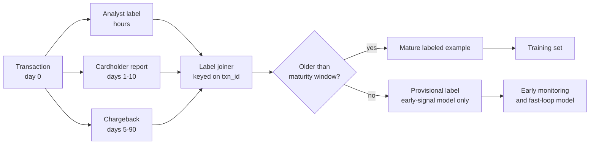
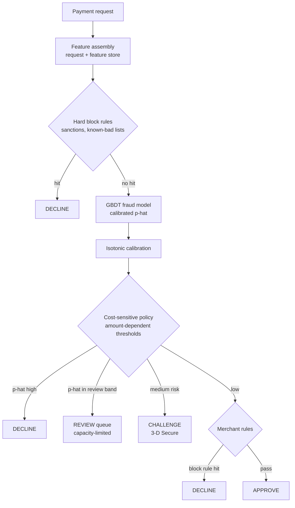
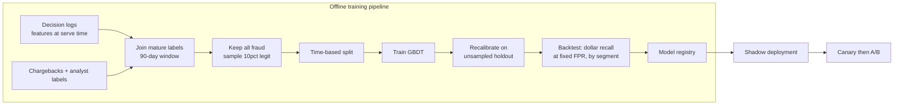
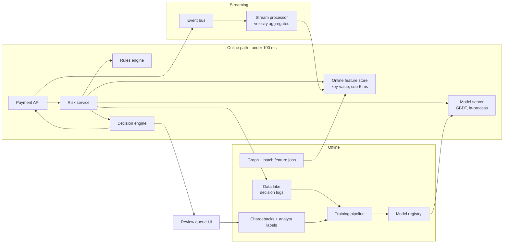
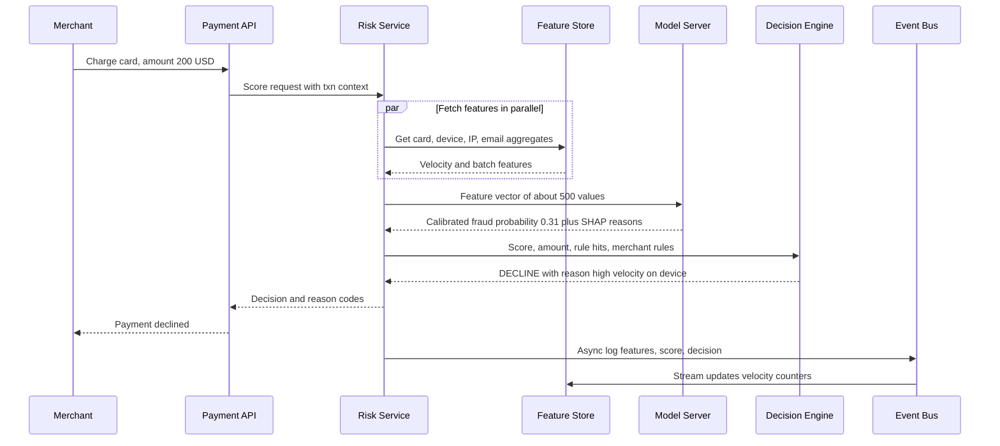

# Case study 1 — Real-time payment fraud detection

> **Interview prompt:** "Design a system that decides, in real time, whether to approve,
> decline, or send for review each card payment processed by our platform. We process
> payments for millions of merchants worldwide."

**Modules this case study exercises:**
[M04 Evaluation & data](../modules/04-evaluation-and-data.md) ·
[M05 Trees & ensembles](../modules/05-trees-and-ensembles.md) ·
[M10 Design framework](../system-design/10-ml-system-design-framework.md) ·
[M11 Data & training infra](../system-design/11-data-and-training-infrastructure.md) ·
[M12 Serving, monitoring & experimentation](../system-design/12-serving-monitoring-experimentation.md)

**What makes this problem special (say this in the first two minutes):**

1. **Extreme class imbalance** — roughly 1 in 1,000 transactions is fraud.
2. **Delayed, noisy labels** — the ground truth (a chargeback) arrives days to months later.
3. **An adversary** — fraudsters actively probe and adapt to your model.
4. **Asymmetric, dollar-denominated costs** — a missed fraud costs the transaction amount
   plus fees; a false decline costs the margin *and* a customer who may never come back.
5. **Hard latency budget** — the decision sits inside the card authorization path (< 100 ms).

> **Why this matters:** Interviewers use fraud to test whether you can reason about
> metrics and labels, not whether you know the fanciest model. A candidate who says
> "accuracy" or "train on last week's labels" in the first ten minutes has usually
> already lost the interview.

---

## 1. Clarify requirements

Questions to ask the interviewer (and the answers we will assume):

| Question | Assumed answer |
|---|---|
| What payment types? | Card-not-present (online) card payments. Card-present is lower-risk and out of scope. |
| What decisions? | `APPROVE`, `DECLINE`, `REVIEW` (human analyst), and `CHALLENGE` (3-D Secure / step-up auth). |
| Who bears the fraud loss? | The platform/merchant (chargeback liability), so false negatives cost real money. |
| Scale? | ~1B transactions/day globally, peaks at ~3× average. |
| Latency? | p99 < 100 ms for the whole risk decision, inside a ~1–2 s card authorization. |
| Do merchants have custom rules? | Yes — merchants can add allow/block rules on top of the model. |
| Explainability? | Required: analysts and merchants must see *why* a payment was blocked; some regions require adverse-action reasons. |

**Functional requirements**

- Score every payment synchronously and return a decision + reason codes.
- Support rules (platform-wide and merchant-specific) alongside the ML score.
- Route uncertain cases to a human review queue with a bounded capacity.
- Ingest chargebacks, disputes, and analyst decisions as labels.

**Non-functional requirements**

- **Latency:** p99 < 100 ms end-to-end risk decision; the model itself gets ~20 ms.
- **Availability:** 99.99%. If the risk service fails, we **fail open with conservative
  rules** (approve low-risk, decline obviously risky) rather than block all payments.
- **Freshness:** velocity features must reflect events from *seconds* ago.
- **Auditability:** every decision is logged with model version, features, and score
  so it can be replayed.

### Back-of-envelope numbers

| Quantity | Estimate | Reasoning |
|---|---|---|
| Average QPS | ~12,000 | $10^9 / 86{,}400 \approx 11{,}600$ |
| Peak QPS | ~35,000 | 3× average (Black Friday, regional peaks) |
| Fraud rate | ~0.1% | ~1M fraudulent transactions/day |
| Features per request | ~500 | ~50 raw + ~450 aggregates/embeddings |
| Feature store reads per request | ~20 entity lookups | card, account, device, IP, email, merchant, BIN… |
| Logged data per day | ~1B × 2 KB ≈ 2 TB/day | features + score + decision |
| Training set (90 days, downsampled negatives) | ~90M fraud + ~900M legit → downsample legit 10× | keeps all positives |
| Review queue capacity | ~50,000 cases/day | e.g. 500 analysts × 100 cases/day |

The review capacity number is important: it **fixes the REVIEW threshold**. We can
only send 0.005% of traffic to humans, so the review band must be narrow.

---

## 2. Frame as an ML problem

**Business objective:** minimize total fraud cost
$=$ fraud losses $+$ cost of false declines $+$ cost of manual review,
subject to latency and review-capacity constraints.

**ML objective:** estimate $p(\text{fraud} \mid x)$ for a transaction $x$, well
calibrated, so that a cost-sensitive decision rule can be applied on top.

**Label definition (the most important design choice):**

- **Positive:** a transaction that received a fraud chargeback (dispute reason code =
  fraud), was confirmed fraud by an analyst, or was reported by the cardholder as
  unauthorized — within a **label maturity window** (e.g. 60–90 days).
- **Negative:** a transaction that is *older than the maturity window* and has no fraud signal.
- **Excluded / unknown:** transactions younger than the window (labels not yet mature),
  and transactions we *declined* (we never observe their outcome — see Section 3).

**Input → output:** transaction + context (card, device, merchant, history) →
calibrated fraud probability $\hat p$ + top reason codes.

**Decision rule (cost-sensitive).** Let $A$ be the amount, $m$ the merchant margin
(lost if we falsely decline), $c_{\text{fee}}$ the chargeback fee, and $\lambda$ a
customer-lifetime penalty for insulting a good customer. Decline when the expected cost
of approving exceeds the expected cost of declining:

$$
\underbrace{\hat p \,(A + c_{\text{fee}})}_{\text{expected cost if approve}}
\;>\;
\underbrace{(1-\hat p)\,(m A + \lambda)}_{\text{expected cost if decline}}
$$

Worked number: $A = \$200$, $c_{\text{fee}} = \$15$, $m = 0.3$, $\lambda = \$20$.
Decline if $\hat p \cdot 215 > (1-\hat p)\cdot 80$, i.e. $\hat p > 80/295 \approx 0.27$.
For a \$20 purchase the threshold rises to $\hat p > 26/61 \approx 0.43$.
**The threshold depends on the amount** — a single global threshold is wrong.

> **Why this matters:** This formula is why the model must be *calibrated*. If $\hat p$ is
> only a ranking score, you cannot plug it into an expected-cost rule. See
> [M04](../modules/04-evaluation-and-data.md) on calibration and threshold selection.

> **Common mistake:** Framing it as "binary classification, maximize F1". F1 ignores
> transaction amounts, ignores the review queue, and picks a threshold that has no
> business meaning.

---

## 3. Data

**Sources**

| Source | Content | Latency to availability |
|---|---|---|
| Authorization stream | amount, currency, merchant, card BIN, timestamps | real time (Kafka) |
| Device/browser signals | device fingerprint, IP, user agent, behavioral JS signals | real time |
| Account data | account age, email, shipping/billing addresses | real time (DB / CDC) |
| Issuer responses | approve/decline from the bank, CVV/AVS match | seconds |
| Chargebacks & disputes | fraud reason codes from card networks | **days to 120 days** |
| Analyst decisions | review-queue outcomes | hours |
| Merchant/cardholder reports | "I didn't make this purchase" | days |

### The delayed-label problem

Most fraud chargebacks arrive within ~30 days, but the tail extends to 90+ days.
If you train on "last week's data," nearly every recent fraud looks legitimate —
you teach the model that current fraud patterns are fine.

Mitigations:

1. **Train only on mature data** (e.g. transactions 90–180 days old) for the main model.
2. **Use fast proxy labels** (analyst decisions, cardholder reports, 3DS failures) for a
   secondary "fast" model and for early monitoring.
3. **Survival-style correction:** for recent windows, estimate what fraction of
   eventual chargebacks have arrived ("label completeness curve") and use it to
   correct monitoring dashboards.

### Selection bias from our own declines

We never see outcomes for transactions we decline. Over time the model is trained only on
what the *previous* model let through, so its blind spots become invisible.

- **Holdout / exploration:** approve a tiny random fraction (e.g. 0.1%) of
  would-be-declined *low-amount* transactions, and weight them by inverse propensity
  ($w = 1/\pi$, where $\pi$ is the probability that a transaction of that kind was let
  through). This is the approach Stripe has described publicly for Radar (letting a
  small fraction of blocked-score payments through to obtain counterfactual labels).
- **Do not treat declined = fraud.** That creates a self-fulfilling loop.

> **Common mistake:** Labeling every declined transaction as fraud "because the model
> said so." The model then learns to imitate itself, and precision on the *real* label
> silently drifts.

### Sampling and imbalance

- Keep **all positives**. Downsample negatives (e.g. keep 10%) and store the sampling
  rate so we can **re-weight** (weight negatives by 10) or **recalibrate** after training.
- Prefer weighting by **amount** for the business-loss objective: a \$5,000 fraud matters
  more than a \$5 one. Train with sample weight $\propto \log(1 + A)$ or report
  dollar-weighted metrics.

### Privacy & compliance

PCI-DSS: raw card numbers (PANs) never leave the vault — the model sees tokenized card
IDs and BINs. GDPR/CCPA: retention limits on device/IP data; region-pinned storage.
Fairness: avoid protected attributes and audit proxies (e.g. ZIP code) for disparate
decline rates.

---

## 4. Features

Fraud is mostly a **feature engineering** problem. The single most predictive family is
**velocity**: "how unusual is this activity compared to this entity's recent history?"

| Feature | Type | Source | Online/offline | Freshness |
|---|---|---|---|---|
| Amount, currency, amount in USD | numeric | request | online (request) | real time |
| Merchant category code (MCC) | categorical | request | online | real time |
| Card BIN country ≠ IP country | boolean | request + geo-IP | online | real time |
| CVV / AVS match result | categorical | issuer response | online | real time |
| # txns on card in last 1 min / 1 h / 24 h | count | streaming aggregate | online (feature store) | seconds |
| Sum amount on card last 24 h | numeric | streaming aggregate | online | seconds |
| # distinct cards used on this device last 24 h | count | streaming aggregate | online | seconds |
| # distinct emails per IP last 1 h | count | streaming aggregate | online | seconds |
| Amount / card's 30-day median amount | ratio | stream + batch | online | minutes |
| Account age, email age, email domain risk | numeric/cat | account DB | online | hours |
| Time since last password/address change | numeric | event log | online | seconds |
| Distance billing↔shipping↔IP geo | numeric | request + geo | online | real time |
| Merchant historical fraud rate (smoothed) | numeric | batch | offline → online | daily |
| Card/device/IP shared-entity graph features (component size, # flagged neighbors) | numeric | graph job | offline → online | hourly |
| Graph node embedding of card/device | dense vector | graph embedding job | offline → online | daily |
| Behavioral biometrics (typing speed, paste events) | numeric | JS SDK | online | real time |
| Rule hits (e.g. "known bad BIN") | boolean | rules engine | online | real time |

### Velocity features via streaming aggregates

A stream processor (Flink / Kafka Streams style) maintains **sliding-window counters**
keyed by entity (card, device, IP, email, merchant) and writes them to a low-latency
key-value store.

- Use **tumbling sub-buckets** (e.g. 1-minute buckets summed over the last 60) so a
  window update is $O(1)$, not a scan.
- Use **approximate distinct counts** (HyperLogLog) for "# distinct cards per device".
- **Update-before-read ordering:** the aggregate for the *current* transaction must not
  include itself at training time, but at serving time the stream may not have caught up.
  Define the feature as "events strictly before this transaction" in *both* paths.

### Graph features

Fraud is organized: one fraud ring uses many cards across a few devices and addresses.
Build a bipartite graph of entities (cards, devices, emails, IPs, shipping addresses)
linked by co-occurrence in transactions.

- Cheap features: size of connected component, # neighbors with confirmed fraud within
  2 hops, # cards per device.
- Richer: node embeddings (e.g. random-walk or GNN embeddings) fed to the model.
- Computed in batch (hourly/daily) with an incremental "known-bad neighbor" lookup online.

> **Why this matters:** Point-in-time correctness. Every aggregate must be computed
> exactly as it would have been at the instant of the historical transaction. Joining
> today's "merchant fraud rate" onto last year's transactions leaks the future and
> produces a model that looks brilliant offline and fails online. See the
> feature-store section of [M11](../system-design/11-data-and-training-infrastructure.md).

---

## 5. Model

### Baseline: rules

Start with rules because they are interpretable, instantly deployable, and capture
known patterns: "decline if card used in > 5 countries in 1 h", "review if
amount > \$2,000 and account age < 1 day". Rules remain in production forever as a
**fast-reaction layer** (an analyst can ship a rule in minutes during an attack) and as
a **safety net** if the model service is down.

Limitations: rules don't combine weak signals, they interact unpredictably, and they
rot as fraudsters adapt.

### Production model: gradient-boosted decision trees

**GBDT (XGBoost/LightGBM-style)** on ~500 features is the industry workhorse for
tabular fraud, and it is the right first answer:

- Handles heterogeneous, non-normalized, missing-valued tabular features natively.
- Captures interactions ("new device AND high amount AND foreign IP") automatically.
- Fast inference: 500 trees × depth 8 ≈ 4,000 node comparisons ≈ < 1 ms on CPU.
- Reason codes via SHAP / tree path attributions.
- See [M05](../modules/05-trees-and-ensembles.md) for why boosting fits additive
  combinations of weak signals.

**Extensions** once GBDT is mature:

- **Sequence model** over the card's last $N$ transactions (GRU/transformer) producing an
  embedding fed into the GBDT — captures behavioral patterns aggregates miss.
- **Graph embeddings** of entities (Section 4).
- **Segment-specific models** (e.g. per region or for marketplaces) only when one global
  model clearly underfits a segment.

### The decision layer

The model outputs a score; the **decision engine** combines it with rules and policy.

**Thresholds are set per amount bucket** using the cost formula from Section 2,
and the REVIEW band is sized so expected volume ≤ analyst capacity. Analysts get the
cases with the **highest expected value of review**: $\hat p \cdot A$ near the decision
boundary, not simply the highest $\hat p$ (those should be auto-declined).

> **Common mistake:** Sending the highest-scoring transactions to human review. Those are
> almost certainly fraud — auto-decline them. Humans add value where the model is
> *uncertain* and the dollar amount is large.

---

## 6. Training

- **Loss:** binary log-loss (for calibration), optionally weighted by amount and by
  inverse negative-sampling rate. Optionally focal loss — but it distorts calibration,
  so recalibrate afterward.
- **Splits: time-based, never random.** Train on months 1–6 (mature), validate on month 7,
  test on month 8. Random splits leak the same fraud ring (same device, same card) into
  train and test and wildly overstate performance.
- **Group leakage:** even with time splits, consider holding out by *entity* for a
  robustness check.
- **Negative sampling:** keep all positives, sample ~10% of negatives, then **recalibrate**:
  if negatives were kept at rate $r$, the model's odds are inflated by $1/r$, so
  $p = \frac{p_s}{p_s + (1-p_s)/r}$ where $p_s$ is the score from the sampled model
  (same formula as in [Case study 4](04-ad-click-prediction.md)). Then fit isotonic
  regression on a recent, un-sampled holdout.
- **Hyperparameters:** tuned on the time-based validation set, optimizing dollar-weighted
  recall at a fixed false-positive rate.
- **Retraining cadence:** weekly full retrain on the sliding mature window; daily
  refresh of calibration; rules updated within minutes during attacks.
- **Training pipeline:** the same feature definitions run in batch (backfill with
  point-in-time joins) and streaming (online), generated from one spec.

> **Why this matters:** Logging features **at serving time** ("log and wait") and
> joining labels later guarantees training/serving consistency for real-time
> aggregates, which are almost impossible to reconstruct exactly in batch.

---

## 7. Evaluation

### Offline metrics

| Metric | Why |
|---|---|
| **PR-AUC** (not ROC-AUC) | With 0.1% positives, ROC-AUC looks great (0.98) even for weak models because FPR's denominator is enormous. PR-AUC is sensitive to precision on the rare class. |
| **Recall at fixed FPR** (e.g. at 0.1% FPR) | Matches the operational constraint: "we may falsely decline at most 1 in 1,000 good payments." |
| **Dollar-weighted recall** | Fraction of fraud *dollars* caught — the business cares about \$, not counts. |
| **Calibration** (reliability curve, ECE, log-loss) | Required for the expected-cost decision rule. |
| **Segment slices** | by country, merchant category, new vs. existing card, amount bucket — a global gain can hide a regional regression. |
| **Backtest cost simulation** | Replay the policy on a mature test month and compute total \$ cost (fraud + false declines + review). |

Worked example: at 1B txns/day, a 0.1% FPR means ~1M good transactions falsely declined
per day — about the same as the total number of frauds. This is why FPR must be tiny.

### Online metrics

- **Primary:** total fraud cost per \$1,000 processed (fraud loss bps + estimated false-decline cost).
- **Fraud loss rate** (basis points of volume) — but it lags by weeks.
- **Leading indicators:** decline rate, 3DS challenge rate, review rate, issuer decline
  rate, analyst-confirmed fraud rate in the review queue.

### Guardrails

- Overall approval rate must not drop by > X bps.
- p99 latency < 100 ms.
- Review-queue volume ≤ capacity.
- No segment (country, merchant tier) with decline rate up by > Y%.
- Merchant complaint rate.

### A/B design

Fraud A/B tests are tricky because the primary metric (chargebacks) arrives **weeks
later** and is rare.

1. **Shadow mode** (1–2 weeks): new model scores all traffic, decisions unchanged.
   Compare score distributions and "would-have-declined" sets.
2. **Randomize by card (or account), not by transaction**, so a fraudster cannot get a
   "second chance" in the other arm and so per-card velocity is coherent.
3. Run for long enough for labels to mature for a decision; use **early proxies**
   (analyst-confirmed fraud, 3DS failures, issuer declines) for an interim go/no-go.
4. Power: fraud is rare, so detecting a 5% relative change in fraud bps requires large
   traffic shares — often 50/50 with a long readout, or a **backtest-first** policy where
   the A/B only confirms no guardrail regression.

> **Common mistake:** Declaring victory after three days of A/B because the decline rate
> rose and "we must be catching more fraud." You may simply be declining more good customers.

---

## 8. Serving architecture

### Request-time sequence

### Latency budget

| Step | p99 budget |
|---|---|
| Network + API gateway | 10 ms |
| Feature fetch (parallel, ~20 keys) | 15 ms |
| Request-time feature computation | 5 ms |
| Rules engine | 5 ms |
| GBDT inference (500 trees) | 5 ms |
| Optional sequence-embedding model | 15 ms |
| Decision engine + SHAP reason codes | 10 ms |
| Logging (async, off critical path) | 0 ms |
| Headroom for retries / GC | 35 ms |
| **Total** | **100 ms** |

**Resilience:** if the feature store times out, use default/missing values (GBDT handles
missing natively, and we *train* with randomly dropped features so the model degrades
gracefully). If the model server times out, fall back to the rules-only policy.

---

## 9. Monitoring & iteration

**What to monitor**

- **Input drift:** feature distributions (PSI per feature), null rates, feature-store
  latency and staleness.
- **Score drift:** distribution of $\hat p$; fraction above each threshold per hour.
- **Decision rates:** decline / review / challenge rates by segment, alerting on spikes.
- **Label-based performance:** precision of declines via analyst samples (fast), and
  matured recall/precision (slow, with a label-completeness correction).
- **Adversarial signals:** sudden bursts of small "card testing" transactions,
  new BIN ranges, new device fingerprints.

**Adversarial drift** is the defining feature of fraud. Fraudsters probe the system with
small transactions, find what gets through, then scale it. Defenses:

- Fast loop: analysts ship rules in minutes; model retrained weekly.
- Features that are **costly for attackers to change** (device graph, account age,
  behavioral biometrics) over features they control (amount, email string).
- Don't leak the model's decision boundary: return generic decline codes externally.
- Monitor for **score clustering just below the threshold** — a signature of probing.

### Failure modes

| Symptom | Likely cause | Mitigation |
|---|---|---|
| Great offline PR-AUC, poor online | Point-in-time leakage in features, or random split | Log-and-wait features, time-based splits, entity-group checks |
| Recent precision looks perfect, recall terrible | Immature labels (chargebacks not yet arrived) | Label maturity window, completeness curve correction |
| Decline rate spikes in one country | Upstream data change (geo-IP provider), or real attack | Per-segment alerts, feature null-rate monitors, rule override |
| Fraud loss creeps up over months | Adversarial adaptation, model staleness | Weekly retrain, analyst rules, new feature families |
| Model blind to a fraud pattern it once caught | Selection bias — we declined it so never relabeled | Randomized exploration holdout with IPW |
| Review queue overflows | Threshold miscalibrated after retrain | Recalibrate, cap queue by expected-value ranking |
| Latency p99 breach at peak | Feature store hot keys (e.g. a big merchant ID) | Caching, key salting, timeouts with defaults |
| Merchants complain about false declines | Global threshold ignores merchant risk profile | Merchant-level threshold offsets, allow-lists |

---

## 10. Trade-offs & extensions

| Decision | Option A | Option B | Our choice |
|---|---|---|---|
| Model family | GBDT | Deep model | GBDT core + learned embeddings as features: best accuracy/latency/explainability trade-off on tabular data |
| Thresholds | Single global | Amount- and segment-dependent | Amount-dependent from the cost formula |
| Labels | Wait for maturity | Use fast proxies | Both: mature for training, proxies for monitoring and a fast model |
| Rules vs ML | Rules only | ML only | Both: rules for hard policy and fast reaction, ML for weak-signal combination |
| Failure behavior | Fail closed | Fail open | Fail open with conservative rules (a total outage costs more than a few frauds) |
| Network effects | Per-merchant models | One global model | Global model: fraudsters reuse cards across merchants — the cross-merchant view is the platform's main advantage |

**Extensions:** real-time GNN scoring; account-takeover (ATO) detection at login;
merchant fraud (bust-out merchants); friendly fraud detection; dynamic 3DS
(step-up auth only when it adds information); federated signals from consortium data.

---

## 11. Interviewer follow-ups

Q1. Why not just use accuracy or ROC-AUC?

With 0.1% fraud, predicting "legit" for everything gives 99.9% accuracy. ROC-AUC is
dominated by the huge negative class: going from 0.1% to 0.2% FPR is a tiny horizontal
move on the ROC curve but **doubles** the number of falsely declined customers
(1M → 2M per day). PR-AUC and recall-at-fixed-FPR directly expose precision on the rare
class. Ultimately I'd report a backtested dollar cost, since the business objective is in dollars.

Q2. Labels take 90 days. How do you respond to a new attack that started yesterday?

Three layers. (1) **Rules**: analysts see anomaly alerts (e.g. card-testing bursts) and
ship a rule within minutes. (2) **Fast proxy labels** — analyst decisions, cardholder
reports, 3DS failures, issuer declines — train a small "fast" model or adjust weights
daily. (3) **Unsupervised anomaly detection** on velocity features flags novel patterns
without labels (see M06). The mature-label GBDT is the backbone; it is not the
first responder.

Q3. How do you choose the threshold?

From expected cost, not from F1: decline when $\hat p (A + c_{\text{fee}}) > (1-\hat p)(mA + \lambda)$,
which makes the threshold depend on the amount. Then add constraints: review band sized to
analyst capacity, segment-level guardrails on decline rate. I'd verify the policy with a
backtest on a mature month and adjust $\lambda$ with the business (how much is an
insulted customer worth?). This only works if $\hat p$ is calibrated, so I recalibrate
after every retrain.

Q4. You downsampled negatives 10×. What happens to the probabilities?

They are inflated: the model sees fraud 10× more often than reality, so its odds are
10× too high. Correct with $p = p_s / (p_s + (1-p_s)/r)$ with $r = 0.1$, or train with
negative weight $1/r$. In practice I also fit isotonic calibration on a recent
un-sampled holdout, because calibration also drifts with time.

Q5. How do you avoid training/serving skew for velocity features?

Define each feature once (one spec compiles to both streaming and batch). Prefer
**log-and-wait**: log the exact feature vector used at serving time, and later join
labels onto it — training then sees exactly what serving saw. For backfills of new
features, use point-in-time joins with event-time semantics ("events strictly before
this transaction's timestamp"). Monitor skew by recomputing a sample offline and
comparing to logged values.

Q6. Why GBDT and not a deep neural network?

On heterogeneous tabular features with missing values and very different scales, GBDTs
are typically as accurate or better, need little preprocessing, train in hours, infer in
under a millisecond on CPU, and produce per-decision attributions (SHAP) that analysts and
regulators need. Deep models earn a place where there is structure trees can't exploit —
transaction **sequences** and **entity graphs** — so I'd use them to produce embeddings
that feed the GBDT, rather than replace it.

Q7. The model's declines hide outcomes. How do you know your recall?

You can't observe outcomes for declined payments, so naive recall is biased. I'd keep a
small randomized exploration bucket: approve a random ~0.1% of would-be-declined
low-amount transactions, log the propensity, and use inverse propensity weighting to
estimate counterfactual fraud rates and to train on unbiased data. Capping amounts keeps
the cost of exploration bounded.

Q8. A fraud ring is probing you with small transactions. What do you see and do?

Signals: spike in low-amount transactions, many distinct cards per device/IP, many
declines with CVV mismatch, scores clustering just below the threshold. Response: a
velocity rule on distinct cards per device/IP/BIN range, temporarily tighter thresholds
for that segment, adding the ring's entities to the graph's "known bad" set so neighbors
inherit risk, and returning generic decline codes so attackers learn less per probe.

Q9. How would you A/B test a new model when the main metric lags 60 days?

Shadow first to compare decision sets. Then randomize by card/account (not by
transaction). Read early proxies — analyst-confirmed fraud in each arm, 3DS failure
rate, issuer declines, approval rate — for an interim decision, while guardrails
(approval rate, latency, review volume) protect the business. Final readout on matured
chargebacks. Because fraud is rare, I'd back the decision with an offline backtest cost
simulation rather than rely solely on an underpowered online test.

Q10. How do you handle fairness and explainability?

Exclude protected attributes and audit proxies by comparing false-decline rates across
regions/demographic proxies where legally allowed. Provide reason codes from SHAP values
mapped to human-readable categories ("unusual device", "high velocity") for analysts and
for regulated adverse-action notices. Keep the rule layer and the model's top features
documented so decisions can be replayed from logs.

---

**Further reading:** Stripe engineering blog posts on Radar (machine learning for
fraud, evaluating and training under counterfactual feedback); Dal Pozzolo et al.,
"Calibrating Probability with Undersampling for Unbalanced Classification" (2015);
Chen & Guestrin, "XGBoost" (2016).
