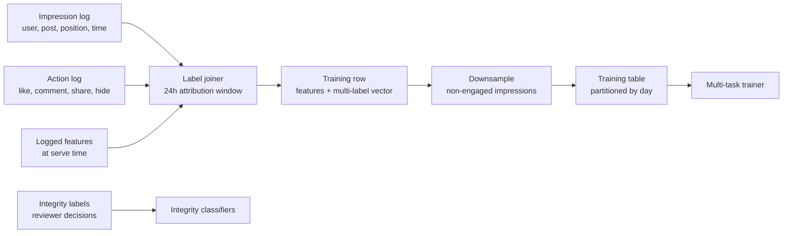
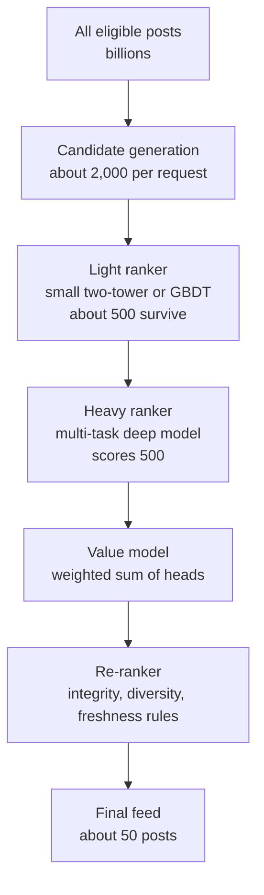
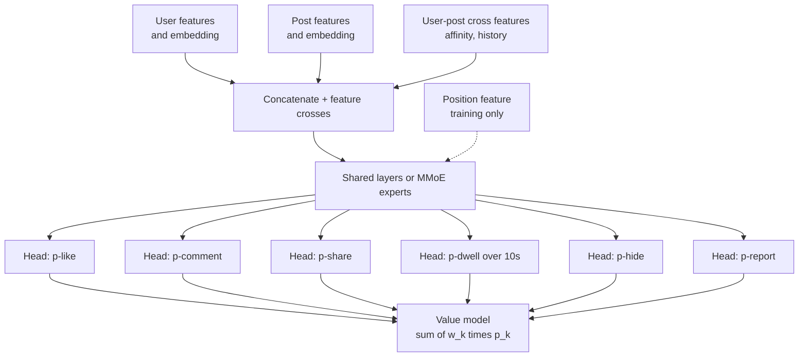
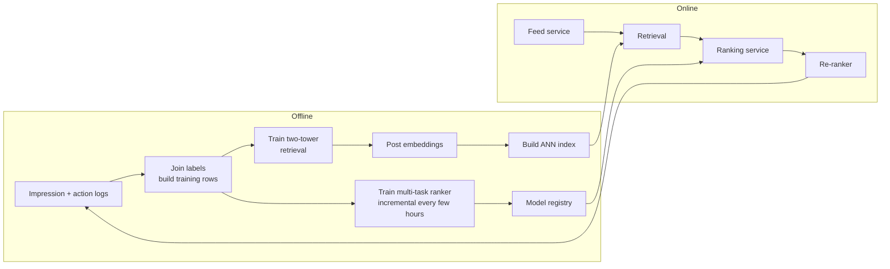
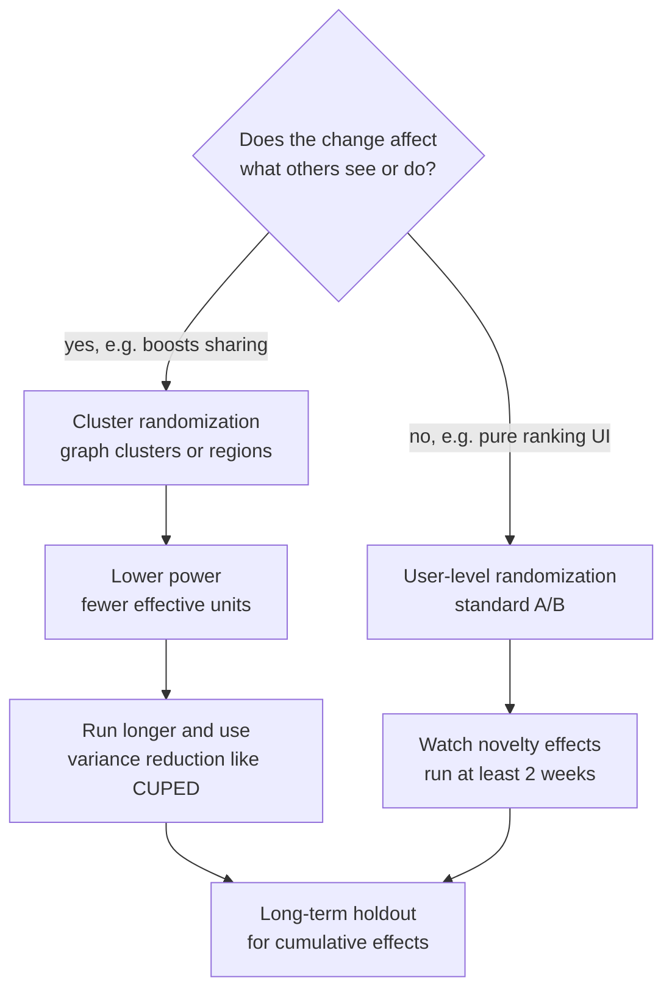
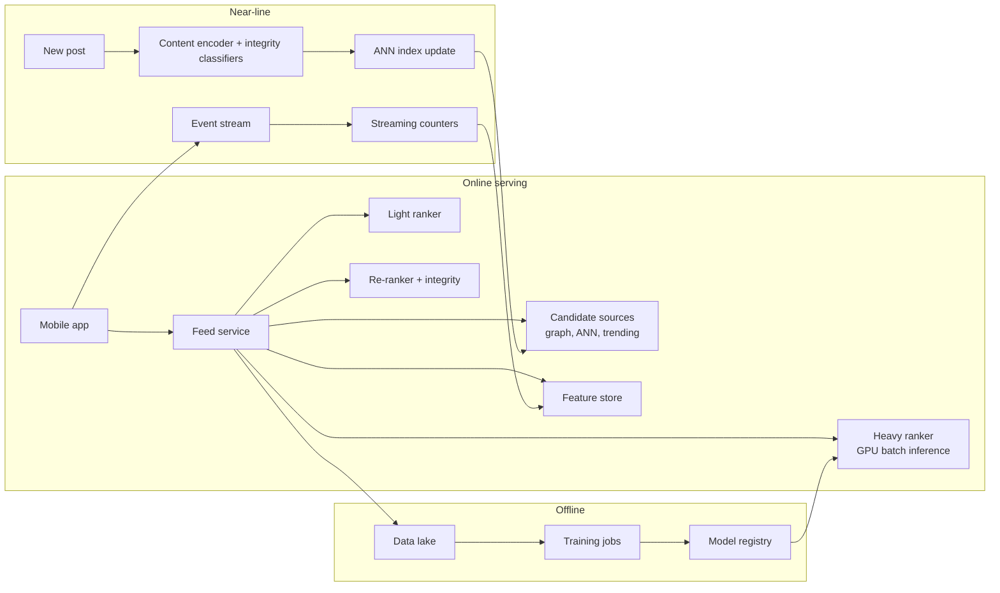
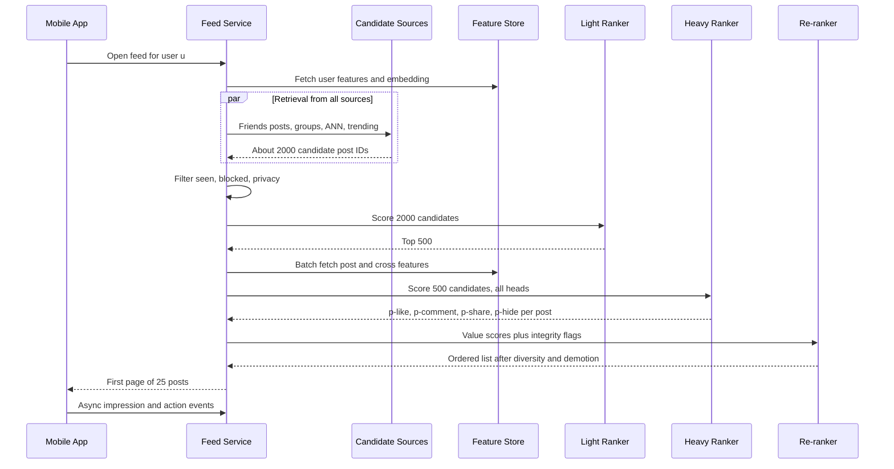

# Case study 2 — Social media news feed ranking

> **Interview prompt:** "Design the ranking system for a social network's home feed.
> When a user opens the app, decide which posts to show and in what order."

**Modules this case study exercises:**
[M04 Evaluation & data](../modules/04-evaluation-and-data.md) ·
[M08 Embeddings & transformers](../modules/08-embeddings-and-transformers.md) ·
[M09 Recommendation & ranking](../modules/09-recommendation-and-ranking.md) ·
[M10 Design framework](../system-design/10-ml-system-design-framework.md) ·
[M11 Data & training infra](../system-design/11-data-and-training-infrastructure.md) ·
[M12 Serving, monitoring & experimentation](../system-design/12-serving-monitoring-experimentation.md)

**What makes this problem special (say this early):**

1. **Scale funnel** — billions of candidate posts, a few hundred milliseconds, ~50 slots.
   Only a multi-stage funnel (retrieve → rank → re-rank) is feasible.
2. **No single label** — "good feed" is a blend of likes, comments, shares, dwell time,
   hides, reports, and long-term retention. We predict many events and combine them.
3. **Integrity** — engagement-optimal ranking amplifies clickbait, misinformation, and
   outrage. Ranking must demote harmful content explicitly.
4. **Feedback loops & network effects** — the feed shapes the data we train on, and one
   user's treatment changes what their friends see, which breaks naive A/B tests.

> **Why this matters:** The feed is the canonical "recommendation system design"
> question. Interviewers want to hear the funnel, multi-task prediction, the value model,
> and at least one non-engagement consideration (integrity, diversity, long-term value).
> Candidates who only say "train a model to predict clicks" score as junior.

---

## 1. Clarify requirements

| Question | Assumed answer |
|---|---|
| What content? | Posts from friends, followed pages/groups, and **unconnected** recommended content (text, photo, video, links). |
| Ranked or chronological? | Ranked; optionally a "latest" tab exists. |
| Objective? | Long-term user value: meaningful engagement and retention, not raw clicks. |
| Scale? | 1B daily active users (DAU), ~10 feed sessions/user/day. |
| Latency? | p99 < 300 ms server-side for the first page. |
| Freshness? | New posts from friends should be eligible within ~1 minute. |
| Ads? | Inserted by a separate ads system into slots; out of scope (see [Case study 4](04-ad-click-prediction.md)). |

**Functional:** rank a personalized list of posts per request; support pagination;
respect blocks/mutes/privacy; demote integrity-violating content; log impressions and actions.

**Non-functional:** p99 < 300 ms; high availability with graceful degradation (fallback
to a cheaper ranking or recency); model freshness of hours for the ranker and minutes for
some features.

### Back-of-envelope numbers

| Quantity | Estimate | Reasoning |
|---|---|---|
| Feed requests/day | 10B | 1B DAU × 10 sessions |
| Average QPS | ~115,000 | $10^{10} / 86{,}400$ |
| Peak QPS | ~350,000 | ~3× average |
| Candidates retrieved per request | ~2,000 | from all sources |
| Candidates scored by heavy ranker | ~500 | after light ranking |
| Posts shown per request (first page) | ~20–50 | |
| Model inferences/sec (heavy ranker) | $1.15\times10^5 \times 500 \approx 6\times10^7$ | GPU/CPU batched |
| Impressions logged/day | ~$10^{11}$ | 10B requests × ~10 viewed |
| Training data/day | ~$10^{11}$ rows × ~1 KB ≈ 100 TB raw; downsample | |

The ~60M inferences/sec number is why the heavy ranker can only see ~500 candidates
and why light rankers exist.

---

## 2. Frame as an ML problem

**Business objective:** maximize long-term user value (daily active usage, sessions,
meaningful social interactions), subject to integrity and well-being constraints.

**Why not a single label?** "Click" rewards clickbait; "time spent" rewards passive
scrolling of outrage; "like" is cheap. Each signal is a noisy proxy of value. So:

**ML objective:** for each (user $u$, post $i$) predict probabilities of several events:

$$
\hat p_k(u,i) = P(\text{event}_k \mid u, i, \text{context}),\quad
k \in \{\text{like, comment, share, click, dwell}>\tau,\ \text{hide, report}\}
$$

then rank by a **value model**:

$$
V(u,i) = \sum_k w_k \,\hat p_k(u,i)
\;-\; \text{integrity penalty}(i)
$$

with positive weights for positive events and **negative weights** for hide/report.
The weights $w_k$ encode the business's notion of value: e.g. a comment (effortful,
social) is worth more than a like. Weights are tuned by online experiments against
long-term metrics, not by gradient descent.

Worked example with $w = \{\text{like}: 1, \text{comment}: 5, \text{share}: 8, \text{hide}: -20\}$:

| Post | p(like) | p(comment) | p(share) | p(hide) | $V$ |
|---|---|---|---|---|---|
| Friend's wedding photo | 0.30 | 0.06 | 0.01 | 0.002 | 0.30 + 0.30 + 0.08 − 0.04 = **0.64** |
| Viral clickbait | 0.20 | 0.01 | 0.04 | 0.03 | 0.20 + 0.05 + 0.32 − 0.60 = **−0.03** |

The clickbait gets more raw shares but loses after the hide penalty.

**Input → output:** (user, request context) → ordered list of post IDs.

> **Common mistake:** Saying "I'll predict engagement" without defining it. Name the events,
> say they are predicted jointly, and explain how they are combined and who sets the weights.

---

## 3. Data

**Sources**

- **Impression logs:** which posts were shown, position, timestamp, surface, device.
- **Action logs:** like, comment, share, click, dwell time, hide, report, unfollow.
- **Social graph:** friendships, follows, group memberships, interaction strengths.
- **Content:** text, images, video, author, creation time, integrity classifier outputs.
- **User profile/context:** country, language, device, connection type, time of day.

**Labels.** One impression row gets multiple binary labels (one per task), joined from
action logs within an **attribution window** (e.g. 24 h after impression). Dwell is
binarized ("dwell > 10 s") or regressed on $\log(\text{seconds})$.

**Sampling.** Most impressions have no action. Downsample negatives per task carefully
— with multi-task models, a row negative for "like" may be positive for "dwell". Common
practice: keep all rows with any positive, downsample all-negative rows, store weights.

**Position bias.** Posts at the top get more engagement regardless of quality. If ignored,
the model learns "whatever we ranked high is good" — a self-reinforcing loop. See Section 6.

**Privacy.** Respect post visibility (friends-only, custom lists) **at retrieval time**,
not just at display. Don't use private message content as features without consent.
Apply data minimization and retention limits; regional regulations may require a
non-personalized feed option.

---

## 4. Features

| Feature | Type | Source | Online/offline | Freshness |
|---|---|---|---|---|
| User embedding (from interaction history) | dense vector | two-tower / sequence model | offline → online | daily |
| Post/content embedding (text + image) | dense vector | content encoder | computed at post creation | minutes |
| Author embedding | dense vector | batch | offline → online | daily |
| User–author affinity (interactions last 7/30/90 d) | numeric | batch + streaming | online | minutes to hours |
| Relationship type (friend, follow, group, unconnected) | categorical | social graph | online | real time |
| Post age | numeric | request | online | real time |
| Post engagement so far (likes, comments, CTR, velocity) | numeric | streaming counters | online | seconds to minutes |
| Content type (photo/video/link/text), length | categorical | post metadata | online | static |
| User's historical CTR by content type | numeric | batch | offline → online | daily |
| User's last N interacted post IDs | ID sequence | streaming | online | real time |
| Time of day, day of week, device, connection | categorical | request | online | real time |
| Integrity scores (misinfo, clickbait, borderline) | numeric | classifiers | at creation + updates | minutes |
| Language match user↔post | boolean | metadata | online | static |
| Already-seen flag / # times author shown this session | numeric | session state | online | real time |

**ID embeddings** for users, authors, and posts carry most of the personalization signal.
Engagement counters on the post are strong but create a **rich-get-richer** loop; normalize
by impressions (CTR, not count) and smooth with a prior so new posts aren't buried:

$$
\widehat{\text{CTR}}_i = \frac{\text{clicks}_i + \alpha}{\text{impressions}_i + \alpha + \beta}
$$

> **Why this matters:** Feature freshness is often worth more than model architecture.
> A post's engagement velocity in the last 10 minutes predicts virality far better than
> anything known at creation time. See [M11](../system-design/11-data-and-training-infrastructure.md).

---

## 5. Model

### The funnel

Each stage trades **recall for precision** at increasing cost per item. Rough cost:
retrieval ~µs/item, light ranker ~10 µs/item, heavy ranker ~100 µs–1 ms/item (batched).

### Candidate sources (retrieval)

| Source | Method | Why |
|---|---|---|
| Friends' and followed pages' recent posts | Graph lookup + recency index | Core social content |
| Groups the user belongs to | Group inbox index | Community content |
| Embedding-based retrieval (unconnected) | Two-tower model + ANN index (HNSW/IVF-PQ) | Discovery of relevant unconnected content |
| Trending / popular in region | Streaming top-K | Freshness, cold-start users |
| Re-shares and friend interactions | "Friend X commented on" | Social proof |

The **two-tower** model (see [M09](../modules/09-recommendation-and-ranking.md)) learns
user and post embeddings so that $\text{score}(u,i) = \langle e_u, e_i\rangle$; the post
tower is precomputed and indexed, the user tower is computed at request time, and ANN
search returns the top-K in a few milliseconds. This architecture was described publicly
in YouTube's 2016 "Deep Neural Networks for YouTube Recommendations" paper (candidate
generation + ranking).

### Heavy ranker: multi-task model

A shared-bottom (or Mixture-of-Experts, MMoE) network takes user, post, and
cross features, and has one head per task.

**Why multi-task?** (1) Shared representation: rare tasks (share, report) borrow
statistical strength from frequent ones (like, dwell). (2) One model to serve instead of
six — a ~5× cost saving. (3) Consistent features across tasks. **Risk:** negative
transfer when tasks conflict (e.g. "click" vs "hide" for clickbait). MMoE — a gating
network per task over shared experts, published by Google (Ma et al., KDD 2018) — reduces
this by letting tasks use different expert mixtures.

**Baseline progression:** chronological → hand-tuned EdgeRank-style score (affinity ×
weight × time decay) → logistic regression per event → GBDT → multi-task DNN. State this
progression in the interview: it shows you'd ship something simple first.

### Re-ranking: integrity, diversity, freshness

After scoring, a re-ranking pass applies list-level logic that pointwise scores can't:

- **Integrity demotion:** multiply $V$ by a factor $< 1$ for posts flagged by
  classifiers as borderline/misinformation/clickbait; remove policy-violating content
  entirely. Demotion strength is a policy choice, and is logged for audit.
- **Diversity:** avoid 5 posts in a row from the same author or content type.
  Greedy MMR-style: $\text{score}'(i) = V(i) - \gamma \max_{j \in \text{selected}} \text{sim}(i,j)$,
  or simple rules ("max 2 consecutive videos", "author cap per page").
- **Freshness:** boost unseen recent posts from close friends; demote already-seen posts.
- **Business rules:** insert ad slots, notifications, "people you may know" units.

> **Common mistake:** Treating diversity as a model feature. Diversity is a property of
> the *list*, not of a single item, so it belongs in the re-ranker (or a listwise model).

---

## 6. Training

- **Loss:** sum of per-task binary cross-entropies, weighted:
  $\mathcal{L} = \sum_k \alpha_k \, \text{BCE}(y_k, \hat p_k)$, with task weights $\alpha_k$
  chosen so rare tasks aren't drowned out. Heads must stay **calibrated** because the
  value model adds probabilities across tasks.
- **Data:** last ~30 days of impressions, time-ordered; the newest day is the validation set.
- **Negatives:** shown-but-not-engaged impressions (true negatives for that task). For
  the retrieval two-tower, use **in-batch negatives** with a sampled-softmax correction for
  popularity (popular items appear as negatives too often).
- **Position-bias correction:** add position (and device/surface) as a feature **at
  training time**, then set it to a fixed value (e.g. position 1) **at serving time**. The
  model attributes the "being at the top" effect to the position feature, not to the post.
  Alternatives: a separate shallow "position tower" whose output is added to the logit
  only during training (published in YouTube's "Recommending What Video to Watch Next",
  RecSys 2019); inverse propensity weighting using click propensity per position
  estimated from small randomization experiments.
- **Retraining cadence:** heavy ranker **incrementally trained** every few hours on new
  data (warm-start), full retrain weekly; embeddings refreshed daily; streaming counters
  real time.
- **Exploration:** a small fraction of traffic gets randomized or boosted
  under-explored candidates, so new creators and content types can gather data.

> **Why this matters:** The arrow from the re-ranker back to the logs is the feedback
> loop. Everything the model will learn tomorrow is shaped by what it shows today.

---

## 7. Evaluation

### Offline metrics

| Metric | Stage | Why |
|---|---|---|
| Recall@K | Retrieval | Did the engaged post make it into the top-K candidates? Retrieval only needs to *include* good items. |
| Per-head AUC / log-loss / normalized entropy | Ranker | Discrimination and calibration per task |
| Calibration (predicted vs observed rate per bucket) | Ranker | The value model sums probabilities across tasks |
| NDCG@K using value-weighted relevance | Full list | Ranking quality of the final order |
| Offline replay of value-model weights | Value model | Sanity check only — real tuning needs online tests |

Offline gains are **necessary but not sufficient**: a 0.1% log-loss gain may or may not
move retention. Keep a running record of offline-vs-online correlation per metric.

### Online metrics

- **North star:** daily active users / sessions per user / retention (long-term).
- **Engagement:** meaningful interactions (comments, shares between friends), likes,
  time spent.
- **Negative signals:** hides, reports, unfollows, "see less" taps.
- **Guardrails:** p99 latency, crash rate, integrity prevalence (fraction of views on
  policy-violating content), creator-side distribution (are small creators starved?),
  ad revenue (feed changes alter ad impressions).

### A/B testing with network effects

Randomizing **users** is standard, but feeds violate SUTVA (the assumption that one
user's treatment doesn't affect another's outcome): if treatment users share more, control
users see more shares in their feeds. The treatment effect "leaks" into control and the
measured difference is biased (usually toward zero for spillover-positive changes).

- **Cluster randomization:** partition the social graph into dense clusters (graph
  partitioning) or use regions; randomize clusters. Compare user-level and cluster-level
  estimates to measure the size of the network effect.
- **Creator-side experiments:** for changes in distribution to creators, randomize by
  author to measure creator outcomes (posting frequency).
- **Novelty/primacy effects:** users react to anything new; run ≥ 2 weeks and look at the
  trend over time.
- **Long-term holdouts:** keep ~1% of users on an older ranking for months to measure
  cumulative effects of many launches.

> **Common mistake:** Declaring a launch based on a 3-day engagement lift. Short-term
> engagement wins (e.g. more clickbait) frequently reverse into long-term retention losses.

---

## 8. Serving architecture

### Request-time sequence

### Latency budget

| Step | p99 budget |
|---|---|
| Request routing + auth | 15 ms |
| User feature fetch | 10 ms |
| Candidate retrieval (parallel sources, ANN) | 50 ms |
| Filtering (seen, privacy, blocks) | 15 ms |
| Light ranker on 2,000 | 25 ms |
| Feature fetch for 500 candidates | 30 ms |
| Heavy ranker on 500 (batched GPU) | 70 ms |
| Re-ranking, integrity, diversity | 20 ms |
| Response assembly (hydration of post content) | 30 ms |
| Headroom | 35 ms |
| **Total** | **300 ms** |

**Degradation:** if the heavy ranker is overloaded, serve light-ranker order; if retrieval
partially times out, proceed with sources that responded. **Pre-computation:** feed can be
partially precomputed at app open (prefetch) and refreshed when stale.

---

## 9. Monitoring & iteration

- **Model health:** per-head calibration over time, prediction distribution drift,
  feature null rates and staleness, training-serving skew (compare logged features to
  recomputed ones).
- **Product health:** engagement, hides, reports, time spent — sliced by country, new vs
  tenured users, content type.
- **Ecosystem health:** concentration of impressions across creators (Gini), share of
  unconnected vs. friend content, integrity prevalence.
- **Feedback loops:** popularity bias and filter bubbles; monitor diversity of consumed
  topics per user over time; keep exploration traffic.

### Failure modes

| Symptom | Likely cause | Mitigation |
|---|---|---|
| Engagement up, retention down weeks later | Value model over-weights cheap engagement (clickbait, outrage) | Long-term holdouts, add negative-feedback weights, integrity demotion |
| Same few viral posts everywhere | Rich-get-richer popularity features | Normalize by impressions, smoothing priors, diversity re-ranking, exploration |
| New creators get no reach | Cold-start: no engagement history | Content-embedding retrieval, exploration quota, creator-side boosts |
| A/B shows no effect for sharing feature | Network spillover into control | Cluster randomization |
| One head's predictions drift up | Logging change or UI change (e.g. new share button) | Per-head calibration monitors, recalibrate, coordinate with product launches |
| Offline gain, online flat | Position bias or offline/online metric mismatch | Position debiasing, interleaving tests, track offline-online correlation |
| Latency spikes | Large candidate sets for heavy users, cold caches | Cap candidates, adaptive batch sizes, cache user embeddings |
| Misinformation goes viral before detection | Classifier latency on new posts | Velocity-triggered review, provisional demotion of fast-spreading unreviewed content |

---

## 10. Trade-offs & extensions

| Decision | Options | Recommendation |
|---|---|---|
| Single vs multi-task | Separate models per event vs shared multi-task | Multi-task (MMoE) for cost and data sharing; split off a task if negative transfer is measured |
| Value weights | Learned end-to-end vs hand-set and A/B-tuned | Hand-set + A/B-tuned: weights express values and policy, and need to be explainable |
| Pointwise vs listwise | Score each post independently vs model the whole slate | Pointwise + rule-based re-rank first; listwise/slate models are an extension |
| Freshness vs quality | Recency boost vs pure predicted value | Time-decay feature plus a freshness term in re-ranking |
| Engagement vs well-being | Optimize engagement vs add integrity/well-being objectives | Explicit integrity penalties + long-term guardrails |

**Extensions:** sequence models (transformers over the user's recent actions) in the
ranker; slate optimization with reinforcement learning for long-term value; user controls
("show more/less like this") as features and as hard constraints; cross-surface
consistency (feed, video tab, notifications).

---

## 11. Interviewer follow-ups

Q1. Why a multi-stage funnel instead of one great model?

Compute. Scoring every eligible post with the heavy ranker would cost billions of
inferences per request. Each stage reduces candidates by ~4–10× while increasing cost per
item: retrieval is optimized for recall, the heavy ranker for precision. The final quality
is bounded by retrieval recall, so I would measure Recall@K of the retrieval stage
against items users actually engaged with.

Q2. How do you choose the value-model weights?

They are a product decision expressed as numbers. Start from a principled prior (e.g.
weights proportional to how well each action predicts long-term retention, estimated
from historical data), then tune via online experiments against the north-star and
guardrails. They aren't learned by the ranker because the ranker's job is to estimate
probabilities; the weights express *what we value*. Changing them should be an explicit,
reviewed launch.

Q3. How do you correct for position bias?

Add position as a training-time feature (or a shallow position tower added to the logit),
and fix it to a constant at serving time so scores reflect intrinsic relevance. Validate
with a small randomized-position experiment that estimates the true click propensity per
position, which also enables inverse propensity weighting. Without this, the model learns
to reproduce its previous ranking.

Q4. How do you handle a brand-new user with no history?

Use context (country, language, device, signup source), onboarding choices (topics,
accounts followed), and popular/trending candidates in their region. Friend graph content
appears as soon as they connect. Give the user tower features that generalize (demographic,
context) rather than relying only on a user ID embedding, and increase exploration for new
users to learn fast.

Q5. How would you handle a brand-new post?

The content encoder produces a post embedding at creation, so it's retrievable via ANN
immediately; author features and affinity give a prior; engagement counters use smoothed
CTR with a prior so zero impressions isn't zero score. An exploration budget shows new
posts to a small sample and lets real-time engagement velocity decide whether to expand.

Q6. Engagement went up 2% but reports also went up 5%. Ship?

Not without investigation. Reports are a guardrail signalling harm. Break down by content
type: if the lift comes from borderline content, increase the report/hide weights or the
integrity demotion and re-test. Check long-term holdout trends. A strong answer names the
trade-off explicitly and proposes a decision rule agreed in advance (e.g. "no launch if
integrity prevalence rises").

Q7. Why is A/B testing a feed change hard, and what do you do?

Network interference: treated users' behavior changes what control users see, so the
difference is biased. Use cluster randomization over graph clusters or regions, accept
lower power, and use variance reduction (CUPED). Also beware novelty effects (run ≥ 2
weeks) and measure long-term impact through persistent holdouts.

Q8. How do you prevent filter bubbles and promote diversity?

At the list level: diversity re-ranking (MMR-style penalty for similarity to already
selected items, author and topic caps). At the data level: exploration traffic so the
model sees outcomes for out-of-profile content. At the metric level: track topic diversity
per user and creator concentration as guardrails, not just engagement.

Q9. How fresh should the ranker be, and how do you retrain it?

Feature freshness (seconds–minutes) matters most: engagement velocity on new posts. The
ranker is warm-start trained incrementally every few hours to track new trends, with a
weekly full retrain to avoid drift from incremental updates. Every new model passes
offline checks (log-loss, calibration per head) and a canary before full rollout, with
automated rollback on guardrail regressions.

---

**Further reading:** Covington, Adams & Sargin, "Deep Neural Networks for YouTube
Recommendations" (RecSys 2016); Ma et al., "Modeling Task Relationships in Multi-task
Learning with Multi-gate Mixture-of-Experts" (KDD 2018); Zhao et al., "Recommending What
Video to Watch Next: A Multitask Ranking System" (RecSys 2019); Eckles, Karrer & Ugander,
"Design and Analysis of Experiments in Networks" (2017).
