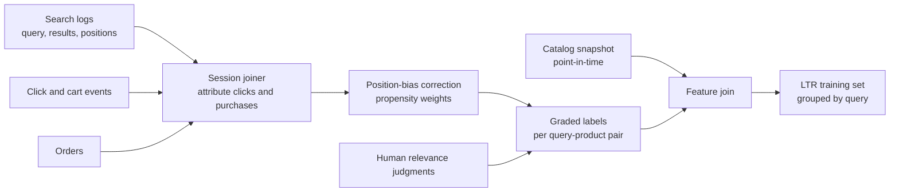
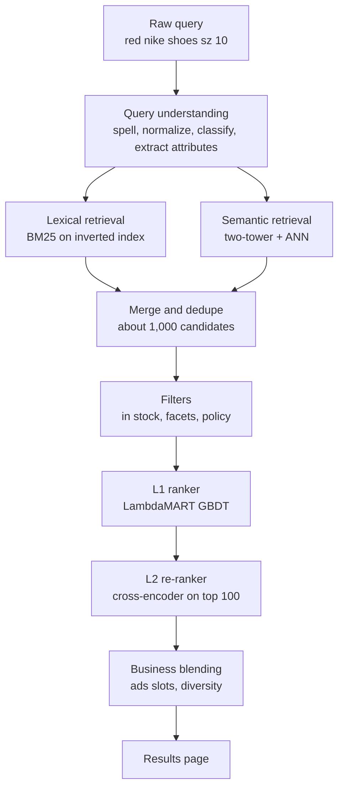
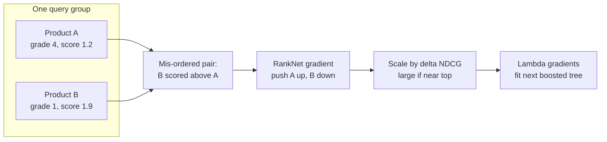
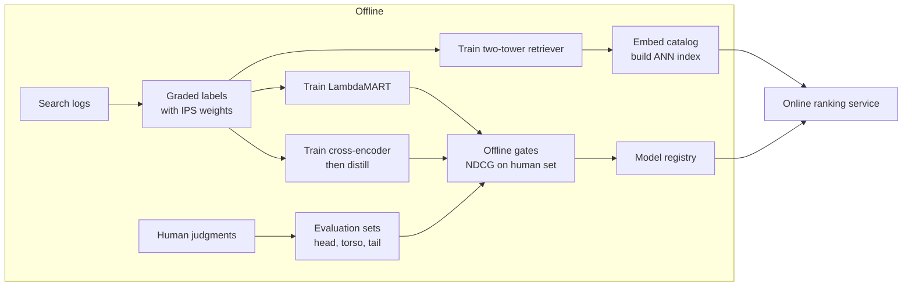
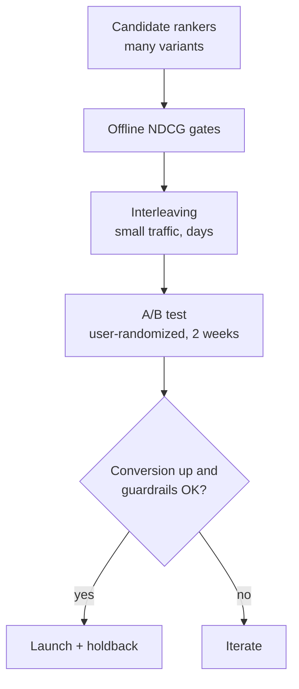
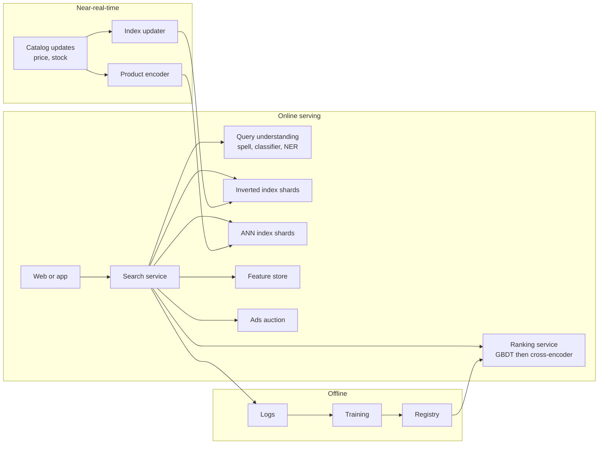
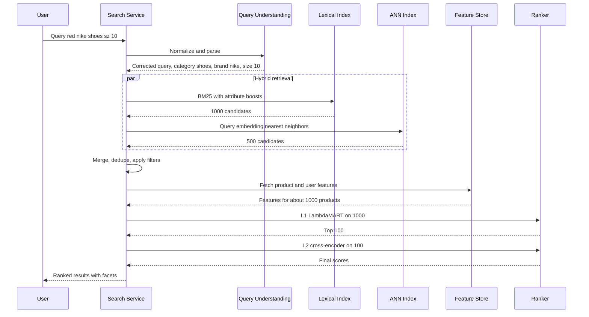

# Case study 3 — E-commerce product search

> **Interview prompt:** "Design the product search system for a large e-commerce site.
> A user types a query; return the most relevant products, ranked, in under 200 ms."

**Modules this case study exercises:**
[M04 Evaluation & data](../modules/04-evaluation-and-data.md) ·
[M05 Trees & ensembles](../modules/05-trees-and-ensembles.md) ·
[M08 Embeddings & transformers](../modules/08-embeddings-and-transformers.md) ·
[M09 Recommendation & ranking](../modules/09-recommendation-and-ranking.md) ·
[M10 Design framework](../system-design/10-ml-system-design-framework.md) ·
[M12 Serving, monitoring & experimentation](../system-design/12-serving-monitoring-experimentation.md)

**What makes this problem special:**

1. **Explicit intent.** Unlike a feed, the user tells you what they want — but in 2–3
   ambiguous words ("apple charger", "red dress size 8", "gift for dad").
2. **Relevance is a hard constraint, engagement is the objective.** Showing an
   irrelevant but popular product damages trust far more than in a feed.
3. **Labels are implicit and biased.** Clicks and purchases come from what we *showed*,
   at the positions we showed them.
4. **Hybrid retrieval.** Exact tokens (model numbers, brands) need lexical matching;
   paraphrases ("couch" vs "sofa") need semantic matching. You need both.

> **Why this matters:** Search is the clearest example of **learning to rank**. The
> interviewer wants to hear: query understanding → hybrid retrieval → LTR with a listwise
> objective → NDCG offline → interleaving / A/B online → position-bias correction of
> click labels. Each of those is a scoring checkpoint.

---

## 1. Clarify requirements

| Question | Assumed answer |
|---|---|
| Catalog size? | ~500M products (SKUs), ~1M new/updated per day. |
| Traffic? | ~300M searches/day. |
| Business goal? | Maximize purchases / GMV from search while keeping results relevant. |
| Personalization? | Light personalization (location, past brands, size) on top of relevance. |
| Sponsored products? | Mixed in by a separate ads auction; out of scope except for slot blending. |
| Languages? | Multiple locales; start with one. |
| Latency? | p99 < 200 ms server-side. |
| Extras? | Spelling correction, autocomplete, filters/facets. |

**Functional:** query → ranked list of products with facets; spelling correction;
autocomplete; respect filters (price, brand, in-stock), availability, and seller rules.

**Non-functional:** p99 < 200 ms; index freshness for price/stock in seconds to minutes;
new products searchable within ~15 minutes; high availability (search down = revenue down).

### Back-of-envelope numbers

| Quantity | Estimate | Reasoning |
|---|---|---|
| Average QPS | ~3,500 | $3\times10^8 / 86{,}400$ |
| Peak QPS | ~15,000 | holidays, ~4× |
| Autocomplete QPS | ~5× search QPS | one request per keystroke (debounced) |
| Catalog embeddings | 500M × 256 dims × 1 byte (PQ/int8) ≈ 128 GB | sharded ANN index |
| Inverted index | ~1–2 TB | sharded across nodes |
| Candidates per query | ~1,000 lexical + ~500 semantic → ~1,000 after merge | |
| LTR scoring | 1,000 candidates by GBDT, top 100 by neural re-ranker | |
| Training logs | 300M queries × ~20 impressions ≈ 6B impression rows/day | |

---

## 2. Frame as an ML problem

**Business objective:** maximize search conversion (purchases per search) and GMV,
subject to relevance quality and latency.

**ML objective:** learn a scoring function $f(q, d, u)$ for query $q$, product
(document) $d$, user $u$ such that sorting by $f$ maximizes a ranking metric like
NDCG computed on graded relevance labels.

**Labels (graded relevance):**

| Grade | Signal |
|---|---|
| 4 | Purchased after this search |
| 3 | Added to cart |
| 2 | Clicked and dwelled / viewed details |
| 1 | Shown, not clicked (weak negative, position-dependent) |
| 0 | Human-judged irrelevant |

Plus a **human-rated relevance set** (query, product, rating on an "exact / substitute /
complement / irrelevant" scale) used for evaluation and as training signal for the
relevance model. Behavioral labels capture what people *want*; human labels guarantee the
results are *relevant*.

**Input → output:** (query string, user context, filters) → ranked list of product IDs.

> **Common mistake:** Using only purchases as labels. Purchases are sparse (most queries
> have none), and optimizing purely for them promotes cheap, popular items for every query
> ("phone" → phone cases). Combine graded engagement with human relevance labels.

---

## 3. Data

**Sources:** search logs (query, results shown, positions, clicks, add-to-cart,
purchases), catalog (title, description, attributes, category, brand, images, price,
stock), seller data (ratings, fulfillment), user history, and human relevance judgments.

**Attribution:** a purchase is credited to the search if the product was clicked from that
result page within the session (e.g. 24 h). Multiple searches in a session ("shoes" →
"nike running shoes") are linked; the last search gets most credit.

**Position bias.** A product at position 1 gets clicked far more than at position 10 even
when equally relevant. Model clicks as:

$$
P(\text{click} \mid q, d, k) = \underbrace{P(\text{examined} \mid k)}_{\theta_k\text{ (propensity)}} \cdot \underbrace{P(\text{relevant} \mid q,d)}_{\text{what we want}}
$$

where $k$ is the position. Estimate $\theta_k$ with small **randomization experiments**
(e.g. swap results at positions $k$ and $k'$ for a tiny traffic slice) or with EM on
logs, then weight each clicked example by $1/\theta_k$ (inverse propensity scoring, IPS).
Worked number: if $\theta_1 = 0.9$ and $\theta_{10} = 0.15$, a click at position 10
counts $0.9/0.15 = 6\times$ as much evidence of relevance as a click at position 1.

**Sampling:** group training rows by query; keep queries with at least one positive;
sample head queries down so the top 1,000 queries don't dominate; keep tail queries
(most unique queries are tail).

**Human labeling:** sample queries stratified by traffic (head/torso/tail) and category;
raters follow written guidelines; measure inter-rater agreement; use LLM-assisted
labeling for scale, audited against human raters.

---

## 4. Features

| Feature | Type | Source | Online/offline | Freshness |
|---|---|---|---|---|
| BM25 score (title, description, attributes separately) | numeric | inverted index | online | real time |
| Semantic similarity $\cos(e_q, e_d)$ | numeric | two-tower model | online | query real time, product daily |
| Query–category match (predicted category = product category) | numeric | query classifier | online | real time |
| Attribute match (brand, color, size extracted from query) | boolean/numeric | query parser + catalog | online | real time |
| Product CTR / conversion rate for this query (smoothed) | numeric | logs, batch | offline → online | daily |
| Product overall popularity, sales velocity | numeric | streaming | online | minutes |
| Price, discount, price relative to category median | numeric | catalog | online | minutes |
| In stock, delivery time to user location | numeric | inventory service | online | seconds |
| Rating, # reviews (smoothed) | numeric | reviews DB | offline → online | daily |
| Seller quality (return rate, fulfillment rate) | numeric | batch | offline → online | daily |
| Query features: length, specificity, head/tail | numeric | request | online | real time |
| User affinity to brand/category, past purchases | numeric | user profile | offline → online | hourly |
| Product image/text embedding | vector | content encoder | offline | at ingestion |

**Query-dependent** features (BM25, semantic similarity, attribute match) carry
relevance; **query-independent** features (popularity, rating, price) carry quality;
**user** features personalize. LTR models learn how to trade them off per query type.

> **Why this matters:** Query-product historical CTR is the strongest single feature for
> head queries and is useless for tail queries. This is why you need content-based
> features and semantic retrieval: they generalize to queries you have never seen.

---

## 5. Model

### End-to-end pipeline

### Query understanding

- **Normalization & spelling correction:** "nkie shoos" → "nike shoes". A noisy-channel
  model: choose correction $c$ maximizing $P(c)\,P(q \mid c)$, where $P(c)$ comes from
  a query language model and $P(q \mid c)$ from an edit/error model learned from
  query reformulation logs (users who typed X then immediately Y).
- **Query classification:** predict category distribution ("apple" → electronics 0.8,
  grocery 0.2) to boost matching categories and to route to category-specific rankers.
- **Attribute extraction (NER):** brand = nike, color = red, size = 10 — used as soft
  boosts or structured filters.
- **Query rewriting/expansion:** synonyms ("sofa" ↔ "couch"), learned from co-click data.

### Retrieval: hybrid lexical + semantic

| | Lexical (BM25) | Semantic (two-tower) |
|---|---|---|
| Strength | Exact tokens, model numbers, brands, rare terms | Synonyms, paraphrases, intent ("gift for dad") |
| Weakness | Vocabulary mismatch | Fuzzy on exact identifiers ("iPhone 15" vs "iPhone 14") |
| Index | Inverted index | ANN (HNSW / IVF-PQ) |
| Cost | Very cheap | Query encoder ~5–10 ms + ANN ~5 ms |

**BM25** scores term $t$ in product $d$ as

$$
\text{BM25}(q,d) = \sum_{t \in q} \text{IDF}(t)\cdot\frac{f(t,d)\,(k_1+1)}{f(t,d) + k_1\left(1 - b + b\,\frac{|d|}{\text{avgdl}}\right)}
$$

where $f(t,d)$ is term frequency, $|d|$ the field length, and $k_1 \approx 1.2$,
$b \approx 0.75$ control saturation and length normalization.

The **two-tower** model (see [M08](../modules/08-embeddings-and-transformers.md) and
[M09](../modules/09-recommendation-and-ranking.md)) encodes query and product separately;
trained with in-batch negatives and contrastive loss on (query, purchased product) pairs:

$$
\mathcal{L} = -\log \frac{\exp(\langle e_q, e_{d^+}\rangle/\tau)}{\sum_{d \in \text{batch}} \exp(\langle e_q, e_d\rangle/\tau)}
$$

Merge results from both retrievers (union, then dedupe), or fuse scores with reciprocal
rank fusion. Airbnb has published a detailed account of moving search ranking from GBDT
to neural networks ("Applying Deep Learning to Airbnb Search", KDD 2019) — a useful
reference for the pitfalls of this transition.

### Ranking: learning to rank

Three LTR families:

- **Pointwise:** predict each item's relevance independently (regression/classification).
  Simple, but ignores that only the *order* matters.
- **Pairwise:** learn $P(d_i \succ d_j)$ — RankNet's loss
  $\log(1 + e^{-(s_i - s_j)})$ for pairs where $d_i$ is more relevant.
- **Listwise / LambdaMART:** GBDT whose gradients (the "lambdas") are RankNet pairwise
  gradients scaled by $|\Delta \text{NDCG}_{ij}|$, the change in NDCG from swapping $i$ and $j$:

$$
\lambda_{ij} = \frac{-\sigma}{1 + e^{\sigma(s_i - s_j)}}\,\left|\Delta\text{NDCG}_{ij}\right|
$$

Swaps near the top of the list change NDCG a lot, so the model focuses its capacity there.

**Production choice:**

- **L1 ranker: LambdaMART (GBDT)** over ~1,000 candidates with ~200 features. Strong, fast
  (< 10 ms for 1,000 items), handles heterogeneous features, easy to debug. See
  [M05](../modules/05-trees-and-ensembles.md).
- **L2 re-ranker: neural** (e.g. a small BERT-style **cross-encoder** reading query and
  product title together, plus dense features) on the top ~100. Cross-encoders capture
  fine-grained token interactions that two-tower dot products cannot, at ~100× the cost —
  hence only on the top 100, distilled into a smaller model for latency.

**Blending:** interleave sponsored products into designated slots; apply diversity
(don't show 10 near-identical variants of the same product — group variants).

### Autocomplete (briefly)

Prefix → candidate completions from a trie of popular past queries, ranked by a small
model (popularity, freshness, personalization, predicted conversion). Must respond in
< 50 ms per keystroke; filter offensive completions; it also *shapes* queries, so it
improves search by steering users to well-served queries.

---

## 6. Training

- **Loss:** LambdaMART (NDCG-driven lambdas) for L1; listwise softmax cross-entropy or
  pairwise loss for the neural L2; contrastive loss for the two-tower retriever.
- **Labels:** graded engagement labels with IPS weights, mixed with human relevance labels.
  A practical approach: train on behavioral labels, **evaluate gates** on human labels.
- **Splits:** by time (train weeks 1–4, validate week 5) and **grouped by query** — never
  split a query's result list across train and test.
- **Negatives:** for the ranker, shown-but-not-clicked items (weighted by position);
  for retrieval, in-batch negatives plus **hard negatives** (BM25-retrieved but not
  clicked) so the model learns fine distinctions.
- **Retraining:** L1 GBDT weekly; retrieval embeddings weekly with daily product-tower
  refresh for new products; query-product CTR features daily.

> **Common mistake:** Random train/test split at the row level. The same query appears in
> both, with the same products, and the "query-product CTR" feature leaks the label.

---

## 7. Evaluation

### Offline metrics

**NDCG@K** (normalized discounted cumulative gain) — the standard graded ranking metric:

$$
\text{DCG@K} = \sum_{i=1}^{K} \frac{2^{\text{rel}_i} - 1}{\log_2(i+1)},\qquad
\text{NDCG@K} = \frac{\text{DCG@K}}{\text{IDCG@K}}
$$

where $\text{rel}_i$ is the grade of the item at position $i$ and IDCG is the DCG of the
ideal ordering. Worked example with grades in ranked order $[3, 0, 2]$:
DCG $= 7/1 + 0 + 3/2 = 8.5$; ideal $[3, 2, 0]$: IDCG $= 7 + 3/1.585 = 8.89$;
NDCG@3 $= 0.956$.

| Metric | Use |
|---|---|
| NDCG@10 on human-judged set | Relevance quality, the launch gate |
| NDCG@10 / MRR on IPS-weighted behavioral set | Predicts engagement |
| Recall@1000 of retrieval (purchased item in candidates?) | Retrieval quality — ranker can't fix what retrieval misses |
| Null/low-result rate | Coverage of tail queries |
| Slices: head/torso/tail queries, category, locale | Hidden regressions |

### Online metrics

- **Primary:** conversion rate per search, GMV per search.
- **Secondary:** CTR, add-to-cart rate, **time to first click**, mean reciprocal rank of
  clicks, query reformulation rate (lower = better), zero-result rate,
  **abandonment rate** (search with no click).
- **Guardrails:** latency p99, revenue per search including ads, return rate (did we
  sell the wrong thing?), seller-side fairness.

### Interleaving and A/B

**Interleaving** (e.g. team-draft): merge the results of rankers A and B into one list,
alternating picks; attribute each click to the ranker that contributed the item. The
ranker with more clicks wins. Because each user compares both rankers on the *same* query,
variance is far lower — interleaving typically needs 10–100× less traffic than A/B to
detect a preference. Use it as a **fast filter** for many ranker variants, then confirm
winners with a full **A/B test** on business metrics (conversion, GMV), which interleaving
cannot measure.

A/B design: randomize by **user** (not by query), so a user's session is consistent; run
two weeks to cover weekly seasonality; avoid holiday periods for baseline experiments.

---

## 8. Serving architecture

### Request-time sequence

### Latency budget

| Step | p99 budget |
|---|---|
| Gateway + request parsing | 10 ms |
| Query understanding (spell, classify, NER) | 15 ms |
| Query embedding (two-tower query tower) | 10 ms |
| Lexical + ANN retrieval (parallel) | 30 ms |
| Merge, dedupe, filters | 10 ms |
| Feature fetch for ~1,000 products | 25 ms |
| L1 LambdaMART on 1,000 | 10 ms |
| L2 cross-encoder on 100 (GPU, distilled) | 40 ms |
| Blending, ads, hydration | 20 ms |
| Headroom | 30 ms |
| **Total** | **200 ms** |

**Caching:** head queries (top ~10K cover a large share of traffic) cache retrieval
results for minutes; personalization is applied after the cache. **Degradation:** skip
L2 under load; fall back to lexical-only if ANN is unavailable.

---

## 9. Monitoring & iteration

- **Query health:** zero-result rate, reformulation rate, abandonment, per query segment.
- **Index health:** freshness lag for price/stock, % of catalog embedded, index size.
- **Model health:** score distributions, feature null rates, training/serving skew.
- **Relevance audits:** weekly human evaluation of a random query sample; LLM-assisted
  judgments on larger samples with human spot checks.
- **Feedback loops:** popular products get more clicks, more CTR, more rank — new products
  starve. Use exploration slots and content features that don't depend on history.

### Failure modes

| Symptom | Likely cause | Mitigation |
|---|---|---|
| "iphone 15" returns iPhone 14 cases | Semantic retrieval fuzzy on identifiers; popularity dominating | Lexical exact-match features, attribute match, accessory-intent classifier |
| New products never rank | Cold start: no CTR history | Content/semantic features, smoothed priors, exploration slots |
| NDCG up offline, conversion flat online | Position bias in labels; metric mismatch | IPS weighting, human-labeled eval set, interleaving |
| Out-of-stock items at top | Stale inventory features | Near-real-time stock updates, hard filter at serving |
| Tail queries return nothing | Lexical vocabulary mismatch | Semantic retrieval, query relaxation (drop least important term) |
| Spell correction "fixes" brand names | Error model not aware of catalog vocabulary | Catalog-aware dictionary, don't correct high-confidence catalog tokens |
| Holiday spike breaks latency | Cache misses on new trending queries | Autoscaling, precomputed results for predicted trending queries |
| Ranker learns to promote clickbait titles | Click label rewards curiosity, not purchase | Graded labels weighted toward purchase, return-rate guardrail |

---

## 10. Trade-offs & extensions

| Decision | Options | Recommendation |
|---|---|---|
| Retrieval | Lexical only / semantic only / hybrid | Hybrid: complementary failure modes |
| L1 ranker | GBDT LambdaMART vs neural | GBDT first (strong baseline, fast); neural once features and data mature |
| L2 | Two-tower vs cross-encoder | Cross-encoder on top 100 (accuracy), distilled for latency |
| Labels | Clicks / purchases / human | Graded behavioral with IPS + human labels as the gate |
| Personalization | None / light / heavy | Light: relevance first, personalization breaks ties |
| Online eval | Interleaving vs A/B | Interleaving to filter, A/B to decide |

**Extensions:** conversational/LLM-assisted search ("what should I buy for camping in
the rain?"); multimodal search by image; query-dependent re-ranking for diversity (show
several brands for "running shoes"); learning from returns as negative labels;
multilingual retrieval with shared embeddings.

---

## 11. Interviewer follow-ups

Q1. Why hybrid retrieval rather than just embeddings?

Embeddings excel at semantics but blur exact identifiers: "iPhone 15 Pro case" and
"iPhone 14 Pro case" are nearly identical vectors, yet only one is correct. BM25 nails
exact tokens, model numbers, and rare brand names, but fails on vocabulary mismatch
("couch" vs "sofa"). Their errors are complementary, so union their candidates and let the
ranker, which sees both BM25 and cosine features, decide.

Q2. Explain LambdaMART in one minute.

It's gradient-boosted trees trained with "lambda" gradients instead of a loss's gradient.
For each pair of products in the same query where the more relevant one is scored lower,
compute the RankNet gradient pushing them apart, then multiply by how much NDCG would
change if they were swapped. Sum per product to get its lambda, and fit the next tree to
those lambdas. It directly targets the top of the ranking, which pointwise regression does not.

Q3. How do you get unbiased relevance labels from clicks?

Clicks depend on both relevance and examination probability, which falls with position.
Estimate the per-position propensity $\theta_k$ via small result-randomization experiments
or EM on logs, then weight clicked examples by $1/\theta_k$. Also use dwell/add-to-cart to
filter misclicks, treat skipped items above a click as stronger negatives, and keep a
human-labeled set for evaluation since it has no position bias.

Q4. Why NDCG and not accuracy or AUC?

Users only look at the top few results, and relevance is graded. NDCG rewards putting the
most relevant items first with a log discount by position and normalizes per query, so
queries with many relevant items don't dominate. AUC treats all mis-ordered pairs equally
regardless of position, which doesn't match user behavior.

Q5. What is interleaving and when would you use it instead of A/B?

Interleaving merges two rankers' lists into one for the same user and query and credits
clicks to the contributing ranker. Because it is a within-user paired comparison, it's far
more sensitive than A/B and needs much less traffic. I'd use it to quickly prune many ranker
variants, but launch decisions need an A/B test because only A/B measures conversion, GMV,
and guardrails for the whole experience.

Q6. How do you handle a query you've never seen before?

Most queries are tail queries. Query understanding still works (spelling, category
classification, attribute extraction); semantic retrieval generalizes via embeddings; and
ranking features like BM25, attribute match and product quality don't need query
history. Query relaxation (drop the least informative term) prevents zero results.

Q7. Should the ranker be personalized?

Lightly. Relevance to the query dominates — two users searching "laptop" both want
laptops. Personalization helps break ties: preferred brands, sizes, price range, delivery
location. Over-personalizing narrows results and hurts discovery, and it complicates
caching. I'd add user features to the L1 model and measure lift per segment.

Q8. How do you blend sponsored products without hurting relevance?

Ads come from a separate auction with their own relevance threshold (an ad must pass a
minimum relevance score for the query). They go into fixed slots or compete with organic
results on a common scale such as expected value = relevance-adjusted revenue. Guardrails
on organic conversion and relevance audits prevent ads from degrading the experience.

Q9. How does spelling correction work and how can it fail?

A noisy-channel model picks the correction $c$ maximizing $P(c)P(q \mid c)$: a language
model over past successful queries and an error model learned from reformulation pairs
(typed X, then immediately Y). It fails on rare brands or new products that look like
typos, so make the dictionary catalog-aware, show "showing results for X, search instead
for Y", and monitor click-through on corrected queries.

---

**Further reading:** Burges, "From RankNet to LambdaRank to LambdaMART: An Overview"
(2010); Joachims et al., "Unbiased Learning-to-Rank with Biased Feedback" (WSDM 2017);
Haldar et al., "Applying Deep Learning to Airbnb Search" (KDD 2019); Chapelle et al.,
"Large-Scale Validation and Analysis of Interleaved Search Evaluation" (2012);
Robertson & Zaragoza, "The Probabilistic Relevance Framework: BM25 and Beyond" (2009).
