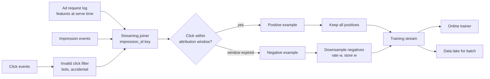
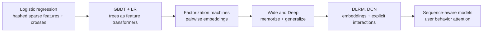
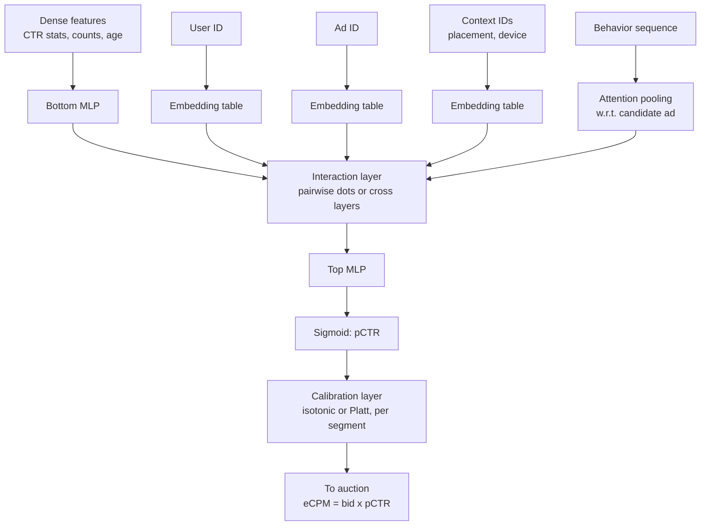
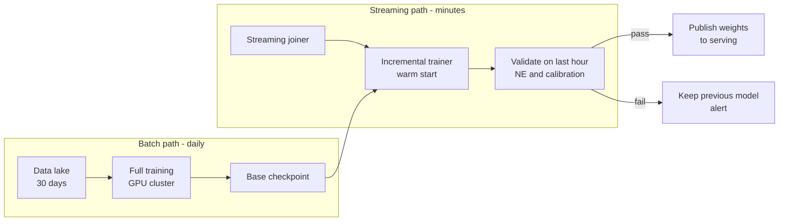
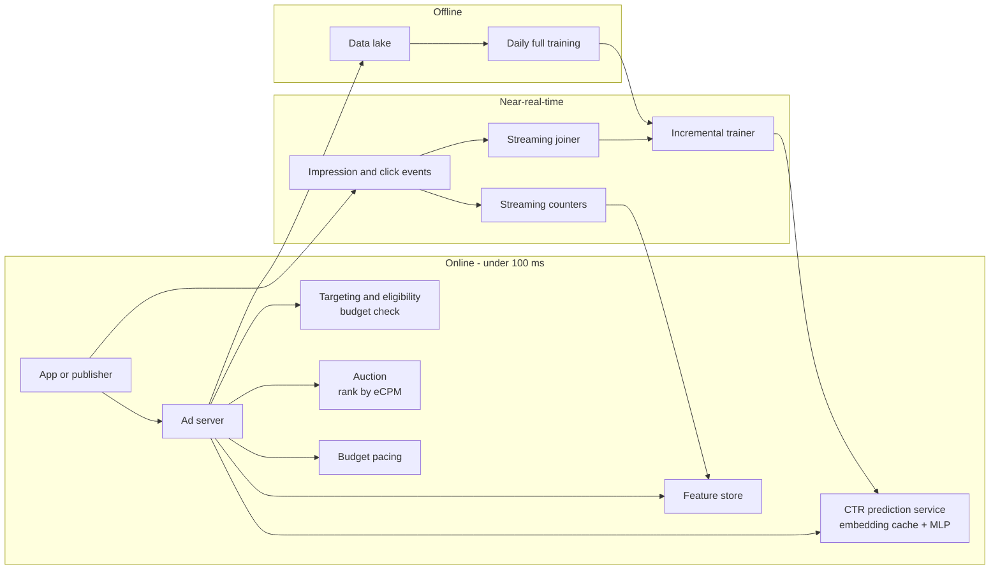
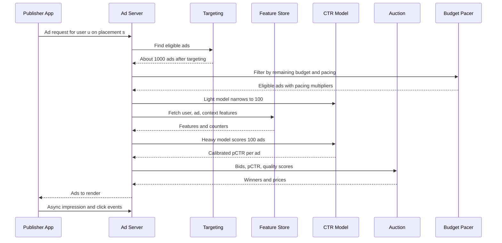

# Case study 4 — Ad click-through-rate (CTR) prediction

> **Interview prompt:** "Design the system that predicts the probability a user clicks
> an ad, used by our ad auction to decide which ads to show."

**Modules this case study exercises:**
[M04 Evaluation & data](../modules/04-evaluation-and-data.md) ·
[M05 Trees & ensembles](../modules/05-trees-and-ensembles.md) ·
[M08 Embeddings & transformers](../modules/08-embeddings-and-transformers.md) ·
[M09 Recommendation & ranking](../modules/09-recommendation-and-ranking.md) ·
[M10 Design framework](../system-design/10-ml-system-design-framework.md) ·
[M11 Data & training infra](../system-design/11-data-and-training-infrastructure.md) ·
[M12 Serving, monitoring & experimentation](../system-design/12-serving-monitoring-experimentation.md)

**What makes this problem special:**

1. **The prediction is a price input.** pCTR multiplies the bid to decide who wins and
   what they pay. A ranking-only model is not enough: **the number itself must be right**
   (calibration).
2. **Massive sparse categorical features** — user IDs, ad IDs, advertiser IDs, query
   tokens, sites — with billions of distinct values.
3. **Freshness** — new ads and campaigns appear constantly; a model that's a day old
   measurably loses money. Online learning is common.
4. **Extreme scale** — millions of predictions per second, tens of milliseconds.

> **Why this matters:** Ads CTR is the classic interview for **calibration**, **sparse
> features**, and **negative downsampling**. If you only say "train a deep model and
> maximize AUC", you've missed the core of the problem: a model with great AUC but 20%
> over-prediction makes every advertiser overpay.

---

## 1. Clarify requirements

| Question | Assumed answer |
|---|---|
| Ad surface? | Ads in a social feed and on a search results page (one model family, surface as a feature). |
| Pricing? | Cost-per-click (CPC) bidding with a generalized second-price (or similar) auction. |
| What's predicted? | $P(\text{click} \mid \text{user, ad, context})$; conversion prediction is a related downstream model. |
| Scale? | 10B ad requests/day, ~100 candidate ads scored per request. |
| Latency? | Whole ad request p99 < 100 ms; CTR model gets ~20 ms. |
| Freshness? | New ads must be served within minutes; model updates hourly or faster. |
| Privacy? | Respect consent, regional regulation, limited cross-site tracking. |

**Functional:** given an ad request (user, context, eligible candidate ads), return a
calibrated pCTR per ad to the auction; log impressions and clicks; support new ads with no
history.

**Non-functional:** very high throughput, p99 ≤ 20 ms for scoring, calibration error
within ~1–2% overall and per major segment, high availability (no ads = no revenue).

### Back-of-envelope numbers

| Quantity | Estimate | Reasoning |
|---|---|---|
| Ad requests/day | $10^{10}$ | |
| Average request QPS | ~115,000 | $10^{10}/86{,}400$ |
| Peak request QPS | ~350,000 | ~3× |
| Ads scored per request | ~100 (after retrieval of ~1,000 eligible) | |
| Model predictions/sec (peak) | $3.5\times10^5 \times 100 = 3.5\times10^7$ | |
| Impressions/day (shown ads) | ~$3\times10^{10}$ | ~3 ads per request |
| Clicks/day at 1% CTR | ~$3\times10^8$ | |
| Training rows/day before sampling | ~$3\times10^{10}$ | |
| After keeping all clicks + 5% of non-clicks | ~$1.8\times10^9$ | $3\times10^8 + 0.05\times 2.97\times10^{10}$ |
| Embedding table size | 10B hashed IDs × 32 dims × 4 bytes ≈ 1.3 TB | sharded parameter servers; this is why hashing and pruning matter |

---

## 2. Frame as an ML problem

### Auction context

Ads are ranked by **expected value to the platform per impression**, the effective cost
per mille (eCPM):

$$
\text{eCPM} = \text{bid} \times \text{pCTR} \times 1000
$$

(plus, in practice, a quality/user-experience term). The winner's price in a
second-price-style auction is the minimum CPC needed to keep its rank:

$$
\text{CPC}_1 = \frac{\text{bid}_2 \cdot \text{pCTR}_2}{\text{pCTR}_1}
$$

Worked example:

| Ad | Bid (CPC) | pCTR | eCPM |
|---|---|---|---|
| A | \$2.00 | 1.0% | \$20 |
| B | \$1.00 | 2.5% | \$25 |
| C | \$4.00 | 0.4% | \$16 |

B wins despite the lowest bid, and pays $2.00 \times 0.010 / 0.025 = \$0.80$ per click.

### Why calibration is critical

- If pCTR is **2× too high for ad B only**, B wins auctions it shouldn't and is charged
  based on inflated estimates; advertisers see poor ROI and lower bids.
- If pCTR is **uniformly 2× too high**, rankings among CPC ads don't change, but comparisons
  with **other bid types** (CPM ads, conversion-optimized ads, organic content) break, and
  reserve prices and budget pacing misfire.
- AUC is invariant to any monotonic transformation of scores, so it **cannot detect**
  either problem.

**ML objective:** minimize log-loss (which rewards both discrimination and calibration) of
$P(\text{click}=1 \mid x)$, with calibration $\sum \hat p / \sum y \approx 1$ globally and
per segment.

**Label:** click within a short window (e.g. 15–30 min) of the impression. Filter
**invalid clicks** (bots, accidental clicks with sub-second bounce).

> **Common mistake:** Treating CTR prediction as a ranking problem and reporting only AUC.
> In ads, a 0.5% AUC gain with a 10% calibration error is usually a net revenue loss.

---

## 3. Data

**Sources:** ad request logs (user, context, candidates), impression logs (which ads were
shown, position), click logs, conversion logs, ad metadata (creative, advertiser,
campaign, targeting), user profile/interest data (subject to consent).

**Streaming join:** impressions are held in a join buffer for the attribution window; if
a click arrives, emit a positive; when the window closes, emit a negative. The window is a
trade-off: longer = more complete labels, shorter = fresher training data. Late clicks
after emitting a negative create **false negatives**; correct either by a delayed-feedback
model or by a small label-correction term.

**Negative downsampling.** With 1% CTR, 99% of rows are non-clicks. Keep all clicks and a
fraction $w$ (e.g. 5%) of non-clicks: cheaper training, faster iteration, little accuracy
loss. Facebook's "Practical Lessons from Predicting Clicks on Ads at Facebook" (ADKDD 2014)
reports that negative downsampling with rates around 2.5–10% had little effect on
normalized entropy while cutting training cost substantially.

**Recalibration after downsampling.** The model trained on sampled data predicts $p_s$
with odds inflated by $1/w$. Correct with

$$
p = \frac{p_s}{p_s + \dfrac{1 - p_s}{w}}
$$

Worked number: $w = 0.05$, model output $p_s = 0.17$:
$p = 0.17 / (0.17 + 0.83/0.05) = 0.17 / 16.77 \approx 0.0101$ — about 1%.

> **Why this matters:** Forgetting this formula is the single most common bug in CTR
> systems. Offline AUC is unchanged by it, so nothing looks wrong until advertisers' bills
> are 20× too high.

**Position and presentation bias:** ads in top slots get more clicks. Include position as a
training feature and set it to a fixed value at serving (then auction-side position
effects are modeled separately), or factorize pCTR into $P(\text{seen} \mid \text{pos}) \cdot P(\text{click} \mid \text{seen}, x)$.

**Privacy:** honour consent and regional regulations; aggregate or coarsen sensitive
features; prefer on-platform contextual and first-party signals; no targeting on
sensitive categories.

---

## 4. Features

| Feature | Type | Source | Online/offline | Freshness |
|---|---|---|---|---|
| User ID | sparse categorical (~$10^9$) | request | online → embedding | embedding updated continuously |
| Ad ID, creative ID, campaign ID, advertiser ID | sparse categorical (~$10^8$) | ad DB | online → embedding | minutes |
| Publisher / placement / surface / slot position | categorical | request | online | real time |
| Device, OS, connection, hour-of-day, day-of-week | categorical | request | online | real time |
| Query tokens / page topic (search, content ads) | sparse multi-hot | request | online | real time |
| User interest categories (from history) | sparse multi-hot | batch | offline → online | daily |
| User's last N clicked ad categories | ID sequence | streaming | online | seconds |
| Ad historical CTR (smoothed) | numeric | streaming counters | online | minutes |
| Advertiser historical CTR | numeric | batch | offline → online | hourly |
| User × ad-category historical CTR | numeric (cross) | batch | offline → online | daily |
| Creative embeddings (image/text encoder) | dense | content model | at ad creation | static |
| Ad age, # impressions so far | numeric | ad DB | online | minutes |
| User frequency: # times seen this ad today | numeric | streaming | online | seconds |

### Handling high-cardinality sparse features

- **One-hot is infeasible** at $10^9$ values, so use the **hashing trick**: map
  $\text{feature} \to h(\text{feature}) \bmod M$ into $M$ buckets (e.g. $M = 2^{24}$ per
  field). Collisions add noise; with reasonable $M$ the accuracy loss is small, and there
  is no dictionary to maintain — new IDs work immediately.
- **Embeddings:** each bucket maps to a learned dense vector (8–64 dims). Learned on
  sparse rows: only the embeddings of present features get gradient updates per example.
- **Frequency thresholds / pruning:** IDs seen fewer than $n$ times share an "OOV" embedding,
  which reduces memory and overfitting on rare IDs.
- **Feature crosses:** e.g. (user country × advertiser), (query token × ad category). Either
  explicit hashed crosses (for linear models) or learned by the network (DCN, FM).

> **Common mistake:** Using raw historical CTR without smoothing. An ad with 1 click in 2
> impressions has 50% CTR. Use a Bayesian prior:
> $\widehat{\text{CTR}} = (\text{clicks} + \alpha)/(\text{imps} + \alpha + \beta)$,
> with $\alpha/(\alpha+\beta)$ = the category-average CTR.

---

## 5. Model

### Historical progression (this is a great structure for your answer)

1. **Logistic regression with hashed features and manual crosses.** Fast, scales to
   billions of features, easy online updates (FTRL-Proximal, published by Google in
   "Ad Click Prediction: a View from the Trenches", KDD 2013), naturally calibrated-ish.
   Weakness: interactions must be hand-engineered.
2. **GBDT + LR** (Facebook, 2014): train boosted trees on dense features; each tree's
   leaf index becomes a categorical feature for a logistic regression. Trees learn
   non-linear transforms and crosses automatically; LR retrains frequently for freshness
   while trees retrain daily. See [M05](../modules/05-trees-and-ensembles.md).
3. **Factorization machines:** model every pairwise interaction as a dot product of
   embeddings: $\hat y = w_0 + \sum_i w_i x_i + \sum_{i<j} \langle v_i, v_j\rangle x_i x_j$ —
   generalizes to pairs never seen together.
4. **Wide & Deep** (Google, 2016): a wide linear part memorizes specific crosses; a deep
   MLP over embeddings generalizes. Trained jointly.
5. **DLRM** (Facebook/Meta, 2019) and **DCN / DCN-v2** (Google, 2017/2020): sparse
   features → embeddings; dense features → bottom MLP; explicit interaction layer
   (pairwise dot products in DLRM, cross layers in DCN) → top MLP → sigmoid.

### Production model: DLRM / DCN-style

DCN's cross layer explicitly builds bounded-degree feature interactions:
$x_{l+1} = x_0 \odot (W_l x_l + b_l) + x_l$, so each layer raises the interaction order
by one at little cost. Most of the parameters (terabytes) live in the **embedding tables**,
and the MLPs are small; this shapes the infrastructure (sharded embedding servers, see
[M11](../system-design/11-data-and-training-infrastructure.md)).

**Calibration layer.** Even a log-loss-trained model drifts in calibration (sampling,
distribution shift, feature outages). A final **isotonic regression** or Platt scaling
fitted on recent unsampled traffic, optionally per segment (surface, country), keeps
$\sum \hat p / \sum y \approx 1$.

**Multi-stage:** a lightweight model (two-tower or small LR) first narrows ~1,000 eligible
ads (passing targeting and budget) to ~100 for the heavy model. Conversion models
(pCVR) are trained separately for conversion-optimized bidding:
$\text{eCPM} = \text{bid}_{\text{CPA}} \times \text{pCTR} \times \text{pCVR}$.

---

## 6. Training

- **Loss:** binary cross-entropy (log-loss). It's a proper scoring rule: minimized exactly
  by the true probability, which is what an auction needs.
- **Data:** all clicks + downsampled non-clicks, with the sampling rate recorded and the
  recalibration formula applied at serving (or weights $1/w$ during training).
- **Split:** strictly by time: train on days $1..T$, evaluate on day $T+1$. Online
  evaluation on the next hour's traffic ("progressive validation": score each example
  before training on it).
- **Online learning & freshness:** Facebook (2014) reported that model performance
  degrades measurably as the gap between training and serving grows from one day to a week,
  motivating daily-or-faster retraining. Practical setup:
  - **Daily (or weekly) full retrain** of the deep model on 30+ days.
  - **Continuous incremental training** from the streaming joiner — warm-start from the
    latest checkpoint and push updated weights (especially embeddings and the top layers)
    every 10–60 minutes.
  - Guard each push with automated validation (log-loss on a recent holdout, calibration
    ratio within bounds); otherwise keep the previous model.
- **New ads (cold start):** hashed ID embeddings start near zero, so the model relies on
  generalizing features (advertiser, creative embedding, category); add an **exploration**
  bonus or reserved traffic so new ads collect impressions.
- **Regularization:** L2 or frequency-adaptive regularization on embeddings; dropout in MLPs;
  early stopping on time-ordered validation. One epoch is common because data is
  non-stationary and huge (multi-epoch training can overfit embeddings).

---

## 7. Evaluation

### Offline metrics

**Normalized cross-entropy (NE)**, the metric used in the Facebook 2014 paper:

$$
\text{NE} = \frac{-\frac{1}{N}\sum_{i=1}^{N} \big[y_i \log \hat p_i + (1-y_i)\log(1-\hat p_i)\big]}
{-\big[\bar p \log \bar p + (1-\bar p)\log(1-\bar p)\big]}
$$

where $\bar p$ is the average empirical CTR of the evaluation set. The denominator is the
log-loss of a model that always predicts the background CTR, so **NE < 1 means better than
the prior**; lower is better. Normalizing makes NE comparable across datasets with
different base CTRs (a raw log-loss of 0.05 is great at 1% CTR and terrible at 0.1%).

Worked number: CTR $\bar p = 0.01$ → denominator $= -(0.01\ln 0.01 + 0.99 \ln 0.99) \approx 0.056$.
A model with log-loss $0.050$ has NE $= 0.050/0.056 \approx 0.89$.

| Metric | Why |
|---|---|
| **NE / log-loss** | Discrimination *and* calibration; primary launch gate |
| **Calibration ratio** $\sum \hat p / \sum y$ | Must be ~1.0 overall and per segment (surface, country, ad type, new ads) |
| Reliability diagram | Calibration across the score range, not just on average |
| AUC | Ranking quality, secondary |
| Slices: new ads, new users, small advertisers | Cold-start regressions |

Small NE improvements matter: at this scale a **0.1–0.2% relative NE gain** is often
considered significant and can be worth a meaningful revenue change.

### Online metrics

- **Platform:** revenue per mille (RPM), total revenue.
- **Advertiser:** CTR, conversion rate, cost per click/acquisition, advertiser ROI and retention.
- **User:** ad hides/reports, ad load tolerance, engagement with organic content.
- **Model health:** online calibration ratio per hour and segment.

### Guardrails

- Calibration ratio within $[0.97, 1.03]$ overall and per major segment.
- Latency p99, error rate.
- User negative feedback on ads, organic engagement (ads shouldn't hurt the core product).
- Advertiser spend distribution (no sudden shifts for a subset of advertisers).

### A/B testing in a two-sided marketplace

- Randomizing **users** is standard, but treatment and control **share advertiser budgets**:
  if treatment spends budgets faster, control sees less competition (interference).
  Mitigations: **budget-split experiments** (split each advertiser's budget proportionally
  between arms) or advertiser-level randomization for advertiser-facing changes.
- Run long enough to cover budget pacing cycles (≥ 1–2 weeks) and to let advertiser
  bidding adapt.
- Report revenue **and** advertiser value — a short-term revenue gain from over-predicted
  CTR erodes advertiser bids over weeks.

> **Common mistake:** Concluding "revenue up 3%, ship it" without checking calibration.
> Over-predicting pCTR raises prices immediately; advertisers notice lower ROI later and cut bids.

---

## 8. Serving architecture

### Request-time sequence

### Latency budget

| Step | p99 budget |
|---|---|
| Request parsing, user lookup | 10 ms |
| Targeting / eligibility (indexes) | 15 ms |
| Budget pacing filter | 5 ms |
| Light model on ~1,000 | 10 ms |
| Feature fetch (user, ~100 ads) | 10 ms |
| Heavy CTR model on 100 (batched, embedding cache) | 20 ms |
| Calibration + auction | 5 ms |
| Response, creative hydration | 10 ms |
| Headroom | 15 ms |
| **Total** | **100 ms** |

**Embedding serving:** the hottest user/ad embeddings are cached in memory on prediction
hosts; the long tail is fetched from sharded embedding servers. Quantize embeddings
(fp16/int8) to cut memory 2–4×.

**Budget pacing (brief).** Advertisers set daily budgets; spending it all by 9 a.m.
is bad for the advertiser (missed evening users) and for the auction (less competition later).
A pacing controller (often a feedback controller) computes a per-campaign
**throttle probability** or **bid multiplier** so spend tracks a target curve over the day.
Pacing interacts with pCTR: over-predicted CTR spends budgets faster and makes pacing throttle harder.

---

## 9. Monitoring & iteration

- **Calibration dashboards:** $\sum \hat p / \sum y$ per hour × segment (surface, country,
  ad format, new ads). Alerts at ±3%.
- **Feature health:** missing/default rates, embedding-server hit rate, counter staleness.
- **Prediction drift:** distribution of pCTR, mean pCTR vs. trailing mean.
- **Business:** RPM, advertiser CPC/CPA trends, budget delivery rates.
- **Training health:** incremental update validation pass rate, data freshness lag of the joiner.

### Failure modes

| Symptom | Likely cause | Mitigation |
|---|---|---|
| CTR predictions ~20× too high | Forgot downsampling recalibration | Recalibration formula in serving, calibration-ratio gate before publish |
| Calibration drifts every afternoon | Daily seasonality, stale model | Hourly incremental updates, hour-of-day feature, per-hour calibration |
| New ads never win auctions | Cold start, near-zero ID embeddings | Content/advertiser features, exploration traffic, optimistic priors |
| Sudden revenue drop for one advertiser | Feature outage (e.g. missing creative embedding) defaulted to bad values | Feature null-rate alerts, training with feature dropout, safe defaults |
| Offline NE gain, revenue flat | Gain concentrated on low-bid ads that rarely win | Weight evaluation by auction impact (bid-weighted NE), auction replay simulation |
| Model overfits after multi-epoch training | Embeddings memorize rare IDs | One-epoch training, frequency thresholds, regularization |
| Bot clicks inflate CTR | Invalid traffic in labels | Invalid-click filtering before the joiner |
| Experiment arms interfere | Shared advertiser budgets | Budget-split experiments |
| Late clicks counted as negatives | Short attribution window | Delayed-feedback correction, tune window |

---

## 10. Trade-offs & extensions

| Decision | Options | Recommendation |
|---|---|---|
| Model | LR / GBDT+LR / DLRM-DCN | Start LR or GBDT+LR (strong, cheap, easy to update), move to DLRM/DCN with embedding infra |
| Freshness | Daily batch vs online learning | Both: daily full retrain + incremental updates every 10–60 min |
| Sparse IDs | Dictionary vs hashing | Hashing for scalability and new IDs; dictionary for the top-frequency IDs if collisions hurt |
| Sampling | Full data vs negative downsampling | Downsample negatives to ~5–10% and recalibrate |
| Calibration | Trust log-loss vs explicit calibration layer | Explicit isotonic/Platt layer per segment, monitored hourly |
| Objective | pCTR only vs pCTR × pCVR | Separate heads/models, combined according to bid type |

**Extensions:** multi-task CTR + CVR (sharing embeddings, e.g. ESMM-style to handle
conversion sample selection bias); user-behavior sequence attention; privacy-preserving
measurement and on-device signals; auto-bidding agents that use pCTR/pCVR to bid on the
advertiser's behalf; creative generation and selection.

---

## 11. Interviewer follow-ups

Q1. Why does calibration matter so much in ads?

Because pCTR is multiplied by the bid to rank ads and to compute prices. A ranking model
only needs the order right; an auction needs the **number** right. Per-ad miscalibration
changes who wins and overcharges advertisers; global miscalibration breaks comparisons with
CPM ads and organic content, reserve prices, and pacing. AUC can't see any of this since it
is invariant to monotonic transforms — so I gate on NE and calibration ratio, and keep an
explicit calibration layer.

Q2. Derive the recalibration formula for negative downsampling.

Downsampling negatives at rate $w$ leaves positives untouched and multiplies the count of
negatives by $w$, so the sampled odds are $\frac{p_s}{1-p_s} = \frac{1}{w}\cdot\frac{p}{1-p}$.
Solve for $p$: $\frac{p}{1-p} = w\frac{p_s}{1-p_s}$, giving
$p = \frac{w\,p_s}{w\,p_s + 1 - p_s} = \frac{p_s}{p_s + (1-p_s)/w}$.

Q3. What is normalized cross-entropy and why not raw log-loss?

NE is the model's average log-loss divided by the log-loss of always predicting the
background CTR. Raw log-loss depends heavily on the base rate, so comparing across days,
surfaces or countries with different CTRs is misleading. NE < 1 means the model adds
information over the prior; lower is better; and it still captures calibration, unlike AUC.

Q4. How do you deal with billions of user and ad IDs?

Hash each categorical field into a fixed number of buckets, and learn an embedding per
bucket. Hashing bounds memory and handles unseen IDs automatically; collisions add a little
noise. Prune or share embeddings for rare IDs (frequency threshold), quantize embeddings for
serving, and shard tables across parameter/embedding servers with caches for hot IDs.

Q5. Explain GBDT + LR and why it worked.

Train a GBDT on dense features; for each example, the leaf it lands in for each tree becomes
a one-hot categorical feature. Feed these (plus sparse features) into a logistic
regression. Each tree path is a learned conjunction of feature conditions — an automatically
discovered cross feature. The trees are retrained less often (daily) and the LR, which is
cheap, is updated frequently for freshness. Facebook's 2014 paper reported this hybrid
beat either component alone.

Q6. Why online learning, and what are the risks?

Ads change constantly (new campaigns, seasonal behavior, creative fatigue), and a stale
model loses NE measurably within hours to days. Incremental training from the streaming
joiner keeps embeddings for new ads fresh. Risks: a bad data batch (logging bug, bot attack)
immediately corrupts the model; feedback loops; drift in calibration. Mitigate with
validation gates on every push, automatic rollback, invalid-traffic filtering, and periodic
full retrains to reset accumulated drift.

Q7. How do you handle a brand-new ad?

Its ID embedding is untrained, so the model must generalize from advertiser, campaign,
category, creative image/text embeddings and targeting. Smoothed CTR priors from similar
ads replace historical CTR. Reserve exploration traffic (or an uncertainty-based bonus,
e.g. Thompson-sampling style) so it gets enough impressions to learn quickly, and monitor
calibration on the "new ads" slice specifically.

Q8. How would you A/B test a new CTR model?

First offline gates (NE, calibration per segment, auction replay). Then a shadow run to
compare predictions on live traffic. Then an A/B with budget-split design so arms don't
compete for the same advertiser budgets, for at least 1–2 weeks. Primary metric: revenue
plus advertiser value metrics (CPA, ROI); guardrails: calibration ratio, user ad feedback,
latency. Watch for revenue gains that come purely from over-prediction.

Q9. Where does budget pacing interact with the model?

Pacing decides whether a campaign participates (throttling) or scales its bid (bid shading)
to spread spend over the day. It relies on forecasts of spend, which depend on pCTR. If pCTR
is inflated, campaigns appear to win more and spend faster, so pacing throttles harder and
delivery becomes erratic. Accurate calibration makes pacing stable.

---

**Further reading:** He et al., "Practical Lessons from Predicting Clicks on Ads at
Facebook" (ADKDD 2014); McMahan et al., "Ad Click Prediction: a View from the Trenches"
(KDD 2013); Cheng et al., "Wide & Deep Learning for Recommender Systems" (2016);
Naumov et al., "Deep Learning Recommendation Model for Personalization and Recommendation
Systems" (DLRM, 2019); Wang et al., "Deep & Cross Network for Ad Click Predictions" (2017)
and "DCN V2" (2020); Rendle, "Factorization Machines" (2010).
