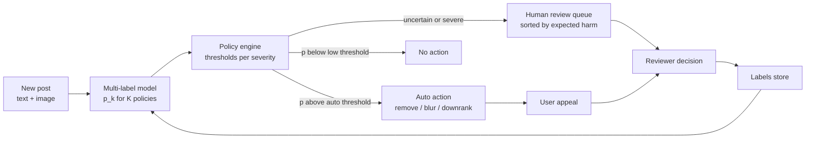
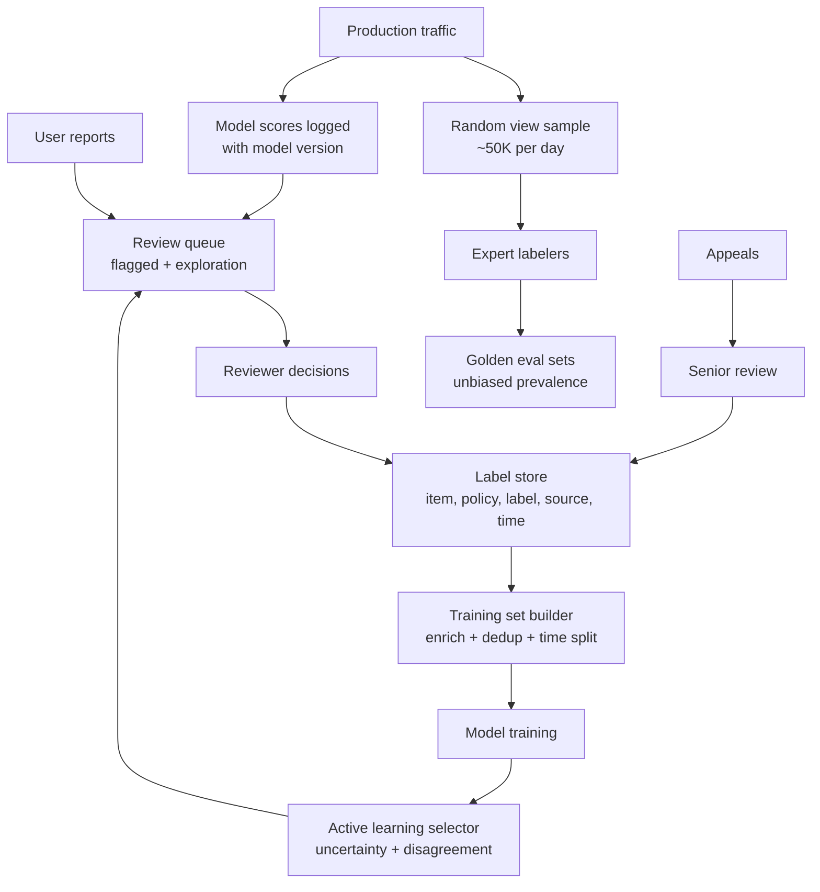
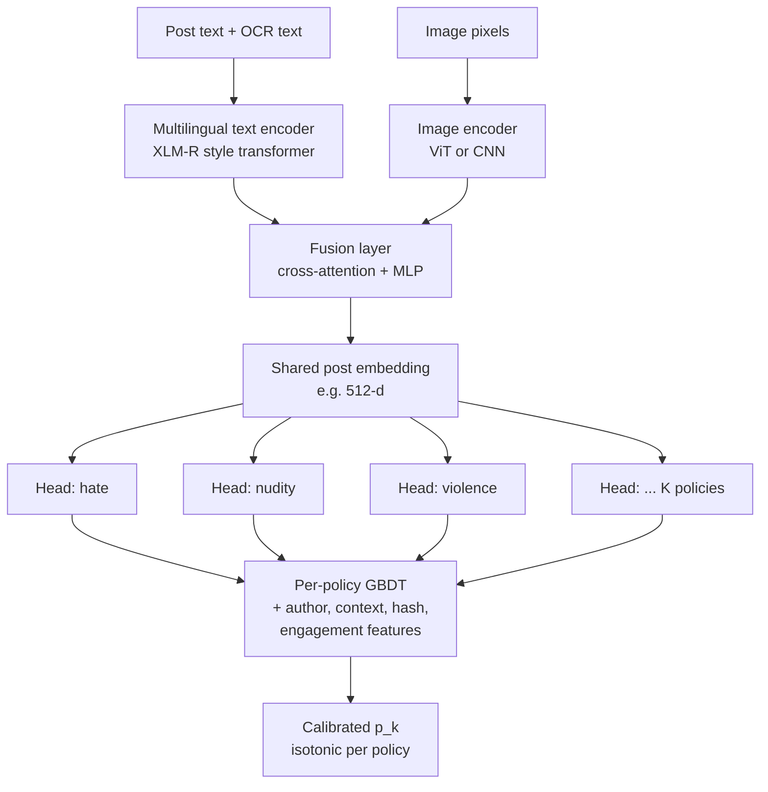
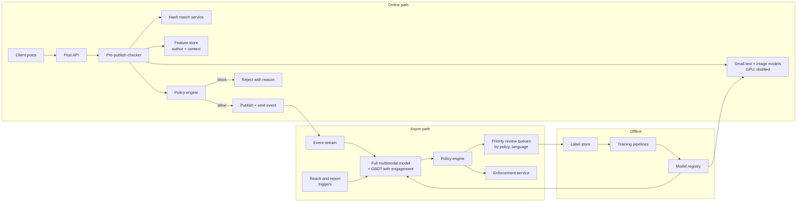
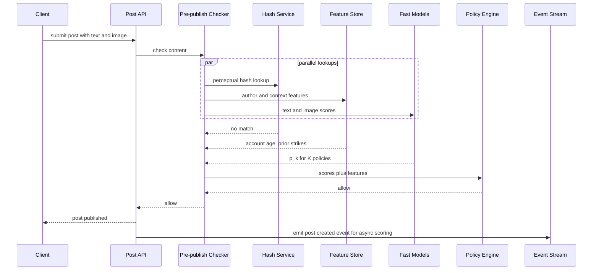

# Case study 5 — Harmful Content Detection

> **Interview prompt:** "Design a system that detects harmful content (hate speech, violence, nudity, spam, self-harm, etc.) on a large social platform. Posts can contain text and images, in many languages. How do you decide what to remove, what to send to human reviewers, and what to leave up?"

**Modules used:** [M04 Evaluation & data](../modules/04-evaluation-and-data.md) ·
[M05 Trees & ensembles](../modules/05-trees-and-ensembles.md) ·
[M07 Neural networks](../modules/07-neural-networks.md) ·
[M08 Embeddings & transformers](../modules/08-embeddings-and-transformers.md) ·
[M10 Framework](../system-design/10-ml-system-design-framework.md) ·
[M11 Data & training infra](../system-design/11-data-and-training-infrastructure.md) ·
[M12 Serving & monitoring](../system-design/12-serving-monitoring-experimentation.md)

> **Why this matters.** Content moderation is the canonical "the model is not the
> product, the *decision system* is" problem. Interviewers use it to test whether you
> understand that classifier scores feed a policy engine and a human workforce, that
> costs are wildly asymmetric across harm types, and that the data distribution is
> *adversarial* — the people you classify are actively trying to beat you.

---

## 1. Clarify requirements

A strong candidate spends the first 5 minutes asking questions. Here are the questions
and the assumptions we will adopt.

| Question | Assumption |
|---|---|
| Which content types? | Posts and comments with text, images, or both. Video is out of scope (mention as an extension: sample frames + audio transcript). |
| Which policies? | ~10 policy areas: hate speech, harassment, violence/gore, adult nudity, child safety (CSAM), self-harm, terrorism, spam/scam, misinformation (limited), illegal goods. |
| What actions? | Remove, reduce distribution (downrank), add warning interstitial, age-gate, send to human review, no action. |
| Scale? | 500M daily active users, ~1B new posts+comments/day, ~30% contain an image. |
| Latency? | Two tiers: **pre-publish** (blocking, must decide before the post is visible) and **post-publish** (asynchronous, minutes). |
| Languages? | 100+ languages; top 20 cover ~90% of volume. |
| Human reviewers? | ~15,000 reviewers worldwide, each reviews ~100–300 items/hour depending on complexity. |
| Legal constraints? | Some content (CSAM, terrorist content) has legal reporting/removal-time obligations; regional laws differ (e.g. EU Digital Services Act requires statements of reasons and appeals). |

**Functional requirements**
1. Score every new piece of content against every policy.
2. Take automatic action when confident; route uncertain/high-severity items to humans.
3. Re-score content when it goes viral or when it is reported (reactive path).
4. Support appeals; feed appeal outcomes back into training.

**Non-functional requirements**
- Pre-publish path p99 < 150 ms (the user is waiting for "Post" to complete).
- Post-publish path: 95% of content scored within 2 minutes.
- Very high recall for severe harms (child safety, terrorism) even at the cost of reviewer load.
- Low false-positive rate for mild policies — wrongly removing speech is itself a harm and drives appeals and press.

### Back-of-envelope numbers

| Quantity | Calculation | Value |
|---|---|---|
| New items/day | given | 1B |
| Average write QPS | $10^9 / 86{,}400$ | ~11.6K QPS |
| Peak write QPS | 3× average | ~35K QPS |
| Images/day | 30% of 1B | 300M |
| Image GPU inference | ~5 ms/image on a batched GPU at ~400 img/s per GPU → $35\text{K} \times 0.3 / 400$ | ~26 GPUs at peak (×3 for headroom and multiple models ≈ 80–100 GPUs) |
| Items flagged for review | assume 0.3% of items | 3M/day |
| Reviewer capacity | 15K reviewers × 6 productive h × 150 items/h | ~13.5M decisions/day |
| Labels stored/day | 3M reviewed + 1M user reports + appeals | a few million rows/day (~GBs) |
| Raw content storage | 1B × (1 KB text + 0.3 × 200 KB image) | ~60 TB/day (mostly images, already stored by the product) |

> **Why this matters.** The reviewer-capacity line is the most important number on
> this page. If your classifier flags 1% instead of 0.3%, you need 10M reviews/day and
> the queue explodes. Thresholds are set by **reviewer budget**, not by a metric you
> pick in a notebook.

---

## 2. Frame as an ML problem

**Business objective:** minimize the number of harmful *views* (prevalence × reach) while
keeping wrongful removals low and reviewer cost bounded.

A publicly reported metric of this kind is **prevalence**: the fraction of content
*views* that contain violating content, estimated by labeling a random sample of views.
Meta publishes prevalence per policy in its Community Standards Enforcement Report.

**ML objective:** for each item $x$ and each policy $k \in \{1,\dots,K\}$, estimate
$p_k(x) = P(\text{violates policy } k \mid x)$. This is **multi-label classification**
(an item can be both hate speech and violent), not multi-class.

**Why per-view, not per-item?** A hateful post seen by 3 people and one seen by 3M
people are not equally bad. So we will:
1. Score every item at creation time (cheap, proactive).
2. **Re-score and prioritize** items as their predicted or actual reach grows.

**Decision layer (not ML, but essential):** a policy engine maps $(p_1,\dots,p_K)$,
severity, and predicted reach to an action:

$$
\text{priority}(x) = \sum_k p_k(x)\cdot \text{severity}_k \cdot \widehat{\text{views}}(x)
$$

where $\text{severity}_k$ is a policy-team-set weight (e.g. CSAM = 1000, spam = 1) and
$\widehat{\text{views}}(x)$ is predicted future views. Human review queues are sorted by
this expected harm.

**Inputs/outputs:**
- Input: text, image(s), language, author features, context (group, reply chain), engagement velocity.
- Output: $K$ calibrated probabilities + an action from the policy engine.

> **Common mistake.** Framing moderation as one binary "harmful vs not" classifier.
> Policies have different definitions, different label sources, different costs of
> error, and different legal deadlines. A single head makes it impossible to set a
> threshold per policy or explain a decision to the user ("removed for *harassment*").

---

## 3. Data

### Label sources (from cleanest to noisiest)

| Source | Volume | Quality | Bias |
|---|---|---|---|
| Expert policy labelers (golden sets) | ~10K/policy/quarter | Very high | Small, expensive |
| Production reviewer decisions | ~3M/day | Good (inter-rater agreement ~80–90% on clear policies, lower on hate/harassment) | Only items the model *already* flagged → selection bias |
| Appeal outcomes | ~100K/day | High — second review of a contested decision | Only from removed content; strong signal on false positives |
| User reports | ~1M/day | Low precision (many reports are disagreement, not violation) | Over-reports popular/controversial content |
| Hash matches (known-bad media) | — | Exact | Only catches re-uploads |

**Selection bias is the core data problem.** If you only train on items your current
model flagged, you never learn about the harmful content it misses. Fixes:
- **Random sampling for evaluation:** label a uniform random sample of *views* daily (e.g. 50K/day). This gives unbiased prevalence and recall estimates.
- **Exploration in the review queue:** send a small fraction (~2–5%) of items from below the threshold to review.
- **Active learning:** prioritize labeling items where the model is uncertain ($p_k \approx$ threshold) or where models disagree (query-by-committee).

### Imbalance
Violation rates are tiny — prevalence for many policies is below 0.1% of views. Training
sets are built by **enriching**: positives from reviews/appeals + hard negatives (items
reviewed and found OK) + random negatives. Record the sampling rates so you can
**re-calibrate** probabilities to the true base rate (see [M04](../modules/04-evaluation-and-data.md)):

$$
p_{\text{true}} = \frac{p_s / w}{p_s / w + (1-p_s)}, \quad w = \frac{\text{positive sampling rate}}{\text{negative sampling rate}}
$$

where $p_s$ is the model's probability on the enriched training distribution.

### Multilingual data
High-resource languages have plenty of labels; low-resource languages have few. Use a
**multilingual pretrained encoder** (e.g. XLM-R, publicly described by Meta AI as used
for hate-speech detection across languages) so that labels in English transfer
zero/few-shot to other languages, then add in-language labels for the top ~30 languages.

### Privacy
- Reviewers see only what they need; PII (phone numbers, addresses) is masked when not policy-relevant.
- Private messages may be end-to-end encrypted — server-side classifiers can't read them; only metadata/behavioral signals and user reports are available.
- Reviewer well-being: grayscale/blur graphic images by default, limit exposure time.

### Data and label pipeline

> **Common mistake.** Treating user reports as ground-truth labels. Reports measure
> *annoyance*, not policy violation. Use them as a **feature** and a **routing signal**,
> and use reviewer decisions as labels.

---

## 4. Features

| Feature | Type | Source | Online/offline | Freshness |
|---|---|---|---|---|
| Post text tokens | Sequence | Request | Online | Real-time |
| OCR text from image | Sequence | OCR model at request | Online | Real-time |
| Image pixels → image embedding | Dense vector | Image encoder | Online | Real-time |
| Perceptual hash (PDQ-style) match to known-bad bank | Binary + distance | Hash index | Online | Bank updated minutes |
| Language ID | Categorical | Lang-ID model | Online | Real-time |
| Author account age | Numeric | User DB | Online (feature store) | Daily |
| Author prior violations (30d, by policy) | Counts | Enforcement log | Online (feature store) | Minutes |
| Author follower count | Numeric | Graph DB | Online | Hourly |
| Posting velocity (posts in last 10 min) | Numeric | Streaming counter | Online | Seconds |
| Context: parent post score, group's violation rate | Numeric | Feature store | Online | Minutes |
| URL domain reputation | Numeric/categorical | Link-safety service | Online | Hourly |
| Engagement velocity (views, shares, reports/min) | Numeric | Stream aggregator | Post-publish only | Seconds |
| Report count / reporter reliability | Numeric | Report stream | Post-publish only | Seconds |
| Comment sentiment on the post | Numeric | Async model | Post-publish only | Minutes |

> **Why this matters.** Content features answer "what does it say?"; behavioral and
> context features answer "who is saying it, to whom, and how is it spreading?".
> Adversaries can easily change content (misspell slurs, add noise to images), but it is
> much harder to fake account age, network position, and spreading patterns. Mixing both
> makes the system robust.

Note that engagement and report features **do not exist at pre-publish time** — this is
why we need two model variants (see §5).

---

## 5. Model

### Baseline
- Keyword/regex lists + hash matching against known-bad media banks.
- TF-IDF + logistic regression per policy ([M03](../modules/03-linear-and-logistic-regression.md)).
- Good for launch and as a fallback; trivially evaded by misspellings ("h@te").

### Production: a three-layer system

1. **Hash matching** (exact/near-duplicate of known violating media). Perceptual hashes
   like PhotoDNA (Microsoft) and PDQ (open-sourced by Meta) are publicly documented for
   this. Near-zero false positives; catches re-uploads instantly.
2. **Multimodal content encoder with multi-label heads**:
   - Text tower: multilingual transformer (XLM-R-style), input = post text + OCR text.
   - Image tower: vision transformer or CNN ([M07](../modules/07-neural-networks.md)).
   - Fusion: concatenate pooled embeddings → cross-attention or MLP fusion layer.
   - $K$ sigmoid heads, one per policy, sharing the trunk.
   Meta has publicly described this direction (e.g. "Whole Post Integrity Embeddings" and the "Few-Shot Learner" for harmful content).
3. **Meta-classifier (GBDT)** per policy combining: content-model logits, hash distance,
   author/behavior features, and (post-publish) engagement/report features
   ([M05](../modules/05-trees-and-ensembles.md)). GBDTs handle heterogeneous tabular
   signals well and retrain cheaply when adversaries shift.

**Why multimodal fusion and not separate text and image models?** Memes: a benign image
plus benign text ("look how many people showed up today") can be hateful *together*.
Late fusion (two scores averaged) cannot detect that; joint fusion can. Meta's public
Hateful Memes challenge was built specifically around this failure.

**Why a shared trunk with $K$ heads?** Policies share low-level concepts (weapons, slurs,
body parts); sharing improves sample efficiency for rare policies. Downside: retraining
the trunk changes every policy's scores at once, so each release needs per-policy
threshold recalibration.

### Two latency tiers

| Tier | When | Models | Budget |
|---|---|---|---|
| **Pre-publish** (blocking) | Before content becomes visible | Hash match, distilled text model, small image model, GBDT on content + author features | p99 < 150 ms |
| **Post-publish** (async) | Within minutes, and again at reach milestones (1K, 10K, 100K views) or on reports | Full multimodal model, engagement/report features, LLM-based policy reasoning for borderline cases | seconds–minutes |

> **Common mistake.** Putting the biggest model on the blocking path. Only severe,
> high-precision decisions (hash match for CSAM, extremely confident spam) need to
> block publishing. Everything else can publish and be re-checked seconds later —
> exposure in the first minute is tiny because reach is near zero.

---

## 6. Training

**Loss.** Sum of per-policy binary cross-entropies with per-policy weights:

$$
\mathcal{L} = -\sum_{k=1}^{K} \alpha_k \left[ y_k \log p_k + (1-y_k)\log(1-p_k) \right] \cdot m_k
$$

- $y_k \in \{0,1\}$ is the label for policy $k$; $m_k \in \{0,1\}$ masks policies that were **not** labeled for this item (a reviewer checking for nudity did not say anything about spam — missing ≠ negative).
- $\alpha_k$ upweights rare/severe policies. Focal loss is an alternative for extreme imbalance.

**Noisy labels.** Reviewer disagreement is high on subjective policies. Mitigations:
multiple reviews on a subset and soft labels ($y = $ fraction of reviewers voting
violating), and down-weighting sources with low audit agreement.

**Splits.** Strictly **time-based** (train on weeks 1–8, validate on week 9, test on week 10). Random splits leak near-duplicate spam campaigns across train/test and inflate metrics. Also dedup by perceptual hash and text MinHash before splitting.

**Adversarial augmentation.** Character substitution (a→@), zero-width characters, leetspeak, text rendered into images, crops/rotations/noise on images, adding benign text to harmful images.

**Cadence.**
- GBDT meta-classifier: daily (cheap; absorbs new behavioral patterns).
- Multimodal encoder: fine-tune weekly/bi-weekly; full retrain quarterly.
- Hash banks: continuously, the moment a reviewer confirms a severe item.
- **Fast-path classifiers** for an emerging event (new slur, viral scam): few-shot or LLM-based classifier spun up in hours from a policy description and a few dozen examples.

> **Why this matters.** In a normal problem the data distribution drifts slowly.
> Here, the moment you start blocking a spam campaign, the campaign changes. Retraining
> cadence and the ability to ship a new rule/classifier in hours is a core requirement,
> not an optimization.

---

## 7. Evaluation

### Offline metrics

Report **per policy**, never a single averaged number.

| Metric | Why |
|---|---|
| PR-AUC per policy | Robust to extreme imbalance (ROC-AUC looks great even when precision is terrible) |
| Recall at the operating precision (e.g. R@P=95% for auto-removal) | Matches how the threshold is actually used |
| Precision at the reviewer budget (top-N by priority) | Matches the review queue's capacity |
| Calibration (ECE, reliability plot) | Policy engine thresholds and priority math assume calibrated $p_k$ |
| Per-language and per-dialect recall/FPR | Fairness — e.g. dialect speakers wrongly flagged for hate speech is a documented failure mode in research |
| Robustness: recall on adversarially perturbed eval set | Measures evasion resistance |

**Precision/recall per severity tier** (illustrative operating points):

| Severity tier | Examples | Auto-action threshold aims for | Review threshold aims for |
|---|---|---|---|
| Critical | CSAM, terrorism | Remove if hash match or precision ≥ 99% | Very low threshold — recall ≥ 99%, accept many false positives in review |
| High | Graphic violence, credible threats, self-harm | Precision ≥ 97% | Recall ≥ 90% |
| Medium | Hate, harassment, adult nudity | Precision ≥ 95% | Fit reviewer budget |
| Low | Spam, clickbait | Downrank at precision ≥ 85% | Rarely reviewed |

Self-harm is special: the "action" is often **showing support resources**, not removal.

### Online metrics

- **Prevalence** per policy (from random view sampling) — the north star.
- **Proactive rate**: fraction of actioned content found by the system before any user reported it.
- **Time-to-action** and **views-before-action** for violating content.
- **Appeal overturn rate** (proxy for false positives) and wrongful-removal rate from audits.
- Reviewer queue depth, SLA breach rate.

### Guardrails
- Creator posting rate and engagement must not drop (over-enforcement chills speech).
- Per-language/per-region FPR must not regress.
- Reviewer load must stay within capacity.

### A/B design
Moderation is tricky to A/B because the treatment affects *other* users (removed content
is not seen by anyone). Options:
- **Shadow mode first:** new model scores everything, logs decisions, takes no action. Compare against current model on reviewed items and on the random-sample set.
- **Randomize by content (or by author)** for downranking/review routing; measure prevalence in each arm's content.
- For auto-removal, ramp 1% → 10% → 50% of content with daily audits of auto-removed samples (precision check) and appeal overturn rate monitoring.
- Duration ≥ 2 weeks to capture adversarial response; watch for novelty effects in attacker behavior.

---

## 8. Serving architecture

### Request-time sequence (pre-publish)

### Latency budget (pre-publish, p99)

| Step | Budget |
|---|---|
| Network + API overhead | 20 ms |
| Image decode + resize | 15 ms |
| Parallel: hash lookup (10 ms), feature fetch (10 ms), OCR + text model (40 ms), image model (50 ms) | 60 ms (max of branches + queueing) |
| GBDT + calibration + policy engine | 10 ms |
| Slack | 45 ms |
| **Total** | **150 ms** |

If the GPU path times out, **fail open** for low-severity policies (publish, rely on the
async path) but **fail closed** (hold for review) only for content already matching
severe signals. Never fail closed globally — an outage would stop all posting.

### Human review queue design
- Separate queues by **policy × language × severity** so items reach reviewers with the right expertise.
- Order by expected harm: $\sum_k p_k \cdot \text{severity}_k \cdot \widehat{\text{views}}$ — a borderline post going viral jumps ahead of a certain-but-dead post.
- **SLA timers** per severity (e.g. critical < 1 hour).
- Show reviewers the model's top policy and highlighted spans/regions to speed decisions, but avoid anchoring: periodically send unannotated items to measure reviewer independence.

---

## 9. Monitoring & iteration

**What to monitor**
- Score distribution per policy per language (sudden shift = new attack or broken preprocessing, e.g. OCR outage).
- Auto-action volume per policy per hour (spikes may be a bad model push).
- Daily precision from audit samples of auto-actions; appeal overturn rate.
- Prevalence trend from random sampling (lagging but unbiased).
- Queue depth, SLA misses, reviewer agreement rate.

**Feedback loops**
- **Appeals as labels:** an overturned removal is a high-confidence false positive. Upweight these in training; they are exactly the hard negatives the model gets wrong.
- **Self-reinforcing bias:** model flags → reviewers label → model trains on flagged items only. Countered by exploration and random sampling (§3).
- **Adversarial adaptation:** when recall on a cluster drops, cluster recent reviewed violations by embedding to find new campaigns; add to hash banks and fast-path classifiers.

### Failure modes

| Symptom | Likely cause | Mitigation |
|---|---|---|
| Spam recall drops 30% overnight | Campaign switched to text-in-image or homoglyph characters | OCR in pipeline, Unicode normalization, adversarial augmentation, fast-path retrain |
| Appeal overturn rate spikes for one language | New model regressed on that language; or a reclaimed slur used in-group | Per-language eval gate before launch; context features; in-language reviewers |
| Review queue grows unboundedly | Threshold too low after recalibration; viral event | Thresholds tied to capacity; dynamic threshold by queue depth; prioritize by expected harm |
| Model flags news reporting about violence | Model learned "violent imagery" not "glorification" | Context features (publisher type), counter-examples in training, "newsworthy" label |
| Prevalence flat but proactive rate rises | Model catches more but only low-reach items | Optimize for views prevented, not items removed; reach-triggered rescoring |
| Scores shift after image library upgrade | Training/serving skew in preprocessing | Shared preprocessing code, feature parity tests, canary with score-distribution checks |
| Reviewer agreement falls | Ambiguous policy update | Policy clarification, golden-set retraining of reviewers, soft labels |

> **Common mistake.** Celebrating "we removed 2× more items this quarter." That can
> mean more harm on the platform, or a more trigger-happy model. Prevalence and
> overturn rates tell you whether you are actually better.

---

## 10. Trade-offs & extensions

| Trade-off | Option A | Option B | Our choice |
|---|---|---|---|
| Pre-publish vs post-publish | Block everything until scored (safe, slow, outage-prone) | Publish then score (fast, brief exposure) | Block only for severe high-precision signals; everything else async |
| One multimodal model vs per-policy models | Shared trunk, cheaper, transfer to rare policies | Independent, isolated releases | Shared trunk + per-policy GBDT heads; separate model for CSAM with stricter governance |
| Auto-action vs human review | Scales, consistent, can't handle nuance | Nuanced, expensive, slow | Auto at high precision; humans for the uncertain middle band and severe cases |
| LLMs as classifiers | Zero-shot from policy text, adapts in hours, explains reasoning | Expensive per item, latency, prompt injection | Use LLMs for borderline post-publish items, policy-change bootstrapping, and labeling assistance; distill into small models |
| Global vs per-region models | Simpler, transfers knowledge | Captures local context/laws | Global multilingual model + region-specific thresholds and policies |

**Extensions**
- **Video and live streams:** sample frames + audio ASR; live needs streaming detection with seconds-level latency.
- **Actor-level models:** classify *accounts* (fake accounts, coordinated inauthentic behavior) using graph features; often more efficient than item-level.
- **Proactive vs reactive:** reactive = reports trigger review; proactive = model-detected. Mature systems are >90% proactive for many policies; harassment stays more report-driven because context (relationship between users) is hard to see.
- **Transparency:** per-decision statements of reasons (required in the EU under DSA) push toward per-policy heads and explainable signals.

---

## 11. Interviewer follow-ups

Q1. How do you set thresholds when you have 10 policies and one reviewer workforce?

Treat it as a budgeted allocation. For each policy, compute the precision–recall curve on
the latest unbiased eval set and the expected review volume at each threshold. Auto-action
thresholds are set by a precision floor per severity tier (e.g. 97% for high). The review
band is then the region below auto threshold; its lower edge is chosen so that the total
expected volume across policies fits reviewer capacity, allocated to maximize expected harm
prevented: $\sum_k \text{severity}_k \cdot \text{recall}_k \cdot \text{prevalence}_k$. In
practice the queue itself is sorted by expected harm, so thresholds mostly control the
*entry* into the queue and capacity decides how deep reviewers get.

Q2. Your training data comes from items the old model flagged. What goes wrong and how do you fix it?

Selection bias: the model never sees violations the old model missed, so its blind spots
become permanent and offline recall is overestimated (you measure recall only on what you
caught). Fixes: (1) a uniformly random sample of views labeled by experts gives unbiased
prevalence and recall; (2) exploration — route a small random fraction of low-score items
to review; (3) active learning on uncertain/disagreement items; (4) user reports and
appeals as independent discovery channels; (5) inverse-propensity weighting of reviewed
items if you know each item's probability of being sent to review.

Q3. How do you handle a brand-new type of harmful content (e.g. a new slur or a viral scam) today, not in two weeks?

Layered fast response: (1) reviewers mark examples; confirmed media goes into hash banks
within minutes, catching re-uploads; (2) policy team adds a temporary rule/keyword with
review routing (not auto-removal) to limit false positives; (3) a few-shot or LLM-based
classifier prompted with the policy description and examples scores post-publish traffic
within hours; (4) embedding-similarity search finds near-neighbors of known examples; (5)
the next scheduled retrain absorbs the labels and the temporary rule is retired.

Q4. Why not just use a large LLM for everything?

Cost and latency: 35K peak QPS × ~1K tokens per item = 35M tokens/s — orders of magnitude
more expensive than a distilled encoder at a few ms/item. LLMs are also susceptible to
prompt injection embedded in the content and can be inconsistent. Where they shine:
zero-shot bootstrapping of new policies, borderline cases post-publish, generating
explanations, assisting human reviewers, and producing training labels to distill into
small, fast classifiers.

Q5. How do you evaluate fairness across languages and dialects?

Report recall and false-positive rate per language and, where data allows, per dialect or
community. Build in-language golden sets labeled by native-speaking experts. A known
failure in published research is over-flagging of dialects (e.g. African American English)
as toxic because training labels reflected annotator bias. Mitigations: annotator training
and diversity, context features, counterfactual data augmentation (swap identity terms and
check score stability), and a launch gate that blocks a model if any major language's FPR
regresses beyond a tolerance.

Q6. How do appeals feed back into the model, and what is the risk?

An appeal triggers a second, usually more senior, review. Overturned decisions are labeled
false positives with high confidence; upheld decisions confirm positives. They are added to
training with higher weight as hard examples, and the overturn rate is tracked as an online
precision proxy. Risk: appeals are not random — bad actors appeal everything, and some
wrongly removed users never appeal. So appeal-derived precision is biased; audits of random
auto-actions remain the unbiased precision measure.

Q7. A post is benign at creation but goes viral with hateful comments. What does your system do?

The post-publish path is event-driven: reach milestones (e.g. 1K, 10K, 100K views), report
spikes, and comment-score spikes trigger rescoring with context features (comment toxicity
rate, sharer accounts). Comments are scored individually too. Actions may target the
comments (hide), the thread (limit replies), or the post (if context reveals it is a dog
whistle). Priority in the review queue grows with predicted views, so the viral item jumps
ahead.

Q8. How do you protect the system against adversaries probing your classifier?

Avoid giving precise feedback (do not reveal scores; use delayed and batched enforcement
for spam so attackers cannot binary-search the threshold); rely on hard-to-fake behavioral
and network features in addition to content; adversarial training with known evasion
transforms; ensemble of diverse models (text, OCR, image, hash, account-level); rate-limit
and score repeated near-duplicate submissions from the same actor; and monitor for
clusters of near-threshold content which signal probing.

Q9. What is the precision of a classifier that flags with 99% specificity when prevalence is 0.1%?

Suppose recall is 90%. Per 1M items: 1,000 violating, 900 caught; 999,000 benign, 1% =
9,990 false positives. Precision = 900 / (900 + 9,990) ≈ 8.3%. This is why at low
prevalence you need specificity far beyond 99% for auto-action, why behavioral features
matter, and why most flags go to review instead of auto-removal (see the base-rate
discussion in [M04](../modules/04-evaluation-and-data.md)).

---

**Further reading (public):** Meta AI blog posts on Few-Shot Learner and Whole Post
Integrity Embeddings; Meta Community Standards Enforcement Report (prevalence
methodology); the Hateful Memes Challenge paper (Kiela et al., 2020); Sap et al., 2019,
"The Risk of Racial Bias in Hate Speech Detection"; Meta's open-source PDQ/TMK hashing.
