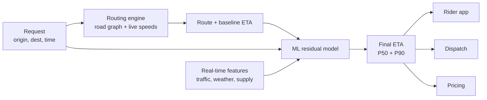
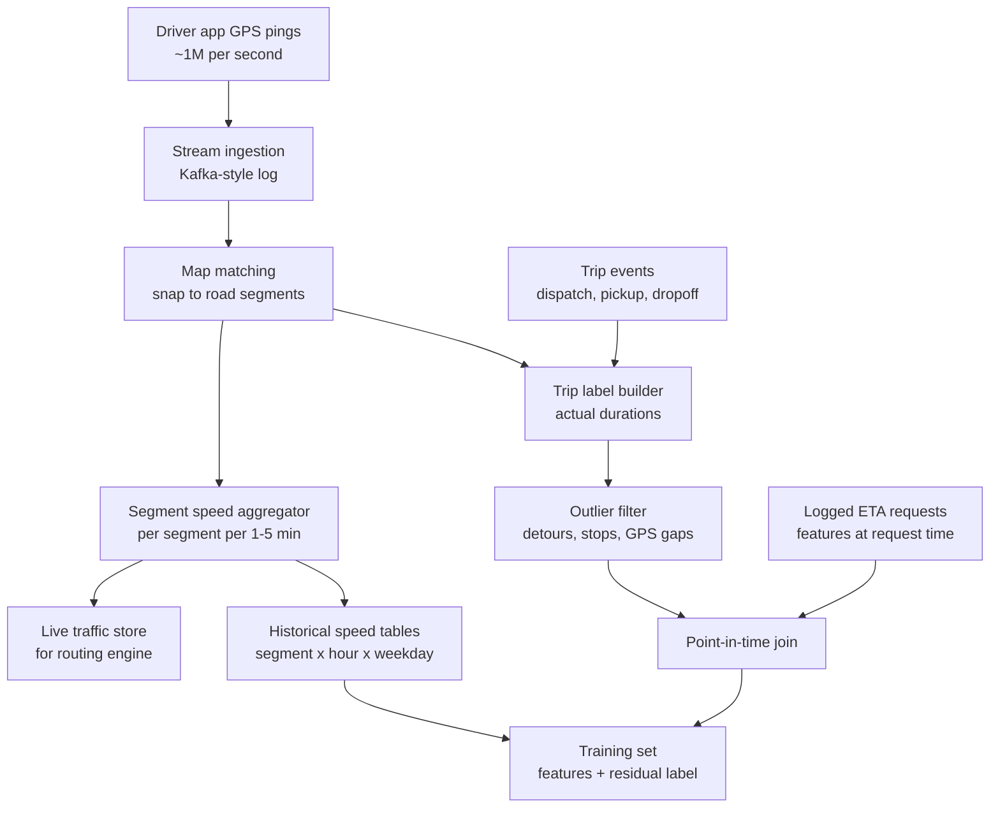
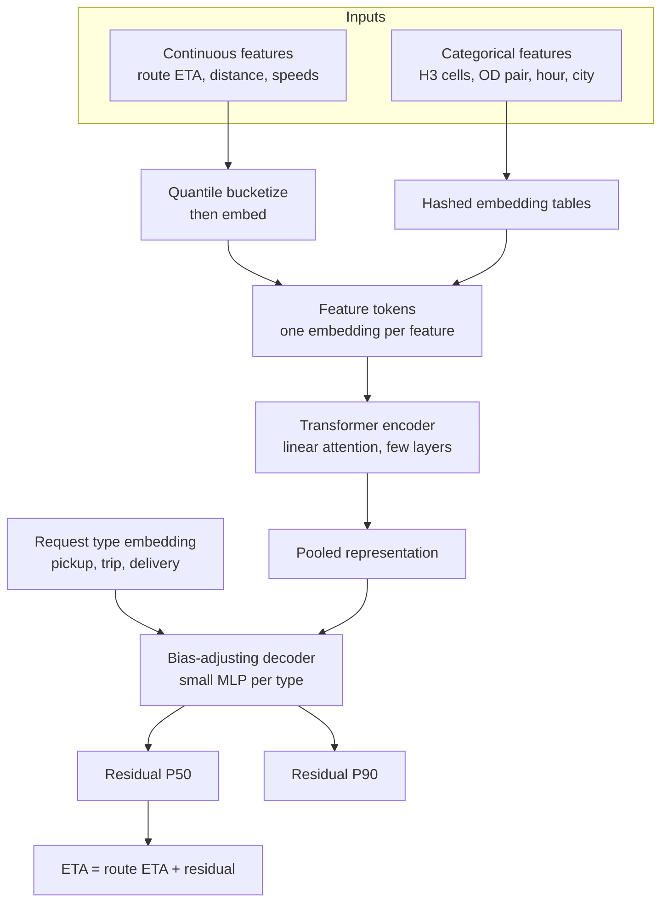
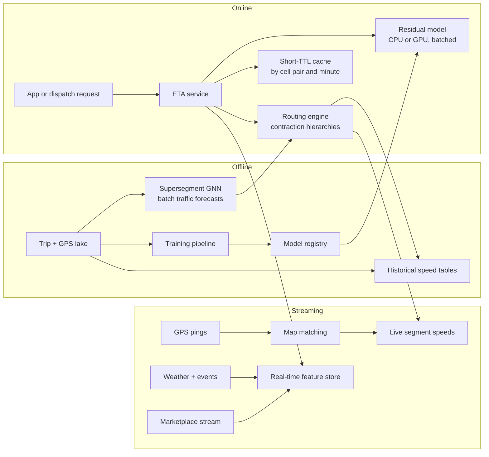
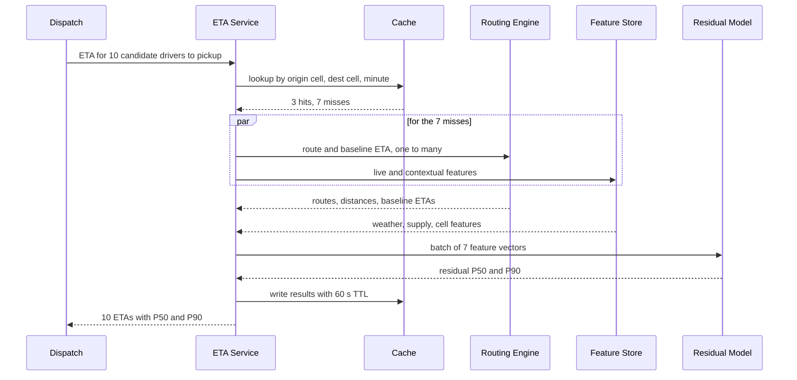

# Case study 6 — ETA Prediction Service

> **Interview prompt:** "Design the system that predicts the estimated time of arrival (ETA) shown to users of a ride-hailing or food-delivery app — for a driver to reach a pickup, for a trip to reach its destination, and for a food order to arrive."

**Modules used:** [M04 Evaluation & data](../modules/04-evaluation-and-data.md) ·
[M05 Trees & ensembles](../modules/05-trees-and-ensembles.md) ·
[M07 Neural networks](../modules/07-neural-networks.md) ·
[M08 Embeddings & transformers](../modules/08-embeddings-and-transformers.md) ·
[M10 Framework](../system-design/10-ml-system-design-framework.md) ·
[M11 Data & training infra](../system-design/11-data-and-training-infrastructure.md) ·
[M12 Serving & monitoring](../system-design/12-serving-monitoring-experimentation.md)

> **Why this matters.** ETA looks like "just regression", which is exactly why it is a
> great interview question: the strong answer shows that you *don't* throw away decades
> of routing algorithms, that you choose a loss that matches the business asymmetry
> (late is worse than early), and that you can hit a very high QPS at single-digit
> millisecond latency. ETA is also an input to *other* systems — pricing, dispatch,
> batching — so its errors propagate.

---

## 1. Clarify requirements

| Question | Assumption |
|---|---|
| Which ETAs? | (a) driver-to-pickup, (b) pickup-to-dropoff (trip), (c) food delivery = restaurant prep time + courier pickup + travel. We focus on travel-time ETA and discuss delivery decomposition. |
| Who consumes it? | Riders/eaters (shown in app), dispatch/matching (choosing drivers), pricing (fare estimates), supply positioning. |
| Scale? | ~20M trips/day, but ETA is requested far more often than trips happen: every app open, every candidate driver in matching, every route alternative. |
| Latency? | p99 < 50 ms for the whole ETA call, because dispatch calls it for many candidates within a matching cycle. |
| Freshness? | Must reflect traffic in the last few minutes (accidents, rain, events). |
| Geography? | Hundreds of cities, very different road networks and driving behavior. |
| Update during trip? | Yes — re-predict as the vehicle moves. |

**Non-functional:** high availability (if ETA is down, dispatch is down — must have a
non-ML fallback), consistent between screens (rider and driver see compatible numbers),
cheap per call.

### Back-of-envelope numbers

| Quantity | Calculation | Value |
|---|---|---|
| Trips/day | given | 20M |
| ETA requests per trip | app opens, product selection, ~10 candidate drivers in dispatch, in-trip refreshes | ~250 |
| ETA requests/day | 20M × 250 | 5B |
| Average QPS | $5\times10^9 / 86{,}400$ | ~58K QPS |
| Peak QPS | ~3× average | ~175K QPS (Uber has publicly described ETA as one of its highest-QPS models, in the hundreds of thousands per second) |
| GPS pings | 5M active drivers at peak × 1 ping / 4 s | ~1.25M pings/s |
| GPS data/day | ~1.25M/s × 86,400 × ~50% avg utilization × 100 B | ~5 TB/day |
| Training examples/day | 20M completed trips (+ ~100M route segments traversed) | 20M rows/day |
| Model compute budget | 175K QPS × ~1 ms CPU per prediction | ~175 CPU cores (×3 for headroom) |

> **Why this matters.** The QPS line tells you the model must be cheap. A 100 ms
> transformer per request at 175K QPS is ~17,500 GPU-seconds per second. That pushes
> you toward small models, batching, caching, and keeping the expensive graph work in
> the routing engine.

---

## 2. Frame as an ML problem

**Business objective:** accurate, *trustworthy* ETAs. Underestimates cause angry users
and cancellations; overestimates lose conversions ("12 minutes? I'll take the other
app") and make dispatch choose worse drivers.

**ML objective:** predict actual travel time $y$ (seconds) for a request
$(\text{origin}, \text{destination}, \text{departure time}, \text{context})$.

**Key framing decision — residual learning on top of a routing engine.** A
road-graph routing engine (Dijkstra/A*/contraction hierarchies over a road graph whose
edge weights are segment travel times from real-time traffic) already produces a
route and a baseline ETA $\hat{y}_{\text{route}}$. The ML model predicts a
**correction**:

$$
\hat{y} = \hat{y}_{\text{route}} + f_\theta(\text{features}) \quad \text{or} \quad \hat{y} = \hat{y}_{\text{route}} \cdot (1 + g_\theta(\text{features}))
$$

Uber's public DeepETA blog describes exactly this: the routing engine produces a
physics-based ETA, and a deep model predicts the residual to account for things the
graph misses (pickup/dropoff time, turns, traffic lights, local behavior).

Why residual?
- The routing engine encodes structure ML would need enormous data to relearn (road connectivity, distance, speed limits).
- The residual has smaller variance and is easier to learn; the model can be small and fast.
- Graceful degradation: if the ML model fails, serve $\hat{y}_{\text{route}}$.

**Output:** a point estimate (what we display) plus quantiles (e.g. P10/P50/P90) for
dispatch, ranges in the UI ("12–16 min"), and promise-time decisions in delivery.

> **Common mistake.** Proposing to predict ETA end-to-end from (lat, lng, lat, lng,
> time) with a neural net and ignoring the road graph. The model has to rediscover
> rivers, bridges and one-way streets from data; it will be worst exactly where data is
> sparse (new cities, rare routes) and offers no fallback.

---

## 3. Data

**Labels:** actual travel times from completed trips, derived from GPS traces:
- Trip ETA label: dropoff timestamp − pickup timestamp.
- Pickup ETA label: time driver arrived at pickup − time of dispatch.
- Segment-level labels: map-matched GPS traces give traversal times per road segment (used for the routing engine's speed estimates and for segment-level models).

**Data cleaning — critical here:**
- **Map matching** (e.g. HMM-based) snaps noisy GPS to road segments; urban canyons cause jumps.
- Remove trips with anomalies: driver stopped for gas, rider asked for a detour, GPS dropouts, fraud (fake trips).
- Label must match what you predict: if the driver took a different route than recommended, the label is still the true travel time, but route features should describe the *actual* route for segment training and the *planned* route for ETA training.

**Sampling and coverage:**
- Data is dominated by dense downtown areas and peak hours. Stratify evaluation by city, time-of-day, and trip length.
- New cities have no history → rely on the routing engine plus a global model with city-level embeddings that fall back to region averages.

**Privacy:** GPS traces are highly sensitive (home/work locations). Aggregate to segment
speeds for features, apply retention limits, restrict raw-trace access, and do not use
per-rider location history beyond what is needed.

### Data and label pipeline

> **Why this matters.** The "point-in-time join" box is where most ETA leakage bugs
> live. If you join the trip with traffic features computed *after* departure (e.g. the
> segment speeds observed during the trip itself), offline MAE looks fantastic and
> online accuracy does not move. Log features at request time or reconstruct them with
> strict timestamps ([M11](../system-design/11-data-and-training-infrastructure.md)).

---

## 4. Features

| Feature | Type | Source | Online/offline | Freshness |
|---|---|---|---|---|
| Routing-engine ETA $\hat{y}_{\text{route}}$ | Numeric | Routing engine | Online | Per request |
| Route distance, number of segments, turns, traffic lights | Numeric | Routing engine | Online | Per request |
| Road type mix (highway %, residential %) | Numeric | Map data | Online | Map release (weekly) |
| Origin/destination geohash or H3 cell (res 7–9) | Categorical → embedding | Computed | Online | Static |
| Origin–destination cell pair | Hashed categorical → embedding | Computed | Online | Static |
| Hour of day, day of week, holiday flag | Categorical/cyclic | Clock + calendar | Online | Static |
| Live segment speeds along route (mean, min, congestion ratio vs historical) | Numeric | Live traffic store | Online | 1–5 min |
| Historical speed for same segments at same hour/weekday | Numeric | Offline tables | Online (precomputed) | Daily |
| Weather (rain, snow, visibility) | Categorical/numeric | Weather API | Online | 10–15 min |
| Local events (stadium, concert) | Binary/numeric | Events calendar | Online | Hourly |
| Supply/demand in origin cell | Numeric | Marketplace stream | Online | ~1 min |
| Pickup point type (airport, mall, curb) | Categorical | POI data | Online | Static |
| Vehicle type (car, bike, scooter) | Categorical | Request | Online | Per request |
| Driver's historical speed ratio vs. route ETA | Numeric | Feature store | Online | Daily |
| Request type (pickup ETA, trip ETA, in-trip refresh) | Categorical | Request | Online | Per request |
| Food: restaurant prep-time history, current order queue | Numeric | Merchant stream | Online | ~1 min |

**Spatial features in depth.**
- **Geohash** divides the world into a hierarchy of rectangles by interleaving lat/lng bits; prefix length controls resolution. Simple, but cells vary in area by latitude and neighbors can have different prefixes.
- **H3** (open-sourced by Uber) uses a hexagonal hierarchy: every cell has 6 equidistant neighbors and near-uniform area, which makes neighborhood aggregations ("speed in the k-ring around origin") cleaner.
- Raw lat/lng is a poor input to linear or MLP models (relationship is highly non-linear); **discretize into cells at multiple resolutions and learn embeddings** ([M08](../modules/08-embeddings-and-transformers.md)). Uber's DeepETA blog describes discretizing and hashing location features into embeddings.

**Temporal features:** use cyclic encodings ($\sin(2\pi h/24), \cos(2\pi h/24)$) or
embeddings for hour × weekday, so 23:00 and 00:00 are close.

> **Common mistake.** Feeding "minute of day" as a raw integer. The model sees 1439 and
> 0 as maximally different, and tree models need many splits to carve out rush hour.
> Cyclic encoding or bucketed embeddings fix both.

---

## 5. Model

### Baselines (always say these out loud)
1. **Routing engine alone**: graph shortest path with historical segment speeds.
2. Routing engine with **live** segment speeds.
3. Routing ETA × per-city/hour multiplicative correction factor (a lookup table).

Each baseline is cheap, explainable and strong — the ML model must beat (3) by a
meaningful margin in every city to justify itself.

### Production model options

| Model | Pros | Cons |
|---|---|---|
| **GBDT** (XGBoost/LightGBM) on residual ([M05](../modules/05-trees-and-ensembles.md)) | Strong on tabular features, fast (~0.1–1 ms on CPU), easy to debug, handles missing values | High-cardinality spatial features need target encoding; one model per region often needed; harder to share across cities |
| **Deep tabular model** (embeddings + transformer/MLP), e.g. Uber DeepETA | Learns embeddings for millions of spatial cells and OD pairs; one global model; multi-task heads for different request types | Needs careful engineering for latency; more training infra |
| **Graph neural network** over road segments ([M07](../modules/07-neural-networks.md)) | Models how congestion propagates spatially; captures future traffic along the route | Expensive; usually used to predict *segment/supersegment* travel times feeding the router, not per request |

Publicly documented examples:
- **Uber DeepETA** (Uber engineering blog, 2022): residual over routing-engine ETA; encoder-decoder with a linear-attention transformer over discretized and embedded features; replaced earlier per-region XGBoost models; uses an asymmetric Huber loss; serves with low single-digit millisecond latency.
- **Google Maps / DeepMind** (DeepMind blog and the 2021 CIKM paper "ETA Prediction with Graph Neural Networks in Google Maps"): road network split into "supersegments"; a GNN predicts travel time for supersegments using neighboring traffic; reported large accuracy improvements in cities such as Sydney and Taipei.

### Our production design
- **Stage 1:** Routing engine computes route + $\hat{y}_{\text{route}}$ using live segment speeds (which may themselves be forecast by a GNN-based supersegment model, refreshed every few minutes, offline from the request path).
- **Stage 2:** Global deep residual model, one forward pass per request, multi-head outputs for P50 and P90, with request type as an input feature.

**Why embed everything?** Bucketizing continuous features and embedding them lets the
model learn non-linear, interaction-rich effects (e.g. "a 5 km trip at 17:30 in cell X")
while keeping inference as table lookups plus a few small matrix multiplies.

**Why GBDT is still a valid answer.** In an interview, "start with GBDT on the residual
per region, move to a global deep model when the number of regions and the value of
cross-city sharing justify it" is a strong, defensible plan. Mention that deep models
win when spatial categorical cardinality is huge.

---

## 6. Training

### Loss — matching the business asymmetry

Plain MSE is sensitive to outliers (one 2-hour detour dominates the gradient). MAE is
robust but has a constant gradient. **Huber** blends them:

$$
L_\delta(r) = \begin{cases} \tfrac12 r^2 & |r|\le\delta \\ \delta(|r| - \tfrac12\delta) & |r|>\delta \end{cases}, \quad r = y - \hat{y}
$$

**Asymmetry:** being late (true time $y$ > predicted $\hat{y}$, i.e. $r>0$) hurts more
than being early. Weight the two sides differently:

$$
L_{\text{asym}}(r) = \begin{cases} w_{\text{late}}\, L_\delta(r) & r > 0 \\ w_{\text{early}}\, L_\delta(r) & r \le 0 \end{cases}, \quad w_{\text{late}} > w_{\text{early}}
$$

Uber's DeepETA blog describes an asymmetric Huber loss with tunable parameters for
exactly this reason.

**Quantile (pinball) loss** for P90 etc.: for quantile level $\tau \in (0,1)$,

$$
L_\tau(r) = \max(\tau r, (\tau - 1) r)
$$

Minimizing it makes $\hat{y}$ the $\tau$-quantile of $y$ given the features. With
$\tau = 0.9$, under-predictions cost 9× more than over-predictions, so the model
predicts a time that is exceeded only 10% of the time — ideal for delivery "promise
times". Worked example: $y = 20$ min, $\hat{y} = 18$: $r=2$, $L_{0.9} = 1.8$; if
$\hat{y}=22$: $r=-2$, $L_{0.9} = 0.2$.

> **Why this matters.** The interviewer wants to hear you connect loss choice to the
> product. "We display P50 to riders but give dispatch P50 and P90; for food delivery
> promises we display something closer to P70–P80 because a missed promise generates a
> refund" is a senior-level answer.

### Splits and validation
- **Time-based split** (train on weeks 1–6, validate on week 7, test on week 8). Random splits leak traffic conditions of the same hour across sets.
- Evaluate on **holdout cities** too, to measure cold-start generalization.
- Slice by city, hour, trip length, request type, weather.

### Retraining cadence
- Live segment speeds: continuous (minutes) — this is where real-time adaptation happens, not in the model weights.
- Residual model: retrain weekly (deep) or daily (GBDT); automated validation gate per city.
- Special-event handling (New Year's Eve, storms): rely on live features; the model must have seen enough rare conditions — oversample historical rare days.

---

## 7. Evaluation

### Offline metrics

| Metric | Definition | Why |
|---|---|---|
| MAE | $\frac1n\sum|y-\hat y|$ | Interpretable in seconds; robust |
| MAPE | $\frac1n\sum\frac{|y-\hat y|}{y}$ | Comparable across short and long trips; but explodes for very short trips — floor $y$ at e.g. 60 s |
| Late rate / P90 coverage | fraction with $y > \hat y_{P90}$ (target 10%) | Calibration of quantiles |
| Signed bias (mean $y - \hat y$) | — | Systematic under/over-estimation per city/hour |
| % within ±X% (e.g. ±20%) | — | Matches how users perceive accuracy |
| Improvement vs routing baseline | relative MAE reduction | Justifies the ML layer |

Report all metrics per slice. A model that improves global MAE by 5% but worsens airport
pickups by 20% is a regression for the users who care most.

### Online metrics
- Real-world MAE/MAPE on completed trips (labels arrive within an hour — fast feedback compared to most ML systems).
- Business: conversion (request rate after seeing ETA), cancellation rate, rider and eater ratings mentioning lateness, refunds/credits for late delivery.
- Dispatch efficiency: average actual pickup time (better ETAs → better driver choices).

### Guardrails
- p99 latency, error/fallback rate.
- No city's MAE regresses by more than X%.
- Late rate must not increase even if MAE improves (a model can lower MAE by underpredicting long trips).

### A/B design
- **Randomization unit:** user/rider for display-only ETAs; but ETA feeds dispatch, which creates **marketplace interference** (treated riders' dispatch decisions take drivers away from control riders). For dispatch-affecting changes use **switchback experiments**: alternate the whole city between treatment and control in time windows (e.g. 30–60 min), with washout periods ([M12](../system-design/12-serving-monitoring-experimentation.md)).
- **Shadow mode first:** compute new ETAs alongside old for all requests, compare against actuals without affecting anything.
- Duration: ≥ 2 weeks to cover weekly cycles.

---

## 8. Serving architecture

### Request-time sequence

### Latency budget (p99, single request)

| Step | Budget |
|---|---|
| Request parsing, cache lookup | 2 ms |
| Routing engine (contraction hierarchies, one-to-many) | 15 ms |
| Feature fetch (parallel with routing) | (5 ms, hidden) |
| Feature assembly | 3 ms |
| Residual model inference (batched) | 5 ms |
| Post-processing (clip, monotonicity checks) | 1 ms |
| Network + slack | 24 ms |
| **Total** | **50 ms** |

**Engineering details that matter:**
- **One-to-many routing:** dispatch needs ETAs from N drivers to one pickup; one reverse search beats N separate queries.
- **Cache** results keyed by (origin H3 cell, destination H3 cell, minute bucket) — useful for app opens where many users in the same area request similar ETAs.
- **Fallback chain:** model fails → routing ETA × city/hour correction table → routing ETA alone.
- **Sanity clipping:** final ETA within $[0.5, 3] \times \hat y_{\text{route}}$; never below free-flow time.
- Model size: embedding tables can be large (millions of cells × 32-d × 4 B ≈ hundreds of MB) — fits in memory per serving host; use hashing to bound size.

---

## 9. Monitoring & iteration

**Monitor:**
- Online MAE, bias and late rate per city/hour, computed continuously as trips complete.
- Feature freshness: age of live speed data per city (stale traffic is the #1 silent failure).
- Input distribution: fraction of requests with missing live speeds, unknown cells.
- Fallback rate and latency per region.

**Feedback loops:**
- ETAs influence behavior: a long displayed ETA makes riders cancel, so trips with long ETAs are underrepresented in labels (selection bias). Log the displayed ETA and include cancelled requests in analysis.
- ETAs influence dispatch, which influences realized pickup times — evaluate pickup ETA under the dispatch policy that will use it.
- Drivers may follow or ignore the suggested route; changes to the router change the label distribution for the residual model → retrain the residual model whenever the routing engine changes.

### Failure modes

| Symptom | Likely cause | Mitigation |
|---|---|---|
| City-wide underprediction suddenly | Stale live-traffic feed (pipeline lag) so model sees free-flow speeds | Freshness alerts; fall back to historical speeds for that hour; feature "age of traffic data" as model input |
| Large errors at airports/stadiums | Pickup-point logistics (walking, queues) not in the graph | Pickup-type features, POI-specific residual, separate pickup-time component |
| Offline MAE great, online flat | Leakage via post-departure traffic features | Point-in-time feature logging; compare offline vs shadow online error |
| Errors spike in rain | Weather rare in training data | Weather features, oversample bad-weather days, monitor slice |
| New city very inaccurate | No embeddings trained for its cells | Hash collisions into "unknown" bucket, region-level features, routing fallback, quick fine-tune after weeks of data |
| ETA jumps around during trip | Independent predictions per refresh, noisy features | Smooth with previous prediction and progress; condition on elapsed time and remaining route |
| MAE improved but complaints up | Model now underpredicts long trips (late) | Asymmetric loss, late-rate guardrail, per-length slices |
| Routing engine upgrade breaks residual model | Residual target shifted | Retrain residual with new router; version them together |

---

## 10. Trade-offs & extensions

| Trade-off | Option A | Option B | Our choice |
|---|---|---|---|
| End-to-end ML vs residual | Pure ML from coordinates | Routing baseline + ML residual | Residual: robust, fallback, less data needed |
| GBDT vs deep model | Simple, fast, per-region | Global, embeddings, multi-task | Start with GBDT; migrate to deep when cross-city sharing and cardinality justify |
| Point vs distribution | Single number | Quantiles P50/P90 | Both: display P50 (or a range), dispatch and promises use quantiles |
| Accuracy vs latency | Big GNN per request | Cheap per-request model + async GNN segment forecasts | GNN offline/async feeding router; small model online |
| Freshness vs stability | Recompute every refresh | Smooth over time | Smooth in-trip ETAs; users hate jumpy numbers |

**Food delivery decomposition:** $\text{ETA} = \text{order confirm} + \max(\text{prep time}, \text{courier arrival}) + \text{pickup wait} + \text{travel to customer} + \text{handoff (parking, stairs)}$. Each component is a separate model (prep time depends on restaurant load and dish; handoff depends on building type), combined with Monte-Carlo or quantile arithmetic for the overall distribution.

**Extensions:** route choice itself learned from drivers' actual routes; conformal prediction for guaranteed-coverage intervals; ETA for multi-stop (batched) deliveries; using ETA uncertainty in dispatch optimization.

---

## 11. Interviewer follow-ups

Q1. Why not just use the routing engine — what does ML add?

The routing engine sums segment travel times, but real trips include things the graph
does not model: time to find the rider, turning delays and traffic lights, parking,
driver behavior, systematic errors in segment speeds, and correlations (a jam on one
segment implies jams nearby). The residual model learns these from millions of trips.
Publicly, Uber's DeepETA blog and Google's GNN ETA post both report substantial accuracy
gains over graph-only baselines. Equally important: the engine remains the fallback.

Q2. Should you display the mean, median or a higher quantile?

It depends on the cost of each error. For a ride pickup, the median (P50) is usually
displayed since both early and late errors matter and users re-check. For food delivery
promises, a missed promise costs a refund and trust, so the promise is a higher quantile
(e.g. P75–P85) — trained with pinball loss — while the in-app tracker shows the live P50.
Dispatch benefits from both P50 and the spread. Always validate empirical coverage: the
fraction of trips exceeding the P90 prediction should be about 10% in every slice.

Q3. How would you handle a new city with no historical trips?

Use the routing engine with map-derived speed limits and any live traffic available.
The global residual model generalizes via non-location features (road type mix, distance,
hour, weather) and uses hashed/unknown buckets for unseen cells; add region- or
country-level embeddings so the new city borrows from similar cities. Monitor closely and
fine-tune once a few weeks of trips accumulate. A holdout-city offline evaluation tells you
in advance how big the cold-start error is.

Q4. MAE improved 8% offline but the A/B test shows no change in cancellations. Why?

Candidates: (1) leakage — offline features include information not available at request
time; (2) the improvement is concentrated in slices that don't affect cancellations (e.g.
long highway trips) while pickup ETAs, which drive cancellations, did not improve; (3) user
behavior depends on perceived accuracy and consistency (jumpy ETAs) more than MAE; (4)
marketplace interference diluted the effect in a user-randomized test — a switchback design
may be needed; (5) the test is underpowered for cancellations. Check shadow-mode online MAE
first, then slice.

Q5. How do you serve 175K QPS within 50 ms?

Keep the expensive graph work in an optimized routing engine (contraction hierarchies,
one-to-many queries); keep the ML model small (embedding lookups + a few small layers or a
GBDT with a few hundred trees, ~1 ms on CPU); batch requests from dispatch; cache by
(cell pair, minute); precompute slow-changing features; run model and feature fetches in
parallel with routing where possible; scale horizontally and shard by region. Use a
fallback chain so a slow dependency degrades accuracy rather than availability.

Q6. Explain how a GNN helps ETA, and why Google uses supersegments.

Traffic is spatially correlated: congestion on one segment propagates upstream and
affects neighbors. A GNN treats segments as nodes and road connections as edges; message
passing aggregates neighbors' current speeds to predict each segment's near-future travel
time. Google's public work groups adjacent segments into supersegments (sub-graphs with
significant traffic volume) and runs a GNN per supersegment, predicting travel time for the
whole supersegment. This scales better than per-segment models and handles variable-sized
graphs, and the outputs feed the route-level ETA.

Q7. Why can MAPE be misleading, and what would you report instead?

MAPE divides by the true value, so a 1-minute error on a 2-minute trip is 50% while the
same error on a 40-minute trip is 2.5%; short trips dominate. It also penalizes
over-prediction and under-prediction asymmetrically in a way unrelated to business cost.
Report MAE (seconds) per trip-length bucket, MAPE with a floor on $y$, late rate at the
displayed quantile, and signed bias per slice.

Q8. Could the ETA model create a harmful feedback loop with dispatch?

Yes. If the model systematically underestimates ETAs for some areas, dispatch sends drivers
from too far away, realized pickup times grow, riders cancel, and those long-pickup cases
disappear from labels because cancelled trips have no completed duration — so the model
never learns. Mitigations: log all predictions and outcomes including cancellations and
reassignments, use survival-style labels (censored at cancellation), slice by area, and
evaluate dispatch-affecting changes with switchback experiments.

---

**Further reading (public):** Uber Engineering blog, "DeepETA: How Uber Predicts Arrival
Times Using Deep Learning" (2022); DeepMind blog, "Traffic prediction with advanced Graph
Neural Networks" (2020) and Derrow-Pinion et al., "ETA Prediction with Graph Neural
Networks in Google Maps", CIKM 2021; Uber H3 documentation; Geisberger et al.,
"Contraction Hierarchies" (2008).
