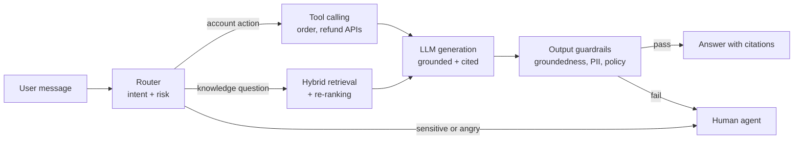
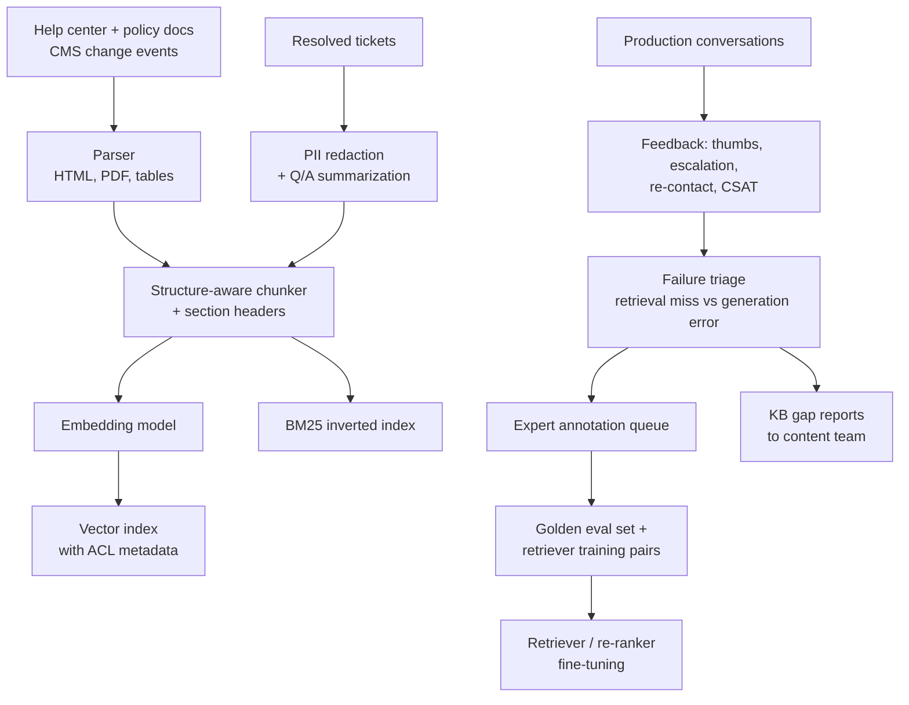
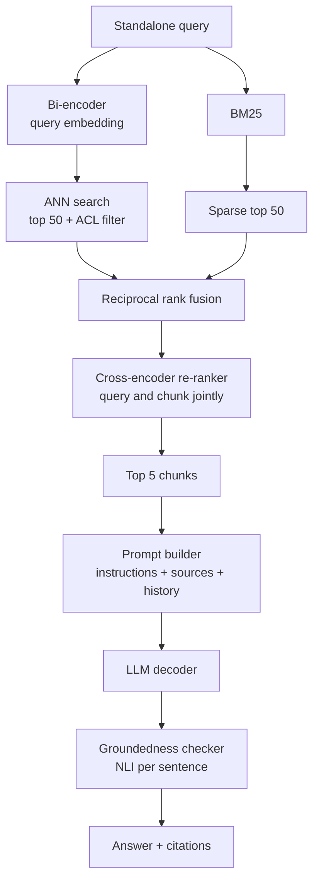
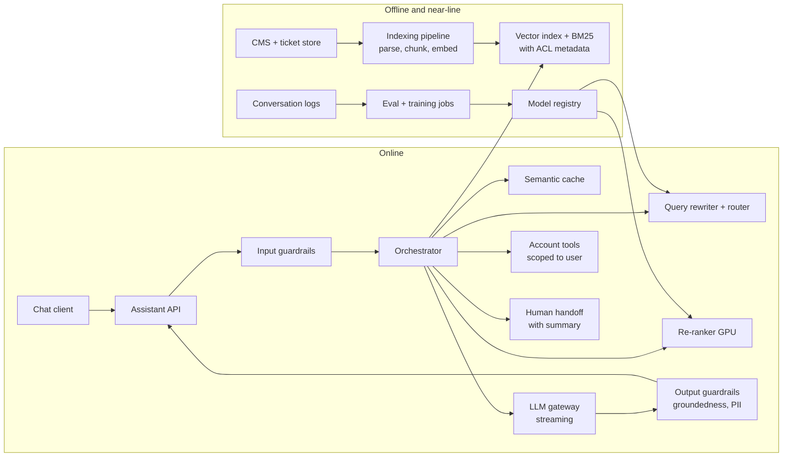
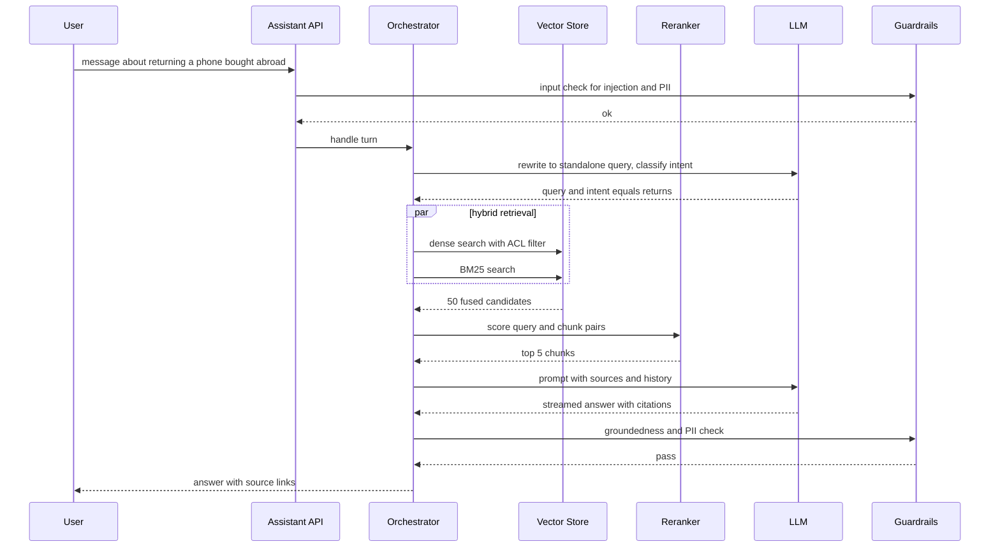

# Case study 7 — LLM Customer Support Assistant (RAG)

> **Interview prompt:** "Design an LLM-powered customer support assistant that answers customer questions using our company's knowledge base (help-center articles, policy documents, product manuals, past resolved tickets). It should be accurate, cite its sources, and hand off to a human when it can't help."

**Modules used:** [M04 Evaluation & data](../modules/04-evaluation-and-data.md) ·
[M08 Embeddings & transformers](../modules/08-embeddings-and-transformers.md) ·
[M09 Recommendation & ranking](../modules/09-recommendation-and-ranking.md) ·
[M10 Framework](../system-design/10-ml-system-design-framework.md) ·
[M11 Data & training infra](../system-design/11-data-and-training-infrastructure.md) ·
[M12 Serving & monitoring](../system-design/12-serving-monitoring-experimentation.md)

> **Why this matters.** "Build a chatbot over our docs" is now one of the most common
> ML system design prompts. Weak answers say "embed the docs, put them in a vector DB,
> call the LLM". Strong answers treat it as **a search system plus a generation system
> plus a safety system**, each with its own metrics, and do the token and cost math out
> loud. Retrieval is ranking ([M09](../modules/09-recommendation-and-ranking.md)) — most
> of the quality comes from getting the right paragraph into the prompt.

---

## 1. Clarify requirements

| Question | Assumption |
|---|---|
| Users? | Logged-in customers of a large consumer company (e.g. telecom or e-commerce), web + mobile chat. |
| Knowledge sources? | ~20K help articles, ~5K internal policy docs, product manuals (PDFs), ~10M historical resolved tickets. Some content is internal-only. |
| Actions? | Phase 1: answer questions with citations. Phase 2: take actions via tools (check order status, start a return) with user confirmation. |
| Scale? | ~2M conversations/day, average 4 user turns → ~8M LLM turns/day. |
| Latency? | First token < 1.5 s (p95); full answer < 6 s. |
| Languages? | Top 10 languages; KB mostly English. |
| Success? | Deflection (resolved without human) while keeping CSAT ≥ human-agent level and near-zero harmful/incorrect policy statements. |
| Constraints? | PII must not leak across customers; no answers about other customers' accounts; regulatory claims (refunds, warranties) must match policy exactly. |

**Non-functional:** cost per resolved conversation must be well below human-agent cost
(~$3–8 per contact at many companies); KB updates visible within an hour; audit log of
every answer and its sources.

### Back-of-envelope numbers

| Quantity | Calculation | Value |
|---|---|---|
| LLM turns/day | 2M conversations × 4 turns | 8M |
| Average QPS | $8\times10^6/86{,}400$ | ~93 QPS |
| Peak QPS | ~4× (business hours, outages) | ~400 QPS |
| KB size | 20K articles × ~1.5K tokens + 5K docs × ~4K tokens + manuals | ~60M tokens |
| Chunks | 60M tokens / ~400 tokens per chunk (with overlap) | ~180K chunks |
| Tickets as extra corpus | 10M tickets, summarized to ~150 tokens Q/A pairs | 10M chunks |
| Embedding index memory | ~10.2M chunks × 768 dims × 4 B | ~31 GB (float32); ~8 GB with int8 |

### Tokens and cost per query

| Prompt component | Tokens |
|---|---|
| System prompt + policy instructions | 800 |
| Conversation history (summarized after 3 turns) | 600 |
| Retrieved context: 5 chunks × 400 tokens | 2,000 |
| User message | 60 |
| **Input total** | **~3,460** |
| **Output** (answer + citations) | **~250** |

Assume illustrative prices for a mid-size hosted model: **$1 per 1M input tokens** and
**$5 per 1M output tokens** (prices vary by provider and change often — plug in real
numbers in the interview).

$$
\text{cost/turn} = 3460 \times \tfrac{1}{10^6} + 250 \times \tfrac{5}{10^6} \approx \$0.0035 + \$0.00125 \approx \$0.0047
$$

Add re-ranker (~$0.0003), embedding of the query (negligible), and guardrail classifier
calls (~$0.0005) → **~$0.0055 per turn**, ~**$0.022 per conversation**, ~**$44K/day** at
8M turns. Compared with human agents at ~$5/contact, deflecting even 30% of 2M
conversations saves ~$3M/day. Cost is not the bottleneck; **quality and safety are**.

**Prompt caching:** the 800-token system prompt is identical across requests; provider-side
prefix caching typically bills cached input tokens at a large discount, cutting input cost
by ~20% here. Semantic answer caching for very common questions ("how do I reset my
password?") can serve ~10–20% of turns without an LLM call.

> **Why this matters.** Doing this arithmetic shows the interviewer you know where the
> money goes: input tokens dominate (retrieved context), so retrieving 5 *good* chunks
> instead of 20 mediocre ones both improves quality and cuts cost ~3×.

---

## 2. Frame as an ML problem

**Business objective:** resolve customer issues correctly at lower cost, without hurting
satisfaction or creating liability.

**System decomposition** — three ML problems, each measurable on its own:
1. **Retrieval** (ranking): given conversation $c$, return the top-$k$ chunks most likely to contain the answer. Objective: maximize recall@k of answer-bearing chunks.
2. **Generation** (conditional language modeling): produce an answer $a$ grounded in the retrieved chunks, with citations. Objective: helpful, *faithful* (every claim supported), correct, in the right tone.
3. **Decision/routing** (classification): should the assistant answer, ask a clarifying question, call a tool, or escalate to a human? Objective: escalate exactly when the bot would fail or the case is sensitive.

**Labels/feedback available:** resolved-ticket transcripts (question → agent answer → KB
article used), thumbs up/down, whether the user escalated or re-contacted within 7 days,
CSAT surveys, expert annotations.

> **Common mistake.** Jumping straight to "fine-tune an LLM on our docs". Fine-tuning
> teaches style and format well but is an unreliable way to inject *facts*, can't cite
> sources, and must be redone every time a policy changes. RAG keeps knowledge in an
> index you can update in minutes and audit.

---

## 3. Data

**Corpora:**
- Help-center articles (public), policy docs (internal, permissioned), product manuals (PDF with tables), resolved tickets (contain PII; must be redacted and summarized into Q/A pairs before indexing).
- Metadata per document: product, region, language, effective date, audience (public/internal), owner.

**Chunking** — the most underestimated design decision:
- Split by document structure (headings, sections, list items), not fixed character counts; target ~300–500 tokens with ~10–15% overlap.
- Prepend context to each chunk: document title + section path ("Returns > International > Electronics"). This "contextual chunk header" makes an isolated paragraph retrievable.
- Tables: convert to markdown rows; keep header with each row group.
- Keep a pointer from chunk → parent section so generation can expand to the full section if needed ("small-to-big" retrieval).

**Evaluation data (build before the model!):**
- **Golden Q/A set:** ~2,000 real customer questions sampled from tickets, stratified by topic and language; experts write the correct answer and mark the supporting chunk IDs. Gives retrieval labels *and* answer references.
- **Adversarial set:** prompt injections, off-topic requests, questions about competitors, attempts to extract other users' data, questions whose answer is *not* in the KB (the right behavior is "I don't know" + escalate).
- Synthetic questions generated by an LLM from each chunk expand coverage for retriever training — validated by sampling.

**Privacy & PII:**
- Redact PII from tickets before indexing (NER-based + regex for emails, card numbers, phones).
- Document-level access control: the retriever filters by user entitlement (public vs internal vs agent-only) *before* ranking.
- Per-user account data enters the prompt only through authenticated tool calls scoped to that user, never via the shared index.
- Logs containing conversations have retention limits; do not send data to third-party model providers without a data-processing agreement and zero-retention settings.

### Data and feedback pipeline

> **Why this matters.** The "KB gap reports" arrow is often the highest-ROI output of
> the whole system: many failures are not model failures but missing or outdated
> articles. A good design closes the loop to the humans who own the content.

---

## 4. Features

RAG is not a classic tabular-feature system, but the retriever, re-ranker and router
consume signals that behave exactly like features:

| Signal | Type | Source | Online/offline | Freshness |
|---|---|---|---|---|
| Query text (+ rewritten standalone query) | Text | User + LLM rewrite | Online | Per turn |
| Query embedding | Dense vector | Embedding model | Online | Per turn |
| Chunk embedding | Dense vector | Indexing pipeline | Offline (precomputed) | Minutes after doc change |
| BM25 score | Numeric | Inverted index | Online | Minutes |
| Doc metadata: product, region, language, effective date | Categorical/date | CMS | Offline → index | Minutes |
| Doc popularity / historical helpfulness (click/thumbs rate) | Numeric | Feedback logs | Offline | Daily |
| User entitlement (public, premium, internal) | Categorical | Auth service | Online | Per session |
| User's products/plan, region | Categorical | Account service | Online | Per session |
| Conversation state (turn count, prior escalation, sentiment) | Numeric/categorical | Session store | Online | Per turn |
| Intent and risk class (billing dispute, legal threat, self-harm) | Categorical | Router classifier | Online | Per turn |
| Re-ranker relevance score | Numeric | Cross-encoder | Online | Per turn |

---

## 5. Model

### Baseline
1. **Search-only:** BM25 over the help center, return top-3 article links. Strong, cheap, and the fallback.
2. **Naive RAG:** embed query → top-5 vector chunks → LLM with "answer using only the context".

### Production pipeline

1. **Query understanding:** rewrite the latest turn into a standalone query using conversation history ("what about for phones?" → "return policy for phones bought abroad"); detect language and intent; extract filters (product, region).
2. **Hybrid retrieval:**
   - Sparse: BM25 (catches exact terms: error codes, SKUs, plan names — embeddings are weak at these).
   - Dense: bi-encoder embeddings ([M08](../modules/08-embeddings-and-transformers.md)), fine-tuned on (question, supporting chunk) pairs with in-batch negatives (InfoNCE).
   - Merge with **reciprocal rank fusion**: $\text{RRF}(d) = \sum_{r \in \{\text{bm25}, \text{dense}\}} \frac{1}{k_0 + \text{rank}_r(d)}$, $k_0 \approx 60$. Take top ~50.
   - Metadata filters (ACL, region, language, effective date) applied inside the search.
3. **Re-ranking:** cross-encoder scores each (query, chunk) jointly — much more accurate than the bi-encoder because query and document tokens attend to each other, but too slow for the whole corpus. Keep top 5. This is the classic retrieve-then-rank cascade from [M09](../modules/09-recommendation-and-ranking.md).
4. **Prompt construction:** system instructions (role, tone, policy rules, "answer only from sources, otherwise say you don't know", citation format) + numbered sources with titles and URLs + summarized history + user question.
5. **Generation:** hosted or self-hosted instruction-tuned LLM; streaming tokens; citations as `[1]`, `[2]` mapped to source URLs.
6. **Post-generation verification:** groundedness check (NLI model or small LLM judge that each sentence is entailed by cited chunks); policy/PII filters; citation validation (cited IDs must exist in the provided sources).

### Hallucination mitigation (layered)
- Retrieval quality first: if the right chunk isn't in context, no prompt can save you.
- Instruction: "If the sources do not contain the answer, say so and offer a human agent."
- **Abstain threshold:** if the top re-ranker score is below a calibrated threshold, skip generation and escalate or ask a clarifying question.
- Constrained output: structured response (answer, citations, confidence) — easier to validate.
- Post-hoc groundedness verification; regenerate or escalate on failure.
- For high-stakes intents (refund amounts, legal terms), quote the policy text verbatim rather than paraphrasing.

### Guardrails
- **Input:** prompt-injection detection (including instructions hidden in retrieved documents or user-uploaded content), jailbreak and abuse classifier, PII detection.
- **Output:** toxicity, PII leakage (another customer's data), off-policy promises ("we'll refund you $500"), competitor/legal topics.
- **Tool calls:** least privilege, scoped to the authenticated user, require explicit user confirmation for state-changing actions.

### Escalation to human
Router + generator signals → escalate when: user asks for a human; sentiment strongly
negative or repeated failure (2 unhelpful turns); risk intents (legal threats, safety,
fraud, account takeover); low retrieval confidence; groundedness failure. Hand off with
a **conversation summary and retrieved sources** so the agent doesn't restart.

> **Common mistake.** Treating escalation as failure. A bot that escalates the right
> 30% quickly, with a good summary, beats a bot that stubbornly answers 90% and gets
> 15% wrong. Measure *correct* deflection, not deflection.

---

## 6. Training

Most of the system uses pretrained models; training effort goes where data gives leverage:

| Component | Training | Data | Cadence |
|---|---|---|---|
| Bi-encoder retriever | Contrastive (InfoNCE) with in-batch + BM25-mined hard negatives | Ticket Q → article actually used; synthetic Q from chunks; golden set (held out!) | Monthly |
| Cross-encoder re-ranker | Pointwise/pairwise ranking loss | Same pairs + annotated relevance grades | Monthly |
| Router / intent / risk classifier | Cross-entropy | Labeled ticket categories, escalation outcomes | Monthly |
| Groundedness checker | NLI fine-tune | Annotated (claim, source, supported?) | Quarterly |
| Generator LLM | Usually **no fine-tuning**; prompt engineering. Optional LoRA SFT for tone/format | Curated best agent answers | Rarely |

InfoNCE for the retriever, with query embedding $q$, positive chunk $d^+$, negatives
$d^-_j$, similarity $s(\cdot,\cdot)$ = cosine, temperature $\tau$:

$$
\mathcal{L} = -\log \frac{\exp(s(q, d^+)/\tau)}{\exp(s(q,d^+)/\tau) + \sum_j \exp(s(q,d^-_j)/\tau)}
$$

**Splits:** split by *time and by article* — if the same article appears in train and
test questions, retrieval metrics are inflated. Keep the golden set strictly out of training.

### When to fine-tune vs RAG

| Need | RAG | Fine-tuning |
|---|---|---|
| Facts that change (prices, policies) | Yes — update the index | No — stale, expensive to redo |
| Citations / auditability | Yes | No |
| Consistent tone, format, brand voice | Partly (prompt) | Yes |
| Domain jargon understanding | Partly | Yes (or fine-tune the *retriever*) |
| Lower latency/cost via smaller model | — | Yes: distill a big model's behavior into a small one |
| Following a complex workflow | Prompt + tools | SFT on example trajectories |

Answer in the interview: **RAG for knowledge, fine-tuning for behavior**, and the two
compose (fine-tune a small generator to use retrieved context well).

---

## 7. Evaluation

### Offline: evaluate each stage separately

| Stage | Metric | Target example |
|---|---|---|
| Retrieval | Recall@k (k=5, 50): fraction of golden questions whose supporting chunk is in top-k | R@50 ≥ 95%, R@5 ≥ 85% after re-ranking |
| Retrieval | MRR / nDCG@5 | Track trend |
| Generation | **Faithfulness / groundedness**: fraction of answer claims entailed by the provided sources | ≥ 97% |
| Generation | **Answer correctness** vs expert reference | ≥ 90% on golden set |
| Generation | Citation precision (cited source supports the sentence) and recall | ≥ 95% |
| Abstention | Precision/recall of "I don't know" on unanswerable questions | Abstain on ≥ 90% of unanswerable |
| Safety | Attack success rate on adversarial set | < 1% |
| System | Latency, cost per turn | p95 first token < 1.5 s |

**LLM-as-judge with human calibration.** Human grading of every eval run is too slow, so
an LLM judge scores faithfulness, correctness and helpfulness with a rubric. But judges
have biases (verbosity, position, self-preference). Procedure:
1. Experts grade ~500 answers with the rubric.
2. Run the judge on the same answers; measure agreement (Cohen's κ, or accuracy per rubric dimension).
3. Iterate on the judge prompt until agreement with humans ≈ human–human agreement.
4. Re-calibrate monthly and whenever the generator or judge model changes; spot-check ~100 judged items per release.

> **Why this matters.** Separating retrieval metrics from generation metrics is how you
> debug. If an answer is wrong: was the right chunk retrieved (retrieval recall)? If
> yes, did the model use it (faithfulness)? Each points to a different fix.

### Online metrics
- **Correct resolution rate**: conversations resolved by bot *and* no re-contact within 7 days *and* no escalation.
- Escalation rate (by reason), CSAT/thumbs, average handle time for escalated tickets (good summaries reduce it).
- Answer quality sampled daily by expert review (~200 conversations).

### Guardrails
- Harmful/incorrect policy statement rate (from sampled audits) — hard ceiling.
- PII leakage incidents — zero tolerance, any incident triggers rollback.
- Latency p95, cost per conversation.

### A/B design
- Randomize by **user** (conversation history persists across sessions).
- Ramp: internal dogfood → 1% → 5% → 25% → 50%, gated by audit results at each step.
- Primary: correct resolution rate; secondary: CSAT, re-contact; guardrails above.
- Interleaving or paired offline comparisons (judge + human) for retriever changes before online tests.
- Duration ≥ 2 weeks to capture re-contact effects.

---

## 8. Serving architecture

### Request-time sequence

In practice, output checks run on sentence boundaries while streaming; if a later
sentence fails, the client replaces the message with a safe fallback.

### Latency budget (p95)

| Step | Budget |
|---|---|
| Input guardrails (small classifier) | 50 ms |
| Query rewrite + intent (small/fast LLM, ~100 output tokens) | 300 ms |
| Hybrid retrieval (ANN + BM25 in parallel) | 60 ms |
| Cross-encoder re-rank 50 candidates (GPU, batched) | 80 ms |
| Prompt assembly | 10 ms |
| LLM time-to-first-token (~3.5K input tokens prefill) | 600 ms |
| Network + slack | 400 ms |
| **Time to first token** | **~1.5 s** |
| Decoding 250 tokens at ~60 tokens/s | ~4 s → full answer ~5.5 s |

Optimizations: skip the rewrite step for first-turn queries; cache embeddings of popular
queries; prefix caching of the system prompt; smaller model for simple intents
(model routing); semantic cache for top FAQ answers (invalidated when the source doc
changes).

---

## 9. Monitoring & iteration

**Monitor:**
- Retrieval: share of turns with top re-ranker score below threshold (rising = KB gap or query drift).
- Generation: groundedness-check failure rate, abstention rate, average answer length.
- Outcomes: escalation rate by intent, thumbs-down rate, re-contact rate, CSAT.
- Cost per conversation, tokens per turn, cache hit rate.
- Index freshness: lag between CMS publish and index availability.
- Provider/model version changes: any LLM upgrade re-runs the full golden + adversarial eval.

**Feedback loop:**
- Thumbs-down + escalations → triage: retrieval miss, generation error, KB gap, or out-of-scope. Retrieval misses become retriever training pairs; KB gaps go to content owners.
- Human agents' final answers on escalated tickets become new golden Q/A candidates.
- Beware of the bot learning from its own outputs: never add bot answers to the corpus without human approval.

### Failure modes

| Symptom | Likely cause | Mitigation |
|---|---|---|
| Confident wrong answer about refund window | Outdated doc version retrieved | Effective-date metadata, filter superseded docs, freshness SLA on re-indexing |
| Fails on error codes like "E-4012" | Dense retrieval weak on exact tokens | Hybrid BM25, keep codes in chunk headers |
| Answer mixes two products' policies | Chunks from similar docs, no product filter | Extract product entity → metadata filter; include doc title in chunk |
| Bot follows instructions planted in a document or user message | Prompt injection | Treat retrieved text as data (delimiters, instruction hierarchy), injection classifier, tool permissions and confirmation |
| Escalation spike after release | Abstain threshold miscalibrated with new re-ranker | Recalibrate thresholds per model version; shadow test |
| Cost doubles | Conversation history growing unboundedly | Summarize history, cap context, monitor tokens/turn |
| Another customer's order details appear | Ticket corpus not redacted, or tool not user-scoped | PII redaction in indexing, ACL filters, tool auth scoping, output PII filter |
| Judge scores rise but CSAT falls | LLM judge drifted / rewards verbosity | Re-calibrate judge against humans; length-controlled rubrics |

---

## 10. Trade-offs & extensions

| Trade-off | Option A | Option B | Our choice |
|---|---|---|---|
| Hosted frontier LLM vs self-hosted open model | Best quality, no infra, data-sharing concerns | Control, privacy, cheaper at scale, more ops | Hosted for launch with zero-retention terms; evaluate a self-hosted fine-tuned model for high-volume simple intents |
| Chunk size | Small (precise, more chunks needed) | Large (context-rich, more tokens) | ~400 tokens + small-to-big expansion |
| More context vs less | Top-20 chunks: higher recall | Top-5: cheaper, less distraction | Re-rank to 5; recall is ensured by the re-ranker stage |
| Free-form answer vs templated | Natural, flexible | Safe, exact | Templates/verbatim quotes for high-risk intents; free-form otherwise |
| Agentic multi-step vs single-pass | Handles complex tasks | Latency, cost, harder to evaluate | Single pass + tools; agentic flows only for specific workflows |

**Extensions:** agent-assist mode (suggest answers to human agents first — lower risk,
great training data); multimodal (users upload a photo of an error screen); proactive
help on known outages; personalized answers using account state via tools.

---

## 11. Interviewer follow-ups

Q1. The assistant gave a wrong answer. How do you debug it?

Look at the logged trace: rewritten query, retrieved candidates with scores, re-ranked top
5, final prompt, output. (1) Was the correct chunk in the top 50? If not → retrieval
problem (query rewrite, missing BM25 term, embedding gap, chunking split the answer, doc
missing/outdated). (2) In the top 50 but not top 5 → re-ranker problem. (3) In the prompt
but answer wrong → generation problem (conflicting sources, instruction not followed,
model reasoning) — check faithfulness. (4) Answer correct per sources but sources wrong →
content problem. Add the case to the golden set so it stays fixed.

Q2. Why hybrid retrieval and a re-ranker rather than just a vector database?

Dense embeddings capture paraphrase ("can't log in" ≈ "sign-in failure") but are weak on
exact rare tokens (SKUs, error codes, plan names); BM25 is the reverse. Fusion gets the
union. Both are first-stage retrievers that score query and document independently
(bi-encoder), which is fast but lossy. A cross-encoder reads them together and is far
more precise, but costs a forward pass per pair, so it is applied only to ~50 candidates.
This is the same candidate-generation → ranking cascade used in recommendation systems.

Q3. How do you measure hallucination at scale?

Define it operationally as unsupported claims: split the answer into atomic claims and
check each is entailed by the provided sources (NLI model or LLM judge). Report the
faithfulness rate offline on the golden set and online on a daily sample. Calibrate the
automatic checker against expert annotations (agreement ≥ human–human). Separately measure
correctness, because an answer can be faithful to an outdated source and still be wrong.

Q4. Walk me through the cost per query and how you would cut it by half.

~3.5K input + 250 output tokens; at $1/$5 per million that's ~$0.0047, plus re-ranker and
guardrails ≈ $0.0055. Halve it by: (1) re-ranking down to 3 chunks and tighter chunks
(−800 tokens); (2) prefix caching of the system prompt; (3) summarizing history;
(4) semantic caching for FAQs (10–20% of turns); (5) routing simple intents to a smaller,
cheaper model, keeping the big one for complex cases; (6) skipping the rewrite LLM call on
first turns. Validate each with the golden set, since cutting context can cut recall.

Q5. How do you defend against prompt injection?

Layered: input classifier for known injection patterns; clearly delimit retrieved content
and instruct the model that source text is data, never instructions; restrict which
documents are indexable (no unvetted user content in the shared index); least-privilege
tools scoped to the authenticated user and requiring confirmation for state changes;
output filters for PII and policy; red-team adversarial set as a release gate. Assume
injection will sometimes succeed and limit the blast radius through permissions.

Q6. Can you trust an LLM-as-judge?

Only after calibration. Judges show position bias, verbosity bias and self-preference.
Use a specific rubric with discrete grades, ask for reasoning before the score, randomize
order in pairwise comparisons, use a different model family from the generator where
possible, and measure agreement with expert labels (Cohen's κ). Re-calibrate when either
model changes, and keep a human-reviewed sample in every release.

Q7. A policy changed today. How quickly does the assistant reflect it, and how do you ensure it never states the old one?

CMS change event → re-parse, re-chunk, re-embed the doc → upsert into the index within
minutes; old chunks deleted or marked superseded with effective dates. Invalidate semantic
cache entries that cited the doc. For critical policies, add a regression question to the
golden set and run it after re-indexing. Never rely on the LLM's parametric memory for
policy facts — instruct it to answer from sources only, and verify groundedness.

Q8. When would you fine-tune the generator?

When the remaining failures are behavioral, not knowledge: inconsistent tone, wrong output
format, poor use of long context, or when cost/latency requires distilling a large model
into a smaller one. Use curated agent answers and high-rated bot answers as SFT data, keep
RAG for facts, and evaluate on the same golden and adversarial sets. Fine-tuning the
retriever on domain pairs is usually a cheaper, bigger win than fine-tuning the generator.

Q9. How do you choose which conversations to escalate?

Combine a learned escalation classifier (features: intent, sentiment, turn count, retrieval
confidence, groundedness result, user tier) with hard rules (user asks for a human, legal
or safety intents). Train it on outcomes: conversations where the bot answered but the user
re-contacted or rated it badly are positives for "should have escalated". Set the
threshold by trading deflection against bad-answer rate, under agent capacity constraints,
and hand off with a summary to reduce handle time.

---

**Further reading (public):** Lewis et al., "Retrieval-Augmented Generation for
Knowledge-Intensive NLP Tasks" (2020); Karpukhin et al., "Dense Passage Retrieval" (2020);
Nogueira & Cho, "Passage Re-ranking with BERT" (2019); Zheng et al., "Judging
LLM-as-a-Judge with MT-Bench and Chatbot Arena" (2023); OWASP Top 10 for LLM Applications.
