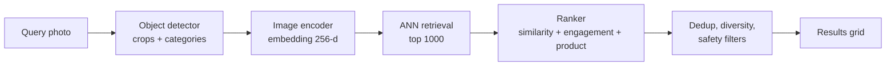
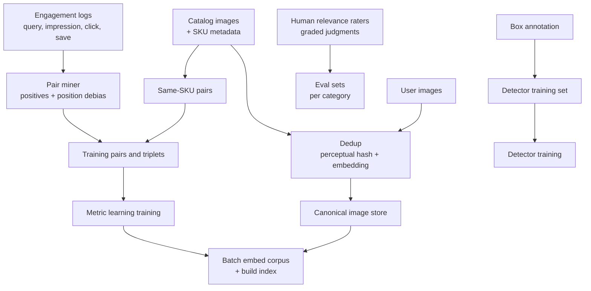
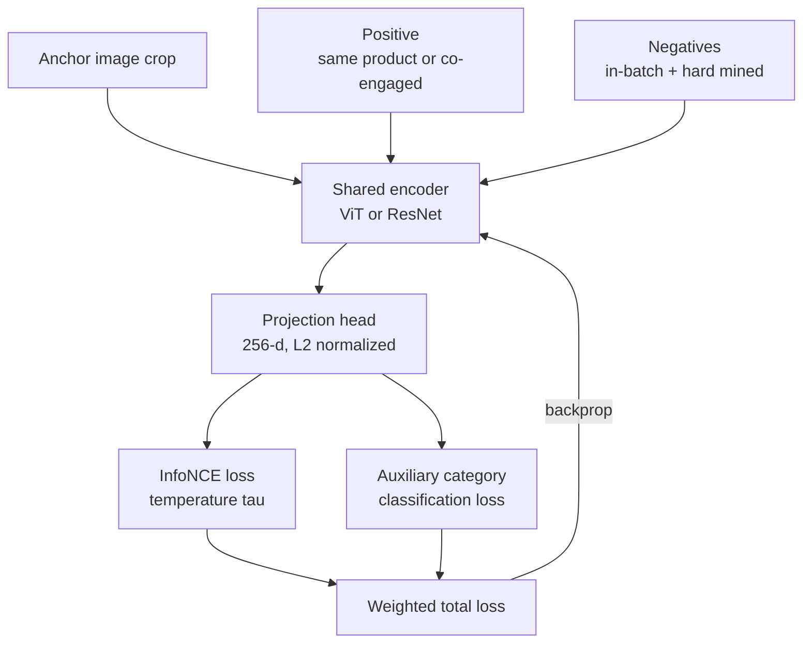
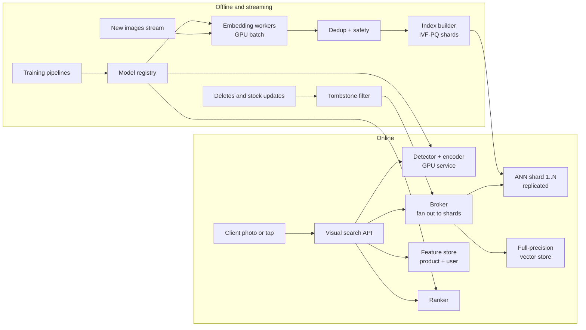
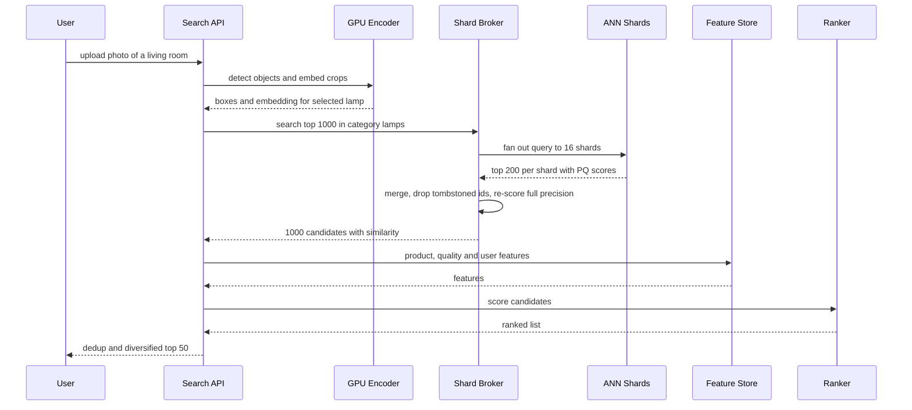

# Case study 8 — Visual Search (Search by Photo)

> **Interview prompt:** "Design a visual search system for a shopping or pinning platform: a user takes or uploads a photo — or taps on an object inside an image they're browsing — and we show visually similar products and images from a catalog of a billion images."

**Modules used:** [M04 Evaluation & data](../modules/04-evaluation-and-data.md) ·
[M07 Neural networks](../modules/07-neural-networks.md) ·
[M08 Embeddings & transformers](../modules/08-embeddings-and-transformers.md) ·
[M09 Recommendation & ranking](../modules/09-recommendation-and-ranking.md) ·
[M10 Framework](../system-design/10-ml-system-design-framework.md) ·
[M11 Data & training infra](../system-design/11-data-and-training-infrastructure.md) ·
[M12 Serving & monitoring](../system-design/12-serving-monitoring-experimentation.md)

> **Why this matters.** Visual search is the cleanest real-world example of
> **embedding-based retrieval**: learn a vector space where "similar" means "close",
> then find nearest neighbors among a billion vectors in tens of milliseconds. The
> interview tests metric learning, ANN index internals and their memory math, and the
> product judgment of "similar *in what sense*?"

---

## 1. Clarify requirements

| Question | Assumption |
|---|---|
| Query types? | (a) Camera/upload photo, (b) "tap on object" crop inside an existing image, (c) "more like this" for a whole image. |
| What do we return? | Visually similar images/pins, and shoppable products (same or similar item). Two result surfaces: "similar ideas" and "shop the look". |
| Corpus? | 1B images in total; ~100M shoppable product images. ~10M new images/day. |
| Scale? | ~50M visual queries/day (camera + tap + related). |
| Latency? | p99 < 300 ms end-to-end, including object detection. |
| Freshness? | New products searchable within hours; deleted/out-of-stock products removed within minutes. |
| Quality bar? | Exact-product match for shopping when available; style/semantic similarity otherwise. |

### Back-of-envelope numbers

| Quantity | Calculation | Value |
|---|---|---|
| Queries/day | given | 50M |
| Average QPS | $5\times10^7 / 86{,}400$ | ~580 QPS |
| Peak QPS | ~4× | ~2,300 QPS |
| Query-time GPU (detector + encoder ~15 ms batched, ~200 img/s/GPU) | 2,300 / 200 | ~12 GPUs (×2–3 headroom) |
| Index build: embed 1B images once at ~2,000 img/s/GPU | $10^9 / 2000$ = 500K GPU-s | ~140 GPU-hours (~6 h on 24 GPUs) |
| Daily incremental embedding | 10M images / 2,000 img/s | ~1.4 GPU-hours |
| Raw embedding memory, 256-d float32 | $10^9 \times 256 \times 4$ B | **1 TB** |
| HNSW graph links (M = 32, so 2M = 64 links per node on layer 0, 4-byte ids) | $10^9 \times 64 \times 4$ B | +256 GB → ~1.3 TB total |
| IVF-PQ with 32-byte codes + 8 B id | $10^9 \times 40$ B | **~40 GB** |

**Memory math explained.**
- Float32 HNSW for 1B × 256-d needs ~1.3 TB RAM — feasible only sharded across ~10–20 large-memory machines (×replicas for QPS and availability).
- **Product quantization (PQ)** splits each 256-d vector into $m = 32$ sub-vectors of 8 dims and replaces each sub-vector with the id of its nearest of 256 centroids (1 byte). 1 KB → 32 B: a **32× compression**. With IVF (inverted file: coarse k-means into e.g. 65,536 lists) we only scan a few lists per query.
- Typical production pattern: IVF-PQ (or HNSW over PQ codes) for candidate retrieval in a few shards, then **re-score the top ~1,000 with full-precision vectors** stored on SSD or in a separate in-memory store.

> **Why this matters.** "1B vectors × 256 dims × 4 bytes = 1 TB" is the single most
> important sentence of a visual-search interview. It forces the conversation about
> quantization, sharding and the recall/memory trade-off, which is exactly what the
> interviewer wants to probe.

---

## 2. Frame as an ML problem

**Business objective:** help users find things they want (engagement: saves/clicks;
commerce: product clicks, add-to-cart, purchases).

**ML objective:** learn an embedding function $f_\theta: \text{image} \to \mathbb{R}^d$
with $\|f_\theta(x)\| = 1$ such that semantically/visually similar images have high
cosine similarity, then retrieve and rank by similarity plus other signals.

**Multi-stage system:**
1. **Object detection:** find objects in the query image (lamp, sofa, shoe) — users usually care about one object, not the whole scene.
2. **Embedding + ANN retrieval:** embed the crop, retrieve top ~1,000 nearest neighbors.
3. **Ranking:** re-rank with a model that adds quality, engagement, product availability, price and personalization signals ([M09](../modules/09-recommendation-and-ranking.md)).
4. **Post-processing:** dedup near-identical images, diversity, safety filtering, business rules.

**Labels:** what counts as "similar"?
- **Same product** (exact match): from product catalog — multiple photos of the same SKU.
- **Engagement co-occurrence:** user searched with image A and saved/clicked B; images saved to the same board.
- **Human relevance judgments:** graded scale (exact / very similar / somewhat / not relevant).

Pinterest has publicly documented this kind of system in several papers: "Visual Search
at Pinterest" (KDD 2015), "Visual Discovery at Pinterest" (WWW 2017, including Lens and
Flashlight object-level search) and "Learning a Unified Embedding for Visual Search at
Pinterest" (KDD 2019), which trains one multi-task embedding for several visual search
products.

> **Common mistake.** Saying "use a pretrained ImageNet CNN and cosine similarity" and
> stopping. ImageNet features know that both images contain "a chair", but not that two
> chairs share a mid-century style, or that one listing is the *same* product. The
> embedding must be trained on the platform's own notion of similarity.

---

## 3. Data

**Sources:**
- Catalog images with product metadata (SKU, category, brand, color, price) — ~100M.
- User-generated images (pins/posts) — ~900M, often lifestyle scenes with many objects.
- Engagement logs: query image → impressed results → clicks/saves/purchases.
- Bounding-box annotations for detector training (human-labeled, plus weakly labeled from product tags).

**Training pairs for metric learning:**
| Pair source | Signal | Noise |
|---|---|---|
| Same SKU, different photos | Exact match | Low |
| Catalog product ↔ user photo where product was tagged | Street-to-shop match | Medium |
| Co-saved to the same board / same session | Semantic similarity | High (boards mix styles) |
| Query → clicked result in visual search logs | Relevance as judged by users | Position bias, feedback loop with current model |

**Dedup** is both a data-quality and a product requirement. A billion-image corpus has
many near-duplicates (re-uploads, resized, watermarked). Detect with perceptual hashes or
embedding similarity above a high threshold; cluster and keep a canonical image per
cluster. In training, near-duplicates in a batch must not be used as negatives for each
other (false negatives) and must not span train/test.

**Imbalance:** some categories (fashion, home decor) dominate; balance training by category
so the embedding is good for rare categories too.

**Privacy & safety:** query photos may contain faces, people, private homes, documents.
Don't store query photos longer than necessary; don't train on them without consent;
exclude faces from "similar person" retrieval (face recognition is out of scope and
legally sensitive); apply safety classifiers to both corpus and results.

### Data and label pipeline

---

## 4. Features

| Feature / signal | Type | Source | Online/offline | Freshness |
|---|---|---|---|---|
| Query crop pixels → embedding | Dense 256-d | Encoder at request | Online | Per request |
| Detected category of query crop | Categorical | Detector | Online | Per request |
| Candidate image embedding | Dense 256-d (PQ codes in index) | Batch/stream embedding | Offline → index | Hours for new images |
| Cosine similarity (full precision re-score) | Numeric | Computed | Online | Per request |
| Candidate category, color histogram, dominant colors | Categorical/vector | Image annotations | Offline | Hours |
| Candidate quality score (blur, resolution, aesthetics) | Numeric | Quality model | Offline | Hours |
| Candidate engagement (CTR, saves, purchases; smoothed) | Numeric | Aggregation jobs | Offline (feature store) | Daily / hourly |
| Product: in stock, price, merchant rating | Numeric/binary | Catalog service | Online | Minutes |
| Text: title/description embedding of candidate | Dense vector | Text encoder | Offline | Hours |
| User features: style preferences, recent saves, region | Vector/categorical | User feature store | Online | Hourly |
| Duplicate-cluster id | Categorical | Dedup job | Offline | Daily |
| Safety scores | Numeric | Safety classifiers | Offline | Hours |

---

## 5. Model

### Baseline
1. Pretrained CNN/ViT (ImageNet or a public image–text model such as CLIP) embeddings of the whole image + brute-force cosine on a sampled corpus.
2. Add category filter from a classifier ("only search shoes").

### Production

**Object detection.** A detector (Faster R-CNN / DETR / YOLO-family) finds objects and
categories in the query image; the UI shows tappable dots, and the default crop is the
most salient shoppable object. Detection on the **corpus** side too: index object crops
of lifestyle images, so a lamp in a living-room photo can be matched by a lamp query.
Pinterest's public papers describe this object-level indexing for its Lens and
"shop the look" products.

**Embedding model.**
- Backbone: CNN (ResNet-family) or ViT ([M07](../modules/07-neural-networks.md), [M08](../modules/08-embeddings-and-transformers.md)), initialized from large-scale pretraining (supervised or image–text contrastive).
- Projection head → 256-d, L2-normalized.
- **Multi-task training** across several similarity notions (same product, engagement co-occurrence, category classification as auxiliary) to produce one unified embedding — the approach publicly described in Pinterest's KDD 2019 unified-embedding paper. Benefit: one index serves multiple products.
- Optionally fuse text (title) embeddings for catalog items, so a candidate's representation is less ambiguous.

**Ranker.** GBDT or small neural ranker over the ~1,000 ANN candidates: similarity score,
category match, quality, engagement, product availability, price band, user preferences.
Trained on click/save/purchase labels with a learning-to-rank loss ([M09](../modules/09-recommendation-and-ranking.md),
[M05](../modules/05-trees-and-ensembles.md)). This lets us optimize for "useful", not
just "looks the same", without retraining the embedding.

### ANN index

| Index | How it works | Memory for 1B × 256-d | Recall / latency | Updates |
|---|---|---|---|---|
| Brute force | Exact dot product with all | 1 TB | Exact; far too slow | Trivial |
| **HNSW** | Multi-layer proximity graph; greedy search from top layer down | ~1.3 TB (vectors + links) | Very high recall at ~1–5 ms per shard | Inserts OK; deletes via tombstones, periodic rebuild |
| **IVF-PQ** | Coarse k-means lists + product-quantized residuals; scan $n_{\text{probe}}$ lists | ~40 GB (+ centroids) | Lower recall (quantization error); fix with re-scoring | Add to lists; retrain quantizer occasionally |
| HNSW over PQ / ScaNN-style anisotropic quantization | Graph or partition search with compressed vectors | 50–150 GB | High recall with re-rank | Similar to above |

**Our choice:** shard by image id into ~16 shards; each shard runs IVF-PQ (or HNSW on
compressed vectors) in RAM returning top-200; merge to top ~1,000 globally; re-score with
full-precision vectors (fetched from an SSD-backed key-value store) before ranking. Tune
$n_{\text{probe}}$ / HNSW `efSearch` to reach e.g. recall@100 ≥ 95% vs exact search at the
latency budget. **Category-partitioned indexes** (shoes, furniture...) are an option when
the detector is confident: smaller search space, better precision.

> **Common mistake.** Measuring only model recall with exact search offline, then
> deploying an ANN index that silently loses 10–15% of true neighbors. Always report
> **ANN recall vs exact** as a separate metric and include it in the launch checklist.

---

## 6. Training

**Losses.** Triplet loss on anchor $a$, positive $p$, negative $n$, margin $m$, with
embeddings $f(\cdot)$ and squared distance $D$:

$$
\mathcal{L}_{\text{triplet}} = \max\big(0,\; D(f(a), f(p)) - D(f(a), f(n)) + m\big)
$$

It works but wastes most triplets (easy negatives give zero loss). **InfoNCE** (softmax
over many negatives at once) is more sample-efficient: for a batch of $B$ (anchor,
positive) pairs, each anchor treats the other $B-1$ positives as negatives:

$$
\mathcal{L}_{\text{InfoNCE}} = -\frac{1}{B}\sum_{i=1}^{B}\log\frac{\exp(f(a_i)^\top f(p_i)/\tau)}{\sum_{j=1}^{B}\exp(f(a_i)^\top f(p_j)/\tau)}
$$

with temperature $\tau$ (e.g. 0.05–0.1). Larger batches (thousands) = more negatives =
better embeddings; use cross-device negative sharing.

**Negatives.**
- In-batch random negatives teach coarse separation (shoe vs sofa).
- **Hard negatives** (same category, different product — a different black sneaker) teach fine-grained distinctions; mine them from the current model's ANN results excluding true positives. Too many too-hard negatives early cause collapse → curriculum: start random, add hard negatives later.
- **False negatives**: near-duplicates and the same SKU in a batch must be masked.
- Correct for popularity: popular items appear as in-batch negatives more often → logQ correction ([M09](../modules/09-recommendation-and-ranking.md)).

**Augmentations:** crops, color jitter (careful — color is often what the user wants to
match, so keep jitter mild), blur, perspective, background replacement — simulating
camera photos vs clean catalog shots (the "street-to-shop" domain gap).

**Splits:** by product/SKU and by time — the same product must not appear in train and
test pairs. Dedup clusters must not straddle splits.

**Cadence and backfill:**
- Ranker: weekly retrain (cheap).
- Embedding model: every few months; each new version requires **re-embedding the whole corpus** (~140 GPU-hours) and rebuilding indexes, because embeddings from different model versions are not comparable. Run both indexes side by side during migration.
- New images: embedded with the current model by a streaming job within hours.

---

## 7. Evaluation

### Offline metrics

| Metric | Definition | Why |
|---|---|---|
| Recall@k (k = 10, 100, 1000) | Fraction of relevant items in top-k | Candidate generation quality — the ranker can't recover what retrieval misses |
| mAP@k | Mean over queries of average precision | Rewards putting relevant items high in the list |
| nDCG@k with graded human labels | Discounted gain with relevance grades | Matches "exact > similar > somewhat" |
| Exact-product hit rate@k | Same SKU in top-k (catalog queries) | Shopping success |
| ANN recall vs exact | Overlap of ANN top-k and brute-force top-k | Index quality, separately from model quality |
| Per-category, per-query-source slices | — | Camera photos vs catalog crops behave differently |

**Average precision** for one query with relevant set $R$ and ranked list:
$\text{AP} = \frac{1}{|R|}\sum_{k} P@k \cdot \text{rel}(k)$, where $\text{rel}(k)=1$ if
the item at rank $k$ is relevant; mAP averages AP over queries ([M04](../modules/04-evaluation-and-data.md)).

**Human relevance judgments.** Engagement labels are biased by the current model (users
can only click what we show). So maintain a **human-rated eval set**: ~5K queries
stratified by category and source; raters judge top results of both old and new systems
on a graded scale with guidelines and examples; use multiple raters and measure
agreement. Side-by-side preference tests ("which result set is better?") are a fast,
sensitive tool for comparing two systems before an A/B test.

### Online metrics
- Engagement: click-through and save rate on visual search results, queries per session with at least one engagement.
- Commerce: product click-outs, add-to-cart, purchases attributed to visual search.
- Abandonment: sessions where the user takes a photo and leaves without engaging.

### Guardrails
- Latency p99, error rate, empty-result rate.
- Safety: rate of unsafe results (sampled audits).
- Merchant diversity (one merchant must not dominate results).

### A/B design
- Randomize by user. Primary metric: engaged-query rate; secondary: commerce metrics.
- Embedding-model changes require a full new index → A/B serves control and treatment from two indexes (costly but necessary; run treatment index on a subset of replicas).
- Run ≥ 2 weeks; watch novelty effects for UI changes (tappable dots).
- Interleaving (mix results from two rankers in one list) is more sensitive for ranker changes.

---

## 8. Serving architecture

### Request-time sequence

### Latency budget (p99)

| Step | Budget |
|---|---|
| Upload + image decode/resize (client compresses to ~640 px) | 40 ms |
| Object detection (GPU) | 40 ms |
| Crop embedding (GPU) | 15 ms |
| ANN fan-out to shards (parallel) + merge | 40 ms |
| Full-precision re-score of 1,000 candidates | 15 ms |
| Feature fetch | 20 ms |
| Ranker (1,000 candidates) | 30 ms |
| Dedup, diversity, safety filter | 10 ms |
| Network + slack | 90 ms |
| **Total** | **300 ms** |

**Freshness of the index:**
- **Inserts:** a streaming job embeds new images within minutes–hours and appends them to a small, fresh in-memory "delta" index (HNSW handles inserts well); queries search main + delta and merge. Nightly/weekly, deltas are merged into rebuilt main shards.
- **Deletes / out-of-stock:** apply as a tombstone filter at query time (minutes), physically removed at the next rebuild.
- **Model upgrades:** full re-embed and blue-green index swap.

---

## 9. Monitoring & iteration

**Monitor:**
- Query embedding distribution (mean norm before normalization, cluster occupancy of IVF lists — skewed lists hurt latency).
- ANN recall vs exact on a fixed probe set, daily (index degradation after many inserts).
- Empty/low-similarity result rate by category (gaps in catalog coverage).
- Engagement by category and query source; detector confidence distribution (new camera devices or app versions can shift input images).
- Index freshness lag; tombstone ratio (rebuild when high).

**Feedback loops:** click logs only contain items the current model retrieved → the
embedding trained on them reinforces the current notion of similarity. Mitigate with
human-rated data, exploration (inject some candidates from alternative retrievers), and
position-debiased labels.

### Failure modes

| Symptom | Likely cause | Mitigation |
|---|---|---|
| Results all from the same product or near-identical images | Corpus duplicates | Dedup clusters at index time; collapse by cluster id at serving |
| Camera photos give poor results, catalog crops fine | Domain gap (lighting, angle, background) | Street-to-shop pairs, augmentations, query-side detector crops |
| Matches color but wrong object type | Embedding over-weights color/texture | Category-aware training (auxiliary loss), category filter from detector, hard negatives of same color |
| Latency p99 spikes | Unbalanced IVF lists or one hot shard | Rebalance/retrain coarse quantizer, more replicas, cap $n_{\text{probe}}$ |
| Out-of-stock or deleted items shown | Tombstones not applied, or delta lag | Query-time availability filter from catalog service; freshness alerts |
| Offline recall improved but online flat | ANN index lost the gain, or ranker overrode similarity | Report ANN-vs-exact recall; retrain ranker on new similarity feature |
| New embedding model makes old index unusable mid-rollout | Mixed embedding versions | Version-tag embeddings; never compare across versions; dual index during migration |
| Unsafe images surface for innocuous queries | Visual similarity ignores policy | Safety scores as hard filter at index and serve time |

---

## 10. Trade-offs & extensions

| Trade-off | Option A | Option B | Our choice |
|---|---|---|---|
| HNSW vs IVF-PQ | Best recall/latency, ~1.3 TB RAM | ~40 GB, lower recall | IVF-PQ (or HNSW on compressed vectors) + full-precision re-score |
| Embedding dimension | 512+: more expressive | 128–256: cheaper index | 256-d; check recall vs memory curve |
| Unified vs per-product embeddings | One model, one index, shared gains | Specialized, better per task | Unified multi-task embedding (publicly reported by Pinterest) |
| Whole-image vs object-level index | Simpler, fewer vectors | Matches what users tap; ~3–5× more vectors | Object-level for shoppable categories, whole-image for "more ideas" |
| CNN vs ViT backbone | Cheaper, mature | Better with large pretraining, costlier | ViT if GPU budget allows; distill for query-side latency |

**Extensions:** multimodal queries ("this dress but in red" — combine image and text
embeddings, e.g. CLIP-style joint space); complete-the-look (compatibility, not
similarity: learn a different embedding space); video frames; on-device detection to
reduce upload latency.

---

## 11. Interviewer follow-ups

Q1. Walk me through the memory for indexing 1B images and how you'd reduce it.

1B × 256 dims × 4 B = 1 TB for raw float32 vectors; HNSW adds links (~64 neighbor ids ×
4 B per node on the base layer ≈ 256 GB). Reductions: (1) lower dimension (128-d halves
it, check recall); (2) float16 / int8 scalar quantization (2–4×); (3) product quantization
to 32 B per vector (32×) → ~32 GB + ids; (4) IVF so only a fraction is scanned; (5) keep
full-precision vectors on SSD only for re-scoring the top ~1,000. Shard across machines
and replicate for QPS.

Q2. Triplet loss vs InfoNCE — which and why?

Triplet loss uses one negative per anchor and stops learning once the margin is
satisfied, so most random triplets are uninformative and you need careful hard-negative
mining. InfoNCE contrasts each anchor against all other items in the batch (hundreds to
thousands of negatives) in a softmax, giving richer gradients and better embeddings for the
same compute; it is the loss behind CLIP and SimCLR. Use InfoNCE with large batches, add
mined hard negatives, mask false negatives, and tune the temperature.

Q3. How do you add 10M new images per day without rebuilding the index?

Embed new images with the current model in a streaming job; insert them into a small
fresh "delta" index (HNSW supports incremental inserts); query both main and delta and
merge. Deletes are tombstones filtered at query time. Periodically (nightly/weekly) rebuild
main shards including deltas and dropping tombstones, and retrain IVF centroids/PQ
codebooks occasionally if the data distribution drifts. Swap with blue-green deployment.

Q4. How do you know whether a quality drop is the model or the index?

Measure separately: model quality = recall@k / mAP with **exact** nearest-neighbor search
on the eval set; index quality = overlap between ANN top-k and exact top-k on a probe
query set. If exact-search metrics hold but ANN recall dropped, the index is the problem
(unbalanced lists, too-low $n_{\text{probe}}$, stale quantizer). If both dropped, the
embedding model or the input data changed.

Q5. "Similar" means different things — same product vs same style. How do you handle that?

Make it explicit: train a multi-task embedding with heads/losses for exact-product match
and for engagement-based similarity, and let the **ranker** weight signals per surface
(shopping surface favors exact SKU and in-stock items; inspiration surface favors style and
engagement). Alternatively maintain two embeddings/indexes. Human judgment guidelines must
define grades ("exact", "very similar", "same style") so offline metrics reflect the
surface's intent.

Q6. How do you evaluate without biased click labels?

Clicks only exist for results the current system showed, at positions with different
attention. Use a human-rated set with graded relevance (stratified queries, multiple
raters, agreement checks), pooled from candidates of several systems so a new system isn't
penalized for finding items never shown before. Complement with side-by-side preference
tests and position-debiased click metrics. Use online A/B for the final decision.

Q7. Upgrading the embedding model — what is the rollout plan?

New embeddings live in a different vector space, so the whole corpus must be re-embedded
(~140 GPU-hours for 1B images in our estimate) and a new index built. Steps: offline eval
(exact and ANN recall, human-rated side-by-side), build the new index in parallel, A/B with
a slice of traffic served from the new index, ramp, then decommission the old one. Version
every stored embedding; never mix versions in one index. Backward-compatible training
(aligning new embeddings to the old space) is an option to avoid full re-embedding, at some
quality cost.

Q8. Why run object detection instead of embedding the whole image?

Query photos are scenes; the user wants one object. A whole-scene embedding mixes the sofa,
lamp, rug and wall color, so neighbors are "similar rooms", not the lamp. Detection gives
crops (and categories useful as filters), and indexing object crops on the corpus side lets
a lamp query match a lamp appearing inside someone else's room photo. Pinterest's public
papers report that object-level search substantially improved engagement for shopping-style
queries.

---

**Further reading (public):** Jing et al., "Visual Search at Pinterest" (KDD 2015);
Zhai et al., "Visual Discovery at Pinterest" (WWW 2017); Zhai et al., "Learning a Unified
Embedding for Visual Search at Pinterest" (KDD 2019); Malkov & Yashunin, "HNSW" (2016);
Jégou et al., "Product Quantization for Nearest Neighbor Search" (2011); Johnson et al.,
"Billion-scale similarity search with GPUs" (FAISS, 2017); Radford et al., "CLIP" (2021).
