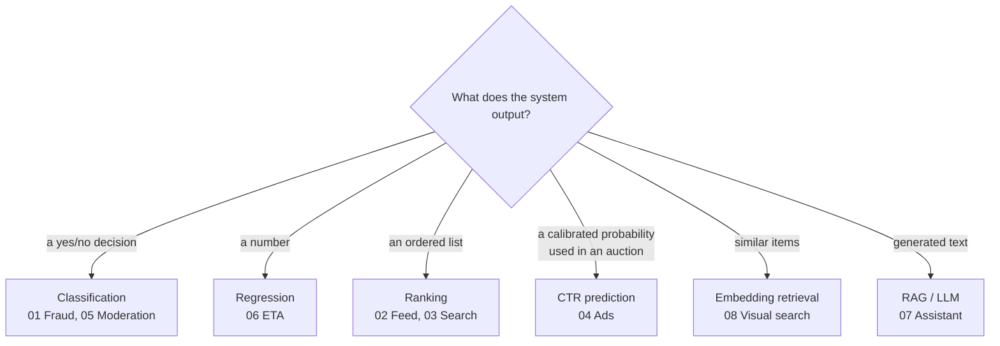

# Part IV: Case studies

Each case study is written as a **full-marks ML system design interview answer**, following
the case study template in [docs/module-template.md](../docs/module-template.md) and the
framework in [M10](../system-design/10-ml-system-design-framework.md).

| # | System | ML archetype | Core algorithms reused |
|---|---|---|---|
| 01 | [Real-time payment fraud detection](01-fraud-detection.md) | Imbalanced binary classification, streaming features | GBDT (M05), anomaly detection (M06), thresholds (M04) |
| 02 | [News feed ranking](02-news-feed-recommendation.md) | Multi-stage recommendation, multi-task ranking | Two-tower, MTL ranking (M09), embeddings (M08) |
| 03 | [E-commerce product search](03-search-ranking.md) | Retrieval + learning to rank | BM25 + semantic retrieval (M08), LambdaMART (M05, M09) |
| 04 | [Ad click-through-rate prediction](04-ad-click-prediction.md) | Calibrated probability at huge scale | Logistic regression (M03), GBDT, deep CTR models (M07) |
| 05 | [Harmful content moderation](05-content-moderation.md) | Multimodal multi-label classification + humans in the loop | Transformers, CNNs (M07, M08), active learning (M11) |
| 06 | [ETA prediction](06-eta-prediction.md) | Regression on spatio-temporal data | GBDT, quantile loss (M02, M05), deep models |
| 07 | [LLM customer-support assistant (RAG)](07-rag-assistant.md) | Retrieval-augmented generation | Embeddings, ANN, transformers (M08) |
| 08 | [Visual search](08-visual-search.md) | Metric learning + billion-scale nearest neighbours | CNN/ViT (M07), contrastive learning (M08), ANN (M09) |

