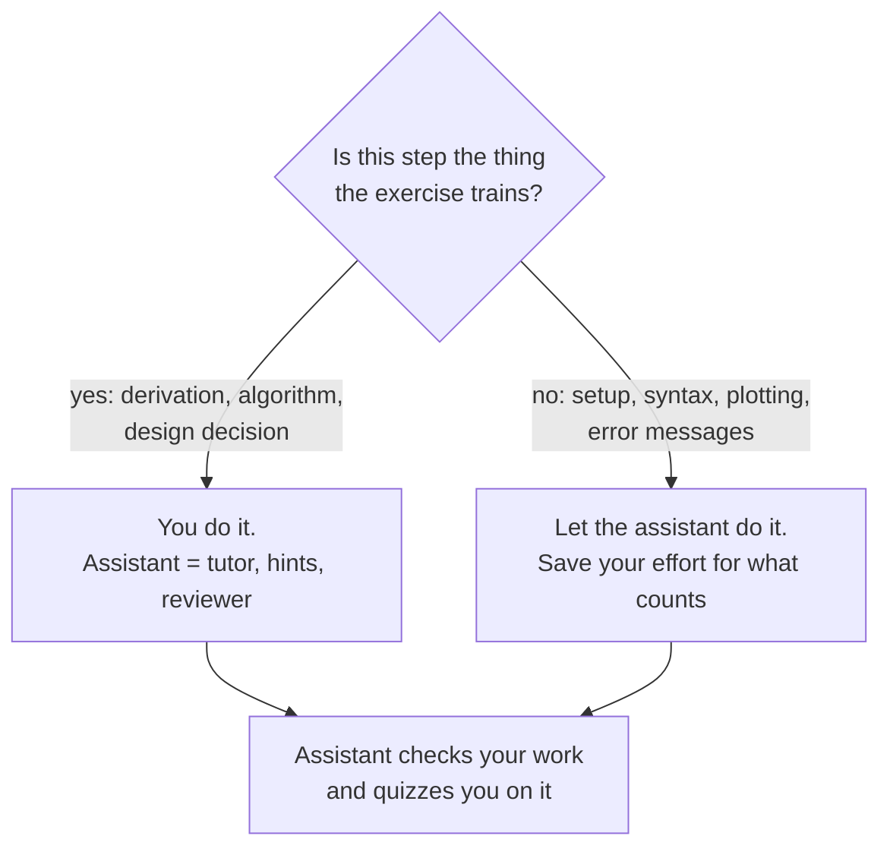
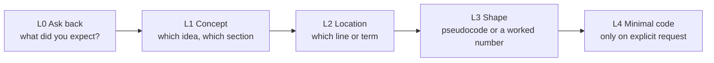

# Learning ML with an AI coding assistant

> **Big idea:** an AI assistant makes you learn faster when it makes you *think more*, and
> slower when it thinks *for* you. This course configures the assistant to do the first.

This guide covers how to use **Claude Code** (pre-configured in this repo) or **any other coding
assistant** (Copilot, Cursor, Codex, ChatGPT, …) as a study partner in this course.

## 1. First principles: when does an assistant help learning?

Start from what learning *is*: changing what you can do **without help**. The exam, the
ML system design interview, and your future job all test you unaided. So the question is not
"did the assistant help me finish?" but "can I now do it alone?"

Three findings from learning science decide the answer:

| Principle | What it says | Implication for AI use |
|---|---|---|
| **Generation effect** | You remember what you produce far better than what you read. | Write the derivation/code first; use the assistant to *check* it, not to produce it. |
| **Retrieval practice** | Recalling information strengthens memory more than re-reading it. | Have the assistant *quiz* you instead of *summarize* for you. |
| **Desirable difficulty** | Struggle that is hard but solvable produces durable learning. | Ask for the *smallest* hint that unblocks you, not the answer. |

The failure mode has a name: **cognitive offloading**. If the assistant writes your backprop,
the lab passes, it *feels* like progress, and you learn almost nothing about backprop. You find
out at the midterm.



## 2. The six study modes

Each mode is a Claude Code slash command (defined in [`.claude/skills/`](../.claude/skills/)) and
also a copy-paste prompt for other assistants (§5).

| Mode | Command | Learning principle | When to use it |
|---|---|---|---|
| Tutor | `/tutor <topic>` | Elaboration, first principles | After the lecture, when something felt like magic |
| Hint ladder | `/hint <lab> [exercise]` | Desirable difficulty | Stuck on a lab for 15+ minutes |
| Code review | `/review-my-code <file>` | Feedback on your own work | After your lab passes, before you submit |
| Quiz | `/quiz-me [module]` | Retrieval + spaced practice | 2–3 times a week, 15 minutes |
| Explain back | `/explain-back <topic>` | Generation (Feynman technique) | Before a quiz or exam, to find your gaps |
| Mock interview | `/mock-interview [prompt]` | Realistic rehearsal | Weeks 11–15, at least once a week |

The **hint ladder** is the most important one. Every hint request moves up one level:



Most students get unstuck at L1 or L2. If you regularly need L4, that tells you which module
section to reread.

## 3. Setup

### Claude Code (recommended; pre-configured)

```bash
git clone <this repository> && cd machine-learning-worldclass
claude            # start Claude Code in the repo root
```

On start, Claude Code reads [`CLAUDE.md`](../CLAUDE.md), which loads the tutor rules in
[`AGENTS.md`](../AGENTS.md) and makes the six slash commands available. Try:

```text
/tutor why cross-entropy instead of MSE for logistic regression
/hint 6 2
/quiz-me M04
/mock-interview P10
```

The skills keep a private study log in `.study/` (hints used, quiz results, interview scores).
It is git-ignored. `/quiz-me` reads it to re-ask what you got wrong (spaced repetition).

### Other assistants

| Assistant | What it reads automatically | What to do |
|---|---|---|
| Cursor, Codex, and other agents that support `AGENTS.md` | [`AGENTS.md`](../AGENTS.md) | Nothing; open the repo. Use the prompts in §5 for the study modes. |
| GitHub Copilot (chat) | [`.github/copilot-instructions.md`](../.github/copilot-instructions.md) | Nothing; use the prompts in §5. |
| ChatGPT / Claude.ai / other chat UIs | Nothing | Paste the "tutor contract" below at the start of the chat, then use §5. |

**Tutor contract** (paste into any chat assistant):

```text
You are my tutor for a university machine learning course. I must be able to do this work
without you in an exam and in an ML system design interview. Do not give me full solutions to
exercises. Explain from first principles (problem, naive approach and why it fails, the fix,
a worked number). When I am stuck, give one hint at a time: L0 ask what I expected, L1 name the
concept, L2 point to where the problem is, L3 pseudocode, L4 minimal code only if I explicitly
ask. End explanations with one question that checks I understood, and don't answer it for me.
```

## 4. Usage policy by assessment

Each assessment trains and measures something different, so the allowed level of assistance
differs. When in doubt, ask the instructor *before* submitting.

| Assessment | Level | Allowed | Not allowed |
|---|---|---|---|
| Reading modules, lectures | 🟢 Open | Any mode. Ask anything. | — |
| Labs (asserts graded) | 🟡 Tutor | `/tutor`, `/hint` (any level), `/review-my-code`, setup and error help | Pasting an assistant's full solution; deleting or weakening asserts |
| Lab student exercises | 🟡 Tutor | Same as labs | Same as labs |
| Weekly quizzes, midterm | 🔴 Closed | Practice beforehand with `/quiz-me`, `/explain-back` | Any assistant during the quiz or exam |
| Mock interviews (graded) | 🔴 Closed | Practice with `/mock-interview` as often as you like | Any assistant during the graded interview |
| Capstone code | 🟡 Tutor+ | Everything in Tutor, plus generating boilerplate (FastAPI routes, plotting, data loading, tests) | Having the assistant design the system or choose/justify the metric and model |
| Capstone design doc | 🟡 Tutor | Critique against the rubric, grammar, diagram syntax | Assistant-written design sections |
| Capstone defense | 🔴 Closed | — | — |

**Disclosure (required for labs and capstone).** Add an `AI-USE.md` (or a section in your
README) with: which assistant you used, which modes, the highest hint level reached per
exercise, and anything the assistant wrote that you kept. Honest disclosure is never penalized.
Undisclosed use of assistant-written solutions is treated as an academic integrity issue.

**Why the 🔴 assessments matter:** they are the only evidence of what you can do unaided, and the
mock interview reproduces exactly the conditions of the real ML system design interview.
Use the assistant generously to *prepare* for them.

## 5. Prompt library (for any assistant)

The Claude Code skills do these automatically; for other assistants, copy the prompt.

| Mode | Prompt |
|---|---|
| Tutor | `Teach me <topic> from first principles using modules/<file>.md. First ask what I already know. Explain in short chunks: the problem, the naive approach and why it fails, the fix with a worked number. End with one check question.` |
| Hint | `I'm stuck on labs/<file>.py exercise <n>. Here is my code and the error. Give me only the next hint level (L0–L4) of the hint ladder in AGENTS.md. Don't write the solution.` |
| Review | `Review my code in <file> like a senior ML engineer. Order: correctness, ML methodology (leakage, splits, metrics), verification, clarity. Cite lines. Give observations and leading questions, not corrected code.` |
| Quiz | `Quiz me on <module> with 5 new questions in the style of assessments/quizzes.md: short answer, one calculation, one spot-the-leak scenario. One at a time; grade each and cite the module section.` |
| Explain back | `I'll explain <topic> in my own words. Act as a curious first-year student: ask "why?" and "what if?" about the parts I skip or get wrong. After 6 exchanges, list what I missed.` |
| Mock interview | `Be my ML system design interviewer for: "<prompt from assessments/mock-interview-bank.md>". 45 minutes. Don't help or validate during the interview. Push on numbers and trade-offs. Afterwards score me on the 8 dimensions of assessments/ml-system-design-rubric.md with quotes.` |

### Per-module starter prompts

| Module | Try asking the tutor |
|---|---|
| M01 | "Why does a model with zero training error usually do worse on new data? Walk me through bias–variance with a number." |
| M02 | "Derive why minimizing MSE is the same as maximum likelihood under Gaussian noise — let me do each step." |
| M03 | "Why is logistic regression's loss convex but MSE on a sigmoid isn't?" |
| M04 | "Give me 3 realistic pipelines and let me find the data leak in each." |
| M05 | "Compute a Gini split with me on a 10-row dataset, then tell me why boosting fits residuals." |
| M06 | "When would PCA reconstruction error catch an anomaly that per-feature z-scores miss?" (Lab 5 has the answer — predict first.) |
| M07 | "Let me do backprop by hand on a 2-2-1 network; check each number I give you." |
| M08 | "Why divide by √d in attention? Let me predict what happens to softmax without it." |
| M09 | "Why does matrix factorization lose to popularity on recall in Lab 8?" |
| M10 | "Give me a vague business ask and grade only my problem framing (first 8 minutes)." |
| M11 | "Show me a feature join that leaks future data and let me fix it with point-in-time correctness." |
| M12 | "I ran an A/B test with these numbers — is it significant, and was it powered?" |

## 6. AI-native exercises

These exercises use the assistant *as the object of study*. They build a skill every ML
engineer now needs: verifying model-generated code and designs.

1. **Audit the assistant (labs 2, 6).** Ask an assistant to implement logistic-regression
   gradient descent (or MLP backprop) from scratch. Without running it, predict whether it is
   correct. Then verify it with the gradient check from the lab. Report any bug, how you found it,
   and which check would have caught it automatically.
2. **Leak hunt (M04, M11).** Ask an assistant: "Write a scikit-learn pipeline to predict customer
   churn from this event table." Find every leakage and split problem in the result
   (scaler fit before the split, random split on time-ordered data, features computed after the
   label date). Rewrite the prompt so the assistant gets it right, and explain what you had to
   tell it.
3. **Metric argument (M04, case studies).** Ask two assistants (or two sessions) which metric to
   use for a fraud model. Compare the answers to `case-studies/01-fraud-detection.md` and write a
   one-paragraph verdict on who is right and why.
4. **Interviewer swap (M10).** You play the interviewer and the assistant plays the candidate on a
   prompt from the bank. Score it with the rubric. Where would it lose points? This teaches you
   what the rubric rewards faster than reading it.
5. **Diagram review (case studies).** Draw your own architecture for a case study in Mermaid
   *before* reading it, then ask `/review-my-code` (or a reviewer prompt) to critique it against
   the rubric. Compare with the case study's diagram.

## 7. Notes for instructors

- **Grade what the student can do unaided.** Keep 🔴 assessments (quizzes, midterm, graded mock
  interview, capstone defense) assistant-free; they anchor the grade.
- **Use the study logs (voluntarily shared).** A student's `.study/hints.md` shows which concepts
  needed L3–L4 hints. Across a class, that is a precise map of which lecture sections to redo.
- **Run one AI-native exercise per part** (e.g. #2 in week 4, #1 in week 7, #4 in week 11).
- **Demo the hint ladder live in Lab 0** so students see what good assistant use looks like.
- Assistants change fast. The rules in `AGENTS.md` are tool-agnostic; only the setup table in §3
  should need updating.
