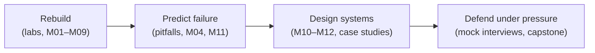

# Instructor guide

This guide explains how to teach the course, not just what is in it.

## 1. The design of the course, from first principles

What does it mean for a student to "understand ML"? We use three tests:

1. **Can they rebuild it?** If a student can implement logistic regression or backprop
   in NumPy, the library stops being a black box. → *Labs.*
2. **Can they predict how it fails?** Understanding means knowing when an algorithm breaks
   (leakage, imbalance, drift, vanishing gradients). → *"Pitfalls" section in every module.*
3. **Can they use it inside a system someone depends on?** That is what industry pays for,
   and it is exactly what the ML system design interview measures. → *Part III + case studies.*

The course is ordered so that each test builds on the one before it:

## 2. A typical week

| Session | Length | Format | Purpose |
|---|---|---|---|
| Lecture 1 | 90 min | Sections 1–4 of the module: problem → first principles → algorithm → diagrams | Build the mental model |
| Lecture 2 | 90 min | Sections 5–7: code walkthrough, real-world applications, system-design hook | Connect to practice |
| Lab | 2 h | Students run the lab, then do the exercises at the bottom of the file | Rebuild it |
| Quiz | 10 min | Start of next lecture, from [quizzes.md](../assessments/quizzes.md) | Retrieval practice |

**Lecture technique that works well:** before showing the standard algorithm, ask the room
"what is the simplest thing that could work?" and let them propose it. Then show where it
fails. Each module's *First principles* section is written in exactly this order, so you
can follow it as a script.

## 3. Teaching the system-design half (weeks 11–15)

- **Weeks 11–13 (design studios):** 30 min of lecture, then 60 min of small-group design on
  a whiteboard using the framework from M10. Rotate the "candidate" role.
- **Week 14 (flipped case studies):** assign one case study per group a week before. Each group
  presents it in 15 min *as if in an interview*, and the class plays interviewer using the
  follow-up questions at the end of the case study.
- **Mock interviews:** pairs, 45 min each, scored with the
  [rubric](../assessments/ml-system-design-rubric.md), using prompts from the
  [mock interview bank](../assessments/mock-interview-bank.md). Every student does at least
  three: one as a candidate, one as an interviewer, and one graded by staff.

## 4. Common student misconceptions to address explicitly

| Misconception | Where it is addressed |
|---|---|
| "Higher accuracy = better model" | M04 (imbalance, cost-based thresholds) |
| "Deep learning is always best" | M05 (GBDT on tabular), M10 (baseline first) |
| "The test set tells me how it will do in production" | M04 (leakage, time splits), M12 (drift) |
| "Training is the hard part" | M11 (data/labels), M12 (serving, monitoring) |
| "An A/B test win is always real" | M12 (power, novelty, network effects, multiple testing) |
| "LLMs replace the need for ML fundamentals" | M08, case study 07 (retrieval, evaluation, cost) |

## 5. AI coding assistants

The repo ships tutor rules ([`AGENTS.md`](../AGENTS.md)) and Claude Code study skills
([`.claude/skills/`](../.claude/skills/)). Students use them for hints, quizzes, code review and
mock interviews; the assessment policy and AI-native exercises are in
[ai-assisted-learning.md](ai-assisted-learning.md). Keep quizzes, the midterm, the graded mock
interview and the capstone defense assistant-free so the grade measures unaided ability.

## 6. Website, autograding and usage tracking

The course website (GitHub Pages, built from `website/`) lets students run labs in the browser and
track their progress. The `Labs` GitHub Actions workflow runs every lab's asserts on each push, so
with GitHub Classroom it works as a per-student autograder. To see whether the course is being
used, and how, follow [tracking-and-analytics.md](tracking-and-analytics.md). It separates
reach, engagement and learning, and covers the privacy defaults.

## 7. Adapting the course

- **Shorter (10 weeks):** merge M01+M02, skip M06, teach four case studies (01, 02, 04, 07).
- **Graduate level:** add derivations from the *Further reading* of each module and require
  a research-paper reproduction in the capstone.
- **Bootcamp/industry:** start at M04, cover M05/M08/M09 at a high level, and spend half the
  time on Part III and the case studies.
