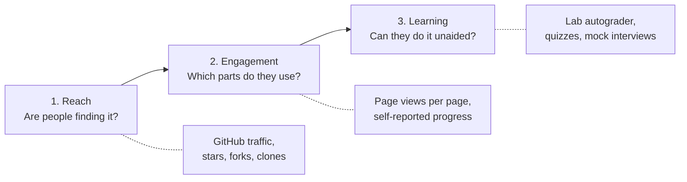

# Tracking course usage and learning

> **Big idea:** decide *what question* you want answered before choosing a tracking tool.
> Counting visitors tells you about reach; only graded work tells you about learning.

## 1. First principles: what does "students are using the course" mean?

"Usage" is really three different questions. Each one has a different data source, and none of
them answers the others:

| Question | Signal | Tool in this repo | Limits |
|---|---|---|---|
| **Reach:** is anyone finding and copying the course? | Repo views, unique visitors, clones, referrers | GitHub **Insights → Traffic** + the [traffic archive workflow](#3-reach-github-traffic) | Aggregate only; GitHub keeps 14 days |
| **Engagement:** which pages do people read? | Page views per site page | Optional **GoatCounter** on the website | Aggregate only, no individuals; views ≠ understanding |
| **Engagement (per student):** how far has each student got? | "Mark as done" ticks | The site's **My progress** page | Lives in the student's browser; shared only if they choose to |
| **Learning:** can each student do the work? | Labs passing, quiz and interview scores | **Labs workflow** as an autograder (GitHub Classroom), course grading | Requires students to work in their own repos |

The most common mistake is treating question 1 or 2 as if it answered question 3. A page
viewed 1,000 times may have been understood by no one; a lab that passes its asserts is
direct evidence of skill.

## 2. Privacy rules (read before turning anything on)

Students are entitled to privacy, and education data is regulated in many places (e.g. FERPA
in the US, GDPR in the EU). The defaults in this repo follow three rules:

1. **Aggregate by default.** Website analytics count page views; they do not identify students.
   GoatCounter is chosen because it is cookieless and does not track individuals.
2. **Individual data is opt-in or part of normal grading.** Per-student progress stays in the
   student's browser unless they copy it to you. Per-student lab results come from the
   assignments they submit, as with any graded coursework.
3. **The AI study logs (`.study/`) stay private.** They are git-ignored on purpose. Ask students
   to share them voluntarily if you want to see which concepts needed the most hints.

Tell students what is collected. The syllabus is a good place for one sentence on it.

## 3. Reach: GitHub traffic

**Built in, zero setup:** on GitHub, go to **Insights → Traffic** (visible to repo admins). It shows
views, unique visitors, clones, referring sites and popular pages for the last 14 days.
**Stars** and **forks** (on the repo page) are long-term signals of interest.

**Keep the history:** GitHub drops traffic data after 14 days. The
[`traffic.yml`](https://github.com/maiphong0411/machine-learning-worldclass/blob/main/.github/workflows/traffic.yml)
workflow saves a daily snapshot to a `traffic-data` branch as CSV files (`views.csv`, `clones.csv`,
`paths.csv`, `referrers.csv`). To turn it on:

1. Create a **fine-grained personal access token** (GitHub → Settings → Developer settings →
   Fine-grained tokens) limited to this repository, with **Administration: Read-only** permission.
   (The built-in Actions token cannot read traffic.)
2. In the repo, go to **Settings → Secrets and variables → Actions → New repository secret**, name it
   `TRAFFIC_TOKEN`, and paste the token.
3. Run it once from **Actions → Archive traffic stats → Run workflow**. After that it runs daily.
   Without the secret, the job skips itself and does nothing.

## 4. Engagement: the course website

The course is published as a website with GitHub Pages (built from `website/`). It adds what
GitHub's file view cannot:

- **Run labs in the browser.** Each lab page has an editor and a **Run** button. Python + NumPy
  run inside the browser (Pyodide), so students need nothing installed. They see ✅ when all
  asserts pass.
- **"Mark this page as done"** on every page, and a **My progress** dashboard with per-section
  counts and a "Copy progress summary" button students can paste into an LMS or email.
- Rendered diagrams and math, search, dark mode, and a mobile-friendly layout.

**Turning on the website:** in the repo, go to **Settings → Pages → Build and deployment →
Source: GitHub Actions**. Every push to `main` then rebuilds and redeploys the site through
[`pages.yml`](https://github.com/maiphong0411/machine-learning-worldclass/blob/main/.github/workflows/pages.yml).

**Page-view analytics (optional, cookieless):**

1. Create a free site at [goatcounter.com](https://www.goatcounter.com) and pick a code,
   e.g. `ml-worldclass`.
2. In `website/mkdocs.yml`, set `extra.goatcounter: "ml-worldclass"` and push.
3. The GoatCounter dashboard then shows views per page, referrers, and countries.
   Useful questions to ask of it: which modules lose readers partway through, which labs get
   the most visits, and whether case studies are read before or after the system design modules.

## 5. Learning: labs as an autograder

Every lab ends with `assert`s, and the
[`labs.yml`](https://github.com/maiphong0411/machine-learning-worldclass/blob/main/.github/workflows/labs.yml)
workflow runs all eight labs on every push. That makes each student's repository self-grading:

- **With GitHub Classroom (recommended for a class):** create an assignment from this repository as
  a template. Each student gets a private copy. The Labs workflow runs on every push, and the
  Classroom dashboard shows each student's pass/fail per lab and their commit history. That is
  per-student, per-lab evidence of progress, with no extra tracking code.
- **Without Classroom:** students fork the repo. A green ✅ next to their latest commit means every lab
  passes. They can submit their fork's URL.

Combine it with the assessments in [`assessments/`](../assessments/quizzes.md) for the full picture:
labs show they can *implement*, quizzes that they can *recall and reason*, and mock interviews
that they can *design and communicate*.

## 6. Which setup should I use?

| Situation | Recommended setup |
|---|---|
| Public course, you just want to know if it's used | Traffic archive + GoatCounter |
| Teaching a class this semester | GitHub Classroom with the Labs workflow, plus the website for students |
| Self-learners | Website (in-browser labs + My progress); nothing to configure |
