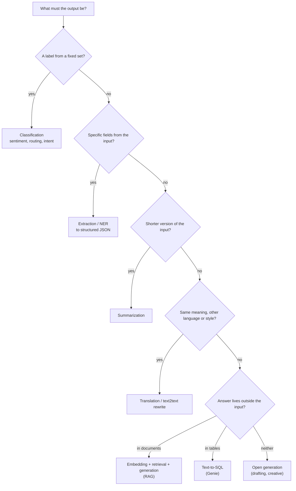
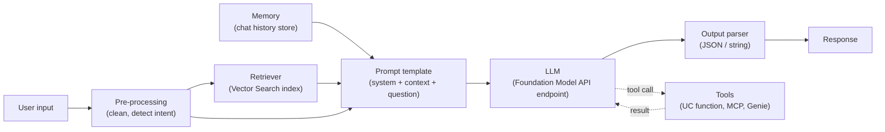
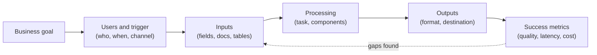
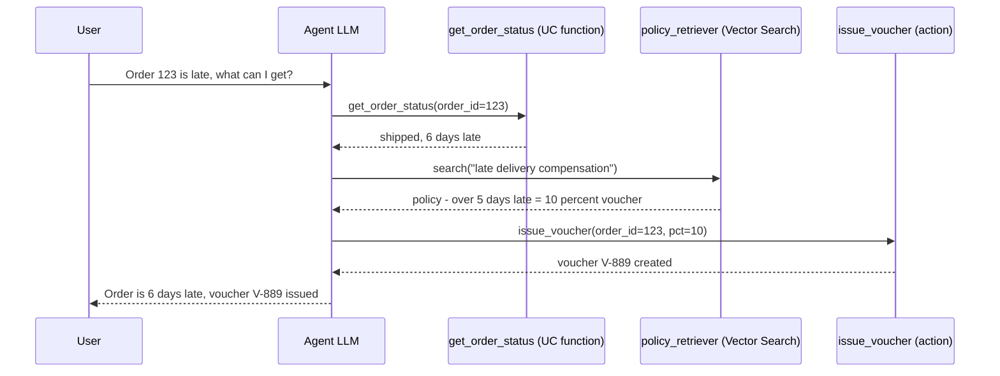
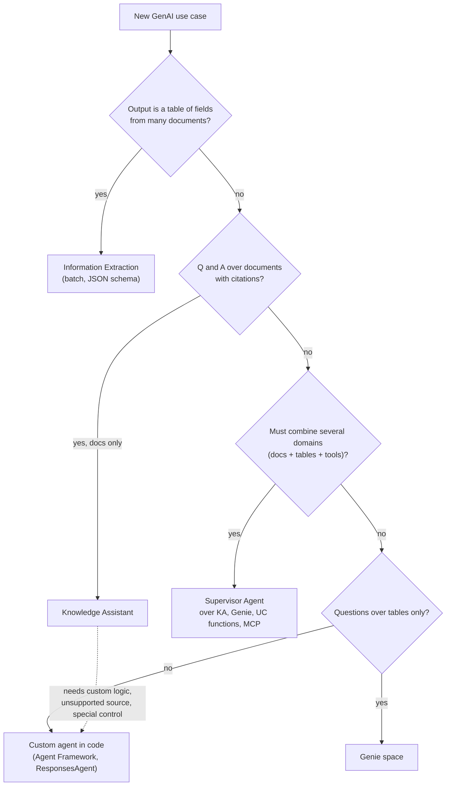

# Domain 1 — Design Applications (14%)

> **Big idea:** before you write a line of code, decide *what text goes in, what structure comes out, and which smallest set of components (or which Agent Bricks agent) turns one into the other*.

**Exam weight: 14% ≈ 6 of 45 questions.** Aligned to the exam guide live since **March 18, 2026**.

Prerequisites from this course: tokens, embeddings and attention in
[M08 — Embeddings, Sequences & Transformers](../modules/08-embeddings-and-transformers.md)
(especially [§3.7 Large language models](../modules/08-embeddings-and-transformers.md#37-large-language-models) and
[§3.8 Prompting vs fine-tuning vs RAG](../modules/08-embeddings-and-transformers.md#38-prompting-vs-fine-tuning-vs-rag)),
and the end-to-end design in [Case study 7 — RAG assistant](../case-studies/07-rag-assistant.md).

> **Naming note (October 2026).** Databricks renames products faster than the exam is reissued.
> The exam guide says **Vector Search**, **Multiagent Supervisor**, and **Agent Framework**. The current docs
> say **Databricks AI Search (formerly Databricks Vector Search)**, **Supervisor Agent**, and describe a newer
> version of **Information Extraction** built on `ai_extract`. Recognize both names on the exam; answer with the
> concept, not the label.

## Objectives covered

| # | Objective (verbatim from the exam guide) | Section |
|---|---|---|
| 1 | Design a prompt that elicits a specifically formatted response | [1.1](#11-prompts-that-produce-a-specific-format) |
| 2 | Select model tasks to accomplish a given business requirement | [1.2](#12-from-business-requirement-to-model-task) |
| 3 | Select chain components for a desired model input and output | [1.3](#13-chain-components) |
| 4 | Translate business use case goals into a description of the desired inputs and outputs for the AI pipeline | [1.4](#14-use-case-goals-to-pipeline-inputs-and-outputs) |
| 5 | Define and order tools that gather knowledge or take actions for multi-stage reasoning | [1.5](#15-tools-and-multi-stage-reasoning) |
| 6 | Determine how and when to use Agent Bricks (Knowledge Assistant, Multiagent Supervisor, Information Extraction) to solve problems | [1.6](#16-agent-bricks-knowledge-assistant-supervisor-information-extraction) |

---

## 1.1 Prompts that produce a specific format

### The problem

An LLM is a next-token predictor ([M08 §3.7](../modules/08-embeddings-and-transformers.md#37-large-language-models)).
It produces *likely text*, not *valid data*. But downstream code — a Delta table write, a UI card, a
`json.loads()` — needs an exact shape. One stray "Sure! Here is your JSON:" breaks the parser.

### Naive approach and why it fails

"Return the answer as JSON." The model usually complies, but:

- it may wrap the JSON in prose or Markdown code fences;
- field names drift (`customerName` vs `customer_name`);
- optional fields are omitted or invented;
- it may "helpfully" answer a question embedded in the input document (prompt injection), because
  instructions and data are not separated.

"Usually" is not good enough when you run a prompt over 10 million rows.

### The right approach: layer the controls

Think of format control as a ladder from soft to hard guarantees:

1. **System prompt** — sets role, rules, and output contract once ("You are an extraction service. Respond only with JSON matching the schema. If a field is missing use null.").
2. **Explicit schema in the prompt** — list field names, types, allowed values (enums), and what to do when unknown.
3. **Delimiters** — fence untrusted input (`<document>…</document>`, `"""…"""`, `###`). The model can then tell instructions from data, which reduces both format drift and prompt injection.
4. **Few-shot examples** — 1–3 input→output pairs in exactly the target format. Examples teach format more reliably than descriptions; they also teach edge cases (an example with a `null` field).
5. **Constrained / structured outputs** — on Databricks, chat models served through **Foundation Model APIs** (pay-per-token and provisioned throughput) accept an OpenAI-compatible `response_format` with `type: "json_schema"` (output must match your schema) or `type: "json_object"` (any valid JSON). This is the strongest guarantee because decoding is constrained, not just requested.
6. **Output parser + validation** — still parse and validate in code (e.g. Pydantic), and retry or fall back on failure.

```python
# Illustrative; check current docs for exact signatures
from openai import OpenAI
client = OpenAI(api_key=DATABRICKS_TOKEN, base_url=f"{WORKSPACE_URL}/serving-endpoints")

response_format = {
    "type": "json_schema",
    "json_schema": {
        "name": "ticket",
        "schema": {
            "type": "object",
            "properties": {
                "category": {"type": "string", "enum": ["billing", "shipping", "technical"]},
                "urgency": {"type": "integer"},
                "summary": {"type": "string"},
            },
            "required": ["category", "urgency", "summary"],
        },
        "strict": True,
    },
}
resp = client.chat.completions.create(
    model="databricks-gpt-oss-20b",
    messages=[
        {"role": "system", "content": "Classify the support ticket inside <ticket> tags."},
        {"role": "user", "content": "<ticket>My parcel is 9 days late!</ticket>"},
    ],
    response_format=response_format,
)
```

For **batch** work in SQL, `ai_query()` takes an optional `responseFormat` argument (chat models,
Databricks Runtime 15.4 LTS+), either as a DDL-style `STRUCT<...>` string or a JSON string with
`type` = `text`, `json_object`, or `json_schema`:

```sql
-- Illustrative; check current docs for exact signatures
SELECT ai_query(
  'databricks-gpt-oss-20b',
  CONCAT('Extract the title and authors from: ', abstract),
  responseFormat => 'STRUCT<paper:STRUCT<title:STRING, authors:ARRAY<STRING>>>'
) AS extracted
FROM papers;
```

### Documented limits of structured outputs (worth knowing)

| Limit (per Databricks docs) | Consequence for design |
|---|---|
| Max 64 keys in the JSON schema | Split very wide extraction into several calls, or use Information Extraction |
| `pattern`, `anyOf`/`oneOf`/`allOf`, `$ref`, `prefixItems` unsupported | Express choices as `enum`, not regex |
| Length constraints (`maxLength`, `minProperties`…) not enforced | Enforce lengths in the prompt *and* in post-processing |
| Deeply nested schemas lower quality | Flatten the schema |
| Claude models: `json_schema` only, no streaming, not combined with `tools` | Pick the model/feature combination deliberately |

### Rule of thumb

| Need | Use |
|---|---|
| A human reads it; light formatting (bullets, ≤ 50 words) | System prompt + explicit instruction + one example |
| Machine parses it, small volume, prototype | Prompt schema + delimiters + few-shot + parser with retry |
| Machine parses it, production / high volume | `response_format` `json_schema` (or `ai_query` `responseFormat`) + validation |
| Same fields from many documents, want a managed tool with evaluation | Agent Bricks **Information Extraction** ([§1.6](#16-agent-bricks-knowledge-assistant-supervisor-information-extraction)) |

### Worked example

Requirement: "Turn each 1-paragraph memo into one sentence that fits in a 120-character UI field."
Prompt: system message "Rewrite the memo inside `<memo>` tags as ONE sentence of at most 120 characters stating its intent. Output only the sentence." + two short examples. Then enforce `len(s) <= 120` in post-processing because length is *not* guaranteed by the model.

> **Exam trap:** "Fine-tune the model so it always returns JSON" — fine-tuning is the expensive answer when a prompt/structured-output fix exists. The exam favors the *least effort that reliably works*.
>
> **Exam trap:** "Increase temperature for more consistent formatting" — higher temperature *increases* variability. Low temperature helps consistency, but it is not a format guarantee.
>
> **Exam trap:** Putting the user's document and the instructions in one undelimited string. If an option adds delimiters or separates system vs user roles, it is usually the better one.

---

## 1.2 From business requirement to model task

### The problem

Stakeholders speak in outcomes ("agents waste time triaging emails"); models are chosen by **task
category** (classification, summarization…). The exam repeatedly gives a business sentence and asks for the
task. Picking the wrong task means evaluating the wrong models and metrics.

### Naive approach and why it fails

"It's all text, use a chat LLM for everything." A general LLM *can* do any of these, but you lose:
the right evaluation metric (accuracy vs ROUGE vs recall@k), cheaper specialized options (an embedding model,
`ai_classify`), and determinism where you need it (SQL over tables beats an LLM guessing numbers).

### The right approach: find the verb and the output type

Ask two questions: **What does the output look like?** and **Is the answer already in the input,
in a document store, or in a table?**



| Business requirement (typical exam wording) | Model task | Databricks shortcut |
|---|---|---|
| "Route incoming tickets to the right team" | Classification | `ai_classify` (SQL) or prompt + `json_schema` enum |
| "Is this review positive or negative?" | Sentiment classification | `ai_analyze_sentiment` |
| "Pull invoice number, date and total from PDFs" | Information extraction | `ai_parse_document` → `ai_extract` / Information Extraction |
| "Condense a long memo into one sentence" | Summarization | `ai_summarize` or `ai_query` with a length instruction |
| "Serve customers in Spanish from English docs" | Translation (+ RAG) | `ai_translate` |
| "Find similar past tickets / products" | Embedding + similarity search | Embedding endpoint + Vector Search, `ai_similarity` |
| "Answer employee questions from the policy handbook" | RAG question answering | Knowledge Assistant or custom RAG chain |
| "Let managers ask 'revenue by region last quarter?'" | Text-to-SQL | Genie space |
| "Draft a first-reply email" | Generation | Chat model via Foundation Model APIs |
| "Hide names and emails before analysis" | Entity masking | `ai_mask` |

The task-specific AI Functions (`ai_classify`, `ai_extract`, `ai_summarize`, `ai_translate`,
`ai_analyze_sentiment`, `ai_mask`, `ai_similarity`, `ai_parse_document`, …) are recommended when you want a
common task with no customization; use `ai_query` when you need a custom prompt or a specific model.

### Worked example

"A retailer wants to know which product features customers complain about most, across 2M reviews,
reported weekly in a dashboard." Decompose: (1) **extraction** of `{feature, sentiment}` pairs per review,
(2) **aggregation** in SQL — not an LLM. The LLM part is a batch job (`ai_query`/`ai_extract`), not a chatbot.

> **Exam trap:** Confusing **summarization** with **classification**: "give the gist in one sentence" is summarization; "tag the memo as HR / Finance / IT" is classification.
>
> **Exam trap:** Using RAG for **numeric questions over tables**. Aggregates ("total sales in Q3") belong to SQL/Genie; RAG retrieves text chunks and an LLM will happily hallucinate arithmetic.
>
> **Exam trap:** Using an LLM to generate embeddings or an embedding model to generate text. Retrieval needs an **embedding** model; answers need a **generative** model.

---

## 1.3 Chain components

### The problem

A single LLM call has fixed knowledge, no access to your data, no memory between requests, and returns
free text. Each gap is filled by one component. The exam asks: *given this input and this desired output,
which components do you need — and which are unnecessary?*

### Anatomy of a chain



| Component | Gap it fills | Needed when… | Databricks / ecosystem example |
|---|---|---|---|
| **Prompt template** | Consistent instructions with slots | Always | LangChain `ChatPromptTemplate`; versioned in MLflow Prompt Registry |
| **Retriever** | Private / fresh knowledge | Answer depends on documents the model wasn't trained on | Vector Search index as a retriever |
| **Embedding model** | Turns text into vectors for retrieval | Any semantic retrieval | e.g. `databricks-gte-large-en` |
| **LLM** | Reasoning and generation | Always | Foundation Model APIs, external models |
| **Output parser** | Free text → typed data | Downstream code consumes the output | `StrOutputParser`, Pydantic, `response_format` |
| **Memory** | Context across turns | Multi-turn chat with follow-ups ("what about *it*?") | Chat history passed in messages; persistent store for long-term memory |
| **Tools** | Act or fetch live data | Needs APIs, SQL, calculations, actions | Unity Catalog functions, MCP servers, Genie |
| **Re-ranker** | Better ordering of retrieved chunks | Recall is fine but top-k precision is poor | Vector Search reranking |
| **Guardrails** | Safety / policy | User-facing or regulated | AI Gateway guardrails, input/output filters |

### Rule of thumb: add components only for a gap you can name

- Input already contains everything (e.g. "summarize this email") → **prompt template + LLM (+ parser)**. No retriever.
- Knowledge in documents → add **embedding model + retriever**.
- Follow-up questions → add **memory**.
- Live data or side effects → add **tools** (and now it may be an agent, see §1.5).
- Output feeds code → add **output parser / structured outputs**.

### Worked example

Input: "a customer's free-text question"; output: "an answer with a link to the source policy page".
Components: prompt template, embedding model, retriever over chunked policy pages **with the URL stored as
chunk metadata**, LLM, and a parser that returns `{answer, source_url}`. The citation requirement drives a
*data* decision (store URLs as metadata) as much as a model one — see the retrieval design in
[Case study 7 §5](../case-studies/07-rag-assistant.md#5-model).

> **Exam trap:** Adding a retriever to a task where the answer is fully in the input (translation, summarizing a pasted document). Extra components add latency and failure modes.
>
> **Exam trap:** Expecting memory to "teach" the model new facts. Memory carries the *conversation*; knowledge comes from retrieval or fine-tuning.
>
> **Exam trap:** Citations need source metadata in the index. If an option says "ask the LLM to cite sources" without retrieving metadata, the citations will be invented.

---

## 1.4 Use-case goals to pipeline inputs and outputs

### The problem

"Make support faster" is not buildable. A pipeline needs a contract: **what arrives, in what format,
from where; what leaves, in what format, to whom; and what is measured.** Many exam questions are
really this objective in disguise: the right option is the one whose inputs actually contain the needed
information.

### Naive approach and why it fails

Start from the model ("let's use a 70B model") and work outward. You discover late that the model never
receives the account ID, that the output must be a ticket field (not a paragraph), or that half the
answers depend on a table nobody connected.

### The right approach: an I/O spec before a model



Fill in this template (it doubles as the first 5 minutes of an ML system design interview — compare
[Case study 7 §1–§2](../case-studies/07-rag-assistant.md#1-clarify-requirements)):

| Field | Question | Example: "help support agents answer shipping questions" |
|---|---|---|
| Trigger / mode | Real-time chat, or batch? | Real-time, inside the agent console |
| Required inputs | What must the pipeline receive? | Question text, `account_id`, `order_id` |
| Knowledge sources | Unstructured docs? Structured tables? | Shipping policy PDFs (docs); order + carrier status (tables) |
| Processing | Which tasks? | Intent classification → table lookup tool and/or RAG → generation |
| Output | Format and destination | JSON `{answer, eta_date, sources[]}` rendered in the console |
| Constraints | Latency, cost, privacy | p95 < 3 s; no PII in logs |
| Success metric | How do we know it works? | Correctness vs SME labels; handle-time reduction |

**Key reasoning move:** if a fact is *per-entity and changes* (order status, account balance), it comes
from a **structured lookup keyed by an ID**, not from documents and not from fine-tuning. If a fact is
*general and textual* (policy, how-to), it comes from **retrieval**.

### Worked example

Goal: "Give each sales rep a weekly brief of at-risk accounts." Inputs: CRM tables (structured), call
transcripts (unstructured). Processing: batch summarization of transcripts with `ai_query` + SQL risk
features. Output: one row per account in a Delta table feeding a dashboard. **No chatbot**, no real-time
endpoint — the I/O spec revealed a batch pipeline.

> **Exam trap:** Options that fix missing per-record facts with "fine-tune on examples" or "add a rule like *add 14 days*". The correct fix gives the pipeline the data as an input (a lookup/table keyed by the ID the user already provides).
>
> **Exam trap:** Choosing a real-time serving endpoint for a nightly/weekly report. Batch → `ai_query` or a job; interactive → endpoint.

---

## 1.5 Tools and multi-stage reasoning

### The problem

Some questions need several steps whose order depends on intermediate results: "Is order 123 late, and
if so what compensation does policy allow?" needs (1) look up the order, (2) compare dates, (3) retrieve the
compensation policy, (4) maybe create a voucher. A fixed chain cannot branch on results it hasn't seen yet.

### Naive approach and why it fails

Stuff everything into one prompt: all orders, all policies. Context overflows, cost explodes, data is stale,
and the model cannot *act*. Or hard-code every path in `if` statements — brittle as cases multiply.

### The right approach: tools + a reasoning loop (only when needed)

A **tool** is a single-interaction function with a name, a description, and typed parameters that the LLM may
invoke for a well-defined task. With **function calling**, the model returns a structured request
(name + JSON arguments); *your code* executes it and feeds the result back. Repeating
*think → act → observe* is the **ReAct** pattern:



### Defining tools well

- **One job per tool**, clear name (`get_order_status`, not `helper2`).
- **Descriptions are the routing signal.** The model chooses tools by reading their descriptions (Supervisor Agent docs say the same about subagent descriptions). State what it does, when to use it, and what it returns.
- **Typed, minimal parameters** — the ID the user already gave, not free text when avoidable.
- **Few tools per agent.** Databricks function calling allows up to 32 functions, but more tools = more input tokens and more mis-routing. Split into sub-agents if you need many.
- **Separate read tools from action tools**; put actions last and guard them (confirmation, permissions).

### Ordering tools

Order follows **data dependencies**, then **cost/risk**:

1. **Gather identifiers/context first** (lookup the order → gives you `carrier_id`).
2. **Gather knowledge** that depends on it (policy for that carrier/region).
3. **Reason / compute** (compare dates, apply rule — deterministic code if possible).
4. **Act last** (write, send, refund) — only after the facts justify it; irreversible actions need a check.

Cheap, deterministic checks (does the order exist? is the user allowed?) go **before** expensive LLM or
retrieval calls.

### Databricks pieces

| Tool type | Use for | Notes |
|---|---|---|
| **Unity Catalog functions** (SQL/Python) | Predefined, governed logic and lookups | Exposed to agent libraries via `UCFunctionToolkit`; permissions via UC (`EXECUTE`) |
| **Retriever tool** over Vector Search | Unstructured knowledge | Same index as a RAG chain |
| **Genie** space (newer docs: Genie Agent) | Natural-language questions over tables (text-to-SQL) | Structured data side of a multi-agent system |
| **MCP servers** — managed, external, custom | Standardized tool access | Managed = Databricks-hosted; external = third-party; custom = your own (e.g. on Databricks Apps) |
| **Agent code** (Agent Framework / MLflow `ResponsesAgent`) | Custom orchestration | LangGraph, LangChain, OpenAI SDK, etc. |

```python
# Illustrative; check current docs for exact signatures
from databricks_langchain import ChatDatabricks, UCFunctionToolkit

tools = UCFunctionToolkit(function_names=["main.support.get_order_status"]).tools
llm = ChatDatabricks(endpoint="databricks-claude-sonnet-4-5").bind_tools(tools)
```

### Chain vs agent: the decision

Databricks frames agent systems as a **continuum**: LLM + prompt → deterministic chain → single agent
with tool calling → multi-agent. Start with the least complex design that works.

| | Deterministic chain | Tool-calling agent | Multi-agent (supervisor) |
|---|---|---|---|
| Control flow | Hard-coded by developer | LLM decides at runtime | Supervisor routes to specialist agents |
| Best for | Well-defined tasks, e.g. basic RAG | Varied queries, several tools, one domain | Several domains/data sources, each needing its own agent |
| Pros | Predictable, auditable, cheap, low latency | Flexible, handles branching | Modular, specialists stay simple |
| Cons | Inflexible; code change to adapt | Non-deterministic, more latency/tokens, harder to test | Most complex; routing errors |

> **Exam trap:** Choosing an autonomous agent where a fixed 3-step pipeline suffices (or where auditors require identical behavior every run). The exam rewards the **simplest** pattern meeting the requirements.
>
> **Exam trap:** Ordering an *action* tool before the *lookup* tool whose output it needs, or before a permission/validation check.
>
> **Exam trap:** "The LLM executes the function." With function calling the model only **proposes** the call; your application/runtime executes it.
>
> **Exam trap:** Vague or overlapping tool descriptions are the most common cause of wrong tool selection — the fix is better descriptions, not a bigger model.

---

## 1.6 Agent Bricks: Knowledge Assistant, Supervisor, Information Extraction

### The problem

Building a production RAG bot or extraction pipeline by hand means choosing chunking, embeddings, prompts,
evaluation sets, judges, and serving — weeks of work before you know if it's good. Many enterprise use cases
are the *same shapes* again and again: "Q&A over my documents", "route across my agents", "turn documents
into a table".

### The idea

**Agent Bricks** are declarative, mostly no-code builders for those common shapes: you describe the task and
point at governed data in Unity Catalog; Databricks builds the agent, deploys it as an endpoint, and gives you
an improvement loop based on **labeled examples and SME guidelines**. You trade some control for speed and a
built-in quality workflow. When the shape doesn't fit, you write a custom agent in code
(Agent Framework / `ResponsesAgent`) and keep full control.

Common requirements for all three (per docs): a workspace with **Unity Catalog**, **serverless compute**,
**Model Serving** access, a **serverless usage policy with a nonzero budget**, and a **supported region**.

### Knowledge Assistant — Q&A with citations over documents

| Aspect | What the docs say |
|---|---|
| Purpose | A question-and-answer chatbot over your documents that **returns citations**; for product docs, HR policies, support knowledge bases |
| Sources (up to 10) | Files in a **UC volume** (txt, pdf, md, ppt/pptx, doc/docx); a **UC table** (streaming table or Change Data Feed enabled, content + metadata columns); an existing **Vector Search index** built with `databricks-gte-large-en`, `databricks-bge-large-en`, or `databricks-qwen3-embedding-0-6b` |
| Skipped | Files > 100 MB, PDF/Office > 500 pages, names starting with `_` or `.` |
| Improve quality | Add questions in the **Examples** tab, attach **Guidelines**, share with experts (**CAN MANAGE**), import/export labeled data via a UC table |
| Output | An **agent endpoint** (Can Query for users), usable from AI Playground, curl/Python, apps |
| Status | GA (announced January 2026) |

### Supervisor Agent (exam: "Multiagent Supervisor") — route across agents and tools

| Aspect | What the docs say |
|---|---|
| Purpose | Coordinates agents and tools on complex tasks spanning specialized domains, behind one endpoint |
| Subagents / tools | **Genie** spaces/agents, **Knowledge Assistant** endpoints (CAN QUERY), **UC functions** (EXECUTE), **MCP servers**, custom agent endpoints, other supervisors, and more |
| Routing | Uses each subagent/tool **description** to decide delegation — write detailed descriptions; optional Instructions field |
| Limits | Max **50** agents per supervisor; Vector Search subagents must be Delta Sync indexes |
| Governance | End users only reach subagents they have permission for; supervisor redirects or ends the conversation otherwise |
| Improve quality | Labeled questions in Examples, expert Guidelines |
| Status | GA (announced early 2026); renamed from Multi-Agent Supervisor |

### Information Extraction — unstructured documents → structured table

| Aspect | What the docs say |
|---|---|
| Purpose | Converts unstructured documents/text into **structured fields defined by a JSON schema** (contract parties, invoice line items, details from notes) |
| Inputs | Files in a **UC volume**, or a **UC table** text column; PDFs/scans are parsed with `ai_parse_document` first |
| Schema | Field name, type, **description** (descriptions guide extraction); can be generated from natural language or edited as JSON |
| Run at scale | Batch in SQL — current version via **`ai_extract`** (legacy version via `ai_query`); or a scheduled **Lakeflow / Spark Declarative Pipeline** |
| Improve quality | Natural-language feedback that tunes field descriptions; evaluation against a labeled UC table (per-field accuracy, precision, recall, F1) |
| Limits | 128k-token context; no union schema types |

> The docs now show a **new Information Extraction** (built on `ai_extract`) and a **legacy** one (Beta, built on
> `ai_query`). For the exam, the concept is the same: schema-driven extraction to a table, run in batch.

Earlier Agent Bricks releases also listed a **Custom LLM** builder (text transformation such as content
generation) and Genie is often grouped with them; current docs are reorganizing around Genie Agents and
code-based agents (verify in current docs). Focus on the three named in the exam guide.

### Selection flow



### Agent Bricks vs custom Agent Framework

| Choose Agent Bricks when… | Choose a custom agent (code) when… |
|---|---|
| The use case matches a builder's shape | Bespoke control flow, custom tools, or a framework you must use (LangGraph, etc.) |
| You want speed and a built-in SME feedback loop | You need fine control over chunking, prompts, retrieval, or model choice |
| Data is already governed in UC | Sources or deployment targets are outside what the builder supports |
| Team has limited ML engineering capacity | Strict requirements the managed builder cannot express |

They compose: a custom agent endpoint can be a subagent of a Supervisor Agent, and a Knowledge Assistant
endpoint can be called from custom code.

### Worked example

A bank wants: (a) staff Q&A over 3,000 policy PDFs with citations; (b) loan officers asking "average
approved amount by branch this month"; (c) one chat entry point for both. Design: **Knowledge Assistant** on
a UC volume of PDFs for (a); a **Genie space** on the loans tables for (b); a **Supervisor Agent** with both as
subagents, each with a precise description, for (c). Permissions: users need CAN QUERY on the KA endpoint and
access to the Genie space and its underlying tables. Separately, a nightly need to pull `{borrower, amount,
rate}` from scanned loan agreements into Delta is **Information Extraction** (after `ai_parse_document`),
not a chatbot.

> **Exam trap:** Using Knowledge Assistant for **aggregations over tables** — that's Genie (possibly under a supervisor).
>
> **Exam trap:** Using Information Extraction for interactive Q&A, or Knowledge Assistant to fill a table of fields from 1M documents. Extraction = batch to table; KA = conversational answers with citations.
>
> **Exam trap:** "Write a custom LangGraph router" when the requirement is a quick, low-maintenance way to route across existing KA and Genie agents — Supervisor Agent is the managed answer.
>
> **Exam trap:** Improving Agent Bricks quality by fine-tuning yourself. The built-in loop is **labeled examples + SME guidelines/feedback** (and, for extraction, better field descriptions).
>
> **Exam trap:** Forgetting permissions: a supervisor does not bypass access — users must be allowed on each subagent.

---

## Quick review

1. Format control ladder: system prompt → schema in prompt → delimiters → few-shot → `response_format` (`json_schema`/`json_object`) → parse + validate.
2. Foundation Model APIs structured outputs: max 64 schema keys; no `pattern`/`anyOf`/`$ref`; length constraints not enforced; flatten schemas.
3. `ai_query(..., responseFormat => ...)` gives structured output in batch SQL (DBR 15.4 LTS+, chat models).
4. Map requirement → task by output shape: label = classification, fields = extraction, shorter = summarization, other language = translation, docs = RAG, tables = text-to-SQL (Genie).
5. Task-specific AI Functions (`ai_classify`, `ai_extract`, `ai_summarize`, `ai_translate`, `ai_mask`…) for common tasks; `ai_query` for custom prompts/models.
6. Add a chain component only for a named gap: retriever = knowledge, memory = conversation, tools = live data/actions, parser = typed output.
7. Per-entity, changing facts come from a lookup keyed by an ID — never from fine-tuning or fixed rules.
8. Tool order: identifiers → knowledge → compute → action last; cheap checks first. The model proposes calls; your code executes them.
9. Continuum: LLM + prompt → deterministic chain → tool-calling agent → multi-agent. Choose the least complex that works.
10. Agent Bricks: **Knowledge Assistant** = doc Q&A with citations; **Supervisor Agent** (Multiagent Supervisor) = routes across up to 50 agents/tools by description; **Information Extraction** = documents → JSON-schema fields in a table, batch. Quality improves through labeled examples and SME guidelines.

## Official docs

- Structured outputs on Databricks — https://docs.databricks.com/aws/en/machine-learning/model-serving/structured-outputs
- Function calling on Databricks — https://docs.databricks.com/aws/en/machine-learning/model-serving/function-calling
- `ai_query` function (`responseFormat`) — https://docs.databricks.com/aws/en/sql/language-manual/functions/ai_query
- AI Functions (task-specific functions) — https://docs.databricks.com/aws/en/large-language-models/ai-functions
- Agent system design patterns — https://docs.databricks.com/gcp/en/agents/agent-system-design-patterns
- Create agent tools using Unity Catalog functions — https://docs.databricks.com/aws/en/generative-ai/agent-framework/create-custom-tool
- Author an AI agent (ResponsesAgent) — https://docs.databricks.com/aws/en/agents/agent-framework/author-agent
- MCP tools for agents — https://docs.databricks.com/aws/en/generative-ai/agent-framework/agent-tool
- Agent Bricks overview — https://docs.databricks.com/aws/en/generative-ai/agent-bricks/
- Knowledge Assistant — https://docs.databricks.com/aws/en/generative-ai/agent-bricks/knowledge-assistant
- Supervisor Agent (Multi-Agent Supervisor) — https://docs.databricks.com/aws/en/generative-ai/agent-bricks/multi-agent-supervisor
- Information Extraction (current) — https://docs.databricks.com/aws/en/agents/agent-bricks/info-extraction
- Information Extraction (legacy) — https://docs.databricks.com/aws/en/generative-ai/agent-bricks/key-info-extraction
- Knowledge Assistant GA announcement — https://www.databricks.com/blog/agent-bricks-knowledge-assistant-now-generally-available-turning-enterprise-knowledge-answers
- Supervisor Agent GA announcement — https://www.databricks.com/blog/agent-bricks-supervisor-agent-now-ga-orchestrate-enterprise-agents
- Vector Search (docs title: Databricks AI Search) — https://docs.databricks.com/aws/en/ai-search/ai-search
