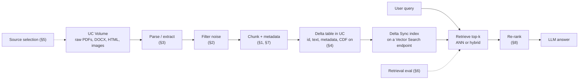
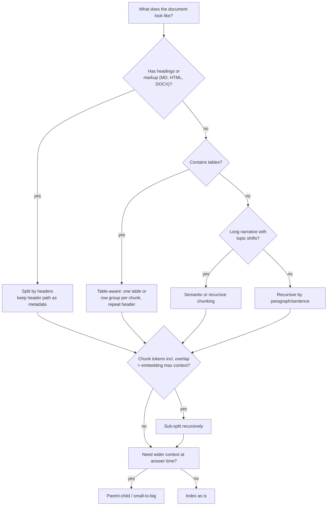
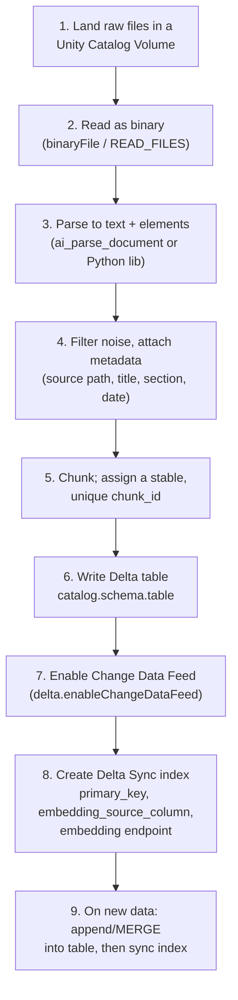
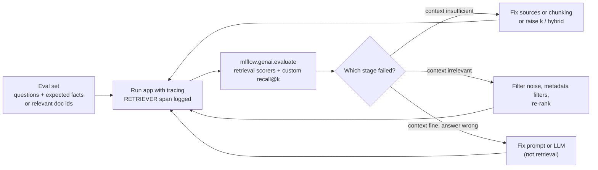
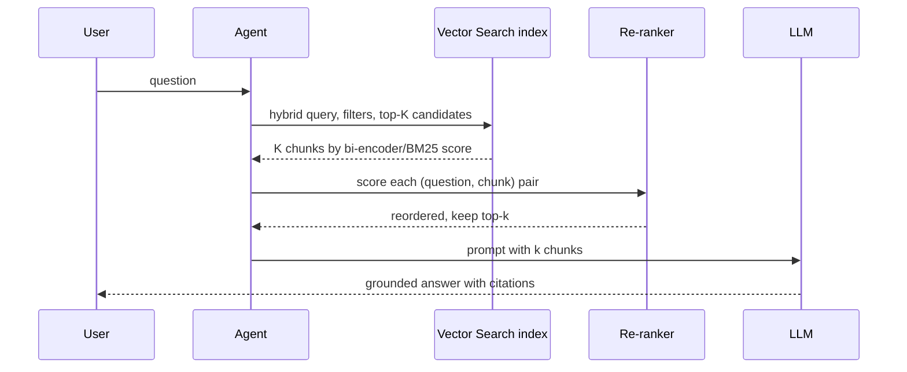

# Domain 2 — Data Preparation (14%)

> **Big idea:** a RAG system can only be as good as the passages it retrieves, so most RAG quality is decided *before* the LLM runs. It comes from which documents you keep, how you clean and cut them, and how you find and order the pieces.

**Exam weight:** 14% ≈ 6 of 45 questions.

**Aligned to:** the Databricks Certified Generative AI Engineer Associate exam guide, live since **March 18, 2026**.

**Builds on:** [M04 Evaluation & data](../modules/04-evaluation-and-data.md) (ranking metrics, leakage) ·
[M09 Recommendation & ranking](../modules/09-recommendation-and-ranking.md) (retrieve-then-rank) ·
[Case study 7: RAG assistant](../case-studies/07-rag-assistant.md) (an end-to-end design with token math).

> **Naming note (2026).** Databricks docs now call the product **Databricks AI Search**, *"formerly known as Databricks Vector Search"*. The current Python client is `databricks-ai-search` (`AISearchClient`). The exam guide and most courseware still say **Mosaic AI Vector Search** and `VectorSearchClient` (package `databricks-vectorsearch`). Treat these as the same product. Exam questions will most likely use the older name.

---

## Objectives covered

| # | Objective (verbatim from the exam guide) | Section |
|---|---|---|
| 2.1 | Apply a chunking strategy for a given document structure and model constraints | [§1](#1-apply-a-chunking-strategy) |
| 2.2 | Filter extraneous content in source documents that degrades quality of a RAG application | [§2](#2-filter-extraneous-content) |
| 2.3 | Choose the appropriate Python package to extract document content from provided source data and format. | [§3](#3-choose-the-extraction-package) |
| 2.4 | Define operations and sequence to write given chunked text into Delta Lake tables in Unity Catalog | [§4](#4-write-chunks-to-delta-tables-in-unity-catalog) |
| 2.5 | Identify needed source documents that provide necessary knowledge and quality for a given RAG application | [§5](#5-choose-the-source-documents) |
| 2.6 | Use tools and metrics to evaluate retrieval performance | [§6](#6-evaluate-retrieval-performance) |
| 2.7 | Design retrieval systems using advanced chunking strategies | [§7](#7-advanced-retrieval-design) |
| 2.8 | Explain the role of re-ranking in the information retrieval process | [§8](#8-re-ranking) |

The whole domain fits on one pipeline. Every objective is one box or one arrow in it:



---

## 1. Apply a chunking strategy

### The problem

An LLM cannot read your whole knowledge base on every question. That would cost too much, run too slowly, and the input would not fit. We store the corpus as **chunks**, embed each chunk, and retrieve the few chunks closest to the question. A chunk is the **unit of retrieval**: the retriever can only return a whole chunk.

### Naive approach and why it fails

*"Embed each whole document."* A 40-page manual becomes one vector that averages forty topics, so it matches no specific question well. The embedding model also silently **truncates** anything past its maximum input length (for example, 512 tokens for `bge-large-en-v1.5`). Most of the document never reaches the vector at all.

*"Cut every 500 characters."* This is better, but cuts land mid-sentence and mid-table. A chunk ending in "The refund window is" loses its answer to the next chunk.

### The right approach: respect two constraints and the structure

1. **Embedding-model constraint (hard).** Chunk length in tokens, *including overlap*, must be ≤ the embedding model's max context. If it is longer, the tail is truncated and never embedded.
2. **LLM context constraint (soft budget).** `k × chunk_tokens + system prompt + history + question + answer` must fit the LLM's context window, and should stay well under it for cost and latency. Case study 7 budgets 5 × 400 = 2,000 tokens of context ([§Tokens and cost](../case-studies/07-rag-assistant.md#tokens-and-cost-per-query)).
3. **Document structure (quality).** Cut where the author already cut: headings, sections, paragraphs, sentences, table boundaries.

| Strategy | How it splits | Good for | Weakness |
|---|---|---|---|
| Fixed-size (tokens or characters) | Every *N* units, optional overlap | Uniform plain text, fast baselines | Ignores meaning; splits sentences and tables |
| Fixed-size **with overlap** | Window of *N*, stride *N − o* | Facts that straddle boundaries | More records and storage; duplicated text in results |
| Recursive / structure-aware | Tries `\n\n`, then `\n`, then sentence, then word until it fits (LangChain `RecursiveCharacterTextSplitter`) | General prose, the default choice | Still blind to topic shifts |
| Sentence-based | Groups whole sentences up to *N* tokens | FAQs, short answers | Very short sentences give low-context chunks |
| Format-specific (Markdown/HTML headers) | Split on `#`/`<h2>` and keep the header path as metadata (`MarkdownHeaderTextSplitter`) | Docs sites, wikis, manuals | Sections may exceed the limit; sub-split them recursively |
| Table-aware | Keep each table (or row group plus header row) as one chunk, often serialized as Markdown/HTML | Spec sheets, price lists | Big tables must be split by rows with the header **repeated** |
| Semantic | Embed sentences and cut where adjacent similarity drops (`SemanticChunker`) | Long unstructured narrative | Extra embedding cost at ingestion; chunk sizes vary |
| Parent-child / small-to-big, hierarchical, windowed | See [§7](#7-advanced-retrieval-design) | Precise matching *and* rich context | More complex index and lookup |

The Databricks AI Cookbook names fixed-size, paragraph-based, format-specific and semantic chunking. It warns that plain fixed-size chunking *"rarely works for production-grade applications"* ([cookbook](https://docs.databricks.com/aws/en/generative-ai/tutorials/ai-cookbook/quality-data-pipeline-rag)).



### Worked example: how many records?

For a document of *L* tokens, chunk size *c* and overlap *o* (stride *s = c − o*), when *L > c*:

$$n_{\text{chunks}} = \left\lceil \frac{L - c}{c - o} \right\rceil + 1$$

Take 10,000 documents of 4,000 tokens each:

| Chunk size *c* | Overlap *o* | Stride | Chunks/doc | Total records |
|---|---|---|---|---|
| 250 | 0 | 250 | ⌈3750/250⌉+1 = 16 | 160,000 |
| 500 | 0 | 500 | ⌈3500/500⌉+1 = 8 | 80,000 |
| 500 | 100 | 400 | ⌈3500/400⌉+1 = 10 | 100,000 |
| 500 | 250 | 250 | ⌈3500/250⌉+1 = 15 | 150,000 |
| 1,000 | 100 | 900 | ⌈3000/900⌉+1 = 5 | 50,000 |

Record count goes **down** when you **increase chunk size** or **decrease overlap**. It goes up when you shrink chunks or add overlap. The embedding model's dimension does not change the count. It changes bytes per record (for example, 768 × 4 B ≈ 3 KB as float32), not the number of records.

Now apply the model constraint. If the embedding model accepts 512 tokens, then *c = 1,000* is invalid: almost half of each chunk is truncated. The `500/100` row is the largest valid choice in the table.

> **Exam trap:** "Use a smaller embedding model" or "lower the embedding dimension" does **not** reduce the number of records. Only chunk size and overlap (or dropping documents) do.

> **Exam trap:** Overlap counts toward the chunk length. A 512-token model with `chunk_size=512, chunk_overlap=64` is fine only if the splitter counts tokens, not characters, and includes the overlap in the 512. Character-based splitters need a characters-to-tokens estimate (roughly 4 characters per English token).

> **Exam trap:** "Bigger chunks = better answers" is false. Large chunks dilute the embedding and spend the LLM's context window on irrelevant text. Choosing chunk size from **retrieval evaluation** is a Section 3 objective, and it uses the metrics in [§6](#6-evaluate-retrieval-performance).

---

## 2. Filter extraneous content

### The problem

Embeddings encode *everything* in a chunk. Suppose every page of a PDF ends with "© 2026 Contoso Ltd. Confidential, page 7 of 212". Thousands of chunks then share that text, their vectors drift toward each other, and a query about confidentiality retrieves footers instead of policy.

### Naive approach and why it fails

*"The LLM will ignore the junk."* The LLM never sees what the retriever didn't return. Junk changes **which** chunks are returned, and the top-k slots it takes are lost to real content.

### What to remove (and how)

| Noise | Symptom in retrieval | Fix |
|---|---|---|
| Repeated page headers/footers, page numbers | Many near-identical top hits | Drop parser elements typed as header/footer/page number, or strip lines repeated on more than X% of pages |
| Legal boilerplate, disclaimers, cookie banners | Boilerplate chunks win generic queries | Pattern or hash match, then remove before chunking |
| HTML navigation, menus, sidebars, scripts | "Home · Products · Contact" chunks | Parse only `<main>`/`<article>` with BeautifulSoup, drop `<nav>`, `<footer>`, `<script>`, `<style>` |
| Duplicate and near-duplicate pages, old versions | The same passage fills top-k; outdated answers | Exact hash dedup, MinHash/embedding near-dup, keep the **latest authoritative** version |
| OCR noise (`Tbe rnanual`, stray glyphs) | Misses on exact terms | Better OCR/parse, confidence filters, drop very low-quality pages |
| Tables of contents, indexes, blank pages | Keyword-dense chunks with no content | Filter by element type or heuristics (e.g., >50% dot leaders or page numbers) |

On Databricks, `ai_parse_document` labels each element with a `type` that includes `page_header`, `page_footer`, `page_number`, `footnote`, `section_header`, `table` and `figure`. Filtering header/footer elements becomes a `WHERE` clause instead of a regex ([ai_parse_document](https://docs.databricks.com/aws/en/sql/language-manual/functions/ai_parse_document)).

**Worked number.** A 200-page manual has a 25-token footer on each page and is chunked at 250 tokens. Then 10% of every chunk is the same footer. On short queries, that shared 10% is enough to make unrelated chunks look similar. Remove it **before** chunking, not after: after chunking, the footer is inside the chunk text.

> **Exam trap:** Filtering happens **after parsing and before chunking/embedding**. Fixing noise by "adding an instruction to the prompt" or "increasing k" does not stop noisy chunks from being retrieved.

> **Exam trap:** Don't throw away useful structure while filtering. Section headings are *signal* (keep them as metadata or prefix them to chunks). Only *repeated* page headers are noise.

---

## 3. Choose the extraction package

### The problem

Before you can chunk, you need **text**, plus useful structure such as headings and tables. Every format stores text differently. A PDF stores positioned glyphs, DOCX is zipped XML, HTML is a tag tree, and a scanned JPEG contains no text at all, only pixels.

### Rule of thumb: match the tool to how the text is stored

| Source format | Package | Why |
|---|---|---|
| Digital (text-layer) PDF, simple text | `pypdf` (successor of `PyPDF2`) | Pure Python, minimal code: `PdfReader(f).pages[i].extract_text()` |
| PDF with **tables** or layout you must keep | `pdfplumber` | Character positions and `extract_tables()` |
| Fast, high-fidelity PDF (text, blocks, images) | `PyMuPDF` (`import fitz`) | C-backed speed; block/span coordinates |
| **Scanned images** (`.png`, `.jpg`, image-only PDF) | `pytesseract` (Tesseract OCR) | There is no text layer, so you need OCR |
| Word `.docx` | `python-docx` | Paragraphs, styles (headings), tables |
| HTML / web pages | `beautifulsoup4` (often with `lxml`) | Parse the tag tree and drop `<nav>`/`<script>` |
| Mixed formats, one API | `unstructured` (`partition(...)`) | Auto-detects type; returns typed elements (Title, NarrativeText, Table) |
| Databricks-native, SQL, PDF/DOCX/PPTX/images | `ai_parse_document` (SQL AI function) | Managed parsing with typed elements and tables as HTML; DBR 17.3+; max 500 pages / 100 MB per document; region-limited |

Distractors you will see: **`scrapy`** is a web *crawler* framework (it fetches pages; it isn't the best parser for local files). **`pyquery`** is a jQuery-style HTML query library. Neither does OCR. **`requests`** downloads; it doesn't parse.

```python
# Illustrative; check current docs for exact signatures
import pytesseract
from PIL import Image
text = pytesseract.image_to_string(Image.open("/Volumes/main/kb/raw/scan_001.png"))
```

```sql
-- Illustrative; check current docs for exact signatures
SELECT path,
       ai_parse_document(content, map('version', '2.0')) AS parsed
FROM READ_FILES('/Volumes/main/kb/raw/', format => 'binaryFile');
```

> **Exam trap:** "Scanned" or "image" in the question means **OCR** (`pytesseract`). A PDF library alone returns an empty string for an image-only PDF because there is no text layer to extract.

> **Exam trap:** "Least lines of code" points to the narrowest tool that does the job (for example, `pytesseract.image_to_string` in one line), not a crawler or a general HTML library.

---

## 4. Write chunks to Delta tables in Unity Catalog

### The problem

Chunks in a Python list die with the notebook. You need them **governed** (Unity Catalog permissions and lineage), **versioned** (Delta time travel), and **incrementally syncable** to a vector index, so that adding one document doesn't force re-embedding of a million chunks.

### The sequence (memorize the order)



What the docs require for a **Delta Sync** index:

- **Unity Catalog** must be enabled, the source must be a Delta table (or a streaming table or Iceberg v3 managed table), and the index gets a three-level name `catalog.schema.index`.
- A **primary key** column (`primary_key="id"`) that identifies each row. Make it unique per *chunk*, not per document: `doc_id` alone collides once a document has 15 chunks.
- **Change Data Feed** on the source table for standard endpoints (*"the source table must use a change data feed"*). Tables with row tracking get it automatically. Otherwise: `ALTER TABLE t SET TBLPROPERTIES (delta.enableChangeDataFeed = true)`.
- `embedding_source_column` must be a **text** column if Databricks computes embeddings. Alternatively, supply precomputed vectors via `embedding_vector_column` + `embedding_dimension` (self-managed).
- The column name `_id` is reserved.
- `pipeline_type="TRIGGERED"` (call `index.sync()`) or continuous sync (higher cost; standard endpoints only). Storage-optimized endpoints support only triggered sync.

```python
# Illustrative; check current docs for exact signatures
from pyspark.sql import functions as F

chunks_df = (parsed_df                       # one row per chunk after your splitter UDF
    .withColumn("chunk_id", F.concat_ws("_", "doc_id", "chunk_seq"))
    .select("chunk_id", "doc_id", "source_path", "section", "chunk_text", "updated_at"))

chunks_df.write.format("delta").mode("append").saveAsTable("main.kb.doc_chunks")
spark.sql("ALTER TABLE main.kb.doc_chunks SET TBLPROPERTIES (delta.enableChangeDataFeed = true)")
```

```python
# Illustrative; check current docs for exact signatures
from databricks.ai_search.client import AISearchClient   # older: databricks.vector_search.client.VectorSearchClient
client = AISearchClient()
index = client.create_delta_sync_index(
    endpoint_name="kb_endpoint",
    source_table_name="main.kb.doc_chunks",
    index_name="main.kb.doc_chunks_index",
    pipeline_type="TRIGGERED",
    primary_key="chunk_id",
    embedding_source_column="chunk_text",
    embedding_model_endpoint_name="databricks-qwen3-embedding-0-6b",
)
```

**Why the order matters.** If you create the index *before* the table has a primary key and CDF, index creation fails or can't sync incrementally. If you overwrite the whole table on every run (`mode("overwrite")`), every row looks changed and the index re-embeds everything. Use `append` or `MERGE INTO` on `chunk_id` so only new or changed chunks flow through CDF.

> **Exam trap:** The vector index is **not** where you write chunks. You write to the **Delta table**, and the Delta Sync index follows it. Only a **Direct Vector Access** index is written to directly (via API), and it does not sync from a table.

> **Exam trap:** Store metadata columns (source, section, date, product, ACL group) **in the same Delta table** next to the text. That is what makes metadata filtering and citations possible later ([cookbook](https://docs.databricks.com/aws/en/generative-ai/tutorials/ai-cookbook/quality-data-pipeline-rag)).

---

## 5. Choose the source documents

### The problem

Retrieval can't return knowledge that isn't in the corpus. An LLM with no relevant context either refuses or, worse, **hallucinates**. Choosing sources is a *requirements* exercise: list the questions users will ask, then check each one is answerable from a source.

### Four tests for every candidate source

| Test | Question to ask | Failure if ignored |
|---|---|---|
| **Coverage** | Does some source contain the answer to each expected question type? | "I don't know" or hallucination on whole topics |
| **Authority** | Is it the official, approved version (policy over forum post)? | Confident wrong answers |
| **Freshness** | How often does it change, and does the index keep up? | Outdated prices or policies; superseded versions retrieved |
| **Form** | Is the answer *prose* (vector search) or a *record lookup* (table)? | Semantic search over facts that need an exact key |

### Structured vs unstructured: when a table beats a vector store

Vector search answers "find text *about* X". It is poor at "give me the value of field F for key K". Order status, an account balance, a delivery date or stock for SKU 4471 should come from a **structured lookup**: a Delta table, a feature/online table keyed by the ID, a SQL tool, or a Genie space. The LLM then phrases the result. Embedding millions of transactional rows as text is slow, stale and imprecise.

**Worked reasoning.** An app answers "What is the warranty on part P-88?" well (warranty policy PDFs are in the vector store). It fails "When will order 9912 arrive?" Adding more policy PDFs won't help, because the answer is a per-order fact that changes daily. Add a lookup on `order_id` that returns `expected_delivery_date`.

**Use retrieval failures to find gaps.** Take evaluation questions whose correct answer was not produced. If `RetrievalSufficiency` (§6) says the context was insufficient and no document in the corpus contains the answer, the fix is a new **source**, not a new chunker.

> **Exam trap:** Fine-tuning is not how you add **frequently changing facts**. It is expensive, it goes stale, and it can't cite. Retrieval or structured lookup is the answer.

> **Exam trap:** More documents isn't automatically better. Adding unvetted sources such as forums or outdated drafts lowers authority and adds near-duplicates. Prefer curated, current, owned sources, and record `source` and `updated_at` as metadata.

---

## 6. Evaluate retrieval performance

### The problem

When a RAG answer is wrong, there are two suspects: the **retriever** (wrong or missing context) and the **generator** (ignored or misread good context). Evaluate the stages separately, as Case study 7 does ([§7 Evaluation](../case-studies/07-rag-assistant.md#offline-evaluate-each-stage-separately)). Retrieval is a **ranking** problem, so the metrics are the ranking metrics from [M04 §2.9](../modules/04-evaluation-and-data.md#29-ranking-metrics-preview-of-m09).

### Metrics (with labels: "which chunks are relevant to this query?")

| Metric | Definition | Answers |
|---|---|---|
| Precision@k | relevant in top-k ÷ k | How much of the context is useful (noise)? |
| Recall@k | relevant in top-k ÷ all relevant | Did we fetch everything needed? |
| Hit rate@k | fraction of queries with ≥1 relevant in top-k | Did we get *anything* useful? |
| MRR | mean of 1 / rank of first relevant | How high is the first good chunk? |
| NDCG@k | DCG ÷ ideal DCG, with DCG = Σ rel_i / log₂(i+1) | Are the *most* relevant chunks near the top? |
| Context precision / recall (LLM-judged variants) | Judge decides relevance per chunk, or whether context covers expected facts | Same ideas without hand labels per chunk |

**Worked example.** A query has 4 relevant chunks in the corpus. The retriever returns top-5 with relevance `[1, 0, 1, 0, 0]`.

- Precision@5 = 2/5 = **0.40**. Recall@5 = 2/4 = **0.50**. Hit@5 = **1**. Reciprocal rank = 1/1 = **1.0**.
- DCG@5 = 1/log₂2 + 1/log₂4 = 1 + 0.5 = 1.5.
- The ideal order has the 4 relevant chunks first: IDCG@5 = 1 + 0.631 + 0.5 + 0.431 = 2.562, so NDCG@5 = 1.5/2.562 ≈ **0.59**.

Raising *k* to 10 can raise recall but usually lowers precision and costs LLM tokens. That trade-off is why re-ranking (§8) exists.

### Tools on Databricks (MLflow 3)

`mlflow.genai.evaluate()` runs **scorers** over an evaluation dataset or traces. The built-in LLM-judge scorers for retrieval read the trace's **`RETRIEVER` span** (the retrieved documents):

| Scorer (`mlflow.genai.scorers`) | Judges | Needs ground truth? |
|---|---|---|
| `RetrievalRelevance` | Is each retrieved chunk relevant to the request? (a context-precision-style judge) | No |
| `RetrievalGroundedness` | Is the *response* supported by the retrieved context? (hallucination check) | No |
| `RetrievalSufficiency` | Does the retrieved context contain the facts needed? (a context-recall-style judge) | **Yes**: `expected_facts` or `expected_response` in `expectations` |

You can also write deterministic **custom scorers** (for example, recall@k against a labeled list of expected document IDs) and log them in the same run. Exact helpers vary by MLflow version. Check current docs before relying on a built-in name other than the three above.



> **Exam trap:** Groundedness (faithfulness) is **not** a retrieval-quality metric on its own. A response can be perfectly grounded in *irrelevant* context. Use relevance/precision for "is the context good" and sufficiency/recall for "is the context complete".

> **Exam trap:** "Which judge needs ground truth?" Among the retrieval scorers, only **RetrievalSufficiency** does. `Correctness` also needs it (Section 6).

> **Exam trap:** Don't use generation metrics such as BLEU/ROUGE to evaluate the *retriever*. Use ranking metrics or retrieval judges.

---

## 7. Advanced retrieval design

Basic RAG is "one chunk size, embed, top-k by cosine". Each pattern below fixes one specific failure of that baseline.

| Failure you observe | Pattern | How it works |
|---|---|---|
| Exact terms (error codes, SKUs, names) missed | **Hybrid search** | Combine vector ANN with BM25 keyword results. Databricks merges them with **Reciprocal Rank Fusion** via `query_type="hybrid"` |
| Results from the wrong product, region, date or permission group | **Metadata filtering** | Filter on columns stored with the chunk (`filters={"product": ["X"]}` on standard endpoints; SQL-like string on storage-optimized) |
| Small chunks match precisely but lack surrounding context | **Parent-child / small-to-big** | Index small child chunks (e.g., 128–256 tokens). On a hit, return the parent section (e.g., 1–2K tokens) by `parent_id` |
| Long docs; need both overview and detail | **Hierarchical** | Index document/section summaries *and* leaf chunks; route through summaries first, then search within |
| Answer spans sentence boundaries | **Sentence-window** | Embed single sentences; return the sentence ±N neighbours |
| A chunk is relevant to many phrasings | **Multi-vector** | Store several vectors per chunk (summary, hypothetical questions, raw text) all pointing to the same `chunk_id` |
| Query wording differs from document wording | **Query rewriting / HyDE / multi-query** | The LLM rewrites the query, or writes a hypothetical answer and embeds that (HyDE), or generates several queries and fuses the results |
| Relevant chunk in top 50 but not top 5 | **Re-ranking** | See [§8](#8-re-ranking) |

**Parent-child in Delta terms.** Keep two tables, or one table with a level column. `child_chunks(chunk_id PK, parent_id, text, …)` is the table you index. `parent_sections(parent_id PK, text, …)` is the lookup the agent does after retrieval. The embedding model only ever sees the short child text, so the 512-token limit is easy to respect. The LLM still gets the full section.

**Worked numbers.** Suppose a 3,000-token section holds the answer, the embedding model limit is 512, and the LLM budget is 4K tokens of context.

- Fixed 1,500-token chunks: the vector is truncated at 512, and two chunks give 3,000 tokens of mostly irrelevant context.
- Child chunks of 200 tokens: the hit is precise. Returning the matching 3,000-token parent once fits the budget.
- Returning 5 parents would need 15K tokens and blow the budget. Deduplicate by `parent_id` and cap the number of parents.

> **Exam trap:** Hybrid search is the go-to when queries contain **identifiers or rare keywords**. A better embedding model doesn't reliably fix exact-match misses.

> **Exam trap:** Metadata filters narrow the search **before or while** ranking. Asking the LLM to "ignore documents from other products" is not a filter, because those chunks already took top-k slots.

---

## 8. Re-ranking

### The problem

First-stage retrieval must search millions of chunks in milliseconds. The only way is to embed the query and documents **separately** (a **bi-encoder**) and compare vectors with ANN. That is fast because document vectors are precomputed, but crude: the query and document never "see" each other.

### Naive fix and why it fails

*"Just send top-50 to the LLM."* This costs 10× the tokens and latency. LLMs also tend to under-use context buried in the middle of long prompts, and irrelevant chunks invite wrong answers.

### The right approach: retrieve wide, re-rank narrow

A **cross-encoder** (re-ranker) takes the pair *(query, chunk)* together and outputs a relevance score. Full attention between query and document tokens makes it much more accurate than a dot product. It can't be precomputed, though: scoring 1M chunks per query is infeasible. So it runs only on the top-*K* candidates (tens to a few hundred), and you keep the top-*k* (3–10) for the prompt. This is the same two-stage *candidate generation → ranking* pattern as [M09](../modules/09-recommendation-and-ranking.md).

| | Bi-encoder (retriever) | Cross-encoder (re-ranker) |
|---|---|---|
| Input | Query and doc encoded **independently** | (query, doc) **jointly** |
| Precompute docs? | Yes, stored in the index | No, scored at query time |
| Cost per query | One embedding + ANN lookup | One model pass **per candidate** |
| Role | Recall: get the answer *somewhere* in top-K | Precision: put it in the top-k |



**On Databricks.** `similarity_search` accepts a `reranker` argument: `DatabricksReranker(columns_to_rerank=[...])`. The docs say it typically improves quality by about 10% and adds *"typically under 1 second"* of latency. The reranker considers the first 2,000 characters of the listed columns, column order matters, and `num_results` controls only how many results are **returned**, not how many are re-ranked ([query docs](https://docs.databricks.com/aws/en/vector-search/query-vector-search)). Other options are to call your own cross-encoder served on Model Serving, or an LLM-as-reranker.

```python
# Illustrative; check current docs for exact signatures
from databricks.ai_search.reranker import DatabricksReranker   # older SDKs: databricks.vector_search.reranker
results = index.similarity_search(
    query_text="error E-4012 on pump model X200",
    columns=["chunk_id", "chunk_text", "section"],
    num_results=5,
    query_type="hybrid",
    filters={"product": ["X200"]},
    reranker=DatabricksReranker(columns_to_rerank=["chunk_text", "section"]),
)
```

> **Exam trap:** Re-ranking **cannot recover** a document that first-stage retrieval didn't return. It improves precision/ordering (MRR, NDCG, precision@k), not recall@K. If the answer isn't in the candidates, fix chunking, sources, hybrid search or K.

> **Exam trap:** When a question says **latency is the most critical metric** at high QPS, adding a reranker (an extra model call per query) is a cost, not a free win. Weigh it against the quality gain.

---

## Quick review

1. Chunk count falls when chunk size goes **up** or overlap goes **down**. Embedding dimension doesn't change the count.
2. Chunk tokens **including overlap** must be ≤ the embedding model's max context, or the tail is silently truncated.
3. Structure-aware splitting (headers, paragraphs, tables with repeated header rows) beats fixed-size for real documents.
4. Remove headers/footers, boilerplate, navigation, duplicates and OCR junk **after parsing, before chunking**.
5. Image or scanned input → OCR (`pytesseract`). DOCX → `python-docx`. HTML → BeautifulSoup. PDF tables → `pdfplumber`. Databricks SQL-native → `ai_parse_document`.
6. Pipeline order: Volume → parse → filter → chunk with a unique id → Delta table in UC → enable CDF → Delta Sync index → append/MERGE then sync.
7. A per-record fact (order date, balance) belongs in a **structured lookup keyed by ID**, not a vector store, and not in fine-tuning.
8. Precision@k = relevant-retrieved / k, recall@k = relevant-retrieved / all-relevant, MRR = mean 1/rank-of-first-hit, NDCG rewards relevant items ranked higher.
9. MLflow 3 retrieval scorers: `RetrievalRelevance` and `RetrievalGroundedness` need no labels; `RetrievalSufficiency` needs `expected_facts`/`expected_response`.
10. Hybrid search (BM25 + vectors, RRF) fixes exact-term misses. Re-ranking with a cross-encoder reorders top-K but cannot add missing documents.

## Official docs

- AI Search (Vector Search) overview: https://docs.databricks.com/aws/en/vector-search/vector-search
- Create endpoints and Delta Sync indexes: https://docs.databricks.com/aws/en/vector-search/create-vector-search
- Query an index (hybrid, filters, reranker): https://docs.databricks.com/aws/en/vector-search/query-vector-search
- Delta Change Data Feed: https://docs.databricks.com/aws/en/delta/delta-change-data-feed
- `ai_parse_document`: https://docs.databricks.com/aws/en/sql/language-manual/functions/ai_parse_document
- Build an unstructured data pipeline for RAG (chunking, parsing, metadata): https://docs.databricks.com/aws/en/generative-ai/tutorials/ai-cookbook/quality-data-pipeline-rag
- RAG data pipeline steps: https://docs.databricks.com/aws/en/generative-ai/tutorials/ai-cookbook/fundamentals-data-pipeline-steps
- MLflow 3 predefined LLM scorers: https://docs.databricks.com/aws/en/mlflow3/genai/eval-monitor/predefined-judge-scorers
- RetrievalSufficiency judge: https://docs.databricks.com/aws/en/mlflow3/genai/eval-monitor/concepts/judges/is_context_sufficient

**Check your understanding:** you have 4,000-token documents and an embedding model with a 512-token limit, and you must cut the record count by a third without breaking that limit. Which two knobs can you turn, and which one is capped by the model?
