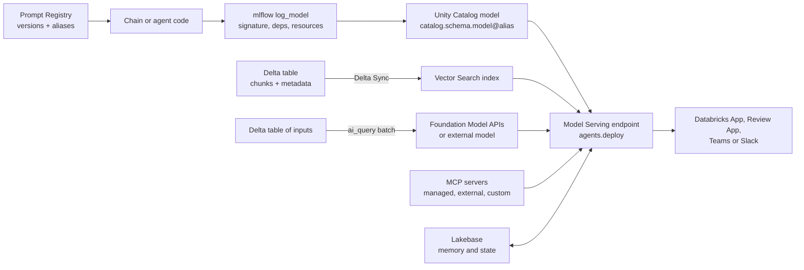
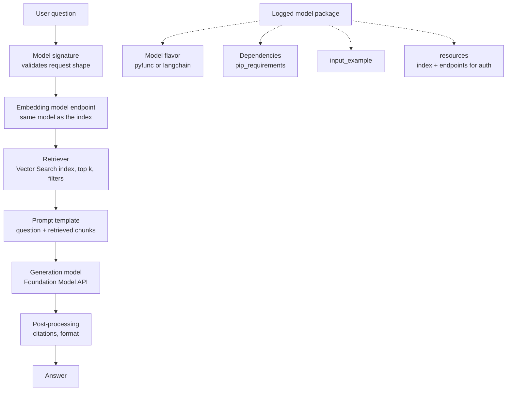
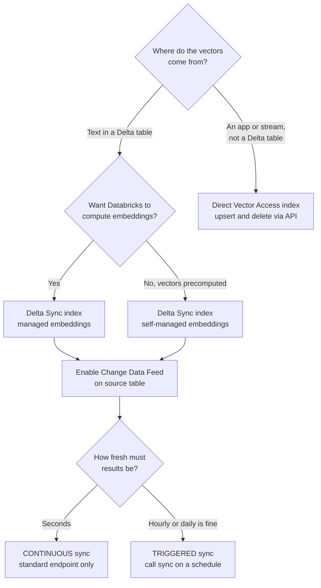
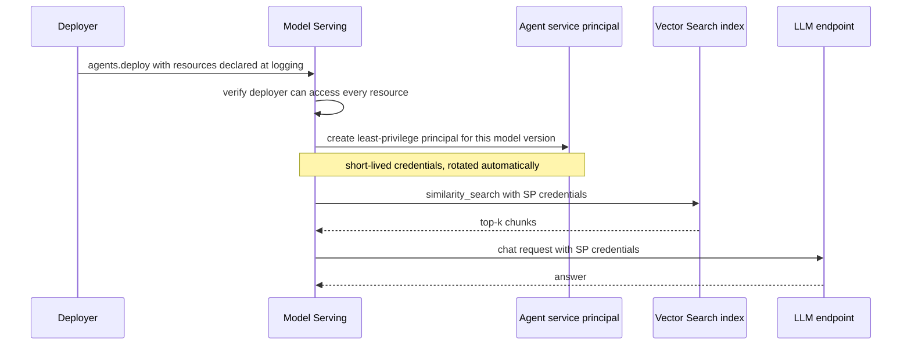
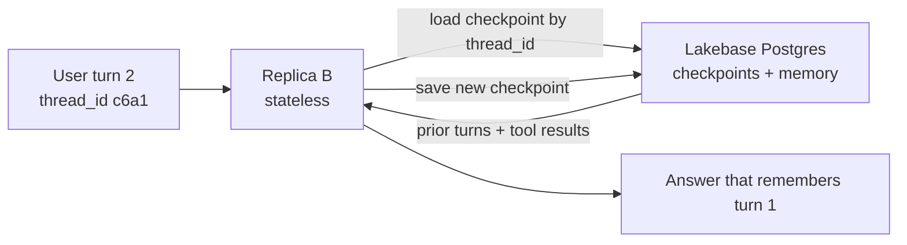
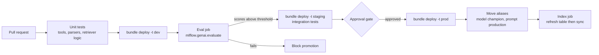
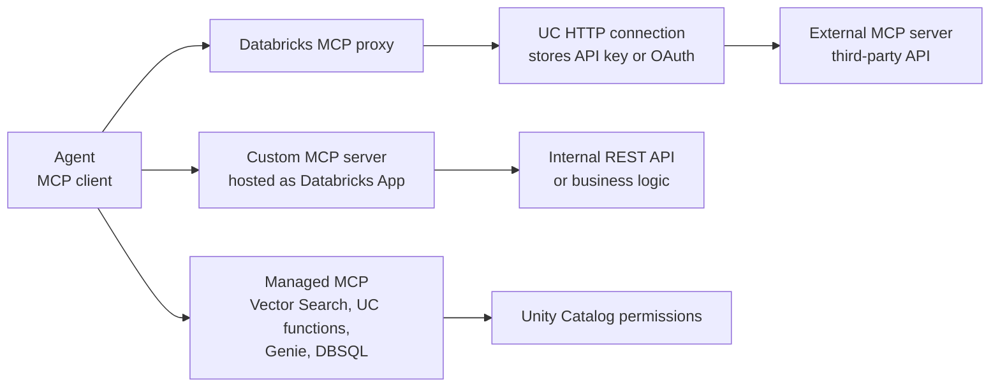
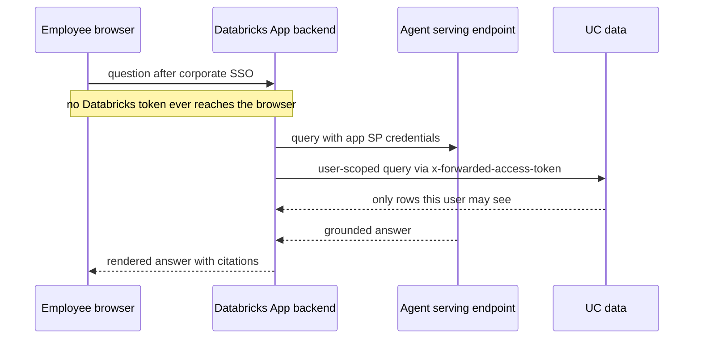

# Domain 4 — Assembling and Deploying Applications (22%)

> **Big idea:** a notebook prototype becomes a product only when it is *packaged* (model + code + dependencies + signature), *registered* (Unity Catalog), *served* behind an endpoint with the right identity, *fed* by a fresh index, and *reached* through an interface people actually use.

**Exam weight: 22% ≈ 10 of 45 questions.** This is the largest domain after Application Development. Aligned to the exam guide live since **March 18, 2026**.

Prerequisites from this course: the three inference modes and deployment strategies in
[M12 — Serving, Monitoring & Experimentation](../system-design/12-serving-monitoring-experimentation.md)
(especially [§2.1 Three ways to produce predictions](../system-design/12-serving-monitoring-experimentation.md#21-three-ways-to-produce-predictions),
[§2.6 Serving ANN retrieval](../system-design/12-serving-monitoring-experimentation.md#26-serving-approximate-nearest-neighbour-ann-retrieval) and
[§2.8 Deployment strategies](../system-design/12-serving-monitoring-experimentation.md#28-deployment-strategies)),
and the serving architecture in [Case study 7 — RAG assistant §8](../case-studies/07-rag-assistant.md#8-serving-architecture).

> **Naming note (October 2026).** Databricks renames products faster than the exam is reissued.
> The March 2026 guide says **Mosaic AI Vector Search**; the current docs call it **Databricks AI Search**
> ("formerly Databricks Vector Search"). The Python package `databricks-vectorsearch` / `VectorSearchClient`
> still works as a deprecated shim over `databricks-ai-search` / `AISearchClient`. **Databricks Asset Bundles**
> are now **Declarative Automation Bundles** ("formerly known as Databricks Asset Bundles"). External MCP servers
> are now registered through **Unity Gateway**, and the deploy docs now steer *new* agents toward Databricks Apps /
> Agent Bricks tooling rather than Model Serving. The exam was written against the older names and the Model Serving
> path (`agents.deploy`) — recognize both, answer with the concept.

## Objectives covered

| # | Objective (verbatim from the exam guide) | Section |
|---|---|---|
| 1 | Code a simple chain according to requirements | [4.1](#41-code-a-simple-chain) |
| 2 | Code a chain using a pyfunc model with pre- and post-processing | [4.2](#42-a-pyfunc-chain-with-pre--and-post-processing) |
| 3 | Choose the basic elements needed to create a RAG application: model flavor, embedding model, retriever, dependencies, input examples, model signature | [4.3](#43-the-basic-elements-of-a-rag-application) |
| 4 | Register the model to Unity Catalog using MLflow | [4.4](#44-register-the-model-to-unity-catalog) |
| 5 | Explain the key concepts and components of Mosaic AI Vector Search | [4.5](#45-vector-search-key-concepts) |
| 6 | Create and query a Vector Search index | [4.6](#46-create-and-query-a-vector-search-index) |
| 7 | Configure vector search for a particular solution based on number of embeddings, update frequency, latency, and cost requirements. | [4.7](#47-configuring-vector-search-for-a-solution) |
| 8 | Identify how to serve an LLM application that leverages Foundation Model APIs | [4.8](#48-serving-with-foundation-model-apis) |
| 9 | Control access to resources from model serving endpoints | [4.9](#49-access-control-from-serving-endpoints) |
| 10 | Identify batch inference workloads and apply ai_query() appropriately | [4.10](#410-batch-inference-with-ai_query) |
| 11 | Configure a persistent datastore to store and retrieve intermediate memory or structured information. | [4.11](#411-persistent-memory-and-state) |
| 12 | Apply prompt version control and manage prompt lifecycle | [4.12](#412-prompt-version-control-and-lifecycle) |
| 13 | Apply CI/CD best practices such as updating a Vector Search index, promoting prompts across environments, and testing individual components of an agent. | [4.13](#413-cicd-for-genai-applications) |
| 14 | Integrate managed, external, and custom MCP servers based on a given application requirements | [4.14](#414-managed-external-and-custom-mcp-servers) |
| 15 | Develop an appropriate interactive user facing interface for an agent usage scenario (Apps, Slack, Teams, etc.) | [4.15](#415-user-facing-interfaces) |

The whole domain on one page:



---

## 4.1 Code a simple chain

### The problem

A business requirement ("turn a support ticket into a one-line summary plus a priority") must become a
deterministic sequence of steps. A *chain* is exactly that: a fixed pipeline where each step's output is
the next step's input. No step decides *which* step runs next — that is what distinguishes a chain from an agent.

### First principles

Every LLM chain has the same skeleton:

1. **Input mapping** — turn the raw request into the variables the prompt needs.
2. **Prompt template** — instructions + delimiters + variables.
3. **Model call** — a chat model (on Databricks, usually a Foundation Model API endpoint).
4. **Output parsing** — turn text into the type downstream code needs (string, JSON, list).

Add a **retriever** between steps 1 and 2 and the chain becomes RAG. Add **tool choice by the model** and it becomes an agent (Domain 3).

### Databricks specifics

- The LLM is usually reached through a **Model Serving endpoint** — a pay-per-token Foundation Model API endpoint (names start with `databricks-`) or an external-model endpoint.
- LangChain integration lives in `databricks-langchain` (`ChatDatabricks` for chat models). MLflow can log LangChain chains directly, or you can wrap any Python in a pyfunc (§4.2).
- Most Foundation Model APIs are OpenAI-compatible, so the plain OpenAI client also works against a Databricks endpoint.

```python
# Illustrative; check current docs for exact signatures
from databricks_langchain import ChatDatabricks
from langchain_core.prompts import ChatPromptTemplate
from langchain_core.output_parsers import StrOutputParser

prompt = ChatPromptTemplate.from_messages([
    ("system", "Summarize the ticket in ONE sentence, then output a priority: P1, P2 or P3."),
    ("user", "<ticket>{ticket}</ticket>"),
])
llm = ChatDatabricks(endpoint="databricks-meta-llama-3-3-70b-instruct", temperature=0)
chain = prompt | llm | StrOutputParser()      # input -> prompt -> model -> parser
print(chain.invoke({"ticket": "Card charged twice for order 1182"}))
```

### Decision table — which building block does the requirement need?

| Requirement says… | Add this step |
|---|---|
| "answer from our documents / cite sources" | Retriever (Vector Search) before the prompt |
| "return JSON / a fixed set of labels" | Output parser + format instructions (low temperature) |
| "remember what the user said earlier" | Chat history / memory (§4.11) |
| "look up the customer's order" (fixed lookup) | A deterministic function call in the chain, not an agent |
| "decide which of several tools to use" | That is an agent, not a simple chain |

### Worked example

Requirement: *"Translate incoming French reviews to English, then classify sentiment as positive/negative/neutral."*
Two LLM steps in sequence: translation prompt → model → string, then classification prompt → model → label parser.
No retriever (all information is in the input), no memory (single-turn), no agent (the order never changes).
If the same job runs over 2 million stored reviews overnight, do not build an endpoint at all — use `ai_query` (§4.10).

> **Exam trap:** Adding a retriever or an agent loop to a task whose answer is fully contained in the input. Extra components add latency, cost, and failure points without adding information.

> **Exam trap:** Using temperature as a formatting tool. Low temperature reduces randomness; it does not *guarantee* a format. Parsing (and structured output where available) does.

---

## 4.2 A pyfunc chain with pre- and post-processing

### The problem

Your chain needs logic that no framework flavor knows about: strip PII before the prompt, truncate long
inputs, call the LLM, then parse and validate the JSON, and maybe fall back to a default. Model Serving can
only serve *an MLflow model*. How do you ship arbitrary Python as one?

### First principles

`mlflow.pyfunc.PythonModel` is MLflow's "bring your own code" contract. MLflow does not care what happens inside
— it only needs two hooks:

| Hook | When it runs | Put here |
|---|---|---|
| `load_context(self, context)` | **Once**, when the model is loaded (endpoint container start) | Expensive setup: read config/artifacts, create clients, load a tokenizer |
| `predict(self, context, model_input, params=None)` | **Every request** | Pre-process → model/LLM call → post-process |

`context.artifacts` is a dict `{name: local_path}` of files you attached with `artifacts={...}` when logging —
MLflow copies them into the model package so they exist on the serving container. (Since MLflow 2.20 the
`context` argument can be dropped from `predict` if unused.)

```python
# Illustrative; check current docs for exact signatures
import json, re
import mlflow
import pandas as pd
from mlflow.deployments import get_deploy_client

class TicketTriage(mlflow.pyfunc.PythonModel):
    def load_context(self, context):                    # once per container
        with open(context.artifacts["config"]) as f:
            self.cfg = json.load(f)
        self.client = get_deploy_client("databricks")

    def _pre(self, text):                               # pre-processing
        text = re.sub(r"\b\d{16}\b", "[CARD]", text)    # mask card numbers
        return text[: self.cfg["max_chars"]]

    def _post(self, raw):                               # post-processing
        try:
            out = json.loads(raw)
        except json.JSONDecodeError:
            out = {"summary": raw[:200], "priority": "P3"}
        return out

    def predict(self, context, model_input, params=None):
        rows = []
        for t in model_input["ticket"]:
            resp = self.client.predict(
                endpoint=self.cfg["llm_endpoint"],
                inputs={"messages": [{"role": "system", "content": self.cfg["system_prompt"]},
                                     {"role": "user", "content": self._pre(t)}]},
            )
            rows.append(self._post(resp["choices"][0]["message"]["content"]))
        return pd.DataFrame(rows)
```

Logging it (the `artifacts` dict is what later appears as `context.artifacts`):

```python
# Illustrative; check current docs for exact signatures
from mlflow.models.resources import DatabricksServingEndpoint

with mlflow.start_run():
    info = mlflow.pyfunc.log_model(
        name="ticket_triage",
        python_model=TicketTriage(),
        artifacts={"config": "config.json"},
        pip_requirements=["mlflow", "pandas"],
        input_example=pd.DataFrame({"ticket": ["Card charged twice for order 1182"]}),
        resources=[DatabricksServingEndpoint(endpoint_name="databricks-meta-llama-3-3-70b-instruct")],
    )
```

> **Models from code.** Instead of pickling an object, current MLflow and Databricks docs recommend
> *models from code*: pass a path to a `.py` file as `python_model` and call `mlflow.models.set_model(...)` inside
> that file. It avoids serialization problems with clients and frameworks. For agents, Databricks recommends
> authoring with the `ResponsesAgent` interface, for which MLflow infers a valid signature automatically.

### Decision table — where does each piece of logic go?

| Logic | `load_context` | `predict` | Logged artifact / config |
|---|---|---|---|
| Creating an LLM / HTTP client | ✅ | | |
| Reading a prompt template or lookup file | ✅ (read) | | ✅ (the file) |
| PII masking, truncation, formatting the request | | ✅ (pre) | |
| JSON parsing, validation, fallbacks, citations | | ✅ (post) | |
| Endpoint name, max tokens, thresholds | | | ✅ (`model_config` or config artifact) |

### Worked example

A team's served model is slow on every request. The profiler shows each call opens a 400 MB tokenizer from disk.
The fix is to move the load into `load_context` (runs once per container) and attach the tokenizer files with
`artifacts=`, so the path in `context.artifacts` exists on the serving container. Per-request latency drops by the
load time; nothing about the model's behavior changes.

> **Exam trap:** Loading a file by a hard-coded notebook or DBFS path inside `predict`. The serving container does not see your notebook filesystem; attach it as an artifact and read it via `context.artifacts`.

> **Exam trap:** Doing pre-/post-processing *outside* the logged model (e.g., in the client app). Then every caller must re-implement it, and batch, evaluation, and serving can drift apart. Put it inside `predict` so the logged model *is* the whole chain.

---

## 4.3 The basic elements of a RAG application

### The problem

A RAG chain that works in your notebook depends on things that are invisible there: an installed package, an
embedding model endpoint, a vector index, the shape of the request. The serving container starts empty. Every
dependency you do not *declare* is a production failure.



### Each element and *why* it is needed

| Element | What it is | Why it is needed (what breaks without it) |
|---|---|---|
| **Model flavor** | The MLflow format: `pyfunc` (custom Python), `langchain`, `openai`, … | Tells MLflow *how to load and call* the model. Custom pre/post logic → `pyfunc`. |
| **Embedding model** | Model that turns the query into a vector | Query vectors must come from the **same embedding model** (same space, same dimension) used to index the documents, or similarity is meaningless. |
| **Retriever** | Component that queries the vector index (top-k, filters, hybrid) | Supplies the grounding context. Without it, the LLM answers from parametric memory → hallucinations. |
| **Dependencies** | `pip_requirements` / `extra_pip_requirements` (or `code_paths` for local modules) | The serving image installs only what is declared. Missing `databricks-vectorsearch` → `ModuleNotFoundError` at first request. Pin versions for reproducibility. |
| **Input example** | A sample request (`input_example=`) | Lets MLflow infer the signature, validates that the model can actually run before deployment, and documents the request format. |
| **Model signature** | Input/output schema (`signature=` or inferred from input example / type hints) | Serving validates requests against it; **Unity Catalog requires a signature for new model versions**. |
| **Resources** (Databricks-specific) | `resources=[...]` listing index, endpoints, functions… | Enables automatic authentication passthrough at serving time (§4.9). |

### Worked example

A RAG model logged with `mlflow.pyfunc.log_model(python_model=..., input_example=...)` deploys but fails on the
first query with `ModuleNotFoundError: databricks.vector_search`. The notebook had the package installed, the model
package did not. Fix: add it to `pip_requirements`, re-log, re-register, update the endpoint. Second failure: the
endpoint cannot read the index (permission denied) → the index and embedding endpoint were not listed in `resources`.

> **Exam trap:** "Use a different, cheaper embedding model for queries than for indexing." Query and document vectors must live in the same embedding space. (Databricks lets you use a *different endpoint serving the same model* for queries — `model_endpoint_name_for_query` — but never a different model.)

> **Exam trap:** Treating the input example as optional decoration. For UC registration you need a signature, and the easiest reliable way to get one is to provide an input example (or use an agent interface like `ResponsesAgent` that infers it).

---

## 4.4 Register the model to Unity Catalog

### The problem

A logged model sits inside one MLflow run. Production needs a governed, named, versioned object that serving
endpoints, jobs, and other teams can reference — with permissions and lineage.

### First principles

Separate **immutable versions** (what was built) from **mutable pointers** (what is currently in use). Promotion
then means *moving a pointer*, and rollback means moving it back. Code that references the pointer never changes.

### Databricks specifics

- **Registry URI.** `mlflow.set_registry_uri("databricks-uc")` points MLflow at Unity Catalog. In MLflow 3 this is the default on Databricks; set it explicitly in older setups.
- **Three-level name.** `catalog.schema.model` (e.g. `prod.support.rag_bot`). Environments are often separated by catalog (`dev`, `staging`, `prod`).
- **Signature required.** New model versions in UC must have a signature.
- **Aliases, not stages.** UC does **not** support the workspace-registry stages (`Staging`, `Production`, `Archived`). Use **aliases** such as `@champion` / `@challenger` and load with `models:/catalog.schema.model@champion`.
- **Privileges.** `USE CATALOG` + `USE SCHEMA` + `CREATE MODEL` on the schema to register; owner (plus the USE privileges) to manage aliases.

```python
# Illustrative; check current docs for exact signatures
import mlflow
from mlflow import MlflowClient

mlflow.set_registry_uri("databricks-uc")
mv = mlflow.register_model(info.model_uri, "prod.support.rag_bot")   # creates version N
MlflowClient().set_registered_model_alias("prod.support.rag_bot", "champion", mv.version)
model = mlflow.pyfunc.load_model("models:/prod.support.rag_bot@champion")
```

(`registered_model_name=` in `log_model` logs and registers in one call.)


### Decision table

| Need | Use |
|---|---|
| Point production at a new version | Move alias `@champion` to version N |
| Roll back | Move alias back to version N−1 (no rebuild) |
| Separate dev/prod governance | Different catalogs (`dev.*`, `prod.*`) + grants |
| Copy an approved model to the prod catalog | `MlflowClient().copy_model_version(...)` (verify in current docs) |
| "Transition to Production stage" | Not available in UC — that is the legacy workspace registry |

> **Exam trap:** Any answer that uses `transition_model_version_stage` or "Production stage" with Unity Catalog. Stages are workspace-registry only; UC uses aliases.

> **Exam trap:** A two-level name like `support.rag_bot` with the UC registry. UC requires `catalog.schema.model`.

---

## 4.5 Vector Search key concepts

> **Naming:** Vector Search is now called **Databricks AI Search** in the docs; the current client is
> `AISearchClient` (module `databricks.ai_search`, reranker `databricks.ai_search.reranker.DatabricksReranker`).
> Older code uses `databricks-vectorsearch` / `VectorSearchClient`, which still works. The exam says "Vector Search".

### The problem

Retrieval needs "find the 5 chunks most similar to this query vector" in milliseconds over millions of rows,
while the underlying documents keep changing. A brute-force scan of a Delta table is O(N) per query; an index
you rebuild by hand goes stale.

### First principles

An ANN index (Databricks uses **HNSW**, an approximate nearest-neighbor graph — see
[M12 §2.6](../system-design/12-serving-monitoring-experimentation.md#26-serving-approximate-nearest-neighbour-ann-retrieval))
trades a little recall for sub-linear query time. Two separate concerns then appear:

1. **Compute that answers queries** → the **endpoint**.
2. **Data structure kept in sync with a source** → the **index**.

### Components

| Component | What it is | Key facts |
|---|---|---|
| **Vector Search endpoint** | Managed compute that serves indexes | One endpoint serves **many** indexes (limit 50 indexes/endpoint); autoscales; type is **Standard** or **Storage-optimized** |
| **Index** | UC-governed object (`catalog.schema.index`) built from a source table | Needs a **primary key**; similarity is L2 by default (normalize vectors for cosine) |
| **Delta Sync index** | Index that syncs automatically from a Delta source table | Source must have **Change Data Feed** enabled (standard endpoints; row tracking enables CDF automatically) |
| ↳ managed embeddings | You give a **text column** + an embedding model endpoint; Databricks computes vectors | Simplest; same model used for queries by default |
| ↳ self-managed embeddings | Source table already has a **vector column** | You compute embeddings; cannot later convert to managed (needs a new index) |
| **Direct Vector Access index** | No source table sync; you **upsert/delete vectors via API** | You own freshness; useful when vectors come from an app/stream outside Delta |
| **Sync mode** | `TRIGGERED` or `CONTINUOUS` (Delta Sync only) | Triggered = sync when you call it (cheaper); Continuous = streaming pipeline, seconds of latency, costs more |
| **Hybrid search** | Vector + BM25 keyword, fused with Reciprocal Rank Fusion | Helps with exact IDs, SKUs, error codes; max 200 results |
| **Reranker** | Second-stage reranking of results (`DatabricksReranker`) | Better precision, adds latency |
| **Filters** | Metadata filters at query time | Dict syntax on standard, SQL-like string on storage-optimized; how you implement per-user ACLs (row/column UC permissions are not enforced inside the index) |



> **Exam trap:** Confusing endpoint and index. You don't create "an endpoint per document set"; one endpoint hosts many indexes. Capacity, latency, and cost are endpoint-type decisions; freshness is an index sync decision.

> **Exam trap:** "The Delta Sync index won't create" → first suspect: Change Data Feed is not enabled on the source table (`ALTER TABLE ... SET TBLPROPERTIES (delta.enableChangeDataFeed = true)`), or there is no primary key column.

> **Exam trap:** Expecting Unity Catalog row filters / column masks on the source table to be enforced at query time. They are not supported in the index; use metadata **filters** (e.g., `department`) in the query.

---

## 4.6 Create and query a Vector Search index

### Creating

```python
# Illustrative; check current docs for exact signatures
# Current docs: `databricks-ai-search` / AISearchClient; legacy VectorSearchClient still works.
from databricks.vector_search.client import VectorSearchClient

vsc = VectorSearchClient()
vsc.create_endpoint(name="support_vs", endpoint_type="STANDARD")   # or "STORAGE_OPTIMIZED"

index = vsc.create_delta_sync_index(
    endpoint_name="support_vs",
    source_table_name="prod.support.kb_chunks",     # CDF enabled
    index_name="prod.support.kb_chunks_index",
    pipeline_type="TRIGGERED",                       # or "CONTINUOUS"
    primary_key="chunk_id",
    embedding_source_column="chunk_text",            # managed embeddings
    embedding_model_endpoint_name="databricks-gte-large-en",
)
```

For **self-managed** embeddings replace the last two arguments with `embedding_vector_column="text_vector"` and
`embedding_dimension=1024`. For **Direct Vector Access**, `create_direct_access_index(...)` also takes an explicit
`schema={...}` because there is no source table to infer it from, and you then write with upsert calls.

Prerequisite SQL:

```sql
-- Illustrative; check current docs for exact syntax
ALTER TABLE prod.support.kb_chunks SET TBLPROPERTIES (delta.enableChangeDataFeed = true);
```

### Querying

```python
# Illustrative; check current docs for exact signatures
index = vsc.get_index(index_name="prod.support.kb_chunks_index")

hits = index.similarity_search(
    query_text="How do I reset two-factor authentication?",  # managed embeddings: send text
    columns=["chunk_id", "chunk_text", "source_url"],
    num_results=5,
    filters={"product": ["mobile_app", "web"]},               # dict syntax on standard endpoints
    query_type="hybrid",                                      # default is ANN (vector only)
)
```

- `query_text` → the index embeds the query with its model (managed embeddings).
- `query_vector=[...]` → you embed it yourself (self-managed embeddings; required unless a query model is configured).
- `columns` → which source columns to return (the chunk text + metadata for citations).
- On storage-optimized endpoints filters are a SQL-like string, e.g. `filters="product = 'web' AND year > 2024"`.
- Reranking: pass `reranker=DatabricksReranker(columns_to_rerank=[...])` (newer SDK; verify version in docs).
- Refresh a triggered index with `index.sync()`.

As a LangChain retriever (inside a chain), `databricks-langchain` provides `DatabricksVectorSearch(...).as_retriever(...)` (verify current class name).

### Decision table — query parameters

| Situation | Parameter |
|---|---|
| Index computes embeddings | `query_text` |
| You computed the embedding yourself | `query_vector` |
| Users search exact part numbers / error codes | `query_type="hybrid"` |
| Only return docs the user's region may see | `filters={"region": user_region}` |
| Need source URL for citations | include it in `columns` |
| Top results relevant but badly ordered | `reranker=...` |

> **Exam trap:** Sending `query_text` to a self-managed-embeddings index without a query embedding model configured — there is no model to embed the text. Send `query_vector` computed with the same model used for the documents.

> **Exam trap:** Calling `sync()` on a **CONTINUOUS** index or on a **Direct Vector Access** index. `sync()` is for triggered Delta Sync indexes; continuous syncs itself, and direct access is updated by your upserts.

---

## 4.7 Configuring Vector Search for a solution

### The problem

Four requirements pull in different directions: **how many vectors**, **how often the data changes**, **how fast queries must be**, and **how much you can spend**. The exam gives you numbers and expects you to pick an endpoint type, index type, sync mode, and search features.

### The two endpoint types (current docs)

| | **Standard** | **Storage-optimized** |
|---|---|---|
| Capacity (768-dim) | ~320 million vectors | 1 billion+ vectors |
| Query latency | Lower (baseline) | ~250 ms higher |
| High QPS | Supported | **Not supported** |
| Indexing speed | Baseline | 10–20× faster |
| Continuous sync | Supported | **Not supported** (triggered only) |
| Incremental sync | Yes | Partial — each sync rebuilds portions |
| Cost | Higher per vector stored | Lower cost at large scale |
| Filter syntax | Dict | SQL-like string |
| Provisioned extra throughput (`target_qps`) | Yes (billed regardless of traffic) | No |

Other scale facts: Direct Vector Access on standard ≈ 2 million vectors at 768 dims; Delta Sync on standard ≈ 160 million at 1536 dims; dimension ≤ 4096; storage-optimized dimension must be divisible by 16. **Bigger embedding dimensions reduce how many vectors fit.**

### Decision table

| Requirements | Choose |
|---|---|
| ≤ hundreds of millions of vectors, **latency-critical**, high QPS | **Standard** endpoint |
| **Billions** of vectors, cost-sensitive, a few hundred ms extra is fine, modest QPS | **Storage-optimized** endpoint |
| Source changes constantly and answers must reflect it in seconds | Delta Sync + **CONTINUOUS** (standard endpoint) |
| Source changes daily/weekly | Delta Sync + **TRIGGERED**, call `sync()` after the ETL job (cheapest) |
| Vectors produced by an external app, not in Delta | **Direct Vector Access** |
| Too many vectors for the endpoint | Larger chunks / less overlap (fewer rows), smaller embedding dimension, or storage-optimized |
| Exact-match tokens (SKUs, codes) matter | Hybrid search (adds some latency) |
| Precision of top-k matters more than latency | Add reranker |
| Strictest latency budget | ANN only, no reranker; keep `num_results` small |

### Worked example

*A legal-research product indexes 1.4 billion paragraph embeddings (1024 dims). New court opinions are added once a
night. Queries come from ~15 analysts; a 1-second response is acceptable. Budget is tight.*

- 1.4 B vectors exceeds standard capacity → **storage-optimized**.
- Nightly additions → **TRIGGERED** sync, run `sync()` as the final task of the nightly ingest job (continuous is not even available here).
- 1024 is divisible by 16 → OK for storage-optimized.
- Low QPS and a relaxed latency budget absorb the ~250 ms extra latency.

Flip one requirement — "the trading desk asks 200 queries/second and needs <100 ms over 40 M vectors" — and the
answer becomes a **standard** endpoint with ANN-only queries.

> **Exam trap:** "Storage-optimized is newer, so it's better." It is cheaper and bigger, **not faster** and not for high QPS. When latency is the most critical metric and the corpus fits, choose standard.

> **Exam trap:** Choosing CONTINUOUS sync for data that changes once a day. It runs a streaming pipeline all the time and costs more; triggered sync after the load is the cost-efficient answer.

---

## 4.8 Serving with Foundation Model APIs

### The problem

Your application needs an LLM behind an HTTPS endpoint with autoscaling, governance, and logging — without
you managing GPUs. Which serving mode fits depends on traffic shape, model choice, and compliance.

### Options

| Mode | What it is | Use when |
|---|---|---|
| **Pay-per-token** Foundation Model APIs | Databricks-hosted, shared endpoints (`databricks-…`), billed per token | Prototyping, low/variable traffic, quick start. Priority pay-per-token exists for latency-sensitive production (current docs). |
| **Provisioned throughput** | Dedicated capacity for a model, billed for capacity | Production with high, steady throughput, performance guarantees, **fine-tuned or custom weights**, compliance needs (e.g. HIPAA) |
| **External models** | A Model Serving endpoint that proxies to OpenAI, Anthropic, Cohere, Bedrock, Vertex AI, … | You need a third-party model but want one governed endpoint; the provider key is stored once (Databricks secret reference `{{secrets/scope/key}}`) |
| **Custom model / agent endpoint** | Your logged chain/agent from UC served on Model Serving | Your RAG chain or agent itself; it *calls* one of the above |

### Serving the *application*, not just the LLM

The LLM endpoint is a dependency. The **chain/agent** is what you deploy:

```python
# Illustrative; check current docs for exact signatures
from databricks import agents

deployment = agents.deploy(
    "prod.support.rag_bot",       # UC model (must be registered in UC first)
    mv.version,
    scale_to_zero_enabled=False,  # True saves cost but adds cold-start latency
)
print(deployment.query_endpoint)
```

By default `agents.deploy()` creates a Model Serving endpoint (autoscaling), provisions short-lived credentials for
declared Databricks resources, enables MLflow tracing / production monitoring, the **Review App**, and **inference
tables**. You can also create an endpoint for any UC model through the Serving UI, REST API, or SDK.

### Worked example

A hospital's discharge-summary assistant moves from pilot (300 requests/day) to production (steady 40 requests/second,
HIPAA workload, a fine-tuned Llama variant). Pilot: pay-per-token. Production: **provisioned throughput** — required
for the fine-tuned weights and the performance/compliance guarantees. The RAG chain itself is a separate UC model
deployed with `agents.deploy`, calling the provisioned endpoint.

> **Exam trap:** Calling OpenAI directly from the chain with a key in the code. The governed pattern is an **external model endpoint** (key stored by Databricks/secret), so you get one place for permissions, rate limits, and logging (AI Gateway).

> **Exam trap:** "Pay-per-token for a fine-tuned model." Fine-tuned or custom weights require provisioned throughput.

---

## 4.9 Access control from serving endpoints

### The problem

A served agent runs on Databricks compute, not as you. When it queries a Vector Search index, an LLM endpoint,
or a UC table, *whose* credentials does it use? Hard-coding your personal token is a security incident waiting to
happen (and breaks when you leave the company).

### Three mechanisms (current docs, Model Serving)

| Method | How | When |
|---|---|---|
| **Automatic authentication passthrough** | Declare dependencies with `resources=[...]` in `log_model()`. At deploy, Databricks checks the *deployer* can access them, creates a least-privilege **service principal** for that model version, and issues short-lived, auto-rotated credentials | Default whenever every resource supports it |
| **On-behalf-of-user (OBO)** | Log with `auth_policy` (`UserAuthPolicy(api_scopes=[...])`); inside `predict` build `WorkspaceClient(credentials_strategy=ModelServingUserCredentials())` | Each user must only see what *they* may see; per-user audit. Public Preview |
| **Manual authentication** | Pass `DATABRICKS_HOST`, `DATABRICKS_CLIENT_ID`, `DATABRICKS_CLIENT_SECRET` (service principal OAuth) as endpoint environment variables using secret references `{{secrets/scope/key}}` | Resource doesn't support passthrough, external APIs, **reading the Prompt Registry** from a served agent |

Resource classes in `mlflow.models.resources`: `DatabricksServingEndpoint`, `DatabricksVectorSearchIndex`,
`DatabricksFunction`, `DatabricksSQLWarehouse`, `DatabricksGenieSpace`, `DatabricksTable`,
`DatabricksUCConnection`, `DatabricksApp`, `DatabricksLakebase`.

```python
# Illustrative; check current docs for exact signatures
from mlflow.models.resources import DatabricksVectorSearchIndex, DatabricksServingEndpoint

resources = [
    DatabricksVectorSearchIndex(index_name="prod.support.kb_chunks_index"),
    DatabricksServingEndpoint(endpoint_name="databricks-gte-large-en"),             # embeddings
    DatabricksServingEndpoint(endpoint_name="databricks-meta-llama-3-3-70b-instruct"),  # LLM
]
```



**Who may call the endpoint?** Separate question, separate control: serving endpoint ACLs — **CAN VIEW**
(see details), **CAN QUERY** (send requests), **CAN MANAGE** (update config, delete, change permissions). Applications
call with a service principal's OAuth token that has CAN QUERY.

### Decision table

| Requirement | Mechanism |
|---|---|
| Agent reads one shared index + one LLM endpoint | Automatic passthrough (`resources`) |
| Users must only see rows/docs they are entitled to | On-behalf-of-user auth |
| Agent calls a third-party REST API needing a key | Store key in Databricks secrets; reference via `{{secrets/scope/key}}` env var (or a UC connection) |
| Third-party LLM | External model endpoint (key stored with the endpoint) |
| A downstream team's app must call the endpoint | Grant its service principal **CAN QUERY** |
| Team members must edit the endpoint config | **CAN MANAGE** |

> **Exam trap:** Embedding a personal access token in the model code or an artifact. Use passthrough, OBO, or a service principal secret reference — never a PAT in code.

> **Exam trap:** Forgetting **transitive** dependencies. If the retriever uses managed embeddings, the embedding endpoint must be declared along with the index; a Genie space needs its warehouse and tables too.

> **Exam trap:** Overriding security environment variables for one resource **disables automatic passthrough** for the others — then every resource must be reachable via the manual credentials.

---

## 4.10 Batch inference with ai_query

### The problem

"Summarize all 3 million support tickets from last year" is not a chat. No user is waiting. Sending 3 million HTTP
requests from a Python loop is slow, fragile, and hard to retry. Recall [M12 §2.1](../system-design/12-serving-monitoring-experimentation.md#21-three-ways-to-produce-predictions): when the input set is known in advance, **batch**.

### Databricks specifics

`ai_query()` is a SQL (and PySpark `expr`) function that calls a serving endpoint once per row, with Databricks
managing parallelism, retries, and scaling. Task-specific functions (`ai_summarize`, `ai_classify`, `ai_extract`,
`ai_translate`, `ai_mask`, `ai_analyze_sentiment`, …) need no endpoint or prompt.

Syntax (verified against the SQL reference): `ai_query(endpoint, request [, returnType] [, failOnError] [, modelParameters] [, responseFormat] ...)`.
Caller needs **CAN QUERY** on the endpoint.

```sql
-- Illustrative; check current docs for exact syntax
CREATE OR REPLACE TABLE prod.support.ticket_summaries AS
SELECT
  ticket_id,
  ai_query(
    'databricks-meta-llama-3-3-70b-instruct',
    CONCAT('Summarize this support ticket in one sentence: ', ticket_text),
    failOnError => false                                     -- one bad row won't kill the job
  ) AS result                                                -- STRUCT of response + error
FROM prod.support.tickets
WHERE created_at >= '2025-01-01';
```

Best practices from the docs: submit the full dataset in **one query** (don't hand-batch); set `failOnError => false`
and inspect the error field; pass `modelParameters` as constants; schedule it as a Lakeflow job/pipeline for
production. Endpoint recommendation has moved over time — current docs recommend Databricks-hosted (`databricks-`)
foundation model endpoints for batch rather than provisioned throughput; older material said the opposite
(verify in current docs before relying on either).

### Decision table

| Signal in the question | Batch `ai_query` | Real-time endpoint |
|---|---|---|
| "nightly / weekly / backfill / all rows in table" | ✅ | |
| "user waits for the answer in a chat" | | ✅ |
| Result lands in a Delta table / dashboard | ✅ | |
| SQL analysts must run it | ✅ | |
| Per-request personalization with conversation state | | ✅ |
| Classify each new row as it streams in (seconds OK) | ✅ (in a streaming / pipeline job) | |

> **Exam trap:** Building a Python loop that calls the REST endpoint per row from a notebook. `ai_query` over the Delta table is the scalable, retry-managed answer.

> **Exam trap:** Using `ai_query` inside an interactive app request path for one prompt. It is designed for set-based, table-level work, not per-click chat.

---

## 4.11 Persistent memory and state

### The problem

A serving endpoint is **stateless** and horizontally scaled: request 2 of a conversation may land on a different
replica than request 1, and scale-to-zero wipes memory entirely. Anything the agent must remember — conversation
turns, intermediate tool results, a user's preferences — must live in a datastore outside the container.

### What to store where

| Kind of state | Store | Why |
|---|---|---|
| **Short-term memory**: turns of the current conversation, intermediate graph state | **Lakebase** (managed Postgres) via a checkpointer keyed by `thread_id` | Low-latency transactional reads/writes per turn; survives replica changes |
| **Long-term memory**: facts and preferences across conversations | **Lakebase**-backed memory store (semantic retrieval) | Durable, queryable across sessions |
| **Structured business data** the agent looks up (orders, inventory) | Delta tables via UC functions / SQL warehouse, or Lakebase synced tables for low-latency point lookups | Governed, single source of truth |
| **Audit / analytics** of conversations | Inference tables / MLflow traces (Delta) | Analytical scans, monitoring, evaluation |
| Knowledge to retrieve by similarity | Vector Search index | Not for per-turn state |

Databricks' documented pattern (Model Serving): short-term memory = **thread IDs + checkpointing** in a Lakebase
instance (LangGraph example uses `CheckpointSaver(instance_name=...)` and reads `thread_id` from `custom_inputs`);
long-term memory = extract and store key insights across sessions. Declare the database with the
`DatabricksLakebase` resource. Newer docs describe these as *managed agent sessions* and *managed agent memory*,
both backed by Lakebase.

```python
# Illustrative; check current docs for exact signatures
# client side: send the same thread_id on every turn of a conversation
request = {
    "input": [{"role": "user", "content": "And what about my second order?"}],
    "custom_inputs": {"thread_id": "c6a1-..."},
}
```



### Worked example

An insurance claims agent forgets the claim number the user gave two messages ago — but only *sometimes*. Cause:
history was kept in a Python list on the agent object; with several replicas, turns land on different containers.
Fix: persist state in Lakebase keyed by `thread_id`, have the client send the same `thread_id` each turn, and declare
the Lakebase resource so the endpoint can authenticate.

> **Exam trap:** "Store conversation history in a global variable / in the model object." Lost on scale-out, restart, and scale-to-zero.

> **Exam trap:** Using a Vector Search index or a Delta table append per turn as the hot path for chat state. Delta is great for analytics and audit, but a transactional store (Lakebase/Postgres) is the documented choice for low-latency per-turn memory.

---

## 4.12 Prompt version control and lifecycle

### The problem

Prompts change more often than code, and a one-word change can shift behavior as much as a model swap. If prompts
live as string literals in code, every tweak needs a redeploy, there's no history of what ran when, and rollback means
reverting a commit and redeploying.

### First principles

Same pattern as models: **immutable versions + mutable aliases**. Code loads `@production`; promotion and rollback
move the alias.

### MLflow Prompt Registry (MLflow 3, `mlflow.genai`)

| API | Purpose |
|---|---|
| `mlflow.genai.register_prompt(name, template, commit_message=..., tags=...)` | Create the prompt or a **new immutable version** |
| `mlflow.genai.load_prompt("prompts:/name/3")` | Load a specific version |
| `mlflow.genai.load_prompt("prompts:/name@production")` | Load by alias (`@latest` is reserved for the newest) |
| `mlflow.genai.set_prompt_alias(name=..., alias=..., version=...)` | Point an alias at a version (promote / roll back) |
| `prompt.format(var=...)` | Fill `{{var}}` double-brace placeholders |

On Databricks, prompts are Unity Catalog objects with three-level names (`catalog.schema.prompt`); you need
`CREATE FUNCTION`, `EXECUTE`, and `MANAGE` on the schema (Beta; verify current status). `log_model` accepts a
`prompts=` argument to link prompt versions to the model version for lineage.

```python
# Illustrative; check current docs for exact signatures
import mlflow

p = mlflow.genai.register_prompt(
    name="prod.support.answer_prompt",
    template="Answer using ONLY the context.\n<context>{{context}}</context>\nQuestion: {{question}}",
    commit_message="Require answers to use context only",
)
mlflow.genai.set_prompt_alias(name="prod.support.answer_prompt", alias="production", version=p.version)

prompt = mlflow.genai.load_prompt("prompts:/prod.support.answer_prompt@production")
text = prompt.format(context=ctx, question=q)
```

### Lifecycle

| Stage | Action |
|---|---|
| Draft | `register_prompt` → new version (old versions untouched) |
| Evaluate | Run `mlflow.genai.evaluate` with the candidate version on an eval set |
| Promote | `set_prompt_alias(alias="production", version=N)` (keep `production-previous` → old N) |
| Roll back | Point `production` back at the previous version — no code change, no redeploy |
| Audit | Version history + commit messages + traces show which version produced each answer |

> **Exam trap:** "Edit the existing version in place." Prompt versions are **immutable**; you create a new version and move an alias.

> **Exam trap:** Hard-coding `prompts:/name/7` in production code. Then every promotion needs a code change; load by alias instead.

> **Exam trap:** Forgetting that a served custom agent reading the Prompt Registry needs **manual authentication** (a service principal via secret-backed env vars) — passthrough does not cover it.

---

## 4.13 CI/CD for GenAI applications

### The problem

A GenAI app has *more* moving parts than a classic model: code, prompts, the retriever index, the LLM endpoint,
tools, and configuration. Each can change independently and each can break quality. CI/CD must version all of them,
test pieces separately, and gate promotion on evaluation.

### Databricks building blocks

- **Declarative Automation Bundles** (formerly **Databricks Asset Bundles**, DABs): YAML + code describing jobs, pipelines, serving endpoints, registered models, apps, Vector Search endpoints/indexes, etc., deployed per **target** (`dev`, `staging`, `prod`) with `databricks bundle deploy -t <target>` from CI (e.g., GitHub Actions with a service principal).
- **Unity Catalog** catalogs per environment for data, models, prompts, indexes.
- **MLflow** for evaluation (`mlflow.genai.evaluate`), models (aliases), prompts (aliases).



### Practices the exam names

| Practice | How |
|---|---|
| **Updating a Vector Search index** | Delta Sync + triggered: make `index.sync()` the task after the source-table ETL in the same job (or use continuous). Changing chunking or embedding model → build a **new index** (self-managed can't be converted; dimensions change), validate retrieval, then switch the retriever config — don't mutate the live index in place. Direct Vector Access → upserts/deletes in your pipeline. |
| **Promoting prompts across environments** | Register prompt versions in the Prompt Registry; promote by moving aliases (`staging` → `production`) after automated eval; keep history for rollback. |
| **Testing individual agent components** | Unit-test each tool/UC function and parser with pytest using fixed inputs and a mocked LLM; test the retriever alone (does the gold chunk appear in top-k?); then end-to-end eval with scorers/judges as a gate. |
| **Infrastructure as code** | Endpoints, jobs, apps, indexes in the bundle; per-target variables (catalog names) — no click-ops. |
| **Promote models** | Register in UC; move `@champion` after the eval gate; endpoints load by version/alias. |

### Worked example

After a team changes the chunk size from 512 to 1024 tokens, answer quality drops but nobody knows whether retrieval
or generation broke. With component tests they would see immediately: the retriever test (gold chunk in top-5) fell
from 92% to 71%; the generation test (given the gold chunk, is the answer correct?) is unchanged. The fix belongs in
chunking, not the prompt. The new index is built side by side and only swapped in after the eval gate passes.

> **Exam trap:** "Overwrite the prompt file / Delta table in prod on every deploy." No versions, no gated promotion, no rollback. Use registry versions + aliases.

> **Exam trap:** Testing only end-to-end. When a score drops you cannot localize the fault; test tools, retriever, and generation separately.

> **Exam trap:** Changing the embedding model and calling `sync()` on the existing index. Vectors from two models can't be mixed; re-embed everything into a new index.

---

## 4.14 Managed, external, and custom MCP servers

### The problem

Every agent needs tools, and every tool used to need bespoke glue code per framework. The **Model Context Protocol
(MCP)** standardizes how an agent discovers (`list_tools`) and calls (`call_tool`) tools hosted by a server. The
design question becomes: *who hosts the server and who holds the credentials?*

### The three kinds on Databricks

| Kind | What it is | How it is configured | Credentials |
|---|---|---|---|
| **Managed** | Databricks-hosted servers over your governed assets: Vector Search indexes, UC functions, Genie spaces, Databricks SQL (and newer built-ins) | Point the client at the server URL, e.g. `https://<host>/api/2.0/mcp/ai-search/{catalog}/{schema}/{index_name}` (earlier docs: `.../mcp/vector-search/...`; verify in current docs), `/api/2.0/mcp/functions/{catalog}/{schema}/{function_name}`, `/api/2.0/mcp/genie/{space_id}`, `/api/2.0/mcp/sql` | User's or agent's Databricks identity; UC permissions on the underlying asset |
| **External** | Third-party MCP servers (e.g., a SaaS vendor's server) | Register via a **Unity Catalog HTTP connection** (now through Unity Gateway "MCPs"); Databricks proxies the calls | Stored in the UC connection (managed OAuth, own OAuth app, or a token — a Databricks **secret**, never in code); needs `CREATE CONNECTION` or `USE CONNECTION` |
| **Custom** | Your own MCP server (your code, your API wrapped as tools) | Host it as a **Databricks App**; agents connect to the app URL + `/mcp` | App's service principal or calling user; callers need CAN USE on the app |

Clients: `databricks-mcp` (`DatabricksMCPClient(server_url=..., workspace_client=...)` with `list_tools()` / `call_tool()`),
LangGraph via `DatabricksMultiServerMCPClient` + `DatabricksMCPServer` (`databricks-langchain`), and OpenAI Agents SDK
integrations (`databricks-openai`). For deployment, declare the dependencies (`DatabricksVectorSearchIndex`,
`DatabricksFunction`, `DatabricksUCConnection`, `DatabricksApp`, …) as resources.



### Decision table

| Requirement | Choose |
|---|---|
| Agent must search your Vector Search index / call UC functions / ask Genie | **Managed** MCP — zero hosting, UC-governed |
| A vendor already ships an MCP server for its API | **External** MCP via UC connection; key in the connection/secret |
| Internal system with no MCP server, custom logic needed | **Custom** MCP server on Databricks Apps |
| "Minimize maintenance" | Prefer managed > external > custom, in that order |
| Per-user access to the vendor | External with per-user OAuth (U2M) where supported |

### Worked example

A procurement agent must (1) look up contract clauses in a Vector Search index, (2) check supplier risk scores from a
vendor that publishes an MCP server needing an API key, and (3) create purchase requests in an internal ERP with a
REST API. → (1) managed MCP for the index; (2) external MCP through a UC connection holding the key; (3) a small
custom MCP server on Databricks Apps wrapping the ERP API. Building one custom server that wraps all three would
work but adds code you must maintain and re-secure.

> **Exam trap:** Building a custom MCP server for something Databricks already exposes as a managed server. Highest maintenance, no benefit.

> **Exam trap:** Pasting the external server's API key into agent code or the system prompt. Store it in the UC connection / Databricks secrets.

> **Exam trap:** Thinking MCP bypasses governance. Managed servers enforce UC permissions on the underlying index/function/space; external access is governed by the connection's privileges.

---

## 4.15 User-facing interfaces

### The problem

The best agent is useless if people cannot reach it where they work — and dangerous if the interface leaks
credentials or shows users data they shouldn't see. The interface choice is about **audience**, **identity**, and
**where the conversation happens**.

### Options

| Interface | Best for | Notes |
|---|---|---|
| **Databricks Apps** (Streamlit, Gradio, Dash, Flask, Shiny, Node/Express) | Custom internal web UI hosted inside Databricks, SSO built in | Agent templates include a built-in chat UI (streaming, auth). The **backend** calls the endpoint; no tokens in the browser |
| **Review App** (MLflow) | Stakeholders / SMEs testing the agent and labeling traces during development | Enabled by `agents.deploy`; labeling sessions need workspace access + experiment permissions |
| **Microsoft Teams** | Employees who live in Teams | Documented integration: bot code connecting Teams to a Databricks agent with OAuth federation (Azure) |
| **Slack** | Employees who live in Slack | A Slack bot backend calling the agent endpoint's REST API with a service principal (pattern; verify current Databricks guidance) |
| **REST API from an existing product** | Customer-facing apps already built elsewhere | Call the serving endpoint server-side with a service principal token (CAN QUERY) |
| **AI/BI Genie space** | Business users asking questions over tables | No agent code needed (Domain 1/3) |

### Databricks Apps authorization

| | **App authorization** | **User authorization** (on-behalf-of-user) |
|---|---|---|
| Identity | The app's dedicated service principal (`DATABRICKS_CLIENT_ID` / `DATABRICKS_CLIENT_SECRET` injected) | The signed-in user; token forwarded in the `x-forwarded-access-token` header |
| Permissions | Whatever is granted to the app's SP — same for all users | The user's own UC permissions, limited by the app's declared **scopes** |
| Use for | Shared resources, logging, calling external services | Respecting per-user access (row filters, column masks, user-specific data) |

Both can be combined in one app (log with the app identity, query data with the user identity).



### Worked example

*HR wants an assistant for 6,000 employees, mostly on Microsoft Teams, answering policy questions; managers may also
see their team's compensation bands.* Policy Q&A → agent endpoint; compensation → a UC table with row filters that
must respect the asker's identity → **user authorization** (OBO) for that query. Front-end → Teams integration for
reach; a Databricks App for the HR team's admin view. SMEs validate answers in the **Review App** before launch.

> **Exam trap:** Calling the endpoint from browser JavaScript with a PAT or API key. Credentials belong on the server side (app backend); the browser only sees the app.

> **Exam trap:** Using app authorization alone when the requirement says "answers must respect each user's permissions". The app's SP sees the same data for everyone; you need user authorization (or OBO on the endpoint).

> **Exam trap:** Building a custom web app when the requirement is "SMEs must test and give feedback this week" — that's the Review App.

---

## Quick review

1. A **chain** is a fixed sequence (input → prompt → model → parser); an **agent** chooses its next step.
2. `PythonModel.load_context` runs **once** per container (clients, artifacts); `predict` runs **per request** (pre-process → LLM → post-process). Attach files with `artifacts=` and read via `context.artifacts`.
3. RAG package = flavor + embedding model (same as index) + retriever + `pip_requirements` + `input_example` + signature + `resources`.
4. UC registry: `mlflow.set_registry_uri("databricks-uc")` (default in MLflow 3), names are `catalog.schema.model`, signature required, **aliases (`@champion`) not stages**.
5. Vector Search **endpoint** = compute serving many indexes; **index** = UC object with a primary key synced from a source.
6. Index types: Delta Sync (managed embeddings / self-managed embeddings) and Direct Vector Access (API upserts). Delta Sync needs **Change Data Feed** on the source.
7. **TRIGGERED** = sync on demand, cheaper; **CONTINUOUS** = seconds-fresh, costs more, standard endpoints only.
8. **Standard** endpoint = lower latency, high QPS, ~320 M vectors (768-d). **Storage-optimized** = 1 B+ vectors, cheaper at scale, ~250 ms slower, no high QPS, no continuous sync, SQL-like filters.
9. Pay-per-token to start; **provisioned throughput** for steady high traffic, guarantees, fine-tuned weights, compliance; **external models** proxy third-party LLMs with keys stored in secrets. `agents.deploy` serves the agent and turns on tracing, Review App, inference tables.
10. Endpoint auth: **automatic passthrough** via `resources=` (least-privilege SP, short-lived creds) → **OBO** for per-user access → **manual** SP secrets (`{{secrets/scope/key}}`) for external APIs and the Prompt Registry. Endpoint ACLs: CAN VIEW / CAN QUERY / CAN MANAGE.
11. Batch over a table → `ai_query(endpoint, request, ..., failOnError => false)` in one query; chat → real-time endpoint. Conversation state → **Lakebase** keyed by `thread_id`, never in-process memory.
12. Prompts: `mlflow.genai.register_prompt` / `load_prompt("prompts:/name@alias")` / `set_prompt_alias`; versions immutable. CI/CD = bundles per target + component tests + eval gate + alias promotion + new index on embedding change. MCP: managed (Databricks assets) < external (UC connection holds key) < custom (Databricks App) in maintenance. Apps: app auth (SP) vs user auth (`x-forwarded-access-token`).

---

## Official docs

Verified October 2026 (some pages now use the newer product names noted at the top).

- Vector Search / AI Search overview, index types, endpoint comparison, limits — https://docs.databricks.com/aws/en/vector-search/vector-search
- Create endpoints and indexes (`create_delta_sync_index`, `create_direct_access_index`, sync modes, CDF) — https://docs.databricks.com/aws/en/ai-search/create-ai-search
- Query an index (`similarity_search`, filters, hybrid, reranker) — https://docs.databricks.com/aws/en/vector-search/query-vector-search
- AI Search Python SDK (rename, legacy `databricks-vectorsearch` shim) — https://api-docs.databricks.com/python/ai-search/index.html
- Models in Unity Catalog (registry URI, aliases, signatures, privileges) — https://docs.databricks.com/aws/en/machine-learning/manage-model-lifecycle/
- MLflow pyfunc API (`PythonModel`, `load_context`, `predict`, `log_model` params) — https://mlflow.org/docs/latest/api_reference/python_api/mlflow.pyfunc.html
- MLflow custom Python models — https://mlflow.org/docs/latest/ml/model/python_model/
- Log and register agents (`ResponsesAgent`, code-based logging) — https://docs.databricks.com/aws/en/generative-ai/agent-framework/log-agent
- Deploy agents (`agents.deploy`) — https://docs.databricks.com/aws/en/generative-ai/agent-framework/deploy-agent
- Authentication for agents on Model Serving (passthrough, OBO, manual; resource classes) — https://docs.databricks.com/aws/en/agents/custom-agents/model-serving/agent-authentication-model-serving
- Serving endpoint ACLs — https://docs.databricks.com/aws/en/security/auth/access-control/
- Foundation Model APIs (pay-per-token, provisioned throughput) — https://docs.databricks.com/aws/en/machine-learning/foundation-model-apis/
- External models — https://docs.databricks.com/aws/en/generative-ai/external-models/
- AI Functions — https://docs.databricks.com/aws/en/large-language-models/ai-functions
- `ai_query` SQL reference — https://docs.databricks.com/aws/en/sql/language-manual/functions/ai_query
- Agent memory (Model Serving, Lakebase, `thread_id`) — https://docs.databricks.com/aws/en/agents/custom-agents/model-serving/stateful-agents-model-serving
- Agent memory (current overview) — https://docs.databricks.com/aws/en/generative-ai/agent-framework/stateful-agents
- Prompt Registry on Databricks — https://docs.databricks.com/aws/en/mlflow3/genai/prompt-version-mgmt/prompt-registry/
- Use prompts in deployed applications (alias promotion, auth) — https://docs.databricks.com/aws/en/mlflow3/genai/prompt-version-mgmt/prompt-registry/use-prompts-in-deployed-apps
- MLflow Prompt Registry — https://mlflow.org/docs/latest/genai/prompt-registry/
- Bundles resources (Declarative Automation Bundles, formerly Asset Bundles) — https://docs.databricks.com/aws/en/dev-tools/bundles/resources
- MCP on Databricks (overview) — https://docs.databricks.com/aws/en/generative-ai/mcp/
- Managed MCP server URLs — https://docs.databricks.com/aws/en/agents/mcp-tools/built-in-mcp-services
- Use MCP tools in agents (clients, custom servers on Apps) — https://docs.databricks.com/aws/en/agents/custom-agents/use-mcp-tools
- Register an external MCP server (UC HTTP connection) — https://docs.databricks.com/aws/en/ai-gateway/register-mcp-service
- Databricks Apps authorization (app vs user) — https://docs.databricks.com/aws/en/dev-tools/databricks-apps/auth
- Review App / labeling sessions — https://docs.databricks.com/aws/en/mlflow3/genai/human-feedback/expert-feedback/label-existing-traces
- Agent in Microsoft Teams — https://learn.microsoft.com/en-us/azure/databricks/generative-ai/agent-framework/teams-agent
