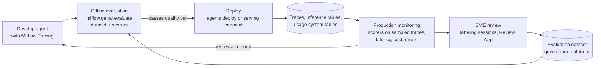
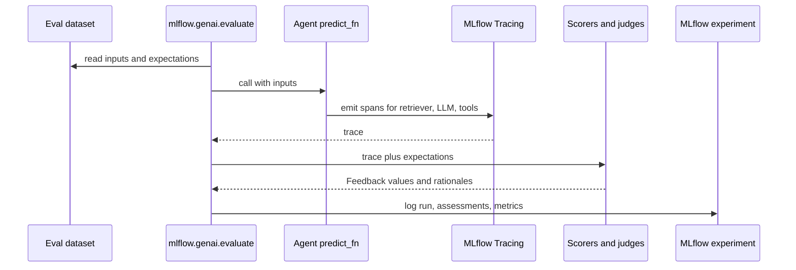
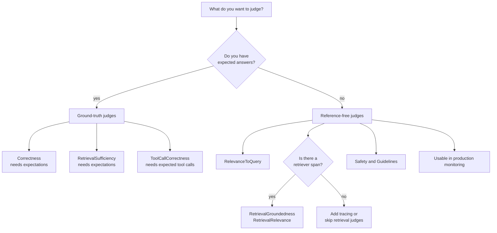
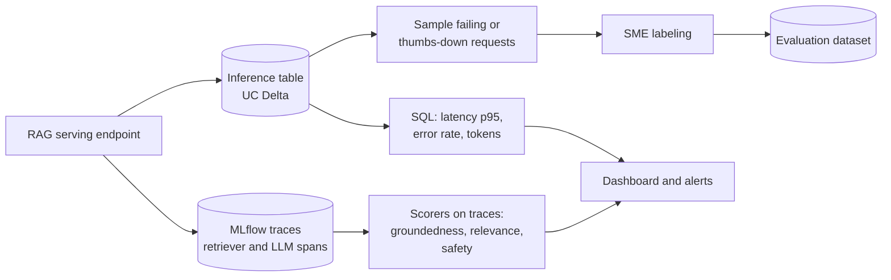
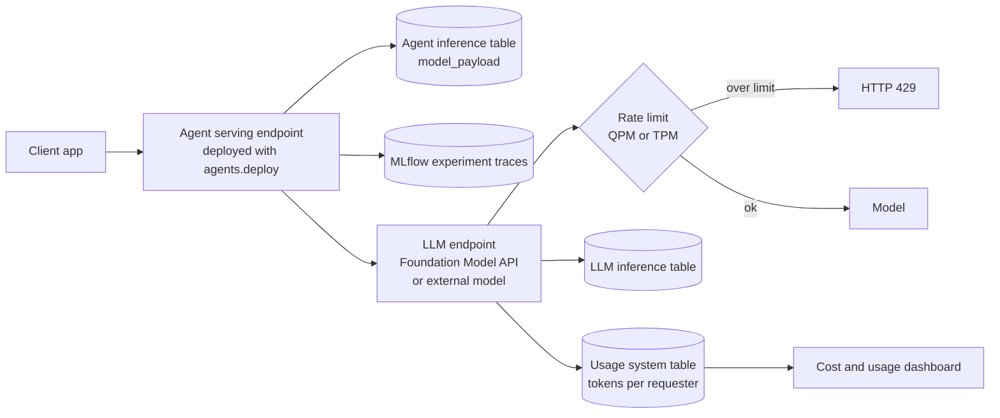
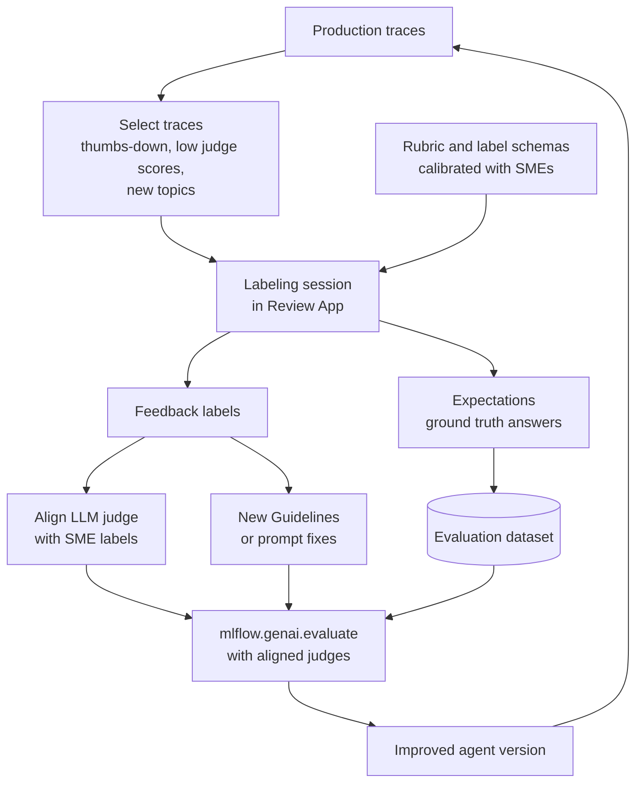

# Domain 6 — Evaluation and Monitoring (12%)

> **Big idea:** you cannot improve what you cannot measure. **Evaluation** measures quality
> *before* release on a dataset you control; **monitoring** measures quality, cost and health
> *after* release on traffic you don't control. On Databricks both run on the same objects:
> **MLflow traces** scored by **scorers**, plus **inference tables** and **usage tables** from
> the gateway.

**Exam weight:** 12% of 45 scored questions, so expect **about 5–6 questions**. This is the
domain where outdated prep material hurts most: the March 2026 guide expects **MLflow 3 GenAI
evaluation** (`mlflow.genai.evaluate()` with scorers), not the legacy
`mlflow.evaluate(model_type="databricks-agent")`.

**Prerequisites:** [Domain 3 — Application development](03-application-development.md)
(comparing the evaluation and monitoring phases), [Domain 4 — Assembling and deploying](04-assembling-and-deploying.md)
(serving endpoints, `ai_query()`), [Domain 5 — Governance](05-governance.md) (guardrails).
Course background: [M12 §2.9 Monitoring: what to watch](../system-design/12-serving-monitoring-experimentation.md#29-monitoring-what-to-watch),
[M12 §2.2 Latency budgets and tail latency](../system-design/12-serving-monitoring-experimentation.md#22-latency-budgets-and-tail-latency),
[Case study 7 — RAG assistant: evaluation](../case-studies/07-rag-assistant.md#7-evaluation) and
[monitoring](../case-studies/07-rag-assistant.md#9-monitoring--iteration).

> **2026 naming note.** Databricks docs now describe **Unity AI Gateway** and mark the
> per-endpoint AI Gateway configuration and its inference tables as **legacy**; a **unified
> trace table** is recommended for new deployments. Production monitoring of agents is
> documented as **"production monitoring"** (Beta), running MLflow scorers on sampled traces.
> The exam guide uses the older words "AI Gateway", "Inference Tables", "Usage Tables" and
> "Agent Monitoring". Learn the concepts; recognise both sets of names.

## Objectives covered

| Objective (verbatim from the exam guide) | Section |
|---|---|
| Select an LLM choice (size and architecture) based on a set of quantitative evaluation metrics | [§1](#1-choosing-an-llm-from-quantitative-metrics) |
| Select key metrics to monitor for a specific LLM deployment scenario | [§2](#2-key-metrics-for-a-deployment-scenario) |
| Evaluate agent performance using MLflow scoring and tracing | [§3](#3-evaluating-agents-with-mlflow-scoring-and-tracing) |
| Identify evaluation judges that require ground truth | [§4](#4-judges-that-require-ground-truth) |
| Use Databricks custom Scorers for evaluating agents and LLMs | [§5](#5-custom-scorers) |
| Use inference logging to assess deployed RAG application performance | [§6](#6-inference-logging-for-a-deployed-rag-application) |
| Use inference tables and Agent Monitoring to track a live LLM endpoint | [§7](#7-inference-tables-and-agent-monitoring-for-a-live-endpoint) |
| Use AI Gateway (Inference Tables, Usage Tables, and rate limiting) to track an LLM or agent deployed via Agent Framework. | [§8](#8-ai-gateway-for-an-agent-deployed-via-agent-framework) |
| Use Databricks features to control LLM costs | [§9](#9-controlling-llm-costs) |
| Incorporate SME feedback to improve agent performance | [§10](#10-incorporating-sme-feedback) |

---

## The loop that ties the domain together



The same **scorer** objects run in both places: in `mlflow.genai.evaluate()` before release
and in production monitoring after release. That reuse is the key design idea of MLflow 3.

---

## 1. Choosing an LLM from quantitative metrics

### 1.1 First principles

Bigger models are usually more accurate, but cost and latency grow with parameter count and
with the number of tokens processed. No model is best on every axis, so you choose from a
**Pareto frontier**: the models where you cannot improve one metric without worsening another.
The requirement in the question tells you which constraint is hard and which is soft.

Procedure:

1. Apply **hard constraints** first (p95 latency ≤ X, cost ≤ Y per 1k requests, context window
   ≥ Z tokens, license allows commercial use). Discard models that fail any.
2. Among survivors, pick the best on the **primary quality metric** for the task (correctness
   or groundedness for RAG, exact match or F1 for extraction, ROUGE for summarisation).
3. If quality ties, prefer the **smaller/cheaper** model.

Architecture also matters:

| Architecture choice | Effect on metrics |
|---|---|
| Dense vs **mixture-of-experts (MoE)** | MoE activates only some experts per token: quality of a large model with inference cost closer to a smaller one, but needs memory for all weights |
| Context window size | Larger window fits more retrieved chunks but raises tokens per request (cost, latency) |
| Instruction-tuned vs base | Instruction-tuned for chat/RAG; base for further fine-tuning |
| General vs task-specific (fine-tuned small model) | A fine-tuned small model can match a large general model on a narrow task at a fraction of the cost |
| Reasoning model | Higher quality on multi-step problems, many more output tokens, higher latency |

### 1.2 Worked example

A support RAG app must answer with **p95 latency ≤ 2.0 s** and **cost ≤ $3 per 1,000
requests**; quality metric is the pass rate of the `Correctness` judge on a 300-question
evaluation set.

| Model (illustrative) | Correctness pass rate | Groundedness | p95 latency | Cost / 1k req |
|---|---|---|---|---|
| A — 8B dense | 78% | 91% | 0.9 s | $0.40 |
| B — 70B dense | 89% | 96% | 2.6 s | $3.80 |
| C — MoE, ~17B active | 88% | 95% | 1.6 s | $1.90 |
| D — 8B fine-tuned on support data | 86% | 94% | 0.9 s | $0.60 |

- B fails both hard constraints (latency and cost), despite the best quality.
- Among A, C, D: C has the best correctness (88%) inside the budget, so **C** is the answer
  when quality is primary.
- If the requirement were "cost is the most important, quality ≥ 85%", **D** wins (cheapest
  model that clears 85%).

> **Exam trap:** "Choose the model with the highest accuracy" is wrong whenever the scenario
> states a latency or cost constraint that the most accurate model violates. Read the
> constraints first.

> **Exam trap:** compare models on the **same evaluation dataset and the same scorers**.
> Numbers from different benchmarks are not comparable.

---

## 2. Key metrics for a deployment scenario

### 2.1 First principles

A metric is worth monitoring if a change in it would make you **act**. Group metrics by the
question they answer:

| Family | Metrics | Source on Databricks |
|---|---|---|
| **Operational** | Request rate, error rate (4xx/5xx, 429 rate-limit hits), p50/p95/p99 latency, time to first token | Inference tables (`status_code`, latency columns), endpoint metrics, usage tables |
| **Cost** | Input/output tokens per request, tokens per day, DBUs, cost per conversation | Usage system tables, `system.billing.usage` |
| **Quality** | Groundedness, relevance to query, retrieval relevance, correctness on sampled traffic, abstention rate | Scorers in production monitoring, judges over inference-table/trace data |
| **Safety** | Safety judge failure rate, guardrail block rate, PII-detection rate | Safety scorer, gateway logs |
| **User outcome** | Thumbs up/down, escalation rate, re-ask rate, task completion | Feedback logged on traces, app analytics |
| **Data freshness (RAG)** | Index sync lag, share of queries with low retrieval scores | Vector Search index status (now documented as Databricks AI Search), retriever spans |

Remember tail latency from [M12 §2.2](../system-design/12-serving-monitoring-experimentation.md#22-latency-budgets-and-tail-latency):
users feel the **p95/p99**, not the mean. For streaming chat, **time to first token** matters
more than total latency.

### 2.2 Decision table: scenario → must-watch metrics

| Deployment scenario | Primary metrics | Why |
|---|---|---|
| Customer-facing chat (streaming) | Time to first token, p95 latency, safety failure rate, thumbs-down rate | User perceives first token; brand risk from unsafe answers |
| Internal RAG over policy documents | Groundedness (hallucination), retrieval relevance, correctness on sampled traces | Wrong policy answers are the main risk |
| Nightly batch summarisation with `ai_query()` | Throughput, total tokens, cost per run, job failures | No user is waiting; latency per request is irrelevant |
| Agent with tool calls | Tool-call error rate, tool-call efficiency, end-to-end latency, steps per request | Failures hide in intermediate steps (visible in traces) |
| Code assistant on pay-per-token | Tokens per request, cost per user, 429 rate | Cost scales with tokens; rate limits protect budget |
| Regulated domain | PII-detection rate, guardrail blocks, audit completeness of logs | Compliance evidence |

### 2.3 Worked example

A bank deploys a streaming chat assistant for customers. Dashboards show average latency
1.2 s, so the team is happy, but complaints rise. The p95 time to first token is 6 s for the
10% of conversations that trigger three retrieval calls. Monitoring the **mean** hid a tail
problem that affects one in ten customers. Metrics to add: **p95 TTFT**, **retrievals per
request**, and **thumbs-down rate by intent**.

> **Exam trap:** for batch workloads, distractors list latency metrics; the right answer is
> throughput and cost. For RAG quality, distractors list BLEU/ROUGE against a reference that
> doesn't exist in production; the right answer is reference-free metrics such as groundedness
> and relevance.

---

## 3. Evaluating agents with MLflow scoring and tracing

### 3.1 First principles

An agent's final answer can be wrong for many reasons: retrieval missed the document, the LLM
ignored it, a tool returned an error, the plan looped. Grading only the final string tells you
*that* it failed, not *where*. **Tracing** records every step as a tree of **spans** (inputs,
outputs, latency, token usage); **scorers** grade the final output *and* intermediate spans.
Together they turn "it's wrong" into "the retriever returned irrelevant chunks for 30% of
questions about refunds".

### 3.2 MLflow 3 building blocks

| Concept | What it is |
|---|---|
| **Trace** | Record of one request: a tree of spans with inputs, outputs, timings, token usage |
| **Span** | One step (LLM call, retriever, tool, chain). Span types include RETRIEVER, LLM, TOOL |
| **Autologging** | One line (e.g. `mlflow.langchain.autolog()`) traces supported frameworks; manual spans via `@mlflow.trace` |
| **Evaluation dataset** | Records with `inputs` and optional `expectations` (ground truth); can be a list, a DataFrame, or a managed MLflow evaluation dataset in UC |
| **Scorer** | Function that turns a trace (or inputs/outputs/expectations) into a `Feedback` (value + rationale) |
| **LLM judge** | A scorer that uses an LLM to grade, e.g. built-in `Correctness`, `Safety`, `Guidelines` |
| **`mlflow.genai.evaluate()`** | Runs `predict_fn` on each record (producing a trace), applies scorers, logs results to an MLflow run |

Built-in single-turn judges (from the Databricks judges page, Oct 2026): `RelevanceToQuery`,
`RetrievalRelevance`, `Safety`, `RetrievalGroundedness`, `Correctness`,
`RetrievalSufficiency`, `Guidelines`, `ExpectationsGuidelines`, `ToolCallCorrectness`,
`ToolCallEfficiency`. There are also multi-turn (session) judges such as
`ConversationCompleteness` and `UserFrustration`.

```python
# Illustrative; check current docs for exact signatures
import mlflow
from mlflow.genai.scorers import Correctness, RelevanceToQuery, RetrievalGroundedness, Safety, Guidelines

eval_data = [
    {"inputs": {"question": "What is the refund window?"},
     "expectations": {"expected_facts": ["Refunds are accepted within 30 days."]}},
]

results = mlflow.genai.evaluate(
    data=eval_data,
    predict_fn=my_agent,          # called with the fields of "inputs"; each call is traced
    scorers=[Correctness(), RelevanceToQuery(), RetrievalGroundedness(), Safety(),
             Guidelines(name="tone", guidelines=["The response must be polite and concise."])],
)
```

Results appear in the MLflow experiment's evaluation run: per-row assessments with rationales,
aggregate pass rates, and a link to each trace so you can open the failing span.

### 3.3 The evaluation sequence



### 3.4 Decision table: what to use for which evaluation question

| Question | Tool |
|---|---|
| Is the final answer factually right vs a known answer? | `Correctness` (needs expectations) |
| Is the answer on-topic for the request? | `RelevanceToQuery` |
| Did the answer stick to the retrieved context (hallucination)? | `RetrievalGroundedness` (reads retrieved context from the trace) |
| Were the retrieved chunks relevant? | `RetrievalRelevance` |
| Did retrieval return enough to answer? | `RetrievalSufficiency` (needs expectations) |
| Is the answer harmful? | `Safety` |
| Does it follow our style/policy rules? | `Guidelines` (global rules) or `ExpectationsGuidelines` (per-row rules) |
| Did the agent call the right tools? | `ToolCallCorrectness` / `ToolCallEfficiency` |
| Business rule expressible in code (length, JSON validity, contains citation) | Custom code-based `@scorer` (§5) |

### 3.5 Worked example

An agent scores 62% on `Correctness`. The engineer filters failing rows and opens their
traces: in 70% of failures the RETRIEVER span returned chunks from an outdated policy table.
`RetrievalRelevance` is low on exactly those rows while `RetrievalGroundedness` is high: the
LLM faithfully summarised the *wrong* documents. Fix: the data source (Domain 2/5), not the
prompt. Without traces, the team would have tuned the prompt and seen no improvement.

> **Exam trap:** `mlflow.evaluate(model_type="databricks-agent")` is the **legacy** Agent
> Evaluation API. For the 2026 exam, the answer is `mlflow.genai.evaluate()` with
> `scorers=[...]`.

> **Exam trap:** retrieval judges need the **retrieved context** in the trace (a retriever
> span). If the app is evaluated from a plain table of question/answer strings with no trace,
> retrieval judges cannot run.

---

## 4. Judges that require ground truth

### 4.1 First principles

Some quality questions can be answered from the request and the response alone: "Is this
answer polite? Is it on-topic? Is it grounded in the context the app retrieved?" Others need
to know the **right answer**: "Is this correct?" A judge cannot know that the refund window is
30 days unless someone tells it. That "someone" is **ground truth**, supplied in the
`expectations` field of each evaluation record (e.g. `expected_facts` or
`expected_response`; verify the accepted keys in current docs).

Consequence: ground-truth judges run **offline on a labelled dataset**; in production monitoring,
where live traffic has no labels, you use the **reference-free** judges.

### 4.2 The table to memorise

| Built-in judge | Requires ground truth? | Asks |
|---|---|---|
| `Correctness` | **Yes** | Is the response correct compared to the expected facts/response? |
| `RetrievalSufficiency` | **Yes** | Does the retrieved context contain everything needed to produce the expected facts? |
| `ToolCallCorrectness` | **Yes** | Were the expected tools called with the right arguments? |
| `ExpectationsGuidelines` | Needs **per-row guidelines** in `expectations` (not an answer key) | Does the response meet this row's rules? |
| `RelevanceToQuery` | No | Does the response address the request? |
| `RetrievalRelevance` | No | Are retrieved chunks relevant to the request? |
| `RetrievalGroundedness` | No | Is the response supported by the retrieved context? |
| `Safety` | No | Is the response free of harmful content? |
| `Guidelines` | No | Does the response meet global natural-language rules? |
| `ToolCallEfficiency` | No | Were tool calls free of redundancy? |

Memory hook: **"correct" and "sufficient" are relative to an answer key**; "relevant",
"grounded", "safe" and "follows guidelines" are relative to what the app already has.

### 4.3 Judge selection tree



### 4.4 Worked example

A team has 500 production traces and **no** labels yet. They want a quality signal today.
They can run `RelevanceToQuery`, `RetrievalGroundedness`, `RetrievalRelevance`, `Safety` and
`Guidelines` immediately. `Correctness` would fail or be skipped because `expectations` is
missing. Next step: send 100 traces to SMEs (§10) to add expectations, then run
`Correctness` on that labelled subset.

> **Exam trap:** `RetrievalGroundedness` does **not** need ground truth. It compares the answer
> to the *retrieved* context, not to a correct answer. A fully grounded answer can still be
> wrong if retrieval fetched the wrong document.

> **Exam trap:** `RetrievalSufficiency` sounds like a retrieval-only check, but it needs
> expected facts: "sufficient" means "sufficient to produce the *known* answer".

---

## 5. Custom scorers

### 5.1 First principles

Built-in judges cover generic quality. Your business has rules they don't know: "every answer
must cite a policy ID", "responses must be valid JSON with a `priority` field", "never quote a
price older than 30 days". Two kinds of custom scorer cover these:

| Kind | Use when | How |
|---|---|---|
| **Code-based scorer** | The rule is deterministic: regex, JSON schema, length, latency from trace, keyword presence | Python function with the `@scorer` decorator (or a `Scorer` subclass for stateful cases) |
| **Custom LLM judge** | The rule needs judgement: "is the tone empathetic?", "does it follow our escalation policy?" | `Guidelines` judge for pass/fail rules in plain language; `make_judge()` for a custom instruction prompt with your own output values |

Prefer **code** when possible: it is free, fast, deterministic, and needs no calibration.

### 5.2 The `@scorer` contract

- Import: `from mlflow.genai.scorers import scorer`.
- Parameters are optional keyword arguments; declare only what you need: `inputs`, `outputs`,
  `expectations`, `trace`.
- Return a `bool`, `int`/`float`, `str` (e.g. "yes"/"no"), a `Feedback` (value + rationale),
  or a list of `Feedback` objects with distinct names.
- A scorer that uses `trace` can inspect spans, e.g. count tool calls or read retriever outputs.

```python
# Illustrative; check current docs for exact signatures
from mlflow.genai.scorers import scorer
from mlflow.entities import Feedback

@scorer
def cites_policy(outputs) -> Feedback:
    ok = "POLICY-" in str(outputs)
    return Feedback(value=ok, rationale="Policy ID cited." if ok else "No policy ID.")
```

```python
# Illustrative; check current docs for exact signatures
from typing import Literal
from mlflow.genai.judges import make_judge

escalation_judge = make_judge(
    name="escalation_policy",
    instructions=("Read the request in {{ inputs }} and the reply in {{ outputs }}. "
                  "Answer 'compliant' if the reply offers a human agent when the user is angry, "
                  "otherwise 'non_compliant'."),
    feedback_value_type=Literal["compliant", "non_compliant"],
)
```

`make_judge()` instructions may only use the template variables `{{ inputs }}`,
`{{ outputs }}`, `{{ expectations }}` and `{{ trace }}`. Both kinds are passed in
`scorers=[...]` to `mlflow.genai.evaluate()`.

### 5.3 Decision table

| Requirement | Best scorer |
|---|---|
| Output must parse as JSON with required keys | Code `@scorer` |
| Agent must not call more than 3 tools | Code `@scorer` using `trace` |
| "Responses must be in English and must not mention competitors" | `Guidelines` judge |
| Domain rubric with 3 categories (e.g. compliant / partial / non-compliant) | `make_judge()` |
| Per-question rules that differ by row | `ExpectationsGuidelines` |
| Generic factual accuracy vs reference | Built-in `Correctness` (no need for custom) |

### 5.4 Using custom scorers in production

Scorers can be **registered** to an experiment and **started** with a sampling rate for
production monitoring (§7). Docs caveats (verify in current docs): code-based `@scorer`
functions are supported in production monitoring when defined and registered from a
Databricks notebook; class-based `Scorer` subclasses are **not** supported for production
monitoring.

> **Exam trap:** don't pick an LLM judge for a rule that a regex can check. The exam rewards
> the cheaper, deterministic option when it meets the requirement.

---

## 6. Inference logging for a deployed RAG application

### 6.1 First principles

Offline evaluation tells you how the app does on questions *you* wrote. Production users ask
different questions. To know how the deployed app performs, you need a **record of every real
request and response**, stored somewhere you can query and score. On Databricks that record is
an **inference table**: a Unity Catalog Delta table that the serving endpoint writes to
automatically. For agents, **MLflow traces** add the step-by-step detail.

### 6.2 What an inference table contains (legacy serving-endpoint schema)

| Column (legacy schema) | Use |
|---|---|
| `databricks_request_id`, `client_request_id` | Join to traces, feedback, app logs |
| `request_time`, `request_date` | Time windows, trends |
| `status_code` | Error rate |
| `execution_duration_ms` | Latency percentiles |
| `request`, `response` | Raw JSON payloads: the question, retrieved context if returned, the answer |
| `served_entity_id` | Which model version served the request (compare versions) |
| `requester` | Who called |
| `sampling_fraction`, `logging_error_codes` | Sampling and logging failures (e.g. payload too large) |

Facts to remember (legacy docs; the newer Unity Gateway table has different column names such as
`event_time` and `latency_ms`):

- Delivery is **best effort**, typically **within one hour** for Foundation Model API, external
  model and agent endpoints.
- Payloads larger than the size limit are logged as `null` with a `logging_error_codes` value
  (1 MiB in the legacy docs).
- For **agents** deployed with `agents.deploy()`, a `{model_name}_payload` table is created;
  the derived request-logs and assessment-logs tables are **deprecated** in favour of MLflow 3
  real-time tracing.

### 6.3 Assessing RAG performance from inference logs



Typical steps:

1. **Operational health**: SQL over the inference table for p95 `execution_duration_ms` and the
   share of non-200 `status_code` by day and by `served_entity_id`.
2. **Quality**: run reference-free scorers (`RetrievalGroundedness`, `RelevanceToQuery`,
   `Safety`) over traces of the logged requests, either in `mlflow.genai.evaluate()` on
   collected traces or via production monitoring.
3. **Coverage gaps**: cluster questions with low retrieval relevance; they show missing documents.
4. **Close the loop**: add representative real requests to the evaluation dataset
   (`mlflow.genai.datasets.create_dataset(...)` then `merge_records(traces)`).

```sql
-- Illustrative; check current docs for exact column names
SELECT served_entity_id,
       percentile(execution_duration_ms, 0.95) AS p95_ms,
       avg(CASE WHEN status_code <> 200 THEN 1 ELSE 0 END) AS error_rate
FROM main.support.rag_bot_payload
WHERE request_date >= current_date() - INTERVAL 7 DAYS
GROUP BY served_entity_id;
```

### 6.4 Worked example

After a new model version, thumbs-down rate rises from 6% to 11%. Grouping the inference
table by `served_entity_id` shows the rise only on the new version. Scoring a sample of its
traces shows `RetrievalGroundedness` fell from 95% to 84% while `RetrievalRelevance` is
unchanged: retrieval is fine, the new LLM is adding unsupported claims. Action: roll traffic
back and investigate the prompt/model, not the index.

> **Exam trap:** inference tables are **not real-time**; don't choose them for an alert that
> must fire within seconds. They are for analysis, auditing, evaluation and dataset building.

> **Exam trap:** the inference table logs payloads; it does not compute quality. Quality comes
> from scorers you run over those logs or traces.

---

## 7. Inference tables and Agent Monitoring for a live endpoint

### 7.1 First principles

Monitoring answers "is the live system still good?" continuously, without a human running
notebooks. It needs: a **data stream** (inference tables / traces), **metrics** (operational
and quality), **sampling** (judging every request with an LLM is expensive), and **dashboards
and alerts**.

### 7.2 Databricks: production monitoring (Agent Monitoring)

Production monitoring (Beta in current docs) runs **MLflow scorers** automatically on a
sample of **traces** logged to an MLflow experiment, and attaches the results as feedback on
each trace. You view them in the experiment's Traces tab and monitoring dashboards (the docs
mention results appear after roughly 15–20 minutes).

```python
# Illustrative; check current docs for exact signatures
from mlflow.genai.scorers import Safety, ScorerSamplingConfig

safety = Safety().register(name="safety")
safety = safety.start(sampling_config=ScorerSamplingConfig(sample_rate=0.2))  # judge 20% of traces
```

Key points:

- `.register()` attaches the scorer to the experiment; `.start()` with `sample_rate` turns on
  continuous scoring. The same scorer objects you used offline are reused.
- Use **reference-free** judges in monitoring (no ground truth on live traffic).
- Choose sampling rates by cost: e.g. 100% for a cheap code scorer, 5–20% for LLM judges on
  high-traffic endpoints, higher for rare but risky intents.
- `agents.deploy()` configures real-time tracing to the MLflow experiment, inference tables,
  the Review App, and production monitoring (per current deploy docs).

### 7.3 Evaluation vs monitoring

| | Offline evaluation | Production monitoring |
|---|---|---|
| Data | Curated evaluation dataset | Live traffic traces / inference tables |
| Ground truth | Often available | Usually not |
| Judges | All, including `Correctness`, `RetrievalSufficiency` | Reference-free judges, code scorers |
| Coverage | Every row | Sampled |
| Purpose | Gate a release, compare versions | Detect drift and regressions, find new failure types |
| API | `mlflow.genai.evaluate()` | Registered scorers with `.start()` |

### 7.4 Worked example

A live HR assistant receives 50,000 requests/day. Registering `Safety` with
`sample_rate=1.0` would mean 50,000 LLM-judge calls a day. Instead: a code scorer for
"response contains a policy citation" at 100% (free), `Safety` at 10%, `RetrievalGroundedness`
at 5% (2,500 judged traces/day is plenty to detect a 3-point drop). Thumbs-down traces are
pulled for SME review.

> **Exam trap:** "Run `Correctness` on all production traffic" is a distractor: production
> requests have no expected facts.

---

## 8. AI Gateway for an agent deployed via Agent Framework

### 8.1 First principles

An agent deployed with Agent Framework is a **serving endpoint**, and its LLM calls usually go
to other endpoints (Foundation Model APIs or external models). Tracking it means answering
three questions, each with its own gateway feature:

| Question | AI Gateway feature | Where the data lands |
|---|---|---|
| What exactly was asked and answered? | **Inference tables** (payload logging) | UC Delta table you name |
| Who used how much, and at what cost? | **Usage tracking** | System tables: legacy `system.serving.endpoint_usage` (+ `system.serving.served_entities`); Unity Gateway `system.ai_gateway.usage` |
| How do we stop overuse? | **Rate limits** | Enforced at the endpoint (requests over the limit get 429) |

### 8.2 Data flow



### 8.3 What the docs say (verify in current docs; these pages changed during 2026)

- `agents.deploy()` enables **AI Gateway inference tables** automatically ("All agents use AI
  Gateway inference tables for logging") plus real-time tracing to the MLflow experiment.
- In the legacy feature matrix, **Databricks agent** endpoints support **payload logging**, but
  **not** usage tracking or AI guardrails; external model, pay-per-token and provisioned
  throughput endpoints support all three.
- Rate limits are set as **QPM** (queries per minute) or **TPM** (tokens per minute) at the
  **endpoint**, **user** (default per user), **specific user or service principal**, or **user
  group** level; the stricter of QPM/TPM wins. The docs state TPM limits **cannot** be applied
  to endpoints serving custom models or agents, so agent endpoints use QPM.
- `system.serving.endpoint_usage` records per-request input/output token counts, `requester`,
  `status_code`, and a `usage_context` map for end-user attribution; join to
  `system.serving.served_entities` on `served_entity_id`. Only account admins can query them
  by default.
- The newer `system.ai_gateway.usage` table adds latency, time to first byte, request tags (via
  a request header) and session metadata for grouping by agent or session.

**Practical design for an agent:** log the agent endpoint with inference tables and traces;
put **usage tracking and TPM rate limits on the LLM endpoint(s) the agent calls**; put QPM
limits on the agent endpoint itself if needed.

### 8.4 Worked example

A Finance agent deployed with `agents.deploy()` calls a pay-per-token Llama endpoint. One team's
batch script floods the agent and spikes spend. Steps:

1. Query the usage system table grouped by `requester` for the LLM endpoint: the team's service
   principal accounts for 70% of tokens.
2. Add a **TPM rate limit for that service principal** on the LLM endpoint, and a **QPM** limit
   per user on the agent endpoint.
3. Use the agent's inference table and traces to confirm normal users' latency recovered.
4. Move the batch workload to `ai_query()` (cost control, §9).

> **Exam trap:** inference tables answer "what was said"; usage tables answer "how much and
> by whom". If the question is about token consumption per user or cost attribution, choose
> usage tracking/system tables, not inference tables.

> **Exam trap:** rate limits cap usage; they do not log anything. A question asking how to
> *track* spend needs usage tables, and one asking how to *cap* it needs rate limits.

---

## 9. Controlling LLM costs

### 9.1 First principles

LLM cost ≈ (requests) × (tokens per request) × (price per token), or for reserved capacity,
(capacity) × (hours). Every lever reduces one factor:

| Factor | Levers |
|---|---|
| Price per token | **Smaller model**, fine-tuned small model, MoE, open model on Databricks instead of a premium external model |
| Tokens per request | Shorter prompts, fewer/shorter retrieved chunks, re-ranking then keeping top-k small, output length limits (`max_tokens`), summarised conversation memory |
| Requests | Caching repeated answers, deduplicating, rate limits, routing easy requests to a small model |
| Capacity hours | **Scale to zero** for low/irregular traffic on endpoints that support it; right-size provisioned throughput |
| Workload type | **Batch** with `ai_query()` instead of looping over a real-time endpoint |

### 9.2 Databricks features

| Feature | Use for |
|---|---|
| **Foundation Model APIs pay-per-token** | Low or unpredictable traffic, prototyping: pay only for tokens |
| **Provisioned throughput** | Steady high traffic or guaranteed performance; cheaper per token at high utilisation, wasteful when idle |
| **Scale to zero** | Dev/test or sporadic endpoints; trade-off is cold-start latency |
| **`ai_query()` batch inference** | Large offline jobs (classify a table, summarise documents) without a real-time endpoint loop |
| **AI Gateway rate limits** | Hard caps per user, group, or endpoint |
| **Usage tracking / system tables** (`system.serving.endpoint_usage`, `system.ai_gateway.usage`, `system.billing.usage`) | See and attribute spend; custom tags on endpoints flow into `system.billing.usage` |
| **Serverless budget/usage policies** | Tag serverless usage (including serving endpoints) for cost attribution (Public Preview; AWS docs call them "usage policies") |
| **Budgets** (account console) | Alert when spend by workspace/tag crosses a threshold |
| **Smaller models and evaluation** | Use §1: prove the smaller model meets the quality bar, then switch |

### 9.3 Worked example: pay-per-token vs provisioned throughput

An endpoint processes 40 million tokens/day, evenly across 24 hours. Suppose (illustrative
prices) pay-per-token costs $1.00 per million tokens → **$40/day**. A provisioned throughput
unit sized for that load costs $3/hour → **$72/day**. Pay-per-token is cheaper. If traffic grows
to 150 million tokens/day, pay-per-token costs **$150/day** while the same reserved capacity
(if it can handle the load) still costs $72/day: provisioned throughput wins. The break-even is
where utilisation is high and steady. If the traffic only happens 9:00–17:00, reserved capacity
sits idle two-thirds of the day, which pushes the answer back toward pay-per-token (or a
scale-to-zero configuration).

### 9.4 Decision table

| Scenario | Best cost control |
|---|---|
| Summarise 5 million rows nightly | `ai_query()` batch inference |
| Dev endpoint used a few times a day | Scale to zero (accept cold start) or pay-per-token |
| Steady, high-volume production traffic with latency SLA | Provisioned throughput |
| One team overusing a shared endpoint | Per-group or per-principal rate limits + usage tables |
| Prompts include 20 retrieved chunks, quality same with 5 | Reduce top-k / add re-ranking |
| Same FAQ asked thousands of times | Cache answers |
| Finance wants spend by team | Endpoint tags / usage policies, `system.billing.usage`, budgets |

> **Exam trap:** "Switch to a larger model to reduce the number of retries" is not a cost
> control. The cost answers reduce tokens, model price, requests, or idle capacity.

> **Exam trap:** provisioned throughput is not automatically cheaper. It is cheaper only at high,
> steady utilisation.

---

## 10. Incorporating SME feedback

### 10.1 First principles

LLM judges are fast but are only as good as their instructions; developers are fast but are
not domain experts. **Subject-matter experts (SMEs)** know what a correct, complete, compliant
answer looks like. Their time is scarce, so the system must (a) show them the right traces,
(b) ask structured questions, (c) turn their answers into reusable assets: ground truth,
guidelines, and better-aligned judges.

Raw SME ratings are noisy: different experts interpret "complete" differently. The fix is a
**clear rubric**, **calibration** (experts rate the same examples and discuss disagreements
until they agree on the criteria), and then using the calibrated labels consistently. This is
the same human-calibration procedure as in
[Case study 7 §7](../case-studies/07-rag-assistant.md#7-evaluation).

### 10.2 Databricks / MLflow features

| Feature | What it does |
|---|---|
| **Review App** | Web UI where SMEs chat with the agent or review traces and give feedback; no Databricks workspace skills needed |
| **Labeling sessions** (`mlflow.genai.labeling.create_labeling_session`) | Queue of traces assigned to reviewers, with a Review App URL |
| **Label schemas** (`mlflow.genai.label_schemas.create_label_schema`) | Structured questions, type `"feedback"` (rating) or `"expectation"` (ground truth), e.g. categorical or text inputs |
| **Review queues** (Beta) | Newer recommended human-review workflow (verify in current docs) |
| **Expectations on traces** | SMEs add the correct answer; traces with expectations can be added to an evaluation dataset |
| **Evaluation datasets** (`mlflow.genai.datasets.create_dataset`, `merge_records`) | Versioned UC-backed datasets that grow from labelled traces |
| **Judge alignment** (`judge.align(...)`, MLflow ≥ 3.4) | Tunes an LLM judge's instructions to agree with SME assessments; the human assessment name must match the judge name; default optimizer in current Databricks docs is MemAlign (verify) |

```python
# Illustrative; check current docs for exact signatures
from mlflow.genai.label_schemas import create_label_schema, InputCategorical
from mlflow.genai.labeling import create_labeling_session

accuracy = create_label_schema(name="factual_accuracy", type="feedback",
                               title="Is every fact in the answer correct?",
                               input=InputCategorical(options=["Yes", "Partly", "No"]))
session = create_labeling_session(name="weekly_review", label_schemas=[accuracy.name])
session.add_traces(thumbs_down_traces)
print(session.url)   # share with SMEs
```

### 10.3 The SME feedback loop



### 10.4 Decision table

| Symptom | Action |
|---|---|
| SME ratings disagree for the same responses | Write a clear rubric; calibrate SMEs on shared examples; use structured label schemas |
| LLM judge disagrees with SMEs | Align the judge with SME feedback (`align()`), or rewrite its guidelines; re-check agreement |
| No ground truth for `Correctness` | SMEs add expectations to traces; build an evaluation dataset from them |
| Same failure pattern keeps recurring | Turn the SME explanation into a `Guidelines` rule or a code scorer and add it to evaluation |
| SMEs can't use notebooks | Share the Review App / labeling session URL |

### 10.5 Worked example

A legal-ops agent: SMEs flag that answers omit the jurisdiction. The engineer (1) adds a label
schema "Mentions the jurisdiction? Yes/No" and runs a labeling session on 80 recent traces;
(2) adds a `Guidelines` judge "The response must state the jurisdiction the answer applies
to"; (3) compares the judge's verdicts with the SME labels, finds 70% agreement, and aligns the
judge with the SME labels until agreement is acceptable; (4) adds the 80 traces with SME
expectations to the evaluation dataset; (5) changes the prompt and re-runs
`mlflow.genai.evaluate()`. The pass rate on the new judge rises from 55% to 92% with no drop in
`Correctness`.

> **Exam trap:** "Replace the SMEs with an LLM judge" and "average the disagreeing scores" are
> distractors. The fix for noisy humans is a rubric and calibration; the fix for an
> untrustworthy judge is to align it with calibrated humans.

> **Exam trap:** don't throw away disputed examples to make agreement look higher. Disputed
> cases are usually the most informative; resolve them by clarifying the rubric.

---

## Quick review

1. Choose a model by applying **hard constraints** (latency, cost, context, license) first, then
   the best quality metric on the **same** evaluation set; ties go to the smaller model.
2. Monitor **p95/p99** latency and time to first token for interactive apps; throughput and
   cost for batch; groundedness and relevance for RAG; safety and PII for regulated apps.
3. The 2026 evaluation API is `mlflow.genai.evaluate(data=..., predict_fn=..., scorers=[...])`;
   `mlflow.evaluate(model_type="databricks-agent")` is legacy.
4. **Ground truth required:** `Correctness`, `RetrievalSufficiency`, `ToolCallCorrectness`.
   Not required: `RelevanceToQuery`, `RetrievalRelevance`, `RetrievalGroundedness`, `Safety`,
   `Guidelines`, `ToolCallEfficiency`.
5. Retrieval judges read the retrieved context from the **trace** (retriever span).
6. Custom scorers: `@scorer` functions taking `inputs`, `outputs`, `expectations`, `trace` and
   returning bool/number/str/`Feedback`; custom LLM judges via `Guidelines` or `make_judge()`.
7. Inference tables are UC Delta tables of requests and responses, delivered best-effort
   (typically within an hour), useful for analysis, not real-time alerts.
8. Production monitoring = registered scorers `.start()`ed with a `sample_rate` on live traces;
   use reference-free judges.
9. Inference tables = what was said; usage system tables = how much and by whom; rate limits
   (QPM/TPM; agents QPM only) = caps.
10. Cost levers: smaller model, fewer tokens, caching, `ai_query()` batch, pay-per-token vs
    provisioned throughput by utilisation, scale to zero, rate limits, usage tags and budgets.
    SME feedback: rubric + calibration → labeling sessions → expectations and aligned judges.

## Official docs

- Built-in LLM judges (ground-truth table): https://docs.databricks.com/aws/en/mlflow3/genai/eval-monitor/concepts/judges/
- Correctness judge: https://docs.databricks.com/aws/en/mlflow3/genai/eval-monitor/concepts/judges/is_correct
- Guidelines judge: https://docs.databricks.com/aws/en/mlflow3/genai/eval-monitor/concepts/judges/guidelines
- Predefined scorers (MLflow): https://mlflow.org/docs/latest/genai/eval-monitor/scorers/llm-judge/predefined/
- Evaluate an app with `mlflow.genai.evaluate()`: https://docs.databricks.com/aws/en/mlflow3/genai/eval-monitor/evaluate-app
- Code-based custom scorers: https://docs.databricks.com/aws/en/mlflow3/genai/eval-monitor/custom-scorers and https://mlflow.org/docs/latest/genai/eval-monitor/scorers/custom/
- Custom LLM judges (`make_judge`): https://docs.databricks.com/aws/en/mlflow3/genai/eval-monitor/custom-judge/
- Align judges with human feedback: https://docs.databricks.com/aws/en/mlflow3/genai/eval-monitor/align-judges
- Production monitoring: https://docs.databricks.com/aws/en/mlflow3/genai/eval-monitor/production-monitoring
- MLflow Tracing: https://docs.databricks.com/aws/en/mlflow3/genai/tracing/
- Human feedback and Review App: https://docs.databricks.com/aws/en/mlflow3/genai/human-feedback/
- Labeling existing traces: https://docs.databricks.com/aws/en/mlflow3/genai/human-feedback/expert-feedback/label-existing-traces
- Deploy an agent (`agents.deploy()`): https://docs.databricks.com/aws/en/generative-ai/agent-framework/deploy-agent
- AI Gateway for serving endpoints (legacy feature matrix): https://docs.databricks.com/aws/en/ai-gateway/overview-serving-endpoints
- Configure AI Gateway on endpoints (rate limits, fallbacks): https://docs.databricks.com/aws/en/ai-gateway/configure-ai-gateway-endpoints
- Inference tables for serving endpoints (legacy schema): https://docs.databricks.com/aws/en/ai-gateway/inference-tables-serving-endpoints
- Inference tables (Unity Gateway): https://docs.databricks.com/aws/en/ai-gateway/inference-tables
- Usage tracking (`system.ai_gateway.usage`): https://docs.databricks.com/aws/en/ai-gateway/usage-tracking
- Serverless usage/budget policies: https://docs.databricks.com/aws/en/admin/usage/budget-policies
- Monitor model serving costs: https://docs.databricks.com/aws/en/admin/system-tables/model-serving-cost
