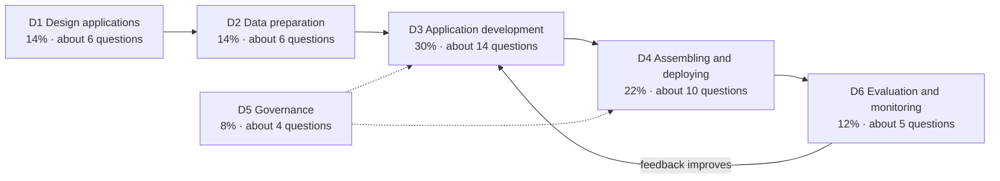

# Databricks Generative AI Engineer Associate — exam prep

> **Big idea:** the exam tests whether you can *build and run* a production RAG or agent
> application on Databricks. Learn each service by the problem it solves, and most questions
> become "which tool fits this constraint?"

This track prepares you for the **Databricks Certified Generative AI Engineer Associate**
exam. It is aligned to the **exam guide live since March 18, 2026**. Databricks updates the
guide, so check the [official exam page](https://www.databricks.com/learn/certification/genai-engineer-associate)
two weeks before your exam, as the guide itself recommends.

## The exam at a glance

| | |
|---|---|
| Questions | 45 scored, multiple choice or multiple selection ("Which TWO…"). Unscored questions may be added, with extra time to match. |
| Time | 90 minutes, which is two minutes per question |
| Delivery | Online proctored, no test aids |
| Cost | $200 |
| Validity | 2 years, then you retake the current exam |
| Passing score | Not published. Aim for at least 80% on our mock exams. |

## What is tested, and where to study it



The domains follow the life cycle of one application: **design** it, **prepare** the
knowledge it retrieves, **develop** the chain or agent, **deploy** it, **govern** it, and
**evaluate and monitor** it. Domains 3 and 4 together are **52% of the exam**.

| # | Domain | Weight | Study page | Questions |
|---|---|---|---|---|
| 1 | Design Applications | 14% | [01-design-applications.md](01-design-applications.md) | [Practice](practice-questions.md#domain-1) |
| 2 | Data Preparation | 14% | [02-data-preparation.md](02-data-preparation.md) | [Practice](practice-questions.md#domain-2) |
| 3 | Application Development | 30% | [03-application-development.md](03-application-development.md) | [Practice](practice-questions.md#domain-3) |
| 4 | Assembling and Deploying Applications | 22% | [04-assembling-and-deploying.md](04-assembling-and-deploying.md) | [Practice](practice-questions.md#domain-4) |
| 5 | Governance | 8% | [05-governance.md](05-governance.md) | [Practice](practice-questions.md#domain-5) |
| 6 | Evaluation and Monitoring | 12% | [06-evaluation-and-monitoring.md](06-evaluation-and-monitoring.md) | [Practice](practice-questions.md#domain-6) |

Also in this track:
- [**Cheat sheet**](cheat-sheet.md): every service and API on one page, plus "if the question says X, think Y" patterns.
- [**Practice questions**](practice-questions.md): the full question bank, with explanations, for reading.
- [**Practice exam**](https://maiphong0411.github.io/machine-learning-worldclass/genai-databricks/practice-exam/)
  (on the course website): timed 45-question mock exams, per-domain scores, and a mistakes deck.

## What changed in the March 2026 guide

A lot of free prep material online was written for the older guide. These objectives are new
or much more prominent, so expect questions on them that older material doesn't cover:

| New or expanded in 2026 | Domain |
|---|---|
| **Agent Bricks**: Knowledge Assistant, Multi-Agent Supervisor, Information Extraction | 1 |
| Re-ranking and advanced chunking strategies, and tools for evaluating retrieval | 2 |
| **MLflow + Agent Framework** for agentic systems; **Genie Spaces** in multi-agent systems | 3 |
| **MCP servers** (managed, external, custom) | 4 |
| **Prompt version control** (MLflow Prompt Registry, aliases) and CI/CD for agents | 4 |
| **Databricks Apps**, Slack and Teams front ends; agent memory stores | 4 |
| Storage-optimized vs standard Vector Search; `ai_query()` for batch inference | 4 |
| **MLflow 3 GenAI evaluation**: `mlflow.genai.evaluate()`, custom scorers, judges that need ground truth | 6 |
| **AI Gateway** inference tables, usage tables and rate limits; agent monitoring; SME feedback | 6 |

> **Exam trap:** if a study source teaches `mlflow.evaluate(model_type="databricks-agent")` as
> *the* way to evaluate agents, it predates the current guide. The current guide expects MLflow 3
> GenAI evaluation (`mlflow.genai.evaluate()` with scorers). See
> [Domain 6](06-evaluation-and-monitoring.md).

## Study plan

**Before you start:** do one full mock exam *cold*. Your per-domain scores tell you where your
time goes. Studying what you already know feels productive but doesn't raise your score.

| Week | Days 1–3 | Days 4–5 | Weekend |
|---|---|---|---|
| 1 | D1 + D2 pages | Domain drills D1 and D2, then reread every explanation you missed | Hands-on: chunk a PDF into a Delta table and build a Vector Search index |
| 2 | D3 page (30%, so take your time) | Domain drill D3, twice | Hands-on: build a RAG chain or agent with tracing |
| 3 | D4 page | Domain drill D4 | Hands-on: log, register, deploy and query the agent; try `ai_query()` |
| 4 | D5 + D6 pages | Domain drills D5 and D6 | Mock exam #2; review mistakes; reread the cheat sheet |

If you have only **one week**, read the cheat sheet, then work by weight: D3, D4, D6, D1, D2,
D5. Do a domain drill after each page, and finish with two mock exams.

**Hands-on matters.** The guide recommends six months of hands-on experience, and many questions
are scenarios that are easy if you've *done* the task. The free
[Databricks Free Edition](https://www.databricks.com/learn/free-edition) is enough to try
most of the workflows in this track.

## How to approach the questions

Most questions follow the same pattern: a scenario, one or two constraints, and four options
that would all "work". Only one meets the constraint.

1. **Underline the constraint** first: lowest latency, least code, minimal maintenance, cost
   over quality, must respect user permissions, needs version history.
   It decides the answer.
2. **Eliminate options that break a Databricks principle.** Tokens in the browser, public endpoints,
   overwriting production, no version history, and fine-tuning to inject facts that change daily
   are almost never right.
3. **Prefer the managed, purpose-built Databricks feature** when the question says "minimize
   maintenance" or "least effort". Choose a custom build only when a requirement rules out the
   managed one.
4. **Multiple-selection questions are all-or-nothing.** Check each option on its own: does
   this action, by itself, help meet the goal?
5. **Budget two minutes per question.** Flag anything slow and come back to it.

## Recommended official preparation

The exam guide recommends Databricks Academy's **Generative AI Engineering with Databricks**,
which has four self-paced courses:
- Building Retrieval Agents on Databricks
- Building Single-Agent Applications on Databricks
- Generative AI Application Evaluation and Governance
- Generative AI Application Deployment and Monitoring

Use this track alongside them. The modules explain *why* each tool exists, and the questions
test whether you can choose between tools under constraints.

## Using the AI study partner for this exam

In Claude Code, the course's study commands work on this track too:

```text
/tutor Vector Search Delta Sync vs Direct Vector Access index
/quiz-me genai-databricks/04      # new questions on Domain 4
/explain-back judges that require ground truth
```

The [practice exam](https://maiphong0411.github.io/machine-learning-worldclass/genai-databricks/practice-exam/)
should be your closed-book check. Use the assistant to understand your mistakes afterwards.
