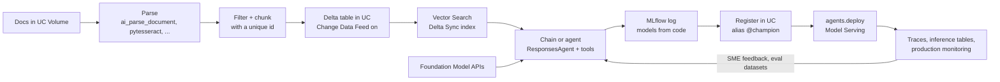

# Cheat sheet — Databricks Generative AI Engineer Associate

> One page to reread the day before the exam. Each line is explained, with sources, in the
> domain pages. Aligned to the exam guide live since March 18, 2026.

**Product names have moved since the guide was written.** The exam uses the guide's names, and
so does this sheet. In current docs you'll also see:

| Exam guide says | Current docs also say |
|---|---|
| Vector Search | Databricks AI Search (`AISearchClient`) |
| Multiagent Supervisor | Supervisor Agent |
| AI Gateway (per-endpoint guardrails, inference tables) | Unity AI Gateway; per-endpoint features marked legacy |

## The life cycle on one diagram

## Domain 1 — Design (14%)

| If the question says… | Think… |
|---|---|
| "a specific JSON format" | System prompt + schema + few-shot, or `response_format` (json_schema). Then parse and validate. |
| "one sentence that captures the intent" | **Summarization** task |
| "label each ticket" | **Classification**. "Pull fields out of documents" means **extraction**. |
| "answer from our documents with citations, minimal effort" | **Agent Bricks Knowledge Assistant** |
| "route across several agents/tools" | **Multi-Agent Supervisor** (Supervisor Agent) |
| "documents → structured fields in a table, in batch" | **Agent Bricks Information Extraction** |
| "same steps every time, auditable, lowest latency" | **Deterministic chain**, not an agent |
| "per-customer fact (order date, balance)" | **Lookup keyed by ID** (table or tool), never fine-tuning |

Tool order for multi-step reasoning: **identify → gather knowledge → compute → act last**. The
model *proposes* tool calls, and your code executes them.

## Domain 2 — Data preparation (14%)

- **Fewer records:** use bigger chunks or less overlap. Embedding dimension doesn't change the record count.
- **Chunk plus overlap must be ≤ the embedding model's max input**, or the tail is silently cut off.
- **Parsers by input:**

  | Input | Parser |
  |---|---|
  | Images or scans | `pytesseract` (OCR) |
  | HTML | BeautifulSoup |
  | DOCX | `python-docx` |
  | PDF tables | `pdfplumber` |
  | SQL-native | `ai_parse_document` |

- **Clean after parsing, before chunking:** remove headers, footers, navigation, duplicates and OCR noise.
- **Order of operations:** Volume → parse → filter → chunk with id → Delta table → **enable CDF** → Delta Sync index → sync.
- **Retrieval metrics:**
  - precision@k = relevant ∩ retrieved / k
  - recall@k = relevant ∩ retrieved / all relevant
  - MRR = mean of 1 / rank of the first hit
  - NDCG rewards ranking relevant items higher
- **Hybrid search** (keyword + vector) fixes exact-term misses. **Re-ranking** reorders the top-K but can't recover documents that retrieval missed.

## Domain 3 — Application development (30%)

| Need | Choose |
|---|---|
| Short fixed flow | Plain Python or a simple LangChain chain |
| Cycles, state, human-in-the-loop, multi-agent | **LangGraph** |
| Optimize prompts against a metric | **DSPy** |
| Databricks models, embeddings and retrievers in LangChain | `databricks-langchain` (`ChatDatabricks`, `VectorSearchRetrieverTool`, `UCFunctionToolkit`, `GenieAgent`) |
| Agent interface | **`ResponsesAgent`** (`ChatAgent` is legacy), logged as **models from code** |
| Debugging | **MLflow Tracing**: check the retriever span first when answers are ungrounded |
| Structured data inside a multi-agent system | **Genie Space** / Genie Conversation API as a subagent |
| Prototype or spiky traffic | FM API **pay-per-token** |
| Steady production, fine-tuned weights, guarantees | **Provisioned throughput** |
| Embedding model, cost first | **Smallest model whose max input ≥ your longest chunk** |
| Pick a model from a hub | Model card: task, license, languages, context length, base vs instruct; `system.ai` in UC |

- **Guardrail layers:** input filter → system-prompt rules → least-privilege tools → output filter → refusal.
- **Temperature controls variability, not truth.**
- **Evaluation vs monitoring:**
  - **Evaluation:** a curated dataset scored with `mlflow.genai.evaluate()`. Ground-truth judges are allowed.
  - **Monitoring:** the same scorers run on sampled production traces, which have no ground truth.

## Domain 4 — Assembling and deploying (22%)

**Vector Search endpoints:**

| | Standard endpoint | Storage-optimized endpoint |
|---|---|---|
| Scale | ~320M vectors (768-d) | 1B+ vectors |
| Latency and QPS | Lowest latency, high QPS | ~250 ms slower, not for high QPS |
| Sync modes | Triggered or continuous | **Triggered only** |
| Choose when | Latency matters most | Cost at very large scale matters most |

**Vector Search index types:**
- **Delta Sync, managed embeddings:** Databricks computes the embeddings. Needs CDF.
- **Delta Sync, self-managed embeddings:** you supply the vectors.
- **Direct Vector Access:** you upsert through the API, with no source table.

**Logging and serving:**
- **pyfunc:** `load_context` runs once (clients, artifacts), and `predict` runs on every request (pre-process → LLM → post-process).
- **What a RAG model needs at log time:**
  - flavor
  - the **same** embedding model as the index
  - the retriever
  - `pip_requirements`
  - `input_example`
  - signature
  - `resources`
- **Unity Catalog registry:**
  - `catalog.schema.model` names, registry URI `databricks-uc`
  - a signature is required
  - **aliases** (`@champion`) replace stages
- **Serving:** `agents.deploy` creates the endpoint and turns on tracing, the Review App and inference tables.
- **Endpoint auth**, from most to least preferred:
  1. **Automatic passthrough** (`resources=`)
  2. **On-behalf-of-user** for per-user permissions
  3. **Manual** service principal with `{{secrets/scope/key}}` for external APIs
- **Endpoint ACLs:** CAN VIEW / CAN QUERY / CAN MANAGE.

**Batch, memory, prompts and CI/CD:**
- **Batch over a table:** `ai_query()` in SQL, with `failOnError => false` to keep bad rows. Chat UX → a real-time endpoint.
- **Agent memory:** **Lakebase** (Postgres) checkpointer keyed by `thread_id`, never in-process memory.
- **Prompt lifecycle:** `mlflow.genai.register_prompt` → immutable versions → `set_prompt_alias` → `load_prompt("prompts:/name@prod")`. Promote by moving the alias, and roll back by moving it back.
- **CI/CD:** bundles per environment → test components → eval gate → promote the alias. If the embedding model changes, **build a new index**.

**MCP servers:**

| Type | What it is | Maintenance |
|---|---|---|
| **Managed** | Databricks assets (Vector Search, Genie, UC functions) | Least |
| **External** | Third-party server reached through a UC connection; key in Secrets | Some |
| **Custom** | Your own server on Databricks Apps | Most |

**User interfaces:** **Databricks Apps** call the endpoint from the backend. App auth uses the
service principal, and user auth uses `x-forwarded-access-token`. Never put tokens in the browser.

## Domain 5 — Governance (8%)

- **Mask, don't block, when a success-rate or user-experience target is set.** Masking keeps the request working.
- **Unity Catalog:** **column masks** are SQL UDFs on a column, and **row filters** are boolean UDFs.
- **AI Gateway guardrails (legacy):**
  - PII: **Block** or **Mask**
  - Safety filter: **Llama Guard**
  - Not on agent or custom endpoints, so guard the **LLM endpoint the agent calls**.
- **Prompt instructions are the weakest guardrail.** Indirect injection arrives through retrieved data, so fix it at the source and keep tools least-privilege.
- **"Publicly available" is not a license.** Check the data license and the model license separately, and record provenance with UC lineage and tags.
- **Problematic source text:** fix it **upstream** (replace, filter, clean), and let the Delta Sync index pick up the change.

## Domain 6 — Evaluation and monitoring (12%)

| Judge | Needs ground truth? |
|---|---|
| `Correctness`, `RetrievalSufficiency`, `ToolCallCorrectness` | **Yes** |
| `RelevanceToQuery`, `RetrievalRelevance`, `RetrievalGroundedness`, `Safety`, `Guidelines`, `ToolCallEfficiency` | No |
| `ExpectationsGuidelines` | Needs per-row guidelines in `expectations`, but not an answer key |

**Evaluation:**
- **API:** `mlflow.genai.evaluate(data=..., predict_fn=..., scorers=[...])`. `mlflow.evaluate(model_type="databricks-agent")` is **legacy**.
- **Custom scorers:** `@scorer` functions over `inputs`/`outputs`/`expectations`/`trace`. Custom LLM judges use `Guidelines` or `make_judge()`.
- **SME feedback:** rubric + calibration → labeling sessions / Review App → expectations and aligned judges.

**Monitoring and cost:**
- **Production monitoring:** registered scorers, `.start()`ed with a `sample_rate`, using only reference-free judges.
- **What each AI Gateway feature tells you:**
  - **Inference tables:** *what was said*. UC Delta tables, best-effort delivery, for analysis rather than real-time alerts.
  - **Usage tables:** *how much, and by whom*.
  - **Rate limits:** caps in QPM/TPM; agent endpoints get QPM only.
- **Metrics to watch:**
  - p95/p99 latency and time to first token for interactive apps
  - throughput and cost for batch
  - groundedness and relevance for RAG
  - safety and PII for regulated apps
- **Cost levers:**
  - a smaller model and fewer tokens
  - caching
  - batch `ai_query()`
  - choosing pay-per-token vs provisioned by how busy the endpoint is
  - scale to zero
  - rate limits and budgets

## Answer-elimination rules

These are almost always wrong:
- tokens or API keys in browser code, or public endpoints
- overwriting production prompts or tables, or anything with no version history
- fine-tuning to inject facts that change often
- treating LLM-judge scores as the source of truth instead of calibrating with SMEs
- `Correctness` (or any ground-truth judge) on unlabelled production traffic
- re-ranking as a fix for documents the retriever never returned
- a custom build when a managed feature meets the requirement and the question says "minimize maintenance"
