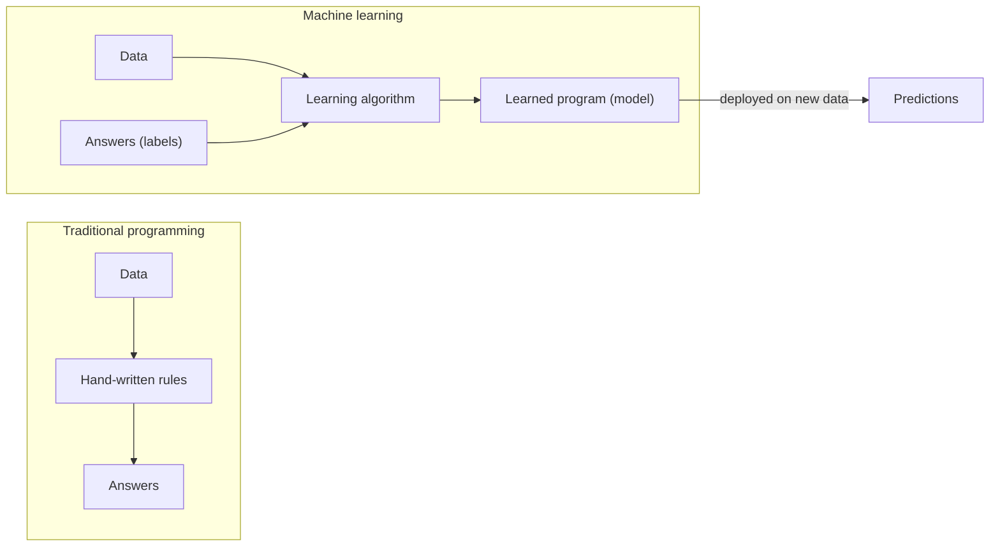
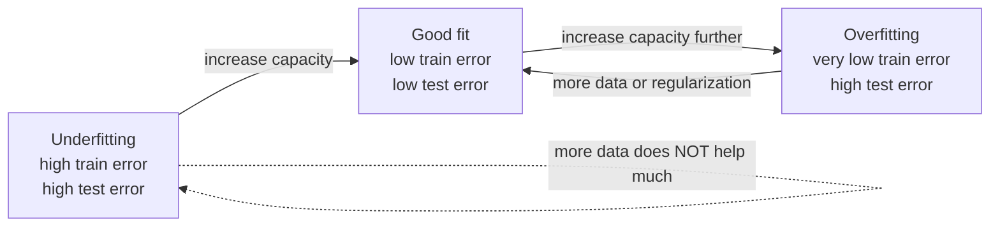
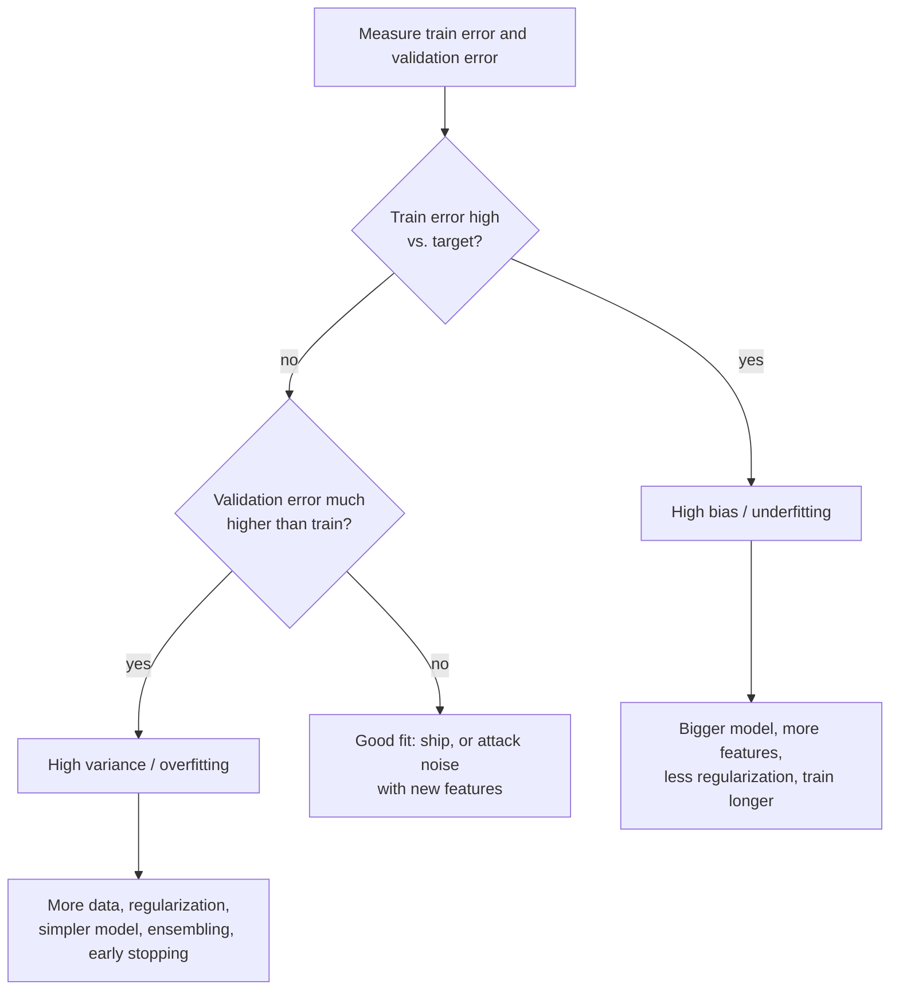
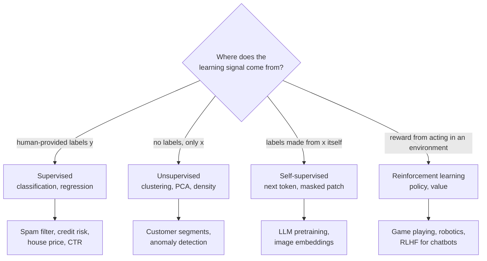
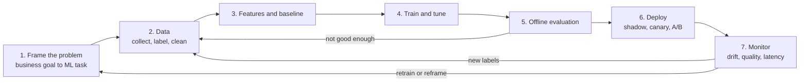
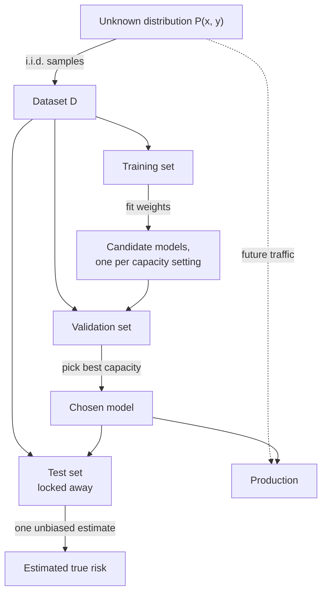

# M01 — What is learning?

> **One-sentence big idea.** Machine learning is choosing a function from a limited family so that it does well on *future* samples from the same distribution as the data you saw — and every hard problem in ML is a failure of one of the words in that sentence.

**Prerequisites:** basic probability (expectation, variance), Python · **Lab:** [Lab 1 — gradient descent](../labs/01_gradient_descent.py) · **Time:** 3 lecture hours

## Learning objectives

- **Define** supervised learning as function approximation from i.i.d. samples of an unknown distribution, naming the input space, output space, hypothesis class, and loss.
- **Distinguish** true risk from empirical risk and **explain** why minimizing the latter is only a proxy for the former.
- **Derive** the bias–variance decomposition of expected squared error and **use** it to diagnose underfitting vs overfitting from learning curves.
- **Explain** the no-free-lunch theorem and **identify** the inductive bias of a given model family.
- **Classify** a real problem as supervised, unsupervised, self-supervised, or reinforcement learning, and justify the choice.
- **Sketch** the ML project lifecycle and **name** where in it most production failures originate.

---

## 1. The problem

It is 2002 and you run the mail servers for a university. Spam is about to become the majority of all email. Your first instinct is the one every programmer has: **write rules.**

```text
if "viagra" in body:            mark_spam()
if "FREE!!!" in subject:        mark_spam()
if sender_domain in blocklist:  mark_spam()
```

This works for a week. Then:

1. **Spammers adapt.** "viagra" becomes "v1agra", "vi@gra", an image of the word, or a word split across HTML comments. Every rule you write is a public specification of how to evade you.
2. **Rules collide.** A pharmacy newsletter the medical school *wants* contains "viagra". A professor's grant email says "FREE registration". You add exceptions, then exceptions to exceptions. After a year you have 4,000 rules nobody understands.
3. **You cannot rank.** A rule fires or it doesn't. But you want to say "this is 97% likely spam, quarantine it" vs "55% likely, deliver with a warning". Rules have no natural notion of *confidence*.
4. **You don't know if it works.** Did rule #2,317 help or hurt? You have no number that answers that.

Now reframe. You have something rules never used: **millions of emails that users already labelled** by clicking "Report spam" or "Not spam". What if, instead of writing the decision procedure, you wrote a procedure that *finds* a decision procedure that agrees with those labels — and that keeps agreeing on emails nobody has seen yet?

That is the whole field. Paul Graham's 2002 essay *A Plan for Spam* did exactly this with a naive Bayes filter learned from his own mailbox and reported catching over 99% of spam with very few false positives — not because the algorithm was clever, but because it learned thousands of weak signals (including surprising ones like the hex colour codes spammers used) that no human would have written as rules.

The rest of this module answers the question that reframing raises: **why on earth should a function that fits *past* emails work on *future* ones?**



The left side needs a human who understands the decision. The right side needs **data that reflects the decision** — and moves the human's job to choosing the data, the loss, and the family of programs to search over.

---

## 2. First principles

### 2.1 The setup: learning as function approximation

Let us name the pieces, with nothing hidden.

- $\mathcal{X}$ — the **input space**. For spam, an email (or a vector of word counts, $\mathcal{X} = \mathbb{R}^d$).
- $\mathcal{Y}$ — the **output space**. For spam, $\{0, 1\}$; for house prices, $\mathbb{R}$.
- $P(x, y)$ — an **unknown joint distribution** over $\mathcal{X} \times \mathcal{Y}$. "The world." It says how often each email appears and how likely each email is to be spam. We never see $P$; we only see samples from it.
- $D = \{(x_1, y_1), \dots, (x_n, y_n)\}$ — the **training set**, $n$ samples drawn from $P$.
- $\mathcal{H}$ — the **hypothesis class**: the set of functions $h: \mathcal{X} \to \mathcal{Y}$ we are willing to consider (e.g. all linear functions, all trees of depth $\le 5$, all neural nets with a given architecture).
- $\ell(\hat{y}, y)$ — the **loss function**: how bad it is to predict $\hat{y}$ when the truth is $y$.

The goal of learning is to output an $h \in \mathcal{H}$ that predicts well **on new draws from $P$**, not on $D$.

Why the word "approximation"? Because even the *best possible* predictor usually is not perfect. Two identical-looking emails can have different labels (one user considers a newsletter spam, another doesn't). So $y$ is a noisy function of $x$, and the best we can hope for is the function that is right *on average*.

### 2.2 The i.i.d. assumption: the bridge from past to future

The only reason past data tells you anything about the future is an assumption, and we should state it loudly:

> **i.i.d.:** each training example $(x_i, y_i)$ is drawn **independently** from the **same** distribution $P$, and future test examples are drawn from that same $P$.

Unpack both halves:

- **Identically distributed** — tomorrow's emails look statistically like yesterday's. This is what makes the past relevant at all.
- **Independent** — knowing example $i$ tells you nothing extra about example $j$ beyond what $P$ already says. This is what makes averages over the training set converge to expectations (the law of large numbers).

The i.i.d. assumption is *always* violated in production, and knowing *how* it is violated is half of ML engineering:

| Violation | Spam example | Name you will see later |
|---|---|---|
| $P(x)$ changes | A new email client changes HTML formatting | covariate shift |
| $P(y \mid x)$ changes | Users start calling newsletters "spam" | concept drift |
| Adversary changes $P$ in response to you | Spammers test against your filter | adversarial / strategic shift |
| Samples not independent | 10,000 copies of the same spam campaign in training | duplicates, leakage |
| Your model changes what gets labelled | You only see labels on emails you delivered | feedback loop / selection bias |

Keep this table in mind. In the system-design interview, "what breaks the i.i.d. assumption here?" is the single most productive question you can ask yourself.

### 2.3 Loss and risk: what does "well" mean?

We need a number. The **loss** $\ell(\hat{y}, y)$ scores one prediction. Common choices:

- **0–1 loss** (classification): $\ell = \mathbb{1}[\hat{y} \neq y]$. What we usually care about, but not differentiable.
- **Squared loss** (regression): $\ell = (\hat{y} - y)^2$.
- **Log loss / cross-entropy** (probabilistic classification): $\ell = -[y \log \hat{p} + (1-y)\log(1-\hat{p})]$.

The quantity we actually want to be small is the **true risk** (also called expected risk, or generalization error):

$$
R(h) = \mathbb{E}_{(x,y) \sim P}\big[\ell(h(x), y)\big].
$$

It averages the loss over *every email that will ever be sent*, weighted by how often it is sent. We cannot compute it — we don't know $P$.

What we *can* compute is the **empirical risk**, the average loss on the training set:

$$
\hat{R}_n(h) = \frac{1}{n}\sum_{i=1}^{n} \ell(h(x_i), y_i).
$$

**Empirical risk minimization (ERM)** is the principle: pick
$$
\hat{h} = \arg\min_{h \in \mathcal{H}} \hat{R}_n(h).
$$

Nearly every algorithm in this course — linear regression, logistic regression, neural networks, gradient boosting — is ERM with a particular $\mathcal{H}$, a particular $\ell$, and a particular optimizer (M02). That is why M02 says "every model is *minimize a loss*".

**Worked number.** A spam classifier is evaluated on 5 training emails with labels $y = (1, 0, 1, 1, 0)$ and predictions $\hat{y} = (1, 0, 0, 1, 1)$. The 0–1 empirical risk is $\frac{0+0+1+0+1}{5} = 0.4$. If the model instead outputs probabilities $\hat{p} = (0.9, 0.2, 0.4, 0.8, 0.6)$, the log-loss empirical risk is
$$
\tfrac{1}{5}\big[-\ln 0.9 - \ln 0.8 - \ln 0.4 - \ln 0.8 - \ln 0.4\big] = \tfrac{1}{5}[0.105 + 0.223 + 0.916 + 0.223 + 0.916] \approx 0.477.
$$
Notice log loss rewards the model for being *nearly* right on email 3 ($\hat p = 0.4$ rather than $0.01$), which 0–1 loss cannot see.

### 2.4 Why ERM can work: the law of large numbers

For a **fixed** hypothesis $h$ chosen *before looking at the data*, each $\ell(h(x_i), y_i)$ is an i.i.d. random variable with mean $R(h)$. So by the law of large numbers, $\hat{R}_n(h) \to R(h)$, and with bounded loss in $[0,1]$, Hoeffding's inequality quantifies how fast:

$$
\Pr\big(|\hat{R}_n(h) - R(h)| > \epsilon\big) \le 2 e^{-2n\epsilon^2}.
$$

**Worked number.** With $n = 10{,}000$ test emails and $\epsilon = 0.01$: $2e^{-2 \cdot 10^4 \cdot 10^{-4}} = 2e^{-2} \approx 0.27$. With $\epsilon = 0.02$: $2e^{-8} \approx 0.00067$. So a held-out error of 5.0% on 10k emails means the true error is almost certainly within 3% to 7%, and at least 73% likely to be within 4% to 6%. This is exactly why a **held-out test set** is trustworthy: the model was fixed before the test data was looked at.

### 2.5 Why ERM can fail: the training set is not a test set

The catch: $\hat{h}$ is *not* chosen before looking at the data. It is chosen *because* it does well on this particular $D$. The simplest thing that could work — and the simplest way to see the failure — is a **lookup table**:

$$
h_{\text{memo}}(x) = \begin{cases} y_i & \text{if } x = x_i \text{ for some } i \\ 0 & \text{otherwise.}\end{cases}
$$

Its empirical risk is $0$. Its true risk on new emails (which are never byte-identical to old ones) is whatever "always predict not-spam" scores — terrible. The gap between $\hat{R}_n(\hat{h})$ and $R(\hat{h})$ is the **generalization gap**, and it is large when $\mathcal{H}$ is rich enough to fit anything.

The fix that appears in every learning theory textbook: if $\mathcal{H}$ is finite with $|\mathcal{H}|$ hypotheses, a union bound over Hoeffding gives, with probability $\ge 1-\delta$, for *every* $h \in \mathcal{H}$ simultaneously,

$$
R(h) \le \hat{R}_n(h) + \sqrt{\frac{\ln|\mathcal{H}| + \ln(2/\delta)}{2n}}.
$$

Read it as a trade-off in plain English:

- **More data** ($n \uparrow$) shrinks the gap.
- **Bigger hypothesis class** ($|\mathcal{H}| \uparrow$) widens the gap — more ways to fit noise by luck.
- **But** a bigger class can also make $\hat{R}_n$ smaller, because it contains better functions.

That tension *is* the overfitting–underfitting trade-off. (For infinite classes, $\ln|\mathcal{H}|$ is replaced by a capacity measure such as VC dimension; the shape of the argument is identical.)

### 2.6 Overfitting and underfitting



- **Underfitting**: $\mathcal{H}$ cannot express the pattern. A straight line through a parabola. Train error is high; test error is about the same.
- **Overfitting**: $\mathcal{H}$ can express the noise too, and ERM uses that freedom. Train error is tiny; test error is much bigger.

**Worked example (polynomial fit).** Take 10 evenly spaced points from $y = \sin(2\pi x) + \varepsilon$, $\varepsilon \sim \mathcal{N}(0, 0.3^2)$, and fit polynomials of degree $k$ (Bishop, PRML §1.1 uses this setup). Median numbers over 300 simulated training sets:

| Degree $k$ | Train RMSE | Test RMSE | Diagnosis |
|---|---|---|---|
| 0 | 0.73 | 0.77 | underfit (a constant) |
| 1 | 0.57 | 0.57 | underfit (a line) |
| 3 | 0.23 | 0.35 | good |
| 9 | 0.00 | 0.65 (often far worse) | overfit (interpolates all 10 points) |

Degree 9 has 10 parameters for 10 points: it is a lookup table in disguise.

### 2.7 The bias–variance decomposition (derivation)

The previous section was qualitative. For squared loss we can make the trade-off exact. This derivation is a midterm staple — do it until you can reproduce it from a blank page.

**Setup.** Assume the data is generated as
$$
y = f(x) + \varepsilon, \qquad \mathbb{E}[\varepsilon] = 0, \quad \mathrm{Var}(\varepsilon) = \sigma^2,
$$
where $f$ is the true (unknown) regression function and $\varepsilon$ is noise independent of everything else. A learning algorithm takes a random training set $D$ and returns $\hat{f}_D$. Fix a test point $x$. We ask: **averaged over the randomness of the training set and of the test label**, what is the expected squared error at $x$?

$$
\mathrm{Err}(x) = \mathbb{E}_{D, \varepsilon}\big[(y - \hat{f}_D(x))^2\big].
$$

Write $\bar{f}(x) = \mathbb{E}_D[\hat{f}_D(x)]$ — the *average prediction* if we could retrain on infinitely many training sets. Abbreviate $\hat{f} = \hat{f}_D(x)$, $f = f(x)$, $\bar f = \bar f(x)$.

**Step 1 — split off the noise.** Substitute $y = f + \varepsilon$:
$$
(y - \hat f)^2 = (f - \hat f + \varepsilon)^2 = (f - \hat f)^2 + 2\varepsilon(f - \hat f) + \varepsilon^2.
$$
Take expectations. $\varepsilon$ is independent of $D$ and has mean zero, so the cross term vanishes: $\mathbb{E}[2\varepsilon(f - \hat f)] = 2\,\mathbb{E}[\varepsilon]\,\mathbb{E}[f - \hat f] = 0$. And $\mathbb{E}[\varepsilon^2] = \sigma^2$. Hence
$$
\mathrm{Err}(x) = \mathbb{E}_D\big[(f - \hat f)^2\big] + \sigma^2.
$$

**Step 2 — add and subtract the average prediction.**
$$
f - \hat f = (f - \bar f) + (\bar f - \hat f).
$$
Square and take $\mathbb{E}_D$:
$$
\mathbb{E}_D[(f - \hat f)^2] = (f - \bar f)^2 + 2(f - \bar f)\,\mathbb{E}_D[\bar f - \hat f] + \mathbb{E}_D[(\bar f - \hat f)^2].
$$
$(f - \bar f)$ is not random (it doesn't depend on $D$), and $\mathbb{E}_D[\bar f - \hat f] = \bar f - \bar f = 0$ by definition of $\bar f$. The cross term vanishes again.

**Result.**
$$
\boxed{\;\mathrm{Err}(x) = \underbrace{\big(f(x) - \bar f(x)\big)^2}_{\text{Bias}^2} + \underbrace{\mathbb{E}_D\big[(\hat f_D(x) - \bar f(x))^2\big]}_{\text{Variance}} + \underbrace{\sigma^2}_{\text{Irreducible noise}}\;}
$$

**What each term means.**

- **Bias²** — how wrong the *average* model is. Caused by $\mathcal{H}$ being unable to represent $f$ (a line can't be a parabola no matter how much data). Reduced by a richer $\mathcal{H}$ or better features.
- **Variance** — how much the model jumps around when you resample the training set. Caused by $\mathcal{H}$ being able to fit the noise of each particular sample. Reduced by more data, regularization, simpler models, or averaging (bagging, M05).
- **Noise** $\sigma^2$ — the floor. No model can beat it because the label itself is random given $x$. Reduced only by **better inputs** (new features that explain more of $y$), never by a better model.

**Worked number.** Suppose at some $x$, $f(x) = 3.0$, $\sigma^2 = 0.25$, and you train a model on 5 independent training sets and get predictions $2.4, 2.8, 2.6, 2.2, 3.0$. Then $\bar f \approx 2.6$, bias² $= (3.0 - 2.6)^2 = 0.16$, variance $= \frac{1}{5}(0.04 + 0.04 + 0 + 0.16 + 0.16) = 0.08$, and $\mathrm{Err} \approx 0.16 + 0.08 + 0.25 = 0.49$. Diagnosis: bias is the largest *reducible* term, so a more flexible model is a better bet than more data.



A caveat worth knowing for interviews: very large neural networks often show **double descent** — test error rises near the interpolation threshold and then falls again as capacity keeps growing (Belkin et al., 2019). The decomposition above is still true; what changes is that the *optimizer's implicit preferences* (e.g. SGD favouring small-norm solutions) keep the variance term small. The lesson is not "bias–variance is wrong", it is "capacity is not just parameter count".

### 2.8 No free lunch and inductive bias

If a richer $\mathcal{H}$ risks overfitting and a poorer one risks underfitting, is there a universally best learner? **No.**

**No free lunch theorem (Wolpert, 1996), informally:** averaged uniformly over *all possible* target functions, every learning algorithm has the same expected off-training-set error. For every problem where algorithm A beats B, there is another where B beats A.

**Tiny proof sketch.** Inputs are 3-bit strings (8 possible $x$). You see labels for 5 of them. The remaining 3 can be labelled in $2^3 = 8$ ways. If all 8 completions are equally likely, *any* rule for predicting the 3 unseen labels is right on exactly half of them on average. The data alone says nothing about unseen points.

So why does ML work at all? Because real-world target functions are **not** uniformly random. They are smooth, sparse, compositional, translation-invariant, and so on. A learner works when its **inductive bias** — the assumptions it makes to generalize beyond the data — matches the structure of the world.

| Model | Inductive bias (what it assumes about the world) |
|---|---|
| Linear / logistic regression | Output is a weighted sum of features; effects add up |
| k-nearest neighbours | Similar inputs have similar outputs (smoothness in a chosen metric) |
| Decision trees | Axis-aligned thresholds and interactions matter |
| CNNs | Local patterns, translation equivariance, hierarchy |
| Transformers | Relationships between tokens matter; content-based routing |
| L2 regularization | Small weights are more plausible (M02: a Gaussian prior) |

This is the real answer to "which model should I use?": **the one whose assumptions match your data**. Choosing features is *also* choosing an inductive bias — that is why feature engineering mattered so much before deep learning, and still matters for tabular data.

### 2.9 The ML taxonomy

What changes across ML paradigms is **where the learning signal comes from**.



- **Supervised learning.** Pairs $(x, y)$; learn $P(y \mid x)$ or a point prediction. Labels are expensive, so a key design question is *where labels come from* (human raters, user actions, delayed outcomes like loan default).
- **Unsupervised learning.** Only $x$; find structure in $P(x)$: clusters, low-dimensional structure, density (for anomaly detection). M06.
- **Self-supervised learning.** Only $x$, but we *manufacture* a supervised task from it: hide part of the input and predict it. Predicting the next word turns the whole internet into labelled data. This is how LLMs and modern embedding models are pretrained (M08). Technically it is supervised learning on automatically generated labels.
- **Reinforcement learning.** An agent takes actions, the environment returns rewards, and the data you see depends on your own choices — which **breaks i.i.d. by design**. Used for games, robotics, and fine-tuning LLMs from human preferences (RLHF).

Two hybrids you will meet in production: **semi-supervised** (few labels + many unlabelled examples) and **weak supervision** (noisy labels from heuristics, e.g. "user clicked Report spam" as a proxy for "is spam").

### 2.10 The ML project lifecycle

Algorithms are perhaps 10–20% of the work in a real project. The rest is the lifecycle around them.



Lessons that will reappear throughout the course:

1. **Framing is the highest-leverage step.** "Reduce spam complaints" could be framed as binary classification, as ranking (inbox order), or as anomaly detection (new campaigns). The wrong framing cannot be rescued by a better model.
2. **Always build a baseline first.** A rule-based system or logistic regression. It tells you whether ML is needed and gives a number to beat.
3. **Most failures are data failures**: label noise, leakage (a feature that secretly contains the label), training/serving skew (a feature computed differently online and offline), and distribution shift. Google's "Hidden Technical Debt in Machine Learning Systems" (Sculley et al., 2015) is the classic reference.
4. **The loop never ends.** The world drifts; models decay; you retrain. A deployed model is a living system, not a finished artifact.

---

## 3. The algorithm(s)

M01 has one meta-algorithm that everything else instantiates.

**Empirical risk minimization with validation:**

$$
\hat h_\lambda = \arg\min_{h \in \mathcal{H}_\lambda} \frac{1}{n_{\text{train}}}\sum_{i \in \text{train}} \ell(h(x_i), y_i) \quad \text{for each capacity setting } \lambda,
$$
$$
\lambda^\star = \arg\min_\lambda \hat R_{\text{val}}(\hat h_\lambda), \qquad \text{report } \hat R_{\text{test}}(\hat h_{\lambda^\star}) \text{ once.}
$$

Here $\lambda$ indexes model complexity (polynomial degree, tree depth, regularization strength). The three-way split exists because **every time you use a dataset to make a choice, it stops being an unbiased estimate of true risk.** Training data picks the weights; validation data picks $\lambda$; test data, touched once, estimates $R$.

```text
ERM_with_model_selection(D, candidate_capacities, loss):
    train, val, test = random_split(D, 0.7, 0.15, 0.15)   # i.i.d. split; time-split if data is temporal
    best = None
    for lam in candidate_capacities:
        h = argmin over H_lam of mean(loss(h(x), y) for (x, y) in train)   # via M02 optimizers
        v = mean(loss(h(x), y) for (x, y) in val)
        if best is None or v < best.v: best = (lam, h, v)
    test_risk = mean(loss(best.h(x), y) for (x, y) in test)   # look exactly once
    return best.h, test_risk
```

**Complexity.** Cost is $(\#\text{capacities}) \times (\text{training cost})$; inference is whatever $h$ costs. k-fold cross-validation multiplies training cost by $k$ but uses data more efficiently when $n$ is small.

**Estimating bias and variance empirically.** You rarely know $f$, but you can approximate the decomposition by bootstrapping:

```text
for b in 1..B:
    D_b = sample n points from train with replacement
    preds[b] = fit(D_b).predict(X_test)
avg = mean(preds, axis=0)
variance = mean( (preds - avg)^2 )
bias2_plus_noise = mean( (y_test - avg)^2 )
```

---

## 4. Diagrams

The diagrams for M01 sit next to the text they explain above: rules vs learning (§1), the underfit/overfit spectrum (§2.6), the bias/variance diagnosis flowchart (§2.7), the taxonomy (§2.9), and the lifecycle (§2.10). One more, showing how the data splits feed the meta-algorithm of §3:



---

## 5. Code

The cleanest way to *see* bias and variance is to simulate the derivation: draw many training sets, fit models of different capacity, and measure each term at fixed test points.

```python
import numpy as np

rng = np.random.default_rng(0)
f = lambda x: np.sin(2 * np.pi * x)          # true function
sigma = 0.3                                  # noise sd
x_test = np.linspace(0.05, 0.95, 50)   # stay inside the data range

def fit_poly(x, y, degree):
    V = np.vander(x, degree + 1)             # polynomial features
    w = np.linalg.lstsq(V, y, rcond=None)[0] # least squares (M03)
    return lambda xq: np.vander(xq, degree + 1) @ w

for degree in [1, 3, 9]:
    preds = []
    for _ in range(200):                     # 200 independent training sets
        x = rng.uniform(0, 1, 30)
        y = f(x) + sigma * rng.standard_normal(30)
        preds.append(fit_poly(x, y, degree)(x_test))
    preds = np.array(preds)
    avg = preds.mean(axis=0)
    bias2 = np.mean((avg - f(x_test)) ** 2)
    var = np.mean(preds.var(axis=0))
    print(f"degree {degree}: bias^2={bias2:.3f}  variance={var:.3f}  "
          f"noise={sigma**2:.3f}  total={bias2 + var + sigma**2:.3f}")
```

Output (seed 0):

```text
degree 1: bias^2=0.157  variance=0.021  noise=0.090  total=0.268
degree 3: bias^2=0.003  variance=0.013  noise=0.090  total=0.106
degree 9: bias^2=0.011  variance=2.601  noise=0.090  total=2.702
```

Degree 1 is bias-dominated, degree 9 is variance-dominated (a few training sets with gaps between points make the polynomial swing wildly), and degree 3 has the smallest total. Note the variance of degree 9 is driven by rare, huge swings — exactly the "model jumps around when you resample" behaviour the definition describes. Try $n = 15$ and watch degree 9 explode by orders of magnitude.

**Library equivalent** — scikit-learn hides the split/fit/score loop:

```python
from sklearn.model_selection import validation_curve
train_scores, val_scores = validation_curve(model, X, y, param_name="poly__degree",
                                            param_range=range(1, 10), cv=5)
```

Lab 1 then makes the "minimize the loss" step concrete with hand-written gradient descent.

---

## 6. Real-world applications

1. **Email spam filtering (Gmail, and Graham's naive Bayes).** *Task:* classify each email. *Why ML:* adversarial, high-dimensional, constantly changing — exactly where hand-written rules fail. *Constraint that matters:* asymmetric cost. A false positive (a job offer in the spam folder) is far worse than a false negative, so the decision threshold is set well above 0.5, and the i.i.d. assumption is violated by adversaries, so retraining must be frequent.
2. **Credit default prediction (banks, lenders).** *Task:* predict probability of default for a loan applicant. *Why ML:* thousands of historical loans with known outcomes provide labels. *Constraint:* the labels are **delayed** (you learn about default months later) and **selected** (you only observe outcomes for applicants you approved — a feedback loop from the §2.2 table). Regulation also requires explanations, which favours simple $\mathcal{H}$ (M03, M05).
3. **Self-supervised language models (GPT-style LLMs).** *Task:* predict the next token. *Why this paradigm:* labels are free — the text supplies them — so $n$ can be trillions of tokens, which lets a huge $\mathcal{H}$ generalize. *Constraint:* compute cost; the bias–variance logic shows up as "scaling laws" relating model size, data size, and loss.
4. **Demand forecasting (retail, ride-hailing).** *Task:* predict demand per store or region per hour. *Why ML:* many weak signals (weather, holidays, events). *Constraint:* time breaks i.i.d. — you must split train/validation **by time**, never randomly, or you leak the future into training.

---

## 7. System-design hook

Every ML system design interview starts with M01 material, even if nobody says so. The interviewer's prompt ("design a spam filter", "design a feed") is deliberately vague; the first 5–10 minutes test whether you can turn it into the setup of §2.1.

**What an interviewer probes:**

- *"What exactly are you predicting?"* — Define $\mathcal{X}$, $\mathcal{Y}$, and the label source. Is "spam" what users report, what a rater decides, or what a downstream policy says?
- *"How do you know it works?"* — Name the offline loss/metric (empirical risk on held-out data) and the online business metric (true risk in production, measured by an A/B test). Explain why they differ.
- *"What could go wrong after launch?"* — Walk the i.i.d. violation table: drift, adversaries, feedback loops.
- *"Why ML at all?"* — Strong candidates propose a heuristic baseline first and say what would justify ML (scale, adaptivity, many weak signals).

**A strong answer sounds like:** "I'll frame this as binary classification over incoming emails, with labels from user spam reports, de-duplicated by campaign so near-copies don't leak across the train/test split. The training data is a snapshot, but spammers adapt, so I'll split by time and retrain daily. Since false positives are expensive, I'll optimize log-loss offline but choose the threshold to keep the false-positive rate under 0.1%."

**Typical trade-offs to name:** model capacity vs data size (bias–variance), label quality vs label quantity (raters vs implicit signals), freshness vs stability (frequent retraining vs reproducibility).

---

## 8. Pitfalls & debugging

| Pitfall | Symptom | Detect | Fix |
|---|---|---|---|
| **Overfitting** | Train metric great, validation poor | Learning curves; gap between train and val | More data, regularization, simpler model, early stopping |
| **Underfitting** | Both train and val poor | Train error above a simple target | More features, bigger model, less regularization |
| **Tuning on the test set** | Test score drops when a fresh test set arrives | You looked at test results more than once | Lock test data; use validation or cross-validation for all choices |
| **Leakage** | Suspiciously excellent offline score | A single feature dominates; feature computed after the label time | Point-in-time feature generation; audit each feature's timestamp |
| **Non-i.i.d. split** | Great offline, poor online | Duplicates or same user in train and test; random split of time series | Group split (by user/campaign), time split |
| **Distribution shift** | Performance decays over weeks | Monitor input feature distributions and prediction rate | Retrain on recent data; drift alerts (M12) |
| **Wrong loss** | Model optimizes something nobody cares about | Offline metric improves, business metric doesn't | Revisit framing; align loss and threshold with costs |
| **Confusing noise with variance** | More data and bigger models don't help | Error plateaus regardless of model | Irreducible noise: improve features or labels instead |

A debugging habit to start now: **always print train *and* validation error side by side.** Neither number alone tells you what to do next; together they place you on the bias–variance diagram.

---

## 9. Exercises

**Conceptual**

1. ★ For each of the following, name $\mathcal{X}$, $\mathcal{Y}$, a plausible label source, and the paradigm (supervised/unsupervised/self-supervised/RL): (a) detecting fraudulent card transactions, (b) grouping news articles by topic, (c) a robot learning to grasp, (d) training an image encoder by predicting masked patches.
2. ★ A colleague reports 99.2% accuracy on a spam dataset where 99% of emails are not spam. What is the first question you ask? What baseline should have been reported?
3. ★★ Give a concrete example for each row of the i.i.d. violation table (§2.2) in a ride-hailing ETA system.
4. ★★ Explain in your own words why the training error of $\hat h$ is a biased (optimistic) estimate of $R(\hat h)$, but the test error of $\hat h$ on fresh data is unbiased.

**Derivation / math**

5. ★★ Re-derive the bias–variance decomposition from a blank page. Then state precisely where you used (a) $\mathbb{E}[\varepsilon] = 0$, (b) independence of $\varepsilon$ and $D$, (c) the definition of $\bar f$.
6. ★★ Using Hoeffding's inequality, how many test examples do you need so that, with probability at least 95%, the measured error is within 1 percentage point of the true error?
7. ★★★ Consider the estimator $\hat f_D(x) = \alpha \cdot \bar y_D$ (a shrunk constant model) where $\bar y_D$ is the mean label of $n$ training points. Assuming $f(x) = \mu$ for all $x$, compute bias² and variance as functions of $\alpha$, $\mu$, $\sigma^2$, $n$, and find the $\alpha$ minimizing their sum. Interpret: why can a *biased* estimator have lower error?

**Coding**

8. ★ Run the bias–variance simulation in §5 for degrees 0–12 and training sizes 15, 50, 200. Produce a table and explain how increasing $n$ changes the best degree.
9. ★★ Write a function that plots (or prints) a learning curve — train and validation error vs training-set size — for polynomial regression of degree 1 and degree 9. Use it to diagnose each.
10. ★★ Simulate a time-shifted spam problem: generate data whose decision boundary rotates slowly over "days". Compare a random train/test split with a time-based split and explain the difference in reported accuracy.

**Design**

11. ★★★ Your company wants to "use AI to reduce customer churn". Write a one-page framing: the prediction target and horizon, the label definition, the training data window, the split strategy, a heuristic baseline, the offline metric, the online metric, and two ways the i.i.d. assumption will be violated after launch.

---

## 10. Interview questions

<details>
<summary>Q1. What is the difference between empirical risk and true risk, and why does it matter?</summary>

True risk $R(h) = \mathbb{E}_{P}[\ell(h(x), y)]$ is the expected loss on the full data distribution — what we actually care about. Empirical risk $\hat R_n(h)$ is the average loss on a finite sample. We can only minimize the empirical one, so we need it to be a good proxy; that holds for a fixed $h$ by the law of large numbers, but the $h$ we pick is chosen to look good on the sample, so its training risk is optimistically biased. That is why we evaluate on held-out data and control model capacity.
</details>

<details>
<summary>Q2. Explain the bias–variance trade-off. How would you tell which one is hurting your model?</summary>

Expected squared error decomposes into bias² (error of the average model, from too-restrictive assumptions), variance (sensitivity to the particular training sample, from too much flexibility), and irreducible noise. Increasing capacity typically lowers bias and raises variance. Diagnose with train vs validation error: high train error means bias; low train error but much higher validation error means variance. Fix bias with more capacity or features; fix variance with more data, regularization, or ensembling.
</details>

<details>
<summary>Q3. Your model has 98% training accuracy and 70% validation accuracy. What do you do?</summary>

Classic high variance. First rule out a bug or a non-i.i.d. split (is validation from a different time period or population? is there leakage in training?). If the split is sound: get more data or augment it, add regularization (L2, dropout, smaller trees, early stopping), reduce features, or ensemble. Re-check learning curves: if validation error is still falling as training size grows, more data will help.
</details>

<details>
<summary>Q4. What is the no-free-lunch theorem and what is its practical implication?</summary>

Averaged over all possible target functions, every learning algorithm has the same off-training-set performance; no learner is universally best. The practical implication is that generalization comes from inductive bias — assumptions that match the structure of the real problem (smoothness, additivity, locality, invariances). Model selection is choosing the inductive bias that fits your data, which is why we compare several model families on validation data instead of trusting one.
</details>

<details>
<summary>Q5. What does i.i.d. mean, and give three ways it is violated in a production recommender system.</summary>

Independent and identically distributed: each example is drawn independently from the same distribution, and test data comes from that distribution too. Violations: (1) feedback loop — the model decides what users see, so it only gets labels on items it already recommended; (2) temporal drift — tastes and catalogues change, so last month's data differs from today's; (3) dependence — many interactions come from the same heavy users, so examples are correlated and a random split leaks user identity across train and test.
</details>

<details>
<summary>Q6. When would you choose self-supervised learning over supervised learning?</summary>

When labelled data is scarce or expensive but unlabelled data is plentiful, and a pretext task (predict a masked word, the next token, a hidden image patch) forces the model to learn representations useful for the downstream task. Typical pattern: self-supervised pretraining on large unlabelled data, then supervised fine-tuning or a small classifier on top of the embeddings using the few labels you have.
</details>

<details>
<summary>Q7. Why do you need separate validation and test sets?</summary>

Every decision made using a dataset (choosing hyperparameters, features, model family, early-stopping epoch) fits that dataset a little, so its error estimate becomes optimistic. The validation set absorbs those choices; the test set is touched once, after all choices are made, so it remains an unbiased estimate of true risk. If you tune on the test set, you no longer have an honest number to report.
</details>

<details>
<summary>Q8. A model's offline AUC improved but the online A/B test shows no gain. Give possible reasons.</summary>

The offline metric is a proxy for the business objective and is measured on a different distribution. Possibilities: training/serving skew (features computed differently online); offline data is stale or biased by the old model's choices (feedback loop); the metric doesn't align with the business goal (better ranking in positions nobody sees); leakage inflated the offline number; the A/B test is underpowered or has a novelty effect. Investigate by comparing online and offline feature values and slicing the metric by segment.
</details>

---

## Further reading

- Shalev-Shwartz & Ben-David, *Understanding Machine Learning: From Theory to Algorithms* (2014), Ch. 2–5 (ERM, PAC learning, no free lunch, bias–complexity trade-off). Free online.
- Hastie, Tibshirani & Friedman, *The Elements of Statistical Learning* (2nd ed.), Ch. 2 and Ch. 7 (bias–variance, model assessment and selection).
- Bishop, *Pattern Recognition and Machine Learning* (2006), §1.1 (polynomial curve fitting) and §3.2 (the bias–variance decomposition).
- Paul Graham, "A Plan for Spam" (2002) — the essay that popularized learned spam filtering.
- Sculley et al., "Hidden Technical Debt in Machine Learning Systems", NeurIPS 2015 — why the lifecycle matters more than the model.
- Belkin, Hsu, Ma & Mandal, "Reconciling modern machine-learning practice and the classical bias–variance trade-off", PNAS 2019 — double descent.
