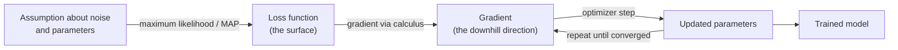
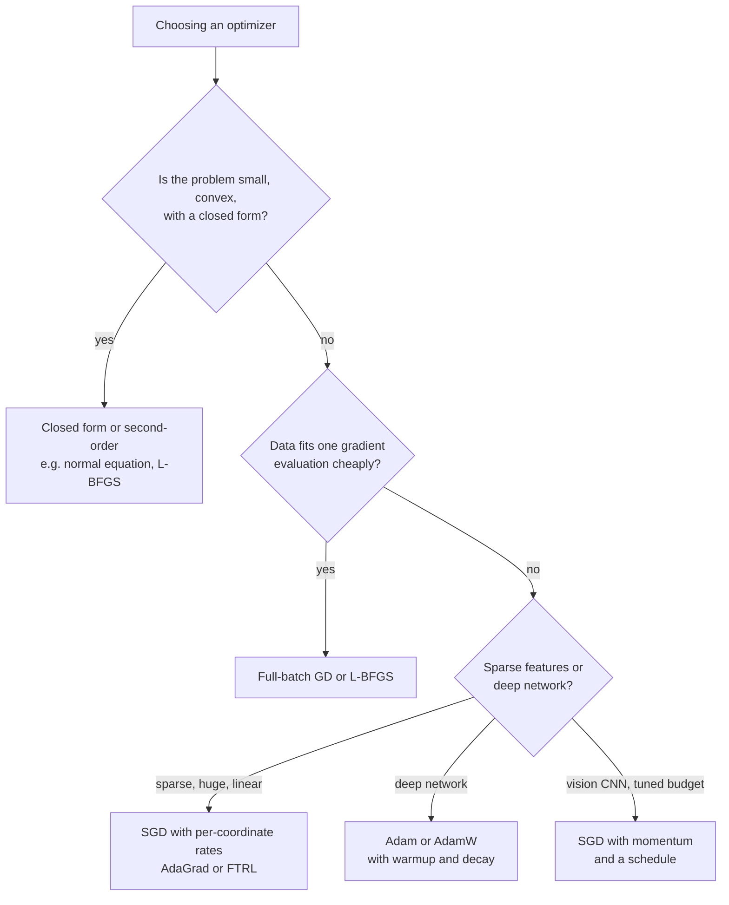
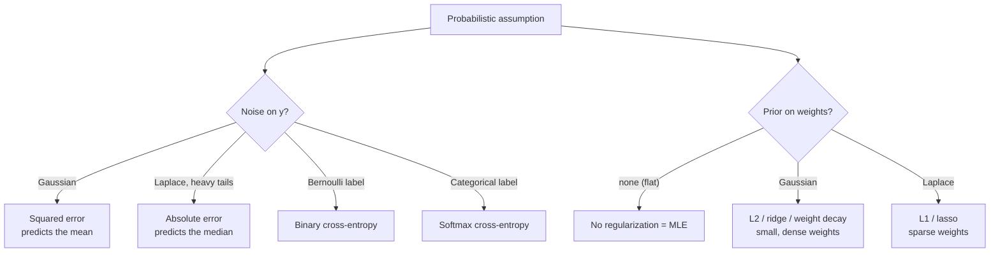
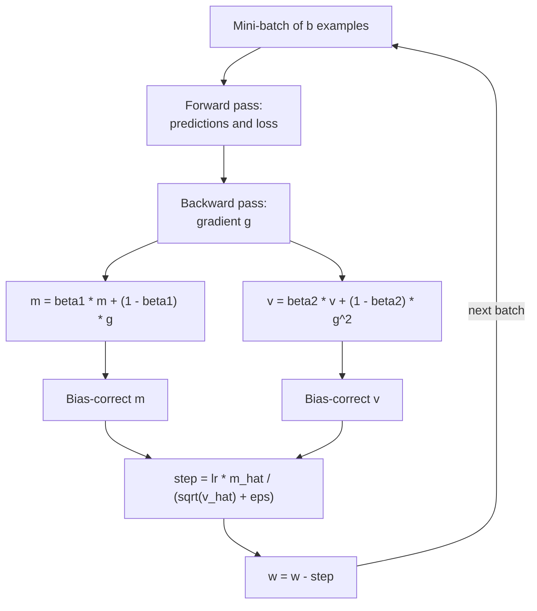
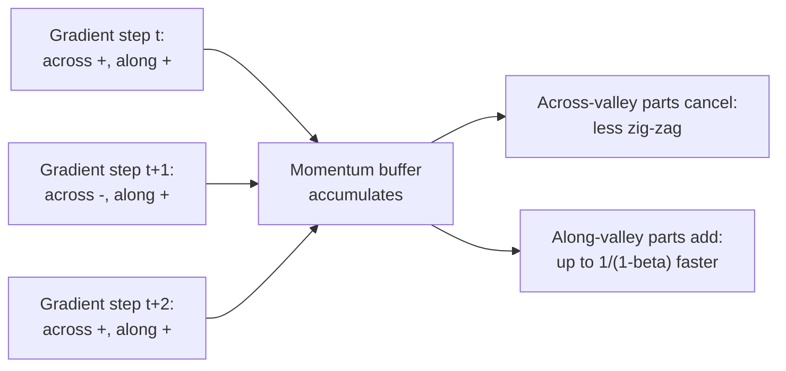

# M02 — Math toolkit: optimization & probability

> **One-sentence big idea.** Training a model is walking downhill on a loss surface, and the loss surface itself is not arbitrary — it is the negative log-probability of your data under assumptions you chose, so squared error, cross-entropy, and regularization are all consequences of what you believe about noise and parameters.

**Prerequisites:** [M01 What is learning?](01-ml-first-principles.md); calculus (chain rule, partial derivatives), linear algebra (dot products, matrix–vector products) · **Lab:** [Lab 1 — gradient descent](../labs/01_gradient_descent.py) · **Time:** 3 lecture hours

## Learning objectives

- **Derive** the gradient descent update from a first-order Taylor expansion and **explain** why the learning rate must be below $2/L$ on a quadratic with curvature $L$.
- **Implement** batch GD, mini-batch SGD, momentum, and Adam from scratch, and **compare** their behaviour on ill-conditioned problems.
- **Determine** whether a loss is convex and **explain** what convexity guarantees (and what non-convex deep learning gives up).
- **Derive** mean squared error from maximum likelihood under Gaussian noise and binary cross-entropy from maximum likelihood under a Bernoulli model.
- **Derive** L2 and L1 regularization as MAP estimation with Gaussian and Laplace priors, and **predict** why L1 produces sparse weights.
- **Compute** gradients of common vector/matrix expressions ($a^\top x$, $x^\top A x$, $\|Xw - y\|^2$) without element-wise bookkeeping.

---

## 1. The problem

M01 ended with: "pick $\hat h = \arg\min_{h} \hat R_n(h)$". That sentence hides two hard questions.

**Question 1: how do you actually find the minimum?** A modern recommendation model has $10^9$ parameters. You cannot try every setting. Even for a 3-parameter house-price model you cannot grid-search finely: 1,000 values per parameter is $10^9$ evaluations. You need a procedure that uses *local* information — "which way is downhill from here?" — and moves there, repeatedly. That procedure is gradient descent, and in some form it trains essentially every model in this course (trees are the main exception, and gradient boosting brings gradients back even there).

**Question 2: which loss should you minimize?** Your manager wants to predict delivery time. Do you minimize squared error, absolute error, or something else? Your fraud team wants a probability of fraud. Why does everyone use "cross-entropy"? And why does adding $\lambda \|w\|^2$ to the loss — which makes the training fit *worse* — make the model *better*?

It turns out Question 2 has a principled answer. **If you write down a probabilistic story of how your data was generated, the loss falls out by maximum likelihood**, and regularization falls out by adding a prior belief about the parameters. Once you see this, you stop memorizing losses and start deriving them.



The left half of that diagram is probability (§2.5–2.7); the right half is optimization (§2.1–2.4).

---

## 2. First principles

### 2.1 Loss surfaces

Fix the training data. The empirical risk is then just a function of the parameters $w \in \mathbb{R}^d$:
$$
L(w) = \frac{1}{n}\sum_{i=1}^n \ell(f_w(x_i), y_i).
$$
Picture $d=2$: $L$ is a landscape over the $(w_1, w_2)$ plane. Training means finding the lowest valley.

Three shapes matter:

- **Bowl (convex quadratic).** Linear regression with squared loss. One global minimum; every downhill path reaches it.
- **Long, thin valley (ill-conditioned bowl).** Steep in one direction, flat in another. Happens when features have very different scales (square footage in thousands, bedroom count in units). Downhill steps bounce across the steep walls and crawl along the floor.
- **Rugged landscape (non-convex).** Neural networks. Many local minima, saddle points, and plateaus. Remarkably, in very high dimensions most local minima found by SGD are about as good as each other; saddle points and flat regions are the real obstacles.

The **gradient** $\nabla L(w) = \big(\tfrac{\partial L}{\partial w_1}, \dots, \tfrac{\partial L}{\partial w_d}\big)$ is the vector of slopes. Geometrically it points in the direction of steepest *ascent*, and it is perpendicular to the contour lines of $L$.

### 2.2 Gradient descent from a Taylor expansion

Simplest thing that could work: from the current point $w$, take a small step $\Delta$ that decreases $L$. Which $\Delta$?

Near $w$, any smooth function looks linear. The first-order Taylor expansion is
$$
L(w + \Delta) \approx L(w) + \nabla L(w)^\top \Delta.
$$
We want $\nabla L(w)^\top \Delta$ as negative as possible. But a linear function has no minimum — we could make $\Delta$ infinitely long — so constrain the step length: $\|\Delta\| = \epsilon$. By Cauchy–Schwarz, $\nabla L^\top \Delta \ge -\|\nabla L\|\,\|\Delta\|$ with equality exactly when $\Delta$ points opposite the gradient. So the best small step is
$$
\Delta = -\eta\, \nabla L(w), \qquad \boxed{\,w_{t+1} = w_t - \eta\,\nabla L(w_t)\,}
$$
where $\eta > 0$ is the **learning rate** (step size). Plugging back in: $L(w_{t+1}) \approx L(w_t) - \eta\|\nabla L(w_t)\|^2$, which is a decrease whenever the gradient is non-zero and $\eta$ is small enough for the linear approximation to hold.

**How small is "small enough"?** Go one order further. The second-order Taylor expansion is
$$
L(w + \Delta) \approx L(w) + \nabla L^\top \Delta + \tfrac{1}{2}\Delta^\top H \Delta,
$$
where $H = \nabla^2 L(w)$ is the **Hessian** (matrix of second derivatives, i.e. curvature). Suppose the curvature in every direction is at most $L_{\max}$ (the largest eigenvalue of $H$, often called the smoothness constant). Substituting $\Delta = -\eta \nabla L$:
$$
L(w_{t+1}) \le L(w_t) - \eta\|\nabla L\|^2 + \tfrac{1}{2}\eta^2 L_{\max}\|\nabla L\|^2 = L(w_t) - \eta\big(1 - \tfrac{\eta L_{\max}}{2}\big)\|\nabla L\|^2.
$$
The loss is guaranteed to decrease when $\eta < 2/L_{\max}$, and the guaranteed decrease is largest at $\eta = 1/L_{\max}$.

**Worked example (1D).** $L(w) = 5w^2$, so $L'(w) = 10w$, curvature $L_{\max} = 10$, and the update is $w_{t+1} = w_t - 10\eta w_t = (1 - 10\eta)w_t$. Start at $w_0 = 1$:

| $\eta$ | Factor $1 - 10\eta$ | $w_1, w_2, w_3$ | Behaviour |
|---|---|---|---|
| 0.01 | 0.9 | 0.9, 0.81, 0.729 | slow, monotone |
| 0.1 | 0 | 0, 0, 0 | one-step convergence ($\eta = 1/L_{\max}$) |
| 0.15 | −0.5 | −0.5, 0.25, −0.125 | oscillates but converges |
| 0.21 | −1.1 | −1.1, 1.21, −1.331 | **diverges** ($\eta > 2/L_{\max} = 0.2$) |

**Why ill-conditioning hurts.** In $d$ dimensions, a quadratic bowl has a curvature per eigen-direction, $\lambda_1 \ge \dots \ge \lambda_d > 0$. One learning rate must satisfy $\eta < 2/\lambda_1$ (the steepest direction), and with that $\eta$ the flattest direction shrinks by a factor $1 - \eta\lambda_d \approx 1 - 2\lambda_d/\lambda_1$ per step. The ratio $\kappa = \lambda_1/\lambda_d$ is the **condition number**; GD needs on the order of $\kappa$ steps per "digit" of accuracy. Lab 1 uses a bowl with eigenvalues 25 and 1 ($\kappa = 25$): $\eta$ must stay below $0.08$, and at $\eta = 0.07$ it takes about 110 steps to reach a loss gap of $10^{-6}$.

The cheapest fix for $\kappa$ is often not a better optimizer but **feature standardization** (M03), which makes the bowl rounder.

### 2.3 Stochastic and mini-batch gradient descent

The full gradient $\nabla L(w) = \frac{1}{n}\sum_i \nabla \ell_i(w)$ costs $O(nd)$ per step. With $n = 10^9$ ad impressions, one step takes minutes. But notice: it is an *average*. Averages can be estimated from samples.

**Mini-batch SGD:** pick a random batch $B$ of size $b$ and use
$$
g_t = \frac{1}{b}\sum_{i \in B}\nabla \ell_i(w_t), \qquad w_{t+1} = w_t - \eta\, g_t.
$$
Because $B$ is random, $\mathbb{E}[g_t] = \nabla L(w_t)$: the mini-batch gradient is an **unbiased** estimate. Its variance shrinks like $1/b$, so the standard deviation shrinks like $1/\sqrt{b}$.

Why does this work so well in practice?

- **Cost per step is $O(bd)$, independent of $n$.** You make progress after seeing 256 examples instead of a billion.
- **Diminishing returns of large batches.** Going from $b = 256$ to $b = 1024$ costs $4\times$ more compute but only halves the noise. Early in training, a noisy direction is good enough.
- **Hardware.** GPUs are efficient on batches of tens to thousands, so $b = 1$ ("pure SGD") wastes them.
- **Noise can help** escape saddle points and sharp minima in non-convex problems.

The catch: with a constant $\eta$, SGD never settles exactly — it jitters around the minimum in a ball whose radius scales with $\eta$ and the gradient noise. Fixes: decay the learning rate (e.g. $\eta_t = \eta_0/(1 + kt)$, step decay, or cosine schedules), or increase batch size over time.

Terminology: an **epoch** is one pass through the dataset; with batch size $b$, it is $\lceil n/b \rceil$ steps.

### 2.4 Momentum and Adam

**Momentum.** In the thin valley, gradients across the valley flip sign every step (they cancel out on average), while gradients along the valley floor consistently point the same way (they add up). So *average* recent gradients:
$$
v_{t+1} = \beta v_t + g_t, \qquad w_{t+1} = w_t - \eta\, v_{t+1}.
$$
With $\beta = 0.9$, a consistent gradient accumulates to $v \approx g/(1-\beta) = 10g$: a $10\times$ larger effective step along the floor, while the oscillating component cancels. Physical picture: a heavy ball rolling downhill builds speed and is not deflected by every bump. On Lab 1's bowl at $\eta = 0.01$, plain GD is still far from the minimum after 400 steps, while momentum converges to machine precision in under 100.

**Adaptive learning rates (RMSProp, Adam).** Another view of ill-conditioning: different parameters need different step sizes. A rare feature (say, a specific ad ID seen once a week) gets tiny, infrequent gradients; a common bias term gets large, frequent ones. **Adam** (Kingma & Ba, 2015) keeps two running averages per parameter:
$$
m_t = \beta_1 m_{t-1} + (1-\beta_1) g_t \quad \text{(mean of gradients: momentum)}
$$
$$
v_t = \beta_2 v_{t-1} + (1-\beta_2) g_t^2 \quad \text{(mean of squared gradients: scale)}
$$
$$
\hat m_t = \frac{m_t}{1-\beta_1^t}, \quad \hat v_t = \frac{v_t}{1-\beta_2^t}, \quad w_{t+1} = w_t - \eta\,\frac{\hat m_t}{\sqrt{\hat v_t} + \epsilon}.
$$

Why each piece exists:

- **Dividing by $\sqrt{\hat v}$** makes the step roughly $\eta$ in size for every parameter regardless of the gradient's scale — a per-parameter learning rate. Parameters with consistently small gradients get relatively bigger steps.
- **Bias correction** $1/(1-\beta^t)$: $m$ and $v$ start at 0, so early averages are biased toward 0. At $t = 1$ with $\beta_2 = 0.999$, $v_1 = 0.001\,g_1^2$; dividing by $1 - 0.999 = 0.001$ recovers $g_1^2$.
- **$\epsilon \approx 10^{-8}$** avoids division by zero.
- **Defaults** $\beta_1 = 0.9$, $\beta_2 = 0.999$, $\eta = 10^{-3}$ work surprisingly often, which is why Adam is the default for neural networks.

**Worked number.** At $t=1$, gradient $g_1 = 0.02$: $m_1 = 0.1 \cdot 0.02 = 0.002$, $\hat m_1 = 0.02$; $v_1 = 0.001 \cdot 0.0004 = 4\times10^{-7}$, $\hat v_1 = 4 \times 10^{-4}$, $\sqrt{\hat v_1} = 0.02$. Step $= \eta \cdot 0.02/0.02 = \eta$. If the gradient were $2.0$ instead, the step would *still* be $\eta$. Adam's first steps are sign-like.

Practical caveat: for some problems (notably image classification with CNNs) well-tuned SGD with momentum generalizes slightly better than Adam; **AdamW** (decoupled weight decay) is the standard fix for Adam + L2 in deep learning.



### 2.5 Convexity: when downhill is enough

A function is **convex** if the straight line between any two points on its graph lies on or above the graph:
$$
L(\theta a + (1-\theta) b) \le \theta L(a) + (1-\theta)L(b) \quad \forall a, b,\ \theta \in [0,1].
$$
Equivalent tests: (1) for differentiable $L$, $L(b) \ge L(a) + \nabla L(a)^\top(b - a)$ — the tangent plane is a global under-estimator; (2) for twice-differentiable $L$, the Hessian is positive semi-definite everywhere.

Why we care: **for a convex function, every local minimum is a global minimum.** If GD stops ($\nabla L = 0$), you are done — there is no better valley elsewhere. Proof in one line from test (1): if $\nabla L(a) = 0$ then $L(b) \ge L(a)$ for all $b$.

Useful facts:

- Squared loss with a linear model, $\|Xw - y\|^2$, is convex (Hessian $2X^\top X$ is PSD).
- Logistic loss with a linear model is convex (M03 derives the Hessian $X^\top S X$ with $S$ diagonal and positive).
- Sums of convex functions are convex, so convex loss + L2 or L1 penalty is convex.
- **Composing with a neural network breaks convexity.** Swapping two hidden units gives the same function, so minima come in symmetric families and the line between two of them goes uphill.

Strong convexity (curvature bounded *below* by $\mu > 0$) gives linear convergence for GD: the error shrinks by a constant factor $(1 - \mu/L_{\max})$ per step. Adding an L2 penalty $\frac{\lambda}{2}\|w\|^2$ makes any convex loss $\lambda$-strongly convex — one of several reasons ridge regression is so well-behaved.

### 2.6 Maximum likelihood: where losses come from

Switch from "how to minimize" to "what to minimize". Suppose we write a **probabilistic model** $p(y \mid x; w)$: "if the parameters were $w$, here is how likely each label would be". Given i.i.d. data, the **likelihood** of the parameters is the probability of the observed labels:
$$
\mathcal{L}(w) = \prod_{i=1}^n p(y_i \mid x_i; w).
$$
The **maximum likelihood estimate (MLE)** is the $w$ that makes the observed data most probable. Products of many small numbers underflow, and logs turn products into sums without moving the maximum, so we minimize the **negative log-likelihood (NLL)**:
$$
\hat w_{\text{MLE}} = \arg\min_w\; -\sum_{i=1}^n \log p(y_i \mid x_i; w).
$$
Note the i.i.d. assumption from M01 is exactly what lets us write the joint probability as a product.

**Derivation 1 — Gaussian noise gives mean squared error.** Assume
$$
y_i = f_w(x_i) + \varepsilon_i, \qquad \varepsilon_i \sim \mathcal{N}(0, \sigma^2),
$$
so $p(y_i \mid x_i; w) = \frac{1}{\sqrt{2\pi\sigma^2}}\exp\!\Big(-\frac{(y_i - f_w(x_i))^2}{2\sigma^2}\Big)$. Then
$$
-\log \mathcal{L}(w) = \sum_{i=1}^n \left[\frac{(y_i - f_w(x_i))^2}{2\sigma^2} + \tfrac{1}{2}\log(2\pi\sigma^2)\right] = \frac{1}{2\sigma^2}\sum_{i=1}^n (y_i - f_w(x_i))^2 + \text{const}.
$$
The constant and the positive factor $1/(2\sigma^2)$ do not change the argmin. **Minimizing squared error is exactly MLE under Gaussian noise.**

This explains when MSE is the *wrong* choice. If the noise has heavy tails (occasional huge errors, e.g. delivery times with rare multi-hour delays), a Gaussian assigns those outliers vanishingly small probability, so MLE bends the whole fit to accommodate them. Assume Laplace noise $p(\varepsilon) \propto e^{-|\varepsilon|/b}$ instead and the same derivation gives **mean absolute error**, which is robust to outliers (and predicts the conditional median rather than the mean).

**Derivation 2 — Bernoulli labels give binary cross-entropy.** For a binary label $y_i \in \{0, 1\}$, let the model output a probability $p_i = p_w(x_i) = P(y_i = 1 \mid x_i)$. A Bernoulli variable has the compact pmf
$$
p(y_i \mid x_i; w) = p_i^{\,y_i}(1 - p_i)^{1 - y_i}
$$
(check: if $y_i = 1$ this is $p_i$; if $y_i = 0$ it is $1 - p_i$). The NLL is
$$
-\log\mathcal{L}(w) = -\sum_{i=1}^n \big[y_i \log p_i + (1 - y_i)\log(1 - p_i)\big],
$$
which is **binary cross-entropy (log loss)**. Nobody invented it as a heuristic; it is what MLE gives for coin-flip labels. The multiclass version (categorical distribution, softmax) gives $-\sum_i \log p_{i, y_i}$ — M03.

**Worked number.** Three emails with labels $(1, 0, 1)$ and model probabilities $(0.9, 0.3, 0.6)$. Likelihood $= 0.9 \times 0.7 \times 0.6 = 0.378$. NLL $= -\ln 0.378 = 0.973$; mean log loss $= 0.324$. A model that said $(0.99, 0.01, 0.99)$ would have likelihood $0.970$ and NLL $0.030$ — and a model that said $(0.9, 0.3, 0.001)$ would pay $-\ln 0.001 = 6.9$ for that one confident mistake. Log loss punishes confident errors without bound, which is why it produces calibrated probabilities.

### 2.7 MAP estimation: where regularization comes from

MLE trusts the data completely. With 10 data points and 100 parameters, it will happily choose enormous weights that interpolate noise (M01's overfitting). What we want to say is "*a priori*, small weights are more plausible". Bayes' rule lets us say exactly that:
$$
p(w \mid D) = \frac{p(D \mid w)\,p(w)}{p(D)} \propto \underbrace{p(D \mid w)}_{\text{likelihood}}\;\underbrace{p(w)}_{\text{prior}}.
$$
The **maximum a posteriori (MAP)** estimate maximizes the posterior; $p(D)$ does not depend on $w$, so
$$
\hat w_{\text{MAP}} = \arg\min_w \Big[\underbrace{-\log p(D \mid w)}_{\text{data loss}}\; \underbrace{-\log p(w)}_{\text{regularizer}}\Big].
$$

**Gaussian prior gives L2 (ridge / weight decay).** Let each weight be independent, $w_j \sim \mathcal{N}(0, \tau^2)$. Then
$$
-\log p(w) = \sum_j \frac{w_j^2}{2\tau^2} + \text{const} = \frac{1}{2\tau^2}\|w\|_2^2 + \text{const}.
$$
Combined with the Gaussian likelihood:
$$
\hat w_{\text{MAP}} = \arg\min_w \frac{1}{2\sigma^2}\|y - Xw\|^2 + \frac{1}{2\tau^2}\|w\|^2 = \arg\min_w \|y - Xw\|^2 + \lambda\|w\|_2^2, \quad \lambda = \frac{\sigma^2}{\tau^2}.
$$
The formula for $\lambda$ is worth reading: **regularize more when the data is noisy ($\sigma^2$ large) or when you strongly believe weights are small ($\tau^2$ small).** And as $n$ grows, the data term (a sum of $n$ terms) dominates the fixed prior term — with enough data, the prior washes out.

**Laplace prior gives L1 (lasso).** Let $p(w_j) = \frac{1}{2b}e^{-|w_j|/b}$. Then $-\log p(w) = \frac{1}{b}\|w\|_1 + \text{const}$, giving
$$
\hat w = \arg\min_w \|y - Xw\|^2 + \lambda\|w\|_1.
$$

**Why L1 makes weights exactly zero and L2 does not.** Compare the penalty gradients near $w_j = 0$:

- L2: $\frac{\partial}{\partial w_j}\lambda w_j^2 = 2\lambda w_j \to 0$ as $w_j \to 0$. The push toward zero fades away, so weights get small but rarely reach zero.
- L1: $\frac{\partial}{\partial w_j}\lambda|w_j| = \lambda\,\mathrm{sign}(w_j)$, a constant-size push all the way to zero. If the data's pull on $w_j$ is weaker than $\lambda$, the weight sits exactly at zero.

Geometrically: the Laplace density has a sharp peak at 0 (it puts real "belief mass" near exactly zero), while the Gaussian is smooth and flat on top. Equivalently, the L1 constraint region $\|w\|_1 \le c$ is a diamond with corners on the axes; the elliptical loss contours usually first touch it at a corner, where some coordinates are zero.

**1D worked example.** Minimize $\frac{1}{2}(w - a)^2 + \lambda\cdot\text{penalty}$ where $a$ is what the data alone wants.

- L2 penalty $\frac{1}{2}w^2$: solution $w = \frac{a}{1 + \lambda}$. With $a = 0.3, \lambda = 0.5$: $w = 0.2$. Shrunk, never zero.
- L1 penalty $|w|$: solution is **soft-thresholding** $w = \mathrm{sign}(a)\max(|a| - \lambda, 0)$. With $a = 0.3, \lambda = 0.5$: $w = 0$. With $a = 2$: $w = 1.5$.



### 2.8 Matrix calculus essentials

You need about five identities to derive almost every gradient in this course. Convention: for scalar $f$ and vector $w \in \mathbb{R}^d$, $\nabla_w f$ is a vector in $\mathbb{R}^d$ (same shape as $w$). **Always sanity-check shapes.**

| Expression $f(w)$ | Gradient $\nabla_w f$ | Shape check |
|---|---|---|
| $a^\top w$ | $a$ | $d$ |
| $w^\top w = \|w\|^2$ | $2w$ | $d$ |
| $w^\top A w$ | $(A + A^\top)w$, or $2Aw$ if $A$ symmetric | $d$ |
| $Xw$ (vector-valued) | Jacobian $X$ ($n \times d$) | — |
| $\|Xw - y\|^2$ | $2X^\top(Xw - y)$ | $(d\times n)(n) = d$ |
| $\sum_i g(x_i^\top w)$ | $X^\top g'(Xw)$ | $(d\times n)(n) = d$ |

**Derivation of the most important one.** Let $r = Xw - y$ (residuals, $n$-vector). Then $f = r^\top r$. Expand:
$$
f = (Xw - y)^\top(Xw - y) = w^\top X^\top X w - 2y^\top X w + y^\top y.
$$
Apply the table: $\nabla(w^\top X^\top X w) = 2X^\top X w$ (since $X^\top X$ is symmetric) and $\nabla(-2y^\top X w) = -2X^\top y$. So $\nabla f = 2X^\top X w - 2X^\top y = 2X^\top(Xw - y)$. Setting this to zero gives the normal equation $X^\top X w = X^\top y$ — M03's first result.

**Intuition for $X^\top r$.** It is $\sum_i r_i x_i$: each example pushes the weights in the direction of its own feature vector, scaled by how wrong it was. That pattern — *error times input* — reappears in logistic regression, in the delta rule, and in backpropagation (M07).

**The chain rule in vector form.** If $f(w) = g(h(w))$ with $h: \mathbb{R}^d \to \mathbb{R}^n$, then $\nabla_w f = J_h(w)^\top \nabla_h g$, where $J_h$ is the $n \times d$ Jacobian. Backpropagation is this rule applied layer by layer.

**Always verify with a numerical gradient.** Central differences, $\frac{\partial f}{\partial w_j} \approx \frac{f(w + \epsilon e_j) - f(w - \epsilon e_j)}{2\epsilon}$ with $\epsilon \approx 10^{-6}$, should match your analytic gradient to a relative error around $10^{-7}$ or better in float64. Lab 2 does this for logistic regression.

---

## 3. The algorithm(s)

All first-order optimizers share one loop; they differ only in how they turn the gradient into a step.

```text
optimize(w0, grad_fn, data, optimizer, epochs, batch_size):
    w = w0; state = optimizer.init(w)
    for epoch in 1..epochs:
        shuffle(data)
        for batch in chunks(data, batch_size):
            g = grad_fn(w, batch)                 # average gradient over the batch
            w, state = optimizer.step(w, g, state)
    return w
```

| Optimizer | Update | Extra memory | Hyperparameters |
|---|---|---|---|
| GD / SGD | $w \leftarrow w - \eta g$ | none | $\eta$, batch size |
| Momentum | $v \leftarrow \beta v + g;\ w \leftarrow w - \eta v$ | $d$ | $\eta, \beta \approx 0.9$ |
| AdaGrad | $s \leftarrow s + g^2;\ w \leftarrow w - \eta g/\sqrt{s + \epsilon}$ | $d$ | $\eta$ |
| Adam | see §2.4 | $2d$ | $\eta, \beta_1, \beta_2, \epsilon$ |

**Complexity.** Per step: $O(bd)$ to compute a mini-batch gradient for a linear model, plus $O(d)$ for the update. Memory: parameters plus optimizer state — for Adam, three copies of the parameters (weights, $m$, $v$). This matters for large models: a 7-billion-parameter model in float32 needs 28 GB for weights and another 56 GB for Adam state, before gradients and activations.

**Second-order methods** (Newton: $w \leftarrow w - H^{-1}\nabla L$) use curvature and converge in very few steps on well-behaved problems — Newton solves a quadratic in exactly one step — but the Hessian costs $O(d^2)$ memory and $O(d^3)$ to invert. Practical for logistic regression with up to a few thousand features (it is what "IRLS" in statistics packages does) and approximated by L-BFGS for larger smooth problems; impractical for deep nets.

**Convergence rates to know (smooth convex case):** GD reaches $\epsilon$ accuracy in $O(1/\epsilon)$ steps; with strong convexity, $O(\kappa \log(1/\epsilon))$; momentum (Nesterov) improves this to $O(\sqrt{\kappa}\log(1/\epsilon))$; SGD with decaying step size reaches $O(1/\sqrt{T})$ after $T$ steps (slower per step, much cheaper per step).

---

## 4. Diagrams

The probability-to-loss map (§2.7) and the optimizer decision tree (§2.4) are above. Here is the compute flow of one Adam step, which is exactly what `optimizer.step()` does in PyTorch:



And the intuition for why momentum helps in a thin valley:



---

## 5. Code

From-scratch optimizers (the full, tested version with linear regression is [Lab 1](../labs/01_gradient_descent.py)):

```python
import numpy as np

A = np.array([[13., 12.], [12., 13.]])   # eigenvalues 25 and 1 -> condition number 25
b = np.array([1., -2.])
grad = lambda w: A @ w - b               # gradient of 0.5 w^T A w - b^T w
w_star = np.linalg.solve(A, b)

def gd(w, lr=0.07, steps=200):
    for _ in range(steps):
        w = w - lr * grad(w)
    return w

def momentum(w, lr=0.01, beta=0.9, steps=200):
    v = np.zeros_like(w)
    for _ in range(steps):
        v = beta * v + grad(w)
        w = w - lr * v
    return w

def adam(w, lr=0.1, b1=0.9, b2=0.999, eps=1e-8, steps=200):
    m = np.zeros_like(w); v = np.zeros_like(w)
    for t in range(1, steps + 1):
        g = grad(w)
        m = b1 * m + (1 - b1) * g
        v = b2 * v + (1 - b2) * g * g
        m_hat, v_hat = m / (1 - b1**t), v / (1 - b2**t)
        w = w - lr * m_hat / (np.sqrt(v_hat) + eps)
    return w

w0 = np.array([-2., 2.])
for name, opt in [("GD", gd), ("Momentum", momentum), ("Adam", adam)]:
    print(f"{name:9s} distance to optimum: {np.linalg.norm(opt(w0) - w_star):.2e}")
```

MAP vs MLE in four lines — ridge regression is MLE plus a Gaussian prior:

```python
lam = sigma2 / tau2                                       # lambda = noise variance / prior variance
w_mle = np.linalg.solve(X.T @ X, X.T @ y)
w_map = np.linalg.solve(X.T @ X + lam * np.eye(X.shape[1]), X.T @ y)
```

**Library equivalents:**

```python
opt = torch.optim.Adam(model.parameters(), lr=1e-3)       # or SGD(..., momentum=0.9), AdamW(...)
loss = torch.nn.functional.binary_cross_entropy_with_logits(logits, y)   # Bernoulli NLL
loss.backward(); opt.step(); opt.zero_grad()              # autograd replaces section 2.8 by hand
```

---

## 6. Real-world applications

1. **Training large language models (OpenAI, Anthropic, Google, Meta).** *Task:* minimize next-token cross-entropy over trillions of tokens. *Why these tools:* cross-entropy is the categorical NLL (§2.6); the data is far too large for full-batch GD, so mini-batch SGD with AdamW, warmup, and cosine decay is standard (documented in the GPT-3 and Llama papers). *Constraint:* Adam's $2\times$ extra memory is a real cost at billions of parameters, motivating memory-saving variants and sharded optimizer state.
2. **Online CTR prediction (Google's FTRL-Proximal, 2013).** *Task:* logistic regression over billions of sparse features, updated continuously. *Why:* per-coordinate adaptive learning rates (AdaGrad-style) because rare features need bigger steps; an L1 term to make most weights exactly zero so the model fits in serving memory. *Constraint:* memory and freshness — the paper "Ad Click Prediction: a View from the Trenches" (McMahan et al.) describes exactly this L1-for-sparsity trade-off.
3. **Delivery-time / ETA regression (ride-hailing and food delivery).** *Task:* predict arrival time. *Why the probability view matters:* errors are skewed and heavy-tailed (rare long delays), so pure MSE gets dragged by outliers; teams use MAE, Huber loss, or quantile losses (predict the 90th percentile to make promises customers can trust). *Constraint:* the business cost is asymmetric — late is worse than early.
4. **Credit scoring with regularized logistic regression (banks).** *Task:* probability of default. *Why:* Bernoulli MLE gives calibrated probabilities that feed directly into pricing and expected-loss calculations; L1 selects a small, explainable set of features. *Constraint:* regulators require each feature's effect to be explainable.

---

## 7. System-design hook

Interviewers rarely ask "derive Adam", but M02 material appears in three predictable places:

- **"What loss would you use?"** A strong candidate derives it from the label type and the business cost: "The label is binary click/no-click and I need calibrated probabilities because the ad auction multiplies pCTR by bid, so I'll use log loss — the Bernoulli likelihood. MSE would give poor gradients for confident mistakes and log loss directly rewards calibration." For regression: "ETA errors are heavy-tailed, so MSE would chase outliers; I'd use Huber or a quantile loss at the percentile we promise."
- **"How do you train on 10 billion examples?"** Mini-batch SGD streaming over data; distributed data parallelism (each worker computes a mini-batch gradient, gradients are averaged); learning-rate scaling and warmup with large global batches; adaptive per-coordinate rates for sparse features.
- **"How do you keep the model small / avoid overfitting on sparse IDs?"** L1 for sparsity (fewer weights to store and serve), L2 for stability, and the observation that regularization strength should depend on data volume per feature — rare IDs need more shrinkage (a prior that the data hasn't overwhelmed).

**Trade-offs to name:** batch size vs convergence quality vs hardware utilization; adaptive optimizers (fast, less tuning, more memory) vs SGD+momentum (cheaper, sometimes better generalization); MSE (mean, outlier-sensitive) vs MAE (median, robust) vs quantile (business-aligned percentile).

---

## 8. Pitfalls & debugging

| Pitfall | Symptom | Detect | Fix |
|---|---|---|---|
| Learning rate too high | Loss explodes to `inf`/`NaN`, or oscillates | Plot loss per step; first few steps go up | Divide $\eta$ by 3–10; use warmup; clip gradients |
| Learning rate too low | Loss decreases painfully slowly | Loss curve is a straight gentle slope | Increase $\eta$; run an LR range test (sweep $\eta$ exponentially) |
| Ill-conditioning | Zig-zag, slow progress, sensitive to $\eta$ | Features on very different scales; large condition number of $X^\top X$ | Standardize features; use momentum or Adam |
| Wrong gradient | Loss doesn't decrease or decreases then stalls oddly | Numerical gradient check (relative error $> 10^{-4}$) | Fix the derivation; check shapes and signs |
| Forgetting to shuffle | SGD loss curve with periodic jumps; poor convergence | Data sorted by label or time | Shuffle each epoch |
| SGD noise floor | Loss plateaus above the optimum | Larger batch or smaller $\eta$ lowers the plateau | Learning-rate decay schedule |
| Numerical overflow in log loss | `log(0)` = `-inf`, `NaN` gradients | Probabilities exactly 0 or 1 | Compute loss from logits (`logaddexp`), clip probabilities |
| Regularizing the bias | Predictions systematically shifted toward zero | Mean prediction ≠ mean label on training data | Exclude the intercept from the penalty |
| Wrong loss for the noise | Model chases outliers | Residual histogram has heavy tails | MAE, Huber, quantile, or transform the target (log) |

**The debugging ladder for "my model won't train":** (1) can it overfit a batch of 10 examples to near-zero loss? If not, the bug is in the model, loss, or gradient. (2) Gradient check. (3) Learning-rate sweep. (4) Only then worry about architecture or data.

---

## 9. Exercises

**Conceptual**

1. ★ Explain, without equations, why the gradient points perpendicular to contour lines and why that makes GD zig-zag in a long, thin valley.
2. ★ Why is the mini-batch gradient unbiased? What would make it biased? (Hint: think about data that is not shuffled.)
3. ★★ Your training loss is decreasing but jumps up sharply at the start of every epoch. Name the likely cause and the fix.
4. ★★ A colleague says "L2 regularization and early stopping are basically the same thing." In what sense is this true for GD on linear regression started at $w = 0$?

**Derivation / math**

5. ★★ Derive the MLE loss when $y_i \sim \text{Poisson}(\lambda_i)$ with $\lambda_i = e^{w^\top x_i}$ (count data: number of clicks, number of rides). Show it is convex in $w$.
6. ★★ Show that for $L(w) = \frac{1}{2}w^\top A w - b^\top w$ with symmetric positive-definite $A$, GD converges if and only if $0 < \eta < 2/\lambda_{\max}(A)$. (Hint: write the error $e_t = w_t - w^\star$ and show $e_{t+1} = (I - \eta A)e_t$.)
7. ★★ Derive the soft-thresholding solution of $\min_w \frac{1}{2}(w - a)^2 + \lambda|w|$ by considering the cases $w > 0$, $w < 0$, $w = 0$ (use the subgradient at 0).
8. ★★★ Show that the MAP estimate with a Gaussian prior $\mathcal{N}(0, \tau^2 I)$ and Gaussian likelihood is $w = (X^\top X + \lambda I)^{-1}X^\top y$ with $\lambda = \sigma^2/\tau^2$, and that $X^\top X + \lambda I$ is invertible for any $\lambda > 0$ even when $X^\top X$ is singular.

**Coding**

9. ★ In Lab 1, find empirically the largest learning rate for which GD converges on the bowl. Compare with $2/\lambda_{\max}$.
10. ★★ Implement Nesterov momentum and RMSProp; add them to Lab 1's comparison table.
11. ★★ Generate regression data with 5% of labels corrupted by $+50$ outliers. Fit by MSE and by MAE (subgradient descent) and compare recovered weights.

**Design**

12. ★★★ You train a CTR model on 50 billion impressions per day with $10^9$ sparse features (user IDs, ad IDs, crosses). Choose an optimizer, batching strategy, and regularization scheme, and justify each choice in terms of memory, freshness, and convergence.

---

## 10. Interview questions

<details>
<summary>Q1. Derive the gradient descent update. Why does the learning rate need an upper bound?</summary>

First-order Taylor: $L(w + \Delta) \approx L(w) + \nabla L^\top \Delta$. For a fixed step length, the most negative change is $\Delta \propto -\nabla L$, so $w \leftarrow w - \eta\nabla L$. The linear approximation is only valid locally; with curvature at most $L_{\max}$, the second-order term $\frac{1}{2}\eta^2 L_{\max}\|\nabla L\|^2$ can outweigh the first-order decrease. The loss is guaranteed to decrease for $\eta < 2/L_{\max}$; above that, steps overshoot and diverge.
</details>

<details>
<summary>Q2. Why does minimizing MSE correspond to a Gaussian noise assumption?</summary>

If $y = f_w(x) + \varepsilon$ with $\varepsilon \sim \mathcal{N}(0, \sigma^2)$, the log-likelihood of each point is $-\frac{(y - f_w(x))^2}{2\sigma^2}$ plus a constant. Maximizing the total log-likelihood over i.i.d. points is therefore the same as minimizing the sum of squared errors. Consequence: MSE is optimal when errors are roughly Gaussian and too sensitive to outliers when they are heavy-tailed, where MAE (Laplace) or Huber loss is better.
</details>

<details>
<summary>Q3. Why is cross-entropy used for classification instead of MSE on probabilities?</summary>

Cross-entropy is the negative log-likelihood of a Bernoulli or categorical model, so minimizing it is MLE and yields calibrated probabilities. With a sigmoid output, its gradient with respect to the logit is simply $p - y$, which stays large when the model is confidently wrong. MSE on a sigmoid output has gradient $(p - y)p(1-p)$, which vanishes when $p$ saturates near 0 or 1 — exactly when the model is confidently wrong — so learning stalls. MSE with a sigmoid is also non-convex in the weights.
</details>

<details>
<summary>Q4. Explain the connection between L2 regularization and a Gaussian prior, and between L1 and a Laplace prior. Why does L1 give sparse solutions?</summary>

MAP estimation minimizes NLL plus $-\log p(w)$. A Gaussian prior gives $-\log p(w) = \|w\|^2/(2\tau^2)$ — L2 with $\lambda = \sigma^2/\tau^2$. A Laplace prior gives $\|w\|_1/b$ — L1. L1's penalty gradient has constant magnitude $\lambda$ all the way to zero, so any weight whose data gradient is weaker than $\lambda$ is pushed to exactly zero; L2's penalty gradient $2\lambda w$ vanishes near zero, so weights shrink but stay non-zero. Geometrically, the L1 ball has corners on the axes where the loss contours tend to touch it.
</details>

<details>
<summary>Q5. Compare SGD, momentum, and Adam. When would you choose each?</summary>

SGD: cheapest, one hyperparameter, needs a schedule; with momentum it is often the best-generalizing choice for well-tuned vision models. Momentum: averages gradients to damp oscillation across ravines and accelerate along consistent directions. Adam: momentum plus per-parameter scaling by the RMS of recent gradients, so it handles different gradient scales and sparse features with little tuning; costs two extra copies of the parameters. Default to AdamW for transformers and most deep nets; SGD+momentum for CNNs when you can tune; AdaGrad/FTRL-style per-coordinate rates for huge sparse linear models.
</details>

<details>
<summary>Q6. What does convexity buy you, and is deep learning convex?</summary>

For a convex function every local minimum is global, so any method that reaches a stationary point has solved the problem, and convergence rates can be proven. Linear and logistic regression with convex penalties are convex. Deep networks are not: hidden-unit permutation symmetry alone creates multiple equivalent minima with higher-loss regions between them. In practice SGD on large networks still finds good solutions because most local minima in high dimensions have similar loss; saddle points and plateaus are the bigger practical issue.
</details>

<details>
<summary>Q7. Your training loss becomes NaN after a few hundred steps. How do you debug it?</summary>

Check in order: (1) learning rate too high — lower it or add warmup and see if the blow-up moves later; (2) numerical issues in the loss, such as log of 0 or exp overflow — compute losses from logits with stable functions; (3) exploding gradients — log the gradient norm and add gradient clipping; (4) bad inputs — NaN or extreme values in a feature or label; (5) division by a tiny number (normalization layers, Adam epsilon in low precision). Reproduce on a small batch with the same seed and print the loss, gradient norm, and max activation per step.
</details>

---

## Further reading

- Boyd & Vandenberghe, *Convex Optimization* (2004), Ch. 3 (convex functions) and Ch. 9 (gradient and Newton methods). Free online.
- Goodfellow, Bengio & Courville, *Deep Learning* (2016), Ch. 4 (numerical computation), Ch. 5.5–5.6 (MLE and MAP), Ch. 8 (optimization for training deep models).
- Kingma & Ba, "Adam: A Method for Stochastic Optimization", ICLR 2015; Loshchilov & Hutter, "Decoupled Weight Decay Regularization" (AdamW), ICLR 2019.
- McMahan et al., "Ad Click Prediction: a View from the Trenches", KDD 2013 — FTRL-Proximal, per-coordinate rates, and L1 at Google scale.
- Petersen & Pedersen, *The Matrix Cookbook* — the reference table for matrix calculus identities.
- Bishop, *Pattern Recognition and Machine Learning* (2006), §1.2 and §3.1 — MLE, MAP, and regularization as priors.
