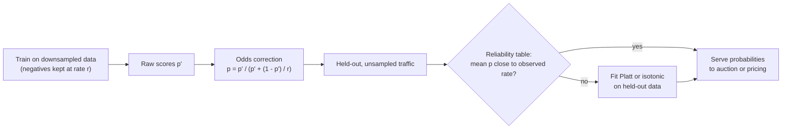
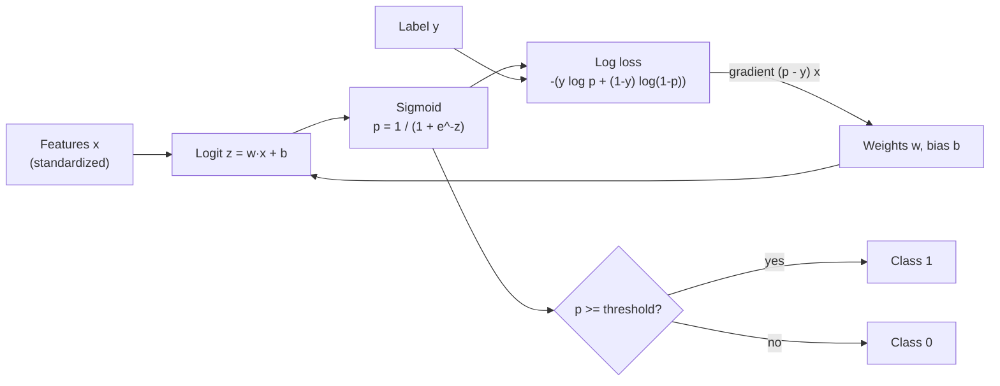
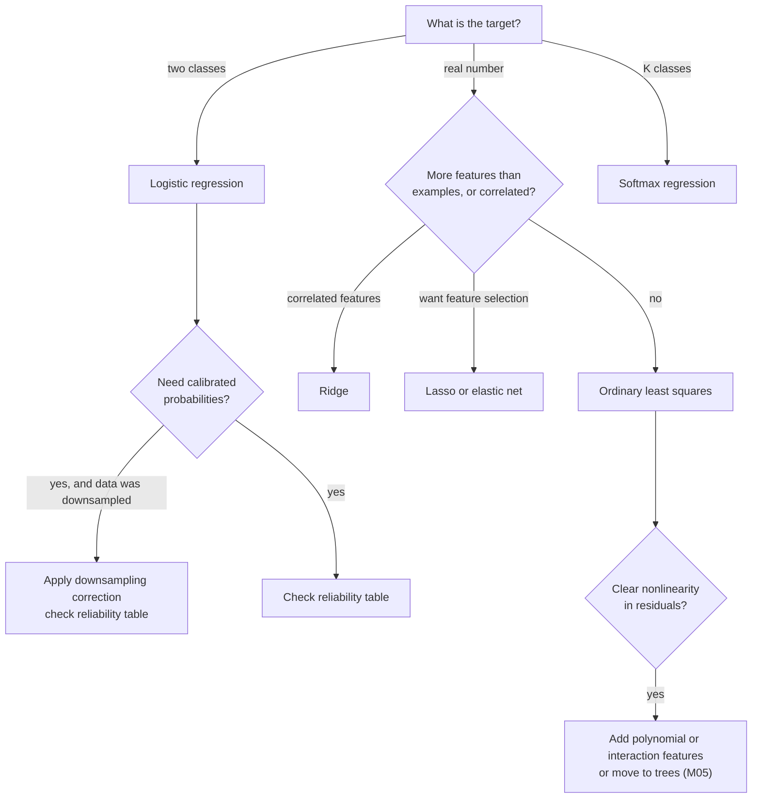

# M03 — Linear & logistic regression

> **One-sentence big idea.** A weighted sum of features is the simplest model that can learn anything at all, and with the right link function (identity for numbers, sigmoid for probabilities) and the right loss (from M02's likelihoods) it is still the fast, interpretable, well-calibrated baseline that real companies run at billions of predictions per day.

**Prerequisites:** [M01 What is learning?](01-ml-first-principles.md), [M02 Math toolkit](02-math-toolkit.md) · **Lab:** [Lab 2 — linear & logistic regression](../labs/02_linear_logistic_regression.py) · **Time:** 3 lecture hours

## Learning objectives

- **Derive** the normal equation for least squares and **implement** linear regression both in closed form and by gradient descent, explaining when each is preferable.
- **Explain** why feature scaling changes gradient-descent behaviour but not the closed-form solution, and **apply** polynomial features plus ridge/lasso to control capacity.
- **Derive** logistic regression from the log-odds, and **derive** the cross-entropy gradient $X^\top(p - y)$ by hand.
- **Extend** binary logistic regression to softmax regression for $K$ classes and **interpret** the decision boundary geometrically.
- **Diagnose** and **fix** miscalibration (including the effect of negative downsampling) using reliability tables.
- **Design** a large-scale CTR model using the hashing trick and justify why logistic regression is still used in ad systems and credit scoring.

---

## 1. The problem

Three teams in three companies come to you on the same Monday.

1. **A real-estate platform** wants an instant price estimate for every home listing: "This 1,800 sq ft, 3-bedroom, 20-year-old house is worth about \$420k." They need a number, and they need to explain it to sellers ("each extra bedroom adds about \$10k in this area").
2. **An ad network** must predict, within 10 milliseconds, the probability that a user clicks an ad, for every one of tens of billions of ad requests per day. The prediction is multiplied by the advertiser's bid to run an auction, so a predicted 2% that is really 1% means overcharging advertisers. They need *calibrated probabilities*, *speed*, and a model that can absorb billions of sparse features like `user_country=DE × ad_category=shoes`.
3. **A bank** must decide whether to approve a loan. A regulator will ask "why was this applicant declined?" and the bank must point to specific factors. A black box is not acceptable no matter how accurate.

These look like three different problems — a regression, a high-throughput probability estimate, and an explainable decision — and yet the standard first answer to all three is the same object: **a linear function of features**, $w^\top x + b$. This module shows why that object is so durable, how to fit it, and where its limits are.

---

## 2. First principles

### 2.1 The simplest model that could work

We want $f(x) \approx y$ with $x \in \mathbb{R}^d$. The simplest non-trivial function family is linear:
$$
\hat y = f_w(x) = w_1 x_1 + \dots + w_d x_d + b = w^\top x + b.
$$
Each $w_j$ answers a question a human can understand: *holding all other features fixed, how much does the prediction change per unit of $x_j$?* That interpretability is the model's inductive bias (M01): **effects add up independently**.

Notation trick used everywhere: append a constant feature $x_0 = 1$ so the bias becomes just another weight, $\hat y = w^\top x$ with $w, x \in \mathbb{R}^{d+1}$. Stacking $n$ examples as rows gives the **design matrix** $X \in \mathbb{R}^{n \times (d+1)}$ and predictions $\hat y = Xw$.

### 2.2 Linear regression: choosing the loss

M02 showed that if $y = w^\top x + \varepsilon$ with Gaussian noise, maximum likelihood gives **least squares**:
$$
L(w) = \|Xw - y\|^2 = \sum_{i=1}^n (w^\top x_i - y_i)^2.
$$
Squared error also has a geometric meaning worth knowing: $Xw$ ranges over the **column space** of $X$ (all linear combinations of feature columns). Least squares finds the point in that subspace closest to $y$ — the **orthogonal projection** of $y$ onto the column space. The residual $r = y - Xw$ must therefore be perpendicular to every column of $X$:
$$
X^\top (y - Xw) = 0.
$$
That one line *is* the normal equation, derived without calculus. ("Normal" means perpendicular.)

### 2.3 The normal equation (calculus derivation)

From M02's matrix-calculus table, $\nabla_w \|Xw - y\|^2 = 2X^\top(Xw - y)$. The loss is convex (Hessian $2X^\top X$ is positive semi-definite), so the minimum is where the gradient is zero:
$$
2X^\top X w - 2X^\top y = 0 \quad\Longrightarrow\quad \boxed{\,X^\top X\, w = X^\top y\,} \quad\Longrightarrow\quad w^\star = (X^\top X)^{-1}X^\top y
$$
when $X^\top X$ is invertible (i.e. the columns of $X$ are linearly independent).

**Worked example.** Three houses: size $x = (1, 2, 3)$ (in thousands of sq ft), price $y = (2, 3, 5)$ (in \$100k). With a bias column,
$$
X = \begin{pmatrix}1 & 1\\ 2 & 1\\ 3 & 1\end{pmatrix},\quad
X^\top X = \begin{pmatrix}14 & 6\\ 6 & 3\end{pmatrix},\quad
X^\top y = \begin{pmatrix}23\\ 10\end{pmatrix}.
$$
$\det(X^\top X) = 42 - 36 = 6$, so
$$
w^\star = \frac{1}{6}\begin{pmatrix}3 & -6\\ -6 & 14\end{pmatrix}\begin{pmatrix}23\\ 10\end{pmatrix} = \frac{1}{6}\begin{pmatrix}9\\ 2\end{pmatrix} = \begin{pmatrix}1.5\\ 0.333\end{pmatrix}.
$$
The fit is $\hat y = 1.5x + 0.333$: each extra 1,000 sq ft adds \$150k. Predictions $(1.833, 3.333, 4.833)$, residuals $(0.167, -0.333, 0.167)$. Check the projection property: residuals sum to 0 (perpendicular to the bias column) and $1(0.167) + 2(-0.333) + 3(0.167) = 0$ (perpendicular to the size column).

**When is $X^\top X$ not invertible?** When features are linearly dependent: `price_in_usd` and `price_in_eur` both included, a one-hot encoding plus a bias (the dummy-variable trap), or more features than examples ($d > n$). Then infinitely many $w$ fit equally well — and nearly-dependent features (**multicollinearity**) make $X^\top X$ nearly singular, so tiny changes in data swing the weights wildly. That is M01's *variance*, and ridge (§2.6) is the cure.

**In practice, never compute the inverse.** Solve the linear system (`np.linalg.solve`) or use a QR/SVD-based least-squares routine (`np.linalg.lstsq`), which is more numerically stable because it avoids squaring the condition number.

### 2.4 Gradient descent for linear regression — and when you need it

Using the mean loss $L(w) = \frac{1}{n}\|Xw - y\|^2$, GD is
$$
w \leftarrow w - \eta\cdot\frac{2}{n}X^\top(Xw - y).
$$
Read the gradient as M02 taught: each example pushes $w$ along its own feature vector $x_i$, scaled by its error $r_i$. Why bother when a closed form exists?

| | Normal equation | Gradient descent / SGD |
|---|---|---|
| Cost | $O(nd^2)$ to form $X^\top X$ + $O(d^3)$ to solve | $O(nd)$ per epoch |
| Good when | $d$ up to ~$10^4$, data fits in memory | $d$ large, $n$ huge, data streams |
| Hyperparameters | none | learning rate, epochs, batch size |
| Extends to | ridge (closed form) | lasso, logistic, neural nets, online updates |

With $d = 10^6$ sparse features, $X^\top X$ has $10^{12}$ entries — impossible. With data arriving continuously, you want to update the model per example. Both force SGD. Lab 2 shows both methods agree to $10^{-15}$ on a small problem.

### 2.5 Feature scaling and polynomial features

**Scaling.** Suppose features are `sqft` (≈1,500) and `bedrooms` (≈3). The loss curvature along the sqft weight is roughly proportional to $\mathbb{E}[x_{\text{sqft}}^2] \approx 2.4\times10^6$, along bedrooms about $10$. The condition number is in the hundreds of thousands, and M02 tells us GD then needs roughly that many steps. **Standardization** fixes it:
$$
x_j' = \frac{x_j - \mu_j}{s_j},
$$
with $\mu_j, s_j$ the mean and standard deviation **computed on the training set only** (computing them on all data leaks test information). Now every feature has unit scale and the bowl is roughly round. Three things to remember:

- Scaling **does not change** the closed-form fit's predictions (it re-parameterizes $w$), but it changes GD's speed dramatically.
- Scaling **does change** ridge and lasso solutions, because the penalty treats all weights equally — a weight on unscaled sqft is naturally tiny and would be barely penalized. Always standardize before regularizing.
- Store $\mu, s$ with the model; serving must apply the *identical* transform (a classic training/serving skew bug).

**Polynomial features.** Linear in $w$ does not mean linear in $x$. Map $x \mapsto \phi(x) = (1, x, x^2, \dots, x^k)$ and fit $w^\top\phi(x)$: still least squares, still the normal equation, but now the model can bend. Interactions such as $x_{\text{sqft}}\cdot x_{\text{neighborhood}}$ work the same way. This is the knob behind M01's polynomial overfitting table: as $k$ grows, bias falls and variance rises. With $d$ inputs and degree $k$, the number of features is $\binom{d+k}{k}$ — it explodes, which is why we need regularization (and, later, trees and neural nets that learn their own features).

### 2.6 Ridge and lasso

M02 derived both as MAP estimates. Here is what they do to linear regression.

**Ridge (L2):** minimize $\|Xw - y\|^2 + \lambda\|w\|^2$. Gradient $2X^\top(Xw - y) + 2\lambda w = 0$ gives
$$
w_{\text{ridge}} = (X^\top X + \lambda I)^{-1}X^\top y.
$$
Adding $\lambda I$ raises every eigenvalue of $X^\top X$ by $\lambda$, so the matrix is **always invertible** for $\lambda > 0$ and the condition number drops — multicollinearity is tamed. In the eigenbasis of $X^\top X$ with eigenvalues $d_j$, ridge multiplies each least-squares component by $\frac{d_j}{d_j + \lambda}$: directions the data supports strongly ($d_j \gg \lambda$) are kept, directions it barely supports ($d_j \ll \lambda$) are shrunk toward zero. (Do not penalize the bias; set that diagonal entry of $I$ to 0.)

**Lasso (L1):** minimize $\|Xw - y\|^2 + \lambda\|w\|_1$. No closed form, but coordinate descent with soft-thresholding (M02 §2.7) solves it efficiently. Lasso sets many weights **exactly to zero**: automatic feature selection. **Elastic net** combines both and handles groups of correlated features better than lasso alone (lasso tends to pick one arbitrarily).

**Choosing $\lambda$:** cross-validation over a log-spaced grid, e.g. $\{10^{-3}, \dots, 10^3\}$. Lab 2's ridge table shows the weight norm shrinking monotonically as $\lambda$ grows while training error rises — validation error is what tells you where to stop.

### 2.7 From regression to classification: why not just regress on 0/1?

For the ad-click problem, $y \in \{0, 1\}$. Simplest thing: fit linear regression to the 0/1 labels and threshold at 0.5. Why does it fail?

1. **Outputs are not probabilities.** $w^\top x$ can be $-3$ or $7$. The ad auction needs a number in $[0, 1]$.
2. **Squared loss punishes being "too right".** An obvious positive with $w^\top x = 5$ incurs loss $(5-1)^2 = 16$, so the fit tilts to reduce it — moving the boundary and misclassifying borderline points.
3. **Wrong noise model.** M02: squared loss assumes Gaussian noise; a coin flip is not Gaussian.

We need a function from $\mathbb{R}$ (where linear models live) to $(0, 1)$ (where probabilities live), and the Bernoulli likelihood as the loss.

### 2.8 Logistic regression from the log-odds

Probabilities are bounded, so a linear model cannot output them directly. But we can transform the probability into something unbounded. The **odds** of an event with probability $p$ are $\frac{p}{1-p} \in (0, \infty)$ — "3 to 1" means $p = 0.75$. The **log-odds (logit)** $\log\frac{p}{1-p}$ ranges over all of $\mathbb{R}$. So assume *the log-odds is linear in the features*:
$$
\log\frac{p}{1 - p} = w^\top x = z.
$$
Solve for $p$: $\frac{p}{1-p} = e^{z} \Rightarrow p = e^z(1 - p) \Rightarrow p(1 + e^z) = e^z \Rightarrow$
$$
\boxed{\,p = \sigma(z) = \frac{1}{1 + e^{-z}}\,}
$$
the **sigmoid** (logistic) function. It maps $0 \mapsto 0.5$, large positive $z \mapsto$ near 1, large negative $\mapsto$ near 0, and has the convenient derivative $\sigma'(z) = \sigma(z)(1 - \sigma(z))$.

**Interpreting coefficients.** Increasing $x_j$ by one unit adds $w_j$ to the log-odds, i.e. **multiplies the odds by $e^{w_j}$**. If $w_{\text{late\_payments}} = 0.7$, each late payment multiplies the odds of default by $e^{0.7} \approx 2.01$ — doubles them. That sentence is exactly what a credit regulator wants to hear.

**Worked number.** Base rate of clicks is 2%, so the log-odds is $\log(0.02/0.98) = -3.89$. If a feature "user previously clicked this advertiser" has weight $+1.2$, the click probability for such a user (all else at baseline) becomes $\sigma(-3.89 + 1.2) = \sigma(-2.69) = 0.064$ — about 3.2× the base rate (odds ratio $e^{1.2} = 3.32$; for small $p$ odds ratio ≈ probability ratio).

### 2.9 The cross-entropy gradient (derivation)

From M02, the Bernoulli NLL averaged over $n$ examples is
$$
L(w) = -\frac{1}{n}\sum_{i=1}^n \big[y_i\log p_i + (1 - y_i)\log(1 - p_i)\big], \quad p_i = \sigma(z_i),\ z_i = w^\top x_i.
$$
Differentiate one term $\ell_i$ with the chain rule, $\frac{\partial \ell_i}{\partial w} = \frac{\partial \ell_i}{\partial p_i}\cdot\frac{\partial p_i}{\partial z_i}\cdot\frac{\partial z_i}{\partial w}$:

- $\frac{\partial \ell_i}{\partial p_i} = -\frac{y_i}{p_i} + \frac{1 - y_i}{1 - p_i} = \frac{p_i - y_i}{p_i(1 - p_i)}$.
- $\frac{\partial p_i}{\partial z_i} = p_i(1 - p_i)$.
- $\frac{\partial z_i}{\partial w} = x_i$.

The $p_i(1-p_i)$ factors cancel:
$$
\frac{\partial \ell_i}{\partial w} = (p_i - y_i)\,x_i, \qquad \boxed{\,\nabla_w L = \frac{1}{n}X^\top(p - y)\,}
$$
This is **the same form as linear regression's gradient** — *error times input* — with the prediction now passed through the sigmoid. The cancellation is not luck: sigmoid is the "canonical link" for the Bernoulli distribution, and every generalized linear model with its canonical link has this gradient. It is also why cross-entropy beats MSE for classification (M02 Q3): the gradient w.r.t. $z$ is $p - y$, which stays large when the model is confidently wrong.

**Convexity.** Differentiating again, the Hessian is $\frac{1}{n}X^\top S X$ with $S = \mathrm{diag}(p_i(1 - p_i))$, positive entries. So $v^\top H v = \frac{1}{n}\sum_i p_i(1-p_i)(x_i^\top v)^2 \ge 0$: the loss is convex and GD finds the global minimum. There is **no closed form** (setting $X^\top(\sigma(Xw) - y) = 0$ is nonlinear in $w$), so we use GD, SGD, or Newton's method (IRLS).

**Worked step.** One example $x = (1, 3)$ plus bias, label $y = 1$, current $w = (2, -1)$, $b = 0.5$. Then $z = 2 - 3 + 0.5 = -0.5$, $p = \sigma(-0.5) = 0.378$, loss $= -\ln 0.378 = 0.974$. Gradient $= (p - y)(1, 3, 1) = -0.622\cdot(1, 3, 1) = (-0.622, -1.867, -0.622)$. With $\eta = 0.5$, the update $w \leftarrow w - \eta\nabla$ raises $w_1$ by $0.311$, $w_2$ by $0.933$, and $b$ by $0.311$: new $w = (2.311, -0.067)$, $b = 0.811$, so $z = 2.311 - 0.067\cdot 3 + 0.811 = 2.922$ and $p = \sigma(2.922) = 0.949$. One step moved this example from 38% to 95%.

### 2.10 The decision boundary

Predict class 1 when $p \ge t$ for some threshold $t$ (default 0.5). Since $\sigma$ is monotone, $p \ge 0.5 \iff z = w^\top x + b \ge 0$. The boundary $\{x : w^\top x + b = 0\}$ is a **hyperplane**: a line in 2D, a plane in 3D. Geometry:

- $w$ is **perpendicular** to the boundary and points toward class 1.
- The signed distance from $x$ to the boundary is $(w^\top x + b)/\|w\|$; the logit $z$ is that distance scaled by $\|w\|$. Large $\|w\|$ means probabilities change sharply near the boundary (a confident model).
- Changing the threshold $t$ shifts the hyperplane parallel to itself (to $z = \log\frac{t}{1-t}$), trading precision for recall (M04). The model learns the *direction*; the business picks the *offset*.

Logistic regression can only draw straight boundaries **in feature space**. Add polynomial or interaction features and the boundary becomes curved in the original space — e.g. features $x_1^2, x_2^2$ allow a circular boundary.

**Separable data trap.** If a hyperplane separates the classes perfectly, scaling $w$ up always makes every $p_i$ closer to its label, so the loss keeps decreasing toward 0 and $\|w\| \to \infty$. Predictions become 0/1 and overconfident. L2 regularization keeps $w$ finite — another reason it is on by default in scikit-learn.

### 2.11 Softmax regression (multiclass)

For $K$ classes (e.g. which of 5 product categories a query belongs to), give each class its own weight vector $w_k$ and logit $z_k = w_k^\top x$, then normalize:
$$
p_k = \mathrm{softmax}(z)_k = \frac{e^{z_k}}{\sum_{j=1}^K e^{z_j}}.
$$
Exponentials make every score positive; dividing by the sum makes them sum to 1. The loss is categorical NLL, $\ell = -\log p_{y}$ (only the true class's probability matters), and the gradient has the familiar form:
$$
\frac{\partial \ell}{\partial z_k} = p_k - \mathbb{1}[k = y], \qquad \nabla_{w_k}\ell = (p_k - \mathbb{1}[k=y])\,x.
$$
**Worked number.** Logits $z = (2, 1, 0)$: $e^z = (7.389, 2.718, 1.000)$, sum $11.107$, $p = (0.665, 0.245, 0.090)$. If the true class is 2 (the middle one), loss $= -\ln 0.245 = 1.41$ and $\partial\ell/\partial z = (0.665, -0.755, 0.090)$: push class 2's logit up, the others down.

Two facts: softmax with $K = 2$ reduces exactly to the sigmoid (only the difference $z_1 - z_0$ matters), and adding a constant to all logits does not change $p$ — implementations subtract $\max_k z_k$ before exponentiating to avoid overflow.

### 2.12 Calibration

A model is **calibrated** if, among all examples where it predicts 0.3, about 30% are positive. Accuracy does not care about calibration (only which side of 0.5 you land on); **log loss does**, and so do downstream systems that use probabilities as numbers:

- an ad auction ranks by $\text{bid} \times p(\text{click})$ and charges accordingly,
- a bank prices a loan from expected loss $= p(\text{default}) \times \text{exposure}$,
- a fraud system compares $p \times \text{amount}$ with the cost of a manual review.

Logistic regression trained by MLE is **well calibrated in-sample by construction**: the gradient condition $X^\top(p - y) = 0$ with a bias column implies $\sum_i p_i = \sum_i y_i$ — average prediction equals the base rate — and similarly within any group defined by a binary feature. (Contrast boosted trees and deep nets, which are often over- or under-confident.)

**How calibration breaks — negative downsampling.** Click data is massively imbalanced (say 1 click per 100 impressions), so ad teams keep all positives and only a fraction $r$ (e.g. $r = 0.1$) of negatives to save compute. The model then learns probabilities $p'$ that are too high. Since only negatives were downsampled, the odds are inflated by exactly $1/r$, and the fix is
$$
p = \frac{p'}{p' + (1 - p')/r}.
$$
**Worked number:** with $r = 0.1$ and $p' = 0.15$: $p = 0.15/(0.15 + 0.85\times 10) = 0.15/8.65 = 0.0173$. Forget this correction and every bid is mispriced by almost 9×. (This formula is from Facebook's "Practical Lessons from Predicting Clicks on Ads", He et al. 2014.)

**Measuring calibration:** a **reliability table** — bin predictions, compare mean prediction vs observed rate per bin (Lab 2 prints one) — and summary scores such as expected calibration error. **Fixing it:** Platt scaling (fit a 1D logistic regression on a held-out set to map raw scores to probabilities) or isotonic regression.



---

## 3. The algorithm(s)

**Linear regression (closed form, with optional ridge):**
$$
w = (X^\top X + \lambda I_0)^{-1}X^\top y, \qquad I_0 = I \text{ with the bias entry zeroed.}
$$

**Logistic regression (gradient descent with L2):**
$$
w \leftarrow w - \eta\Big[\tfrac{1}{n}X^\top(\sigma(Xw) - y) + \lambda w_{\setminus b}\Big].
$$

```text
fit_linear(X, y, lam):
    X = standardize(add_bias(X))        # store mean/std for serving
    A = X^T X + lam * I0                # (d+1) x (d+1)
    return solve(A, X^T y)

fit_logistic(X, y, lam, lr, epochs, batch):
    X = standardize(add_bias(X)); w = zeros(d+1)
    for epoch in 1..epochs:
        for B in shuffled_batches(X, y, batch):
            p = sigmoid(X_B w)                          # stable sigmoid
            g = X_B^T (p - y_B) / |B| + lam * w_no_bias
            w = w - lr * g
    return w

predict_proba(x) = sigmoid(w^T x)          # apply the same standardization first
predict(x, t)    = predict_proba(x) >= t   # threshold chosen from business costs (M04)
```

**Complexity.**

| | Training | Inference per example | Memory |
|---|---|---|---|
| Linear, normal equation | $O(nd^2 + d^3)$ | $O(d)$ | $O(d^2)$ |
| Linear / logistic, GD | $O(nd)$ per epoch | $O(d)$ | $O(d)$ |
| Logistic, SGD on sparse $x$ | $O(\text{nnz})$ per epoch | $O(\text{nnz}(x))$ | $O(d)$ |
| Softmax, $K$ classes | $O(ndK)$ per epoch | $O(dK)$ | $O(dK)$ |

The $O(\text{nnz}(x))$ row is the reason logistic regression dominates high-throughput systems: an ad request with $10^9$ possible features but only 200 active ones costs 200 multiply-adds. That fits in microseconds.

---

## 4. Diagrams

The compute graph of logistic regression — note it is a one-neuron neural network, which M07 will stack into layers:



When to reach for which linear model:



A production CTR pipeline built around logistic regression with the hashing trick (§6):


---

## 5. Code

From scratch (the full, self-checking version is [Lab 2](../labs/02_linear_logistic_regression.py)):

```python
import numpy as np

def add_bias(X):
    return np.hstack([X, np.ones((len(X), 1))])

# ---- Linear regression: closed form and ridge ----
def fit_ridge(X, y, lam=0.0):
    Xb = add_bias(X)
    I = np.eye(Xb.shape[1]); I[-1, -1] = 0.0          # don't penalize the bias
    return np.linalg.solve(Xb.T @ Xb + lam * I, Xb.T @ y)

# ---- Logistic regression: stable sigmoid, loss from logits, GD ----
def sigmoid(z):
    return np.where(z >= 0, 1 / (1 + np.exp(-np.abs(z))), np.exp(-np.abs(z)) / (1 + np.exp(-np.abs(z))))

def log_loss(w, Xb, y):
    z = Xb @ w
    return np.mean(np.logaddexp(0, z) - y * z)        # = BCE, never takes log(0)

def fit_logistic(X, y, lr=0.5, epochs=2000, lam=0.0):
    Xb = add_bias(X); w = np.zeros(Xb.shape[1])
    for _ in range(epochs):
        g = Xb.T @ (sigmoid(Xb @ w) - y) / len(y)
        g[:-1] += lam * w[:-1]
        w -= lr * g
    return w

# ---- Gradient check: never trust a hand-derived gradient without one ----
def numerical_grad(f, w, eps=1e-6):
    return np.array([(f(w + eps * e) - f(w - eps * e)) / (2 * eps) for e in np.eye(len(w))])

# ---- Hashing trick: arbitrary string features -> fixed-size sparse vector ----
def hash_features(tokens, n_buckets=2**20):
    idx = [hash(t) % n_buckets for t in tokens]       # use a stable hash (e.g. murmur) in production
    return np.array(idx)                              # positions of the 1s
# prediction: sigmoid(w[idx].sum() + b)  -> cost proportional to #tokens, not #buckets
```

The identity used in `log_loss`: $-[y\log\sigma(z) + (1-y)\log(1 - \sigma(z))] = \log(1 + e^z) - yz$. Computing from logits is both faster and immune to `log(0)`.

**Library equivalents:**

```python
from sklearn.linear_model import LinearRegression, Ridge, Lasso, LogisticRegression
from sklearn.preprocessing import StandardScaler, PolynomialFeatures
from sklearn.feature_extraction import FeatureHasher
from sklearn.calibration import CalibratedClassifierCV
LogisticRegression(C=1/lam).fit(X, y)          # note: C is the INVERSE regularization strength
```

---

## 6. Real-world applications

1. **House-price estimation (online real-estate platforms, property-tax assessors).** *Task:* predict sale price from size, location, age, rooms. *Why linear:* "hedonic pricing" — a house's price as a sum of the values of its attributes — is a decades-old economics model, coefficients are explainable to sellers, and it is a strong baseline. *Constraint that matters:* prices are right-skewed with multiplicative effects (an extra bedroom is worth more in an expensive area), so practitioners regress on **log(price)**, which turns multiplicative effects into additive ones and makes errors roughly symmetric (percentage errors). Location is handled with neighbourhood one-hots or interactions; modern production systems move to gradient boosting or neural nets but keep a linear model as a sanity check.
2. **Click-through-rate prediction at ad companies.** *Task:* $p(\text{click} \mid \text{user}, \text{ad}, \text{context})$ for billions of requests a day. *Why logistic regression:* inference is a sparse dot product (microseconds), it is calibrated by construction, and it trains online with SGD so the model adapts within minutes to new ads and campaigns. Google's 2013 FTRL-Proximal paper and Facebook's 2014 paper (boosted-tree features fed into a logistic regression) both describe logistic regression at the core of production ad ranking. *Key technique — the hashing trick:* instead of maintaining a dictionary from billions of string features (`user_id=123`, `ad_id=987`, `query_word=shoes x ad_category=footwear`) to indices, hash each string into one of $2^{20}$–$2^{26}$ buckets. Benefits: fixed memory, no vocabulary to build or ship, new features handled automatically. Cost: collisions (two features share a weight), which in practice cost very little accuracy when buckets greatly outnumber active features. *Constraint:* latency and calibration — the auction multiplies pCTR by bids, so miscalibration is directly lost money.
3. **Credit scoring (banks, consumer lenders).** *Task:* probability of default within 12 months. *Why logistic regression:* regulation (in the US, adverse-action notices under ECOA/Regulation B; in the EU, GDPR provisions on automated decisions) requires explaining decisions. A logistic model with binned features becomes a **scorecard**: score $= \text{offset} + \text{factor}\cdot\ln(\text{odds of good})$. With the industry convention "600 points at 50:1 odds, 20 points to double the odds", $\text{factor} = 20/\ln 2 = 28.85$ and $\text{offset} = 600 - 28.85\ln 50 = 487.1$; each binned feature contributes a fixed number of points, and the reasons for a decline are simply the features that cost the applicant the most points. *Constraint:* interpretability, monotonicity (more income must never lower the score), stability over time, and fairness audits.
4. **Medical risk scores.** Many clinical risk calculators are logistic regressions published as coefficients or point tables, for the same reason as credit scoring: a doctor must be able to see and trust why the score is high.

---

## 7. System-design hook

In almost every ML system design interview, **logistic regression is the baseline you should propose first** for any binary prediction — click, purchase, fraud, churn, abuse. Interviewers look for whether you know *why* it is a good baseline and *when* to move beyond it.

**What an interviewer probes:**

- *"What's your baseline?"* — "Logistic regression on hashed sparse features plus a few dense normalized features. It's fast to train, cheap to serve, calibrated, and gives us a number to beat. If a deep model only beats it by 0.1% AUC, the extra serving cost may not be worth it."
- *"How do you handle billions of sparse ID features?"* — Hashing trick with $2^{24}$ or so buckets, feature crosses for interactions, L1/FTRL to keep the model sparse in memory, and frequency thresholds to drop features seen fewer than $k$ times.
- *"Your positives are 0.1% of data. What do you do?"* — Downsample negatives for training efficiency, then **correct the probabilities** with $p = p'/(p' + (1-p')/r)$; evaluate with log loss and a reliability table, not accuracy.
- *"Why might you move to a more complex model?"* — Linear models need hand-built crosses to capture interactions; gradient-boosted trees (M05) and deep models (M07–M09) learn them. The typical evolution is LR → GBDT → GBDT-features-into-LR (Facebook 2014) → deep models (Wide & Deep, DCN, two-tower), and the **wide part of Wide & Deep (Google, 2016) is literally a logistic regression on crossed sparse features**.

**Trade-offs to name:** interpretability vs accuracy; hash bucket count vs collision rate vs memory; online learning freshness vs stability (a burst of bot traffic can push weights); calibration requirements of the downstream consumer.

---

## 8. Pitfalls & debugging

| Pitfall | Symptom | Detect | Fix |
|---|---|---|---|
| Unscaled features with GD | Slow convergence or divergence | Feature std ranges over orders of magnitude | Standardize (fit on train only) |
| Scaling stats leak test data | Optimistic offline metrics | $\mu, s$ computed on full dataset | Fit scaler inside the training fold / pipeline |
| Training/serving skew | Online predictions differ from offline | Log served features, compare with training features | Ship the same transform code and stats with the model |
| Multicollinearity | Coefficients flip sign or explode between retrains | High condition number; large coefficient variance under bootstrap | Ridge; drop or combine redundant features |
| Dummy-variable trap | Singular $X^\top X$ | One-hot + bias with all categories | Drop one category or use regularization |
| Perfect separation | Weights grow without bound, probabilities 0/1 | $\|w\|$ keeps increasing; loss → 0 | L2 regularization; check for leakage (a perfectly separating feature is suspicious) |
| Forgetting downsampling correction | Predicted CTR far above observed | Mean prediction ≫ base rate on unsampled data | Apply the $r$ correction or recalibrate |
| Interpreting raw coefficients as importance | Wrong business conclusions | Features on different scales; correlated features | Compare standardized coefficients; use caution with correlated features |
| Overflow in sigmoid / log loss | `NaN` loss, warnings | Very large $\lvert z\rvert$ | Stable sigmoid; loss from logits (`logaddexp`) |
| Linear model on nonlinear signal | Structured residuals (curves in residual vs feature plots) | Residual plots; trees beat LR by a lot | Add polynomial/interaction features, binning, or switch model family |
| Hash collisions too many | Accuracy drops as features are added | Compare with a larger bucket count | Increase buckets; separate hash spaces per feature group |

---

## 9. Exercises

**Conceptual**

1. ★ Explain why standardizing features changes the solution of ridge regression but not of ordinary least squares.
2. ★ A logistic model has coefficient $-0.4$ on "years at current employer" for predicting default. Interpret it in terms of odds. What does it mean for a 5-year increase?
3. ★★ Why is linear regression on 0/1 labels a poor classifier? Give a concrete 1D example where adding one very confident correct point moves the threshold and causes a new mistake.
4. ★★ A model trained on data with negatives downsampled to 5% predicts $p' = 0.4$. What is the corrected probability? What if positives had been downsampled instead?

**Derivation / math**

5. ★★ Derive the gradient of the softmax cross-entropy loss with respect to the logits, $\partial\ell/\partial z_k = p_k - \mathbb{1}[k = y]$. Handle the cases $k = y$ and $k \neq y$ separately.
6. ★★ Show that the logistic-regression Hessian is $\frac{1}{n}X^\top S X$ with $S = \mathrm{diag}(p_i(1-p_i))$ and write one Newton step. Why does Newton converge in far fewer iterations than GD here, and why do ad companies still use SGD?
7. ★★ Using the gradient condition at the optimum, prove that logistic regression with an intercept satisfies $\frac{1}{n}\sum_i p_i = \frac{1}{n}\sum_i y_i$.
8. ★★★ Show that ridge regression shrinks the component of the least-squares solution along the $j$-th eigenvector of $X^\top X$ by the factor $d_j/(d_j + \lambda)$. (Hint: use the SVD $X = U\Sigma V^\top$.)

**Coding**

9. ★ In Lab 2, run GD on the unstandardized house features. Find the largest stable learning rate and relate it to `np.linalg.cond(X.T @ X)`.
10. ★★ Implement softmax regression for 3 Gaussian blobs and verify your gradient numerically.
11. ★★ Implement lasso by coordinate descent and plot (or print) the regularization path — weights vs $\lambda$ — on data where only 3 of 20 features matter.
12. ★★★ Implement a hashed logistic regression trained by online SGD on synthetic "user × ad category" click data. Measure how log loss degrades as you shrink the number of buckets from $2^{20}$ to $2^{8}$.

**Design**

13. ★★★ Design the first version of a "will this user click this push notification?" model for a news app with 50M daily users. Specify features (with hashing/crossing), training data and sampling, the correction for downsampling, the offline metric, serving latency budget, and the retraining cadence. State the point at which you would replace the model with something more complex, and what evidence would justify it.

---

## 10. Interview questions

<details>
<summary>Q1. Derive the normal equation. When would you not use it?</summary>

Minimize $\|Xw - y\|^2$. The gradient is $2X^\top(Xw - y)$; setting it to zero gives $X^\top Xw = X^\top y$, so $w = (X^\top X)^{-1}X^\top y$ if $X^\top X$ is invertible. Geometrically it projects $y$ onto the column space of $X$ so the residual is orthogonal to every feature. Avoid it when $d$ is large (forming $X^\top X$ is $O(nd^2)$ memory/time and solving is $O(d^3)$), when data does not fit in memory or streams, or when features are nearly collinear (use ridge, or QR/SVD-based least squares). Use SGD instead.
</details>

<details>
<summary>Q2. Walk me through the derivation of logistic regression and its gradient.</summary>

Assume the log-odds is linear: $\log\frac{p}{1-p} = w^\top x$, which gives $p = \sigma(w^\top x)$. Treat labels as Bernoulli and maximize likelihood, i.e. minimize binary cross-entropy. By the chain rule, $\partial\ell/\partial p = (p - y)/(p(1-p))$ and $\partial p/\partial z = p(1-p)$, which cancel, so $\partial\ell/\partial z = p - y$ and $\nabla_w L = \frac{1}{n}X^\top(p - y)$. The loss is convex (Hessian $X^\top S X$, $S$ positive diagonal), but has no closed form, so we use GD, SGD, or Newton/IRLS.
</details>

<details>
<summary>Q3. Why is logistic regression still used in production when deep learning exists?</summary>

It is cheap to serve (a sparse dot product), trains online quickly, is calibrated by construction, is convex so retraining is stable and reproducible, and its coefficients are interpretable — essential in regulated domains like credit and healthcare. With good feature crosses on sparse data it is a strong baseline, and many deep CTR architectures (Wide & Deep) keep a logistic-regression component. It is the right first model; a more complex one must earn its extra cost.
</details>

<details>
<summary>Q4. What is the hashing trick and what are its trade-offs?</summary>

Map each raw feature string (e.g. `user_id=123`, or a cross `country=DE x category=shoes`) through a hash function to one of $M$ buckets, and use that bucket as the feature index. It needs no vocabulary, uses fixed memory, handles unseen features automatically, and allows arbitrary crosses. The cost is collisions — unrelated features share a weight — which adds noise; it is mitigated by making $M$ much larger than the number of active features, using separate hash namespaces, or a signed hash so collisions cancel in expectation. You also lose easy interpretability of individual weights.
</details>

<details>
<summary>Q5. Your CTR model's average prediction is 8% but the observed click rate is 1%. What happened?</summary>

Most likely negatives were downsampled during training (e.g. kept at rate $r \approx 0.1$) and the probabilities were not corrected: the odds are inflated by $1/r$, fixed by $p = p'/(p' + (1-p')/r)$. Other causes: training/serving skew in a strong feature, train data from a different traffic mix (e.g. only logged-in users), or label leakage making the model overconfident. Check calibration on a fresh, unsampled slice of traffic and recalibrate (Platt or isotonic) if needed.
</details>

<details>
<summary>Q6. Compare L1 and L2 regularization for a linear model. Which would you use for a CTR model with a billion hashed features?</summary>

L2 shrinks all weights smoothly, handles correlated features gracefully, keeps the problem strongly convex, and corresponds to a Gaussian prior. L1 drives many weights exactly to zero (Laplace prior), performing feature selection. With a billion features, memory at serving time is the constraint, so L1 (often via FTRL-Proximal, sometimes combined with L2 as elastic net) is preferred: most rare features end with zero weight and need not be stored.
</details>

<details>
<summary>Q7. What happens to logistic regression on perfectly separable data?</summary>

The loss can always be lowered by scaling $w$ up, so the unregularized MLE does not exist: $\|w\| \to \infty$ and predicted probabilities collapse to 0 and 1. Gradient descent keeps growing the weights (slowly, in the max-margin direction). Fixes: L2 regularization or early stopping. Also be suspicious — perfect separation in real data often indicates a leaked feature.
</details>

<details>
<summary>Q8. How do you interpret a logistic-regression coefficient, and what can go wrong with that interpretation?</summary>

A one-unit increase in $x_j$, holding other features fixed, adds $w_j$ to the log-odds — multiplies the odds by $e^{w_j}$. Pitfalls: coefficients depend on feature scale (compare standardized coefficients); with correlated features the "holding others fixed" scenario may be unrealistic and coefficients can be unstable or flip sign; regularization biases coefficients toward zero; and it is an association, not a causal effect.
</details>

---

## Further reading

- Hastie, Tibshirani & Friedman, *The Elements of Statistical Learning* (2nd ed.), Ch. 3 (linear regression, ridge, lasso) and Ch. 4.4 (logistic regression).
- McMahan et al., "Ad Click Prediction: a View from the Trenches", KDD 2013 — logistic regression with FTRL-Proximal at Google.
- He et al., "Practical Lessons from Predicting Clicks on Ads at Facebook", ADKDD 2014 — calibration, negative downsampling correction, and tree features into logistic regression.
- Weinberger et al., "Feature Hashing for Large Scale Multitask Learning", ICML 2009 — the hashing trick.
- Cheng et al., "Wide & Deep Learning for Recommender Systems", DLRS 2016 — the linear "wide" component in a production recommender.
- Siddiqi, *Credit Risk Scorecards* (2006) — logistic-regression scorecards in banking practice.
