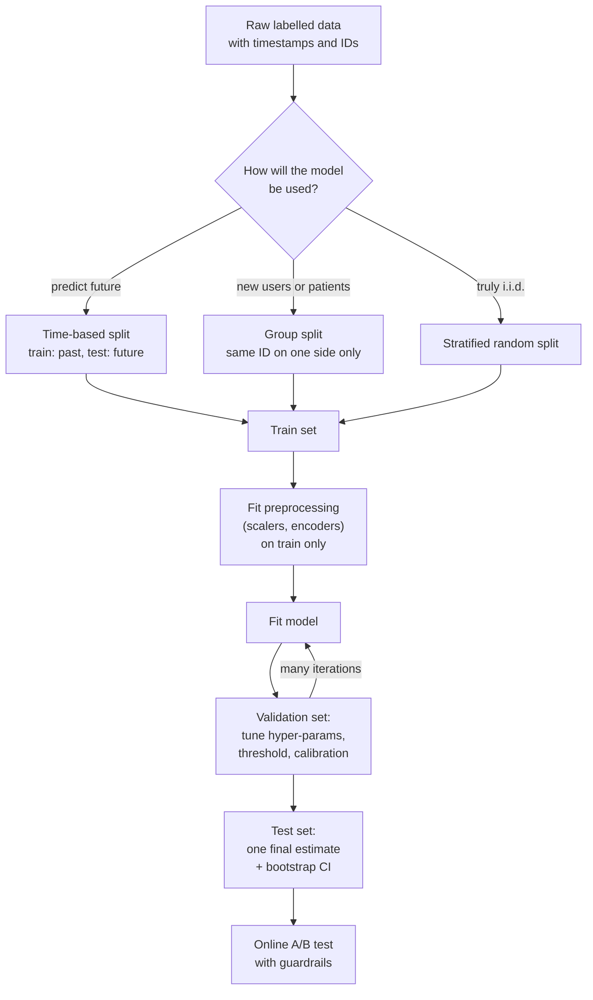
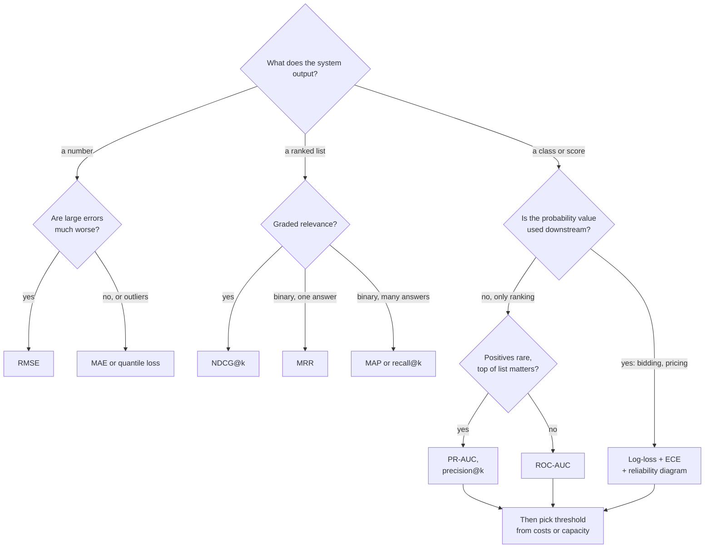
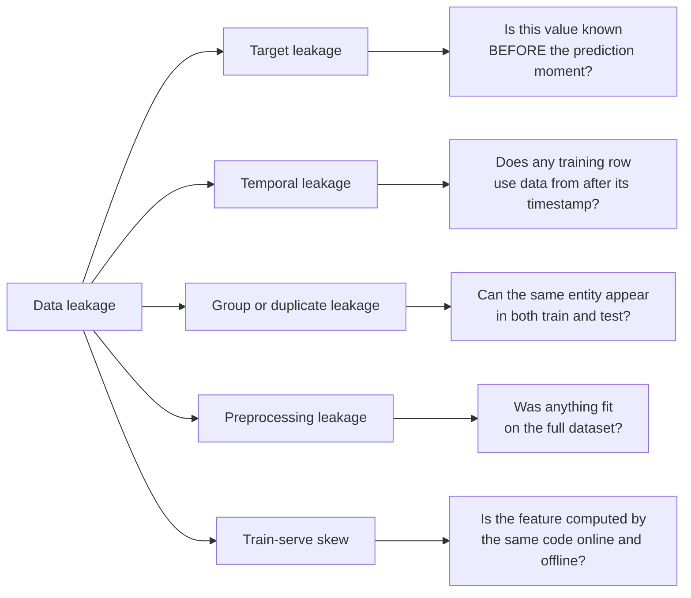
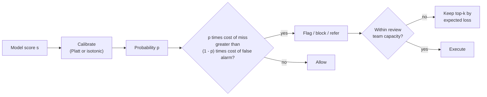

# M04 — Evaluation, data & features

> **Big idea.** A model is only as good as the *question you ask it to be good at*: choose the split that mimics deployment, the metric that mimics the business cost, and the features that will exist at serving time — get any of these wrong and every number you report is fiction.

**Prerequisites:** [M01 First principles](01-ml-first-principles.md), [M03 Linear & logistic regression](03-linear-and-logistic-regression.md) · **Lab:** [labs/03_metrics_from_scratch.py](../labs/03_metrics_from_scratch.py) · **Time:** 2 × 90 min

## Learning objectives

- **Design** a train/validation/test protocol (random, grouped, or time-based) that matches how a model will be used, and justify it.
- **Derive** precision, recall, F1, ROC-AUC, PR-AUC, log-loss, and calibration error from a confusion matrix or a list of scores, and **explain** why ROC-AUC is threshold-free.
- **Choose** a decision threshold from business costs and **compute** it for calibrated probabilities.
- **Diagnose** data leakage (target, temporal, group, train–serve skew) in a described pipeline.
- **Compare** strategies for class imbalance (resampling, class weights, focal loss) and **correct** probabilities after resampling.
- **Engineer** features for numeric, categorical, high-cardinality and missing data, and **compute** ranking metrics (NDCG, MAP, MRR) by hand.

---

## 1. The problem

A hospital asks you to build a model that flags patients for a follow-up cancer screen from routine blood tests. You train a model and report **99% accuracy**. The hospital is delighted — until a statistician points out that only 1% of patients have the disease, so a model that says "healthy" to everyone also scores 99%. Your model may be useless.

You fix the metric, retrain, and report a recall of 92% on a held-out set. Six months after deployment, recall in the clinic is 61%. Investigating, you discover that one of your strongest features was "number of oncology appointments in the last 90 days" — which, of course, mostly exists *because* someone already suspected cancer. The model learned to read the doctor's mind, not the blood.

Meanwhile the fraud team next door has a different problem: their model outputs a score from 0 to 1, and they must pick a cut-off. Blocking a good customer costs about \$10 in support and churn; letting a fraudulent \$500 purchase through costs \$500. Should the cut-off be 0.5? (No — and by the end of this module you will compute the right one in one line.)

All three failures have nothing to do with the learning algorithm. They are failures of **evaluation** (wrong metric), **data** (leakage), and **decision-making** (wrong threshold). These are also, not coincidentally, the three things ML system design interviewers probe hardest, because they are what separates a model that demos well from a model that works.

---

## 2. First principles

### 2.1 Why we hold data out at all

Recall from M01: we want low **generalization error** — the expected loss on *new* data from the deployment distribution $\mathcal{D}$:

$$R(f) = \mathbb{E}_{(x,y)\sim\mathcal{D}}[\ell(f(x), y)].$$

We cannot compute this expectation; we only have a finite sample. The training loss is a *biased* estimate of $R(f)$ because $f$ was chosen to make that very loss small. The simplest unbiased estimate is the average loss on data the model has **never influenced**. That single sentence is the entire justification for held-out sets, and it tells us the rule: *any* decision informed by a dataset — fitting weights, picking hyper-parameters, choosing features, choosing a threshold — "uses up" that dataset's unbiasedness.

Hence three roles:

| Split | Used for | Touched how often |
|---|---|---|
| **Train** | fitting parameters | every step |
| **Validation** | choosing hyper-parameters, features, thresholds, early stopping | many times |
| **Test** | the one final, unbiased estimate | once, at the end |

If you look at the test set 50 times while tuning, it has silently become a second validation set, and your reported number is optimistically biased — this is how public leaderboards get overfit.

### 2.2 The split must mimic deployment

"Hold out a random 20%" assumes examples are **i.i.d.** (independent, identically distributed). Real data usually violates this in one of two ways:

1. **Time.** You train on the past and predict the future. A random split lets the model see Tuesday's data while being tested on Monday's — it can "remember the future" (e.g., a fraud ring that appears in both splits). Use a **time-based split**: train on weeks 1–8, validate on week 9, test on week 10.
2. **Groups.** Multiple rows share an identity (a patient with several X-rays, a user with many sessions). A random split puts the same patient in train and test; the model can recognise the *patient*, not the disease. Use a **group split**: all rows of a patient go to the same side.

> **Rule of thumb:** ask "at prediction time in production, what will the model *not* have seen?" and make sure the test set has not been seen in exactly that way.

### 2.3 Cross-validation: squeezing more from small data

With 500 labelled examples, a single 100-row validation set gives a noisy estimate. **k-fold cross-validation** splits the data into $k$ folds, trains $k$ times each time holding out one fold, and averages the $k$ scores. Every example is used for validation exactly once; the variance of the estimate drops, and the spread across folds tells you how stable the model is. Cost: $k$ times the training compute — fine for small tabular data, rarely used for large deep models.

Variants: **stratified** k-fold keeps the class ratio equal in each fold (essential under imbalance); **group** k-fold keeps groups intact; **time-series (forward-chaining)** CV uses expanding windows: train on $[1..t]$, validate on $t+1$, for several $t$.

### 2.4 From scores to decisions: the confusion matrix

A classifier usually outputs a **score** $s(x)$ (often a probability). A **decision** needs a threshold $t$: predict positive iff $s(x) \ge t$. For a fixed $t$, every example falls into one of four cells:

| | Predicted positive | Predicted negative |
|---|---|---|
| **Actually positive** | TP (true positive) | FN (false negative, "miss") |
| **Actually negative** | FP (false positive, "false alarm") | TN (true negative) |

Every threshold-dependent classification metric is just a ratio of these four counts. The key ones answer different questions:

- **Precision** $= \frac{TP}{TP+FP}$ — "when I raise an alarm, how often am I right?" (cost of acting on alarms).
- **Recall** (sensitivity, TPR) $= \frac{TP}{TP+FN}$ — "of all real positives, what fraction did I catch?" (cost of misses).
- **Specificity** $= \frac{TN}{TN+FP}$; **False positive rate** FPR $= 1 - $ specificity $= \frac{FP}{FP+TN}$.
- **F1** $= \frac{2PR}{P+R}$ — the harmonic mean; it is low if *either* is low. $F_\beta = \frac{(1+\beta^2)PR}{\beta^2 P + R}$ weights recall $\beta$ times as much as precision.
- **Accuracy** $= \frac{TP+TN}{\text{all}}$ — misleading whenever classes are imbalanced.

**Worked example — medical screening.** 10,000 people, prevalence 1% (100 sick). A test with 90% recall and 95% specificity gives:

| | Pred. sick | Pred. healthy |
|---|---|---|
| Sick (100) | TP = 90 | FN = 10 |
| Healthy (9,900) | FP = 495 | TN = 9,405 |

Accuracy $= 9{,}495/10{,}000 = 94.95\%$ — *lower* than the useless "always healthy" model (99%). Yet this test catches 90 of 100 cancers. Precision $= 90/585 = 15.4\%$: most alarms are false, which is acceptable for a cheap follow-up test but not for surgery. This is the **base-rate effect**: when positives are rare, even a good test produces mostly false alarms. Your metric must be chosen with the base rate in mind.

### 2.5 Threshold-free evaluation: ROC and PR curves

The threshold is a *business* decision that may change next quarter; we want to evaluate the *ranking quality* of the scores separately. Sweep $t$ from $+\infty$ (nothing flagged) to $-\infty$ (everything flagged) and plot:

- **ROC curve:** TPR (y) vs FPR (x). Starts at (0,0), ends at (1,1). The diagonal is random guessing.
- **PR curve:** precision (y) vs recall (x). The random baseline is a horizontal line at the positive rate $\pi$.

**Why ROC-AUC is threshold-free — the probabilistic meaning.** The area under the ROC curve equals

$$\text{AUC} = P\big(s(x^+) > s(x^-)\big) + \tfrac12 P\big(s(x^+) = s(x^-)\big),$$

the probability that a randomly chosen positive is scored higher than a randomly chosen negative. *Sketch of why:* sort all examples by score. Each time the sweep passes a negative, the curve steps right by $1/N$; the height at that moment is the fraction of positives already passed, i.e., the fraction of positives scored *above* that negative. Summing height × width over all negatives is exactly the average, over negatives, of "fraction of positives ranked above me" — the pairwise probability. Consequences:

- AUC depends only on the **ordering** of scores — any strictly increasing transform ($\log$, $\times 3$, calibration) leaves it unchanged. It says nothing about whether $0.8$ means "80%".
- AUC uses only TPR and FPR, each normalised *within* its own class, so it **does not change with the class ratio**.

**Worked example.** Positives scored $\{0.9, 0.8, 0.4\}$, negatives $\{0.7, 0.3, 0.2\}$. Of the 9 (pos, neg) pairs, $0.9$ beats 3, $0.8$ beats 3, $0.4$ beats 2: AUC $= 8/9 \approx 0.889$. The lab verifies this identity numerically on 20,000 points and with ties.

**Why PR-AUC exists.** Under heavy imbalance, ROC's insensitivity to class ratio becomes a *bug*. In the lab, the same score distributions give ROC-AUC $\approx 0.98$ at 50% positives *and* at 0.5% positives — but PR-AUC falls from 0.98 to 0.57. Why: FPR divides by the huge number of negatives, so 1,000 false alarms among 1,000,000 negatives is an FPR of only 0.1% (looks great on ROC), but if there are only 500 positives those false alarms swamp precision. When the positive class is rare *and* what you care about is the quality of the top of the list (fraud review queue, rare-disease screening), report **PR-AUC (average precision)**:

$$\text{AP} = \sum_k (R_k - R_{k-1})\, P_k,$$

where $P_k, R_k$ are precision and recall at the $k$-th threshold.

| Situation | Prefer |
|---|---|
| Balanced-ish classes, care about overall ranking | ROC-AUC |
| Rare positives, care about alarms you act on | PR-AUC, precision@k, recall at fixed precision |
| Need actual probabilities (bidding, expected value) | Log-loss + calibration |
| One operating point is fixed by policy | Recall at precision ≥ X (or vice versa) |

### 2.6 Probabilities that mean what they say: log-loss and calibration

Many systems use the *value* of the score, not just its rank: an ad auction bids $\text{bid} \times P(\text{click})$; an insurer prices $P(\text{claim}) \times \text{cost}$. A score that ranks perfectly but says 0.9 when the truth is 0.3 will overspend massively.

**Log-loss** (cross-entropy, M02) is the negative log-likelihood of the labels:

$$\mathcal{L} = -\frac{1}{n}\sum_i \big[y_i \log p_i + (1-y_i)\log(1-p_i)\big].$$

It is a **proper scoring rule**: its expectation is minimised only by reporting the true probability. Worked numbers for a positive example: $p=0.9 \Rightarrow 0.105$; $p=0.5 \Rightarrow 0.693$; $p=0.01 \Rightarrow 4.6$. One confident mistake costs as much as ~44 mildly-right answers, so log-loss is dominated by overconfidence. Always compare it to the **baseline** that predicts the base rate $\pi$ for everyone: $-[\pi\log\pi + (1-\pi)\log(1-\pi)]$ (0.056 for $\pi=1\%$). "Normalized entropy" (log-loss ÷ baseline), used in Facebook's ads paper, makes this comparison explicit.

**Calibration** asks: among all examples where the model said $p \approx 0.7$, are ~70% actually positive? A **reliability diagram** bins predictions (e.g., 10 bins), and plots the mean predicted probability (x) against the observed positive fraction (y); perfect calibration is the diagonal. The summary number is the **Expected Calibration Error**:

$$\text{ECE} = \sum_{b=1}^{B} \frac{n_b}{n}\, \big|\, \text{acc}_b - \text{conf}_b \,\big|.$$

Fixing calibration *after* training, on a held-out calibration set:

- **Platt scaling:** fit $p' = \sigma(a\,s + b)$ — a one-feature logistic regression on the model's logit $s$. Two parameters; good when distortion is sigmoid-shaped (SVMs, boosted trees).
- **Isotonic regression:** fit the best *monotone non-decreasing* step function from score to probability (pool-adjacent-violators algorithm). More flexible; needs more data (thousands of points) or it overfits.
- **Histogram binning:** replace each bin's score by its observed rate (what the lab implements).

All three are monotone, so **AUC is unchanged** — calibration fixes the *values*, ranking stays the same.

### 2.7 Choosing a threshold from business costs

Suppose $p = P(y=1 \mid x)$ is calibrated, a false positive costs $c_{FP}$ and a false negative costs $c_{FN}$ (correct decisions cost 0). For one example:

- Flag it: expected cost $= (1-p)\, c_{FP}$ (we're wrong if it's negative).
- Don't flag it: expected cost $= p\, c_{FN}$.

Flag iff $p\, c_{FN} > (1-p)\, c_{FP}$, i.e.

$$\boxed{\,t^* = \frac{c_{FP}}{c_{FP} + c_{FN}}\,}$$

**Fraud worked example:** $c_{FP} = \$10$, $c_{FN} = \$500 \Rightarrow t^* = 10/510 \approx 0.02$. You should block a transaction that is only 2% likely to be fraud! The threshold 0.5 is optimal only when the two errors cost the same. In the lab, moving from 0.5 to the cost-optimal threshold cuts total cost from about \$81k to \$19k on the same model.

Three caveats a strong engineer raises: (1) the formula needs *calibrated* probabilities — otherwise tune $t$ empirically on validation data; (2) costs often vary per example (a \$5 vs \$5,000 transaction), giving a per-example rule $p \cdot \text{amount} > c_{FP}$; (3) **capacity constraints** override costs — if the review team can handle 2,000 cases/day, the threshold is whatever flags 2,000 cases (precision@k becomes the metric).

### 2.8 Regression metrics

| Metric | Formula | Optimal constant predictor | Notes |
|---|---|---|---|
| MSE / RMSE | $\frac1n\sum (y-\hat y)^2$, $\sqrt{\text{MSE}}$ | mean | Punishes large errors quadratically; outlier-sensitive |
| MAE | $\frac1n\sum \lvert y-\hat y\rvert$ | median | Robust; in the target's units |
| MAPE | $\frac1n\sum \lvert (y-\hat y)/y \rvert$ | — | Scale-free, but explodes near $y=0$ and favours under-prediction |
| $R^2$ | $1 - \text{SSE}/\text{SST}$ | — | Fraction of variance explained vs predicting the mean |
| Quantile (pinball) loss | $\max(\tau e, (\tau-1)e)$ with $e = y-\hat y$ | $\tau$-quantile | For "90% of deliveries arrive before…" |

Worked: errors $\{1, -2, 3, 10\}$ give MAE $=4$ but RMSE $=\sqrt{114/4} \approx 5.34$ — the single error of 10 dominates RMSE. Pick the metric whose optimal predictor matches what the business wants: ETA systems often report MAE *and* a high quantile, because users hate being late more than being early.

### 2.9 Ranking metrics (preview of M09)

When the output is an ordered list (search results, feed, recommendations), what matters is *where* the relevant items land.

- **MRR (mean reciprocal rank):** for each query, $1/\text{rank of first relevant result}$, averaged. Queries with first relevant at ranks 1, 3, and 2 give $\text{MRR} = (1 + \frac13 + \frac12)/3 = 0.611$. Good for "one right answer" tasks (navigational search, QA).
- **MAP (mean average precision):** for one query, average the precision@k at each position $k$ holding a relevant item. Relevant items at positions 1, 3, 5 (3 relevant in total): $\text{AP} = (1/1 + 2/3 + 3/5)/3 = 0.756$. MAP averages AP over queries. Uses binary relevance.
- **NDCG@k (normalized discounted cumulative gain):** handles *graded* relevance (0 = bad … 3 = perfect) and discounts lower positions logarithmically:

$$\text{DCG@}k = \sum_{i=1}^{k} \frac{2^{\text{rel}_i} - 1}{\log_2(i+1)}, \qquad \text{NDCG@}k = \frac{\text{DCG@}k}{\text{IDCG@}k},$$

where IDCG is the DCG of the ideal (sorted) ordering, so NDCG $\in [0,1]$.

**Worked example:** a ranker returns items with relevance $[3, 2, 0, 1]$.
DCG@4 $= \frac{7}{1} + \frac{3}{1.585} + \frac{0}{2} + \frac{1}{2.322} = 7 + 1.893 + 0 + 0.431 = 9.323$.
Ideal order $[3,2,1,0]$: IDCG@4 $= 7 + 1.893 + \frac{1}{2} + 0 = 9.393$. NDCG@4 $= 9.323/9.393 = 0.993$. Swapping the last two items barely hurts because positions 3–4 are heavily discounted; putting the "3" at the bottom would hurt a lot.

### 2.10 Class imbalance

With 0.1% positives, a model trained with plain log-loss sees 1,000 negatives per positive; gradients are dominated by easy negatives, and the model may learn little about positives. Options, in order of what to try:

1. **Do nothing to the data; fix the metric and threshold.** Gradient-boosted trees and logistic regression often do fine with imbalance if you evaluate with PR-AUC and pick the threshold by cost. Many "imbalance problems" are really "I used accuracy and 0.5" problems.
2. **Class weights:** multiply each positive's loss by $w > 1$ (often $w = N_{neg}/N_{pos}$ or its square root). Same effect in expectation as oversampling, without duplicating rows.
3. **Resampling:** *undersample* negatives (fast, common in ads/fraud at scale: keep 1–10% of negatives) or *oversample* positives (duplicate or synthesise — SMOTE interpolates between neighbouring positives; it helps less than people hope on real tabular data).
4. **Focal loss** (Lin et al., object detection): $\text{FL} = -(1-p_t)^\gamma \log p_t$, where $p_t$ is the probability assigned to the true class. With $\gamma=2$, an easy example at $p_t = 0.9$ has its loss scaled by $(0.1)^2 = 0.01$; a hard one at $p_t=0.1$ keeps $0.81$ of it. Training focuses on hard examples automatically.

**Correction after resampling.** Undersampling negatives with keep-rate $w$ inflates predicted probabilities. If the model trained on the sampled data outputs $q$, the calibrated probability is

$$p = \frac{q}{q + (1-q)/w}.$$

(e.g., $w=0.1$, $q=0.5 \Rightarrow p = 0.5/(0.5+5) = 0.091$.) Forgetting this in an ads system means bidding ~5× too high — this exact correction is described in Facebook's 2014 ads paper.

### 2.11 Data leakage: when the model cheats

**Leakage** = information available during training/evaluation that will *not* be available at prediction time, making offline metrics optimistic. It is the single most common reason a model "works offline but not online". Four families:

1. **Target leakage — a feature is a consequence of the label.** Examples: "oncology appointments" predicting cancer (the opening story); "chargeback_filed" predicting fraud; "account_closed_reason" predicting churn; in a well-known Kaggle competition, an ID column correlated with the target because of how data was collected. *Test:* for every feature ask "at the moment of prediction, has this value already been determined?" Suspiciously high single-feature importance is a red flag.
2. **Temporal leakage — the future in the past.** Random splits on time-ordered data; features computed with aggregates over the whole dataset (e.g., "user's average spend" computed over all time, including after the prediction point); normalising with statistics from the full dataset. *Fix:* time-based splits and **point-in-time correct** feature joins — each training row only sees feature values as they were at its timestamp.
3. **Group/duplicate leakage.** Same patient, user, device, or near-duplicate image in train and test. A widely cited case: chest X-ray models that, under random image-level splits, partly recognised *patients* and *hospital scanners* rather than disease. *Fix:* group splits, deduplication (M06).
4. **Preprocessing leakage.** Fitting scalers, imputers, feature selection, or target encoding on all data before splitting. Target encoding (replacing a category by its mean label) is especially dangerous: computed on the full data it directly encodes the test labels. *Fix:* fit all preprocessing inside the training fold only (a "pipeline").

A cousin of leakage is **train–serve skew**: the feature *exists* at serving time but is computed *differently*. The batch pipeline computes "transactions in last 24h" from a cleaned warehouse table at midnight; the online service computes it from a real-time stream that drops late events. The model sees a different distribution in production than in training. *Fixes:* compute features once and share the code (a **feature store**, M11), log features at serving time and train on the logged values ("log-and-wait"), and monitor feature distributions online vs offline.

### 2.12 Feature engineering: turning the world into vectors

Models consume numbers; the world provides timestamps, strings, categories, and gaps. The principle: *make the pattern you believe exists easy for the model's inductive bias to express.*

- **Scaling numeric features.** Standardisation $z = (x-\mu)/\sigma$ or min-max scaling matters for distance-based methods (k-NN, k-means), regularised linear models, and neural nets (conditioning of the loss surface, M02). Trees are invariant to monotone transforms — they don't care. For heavy-tailed values (income, counts), $\log(1+x)$ often helps more than scaling.
- **Bucketing (discretisation).** Turn age into $[0\text{–}18), [18\text{–}25), \ldots$. Lets a *linear* model learn a non-monotone effect (risk is high for very young and very old drivers). Quantile buckets adapt to the data.
- **One-hot encoding.** A category with $V$ values becomes a $V$-dimensional indicator. Fine for small $V$ (country, device type). Rare categories → an "OTHER" bucket.
- **Feature hashing.** For huge or open vocabularies (user IDs, URLs, search terms), map value $v$ to index $h(v) \bmod 2^{b}$. Fixed memory, no vocabulary to maintain, handles never-seen values; the price is **collisions** (two values share a slot). With $2^{20}$ buckets and 100k active values, collisions are rare enough that linear models barely notice. Widely used in large-scale ads/CTR systems.
- **Embeddings.** Learn a dense vector (e.g., 32-d) per category, trained end-to-end (M07–M08). Unlike one-hot, similar categories end up near each other, so knowledge transfers between them. This is how modern recommenders represent users, items, and queries.
- **Feature crosses.** The conjunction of two features, e.g., `country × hour_of_day`, as a new categorical feature. A linear model cannot express "this ad works in Brazil in the evening" without it. Trees and neural nets learn interactions implicitly, which is one reason they replaced hand-built crosses (Google's Wide & Deep keeps both).
- **Missing values.** First ask *why* it's missing — missingness is often informative ("no previous loan" ≠ "unknown"). Standard recipe: impute (median/mode, or a constant) **and** add a binary `is_missing` indicator so the model can learn the difference. Gradient-boosted trees (XGBoost, LightGBM) learn a default direction for missing values at each split.
- **Aggregates and time features.** Counts and rates over windows ("purchases in last 1h/24h/7d"), recency ("seconds since last login"), cyclical encodings of time ($\sin, \cos$ of hour) — the bread and butter of fraud and recommendation features, and the main source of temporal leakage if not point-in-time correct.

### 2.13 Offline vs online metrics

Offline metrics (AUC, NDCG on logged data) are proxies; the business cares about online metrics (revenue, retention, fraud losses, time-to-diagnosis) measured in an A/B test (M12). They disagree because: logged data only contains outcomes for items the *old* model showed (selection bias); the new model changes user behaviour (feedback loops); the offline metric ignores latency, diversity, or novelty; and calibration matters online but not for AUC. Practice: use offline metrics to *filter* candidates cheaply, then decide with an online experiment that has **guardrail metrics** (latency, complaint rate, revenue) that must not regress.

---

## 3. The algorithm(s)

### 3.1 Evaluation protocol (pseudocode)

```
EVALUATE(model_family, data, hyperparam_grid):
    split data -> train | val | test           # time- or group-based if needed
    for h in hyperparam_grid:
        fit preprocessing on train only        # scalers, encoders, imputers
        fit model(h) on train
        score_h = metric(model(h), val)
    h* = argmax score_h
    refit preprocessing + model(h*) on train ∪ val   # optional
    choose threshold t* on val (cost-based or capacity-based)
    report metric(model(h*), test) ONCE, with a confidence interval (bootstrap)
```

### 3.2 ROC curve and AUC in $O(n \log n)$

```
ROC(y, s):
    sort examples by s descending
    TP = cumulative sum of y ; FP = cumulative sum of (1 - y)
    keep only the last index of each run of tied scores
    TPR = TP / P ; FPR = FP / N  (prepend the point (0,0))
    AUC = Σ (FPR_i − FPR_{i−1}) · (TPR_i + TPR_{i−1}) / 2      # trapezoid rule
```

Equivalent rank formula (Mann–Whitney): with $r_i$ the rank of example $i$ in ascending score order (ties averaged),
$\text{AUC} = \big(\sum_{i: y_i=1} r_i - \frac{P(P+1)}{2}\big) / (P\cdot N)$.

**Complexity.** Sorting dominates: $O(n\log n)$ time, $O(n)$ memory. Naive pairwise counting is $O(P\cdot N)$ — infeasible for millions of rows. Calibration bins: $O(n)$. NDCG@k: $O(k)$ per query after sorting.

### 3.3 Cost-optimal threshold

```
THRESHOLD(p_val, y_val, c_FP, c_FN):
    if p is calibrated: return c_FP / (c_FP + c_FN)
    else: for t in grid: cost(t) = c_FP·FP(t) + c_FN·FN(t); return argmin
```

---

## 4. Diagrams

**Data flow of a leak-free evaluation pipeline.** Note that the test set is touched exactly once and preprocessing is fit only on training data.



**Decision logic: which metric should I report?**



**Taxonomy of leakage — and the question that catches each one.**



**From score to action: threshold selection with costs and capacity.**



---

## 5. Code

The lab [labs/03_metrics_from_scratch.py](../labs/03_metrics_from_scratch.py) implements everything below and self-checks. The heart of it:

```python
import numpy as np

def roc_auc(y, s):
    order = np.argsort(-s, kind="mergesort")
    y, s = y[order], s[order]
    tps, fps = np.cumsum(y), np.cumsum(1 - y)
    idx = np.r_[np.where(np.diff(s))[0], len(s) - 1]   # end of each tie group
    tpr = np.r_[0, tps[idx] / y.sum()]
    fpr = np.r_[0, fps[idx] / (len(y) - y.sum())]
    return np.sum(np.diff(fpr) * (tpr[1:] + tpr[:-1]) / 2)   # trapezoid rule

def ndcg_at_k(rel, k):
    rel = np.asarray(rel, float)
    disc = 1 / np.log2(np.arange(2, k + 2))
    dcg = np.sum((2 ** rel[:k] - 1) * disc[: len(rel[:k])])
    ideal = np.sort(rel)[::-1][:k]
    return dcg / np.sum((2 ** ideal - 1) * disc[: len(ideal)])

def cost_threshold(c_fp, c_fn):          # valid for calibrated probabilities
    return c_fp / (c_fp + c_fn)
```

**Library equivalents** (what the library hides is exactly the code above):

```python
from sklearn.metrics import (confusion_matrix, precision_recall_fscore_support,
    roc_auc_score, average_precision_score, log_loss, ndcg_score)
from sklearn.calibration import CalibratedClassifierCV, calibration_curve
from sklearn.model_selection import StratifiedKFold, GroupKFold, TimeSeriesSplit
from sklearn.pipeline import make_pipeline   # preprocessing fit inside each fold -> no leakage
```

---

## 6. Real-world applications

1. **Medical screening (e.g., mammography, diabetic retinopathy).** *Task:* refer patients for follow-up. *Why these metrics:* missing a disease is far costlier than an extra exam, so systems are tuned to a high **sensitivity** operating point and reported as sensitivity/specificity at that point (Google's diabetic-retinopathy work reported both at chosen operating points). *Constraint:* low prevalence makes precision low even for good models; patient-level splits and evaluation on data from *other hospitals* are needed to avoid scanner/site leakage.
2. **Card fraud (e.g., Stripe Radar, bank card networks).** *Task:* block, challenge (3-D Secure), or allow each transaction in < 100 ms. *Why:* fraud rates are well under 1%, so PR-AUC and recall at a fixed false-positive rate are the offline metrics; thresholds are chosen per merchant from costs (chargeback + goods vs lost sale), often with a middle "challenge" band. Stripe has publicly described letting merchants trade off fraud vs false-positive rate. *Constraint:* labels (chargebacks) arrive weeks later, so evaluation must use a time-based split with a label-maturity delay.
3. **Ads click-through prediction (Facebook, Google).** *Task:* predict $P(\text{click})$ for auction pricing. *Why:* the probability *value* enters the bid, so log-loss / normalized entropy and calibration are the core metrics; AUC alone is insufficient. Negative downsampling with re-calibration is standard (Facebook 2014). *Constraint:* billions of events/day — hashing tricks and feature crosses keep features tractable.
4. **Search ranking (web, e-commerce).** *Task:* order results. *Why:* NDCG@10 on human-graded relevance offline; click-through, successful sessions, and revenue online. *Constraint:* position bias in click logs — users click the top result partly *because* it's on top — so naive offline evaluation on clicks favours the old ranker.

---

## 7. System-design hook

Evaluation is a dedicated phase of every ML system design interview (see [M10](../system-design/10-ml-system-design-framework.md)). Interviewers probe:

- **"How will you split the data?"** Strong answer: "Time-based, because we predict future transactions; plus I'll make sure no user's fraud ring spans the boundary, and I'll leave a gap equal to the label delay (chargebacks take ~60 days)."
- **"Which offline metric?"** Tie it to the decision: "PR-AUC because fraud is 0.1% of traffic and analysts act on the top of the list; recall at 1% FPR as the operating-point metric; log-loss because the score feeds an expected-loss rule."
- **"Which online metric, and guardrails?"** "Fraud loss in dollars per 1k transactions (primary), false-decline rate and checkout conversion (guardrails), p99 latency."
- **"How do you set the threshold?"** Derive $t^* = c_{FP}/(c_{FP}+c_{FN})$, then mention calibration, per-amount costs, and capacity.
- **"Your offline AUC improved but the A/B test is flat — why?"** Leakage, train–serve skew, selection bias in logged data, a metric that doesn't capture the business goal, or the improvement being in a region of the ranking that doesn't affect decisions.

Typical trade-offs to verbalise: recall vs precision (and who pays for each error), metric simplicity vs fidelity, fast offline iteration vs slow but true online measurement, and feature freshness vs train–serve consistency.

---

## 8. Pitfalls & debugging

| Symptom | Likely cause | How to detect | Fix |
|---|---|---|---|
| Offline metric "too good to be true" (AUC 0.99 on a hard problem) | Target or temporal leakage | Single-feature AUCs; ablate top features; check feature timestamps | Remove/lag feature; point-in-time joins |
| Great offline, poor online | Train–serve skew, selection bias | Compare logged serving features vs training features (distributions, exact values for same IDs) | Shared feature code / feature store; log-and-train |
| High accuracy, useless model | Imbalance + accuracy metric | Compare to "always majority" baseline | PR-AUC, recall@precision, cost |
| Good AUC, terrible spend/bids | Miscalibration (e.g., after downsampling) | Reliability diagram, ECE, sum of predictions vs actual positives | Platt/isotonic; prior correction formula |
| Metric jumps around between runs | Small validation set | Bootstrap CI; k-fold spread | More data, CV, report intervals |
| Test score drifts down over months | Distribution shift | Monitor input and score distributions (M12) | Retrain cadence; time-based validation |
| Hyper-parameters "great" on test, worse later | Test set reused for tuning | Audit how often test was evaluated | Fresh holdout; strict protocol |
| Model "detects" disease from image corners | Site/scanner confounding | Saliency maps; per-site evaluation | Group-by-site split; external validation |

---

## 9. Exercises

**Conceptual**
1. ★ Explain why a model that ranks perfectly can still have terrible log-loss. Give a numeric example.
2. ★ A colleague does 5-fold CV on a year of daily sales data with random folds. What goes wrong, and what should they do?
3. ★★ Why does ROC-AUC not change when you duplicate every negative example 10 times, while PR-AUC does? Answer from the definitions of TPR, FPR and precision.
4. ★★ You undersample negatives at 5% for training a CTR model. List every downstream component that needs to know this.

**Derivation / math**
5. ★★ Prove that the trapezoid area under the ROC curve equals $P(s^+ > s^-) + \frac12 P(s^+ = s^-)$ (hint: consider one vertical strip per negative).
6. ★★ Derive the prior-correction formula $p = q / (q + (1-q)/w)$ using Bayes' rule and the fact that undersampling multiplies the negative-class prior by $w$.
7. ★ Compute NDCG@3 for relevance list $[0, 3, 2, 3]$. Then compute MAP for the binary version (relevant iff rel ≥ 2).

**Coding**
8. ★★ Lab exercise 3: implement Platt scaling and compare its ECE with histogram binning.
9. ★★ Implement time-series forward-chaining CV and show (on synthetic data with a trend) that random k-fold over-estimates performance.

**Design**
10. ★★★ A telehealth company wants to triage incoming symptom reports into "urgent" vs "routine". Specify the split, offline metrics, operating-point rule, online metrics, and two leakage risks specific to this problem.

---

## 10. Interview questions

<details><summary>Q1. Your fraud model has 99.9% accuracy. Is it good?</summary>

Unknown and probably not informative: if fraud is 0.1% of transactions, predicting "legit" always gives 99.9%. Ask for the confusion matrix, PR-AUC, and recall at the operating false-positive rate, and compare against the majority-class baseline. Then tie the operating point to costs: block if $p > c_{FP}/(c_{FP}+c_{FN})$.
</details>

<details><summary>Q2. ROC-AUC vs PR-AUC — when do you use each, and why is AUC threshold-free?</summary>

ROC-AUC equals the probability a random positive is scored above a random negative; it depends only on the ordering of scores, so no threshold is needed and it is invariant to class ratio. That invariance hides false-positive explosions when positives are rare (a tiny FPR times a huge number of negatives can swamp the positives), so for rare-positive problems where you act on the top of the list, use PR-AUC / precision@k. Use ROC-AUC for roughly balanced problems or when comparing ranking quality across datasets with different base rates.
</details>

<details><summary>Q3. What is calibration and when does it matter?</summary>

A model is calibrated if, among examples predicted at $p$, a fraction $p$ are positive. It matters whenever the value is consumed: ad auctions (bid × pCTR), expected-loss thresholds, combining scores from several models, showing risk to doctors. Check with a reliability diagram and ECE; fix with Platt scaling or isotonic regression on a held-out set. Calibration doesn't change AUC.
</details>

<details><summary>Q4. Give three real examples of data leakage and how you would catch them.</summary>

(1) Target leakage: a "chargeback filed" or "account closed" feature that is set after the label event — catch by auditing each feature's availability timestamp and by suspiciously dominant single features. (2) Temporal leakage: random splits on time series or user aggregates computed over all time — use time-based splits and point-in-time feature joins. (3) Group leakage: same patient/user in train and test — group splits; or preprocessing (target encoding) fit on all data — fit inside folds.
</details>

<details><summary>Q5. How do you handle a 1:1000 class imbalance?</summary>

First, evaluate correctly (PR-AUC, recall@precision) and choose the threshold from costs — often enough. Then consider class weights or negative undersampling (fast at scale) with probability re-correction $p = q/(q+(1-q)/w)$; focal loss for deep models with many easy negatives. Oversampling/SMOTE is a last resort. Always keep the validation/test set at the true distribution.
</details>

<details><summary>Q6. Offline NDCG improved 3%, but the online A/B test shows no change. What could be going on?</summary>

Offline labels come from logs generated by the old ranker (selection and position bias), so the offline gain may be in items users never see; train–serve skew in features; the metric's top-k doesn't match the UI; leakage inflating offline; novelty/diversity effects; or the test is underpowered. Investigate by checking feature parity, slicing the result, and running an interleaving experiment, which is more sensitive for rankers.
</details>

<details><summary>Q7. Explain feature hashing and its trade-off vs embeddings.</summary>

Hashing maps a categorical value to $h(v) \bmod 2^b$ — fixed memory, no vocabulary, handles unseen values, trivially parallel. The cost is collisions and no notion of similarity. Embeddings learn a dense vector per value (or per hashed bucket), so similar items share statistical strength, but need a vocabulary/ID mapping, more memory, and training. Large systems often hash IDs into buckets and then learn an embedding per bucket.
</details>

<details><summary>Q8. When would you choose MAE over RMSE?</summary>

When outliers/heavy tails shouldn't dominate, or when the business cost is linear in error. MAE's optimal constant is the median, RMSE's is the mean. If over- and under-prediction cost differently (late vs early delivery), use quantile (pinball) loss at the appropriate quantile.
</details>

---

## Further reading

- Fawcett, T. (2006). *An introduction to ROC analysis.* Pattern Recognition Letters 27(8).
- Saito, T. & Rehmsmeier, M. (2015). *The Precision-Recall Plot Is More Informative than the ROC Plot When Evaluating Binary Classifiers on Imbalanced Datasets.* PLOS ONE.
- Guo, C. et al. (2017). *On Calibration of Modern Neural Networks.* ICML. (Reliability diagrams, ECE, temperature scaling.)
- He, X. et al. (2014). *Practical Lessons from Predicting Clicks on Ads at Facebook.* ADKDD. (Normalized entropy, calibration, negative downsampling.)
- Kaufman, S., Rosset, S., Perlich, C. (2012). *Leakage in Data Mining: Formulation, Detection, and Avoidance.* ACM TKDD.
- Huyen, C. (2022). *Designing Machine Learning Systems*, chapters 4–6 (O'Reilly).
