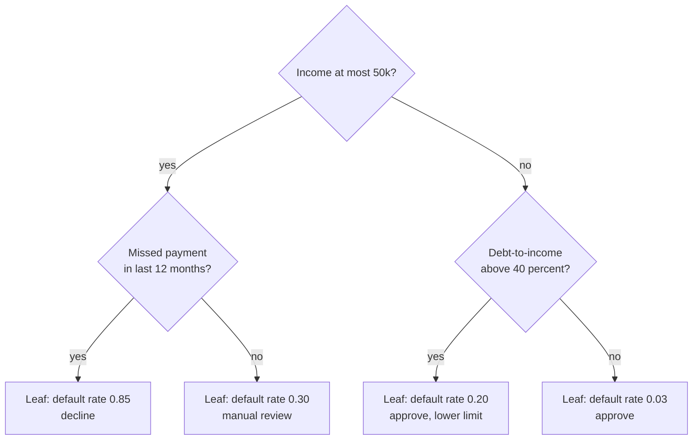
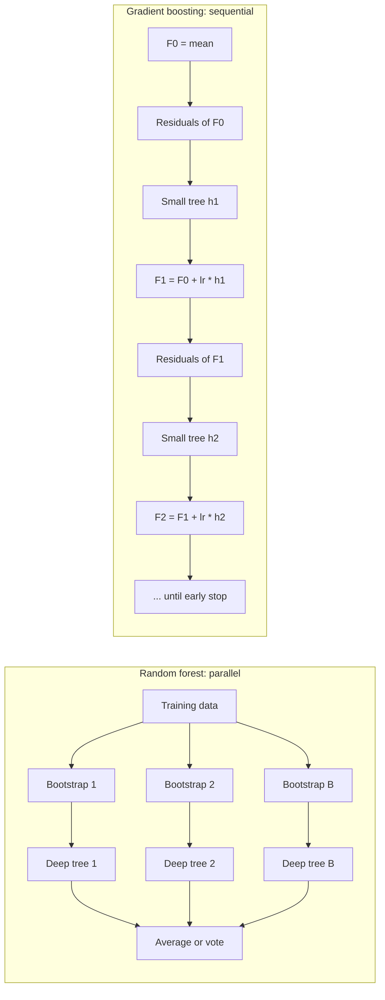
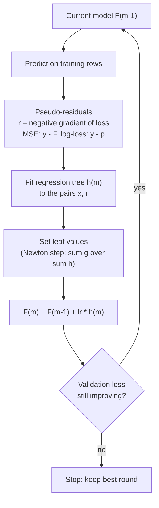
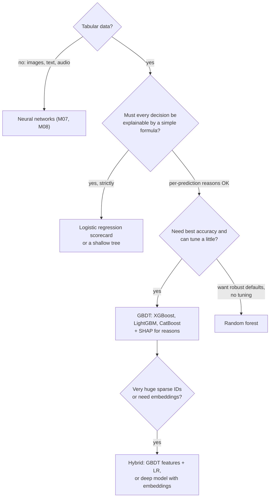

# M05 — Trees & ensembles

> **Big idea.** A decision tree is a greedy question-asker that can fit anything but trusts itself too much; **averaging** many decorrelated trees (random forests) cancels their variance, and **adding** many small trees that each fix the previous mistakes (gradient boosting) is gradient descent in the space of functions — which is why boosted trees still rule tabular data.

**Prerequisites:** [M01 First principles](01-ml-first-principles.md) (bias–variance), [M02 Math toolkit](02-math-toolkit.md) (gradient descent, Taylor expansion), [M04 Evaluation](04-evaluation-and-data.md) · **Lab:** [labs/04_decision_tree_and_boosting.py](../labs/04_decision_tree_and_boosting.py) · **Time:** 2 × 90 min

## Learning objectives

- **Derive** Gini impurity and entropy from first principles and **compute** the information gain of a split by hand.
- **Implement** CART for classification and regression, including the $O(n\log n)$ split search and stopping/pruning rules.
- **Explain** with the variance-of-an-average formula why random forests work and why feature subsampling (decorrelation) is essential; **use** out-of-bag error.
- **Derive** gradient boosting as gradient descent in function space: residual fitting for MSE and pseudo-residuals for log-loss; **explain** XGBoost's second-order leaf weights.
- **Compare** feature-importance methods (impurity, permutation, SHAP) and **diagnose** their failure modes.
- **Choose** between linear models, random forests, GBDTs and neural nets for a tabular problem and defend the choice in an interview.

---

## 1. The problem

A bank must decide, in under a second, whether to approve a credit-card application. It has 40 columns per applicant: income, age, number of existing cards, months since last missed payment (often missing), employment type (categorical), debt-to-income ratio, and so on. The relationships are messy: risk rises sharply when debt-to-income exceeds ~40%, being a student matters only for young applicants, and "months since missed payment = missing" actually means "never missed one" — a *good* sign.

A logistic regression (M03) needs you to hand-craft all of that: bucket debt-to-income, cross student × age, add a missing indicator. Regulators also require the bank to **explain** every rejection ("adverse action reasons"). And the data distribution shifts every few months.

What we want is a model that (1) discovers thresholds and interactions automatically, (2) handles mixed types, different scales and missing values without fuss, (3) can be explained, and (4) is accurate enough to beat the hand-tuned scorecard. Decision trees give us (1)–(3); ensembles of trees give us (4). This combination is why gradient-boosted trees power a huge share of production tabular ML — credit, fraud, pricing, ranking features, churn — and why they win most tabular Kaggle competitions.

---

## 2. First principles

### 2.1 The simplest thing: ask yes/no questions

A human loan officer reasons like "Is income above \$50k? If not, has the applicant missed a payment in the last year?" Each question **partitions** the data; at the end of a chain of questions we have a small group of similar applicants, and we predict the majority label (classification) or the average value (regression) of that group.

Formally, a tree partitions feature space into axis-aligned boxes $R_1, \ldots, R_J$ (the **leaves**) and predicts a constant $c_j$ in each:

$$f(x) = \sum_{j=1}^{J} c_j\, \mathbb{1}[x \in R_j].$$

Two consequences fall straight out of this definition:

- **Scale invariance.** A question "$x_k \le t$" gives the same partition if you apply any monotone transform to $x_k$ (log, standardise). Trees don't need feature scaling.
- **Piecewise constant.** Trees can't extrapolate: beyond the largest training value, the prediction is flat. A tree trained on house prices up to \$2M will never predict \$3M.

Finding the *optimal* tree (fewest leaves, lowest error) is NP-hard. So we do the simplest thing that could work: **grow greedily** — pick the single best question at the root, split, and recurse.

### 2.2 What makes a question "best"? Deriving impurity

We need a number that says how *mixed* a node is; a good split produces children that are purer than the parent. Let $p_k$ be the fraction of class $k$ in a node. Desired properties of an impurity $I(p)$: zero when the node is pure, maximal when classes are uniform, symmetric in the classes, and **strictly concave** (we'll see why).

**Gini impurity — "how often would I be wrong guessing randomly?"** Label a random example from the node by drawing a label at random from the node's own distribution. You draw class $k$ with probability $p_k$ and the example is not class $k$ with probability $1 - p_k$:

$$\text{Gini} = \sum_k p_k (1 - p_k) = 1 - \sum_k p_k^2.$$

Binary case: $2p(1-p)$, max $0.5$ at $p=0.5$.

**Entropy — "how many bits to encode the label?"** From information theory (M02), the average number of bits needed to communicate a label drawn from $p$ is

$$H = -\sum_k p_k \log_2 p_k,$$

max $1$ bit for a 50/50 binary node. The **information gain** of a split is the reduction in entropy — i.e., the *mutual information* between "which child?" and "which class?". It measures how much knowing the answer to the question tells you about the label.

**Split quality.** For a split sending $n_L$ of $n$ examples left and $n_R$ right:

$$\Delta I = I(\text{parent}) - \Big(\tfrac{n_L}{n} I(L) + \tfrac{n_R}{n} I(R)\Big).$$

Because $I$ is concave and the parent distribution is the weighted average of the children's, Jensen's inequality guarantees $\Delta I \ge 0$: **splitting never increases weighted impurity**. That's why we want concavity — and why misclassification rate (which is piecewise linear, not strictly concave) is a poor splitting criterion: many useful splits show zero gain under it.

**Regression trees** use the variance (mean squared error around the node mean) as impurity. The constant minimising $\sum_{i \in R}(y_i - c)^2$ is the mean $\bar y_R$, so each leaf predicts its mean, and the split criterion is the reduction in sum of squared errors.

**Worked example — 10 loan applicants.**

| Income (\$k) | 20 | 25 | 30 | 35 | 40 | 60 | 70 | 80 | 90 | 100 |
|---|---|---|---|---|---|---|---|---|---|---|
| Default | 1 | 1 | 1 | 0 | 1 | 0 | 0 | 0 | 0 | 0 |

Parent: 4 defaults of 10, $p = 0.4$. Gini $= 1 - (0.4^2 + 0.6^2) = 0.48$; entropy $= -(0.4\log_2 0.4 + 0.6 \log_2 0.6) = 0.971$ bits.

Candidate split "income ≤ 50": left = $\{1,1,1,0,1\}$ ($p=0.8$), right = all 0 (pure).
- Gini: left $= 1 - (0.64 + 0.04) = 0.32$, right $= 0$. Weighted $= 0.5 \cdot 0.32 = 0.16$. **Gain $= 0.48 - 0.16 = 0.32$.**
- Entropy: left $= -(0.8\log_2 0.8 + 0.2\log_2 0.2) = 0.722$. **Information gain $= 0.971 - 0.5 \cdot 0.722 = 0.610$ bits.**

Try "income ≤ 32.5": left $\{1,1,1\}$ pure, right $\{0,1,0,0,0,0,0\}$ with Gini $= 2 \cdot \frac17 \cdot \frac67 = 0.245$; weighted $= 0.7 \cdot 0.245 = 0.171$, gain $= 0.309$ — slightly worse. The lab's split search confirms "≤ 50" is optimal (gain 0.32). In practice Gini and entropy pick the same split the vast majority of the time; Gini is slightly cheaper (no log).

### 2.3 Searching for splits efficiently

For each feature, the only thresholds that matter are midpoints between consecutive distinct sorted values. Naively re-computing impurity for each of $n$ thresholds costs $O(n^2)$ per feature. Trick: **sort once, then sweep left to right maintaining running class counts** (or running $\sum y$, $\sum y^2$ for regression). Each threshold's impurity is then $O(1)$, so one node costs $O(d \cdot n \log n)$. Categorical features with $V$ levels can be split by sorting categories by their mean target and treating them as ordered (optimal for binary targets and MSE).

### 2.4 When to stop: the bias–variance knob

A tree grown until every leaf is pure has **zero training error** — it has memorised the data, including the noise. Depth is the bias–variance knob (M01):

- **Shallow tree** (depth 1–3): high bias, low variance — it can't represent the true boundary.
- **Deep tree**: low bias, *very* high variance — tiny changes in data change the root split and hence the entire tree.

The lab shows it: depth 20 → train error 0%, test error 18.5%; depth 6 → train 3.5%, test 18%.

Controls:
- **Pre-pruning (stopping rules):** max depth, min samples per leaf, min impurity decrease.
- **Post-pruning (cost-complexity pruning, CART):** grow a big tree $T$, then choose the subtree minimising $\text{Err}(T) + \alpha |T|$ where $|T|$ is the number of leaves; $\alpha$ picked by cross-validation. Grow-then-prune beats stopping early because a split that looks useless can enable a very useful split below it (the XOR problem).

But here's the real insight: rather than fighting a single tree's variance by making it *worse* (pruning adds bias), we can **keep deep, low-bias trees and remove their variance by averaging**.

### 2.5 Bagging and random forests: averaging away variance

Suppose we had $B$ independent training sets and trained a tree on each. Each tree's prediction $\hat f_b(x)$ has variance $\sigma^2$. The average of $B$ *independent* predictions has variance $\sigma^2/B$ — variance vanishes, bias stays the same.

We don't have $B$ datasets, so **bagging** (bootstrap aggregating, Breiman 1996) fakes them: draw $n$ rows *with replacement* from the $n$ training rows, $B$ times. But bootstrap samples overlap heavily, so the trees are **correlated**. If each pair has correlation $\rho$:

$$\operatorname{Var}\Big(\frac1B \sum_b \hat f_b\Big) = \rho\,\sigma^2 + \frac{1-\rho}{B}\,\sigma^2.$$

As $B \to \infty$ the second term vanishes but the first, $\rho\sigma^2$, **does not**. Adding trees can never push variance below $\rho\sigma^2$. The only way further down is to **reduce $\rho$**.

**Worked numbers.** Say each deep tree has prediction variance $\sigma^2 = 1$.

| Trees $B$ | $\rho = 0.8$ (plain bagging, one dominant feature) | $\rho = 0.3$ (random forest) |
|---|---|---|
| 1 | 1.00 | 1.00 |
| 10 | 0.82 | 0.37 |
| 100 | 0.80 | 0.31 |
| $\infty$ | 0.80 | 0.30 |

With $\rho = 0.8$, a hundred trees remove only 20% of the variance; decorrelating to $\rho = 0.3$ removes 70%. Beyond ~100 trees almost nothing changes — which is why "more trees" is a compute decision, not an accuracy lever.

Why are bagged trees so correlated? If one feature is very strong, every tree puts it at the root and the trees look alike. **Random forests** (Breiman 2001) add one twist: at each split, consider only a random subset of $m$ features (typically $m = \sqrt{d}$ for classification, $d/3$ for regression). The strong feature is unavailable at many splits, so trees explore different structure; $\rho$ drops, and the ensemble variance drops with it — at the cost of slightly higher per-tree bias. In the lab, a 40-tree forest reaches 14.5% test error versus 18.5% for one deep tree.

**Out-of-bag (OOB) error — free validation.** The probability that a given row is *not* in a bootstrap sample of size $n$ is $(1 - 1/n)^n \to e^{-1} \approx 0.368$. So every tree has ~37% of rows it never saw. Predict each row using only the trees for which it was out-of-bag, and you get an almost-unbiased estimate of test error with no held-out set (lab: OOB 14.2% vs test 14.5%).

Properties worth remembering: random forests are hard to over-fit by adding trees (more trees only reduces the $\frac{1-\rho}{B}$ term), need little tuning, parallelise trivially (trees are independent), and give decent but not state-of-the-art accuracy.

### 2.6 Boosting: reducing bias by fixing mistakes sequentially

Bagging averages strong, high-variance learners. **Boosting** goes the other way: combine many **weak, high-bias** learners (stumps or depth-3 trees) *sequentially*, each one focusing on what the current ensemble gets wrong.

**AdaBoost intuition (Freund & Schapire 1997).** Keep a weight $w_i$ per training example, initially uniform. Each round:
1. Fit a weak classifier $h_m$ (outputs $\pm 1$) on the weighted data; let $\varepsilon_m$ be its weighted error.
2. Give it a vote $\alpha_m = \tfrac12 \ln\frac{1-\varepsilon_m}{\varepsilon_m}$ (e.g., $\varepsilon = 0.3 \Rightarrow \alpha = 0.42$; $\varepsilon = 0.5$, a coin flip, gets $\alpha = 0$).
3. Re-weight: $w_i \leftarrow w_i \exp(-\alpha_m y_i h_m(x_i))$, then normalise — misclassified examples get heavier, so the next learner concentrates on them.

**Worked round.** Ten examples, each with weight $0.1$. A stump misclassifies 3 of them: $\varepsilon_1 = 0.3$, so $\alpha_1 = \tfrac12\ln(0.7/0.3) = 0.424$. Misclassified weights become $0.1 \cdot e^{0.424} = 0.153$; correct ones $0.1 \cdot e^{-0.424} = 0.065$. Total $= 3(0.153) + 7(0.065) = 0.917$; after normalising, each misclassified example has weight $0.167$ and each correct one $0.071$. The 3 hard examples now hold **50%** of the total weight (exactly $\tfrac12$ — a general property: after re-weighting, the previous learner has weighted error 0.5, so the next learner must find something *new*).

Final classifier: $\text{sign}\big(\sum_m \alpha_m h_m(x)\big)$. Years later it was shown that AdaBoost is exactly **stagewise minimisation of the exponential loss** $e^{-yF(x)}$ — which raised the question: why only exponential loss? That question led to gradient boosting.

### 2.7 Gradient boosting = gradient descent in function space

Recall gradient descent on parameters (M02): $\theta \leftarrow \theta - \eta \nabla_\theta L$. Now treat the **predictions themselves** as the parameters. On the training set the model is just a vector $F = (F(x_1), \ldots, F(x_n))$, and the total loss is $L(F) = \sum_i \ell(y_i, F(x_i))$. Gradient descent on that vector says:

$$F(x_i) \leftarrow F(x_i) - \eta \frac{\partial \ell(y_i, F(x_i))}{\partial F(x_i)}.$$

But a vector of $n$ numbers can't be applied to a *new* $x$. So we **fit a small regression tree $h_m$ to the negative gradients** — the tree is a generalisable approximation of the descent direction — and step along it:

$$r_{im} = -\left.\frac{\partial \ell(y_i, F)}{\partial F}\right|_{F = F_{m-1}(x_i)}, \qquad h_m \approx \arg\min_h \sum_i (r_{im} - h(x_i))^2, \qquad F_m = F_{m-1} + \nu\, h_m.$$

The $r_{im}$ are called **pseudo-residuals**; $\nu \in (0, 1]$ is the **learning rate (shrinkage)**.

**Squared error → literally fit the residuals.** With $\ell = \frac12 (y - F)^2$: $-\partial \ell / \partial F = y - F$. The negative gradient *is* the ordinary residual. "Fit a tree to what's left over, add it, repeat" is gradient descent.

**Log-loss → fit $y - p$.** For binary $y \in \{0,1\}$ with $F$ the log-odds and $p = \sigma(F)$:
$\ell = -[y\log p + (1-y)\log(1-p)]$, and using $\partial p/\partial F = p(1-p)$ (M03), $\partial \ell/\partial F = p - y$. So the pseudo-residual is $r = y - p$: the gap between the label and the current predicted probability. Each tree is fit to these; leaf values are then usually set by one **Newton step**, $c_j = \frac{\sum_{i \in j} r_i}{\sum_{i \in j} p_i(1-p_i)}$, because a plain average of $y-p$ is in probability units, not log-odds units.

**Worked example (MSE, $\nu = 0.5$).** Targets $y = [3, 5, 10]$.
- Round 0: $F_0 = \bar y = 6$. Residuals $[-3, -1, 4]$; MSE $= (9+1+16)/3 = 8.67$.
- Round 1: a stump splits $\{x_1, x_2\}$ vs $\{x_3\}$; leaf values are the residual means: $-2$ and $4$. Update $F_1 = 6 + 0.5 \cdot [-2, -2, 4] = [5, 5, 8]$. New residuals $[-2, 0, 2]$; MSE $= 8/3 = 2.67$.
- Round 2 keeps chipping away. The lab prints this decrease for 150 rounds and asserts training loss never goes up.

**Why shrinkage?** Small $\nu$ (0.01–0.1) means each tree corrects only part of the error, so later trees get a say; empirically this regularises strongly (like small step sizes finding flatter solutions), at the cost of needing more trees. The number of rounds is chosen by **early stopping** on a validation set. Other regularisers: shallow trees (depth 3–8), row subsampling per round (*stochastic* gradient boosting), column subsampling, minimum leaf size.

**Bagging vs boosting in one line:** bagging reduces **variance** of low-bias learners in **parallel**; boosting reduces **bias** of low-variance learners **sequentially** (and can over-fit if run too long).

### 2.8 XGBoost and LightGBM: the engineering that made GBDTs dominant

**XGBoost (Chen & Guestrin 2016) — second order + explicit regularisation.** Expand the loss to second order around the current prediction, with $g_i = \partial \ell/\partial F$ and $h_i = \partial^2 \ell/\partial F^2$. Adding a tree with $T$ leaves and leaf weights $w_j$, with penalty $\gamma T + \frac{\lambda}{2}\sum_j w_j^2$:

$$\text{obj} \approx \sum_{j=1}^{T}\Big[G_j w_j + \tfrac12 (H_j + \lambda) w_j^2\Big] + \gamma T, \qquad G_j = \sum_{i \in j} g_i,\; H_j = \sum_{i\in j} h_i.$$

Each leaf is an independent quadratic in $w_j$, so minimise in closed form:

$$w_j^* = -\frac{G_j}{H_j + \lambda}, \qquad \text{gain of a split} = \frac12\left[\frac{G_L^2}{H_L+\lambda} + \frac{G_R^2}{H_R+\lambda} - \frac{(G_L+G_R)^2}{H_L+H_R+\lambda}\right] - \gamma.$$

**Worked leaf (log-loss).** A leaf contains 4 examples, labels $y = [1, 1, 0, 1]$, all currently predicted $p = 0.5$ (so $F = 0$). Gradients $g_i = p - y = [-0.5, -0.5, 0.5, -0.5]$, so $G = -1$; Hessians $h_i = p(1-p) = 0.25$, so $H = 1$. With $\lambda = 1$: $w^* = -(-1)/(1 + 1) = 0.5$. The leaf adds $+0.5$ to the log-odds, moving $p$ from $0.5$ to $\sigma(0.5) = 0.62$ — toward the leaf's empirical rate of $0.75$, but shrunk by $\lambda$ (with $\lambda = 0$ the step would be $1.0 \Rightarrow p = 0.73$). The split's contribution to the objective is $-\tfrac12 G^2/(H+\lambda) = -0.25$.

This is a Newton step per leaf (for log-loss, $h_i = p_i(1-p_i)$ — the same formula as above, now with an L2 term). The split criterion falls out of the *same* objective as the leaf values, so any twice-differentiable loss (ranking, Poisson, quantile-like) plugs in by supplying $g$ and $h$. Also: sparsity-aware splits that learn a **default direction for missing values**, and cache-aware column blocks.

**LightGBM (Ke et al. 2017) — speed.**
- **Histogram splits:** bucket each feature once into ≤ 255 bins; split search scans bins, not sorted values: $O(\text{bins})$ instead of $O(n)$ per feature per node, and gradients can be accumulated into histograms cheaply. (XGBoost added this as `tree_method="hist"`.) A further trick: a child's histogram = parent's minus its sibling's.
- **Leaf-wise (best-first) growth:** instead of growing level by level, always split the leaf with the largest gain. Reaches lower loss for the same number of leaves, but can grow deep, lopsided trees — constrain with `num_leaves` and `min_data_in_leaf`.
- **GOSS** (keep all large-gradient rows, sample small-gradient ones) and **EFB** (bundle mutually exclusive sparse features) cut data and feature counts.

**CatBoost** (Yandex) adds ordered target statistics for categorical features to avoid target-encoding leakage (see M04) and symmetric (oblivious) trees that are very fast at inference.

### 2.9 Explaining tree ensembles: importance and SHAP

- **Impurity (gain) importance:** sum of impurity decreases from splits on each feature, weighted by node size. Free to compute, but **biased toward high-cardinality and continuous features** (more thresholds = more chances to find a spurious gain), and computed on training data.
- **Permutation importance:** shuffle one feature's column in the *validation* set and measure how much the metric drops. Model-agnostic and honest about generalisation, but misleading with correlated features (shuffling one of two copies barely hurts, so both look unimportant).
- **SHAP values (Lundberg & Lee 2017):** for a single prediction, distribute $f(x) - \mathbb{E}[f(x)]$ among features using **Shapley values** from cooperative game theory: feature $k$'s value is its average marginal contribution over all orders in which features could be "revealed". The result is *additive* — $f(x) = \phi_0 + \sum_k \phi_k$ — so you can say "this applicant's risk is 0.12 above average: +0.09 from debt-to-income, +0.05 from recent missed payment, −0.02 from tenure." Exact Shapley values are exponential in $d$, but **TreeSHAP** computes them in polynomial time by walking tree paths. Per-prediction SHAP is how tree models satisfy "reason code" requirements in credit.

Remember: all importance methods explain the **model**, not the world. Correlation, not causation.

---

## 3. The algorithm(s)

### 3.1 CART

```
GROW(rows, depth):
    if depth == max_depth or |rows| < 2*min_leaf or rows are pure:
        return Leaf(mean(y) for regression | class frequencies for classification)
    best = None
    for feature k in (all features | random subset of m for random forests):
        sort rows by x_k                             # O(n log n)
        sweep thresholds, maintaining running counts / sums
        gain = I(parent) - weighted I(children)       # O(1) per threshold
        keep best (k, t, gain) respecting min_leaf
    if best is None or best.gain < min_gain: return Leaf(...)
    return Node(k, t, GROW(rows with x_k <= t, depth+1), GROW(rows with x_k > t, depth+1))
```

### 3.2 Random forest

```
for b in 1..B:                           # embarrassingly parallel
    S_b = bootstrap sample of n rows
    T_b = GROW(S_b) with m random features per split, deep trees, no pruning
predict: majority vote / average of T_b(x)
OOB: for each row, aggregate only the trees whose S_b excluded it
```

### 3.3 Gradient boosting

```
F_0(x) = argmin_c Σ ℓ(y_i, c)            # mean for MSE, log(p̄/(1-p̄)) for log-loss
for m in 1..M:
    r_i = -∂ℓ(y_i, F)/∂F at F_{m-1}(x_i)  # pseudo-residuals
    h_m = regression tree fit to {(x_i, r_i)}, depth 3-8
    for each leaf j: c_j = argmin_c Σ_{i in j} ℓ(y_i, F_{m-1}(x_i) + c)   # line search / Newton
    F_m = F_{m-1} + ν · h_m
    stop early if validation loss hasn't improved for K rounds
```

### 3.4 Complexity

| | Training | Inference per row | Memory |
|---|---|---|---|
| One CART tree | $O(d\, n \log n \cdot \text{depth})$ (presort) | $O(\text{depth})$ | $O(\text{nodes})$ |
| Random forest, $B$ trees | $B\times$ tree, parallel | $O(B \cdot \text{depth})$ | $B\times$ |
| GBDT, $M$ rounds | $M\times$ shallow tree, **sequential** across rounds (parallel within) | $O(M \cdot \text{depth})$ | $M\times$ |
| Histogram GBDT | $O(n\,d)$ to bin + $O(\text{bins}\cdot d)$ per node | same | bins: 1 byte per value |

Inference cost is the practical constraint: 1,000 trees × depth 8 = 8,000 branch evaluations per row. Fine for thousands of rows per second per core; ranking 10,000 candidates per request needs compiled/vectorised tree evaluation or fewer trees.

---

## 4. Diagrams

**Decision logic of the loan tree (intuition).** Each internal node is a question; each leaf holds the fraction of defaulters among training applicants that reached it.



**Compute flow: bagging (parallel, reduces variance) vs boosting (sequential, reduces bias).**



**One round of gradient boosting as gradient descent.**



**When to reach for which model on tabular data.**



---

## 5. Code

The lab [labs/04_decision_tree_and_boosting.py](../labs/04_decision_tree_and_boosting.py) contains full CART, random forest with OOB, and gradient boosting. The core of boosting is a few lines:

```python
import numpy as np

def gradient_boost(X, y, fit_tree, n_rounds=100, lr=0.1):
    f0 = y.mean()                       # best constant under MSE
    F = np.full(len(y), f0)
    trees = []
    for _ in range(n_rounds):
        residual = y - F                # = -dL/dF for L = 1/2 (y - F)^2
        h = fit_tree(X, residual)       # shallow regression tree
        F += lr * h.predict(X)          # one gradient step in function space
        trees.append(h)
    return lambda Xn: f0 + lr * sum(t.predict(Xn) for t in trees)
```

And the vectorised Gini split search for one feature (sort once, prefix sums):

```python
def best_gini_threshold(x, y, n_classes):
    o = np.argsort(x); xs, ys = x[o], y[o]
    left = np.cumsum(np.eye(n_classes)[ys], axis=0)[:-1]    # class counts left of each cut
    right = left[-1] + np.eye(n_classes)[ys[-1]] - left     # remaining counts
    nl = left.sum(1); nr = right.sum(1)
    child = (nl * (1 - ((left / nl[:, None]) ** 2).sum(1)) +
             nr * (1 - ((right / nr[:, None]) ** 2).sum(1))) / len(y)
    child[xs[1:] == xs[:-1]] = np.inf                       # can't cut between equal values
    i = child.argmin()
    return (xs[i] + xs[i + 1]) / 2, child[i]
```

**Library equivalents:**

```python
from sklearn.tree import DecisionTreeClassifier          # CART
from sklearn.ensemble import RandomForestClassifier      # oob_score=True for OOB error
from sklearn.ensemble import HistGradientBoostingClassifier
import xgboost as xgb;  xgb.XGBClassifier(n_estimators=1000, learning_rate=0.05, max_depth=6, tree_method="hist")
import lightgbm as lgb; lgb.LGBMClassifier(num_leaves=63, learning_rate=0.05)
import shap;  shap.TreeExplainer(model).shap_values(X)
```

---

## 6. Real-world applications

1. **Credit scoring and lending.** *Task:* probability of default for an application. *Why trees:* mixed numeric/categorical features with missing values, threshold effects, strong accuracy gains over scorecards; GBDTs are widely used by lenders and fintechs, and FICO has published work on explainable boosted-tree scores. *Constraint:* regulation (e.g., US adverse-action notices) requires per-applicant reasons → SHAP-based reason codes, monotonicity constraints (risk must not decrease as debt rises — XGBoost/LightGBM support `monotone_constraints`), and stability under drift.
2. **Payment fraud.** *Task:* score each transaction in tens of milliseconds. *Why trees:* the strongest signals are hand-built aggregates (velocity counts, amount vs user's history, merchant risk) that GBDTs combine non-linearly; fast CPU inference. Stripe has described Radar's evolution from tree ensembles toward hybrid deep architectures while keeping tree-like explainability. *Constraint:* latency budget and extreme imbalance (M04) → PR-AUC, cost-based thresholds, frequent retraining.
3. **Facebook ads: GBDT + logistic regression (He et al. 2014).** *Task:* click prediction at enormous scale. *Idea:* train boosted trees on dense features; then treat **the index of the leaf each example lands in, per tree, as a categorical feature**, one-hot encode those leaves, and feed them (plus sparse ID features) into a logistic regression trained online. The trees act as an automatic **non-linear feature transformer** (each leaf = a learned feature cross); the LR stays cheap to update frequently for freshness. The paper reported this hybrid beating either alone.
4. **Tabular competitions and industry baselines.** GBDTs (XGBoost, LightGBM, CatBoost) appear in most winning tabular Kaggle solutions, and a NeurIPS 2022 benchmark (Grinsztajn et al.) found tree ensembles still outperform deep nets on typical medium-sized tabular data — attributed to trees' robustness to uninformative features, non-smooth target functions, and lack of rotation invariance. Airbnb's search team publicly described starting with a GBDT ranker before moving to neural nets once data and infrastructure justified it.

---

## 7. System-design hook

In interviews, GBDTs are the **default strong baseline for tabular and ranking features** — fraud, ETA, churn, the second-stage ranker over hand-crafted features. Interviewers probe:

- **"Why GBDT and not a neural net?"** Strong answer: heterogeneous tabular features, moderate data, need for fast iteration, robust handling of missing values and scale, explainability via SHAP, cheap CPU serving. Switch to (or combine with) neural nets when you have huge sparse ID features needing embeddings, raw unstructured inputs, or massive data where representation learning pays off.
- **"How would you serve 1,000 trees within 20 ms for 500 candidates?"** Batch the candidates, use a compiled predictor (treelite, ONNX, LightGBM's C API), reduce trees via early stopping / distillation, or cap depth; note inference cost is linear in trees × depth.
- **"How do you keep it fresh?"** GBDTs can't be updated incrementally easily → periodic full retrain (daily/weekly) with time-based validation; for freshness on fast-moving signals use the GBDT+LR pattern or online-updated models on top.
- **"How do you explain a decision to a user or regulator?"** TreeSHAP per prediction; monotone constraints; global importance via permutation on validation data; partial dependence plots.
- **Trade-offs to say aloud:** accuracy vs explainability (shallow tree → GBDT), number of trees vs latency, retrain cost vs freshness, leaf-wise growth speed vs over-fitting on small data.

---

## 8. Pitfalls & debugging

| Pitfall | Symptom | Fix |
|---|---|---|
| Single deep tree over-fits | Train ≈ 100%, test much worse; tree changes drastically with a few rows | Prune / limit depth, or use an ensemble |
| Boosting too long / high learning rate | Validation loss turns up after some round | Early stopping, lower $\nu$, subsampling, shallower trees |
| Leaf-wise growth on small data | LightGBM over-fits badly with default `num_leaves` | Lower `num_leaves`, raise `min_data_in_leaf` |
| Extrapolation | Predictions flat outside training range (prices, trends) | Detrend / predict ratios; linear-tree or linear model component |
| Impurity importance misleads | Random ID column ranked highly | Permutation importance on validation; SHAP; drop IDs |
| Correlated features split importance | Two copies of a feature each look unimportant | Group features; conditional/grouped permutation |
| Target leakage via target encoding | Spectacular CV, poor production | Out-of-fold target encoding, CatBoost ordered stats |
| Random forest probabilities miscalibrated | Scores cluster away from 0 and 1 | Platt / isotonic calibration (M04) |
| Using GBDT on raw high-cardinality IDs | Memorises IDs, poor generalisation | Frequency/target encoding out-of-fold, or embeddings in a neural model |
| Train–serve skew on missing values | Missing encoded as NaN offline, 0 online | Same preprocessing code, assert schema at serving |

---

## 9. Exercises

**Conceptual**
1. ★ Why do trees not need feature scaling, while k-means and logistic regression with L2 do?
2. ★ Explain why adding more trees to a random forest doesn't over-fit, but adding more rounds to gradient boosting can.
3. ★★ Using $\rho\sigma^2 + \frac{1-\rho}{B}\sigma^2$, explain what happens to a random forest when $m = d$ (no feature subsampling) and when $m = 1$.

**Derivation / math**
4. ★ Compute Gini gain and information gain for the split "income ≤ 37.5" in the loan example. Which criterion prefers which split?
5. ★★ Show that $\lim_{n\to\infty}(1-1/n)^n = e^{-1}$, and hence the expected OOB fraction.
6. ★★ Derive the pseudo-residual and Newton leaf value for gradient boosting with Poisson loss $\ell = e^{F} - yF$ (log-link count regression).
7. ★★★ Starting from the second-order objective, derive XGBoost's split gain formula including $\lambda$ and $\gamma$.

**Coding**
8. ★★ Lab exercise 4: gradient boosting for binary classification with log-loss and Newton leaves; verify log-loss decreases each round.
9. ★★ Lab exercise 5: show impurity importance ranks a random high-cardinality ID feature highly while permutation importance does not.

**Design**
10. ★★★ Design a credit-limit-increase model for a bank: choose the model family, the monotonic constraints, how you generate per-customer reason codes, how you validate over time, and how you'd detect that the model needs retraining.

---

## 10. Interview questions

<details><summary>Q1. How does a decision tree choose a split, and why Gini or entropy rather than accuracy?</summary>

For each feature and candidate threshold it computes the impurity decrease: parent impurity minus the size-weighted impurity of the children, and picks the largest. Gini ($1-\sum p_k^2$, chance of mislabelling by random guessing) and entropy (bits to encode the label) are strictly concave, so any split that changes class proportions gives positive gain, guiding the greedy search even when the majority class doesn't change; misclassification rate is piecewise linear and often reports zero gain for useful splits.
</details>

<details><summary>Q2. Why does a random forest outperform a single tree, and why sample features at each split?</summary>

Deep trees are low-bias, high-variance; averaging $B$ of them reduces variance to $\rho\sigma^2 + (1-\rho)\sigma^2/B$. Bootstrapping alone leaves trees highly correlated (same strong features at the top), so variance plateaus at $\rho\sigma^2$. Random feature subsets at each split decorrelate the trees, lowering $\rho$ and thus the floor, at a small cost in per-tree bias.
</details>

<details><summary>Q3. Explain gradient boosting as gradient descent. What are pseudo-residuals for MSE and log-loss?</summary>

Treat the vector of predictions on training points as parameters; the steepest-descent direction is the negative gradient of the loss w.r.t. each prediction. Since we need a function that generalises, we fit a small regression tree to those negative gradients and add a shrunken copy of it. For MSE, $-\partial \ell/\partial F = y - F$ (the residual). For log-loss on log-odds $F$, it is $y - \sigma(F)$.
</details>

<details><summary>Q4. What does XGBoost add over classic gradient boosting? And LightGBM?</summary>

XGBoost: a second-order Taylor approximation giving closed-form leaf weights $-G/(H+\lambda)$ and a principled split gain, explicit L2/leaf-count regularisation, sparsity-aware default directions for missing values, and systems optimisations. LightGBM: histogram-based split finding (bins instead of sorted values), leaf-wise best-first growth, GOSS row sampling and exclusive feature bundling — mainly much faster training on large data.
</details>

<details><summary>Q5. Bagging vs boosting: which reduces bias, which variance, and how do they over-fit?</summary>

Bagging averages independent-ish low-bias/high-variance learners in parallel → reduces variance; adding learners doesn't over-fit. Boosting adds high-bias weak learners sequentially, each correcting the ensemble → reduces bias; too many rounds or a large learning rate over-fits, so use early stopping and shrinkage.
</details>

<details><summary>Q6. Your GBDT's top feature is "customer_id". What's wrong and what do you do?</summary>

The model is memorising entities (high-cardinality features give many chances for spurious splits, and impurity importance is biased toward them) — it won't generalise to new customers and may indicate group leakage across splits. Drop raw IDs, use a group split, verify with permutation importance on held-out data, and if identity signal is real, replace it with generalisable aggregates (history features) or learned embeddings.
</details>

<details><summary>Q7. Describe the GBDT + LR architecture from Facebook's ads paper. Why combine them?</summary>

Boosted trees are trained on dense features; each example's leaf index in every tree becomes a one-hot categorical feature, so each leaf is a learned non-linear feature conjunction. A logistic regression on these leaf features (plus sparse features) is cheap to retrain/update frequently, providing freshness, while the trees, retrained less often, provide non-linear feature transformation. It outperformed either component alone.
</details>

<details><summary>Q8. How would you explain an individual tree-ensemble prediction to a regulator?</summary>

Use SHAP values (TreeSHAP): an additive decomposition $f(x) = \phi_0 + \sum_k \phi_k$ with Shapley-fair attributions, computed exactly and efficiently for trees; map the top positive contributors to adverse-action reason codes. Add monotonic constraints so explanations are directionally sensible, and document that attributions describe the model, not causal effects.
</details>

---

## Further reading

- Hastie, Tibshirani, Friedman. *The Elements of Statistical Learning*, 2nd ed., Ch. 9.2 (trees), 10 (boosting), 15 (random forests).
- Breiman, L. (2001). *Random Forests.* Machine Learning 45(1).
- Friedman, J. (2001). *Greedy Function Approximation: A Gradient Boosting Machine.* Annals of Statistics.
- Chen, T. & Guestrin, C. (2016). *XGBoost: A Scalable Tree Boosting System.* KDD. — Ke, G. et al. (2017). *LightGBM.* NeurIPS.
- He, X. et al. (2014). *Practical Lessons from Predicting Clicks on Ads at Facebook.* ADKDD.
- Lundberg, S. & Lee, S.-I. (2017). *A Unified Approach to Interpreting Model Predictions (SHAP).* NeurIPS. — Grinsztajn, L. et al. (2022). *Why do tree-based models still outperform deep learning on tabular data?* NeurIPS Datasets & Benchmarks.
