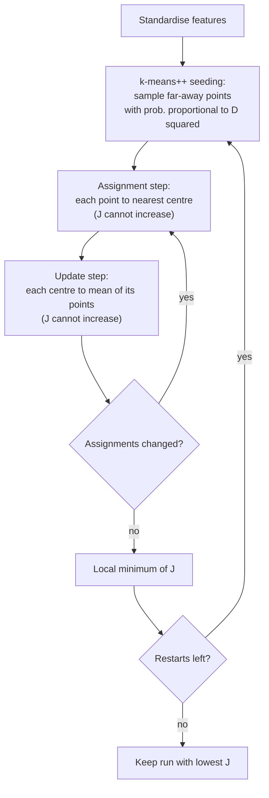
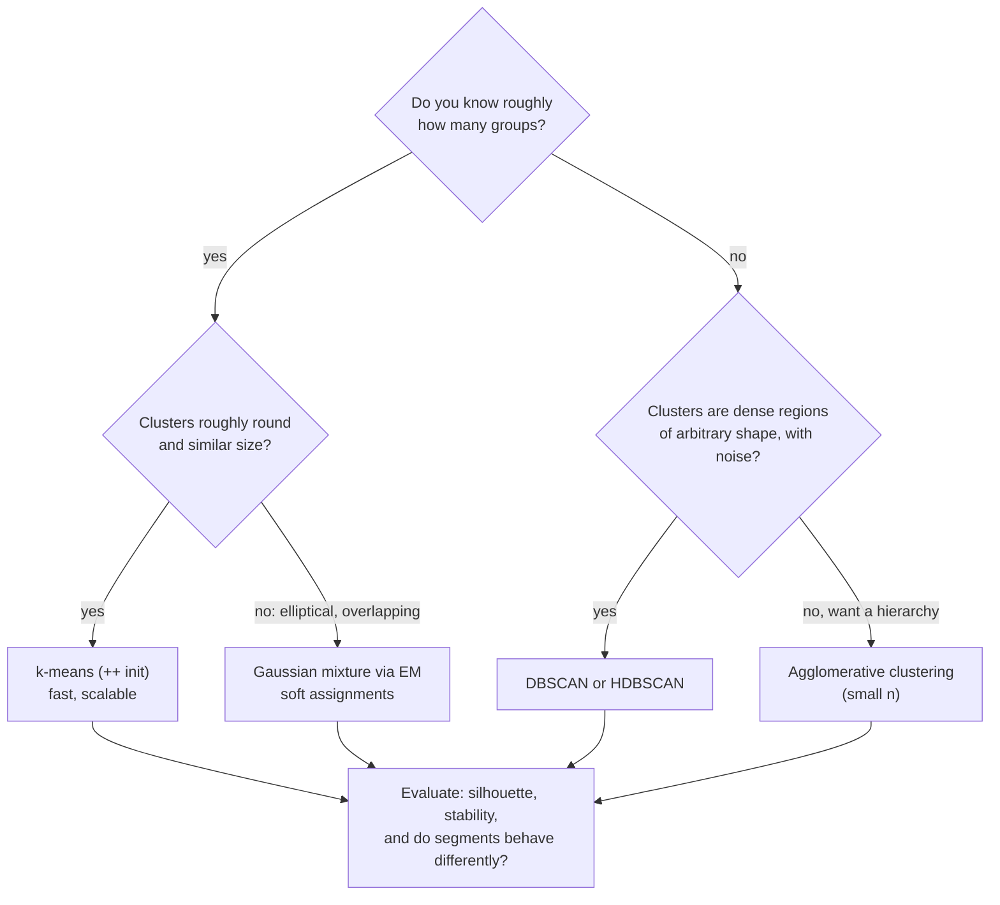
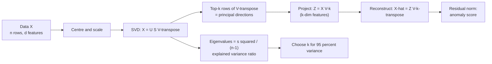
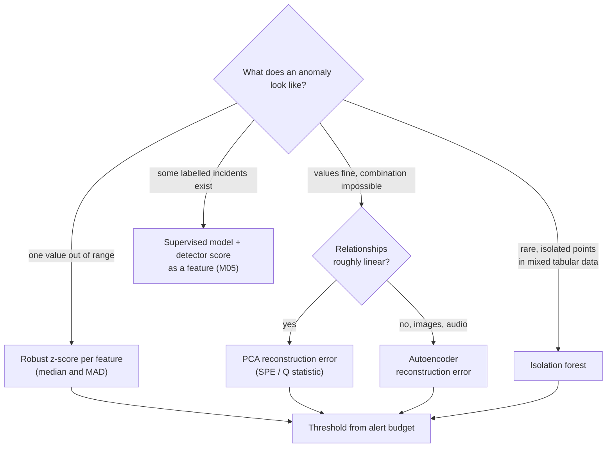

# M06 — Unsupervised learning & anomaly detection

> **Big idea.** Without labels, the only thing you can learn is the **shape of the data** — where it clusters, which directions it varies in, and which points don't fit — and every unsupervised method is a precise, optimisable definition of one of those three ideas.

**Prerequisites:** [M01 First principles](01-ml-first-principles.md), [M02 Math toolkit](02-math-toolkit.md) (eigenvectors, Lagrange multipliers, likelihood), [M04 Evaluation](04-evaluation-and-data.md) (feature scaling) · **Lab:** [labs/05_kmeans_pca.py](../labs/05_kmeans_pca.py) · **Time:** 2 × 90 min

## Learning objectives

- **Derive** k-means as coordinate descent on the within-cluster sum of squares and **prove** that each step cannot increase the objective.
- **Implement** k-means++ seeding and **choose** $k$ using the elbow, silhouette, and business constraints; **identify** data shapes where k-means fails and **select** GMM or DBSCAN instead.
- **Derive** PCA as variance maximisation, connect it to the eigen-decomposition of the covariance matrix and to the SVD, and **compute** explained variance and reconstruction error.
- **Explain** why t-SNE/UMAP plots are for visualisation only.
- **Compare** z-score, isolation forest, PCA-reconstruction and autoencoder anomaly detectors and **choose** one for a given failure mode.
- **Design** an unsupervised component (segmentation, anomaly alerting, deduplication) inside a production system, including how to evaluate it without labels.

---

## 1. The problem

Three teams come to you in the same week.

- **Marketing** at an online retailer has 4 million customers and wants "five or six segments" to tailor campaigns. Nobody has labelled customers as "bargain hunter" or "loyal big spender" — those categories are what they want *discovered*.
- **A semiconductor fab** has 300 sensors on each etching machine, sampled every second. Failures are rare and each one looks different; there will never be enough labelled failures to train a classifier. They want an alarm that fires when the machine "behaves unusually".
- **The security team** wants to flag suspicious network sessions. Attackers deliberately change tactics, so yesterday's labelled attacks say little about tomorrow's.

What these share: **no labels (or almost none), and the interesting thing is structure**: groups, low-dimensional patterns, and departures from normal. Supervised learning (M03–M05) answers "given $x$, what is $y$?". Here we only have $x$, and we must decide *what question to ask of it*. The art of unsupervised learning is turning a vague wish ("find segments", "find weird things") into an objective function we can optimise and, crucially, evaluate.

---

## 2. First principles

### 2.1 Clustering: what does "a group" mean?

The simplest definition: a group is a set of points that are **close to a common centre**. Pick $k$ centres $\mu_1, \ldots, \mu_k$ and assign each point $x_i$ to one centre $c_i \in \{1..k\}$. A good clustering has small total squared distance from points to their centres — the **inertia** or within-cluster sum of squares:

$$J(c, \mu) = \sum_{i=1}^{n} \lVert x_i - \mu_{c_i} \rVert^2.$$

Minimising $J$ exactly is NP-hard. But notice it has two kinds of variables, and **each is easy to optimise if the other is fixed**:

1. **Fix the centres, optimise assignments.** Each $c_i$ appears in only one term, so choose the nearest centre: $c_i = \arg\min_j \lVert x_i - \mu_j\rVert^2$. This cannot increase $J$.
2. **Fix the assignments, optimise centres.** For cluster $j$, minimise $\sum_{i: c_i=j} \lVert x_i - \mu_j\rVert^2$. Setting the gradient $-2\sum_{i: c_i=j}(x_i - \mu_j)$ to zero gives $\mu_j = $ **mean** of the cluster's points. This cannot increase $J$ either.

Alternating the two is **coordinate descent** — and that's exactly **k-means (Lloyd's algorithm)**. Because $J \ge 0$, never increases, and there are finitely many assignments, it **must converge** — but to a *local* minimum that depends on the initial centres. The lab asserts this monotonic decrease.

**Worked example (1-D).** Points $\{1, 2, 3, 10, 11, 12\}$, $k = 2$, bad initial centres $\mu = (1, 2)$.
- Assign: 1 → $\mu_1$; everything else → $\mu_2 = 2$. $J = 0 + 0 + 1 + 64 + 81 + 100 = 246$.
- Update: $\mu_1 = 1$, $\mu_2 = (2+3+10+11+12)/5 = 7.6$. $J = 0 + 31.36 + 21.16 + 5.76 + 11.56 + 19.36 = 89.2$.
- Assign: 2 and 3 are now closer to 1 than to 7.6 → clusters $\{1,2,3\}, \{10,11,12\}$. $J = 0+1+4+5.76+11.56+19.36 = 41.68$.
- Update: $\mu = (2, 11)$. $J = 1+0+1+1+0+1 = 4$. Next assignment changes nothing → converged.

$246 \to 89.2 \to 41.68 \to 4$: monotone, as the proof promised.

**Assumptions hidden in the objective** (state them explicitly — they are the failure modes):
- Squared Euclidean distance ⇒ features must be on comparable **scales** (a feature in dollars dwarfs one in years). Standardise first.
- Each point belongs to the nearest centre ⇒ cluster boundaries are the perpendicular bisectors between centres (a **Voronoi** partition): clusters are **convex**, roughly **spherical**, and similar in **spread**. Rings, crescents, elongated or very unequal-size clusters break k-means.
- Every point must be in some cluster ⇒ **outliers** get assigned anyway and drag centres toward them.

### 2.2 Initialisation: k-means++

With random initial centres, two centres can start inside the same true cluster; coordinate descent cannot move one of them across the gap, and you're stuck in a bad local minimum. **k-means++** (Arthur & Vassilvitskii 2007) spreads the seeds out:

1. Choose the first centre uniformly at random from the data.
2. For each point, compute $D(x)$ = distance to the nearest centre chosen so far.
3. Choose the next centre with probability $\propto D(x)^2$. Repeat until $k$ centres.

Far-away points are likely picked, so each true cluster tends to get a seed. It comes with a guarantee: the expected objective is within $O(\log k)$ of optimal *before* Lloyd iterations even start. In practice: k-means++ plus a handful of restarts (keep the lowest $J$) — the lab shows random init getting stuck occasionally while k-means++ does not.

### 2.3 Choosing $k$

$J$ always decreases as $k$ grows ($k = n$ gives $J = 0$), so we can't just minimise it. Options:

- **Elbow:** plot best $J$ vs $k$; look for where the curve bends from steep to flat. In the lab (4 true blobs): $J$ drops $16285 \to 8853 \to 5068 \to 1540$, then only to $1407$ at $k=5$. The elbow at 4 is obvious — on real data it rarely is.
- **Silhouette:** for point $i$, let $a$ = mean distance to its own cluster and $b$ = mean distance to the nearest other cluster; $s_i = \frac{b - a}{\max(a, b)} \in [-1, 1]$. Average $s$ near 1 means tight, well-separated clusters. Choose $k$ maximising mean silhouette.
  *Worked:* point $x$ has mean distance $a = 1.0$ to its own cluster and $b = 4.0$ to the nearest other one: $s = (4-1)/4 = 0.75$ (well placed). If instead $a = 3, b = 2$, then $s = (2-3)/3 = -0.33$: it is closer to another cluster and is probably mis-assigned.
- **Stability:** re-run on bootstrap samples or different months; if the segments reshuffle each time, $k$ is too large or there is no real cluster structure.
- **Likelihood-based criteria** (BIC) for probabilistic models like GMMs.
- **The business.** Marketing can run six campaigns, not 47. Often $k$ is a constraint, not a discovery — and the right evaluation is whether segments *behave differently* (respond differently to campaigns), not a geometric score.

### 2.4 Soft clustering: Gaussian mixtures and EM (intuition)

k-means makes **hard** assignments and assumes spherical clusters. A **Gaussian mixture model (GMM)** says each point was generated by: pick component $j$ with probability $\pi_j$, then draw $x \sim \mathcal{N}(\mu_j, \Sigma_j)$. Each component has its own covariance, so clusters can be elliptical and of different sizes, and each point gets a **probability** of belonging to each cluster.

We fit by maximum likelihood (M02), but the likelihood involves unknown assignments, so we use **Expectation–Maximisation**, which has exactly the same alternating shape as k-means:

- **E-step:** with parameters fixed, compute **responsibilities** $\gamma_{ij} = P(\text{component } j \mid x_i) = \frac{\pi_j \mathcal{N}(x_i; \mu_j, \Sigma_j)}{\sum_l \pi_l \mathcal{N}(x_i; \mu_l, \Sigma_l)}$ (soft assignment).
- **M-step:** with responsibilities fixed, update $\pi_j, \mu_j, \Sigma_j$ as **responsibility-weighted** fractions, means and covariances.

**Worked responsibility (1-D).** Two components with equal weights $\pi_1 = \pi_2 = 0.5$, unit variance, means $\mu_1 = 0$ and $\mu_2 = 4$. For the point $x = 1.5$: the Gaussian densities are proportional to $e^{-1.5^2/2} = e^{-1.125} = 0.325$ and $e^{-2.5^2/2} = e^{-3.125} = 0.044$. Responsibilities: $\gamma_1 = 0.325/(0.325+0.044) = 0.88$, $\gamma_2 = 0.12$. k-means would say "cluster 1, 100%"; the GMM says "88% cluster 1" — and that 12% pulls $\mu_2$ slightly toward $1.5$ in the M-step. A point at $x = 2$ (equidistant) gets $0.5/0.5$.

Each iteration never decreases the likelihood. If you force all $\Sigma_j = \sigma^2 I$ and let $\sigma \to 0$, the responsibilities become 0/1 and EM *becomes* k-means: **k-means is the hard-assignment limit of a GMM**. Use a GMM when you need uncertainty ("this customer is 60% segment A") or elliptical clusters; it costs more ($O(nkd^2)$ per iteration with full covariances) and can collapse a component onto a single point (regularise $\Sigma$).

### 2.5 Density-based clustering: DBSCAN

Some clusters aren't blobs at all: GPS points along roads, rings, crescents. **DBSCAN** defines a cluster as a **dense, connected region**:

- A point is a **core** point if at least `minPts` points lie within radius $\varepsilon$.
- Clusters are formed by connecting core points that are within $\varepsilon$ of each other, plus the **border** points they reach.
- Everything else is **noise** — DBSCAN labels outliers instead of forcing them into a cluster.

Strengths: arbitrary shapes, no need to choose $k$, built-in outlier detection. Weaknesses: one global density threshold (clusters of very different density are hard — HDBSCAN fixes much of this), sensitivity to $\varepsilon$, and distance concentration in high dimensions.

### 2.6 Dimensionality reduction: PCA from first principles

Data often lives near a **low-dimensional subspace**: 300 sensors on a machine are driven by a few physical factors (temperature, load, gas flow); in the lab, 10 sensors are generated from 2 latent factors. We want the few directions that capture most of the variation.

**Question:** which unit vector $w$ makes the projected data $w^\top x$ vary the most? Let $X$ be the $n \times d$ data matrix with **centred** columns, and $S = \frac{1}{n-1} X^\top X$ the covariance matrix. The variance of the projections is

$$\operatorname{Var}(Xw) = \frac{1}{n-1} \lVert Xw \rVert^2 = w^\top S w.$$

Maximise $w^\top S w$ subject to $\lVert w \rVert = 1$ (without the constraint, scale $w$ to infinity). Lagrangian: $\mathcal{L} = w^\top S w - \lambda (w^\top w - 1)$. Setting $\nabla_w \mathcal{L} = 2Sw - 2\lambda w = 0$:

$$S w = \lambda w.$$

So $w$ must be an **eigenvector** of the covariance matrix, and the variance it captures is $w^\top S w = \lambda$ — its **eigenvalue**. The best direction is the eigenvector with the **largest** eigenvalue: the **first principal component**. The second PC maximises variance subject to being orthogonal to the first → the second eigenvector, and so on. Since $S$ is symmetric positive semi-definite, its eigenvectors are orthogonal and eigenvalues $\lambda_1 \ge \lambda_2 \ge \dots \ge 0$.

- **Explained variance ratio** of component $j$: $\lambda_j / \sum_l \lambda_l$. Keep enough components for, e.g., 95% of variance.
- **Projection** to $k$ dims: $Z = X W_k$ ($W_k$ = top-$k$ eigenvectors as columns). **Reconstruction:** $\hat X = Z W_k^\top$ (+ mean).
- **Equivalent view:** the same $W_k$ **minimises the squared reconstruction error** $\lVert X - X W_k W_k^\top \rVert^2$. By Pythagoras, total variance = captured variance + lost variance, so maximising one minimises the other. The reconstruction error equals the sum of the discarded eigenvalues (× $(n-1)$).

**Worked example.** Five centred 2-D points: $(2,2), (0,0), (-2,-2), (1,-1), (-1,1)$. Sums: $\sum x^2 = 10$, $\sum y^2 = 10$, $\sum xy = 6$. With $n - 1 = 4$:

$$S = \begin{pmatrix} 2.5 & 1.5 \\ 1.5 & 2.5 \end{pmatrix}.$$

Eigenvalues: $2.5 \pm 1.5$, i.e. $\lambda_1 = 4$ with $w_1 = \frac{1}{\sqrt2}(1, 1)$ and $\lambda_2 = 1$ with $w_2 = \frac{1}{\sqrt2}(1, -1)$. PC1 (the diagonal) explains $4/5 = 80\%$ of the variance. Projecting onto PC1, the point $(1, -1)$ maps to $0$ and reconstructs as $(0,0)$ — its squared error is 2, since it lies entirely along the discarded direction.

**The SVD link — how PCA is actually computed.** Any matrix factors as $X = U \Sigma V^\top$ ($U$, $V$ orthonormal columns, $\Sigma$ diagonal with singular values $s_j \ge 0$). Then

$$S = \frac{1}{n-1}X^\top X = \frac{1}{n-1} V \Sigma U^\top U \Sigma V^\top = V \frac{\Sigma^2}{n-1} V^\top.$$

So the right singular vectors $V$ **are** the principal directions, and $\lambda_j = s_j^2/(n-1)$. Libraries compute PCA by SVD of $X$ directly rather than forming $X^\top X$, which squares the condition number and loses precision. The lab checks both routes agree. For huge data, **randomised SVD** finds the top $k$ components in roughly $O(ndk)$.

**Always standardise first** when features have different units — otherwise PC1 is just "the feature with the largest numbers".

### 2.7 t-SNE and UMAP: for looking, not for measuring

PCA is linear; curved structure (manifolds) needs non-linear methods. **t-SNE** and **UMAP** place points in 2-D so that **neighbours in high dimensions stay neighbours**. They make beautiful plots of embeddings (words, images, single-cell genomics). But:

- They preserve **local neighbourhoods**, not global geometry: **distances between clusters and cluster sizes in the plot are not meaningful.**
- Results depend strongly on hyper-parameters (perplexity, `n_neighbors`) and random seed; apparent clusters can appear in pure noise.
- t-SNE has no mapping for new points (UMAP has an approximate one); neither preserves density.

So: use them to *eyeball* structure and debug embeddings, never as features for a downstream model in production or as evidence that "there are 7 segments". Use PCA (or a trained encoder) for actual dimensionality reduction in a pipeline.

### 2.8 Anomaly detection: defining "normal", then measuring departure

An anomaly is a point that is **unlikely under the model of normal data**. Every detector is a choice of (a) a model of normal and (b) a score; then (c) a threshold, set from an alert budget (M04: capacity-based thresholds).

**1. Statistical z-score (per feature).** Model each feature as roughly Gaussian with mean $\mu$, std $\sigma$ from normal data; score $z = (x - \mu)/\sigma$; alarm if $|z| > 3$ or 4. A temperature sensor with $\mu = 50°$, $\sigma = 5°$ reading $72°$ has $z = 4.4$ — alarm. Cheap, interpretable, streaming-friendly. *Blind spot:* it looks at features **one at a time**. Use robust statistics (median, MAD) because anomalies in the reference data inflate $\sigma$.

**2. PCA reconstruction error (correlation-aware).** Fit PCA with $k$ components on normal data. Normal points lie near the learned subspace and reconstruct well; anomalies that **break the correlations** between features land off the subspace and reconstruct badly. Score $= \lVert x - \hat x \rVert^2$ (in process control this is the *SPE* or *Q* statistic). The lab builds a "decoupled" anomaly: every sensor reading is within normal range (z-scores flag 0%), but the usual co-movement of sensors is broken — PCA reconstruction flags ~90%. This is the key lesson: **many real faults are "each value is fine, the combination is impossible"** (high fan speed + low temperature + high power draw).

**3. Isolation forest (Liu et al. 2008).** Idea: anomalies are *few and different*, so they're **easy to isolate**. Build random trees: pick a random feature and a random threshold between its min and max, split, recurse until each point is alone. A normal point deep in a dense region needs many splits; an outlier gets isolated in a few. Average path length $E[h(x)]$ over ~100 trees gives the score $s(x) = 2^{-E[h(x)]/c(n)}$ ($c(n)$ normalises by the average path length in a random tree; $s \to 1$ means anomaly). *Intuition in numbers:* in 1-D with 256 points spread over $[0, 100]$ plus one point at $500$, the very first random threshold lies in $[0, 500]$, and with probability $400/500 = 0.8$ it falls in the gap $(100, 500)$ and isolates the outlier at depth 1. A typical inlier needs roughly $\log_2 256 = 8$ splits. No distances or densities, linear time, works well on mixed tabular data — a strong default.

**4. Autoencoder reconstruction error.** A neural network (M07) compresses $x$ to a small code and decodes it back; trained on normal data, it reconstructs normal patterns well and anomalies poorly. It's **non-linear PCA**: a linear autoencoder with squared loss learns exactly the PCA subspace. Use it for images (defect detection), audio (machine sound), or high-dimensional sensors with non-linear structure. Caution: a too-powerful autoencoder learns to reconstruct *everything*, including anomalies.

**Robust z-score worked.** Reference readings $\{48, 50, 51, 49, 52, 50, 95\}$ (one bad reading already in the window). Mean $= 56.4$, std $\approx 17.1$, so a new reading of $72$ gives $z \approx 0.9$ — the outlier in the reference data has *masked* the anomaly. Median $= 50$, MAD (median absolute deviation) $= 1$, scaled by $1.4826$ to estimate $\sigma$: robust $z = (72 - 50)/1.48 \approx 14.8$. Alarm. This is why production detectors use median/MAD.

**Evaluating without labels.** Collect the few known incidents and check they score highly (recall on known anomalies); have experts review the top-$N$ alerts (precision@N); track alert volume against team capacity; and inject synthetic anomalies (like the lab) to test sensitivity to specific failure modes.

### 2.9 Deduplication: clustering at the record level

Duplicate products in a catalogue, the same customer under three spellings, near-identical web pages — deduplication (entity resolution) is clustering where each cluster is "one real entity". Recipe: represent records (normalised fields, text embeddings, MinHash signatures); **block** with locality-sensitive hashing so only likely pairs are compared (all-pairs is $O(n^2)$); score candidate pairs (often a supervised classifier on pair features); then take connected components or cluster the match graph. Google described **SimHash** fingerprints for near-duplicate web-page detection at crawl scale (Manku et al. 2007). Deduplication is also an *evaluation hygiene* tool: near-duplicates across train/test splits are a classic source of leakage (M04).

---

## 3. The algorithm(s)

### 3.1 k-means with k-means++

```
KMEANS(X, k):
    # k-means++ seeding
    μ_1 = random point
    for j = 2..k: sample μ_j from X with P(x) ∝ min_l ||x - μ_l||^2
    repeat:
        c_i = argmin_j ||x_i - μ_j||^2             # assignment step   O(nkd)
        μ_j = mean{x_i : c_i = j}                   # update step       O(nd)
    until assignments unchanged
    return μ, c                                     # run several restarts, keep min J
```

Complexity: $O(nkd)$ per iteration; usually tens of iterations. Mini-batch k-means updates centres from small random batches for billion-point data. Inference: $O(kd)$ per point (nearest centre).

### 3.2 PCA via SVD

```
PCA(X, k):
    μ = column means;  Xc = X - μ               (optionally divide by column std)
    U, s, Vt = SVD(Xc)                           # thin SVD: O(n d min(n,d))
    components = Vt[:k]                          # principal directions
    explained_variance = s^2 / (n-1)
    project:     Z = (X - μ) @ components.T
    reconstruct: X̂ = Z @ components + μ
    anomaly score: ||X - X̂||^2
```

### 3.3 Isolation forest

```
for t in 1..T:  build tree on a random subsample of 256 points:
    recursively pick random feature f and random threshold in [min_f, max_f], until size 1 or depth limit
score(x) = 2^( - mean_t pathlength_t(x) / c(256) )
```

Training $O(T \cdot \psi \log \psi)$ with subsample size $\psi$; scoring $O(T \log \psi)$ per point — independent of $n$.

| Method | Train | Inference per point | Key hyper-parameter |
|---|---|---|---|
| k-means | $O(nkd \cdot \text{iters})$ | $O(kd)$ | $k$ |
| GMM (full cov.) | $O(nkd^2 \cdot \text{iters})$ | $O(kd^2)$ | $k$, covariance type |
| DBSCAN | $O(n \log n)$ with index, $O(n^2)$ worst | — (transductive) | $\varepsilon$, minPts |
| PCA | $O(nd \min(n,d))$ | $O(dk)$ | $k$ (variance kept) |
| Isolation forest | $O(T\psi\log\psi)$ | $O(T \log \psi)$ | #trees, contamination |

---

## 4. Diagrams

**k-means as coordinate descent (compute flow).**



**Decision logic: which clustering method?**



**PCA: from data to scores and anomalies.**



**Choosing an anomaly detector by failure mode.**



---

## 5. Code

The lab [labs/05_kmeans_pca.py](../labs/05_kmeans_pca.py) implements all of this and asserts the key properties. The two cores:

```python
import numpy as np

def kmeans(X, k, rng, n_iter=100):
    C = [X[rng.integers(len(X))]]                       # k-means++ seeding
    for _ in range(1, k):
        d2 = ((X[:, None] - np.array(C)[None]) ** 2).sum(-1).min(1)
        C.append(X[rng.choice(len(X), p=d2 / d2.sum())])
    C = np.array(C)
    for _ in range(n_iter):
        labels = ((X[:, None] - C[None]) ** 2).sum(-1).argmin(1)   # assignment
        newC = np.array([X[labels == j].mean(0) if np.any(labels == j) else C[j]
                         for j in range(k)])                         # update
        if np.allclose(newC, C): break
        C = newC
    return C, labels

def pca(X, k):
    mu = X.mean(0)
    U, s, Vt = np.linalg.svd(X - mu, full_matrices=False)
    evr = s**2 / (s**2).sum()                                        # explained variance ratio
    Z = (X - mu) @ Vt[:k].T
    recon_err = (((X - mu) - Z @ Vt[:k]) ** 2).sum(1)                # anomaly score
    return Z, evr, recon_err
```

**Library equivalents:**

```python
from sklearn.cluster import KMeans, MiniBatchKMeans, DBSCAN   # KMeans uses k-means++ by default
from sklearn.mixture import GaussianMixture
from sklearn.decomposition import PCA                         # PCA(n_components=0.95)
from sklearn.ensemble import IsolationForest
from sklearn.metrics import silhouette_score
from sklearn.manifold import TSNE                             # visualisation only
```

---

## 6. Real-world applications

1. **Customer segmentation (retail, telecom, banking).** *Task:* group customers for marketing, pricing or product design. *Why k-means:* scales to millions of rows, gives interpretable centroids ("high frequency, low basket size"). Typical features: RFM (recency, frequency, monetary value), category mix, channel usage — log-transformed and standardised. *Constraint:* segments must be **stable** (customers shouldn't flip monthly) and **actionable**; validate by whether segments respond differently in A/B tests, not by silhouette alone.
2. **Network intrusion detection.** *Task:* flag anomalous connections or sessions. *Why unsupervised:* novel attacks have no labels; isolation forests and clustering-based detectors on flow features (bytes, durations, ports, connection counts) find rare patterns. The KDD Cup 1999 / NSL-KDD datasets made this a standard benchmark. *Constraint:* very high event rates and analysts' limited capacity → thresholds from an alert budget, and a feedback loop that turns confirmed incidents into labels for a supervised model.
3. **Manufacturing sensor monitoring (semiconductors, chemicals, turbines).** *Task:* detect faults early from hundreds of correlated sensors. *Why PCA:* sensors are driven by a few physical factors, so a PCA model of normal operation catches **broken correlations** (SPE/Q statistic) and unusual operating points (Hotelling's $T^2$ on the scores) — multivariate statistical process control has used this for decades. Autoencoders extend it to non-linear regimes, and to images in visual defect inspection. *Constraint:* operating regimes change (new recipe, maintenance) → models per regime and regular refits, otherwise false alarms flood operators.
4. **Deduplication and entity resolution.** *Task:* merge duplicate products, listings or customer records; remove near-duplicate web pages. *Why clustering + hashing:* LSH/MinHash blocking and clustering scale to billions of records; Google's SimHash work (Manku et al. 2007) describes near-duplicate detection for web crawling. *Constraint:* precision is critical (wrongly merging two customers is worse than missing a duplicate) → conservative thresholds and human review of borderline clusters.

---

## 7. System-design hook

Unsupervised components appear in interviews as **parts** of bigger systems: candidate generation via clustering of embeddings, anomaly detection for fraud/abuse/monitoring, segmentation features, and deduplication for data quality. Interviewers probe:

- **"There are no labels — how do you evaluate?"** Strong answer: proxy metrics (stability across re-runs/time windows, silhouette), downstream metrics (do segments change campaign lift? do alerts lead to confirmed incidents?), precision@N from expert review, synthetic anomaly injection, and an online feedback loop that gradually creates labels.
- **"How do you set the alert threshold?"** From capacity: "the on-call team can triage 20 alerts/day → threshold at the score's 99.98th percentile on recent normal traffic", then tune with feedback (M04).
- **"How do you serve it?"** PCA and k-means are tiny: store the mean, components or centroids; scoring is a matrix multiply ($O(dk)$) — easy to run in a streaming job. Refit on a schedule; version the model so alerts are reproducible.
- **"What happens when normal changes?"** Concept drift (new product, seasonality, new machine recipe) raises false alarms → rolling refits, per-segment models, drift monitoring on the score distribution (M12).
- **"Why not just train a classifier?"** If labels are plentiful and the anomaly types are stable, supervised wins. In practice: start unsupervised, collect labels from investigated alerts, then add a supervised model that uses the anomaly score as one feature.

Trade-offs to say aloud: interpretability (z-score, PCA contributions) vs power (autoencoder), sensitivity vs alert fatigue, refit frequency vs stability of segments/alerts.

---

## 8. Pitfalls & debugging

| Pitfall | Symptom | Fix |
|---|---|---|
| Unscaled features | Clusters / PC1 dominated by the feature with largest units | Standardise; log-transform heavy tails |
| Bad k-means init | Very different $J$ across runs; two centres in one blob | k-means++ and multiple restarts |
| Wrong cluster shape assumption | k-means splits a ring or crescent into wedges | DBSCAN/HDBSCAN, GMM, or a better feature space |
| Empty cluster | A centre gets no points | Re-seed it at the farthest point |
| Outliers drag centroids | One centroid sits between groups | Remove/cap outliers first, k-medoids, or DBSCAN |
| Curse of dimensionality | All pairwise distances look similar | Reduce with PCA / learned embeddings first |
| Reading meaning into t-SNE | "Clusters" and gaps that don't replicate with another seed | Use only for visual exploration; verify with PCA / quantitative checks |
| PCA anomaly model with too many components | Anomalies reconstruct well; recall drops | Keep components for ~90–95% variance of normal data only |
| Training detector on contaminated data | Real anomalies treated as normal | Clean reference window; robust estimators |
| Drift → alert storms | Alert rate jumps after a process change | Per-regime models, rolling refits, rate-based alert throttling |

---

## 9. Exercises

**Conceptual**
1. ★ Why must you standardise features before k-means but not before training a decision tree?
2. ★ Explain why k-means is guaranteed to converge but not to the global optimum. Give a 1-D example of a bad local optimum.
3. ★★ Why are distances between clusters in a t-SNE plot not meaningful? What would you show instead to a stakeholder?
4. ★★ Construct a sensor anomaly that a per-feature z-score misses but PCA reconstruction catches, and one that PCA misses but z-score catches.

**Derivation / math**
5. ★★ Show that the update step of k-means (centre = cluster mean) minimises the within-cluster sum of squares, and that the assignment step cannot increase $J$.
6. ★★ Prove that for an orthonormal $W_k$, minimising $\lVert X - XW_kW_k^\top\rVert_F^2$ is equivalent to maximising $\operatorname{tr}(W_k^\top S W_k)$.
7. ★ For the 2-D worked example, compute the projection and reconstruction of $(2, 2)$ and $(-1, 1)$ onto PC1 and their reconstruction errors.

**Coding**
8. ★★ Lab exercise 4: implement 1-D GMM with EM and compare soft vs hard assignments on a bimodal dataset.
9. ★★★ Lab exercise 6: implement a small isolation forest and compare it with PCA reconstruction on the lab's `spikes` and `decoupled` anomalies.

**Design**
10. ★★★ Design an anomaly-alerting system for 5,000 wind turbines (each with 200 sensors at 1 Hz). Specify features, model(s) per regime, threshold policy, how you'd evaluate without labels, how alerts reach engineers, and how confirmed failures feed back into the system.

---

## 10. Interview questions

<details><summary>Q1. Walk me through k-means. What objective does it optimise and why does it converge?</summary>

It minimises inertia $J = \sum_i \lVert x_i - \mu_{c_i}\rVert^2$ by coordinate descent: assign each point to its nearest centre (optimal assignments for fixed centres), then move each centre to its cluster mean (optimal centres for fixed assignments). Neither step increases $J$, $J \ge 0$, and there are finitely many assignments, so it converges — to a local optimum, hence k-means++ seeding and multiple restarts.
</details>

<details><summary>Q2. How do you choose k?</summary>

Inertia always falls with $k$, so look for an elbow, maximise mean silhouette, use BIC for GMMs, and check stability across resamples. Most importantly, involve the business constraint and downstream utility: segments must be actionable and behave differently (e.g., respond differently in an A/B test).
</details>

<details><summary>Q3. Derive PCA. How does it relate to SVD?</summary>

Maximise projected variance $w^\top S w$ s.t. $\lVert w\rVert=1$; the Lagrangian gives $Sw = \lambda w$, so the optimum is the top eigenvector of the covariance and the captured variance is its eigenvalue; subsequent components are the next orthogonal eigenvectors. With centred $X = U\Sigma V^\top$, $S = V\frac{\Sigma^2}{n-1}V^\top$, so the right singular vectors are the principal directions and $\lambda_j = s_j^2/(n-1)$. SVD on $X$ is preferred numerically.
</details>

<details><summary>Q4. When does k-means fail, and what would you use instead?</summary>

Non-convex or elongated clusters, very different sizes/densities, unscaled features, outliers, and high-dimensional raw data. Use GMMs for elliptical/overlapping clusters with soft assignment, DBSCAN/HDBSCAN for arbitrary shapes and noise, spectral or embedding-based clustering for manifold structure, and standardisation / dimensionality reduction first.
</details>

<details><summary>Q5. Design an anomaly detector for server metrics with no labelled incidents.</summary>

Features: per-host metrics and ratios (CPU, latency, error rate, QPS) with seasonality removed (compare to same hour last week). Start with robust z-scores for single-metric spikes plus PCA reconstruction or an isolation forest for multivariate oddities; fit per service/regime on a clean recent window. Set thresholds from the on-call alert budget, deduplicate/group alerts, evaluate with known past incidents and injected faults, and log on-call feedback as labels for a future supervised model. Monitor alert rates for drift and refit on a schedule.
</details>

<details><summary>Q6. Can you use t-SNE output as model features?</summary>

Generally no. t-SNE is non-parametric (no transform for new points), stochastic, hyper-parameter-sensitive, and preserves only local neighbourhoods — global distances and cluster sizes are distorted. Use it for visual inspection; for features use PCA, a trained encoder/embedding, or UMAP with caution if a parametric transform is needed.
</details>

<details><summary>Q7. What's the relationship between an autoencoder and PCA?</summary>

A linear autoencoder with a $k$-dim bottleneck and squared-error loss learns the same subspace as the top-$k$ principal components (not necessarily the same basis). Non-linear autoencoders generalise PCA to curved manifolds, which is why both are used for reconstruction-error anomaly detection — PCA for roughly linear sensor correlations, autoencoders for images/audio/non-linear regimes.
</details>

<details><summary>Q8. How does an isolation forest score anomalies, and why does it work?</summary>

It builds random trees with random features and random split thresholds on small subsamples; the anomaly score is based on the average path length needed to isolate a point. Anomalies are few and far from dense regions, so random cuts separate them in very few steps; normal points in dense regions need many. It's linear-time, needs no distance metric, and handles high-dimensional tabular data well.
</details>

---

## Further reading

- Bishop, C. *Pattern Recognition and Machine Learning*, Ch. 9 (k-means, mixtures, EM) and Ch. 12 (PCA).
- Arthur, D. & Vassilvitskii, S. (2007). *k-means++: The Advantages of Careful Seeding.* SODA.
- Ester, M. et al. (1996). *A Density-Based Algorithm for Discovering Clusters in Large Spatial Databases with Noise (DBSCAN).* KDD.
- Liu, F. T., Ting, K. M., Zhou, Z.-H. (2008). *Isolation Forest.* ICDM. — Chandola, V., Banerjee, A., Kumar, V. (2009). *Anomaly Detection: A Survey.* ACM Computing Surveys.
- Wattenberg, M., Viégas, F., Johnson, I. (2016). *How to Use t-SNE Effectively.* Distill.
- Manku, G. S., Jain, A., Das Sarma, A. (2007). *Detecting Near-Duplicates for Web Crawling.* WWW.
