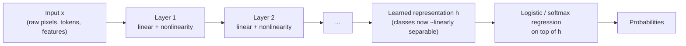
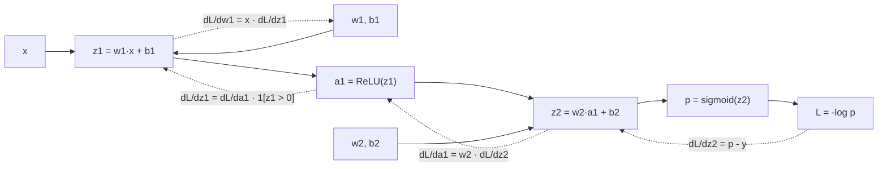
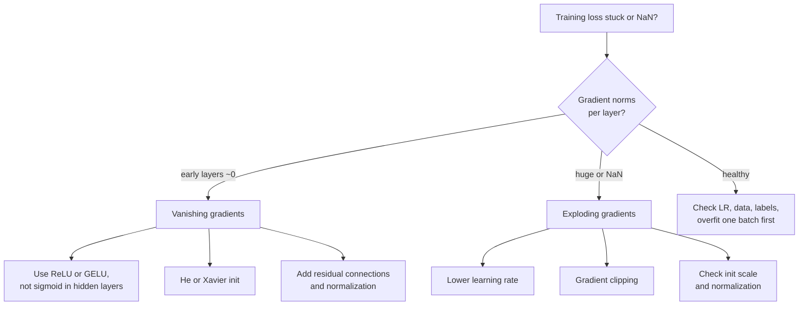
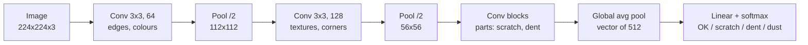
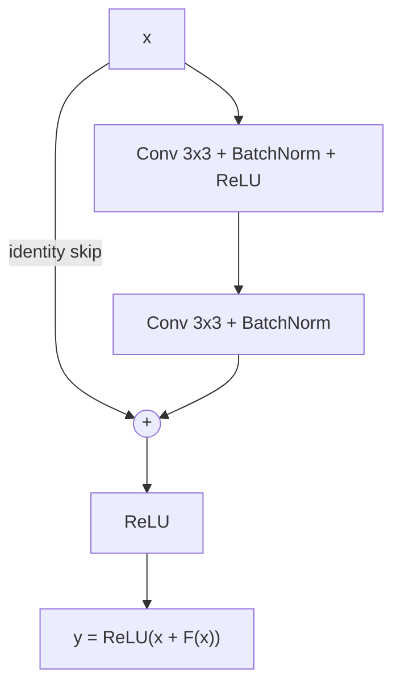
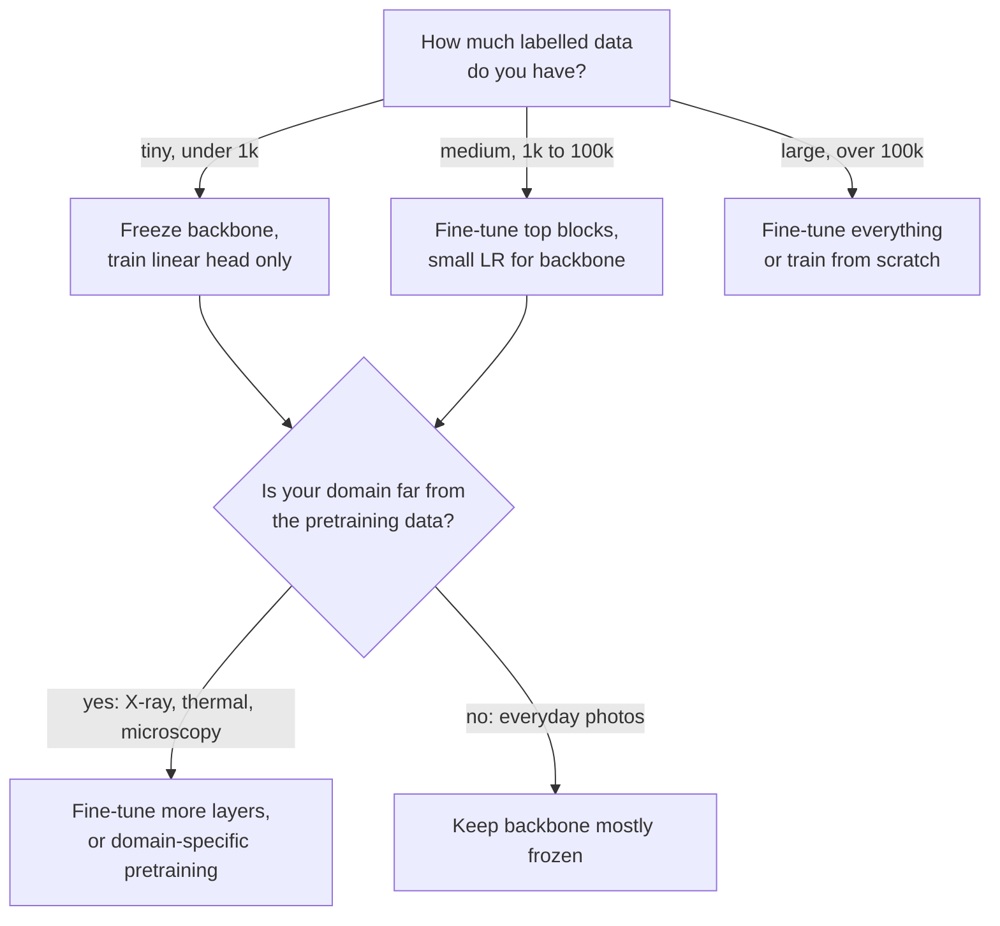
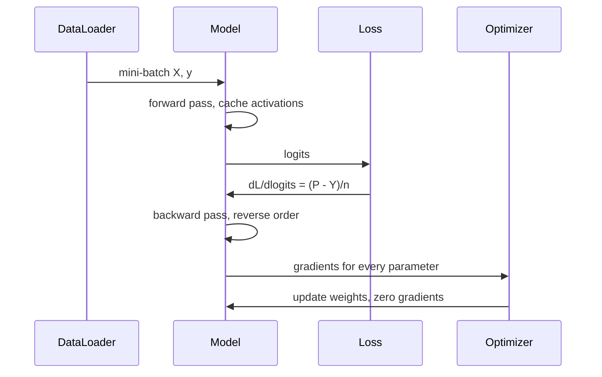

# M07 — Neural Networks: From the Neuron to CNNs and ResNets

> **One-sentence big idea.** A neural network is logistic regression stacked on top of
> *learned* features, trained end-to-end by the chain rule — and every architectural trick
> (ReLU, careful initialization, normalization, convolutions, skip connections) exists to
> make that chain rule carry a useful signal through many layers.

**Prerequisites:** [M02 Math toolkit](02-math-toolkit.md) (gradient descent, chain rule, MLE) ·
[M03 Linear & logistic regression](03-linear-and-logistic-regression.md) ·
[M04 Evaluation](04-evaluation-and-data.md) ·
**Lab:** [Lab 6 — backprop from scratch](../labs/06_neural_network_backprop.py) ·
**Time:** 2 × 90-minute lectures

## Learning objectives

By the end of this module you will be able to:

- **Explain** why stacking linear layers without a nonlinearity collapses to a single linear
  model, and **prove** that no linear classifier solves XOR.
- **Derive** backpropagation for a multi-layer perceptron (MLP) using the chain rule on a
  computational graph, and **compute** a full forward/backward pass by hand.
- **Implement** a 2-layer MLP with manual backprop in NumPy and **verify** it with a
  numerical gradient check.
- **Diagnose** vanishing/exploding gradients and **choose** an activation, initialization
  (Xavier vs He) and normalization scheme to fix them.
- **Derive** the parameter savings of a convolution from locality and weight sharing, and
  **compute** output sizes and receptive fields of a CNN.
- **Choose** between training from scratch, fine-tuning, and feature extraction (transfer
  learning) for a real vision product under data and latency constraints.

---

## 1. The problem

A factory produces 40,000 smartphone back-covers per day. Roughly 1 in 500 has a
defect: a hairline scratch, a dent, a speck of dust trapped under the coating. Today
twelve human inspectors stare at covers under a lamp. They are tired by 3 pm, they disagree
with each other about borderline scratches, and the line cannot speed up because inspection
is the bottleneck.

You are asked: *"Can a camera plus a model do this?"*

Try the tools you already have. Logistic regression (M03) on raw pixels treats each of the
~1 million pixels as an independent feature with its own weight. A scratch at the top-left
and the *same* scratch at the bottom-right activate completely different weights, so the model
would need to see every defect at every location. Gradient-boosted trees (M05) are excellent
on tabular data but have the same problem: individual pixels are meaningless; what matters is
*patterns of neighbouring pixels* — edges, lines, textures — wherever they appear.

Historically, engineers solved this by **hand-designing features**: edge detectors, texture
statistics, SIFT/HOG descriptors, then feeding them to a linear model or SVM. That works
until the next product has a different texture and the features must be redesigned.

The question this module answers: **can a model learn the features as well as the
classifier, directly from labelled examples?** Yes — that is exactly what a neural network
does, and the convolutional variant bakes in the two facts we just noticed (patterns are
local; a pattern means the same thing wherever it appears).

---

## 2. First principles

### 2.1 Start from logistic regression: the neuron

Logistic regression computes a weighted sum and squashes it:

$$\hat{y} = \sigma(\mathbf{w}^\top \mathbf{x} + b), \qquad \sigma(z) = \frac{1}{1 + e^{-z}}$$

where $\mathbf{x} \in \mathbb{R}^d$ is the input, $\mathbf{w} \in \mathbb{R}^d$ the weights,
$b$ the bias, and $\sigma$ the sigmoid. This *is* an artificial neuron: inputs, weights, a
sum, and an **activation function**. Its decision boundary $\mathbf{w}^\top\mathbf{x} + b = 0$
is a hyperplane — a straight line in 2-D.

The power of logistic regression depends entirely on the features $\mathbf{x}$. If the
classes are separable by a line *in the feature space you give it*, it works. If not, a human
must engineer better features (e.g. add $x_1 x_2$). The neural-network idea is:
**let a first layer of neurons compute the features, and let logistic regression sit on top.**

### 2.2 The simplest thing that fails: XOR

Consider four points: $(0,0)\to 0$, $(0,1)\to 1$, $(1,0)\to 1$, $(1,1)\to 0$.

**Claim:** no line separates them. *Proof.* Suppose $w_1 x_1 + w_2 x_2 + b$ is positive
exactly on class 1. Then $(0,0)$: $b < 0$. $(1,0)$: $w_1 + b > 0$. $(0,1)$: $w_2 + b > 0$.
Adding the last two: $w_1 + w_2 + 2b > 0$, so $w_1 + w_2 + b > -b > 0$, which says $(1,1)$
is class 1 — contradiction. ∎

This is the observation (Minsky & Papert, 1969) that stalled single-layer perceptrons for
over a decade. Lab 6 reproduces it: softmax regression stalls at 50% accuracy on XOR.

### 2.3 Fix attempt 1: stack linear layers — and why it fails

Add a hidden layer: $\mathbf{h} = W_1 \mathbf{x} + \mathbf{b}_1$, $\hat{y} = \sigma(\mathbf{w}_2^\top
\mathbf{h} + b_2)$. But

$$\mathbf{w}_2^\top (W_1 \mathbf{x} + \mathbf{b}_1) + b_2 = (\mathbf{w}_2^\top W_1)\mathbf{x} + (\mathbf{w}_2^\top \mathbf{b}_1 + b_2) = \mathbf{w}'^\top \mathbf{x} + b'.$$

A composition of linear maps is linear. **Depth without nonlinearity buys nothing.**

### 2.4 Fix attempt 2: put a nonlinearity between layers

Insert an elementwise nonlinear function $\phi$ (e.g. ReLU, $\phi(z)=\max(0,z)$):

$$\mathbf{h} = \phi(W_1\mathbf{x} + \mathbf{b}_1), \qquad \hat{y} = \sigma(\mathbf{w}_2^\top \mathbf{h} + b_2).$$

Now XOR is easy. A hand-built solution with two ReLU units:

| $x$ | $h_1 = \text{ReLU}(x_1 + x_2)$ | $h_2 = \text{ReLU}(x_1 + x_2 - 1)$ | $h_1 - 2h_2$ |
|---|---|---|---|
| (0,0) | 0 | 0 | **0** |
| (0,1) | 1 | 0 | **1** |
| (1,0) | 1 | 0 | **1** |
| (1,1) | 2 | 1 | **0** |

The hidden layer **re-represents** the input so the problem becomes linearly separable in
$(h_1, h_2)$ space. That is the whole trick, and it generalizes: each layer warps the space so
that the next layer's job is easier.



### 2.5 Universal approximation: why this is "enough" (and why it is not the full story)

**Universal approximation theorem (intuition).** A network with one hidden layer and enough
units can approximate any continuous function on a bounded domain to any accuracy.

Why, in one picture: two ReLUs make a "ramp up then flat" shape; the difference of two ramps
is a **step**; two steps make a **bump**. Any continuous function can be approximated by a sum
of narrow bumps (like a histogram approximates a density). So a wide enough hidden layer can
build any shape out of bumps.

What the theorem does **not** say:
1. How *many* units you need — it can be exponential in the input dimension.
2. Whether gradient descent will *find* those weights.
3. Whether the result *generalizes* beyond the training points.

In practice **depth** is far more efficient than width: deep networks reuse intermediate
features compositionally (edges → textures → parts → objects), representing functions with
exponentially fewer units than a shallow net would need. That is the empirical reason "deep"
learning wins, and why the rest of this module is about making *deep* networks trainable.

### 2.6 How do we train it? The credit assignment problem

We have a loss $L$ (cross-entropy, from MLE as in M02) and millions of weights. Gradient
descent needs $\partial L / \partial w$ for **every** weight. A naive approach — perturb each
weight and re-run the network (finite differences) — costs one forward pass per weight:
$O(P^2)$ for $P$ parameters. For $P = 10^8$ that is hopeless.

**Backpropagation** computes *all* $P$ gradients in about the cost of **two** forward passes,
$O(P)$, by applying the chain rule once, backwards, reusing intermediate results. This is
reverse-mode automatic differentiation, and it is the single algorithm that makes deep learning
possible. We derive it next.

---

## 3. The algorithm(s)

### 3.1 Computational graphs and the chain rule

Write any computation as a directed acyclic graph of simple operations. Each node computes
$v = f(u_1, \dots, u_k)$ and knows its **local derivatives** $\partial v / \partial u_j$.

**Chain rule on a graph:** the gradient of the loss with respect to any node $u$ is the
sum over every node $v$ that consumes $u$:

$$\frac{\partial L}{\partial u} = \sum_{v \,\in\, \text{children}(u)} \frac{\partial L}{\partial v} \, \frac{\partial v}{\partial u}.$$

So if we visit nodes in **reverse topological order**, by the time we reach $u$ we already know
$\partial L / \partial v$ for all its children. Each node multiplies the "upstream gradient" by
its local derivative and passes it on. That is all backprop is.



Solid arrows: forward pass (compute values, cache them). Dotted arrows: backward pass
(propagate gradients using cached values).

### 3.2 Worked numeric example (do this by hand once)

Network: one input, one ReLU hidden unit, one sigmoid output. Binary cross-entropy loss.

Values: $x = 2$, $y = 1$, $w_1 = 0.5$, $b_1 = 0$, $w_2 = -1$, $b_2 = 0.5$.

**Forward pass**

| Node | Formula | Value |
|---|---|---|
| $z_1$ | $w_1 x + b_1$ | $0.5 \cdot 2 + 0 = 1.0$ |
| $a_1$ | $\max(0, z_1)$ | $1.0$ |
| $z_2$ | $w_2 a_1 + b_2$ | $-1 \cdot 1 + 0.5 = -0.5$ |
| $p$ | $\sigma(z_2)$ | $1/(1+e^{0.5}) = 0.3775$ |
| $L$ | $-\log p$ | $0.9741$ |

**Backward pass.** The key identity: for sigmoid + cross-entropy,
$\frac{\partial L}{\partial z_2} = p - y$ (the $\sigma'$ term cancels against the $1/p$ from the log
— derive it yourself in Exercise D1).

| Gradient | Chain rule | Value |
|---|---|---|
| $\partial L/\partial z_2$ | $p - y$ | $0.3775 - 1 = -0.6225$ |
| $\partial L/\partial w_2$ | $a_1 \cdot \partial L/\partial z_2$ | $1 \cdot -0.6225 = -0.6225$ |
| $\partial L/\partial b_2$ | $1 \cdot \partial L/\partial z_2$ | $-0.6225$ |
| $\partial L/\partial a_1$ | $w_2 \cdot \partial L/\partial z_2$ | $-1 \cdot -0.6225 = 0.6225$ |
| $\partial L/\partial z_1$ | $\mathbb{1}[z_1>0] \cdot \partial L/\partial a_1$ | $0.6225$ |
| $\partial L/\partial w_1$ | $x \cdot \partial L/\partial z_1$ | $2 \cdot 0.6225 = 1.2449$ |
| $\partial L/\partial b_1$ | $\partial L/\partial z_1$ | $0.6225$ |

**Sanity check (gradient check).** Perturb $w_1$ by $\pm 10^{-5}$ and recompute the loss:
$(L(w_1+\epsilon) - L(w_1-\epsilon)) / 2\epsilon = 1.24492$. Matches.

**One gradient step** with learning rate $\eta = 0.1$: $w_1 \to 0.3755$, $b_1 \to -0.0622$,
$w_2 \to -0.9378$, $b_2 \to 0.5622$. New forward pass: $p = 0.479$, $L = 0.736$. The loss
dropped from 0.974 to 0.736. Read the signs: the model wanted $p$ higher, $w_2$ is negative,
so it *shrank* the hidden activation (decreased $w_1$) and made $w_2$ less negative. Backprop
discovered that coordinated move automatically.

### 3.3 Backprop for a full MLP layer (matrix form)

For a mini-batch $X \in \mathbb{R}^{n \times d}$, a hidden layer of width $h$ and $k$ classes:

$$Z_1 = X W_1 + \mathbf{b}_1,\quad A_1 = \text{ReLU}(Z_1),\quad Z_2 = A_1 W_2 + \mathbf{b}_2,\quad P = \text{softmax}(Z_2),\quad L = -\tfrac{1}{n}\textstyle\sum_i \log P_{i, y_i}.$$

Backward (each line is one chain-rule step; $Y$ is the one-hot label matrix, $\odot$ is
elementwise product):

$$\begin{aligned}
\frac{\partial L}{\partial Z_2} &= \tfrac{1}{n}(P - Y) && (n \times k)\\
\frac{\partial L}{\partial W_2} &= A_1^\top \frac{\partial L}{\partial Z_2}, \quad \frac{\partial L}{\partial \mathbf{b}_2} = \textstyle\sum_{\text{rows}} \frac{\partial L}{\partial Z_2} && (h \times k)\\
\frac{\partial L}{\partial A_1} &= \frac{\partial L}{\partial Z_2} W_2^\top && (n \times h)\\
\frac{\partial L}{\partial Z_1} &= \frac{\partial L}{\partial A_1} \odot \mathbb{1}[Z_1 > 0] && (n \times h)\\
\frac{\partial L}{\partial W_1} &= X^\top \frac{\partial L}{\partial Z_1}, \quad \frac{\partial L}{\partial \mathbf{b}_1} = \textstyle\sum_{\text{rows}} \frac{\partial L}{\partial Z_1} && (d \times h)
\end{aligned}$$

**Shape rule of thumb:** the gradient w.r.t. a tensor has the *same shape* as that tensor. If
your shapes do not line up, you transposed the wrong thing. Two patterns cover 90% of cases:
- Linear layer $Z = XW$: $\partial W = X^\top \partial Z$ and $\partial X = \partial Z\, W^\top$.
- Elementwise $A = \phi(Z)$: $\partial Z = \partial A \odot \phi'(Z)$.

**Pseudocode (training loop)**

```text
initialize W1, W2 randomly (He init); b1, b2 = 0
repeat for each epoch:
    for each mini-batch (X, y):
        forward:  Z1, A1, Z2, P   (cache them)
        loss:     L = cross_entropy(P, y) + λ/2 (|W1|² + |W2|²)
        backward: dZ2 = (P - Y)/n ; dW2 = A1ᵀ dZ2 ; dA1 = dZ2 W2ᵀ
                  dZ1 = dA1 ⊙ 1[Z1>0] ; dW1 = Xᵀ dZ1 ; add λW to dW
        update:   W ← W - η dW   (or momentum / Adam, M02)
```

**Complexity.** For a layer mapping $d_{in} \to d_{out}$ on a batch of $n$: forward
$O(n\, d_{in} d_{out})$; backward ≈ 2× forward (one matmul for $\partial W$, one for
$\partial X$). Total training cost ≈ **3× forward cost**. Memory: backprop must **cache every
activation** of the forward pass — for deep nets on large inputs, *activation memory*, not
parameter memory, is usually what runs a GPU out of memory (fix: gradient checkpointing,
which recomputes activations instead of storing them).

### 3.4 Activations and vanishing gradients

During backprop, each layer multiplies the upstream gradient by $\phi'(z)$ and by $W^\top$.
Through $L$ layers the gradient at layer 1 contains a product of $L$ such factors. If those
factors are typically $< 1$, the gradient **vanishes** exponentially; if $> 1$, it **explodes**.

| Activation | Formula | Derivative | Pros | Cons |
|---|---|---|---|---|
| Sigmoid | $\frac{1}{1+e^{-z}}$ | $\sigma(1-\sigma) \le 0.25$ | Output in (0,1); good for *output* probabilities | Saturates; max slope 0.25 → $0.25^{10} \approx 10^{-6}$ after 10 layers; not zero-centred |
| tanh | $\frac{e^z - e^{-z}}{e^z+e^{-z}}$ | $1-\tanh^2 \le 1$ | Zero-centred | Still saturates for $\lvert z\rvert > 2$ |
| ReLU | $\max(0,z)$ | $1$ if $z>0$ else $0$ | No saturation for $z>0$; cheap; sparse | "Dead ReLUs": a unit stuck at $z<0$ gets zero gradient forever |
| Leaky ReLU | $\max(\alpha z, z)$ | $1$ or $\alpha$ | Fixes dead units | Extra hyperparameter |
| GELU | $z\,\Phi(z)$ | smooth | Smooth ReLU; default in transformers (BERT, GPT) | Slightly more compute |

$\Phi$ is the standard normal CDF. GELU can be read as "multiply the input by the probability
that a standard normal is below it": a smooth, probabilistic gate.

**Rule:** ReLU family (or GELU) in hidden layers; sigmoid only at a binary output; softmax at a
multi-class output.



### 3.5 Initialization: why Xavier and He

**Why not zeros?** If all weights in a layer are equal, every hidden unit computes the same
function and receives the same gradient — they stay identical forever (**symmetry**). Random
initialization breaks the symmetry.

**Why not "small random"?** Consider $z = \sum_{j=1}^{n} w_j x_j$ with independent zero-mean
$w_j, x_j$. Then

$$\text{Var}(z) = n \,\text{Var}(w)\,\text{Var}(x).$$

If $n\,\text{Var}(w) < 1$, activations shrink geometrically layer after layer; if $> 1$ they
blow up. Lab 6 shows that $w \sim \mathcal{N}(0, 0.01^2)$ through 10 ReLU layers of width 100
shrinks activations to $\sim 10^{-12}$.

- **Xavier/Glorot (tanh, sigmoid, linear):** choose $\text{Var}(w) = 1/n_{in}$ to preserve
  forward variance, or the compromise $2/(n_{in} + n_{out})$ to also preserve backward variance.
- **He/Kaiming (ReLU):** ReLU zeroes half its inputs, which halves the second moment, so we need
  twice the variance: $\text{Var}(w) = 2/n_{in}$. Lab 6 shows activations stay $O(1)$ through 10
  layers.

**Worked number:** a layer with $n_{in} = 512$ ReLU inputs gets He std $\sqrt{2/512} = 0.0625$.

### 3.6 Regularization for neural networks

Networks have far more parameters than training examples and can memorize random labels.
Generalization comes from a combination of:

| Technique | What it does | Why it helps | Practical default |
|---|---|---|---|
| **Weight decay** (L2) | Adds $\frac{\lambda}{2}\lVert W\rVert^2$; gradient step shrinks weights by $(1-\eta\lambda)$ | Gaussian prior on weights (M02); prefers smooth functions | $10^{-4}$–$10^{-2}$; use *decoupled* AdamW |
| **Dropout** | At train time zero each unit with prob $p$ and scale survivors by $1/(1-p)$; identity at test | Prevents co-adaptation; approximates an ensemble of $2^h$ sub-networks | $p = 0.1$–$0.5$ on large FC layers |
| **Early stopping** | Stop when validation loss stops improving; keep the best checkpoint | Limits effective capacity (for GD on a quadratic it is equivalent to L2) | Always on |
| **Data augmentation** | Random crops, flips, colour jitter, noise | Encodes invariances you know are true; more effective data | Essential for vision |
| **Batch norm** | Normalize each channel over the *batch*: $\hat{z} = (z-\mu_B)/\sqrt{\sigma_B^2+\epsilon}$, then $\gamma\hat z + \beta$ | Stabilizes activation scale → higher learning rates; mild noise regularizes | CNNs with batch ≥ 16 |
| **Layer norm** | Same, but statistics over the *features of one example* | Independent of batch size; works for variable-length sequences | Transformers, RNNs |

**Batch norm vs layer norm in one sentence:** batch norm averages *down* a column (one
feature across examples), layer norm averages *across* a row (all features of one example).
Batch norm needs running averages for inference and breaks with tiny batches; layer norm
behaves identically at train and test time.

### 3.7 Convolutional neural networks from first principles

Return to the factory. An image is $H \times W \times C$ (height, width, channels). A fully
connected layer from a $224 \times 224 \times 3$ image to 1,000 hidden units needs
$224 \cdot 224 \cdot 3 \cdot 1000 \approx 150$ **million** weights — for one layer — and it
learns the "scratch detector" separately at every location.

Two assumptions about images fix this:

1. **Locality.** A pixel's meaning depends mostly on its neighbours. → Each hidden unit looks
   only at a small $k \times k$ patch (its **receptive field**).
2. **Stationarity / weight sharing.** A scratch is a scratch wherever it is. → Use the **same**
   $k \times k$ weights at every location: slide one small filter over the image.

Sliding a shared filter is exactly **convolution** (technically cross-correlation):

$$Y[i, j, c_{out}] = b_{c_{out}} + \sum_{u=0}^{k-1}\sum_{v=0}^{k-1}\sum_{c=1}^{C_{in}} K[u, v, c, c_{out}]\; X[i+u,\, j+v,\, c].$$

**Parameter count:** a $3\times3$ conv from 3 to 64 channels has $3\cdot3\cdot3\cdot64 + 64 =
1{,}792$ parameters, independent of image size. Versus 150 M. *That* is the inductive bias.

**Consequences:**
- **Translation equivariance:** shift the input, and the feature map shifts the same way
  ($f(\text{shift}(x)) = \text{shift}(f(x))$). The scratch detector fires wherever the scratch is.
- **Pooling** (max or average over $2\times2$ windows) downsamples and adds a little
  **translation invariance** ($f(\text{shift}(x)) \approx f(x)$): the classifier cares *whether*
  there is a scratch, not its exact pixel coordinates. Global average pooling at the end
  makes the output fully location-independent.

**Output size:** with input size $n$, kernel $k$, padding $p$, stride $s$:

$$n_{out} = \left\lfloor \frac{n + 2p - k}{s} \right\rfloor + 1.$$

Worked: $n=224$, $k=3$, $p=1$, $s=1$ → 224 ("same" padding). $k=3$, $p=1$, $s=2$ → 112.

**Receptive field:** stacking $L$ stride-1 $3\times3$ convs gives a receptive field of
$2L + 1$. Two $3\times3$ layers see $5\times5$ with $2\cdot 9 = 18$ weights per channel pair
instead of 25, plus an extra nonlinearity — the VGG insight. Strides and pooling grow the
receptive field multiplicatively, so deep layers "see" the whole image and detect objects,
while early layers detect edges.



### 3.8 ResNets and skip connections

Empirically (He et al., 2015), a plain 56-layer CNN had **higher training error** than a
20-layer one — not overfitting, but an *optimization* failure. A deeper net should be able to
copy the shallow one and set extra layers to identity, yet SGD could not find that solution.

**Fix:** make identity the default. A residual block computes

$$\mathbf{y} = \mathbf{x} + F(\mathbf{x}),$$

so the layers only have to learn the *residual* $F$, and $F = 0$ gives identity for free.
The backward pass shows why it trains:

$$\frac{\partial L}{\partial \mathbf{x}} = \frac{\partial L}{\partial \mathbf{y}}\left(I + \frac{\partial F}{\partial \mathbf{x}}\right).$$

The $I$ term is a **gradient highway**: even if $\partial F/\partial \mathbf{x}$ is tiny, the
gradient reaches early layers undiminished. ResNets trained 152 layers in 2015; residual
connections are now in essentially every deep architecture, including every transformer (M08).



### 3.9 Transfer learning

Training a ResNet-50 from scratch needs ~1 M labelled images. Your factory has 2,000 images,
40 of them defective. But early CNN layers learn *generic* features (edges, textures) that are
useful for almost any image. So:

1. Take a network **pretrained** on a large dataset (ImageNet, or a self-supervised model).
2. Replace the final classification layer with one for your classes.
3. Either **freeze** the backbone and train only the head (feature extraction), or
   **fine-tune** all layers with a small learning rate (often 10× smaller for the backbone).



---

## 4. Diagrams

The diagrams above sit next to the ideas they explain:

- **Representation-learning flow** (§2.4): each layer re-represents the input until a linear
  classifier suffices.
- **Computational graph with backward edges** (§3.1): the data/compute flow of backprop.
- **Gradient debugging flowchart** (§3.4): decision logic when training fails.
- **CNN pipeline** (§3.7) and **residual block** (§3.8): architecture data flow.
- **Transfer learning decision tree** (§3.9): when to freeze vs fine-tune.

One more: the life of a single training step, which is what every framework executes.



---

## 5. Code

The full, self-checking version is [Lab 6](../labs/06_neural_network_backprop.py). The core:

```python
import numpy as np

def forward(p, X):
    z1 = X @ p["W1"] + p["b1"]; a1 = np.maximum(0, z1)
    logits = a1 @ p["W2"] + p["b2"]
    e = np.exp(logits - logits.max(1, keepdims=True)); P = e / e.sum(1, keepdims=True)
    return P, (X, z1, a1, P)

def backward(p, cache, y):
    X, z1, a1, P = cache
    n = len(y); Y = np.eye(P.shape[1])[y]
    dlogits = (P - Y) / n                 # softmax + cross-entropy
    dW2 = a1.T @ dlogits; db2 = dlogits.sum(0)
    dz1 = (dlogits @ p["W2"].T) * (z1 > 0) # ReLU gate
    dW1 = X.T @ dz1;      db1 = dz1.sum(0)
    return {"W1": dW1, "b1": db1, "W2": dW2, "b2": db2}

def init(d, h, k, rng):                    # He initialisation
    return {"W1": rng.normal(0, np.sqrt(2/d), (d, h)), "b1": np.zeros(h),
            "W2": rng.normal(0, np.sqrt(2/h), (h, k)), "b2": np.zeros(k)}
```

**Always gradient-check a hand-written backward pass:**

```python
def numerical_grad(loss, P, eps=1e-5):
    g = np.zeros_like(P)
    for idx in np.ndindex(P.shape):
        old = P[idx]
        P[idx] = old + eps; lp = loss()
        P[idx] = old - eps; lm = loss()
        P[idx] = old;       g[idx] = (lp - lm) / (2 * eps)
    return g
# relative error |a - n| / (|a| + |n|) should be < 1e-6 in float64
```

Lab 6 output: gradient-check relative error ~$10^{-10}$; linear model 50% on XOR vs MLP
100%; MLP ~98% test accuracy on two interleaved spirals where a linear model gets ~72%.

**What the library hides (PyTorch):**

```python
model = torch.nn.Sequential(torch.nn.Linear(2, 64), torch.nn.ReLU(), torch.nn.Linear(64, 2))
loss = torch.nn.functional.cross_entropy(model(X), y); loss.backward()  # autograd = our backward()
# Transfer learning in two lines:
m = torchvision.models.resnet50(weights="IMAGENET1K_V2"); m.fc = torch.nn.Linear(2048, 4)
```

`loss.backward()` builds the computational graph during the forward pass and walks it in
reverse — exactly §3.1. `nn.Linear` uses a Kaiming-uniform style initialization by default.

---

## 6. Real-world applications

**1. Manufacturing visual inspection (defect detection).**
*Task:* classify or segment defects on parts (PCBs, castings, phone covers, textiles) from line
cameras. *Why CNNs:* defects are local texture anomalies that can appear anywhere — precisely
the locality + weight-sharing prior. *Transfer learning* from ImageNet backbones makes it
feasible with a few thousand images. *Constraints that matter:* extreme class imbalance (1 in
500 defective) → recall at a fixed false-reject rate is the metric (M04); new defect types
appear that were never labelled → pair the classifier with an **anomaly detector** trained only
on good parts (M06, e.g. autoencoder or feature-distance methods); latency of tens of ms per
part on an **edge** device beside the line → small backbones, quantization to INT8.

**2. Medical imaging.**
*Task:* detect diabetic retinopathy from retinal photographs (Gulshan et al., *JAMA* 2016,
Google), pneumonia and other findings on chest X-rays (CheXNet, Rajpurkar et al. 2017).
*Why CNNs:* pathologies are spatial patterns; ImageNet-pretrained Inception/DenseNet
backbones fine-tuned on tens of thousands of expert-graded images reached specialist-level
sensitivity. *Constraints:* labels are expensive and noisy (multiple graders, adjudication);
**distribution shift** between hospitals and scanner vendors; calibrated probabilities and a
human in the loop; regulatory approval needs a *locked* model and prospective validation.

**3. Optical character recognition (OCR).**
*Task:* read digits on bank cheques and postal codes; today, read receipts, invoices, IDs and
street signs. *History:* LeCun's LeNet CNNs were deployed in the 1990s by AT&T/NCR to read
handwritten amounts on cheques — one of the first commercial deep-learning systems. Modern OCR
(e.g. Tesseract 4's LSTM engine; most cloud OCR APIs) uses a CNN to extract visual features
along a text line, a sequence model (LSTM or transformer, M08) to read them, and CTC or
attention decoding. *Constraints:* huge variation in fonts, lighting, blur → heavy
augmentation and synthetic data; character-level accuracy vs field-level accuracy (one wrong
digit makes an invoice total wrong).

**4. Tabular data? Usually not.** A reality check worth saying in interviews: on
heterogeneous tabular data (credit scoring, fraud features), gradient-boosted trees (M05)
still often match or beat MLPs with less tuning. Neural networks shine where the input has
**structure** a prior can exploit (grids, sequences, graphs) or where you need **learned
embeddings** of high-cardinality IDs (M08, M09).

---

## 7. System-design hook

Neural networks appear in nearly every ML system design interview — as the image/text
encoder, the ranking model, or the embedding generator. What interviewers probe:

| Probe | Weak answer | Strong answer |
|---|---|---|
| "Which model?" | "A CNN / ResNet." | "Start with a pretrained ResNet-50 or EfficientNet backbone, fine-tune on our labels; baseline is a frozen backbone + logistic head so we know what fine-tuning buys." |
| "We only have 500 labels." | "Collect more data." | "Transfer learning + augmentation; active learning to choose which images to label; self-supervised pretraining on our unlabelled images; anomaly detection for unseen defect types." |
| "Latency budget is 20 ms on CPU." | "Use a GPU." | "Distil into a smaller student (MobileNet), quantize to INT8, reduce input resolution, batch requests; measure p99, not mean." |
| "How do you know it's working in production?" | "Accuracy." | "Monitor input drift (brightness, camera changes), prediction-rate drift, sample predictions for human audit, track recall on a labelled audit stream." |

**Typical trade-offs to verbalize:**
- *Accuracy vs latency/cost:* deeper and higher-resolution models are more accurate and
  linearly-to-quadratically more expensive. State the budget, then pick.
- *Train from scratch vs fine-tune vs feature extraction:* driven by label count and domain
  distance (diagram in §3.9).
- *Embeddings as a product:* the penultimate layer of a CNN is a reusable image embedding for
  visual search and deduplication (see the visual-search case study). Training it with a
  metric-learning or contrastive objective (M08) usually beats classification features.
- *Edge vs cloud:* edge gives low latency and privacy but limited compute and harder model
  updates.

---

## 8. Pitfalls & debugging

| Symptom | Likely cause | How to detect | Fix |
|---|---|---|---|
| Loss doesn't decrease at all | Bug in backward pass; LR far too low; labels shuffled relative to inputs | **Overfit a single batch** — a correct model should drive loss to ~0 | Gradient check; verify data pipeline; LR range test |
| Loss becomes NaN | Exploding gradients; `log(0)`; LR too high | Log gradient norms; check for `inf` in logits | Stable log-softmax; gradient clipping; lower LR |
| Training accuracy high, validation low | Overfitting | Train/val gap grows with epochs | Augmentation, weight decay, dropout, early stopping, more data |
| Both train and val poor | Underfitting or optimization failure | Training loss plateaus high | Bigger model, ReLU/He init, normalization, residuals, longer training |
| Many ReLUs output 0 for all inputs | Dead ReLUs (large LR pushed bias very negative) | Fraction of units never active | Lower LR, Leaky ReLU/GELU, He init |
| Great offline, poor in production | Train/serve skew: different resizing, colour order (RGB vs BGR), normalization constants | Compare preprocessed tensors from both pipelines byte for byte | Share one preprocessing library; golden-input tests |
| Model "detects" the wrong thing | Shortcut learning: a ruler in malignant-lesion photos, a hospital tag on X-rays | Saliency maps (Grad-CAM); evaluate on data from a new site | Remove the confounder; collect counterexamples; stratified evaluation |
| Batch-norm model behaves differently at eval | Forgot `model.eval()`; tiny batches; running stats from different distribution | Eval-mode vs train-mode outputs differ | Call eval mode; use GroupNorm/LayerNorm for small batches |

**The single most useful debugging habit:** before training on the full dataset, make the
model **memorize 10 examples**. If it cannot, the bug is in the model or the loss, not in the
data or hyperparameters.

---

## 9. Exercises

**Conceptual**
1. ★ Explain in your own words why a 10-layer network with *no* activation functions is no
   more expressive than logistic regression.
2. ★ Why does initializing all weights to zero fail even though the loss is differentiable?
   What if only the *output* layer is zero-initialized?
3. ★★ Dropout is turned off at test time. Why must surviving activations be scaled by
   $1/(1-p)$ during training ("inverted dropout")? What breaks if you forget?
4. ★★ A CNN is translation *equivariant* but a CNN classifier is approximately *invariant*.
   Which component produces the invariance? Name one transformation CNNs are **not**
   equivariant to and how practitioners compensate.
5. ★★ Why might batch normalization be a poor choice for a model served one request at a time
   that is fine-tuned with batch size 2?

**Derivation / math**
1. ★ (D1) Show that for $p=\sigma(z)$ and $L = -y\log p - (1-y)\log(1-p)$, $\partial L/\partial z = p - y$.
   Then show the softmax + cross-entropy analogue $\partial L/\partial \mathbf{z} = \mathbf{p} - \mathbf{y}$.
2. ★★ Derive $\text{Var}(z) = n\,\text{Var}(w)\,\text{Var}(x)$ for independent zero-mean
   variables, then derive He initialization by showing $\mathbb{E}[\text{ReLU}(z)^2] = \frac12\text{Var}(z)$
   for symmetric $z$.
3. ★★ Compute the number of parameters and the output shape of: input $64\times64\times3$ →
   conv $5\times5$, 32 filters, stride 1, padding 2 → max-pool $2\times2$ → conv $3\times3$, 64
   filters, stride 2, padding 1. What is the receptive field of one output unit?
4. ★★★ For a residual stack $\mathbf{x}_{l+1} = \mathbf{x}_l + F_l(\mathbf{x}_l)$, show that
   $\partial L / \partial \mathbf{x}_l = \partial L/\partial \mathbf{x}_L \prod_{j=l}^{L-1}(I + \partial F_j / \partial \mathbf{x}_j)$
   and expand the product to argue that the gradient contains a direct term $\partial L/\partial \mathbf{x}_L$.

**Coding**
1. ★ Run Lab 6. Change `d_hidden` on the spirals from 64 to 2, 4, 8, 16 and tabulate test
   accuracy. Explain the trend.
2. ★★ Add a second hidden layer and inverted dropout to Lab 6; gradient-check with dropout
   disabled (why disabled?).
3. ★★ Implement a 2-D convolution forward pass in NumPy with loops, then vectorize it with
   `im2col`. Verify both agree on random inputs.
4. ★★★ Implement batch normalization's forward and backward pass and gradient-check it.

**Design**
1. ★★ Design the inspection system for the phone-cover factory in §1: 40,000 parts/day, 1
   camera per line, 1 in 500 defective, new defect types appear monthly, decisions needed in
   100 ms. Cover data collection and labelling, model choice, the metric (and the operating
   point), edge vs cloud, and how new defect types are handled.

---

## 10. Interview questions

<details>
<summary>Q1. Why do neural networks need nonlinear activation functions?</summary>

Because a composition of linear (affine) maps is itself affine: $W_2(W_1 x + b_1) + b_2 = W'x + b'$.
Without nonlinearities, any depth collapses to a single linear model and cannot represent
even XOR. Nonlinearities let each layer warp the representation so that the final linear layer
can separate the classes; with them, a wide enough network is a universal approximator.
</details>

<details>
<summary>Q2. Explain backpropagation. Why is it efficient?</summary>

Backprop is reverse-mode automatic differentiation: express the loss as a computational graph,
run the forward pass caching intermediate values, then traverse the graph in reverse
topological order, multiplying each node's upstream gradient by its local derivative (chain
rule) and summing over branches. Every parameter's gradient is obtained in one backward pass
costing roughly 2× the forward pass, i.e. $O(P)$, versus $O(P^2)$ for finite differences.
Reverse mode is efficient because we have many inputs (parameters) and one scalar output (loss).
</details>

<details>
<summary>Q3. What are vanishing gradients and how do modern networks avoid them?</summary>

The gradient at early layers is a product of per-layer Jacobians; if their typical magnitude is
below 1 (e.g. sigmoid's derivative ≤ 0.25), the product shrinks exponentially with depth and
early layers stop learning. Remedies: ReLU/GELU activations (derivative 1 in the active
region), variance-preserving initialization (He for ReLU, Xavier for tanh), normalization
layers (BatchNorm/LayerNorm) that keep activations at a stable scale, and residual connections
whose identity path gives the gradient a direct route ($I + \partial F/\partial x$). For RNNs,
gating (LSTM/GRU) plays the same role.
</details>

<details>
<summary>Q4. Why do CNNs work so well for images compared to fully connected networks?</summary>

They encode two true priors about images: locality (useful patterns are spatially local, so each
unit connects to a small patch) and stationarity (the same pattern means the same thing
anywhere, so weights are shared across positions). This cuts parameters by orders of magnitude
(a 3×3×3→64 conv has ~1.8k parameters regardless of image size), gives translation
equivariance, and lets depth build a hierarchy from edges to textures to parts to objects.
Pooling adds local translation invariance and grows the receptive field.
</details>

<details>
<summary>Q5. What problem do residual connections solve?</summary>

The degradation problem: very deep plain networks had *higher training error* than shallower
ones — an optimization failure, not overfitting. With $y = x + F(x)$ the block defaults to
identity when $F \approx 0$, so adding layers cannot make the representable solution worse, and
the backward pass contains an identity term that carries gradients straight to early layers.
This enabled 100+ layer CNNs and is used in every transformer.
</details>

<details>
<summary>Q6. You have 2,000 labelled images for a new visual classification product. What do you do?</summary>

Don't train from scratch. Start with a pretrained backbone (ImageNet or a self-supervised model
such as a CLIP/DINO-style encoder). Baseline: freeze the backbone, train a linear head — fast and
hard to overfit. Then fine-tune the top blocks (or all layers) with a small learning rate, strong
augmentation, weight decay and early stopping on a validation set split by the right unit
(e.g. by production line or patient, to avoid leakage). If the domain is far from natural images,
fine-tune more layers or pretrain self-supervised on unlabelled in-domain data. Use active learning
to choose the next images to label, and evaluate with the business metric at a chosen operating point.
</details>

<details>
<summary>Q7. Batch norm vs layer norm — when would you use each?</summary>

Both normalize activations to zero mean and unit variance and then apply a learned scale and
shift. Batch norm computes statistics per feature *across the batch* (and spatial positions);
it works well for CNNs with reasonably large batches but needs running averages at inference
and degrades with tiny or non-i.i.d. batches. Layer norm computes statistics *across features
within a single example*, so it is independent of batch size and identical at train and test
time — the standard choice for transformers and sequence models.
</details>

<details>
<summary>Q8. Your model is 99% accurate offline but performs poorly after deployment. How do you debug?</summary>

First suspect train/serve skew: compare the exact preprocessed tensors (resize method, colour
channel order, normalization constants, JPEG compression) for the same raw input in both
pipelines. Next, distribution shift: new cameras, lighting, product variants — compare input
statistics and prediction-rate distributions. Then label/metric mismatch: 99% accuracy with a
0.2% positive rate may mean near-zero recall. Finally shortcut learning: check saliency maps and
evaluate on data from a new site. Fix with a shared preprocessing library, monitoring, a labelled
audit stream, and retraining on production data.
</details>

---

## Further reading

1. Goodfellow, Bengio & Courville, *Deep Learning* (MIT Press, 2016) — Ch. 6 (feedforward
   networks and backprop), Ch. 7 (regularization), Ch. 9 (convolutional networks).
2. Rumelhart, Hinton & Williams, "Learning representations by back-propagating errors",
   *Nature* 323 (1986).
3. Glorot & Bengio, "Understanding the difficulty of training deep feedforward neural networks"
   (AISTATS 2010); He et al., "Delving Deep into Rectifiers" (ICCV 2015) — Xavier and He init.
4. He, Zhang, Ren & Sun, "Deep Residual Learning for Image Recognition" (CVPR 2016).
5. Stanford CS231n course notes (Karpathy et al.) — backprop intuitions, CNN architectures,
   and the "overfit one batch" debugging recipe; and Karpathy's blog post "A Recipe for
   Training Neural Networks" (2019).
