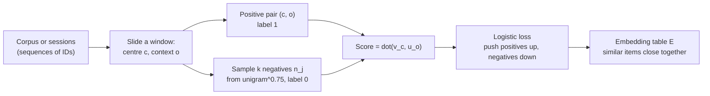
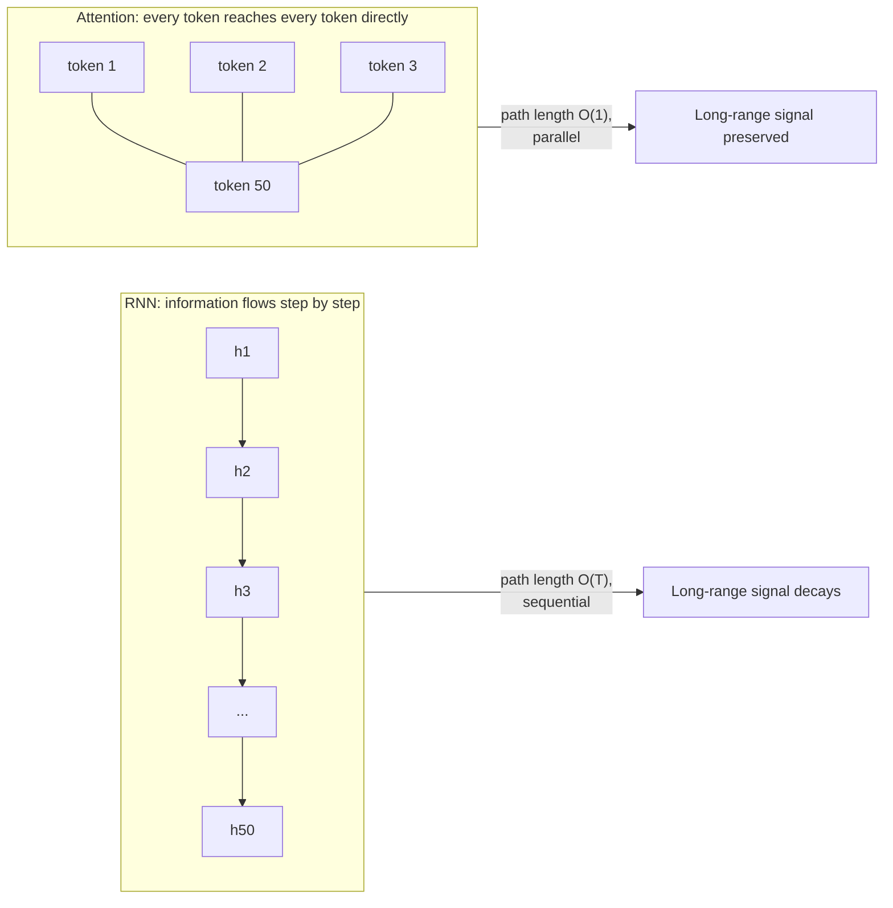
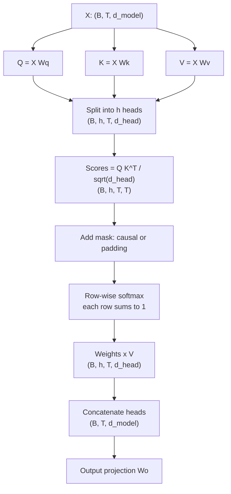
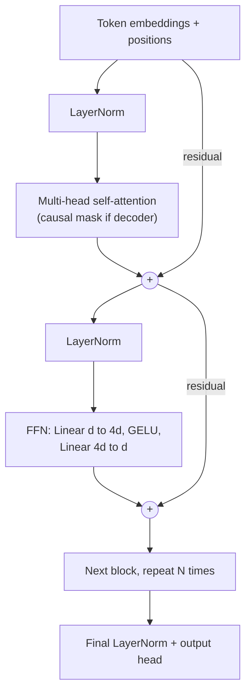
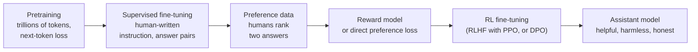
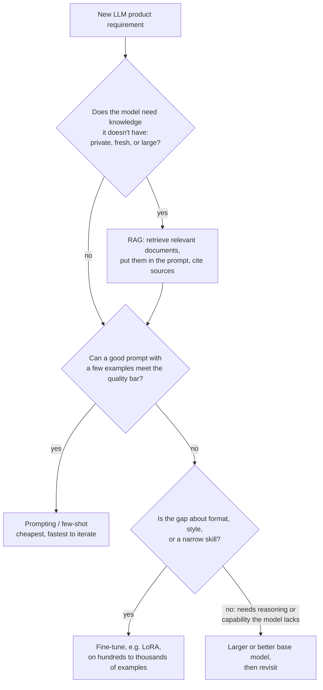
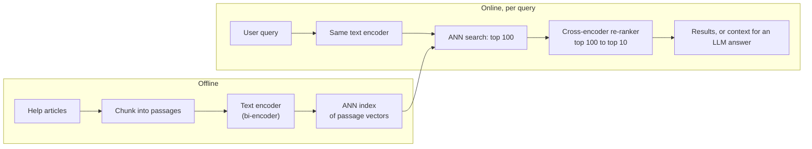

# M08 — Embeddings, Sequences & Transformers

> **One-sentence big idea.** Turn every discrete thing (word, user, product, image patch) into
> a learned vector whose geometry encodes meaning, then let **attention** — a differentiable
> soft dictionary lookup — decide which vectors should inform which; scale that up and you get
> modern search, translation, and large language models.

**Prerequisites:** [M02 Math toolkit](02-math-toolkit.md) (softmax, MLE, SGD) ·
[M03 Logistic regression](03-linear-and-logistic-regression.md) ·
[M07 Neural networks](07-neural-networks.md) (backprop, residuals, layer norm) ·
**Lab:** [Lab 7 — attention and embeddings](../labs/07_attention_and_embeddings.py) ·
**Time:** 2 × 90-minute lectures

## Learning objectives

By the end of this module you will be able to:

- **Explain** why one-hot encodings fail for high-cardinality discrete inputs and **derive**
  how an embedding layer is just a learned lookup table trained by backprop.
- **Derive** the skip-gram with negative sampling objective and **explain** why it places
  co-occurring items close together.
- **Diagnose** why RNNs struggle with long sequences (sequential compute, vanishing gradients)
  and **explain** how attention removes both problems.
- **Derive** scaled dot-product attention from the "soft dictionary lookup" idea, **compute** it
  by hand, and **justify** the $1/\sqrt{d_k}$ factor.
- **Implement** causal multi-head self-attention in NumPy with shape and masking checks.
- **Compare** encoder-only, decoder-only, and encoder–decoder transformers, their pretraining
  objectives, and **choose** between prompting, fine-tuning, and retrieval-augmented generation
  (RAG) for a product requirement.

---

## 1. The problem

A customer-support site for a software company has 40,000 help articles. A user types:

> *"my laptop won't let me log in after I changed my password"*

The best article is titled **"Resetting cached credentials on Windows"**. It shares *zero*
words with the query except "password" — which also appears in 3,000 other articles. Keyword
search (TF-IDF, BM25) ranks it on page five.

What the search needs is to know that *"won't let me log in"* ≈ *"authentication failure"* ≈
*"cached credentials"*. It needs representations in which **meaning, not spelling, determines
distance**. And it needs to understand that in *"after I changed my password"*, the word
"changed" modifies "password", and that the whole clause is the *cause* of the problem — i.e.
it must combine words **in context**, across arbitrary distances in the sentence.

Those two needs — (1) meaningful vectors for discrete symbols, (2) a mechanism to combine them
in context — are the two halves of this module: **embeddings** and **attention**. Put them
together, train at scale, and the same machinery powers translation, chatbots, code completion,
and the retrieval stage of recommender systems (M09).

---

## 2. First principles

### 2.1 Representing discrete things: one-hot and why it fails

A model needs numbers. A vocabulary of $V$ words can be encoded as **one-hot** vectors
$\mathbf{e}_i \in \{0,1\}^V$ with a single 1 at position $i$. Problems:

1. **No similarity.** Every pair of distinct one-hot vectors is orthogonal: $\cos(\mathbf{e}_\text{cat},
   \mathbf{e}_\text{kitten}) = \cos(\mathbf{e}_\text{cat}, \mathbf{e}_\text{mortgage}) = 0$.
   Anything learned about "cat" transfers *nothing* to "kitten". (Lab 7 asserts this.)
2. **Huge and sparse.** $V$ is 50k for words, $10^8$+ for user or product IDs.
3. **A linear layer on a one-hot is a lookup.** If $W \in \mathbb{R}^{V\times d}$, then
   $\mathbf{e}_i^\top W = W[i, :]$ — row $i$ of $W$.

Point 3 is the key insight. Multiplying a one-hot by a weight matrix *selects a row*. So
instead of materializing one-hot vectors, store a table $E \in \mathbb{R}^{V\times d}$ with
$d \ll V$ (typically 32–4096) and look up row $i$. That row is the **embedding** of item $i$.
It is trained by backprop like any other weight: the gradient flows only into the rows that
were looked up in the current batch (a *sparse* update).

**Why do embeddings acquire meaning?** Because the training objective forces items that play
similar roles in the data to get similar vectors — if "cat" and "kitten" appear in similar
contexts, the gradients pushing on their rows are similar, so the rows end up close. The
geometry is a *by-product of the prediction task*. Choose the task and you choose what
"similar" means.

### 2.2 Learning embeddings from co-occurrence: word2vec skip-gram

**Distributional hypothesis** (Firth, 1957): *"You shall know a word by the company it keeps."*
So define a self-supervised task that needs no labels: **given a centre word, predict the words
in a window around it.**

Each word $w$ gets two vectors: $\mathbf{v}_w$ (as centre) and $\mathbf{u}_w$ (as context). The
naive model is a softmax over the vocabulary:

$$P(o \mid c) = \frac{\exp(\mathbf{u}_o^\top \mathbf{v}_c)}{\sum_{w=1}^{V} \exp(\mathbf{u}_w^\top \mathbf{v}_c)}.$$

The denominator sums over all $V$ words for every training pair — far too expensive.

**Negative sampling** replaces the $V$-way classification with binary classification: "is
$(c, o)$ a real co-occurring pair, or a fake one?" For each real pair, sample $k$ (5–20)
**negative** words $n_1..n_k$ from a noise distribution (unigram frequency$^{3/4}$, which
up-weights rare words) and maximize

$$\log \sigma(\mathbf{u}_o^\top \mathbf{v}_c) + \sum_{j=1}^{k} \log \sigma(-\mathbf{u}_{n_j}^\top \mathbf{v}_c).$$

Read it as logistic regression (M03): push the real pair's dot product up, the fake pairs' dot
products down. Cost per pair: $O(kd)$ instead of $O(Vd)$.

**Worked intuition.** If "cat" and "kitten" both co-occur with "purr", "fur", "vet", then both
$\mathbf{v}_\text{cat}$ and $\mathbf{v}_\text{kitten}$ are pushed towards the same context vectors,
so they end up near each other. Famous side effect: linear structure such as
$\mathbf{v}_\text{king} - \mathbf{v}_\text{man} + \mathbf{v}_\text{woman} \approx \mathbf{v}_\text{queen}$.

**This recipe is general, not just for words.** Replace "sentence" with "a user's session" and
"word" with "product ID" and you get *item2vec / prod2vec* — product embeddings from
co-purchase sequences, widely used in e-commerce (M09). Replace with random walks on a graph
and you get *DeepWalk/node2vec*. The pattern — **positive pairs from co-occurrence, negatives
from sampling, dot-product logistic loss** — reappears in two-tower recommenders and in
contrastive learning below.



### 2.3 Using embeddings: similarity and nearest-neighbour search (preview)

With embeddings, "find related things" becomes geometry. **Cosine similarity**
$\cos(\mathbf{a},\mathbf{b}) = \frac{\mathbf{a}^\top\mathbf{b}}{\lVert\mathbf{a}\rVert\,\lVert\mathbf{b}\rVert}$
ignores vector length (often correlated with frequency); after L2-normalizing all vectors,
cosine = dot product, and ranking by dot product = ranking by Euclidean distance.

Exact top-$k$ search over $N$ vectors costs $O(Nd)$ per query — 100 M items × 256 dims is
25 GFLOP per query, too slow for a 10 ms budget. **Approximate nearest neighbour (ANN)**
indexes (HNSW graphs, IVF clustering, product quantization) trade a little recall for
100–1000× speed. We cover them properly in M09. Lab 7 implements exact cosine top-$k$.

### 2.4 Sequences: the simplest thing that works — and why it fails

A bag of embeddings (average the word vectors) ignores order: *"dog bites man"* = *"man
bites dog"*. We need a model that reads in order and combines words in context.

**Recurrent neural network (RNN):** maintain a hidden state updated token by token:

$$\mathbf{h}_t = \tanh(W_h \mathbf{h}_{t-1} + W_x \mathbf{x}_t + \mathbf{b}).$$

The same weights are reused at every step (weight sharing over *time*, like convolution over
*space*). It handles any length and respects order. Two fundamental problems:

1. **Sequential computation.** $\mathbf{h}_t$ needs $\mathbf{h}_{t-1}$. You cannot parallelize
   across the sequence, so GPUs (built for parallel matmuls) sit idle. Training on long
   documents is slow.
2. **Long-range dependencies vanish.** Backprop through time multiplies Jacobians
   $\partial \mathbf{h}_t / \partial \mathbf{h}_{t-1} = \text{diag}(\tanh') W_h$ for every step.
   Over 50 steps, a product of 50 matrices with norm < 1 vanishes (or explodes if > 1) — exactly
   the M07 depth problem, now with depth = sequence length. Information from token 1 must
   survive being squeezed through every intermediate state.

**LSTM** (Hochreiter & Schmidhuber, 1997) adds a **cell state** updated *additively*:
$\mathbf{c}_t = \mathbf{f}_t \odot \mathbf{c}_{t-1} + \mathbf{i}_t \odot \tilde{\mathbf{c}}_t$, with
learned sigmoid gates $\mathbf{f}$ (forget), $\mathbf{i}$ (input), $\mathbf{o}$ (output). When
$\mathbf{f}\approx 1$ the gradient flows through $\mathbf{c}$ almost unchanged — the same idea as a
residual connection. LSTMs powered translation and speech recognition around 2014–2017 but
still had problem 1 and still compress the whole past into a fixed-size vector.



### 2.5 Attention from first principles: a soft dictionary lookup

Forget neural networks for a moment. A Python dictionary maps a **query** to a **value** by
finding the **key** that matches exactly:

```python
d = {"weather": "sunny", "price": "$5", "colour": "red"}
d["price"]   # exact key match → one value
```

Now make it differentiable. Keys, queries and values are vectors. Instead of an exact match,
score every key by similarity to the query (dot product), turn scores into weights with a
softmax, and return the **weighted average of values**:

$$\text{lookup}(\mathbf{q}) = \sum_j \text{softmax}_j(\mathbf{q}^\top \mathbf{k}_j)\, \mathbf{v}_j.$$

If one key matches far better than the rest, the softmax is nearly one-hot and this *is* a
dictionary lookup. If several match, you get a blend. And because everything is smooth, the
model can **learn** what to look up via backprop.

**Self-attention:** each token in a sequence produces its own query ("what am I looking
for?"), key ("what do I contain?") and value ("what do I pass on if selected?") by three
learned linear maps of its embedding:

$$Q = XW_Q,\quad K = XW_K,\quad V = XW_V.$$

Then every token looks up every other token. In *"the animal didn't cross the street because
**it** was too tired"*, the query for "it" can learn to match the key of "animal" and pull in its
value — resolving the pronoun in one step, regardless of distance.

### 2.6 Why divide by $\sqrt{d_k}$?

Suppose the components of $\mathbf{q}$ and $\mathbf{k}$ are independent with mean 0 and variance 1.
Then

$$\text{Var}(\mathbf{q}^\top \mathbf{k}) = \sum_{i=1}^{d_k} \text{Var}(q_i k_i) = d_k.$$

So raw scores have standard deviation $\sqrt{d_k}$: about 22 for $d_k = 512$. A softmax over
scores that differ by tens is essentially one-hot (Lab 7 measures a mean max-weight of 0.92
unscaled vs 0.12 scaled at $d_k=512$). A one-hot softmax has near-zero gradient for all
non-maximal entries, so learning stalls. Dividing by $\sqrt{d_k}$ restores unit variance
regardless of head size. It is the same variance-preservation argument as Xavier/He
initialization in M07.

---

## 3. The algorithm(s)

### 3.1 Scaled dot-product attention

$$\text{Attention}(Q, K, V) = \text{softmax}\!\left(\frac{QK^\top}{\sqrt{d_k}} + M\right) V$$

- $Q \in \mathbb{R}^{T_q \times d_k}$, $K \in \mathbb{R}^{T_k \times d_k}$, $V \in \mathbb{R}^{T_k \times d_v}$.
- Softmax is applied **row-wise**: each query's weights over keys sum to 1.
- $M$ is a mask: $0$ where attention is allowed, $-\infty$ where forbidden. A **causal mask**
  forbids $j > i$ so position $i$ cannot see the future (required for next-token prediction).
  A **padding mask** hides padding tokens.

**Worked example** ($T = 3$ tokens, $d_k = d_v = 2$):

$$Q = \begin{bmatrix}1&0\\0&1\\1&1\end{bmatrix},\quad K = \begin{bmatrix}2&0\\0&2\\1&1\end{bmatrix},\quad V = \begin{bmatrix}1&0\\0&1\\0.5&0.5\end{bmatrix}$$

1. Scores $QK^\top = \begin{bmatrix}2&0&1\\0&2&1\\2&2&2\end{bmatrix}$; divide by $\sqrt2$:
   $\begin{bmatrix}1.414&0&0.707\\0&1.414&0.707\\1.414&1.414&1.414\end{bmatrix}$.
2. Row-wise softmax: row 1 → $[0.576, 0.140, 0.284]$; row 2 → $[0.140, 0.576, 0.284]$;
   row 3 → $[0.333, 0.333, 0.333]$ (equal scores → uniform).
3. Output $= \text{weights} \cdot V$: row 1 → $[0.718, 0.282]$ (mostly value 1), row 2 →
   $[0.282, 0.718]$, row 3 → $[0.5, 0.5]$.

**With a causal mask** row 1 can see only itself → weights $[1, 0, 0]$, output $[1, 0]$; row 2
→ softmax over $[0, 1.414]$ = $[0.196, 0.804, 0]$, output $[0.196, 0.804]$; row 3 unchanged.

**Complexity.** Computing $QK^\top$ is $O(T^2 d)$ time and $O(T^2)$ memory per head. Quadratic
in sequence length — the main cost driver for long contexts (100k-token contexts need tricks:
FlashAttention for memory, sparse/linear attention, sliding windows). In exchange, every pair of
tokens is connected by a path of length 1 and all positions are computed in parallel.

### 3.2 Multi-head attention

One softmax produces one weighting — one "kind" of relationship per token. But a token may
need to attend to its syntactic head, its coreferent, and the previous token *simultaneously*.
**Multi-head attention** runs $h$ attentions in parallel on lower-dimensional projections and
concatenates:

$$\text{head}_i = \text{Attention}(XW_Q^{(i)}, XW_K^{(i)}, XW_V^{(i)}),\qquad \text{MHA}(X) = [\text{head}_1; \dots; \text{head}_h]\,W_O,$$

with $d_{head} = d_{model}/h$, so the total cost equals one full-width head. Typical: $d_{model} =
768$, $h = 12$, $d_{head} = 64$. Shapes (Lab 7 asserts each): $(B, T, d) \to$ split $\to (B, h, T,
d_{head}) \to$ attend $\to (B, h, T, d_{head}) \to$ merge $\to (B, T, d) \to W_O$.



### 3.3 Positional encoding

Attention is a **set** operation: permute the input tokens and the outputs are permuted the
same way (Lab 7 verifies this permutation equivariance). "Dog bites man" and "man bites dog"
look identical. Fix: add position information to each token embedding.

- **Sinusoidal** (original transformer): $PE_{(pos, 2i)} = \sin(pos/10000^{2i/d})$,
  $PE_{(pos,2i+1)} = \cos(pos/10000^{2i/d})$ — a spectrum of frequencies, like the hands of
  a clock; relative offsets are linear functions of these features.
- **Learned absolute** positions (BERT, GPT-2): a $T_{max}\times d$ embedding table.
- **Rotary (RoPE)** and **ALiBi** (most modern LLMs): inject *relative* position directly into
  the $\mathbf{q}^\top\mathbf{k}$ score, which generalizes better to longer sequences.

### 3.4 The transformer block

A transformer is a stack of identical blocks. Each block (pre-norm variant, standard today):

$$\begin{aligned}
X &\leftarrow X + \text{MHA}(\text{LayerNorm}(X)) && \text{(tokens exchange information)}\\
X &\leftarrow X + \text{FFN}(\text{LayerNorm}(X)) && \text{(each token processed independently)}
\end{aligned}$$

with $\text{FFN}(x) = W_2\,\text{GELU}(W_1 x)$ and hidden width $4\,d_{model}$. Every M07 trick is
present: **residual connections** (gradient highway), **layer norm** (scale control,
batch-independent), **GELU**.

Division of labour: attention *moves* information between positions; the FFN *transforms* it
at each position (and is where much factual knowledge appears to be stored).

**Parameter count per block** ≈ $4d^2$ (Q, K, V, O) $+ 8d^2$ (FFN $d\to4d\to d$) $= 12d^2$.
Check against GPT-3: 96 layers, $d = 12288$: $96 \times 12 \times 12288^2 \approx 1.74\times10^{11}$
≈ 175 B. ✓.



### 3.5 Encoder, decoder, encoder–decoder

| Family | Attention mask | Pretraining objective | Good at | Examples |
|---|---|---|---|---|
| **Encoder-only** | Bidirectional (sees all tokens) | Masked language modelling (MLM): hide 15% of tokens, predict them | Understanding: classification, NER, embeddings for search | BERT, RoBERTa, sentence-embedding models |
| **Decoder-only** | Causal | Next-token prediction: $\max \sum_t \log P(x_t \mid x_{<t})$ | Generation; with scale, nearly everything | GPT family, Llama, Claude |
| **Encoder–decoder** | Encoder bidirectional; decoder causal + **cross-attention** to encoder outputs | Span corruption / denoising; translation pairs | Input→output transduction: translation, summarization | Original Transformer, T5, BART |

**Cross-attention** is the same formula with queries from the decoder and keys/values from the
encoder: "while writing each output word, look up the relevant source words" — the mechanism
that first made neural translation align words across languages (Bahdanau et al., 2014).

**Why MLM vs next-token?** MLM uses context on both sides, giving better representations for
understanding tasks, but it cannot generate text left-to-right naturally and learns from only
15% of positions per pass. Next-token prediction learns from *every* position, generates
naturally, and — at scale — turned out to subsume understanding tasks. Hence today's
dominance of decoder-only LLMs.

### 3.6 Pretraining, fine-tuning, and contrastive learning

**Pretrain → fine-tune** is transfer learning (M07 §3.9) for language: self-supervised
pretraining on huge unlabelled text learns general representations; fine-tuning on a small
labelled set adapts them (add a classification head on the [CLS] token for BERT; continue
training on task examples for GPT). **Parameter-efficient fine-tuning** (LoRA: learn a low-rank
update $\Delta W = AB$ with $A\in\mathbb{R}^{d\times r}$, $r \approx 8$) trains <1% of the
parameters, so one base model can serve many tasks.

**Contrastive learning** learns embeddings by pulling matching pairs together and pushing
non-matching pairs apart — the word2vec idea generalized.

- **SimCLR** (images): two random augmentations of the same image are a positive pair; other
  images in the batch are negatives. The network must learn features invariant to the
  augmentations (crop, colour) — i.e. semantic content.
- **CLIP** (image–text): 400 M (image, caption) pairs. An image encoder and a text encoder map
  into one space. For a batch of $N$ pairs, compute the $N\times N$ similarity matrix
  $S_{ij} = \mathbf{z}^{img}_i \cdot \mathbf{z}^{txt}_j / \tau$; the diagonal entries are positives.
  The **InfoNCE** loss is a softmax cross-entropy over each row (and each column):

$$\mathcal{L} = -\frac{1}{N}\sum_{i=1}^{N} \log \frac{\exp(S_{ii})}{\sum_{j=1}^{N} \exp(S_{ij})}.$$

The other $N-1$ items in the batch are free negatives (**in-batch negatives** — reused in
two-tower recommenders, M09). $\tau$ is a temperature controlling sharpness. Result: zero-shot
classification ("a photo of a {label}") and text-to-image search.

### 3.7 Large language models

**Tokenization.** Words are too many (and open-ended); characters make sequences too long.
**Byte-pair encoding (BPE)** starts from bytes/characters and repeatedly merges the most frequent
adjacent pair into a new token. Worked: corpus "low low lower lowest" → frequent pair `l o` →
`lo`; then `lo w` → `low`; then `low e` → `lowe`... After ~50–200k merges, common words are
single tokens and rare words split into pieces ("tokenization" → "token", "ization"). Rule of
thumb: 1 token ≈ 0.75 English words. Consequences: costs and context limits are in tokens;
arithmetic and spelling are hard because digits and letters are chunked unevenly; non-English
text often needs more tokens per word (more cost per request).

**Scaling.** Test loss falls as a smooth power law in parameters $N$, data $D$ and compute
$C \approx 6ND$ FLOPs (Kaplan et al., 2020). The "Chinchilla" result (Hoffmann et al., 2022):
for a fixed compute budget, scale $N$ and $D$ together — roughly **20 training tokens per
parameter**. A 7 B model is compute-optimal at ~140 B tokens (modern models train far longer
because *inference* cost depends on $N$, so a smaller, over-trained model is cheaper to serve).

**From next-token predictor to assistant.**



- **Instruction tuning (SFT):** fine-tune on (instruction, good response) pairs so the model
  follows requests instead of merely continuing text.
- **RLHF:** collect human preferences between pairs of responses, train a reward model with the
  Bradley–Terry loss $-\log\sigma(r(y_w) - r(y_l))$ (pairwise ranking — the same loss as BPR in
  M09!), then optimize the policy to maximize reward with a KL penalty that keeps it close to the
  SFT model. **DPO** skips the explicit reward model and optimizes the preference likelihood
  directly.

**Inference.** Generation is autoregressive: one forward pass per output token. A **KV cache**
stores each layer's keys and values for previous tokens, so each new token costs $O(T d)$
attention rather than recomputing $O(T^2 d)$. Latency = time-to-first-token (prefill, parallel
over the prompt) + per-token decode time × output length. Decoding strategies: greedy, temperature
sampling, top-$p$.

### 3.8 Prompting vs fine-tuning vs RAG



| | Prompting | RAG | Fine-tuning |
|---|---|---|---|
| Adds new **knowledge** | Only what fits in the prompt | Yes — and updatable instantly by re-indexing | Poorly; facts get blurred, hard to update |
| Changes **behaviour/format** | Somewhat | No | Yes, reliably |
| Cost to iterate | Minutes | Days (build index, chunking, eval) | Days–weeks (data, training, eval) |
| Hallucination control | Weak | Better: ground answers in retrieved text, cite it | Weak |
| Serving cost | Long prompts cost tokens | Retrieval + longer prompts | Can enable a smaller model |

Rule of thumb: **RAG for knowledge, fine-tuning for behaviour, prompting first for everything.**

---

## 4. Diagrams

Diagrams are placed beside the text they explain:

- **Skip-gram with negative sampling pipeline** (§2.2): data flow from sequences to embeddings.
- **RNN vs attention path length** (§2.4): why attention handles long-range dependencies.
- **Multi-head attention data flow with shapes** (§3.2).
- **Transformer block** (§3.4): residuals and layer norms around attention and FFN.
- **Pretraining → SFT → RLHF pipeline** (§3.7).
- **Prompting vs RAG vs fine-tuning decision flow** (§3.8).

And the architecture of the semantic search system from §1, which ties embeddings, ANN and
transformers together:



---

## 5. Code

The full, self-checking version is [Lab 7](../labs/07_attention_and_embeddings.py). Core:

```python
import numpy as np

def softmax(x, axis=-1):
    x = x - x.max(axis=axis, keepdims=True)          # numerical stability
    e = np.exp(x); return e / e.sum(axis=axis, keepdims=True)

def attention(Q, K, V, mask=None):                    # (..., T, d)
    scores = Q @ K.swapaxes(-1, -2) / np.sqrt(Q.shape[-1])
    if mask is not None:
        scores = np.where(mask, scores, -1e9)         # forbidden → ~ -inf
    W = softmax(scores)                               # rows sum to 1
    return W @ V, W

def mha(X, Wq, Wk, Wv, Wo, h, causal=True):           # X: (B, T, d)
    B, T, d = X.shape
    split = lambda M: M.reshape(B, T, h, d // h).transpose(0, 2, 1, 3)
    Q, K, V = split(X @ Wq), split(X @ Wk), split(X @ Wv)
    mask = np.tril(np.ones((T, T), bool)) if causal else None
    out, W = attention(Q, K, V, mask)                 # (B, h, T, d/h)
    return out.transpose(0, 2, 1, 3).reshape(B, T, d) @ Wo

def cosine_top_k(q, E, k):
    En = E / np.linalg.norm(E, axis=1, keepdims=True)
    sims = En @ (q / np.linalg.norm(q))
    idx = np.argpartition(-sims, k)[:k]               # O(N), then sort the k
    return idx[np.argsort(-sims[idx])]
```

Lab 7 checks: rows sum to 1; zero weight above the diagonal with a causal mask; perturbing the
last token leaves earlier outputs unchanged; permutation equivariance without positions; the
$\sqrt{d_k}$ saturation experiment; and top-3 cosine neighbours share a topic.

**What the library hides:**

```python
torch.nn.functional.scaled_dot_product_attention(q, k, v, is_causal=True)  # fused, FlashAttention
torch.nn.MultiheadAttention(embed_dim=768, num_heads=12, batch_first=True)
torch.nn.Embedding(num_embeddings=50_000, embedding_dim=768)                 # the lookup table
# Pretrained encoders/decoders in one line (Hugging Face):
AutoModel.from_pretrained("bert-base-uncased"); AutoModelForCausalLM.from_pretrained("gpt2")
```

---

## 6. Real-world applications

**1. Semantic search.**
*Task:* retrieve documents by meaning. *Publicly documented:* Google announced using BERT to
understand search queries in 2019, especially prepositions and context ("2019 brazil traveler
to usa need a visa" — the "to" matters). *Typical architecture:* a **bi-encoder** (query and
document embedded independently; documents pre-computed and stored in an ANN index) for
recall, then a **cross-encoder** (query and document concatenated, full attention between
them) to re-rank the top ~100 for precision. *Why:* bi-encoders scale to billions of documents
because document vectors are computed offline; cross-encoders are more accurate but cost one
transformer pass per (query, doc) pair. *Constraint:* latency (tens of ms) and index freshness;
hybrid with BM25 to catch exact matches (product codes, names).

**2. Machine translation.**
*Task:* translate between languages. *History:* Google Neural Machine Translation (2016)
replaced phrase-based systems with LSTM encoder–decoder + attention; the Transformer
("Attention Is All You Need", Vaswani et al., 2017) was introduced on translation and beat it
with far faster training because it parallelizes over the sequence. *Constraint:* low-resource
languages (fix: multilingual models sharing parameters across languages, back-translation for
synthetic data), and evaluation (BLEU vs human judgement).

**3. Customer-support assistants.**
*Task:* answer customer questions from a company's help centre, policies and account data.
*Architecture:* **RAG** — embed the user question, retrieve relevant help passages (the system in
§4), give them to an LLM with instructions to answer only from the sources and cite them;
escalate to a human when confidence is low or the request is sensitive (refunds, account
security). *Why RAG over fine-tuning:* knowledge changes weekly and must be attributable.
*Constraints:* hallucination and policy compliance (guardrails, citation checking), PII
handling, cost per conversation, and evaluation (resolution rate, CSAT, escalation rate,
human-graded faithfulness).

**4. Code completion.**
*Task:* suggest the next lines of code in an editor. *Publicly documented:* GitHub Copilot was
built on OpenAI Codex, a GPT model fine-tuned on public code (Chen et al., 2021, which also
introduced the HumanEval pass@k benchmark). *Why decoder-only:* completion *is* next-token
prediction; the context is the current file plus retrieved snippets from other open files.
*Constraints:* latency (suggestions must appear within a few hundred ms → smaller models,
KV-cache reuse, streaming), context-window budget (what to include from the repo), and the
online metric (acceptance rate of suggestions, retained code), not offline perplexity.

---

## 7. System-design hook

Embeddings and transformers appear in almost every modern ML system design interview —
search, recommendations (M09), content moderation, ads, and any "design an LLM-powered X".

**What interviewers probe**

- *"How do you generate embeddings, and with what objective?"* Strong answer: names the
  training signal that defines similarity for *this* product (co-clicks, co-purchases,
  query→clicked-doc pairs, image–caption pairs) and the loss (contrastive with in-batch
  negatives, plus mined hard negatives).
- *"How do you search 1 B vectors in 20 ms?"* ANN index (HNSW or IVF-PQ), sharding,
  recall@k vs latency trade-off, re-ranking stage.
- *"Bi-encoder or cross-encoder?"* Bi-encoder for retrieval (precomputable), cross-encoder
  for re-ranking a short list (accurate, expensive). This two-stage pattern = the funnel in M09.
- *"Fine-tune or RAG?"* §3.8 table; strong candidates mention freshness, attribution, and
  evaluation of both retrieval (recall@k) and generation (faithfulness).
- *"How do you serve an LLM cheaply?"* Smaller/distilled models, quantization, KV caching,
  batching (continuous batching), caching frequent answers, routing easy queries to small models.

**Trade-offs to verbalize**

| Decision | Option A | Option B |
|---|---|---|
| Embedding dimension | Small (64–256): cheap storage and ANN | Large (768–4096): more expressive |
| Context length | Long: more information | Quadratic attention cost, higher latency, "lost in the middle" |
| Model size | Large: quality | Small: latency, cost, on-device |
| Embedding refresh | Re-embed corpus when model changes (expensive backfill) | Keep old model → can't mix vectors from two models in one index |

The last row is a classic gotcha: **vectors from different encoder versions are not
comparable.** Upgrading the encoder requires re-embedding the whole corpus (or training the new
model to be backward compatible).

---

## 8. Pitfalls & debugging

| Symptom | Likely cause | Detect | Fix |
|---|---|---|---|
| Causal LM has suspiciously low training loss | Mask bug: future tokens leak | Perturb a future token, check earlier outputs (Lab 7 test) | Correct causal mask; unit test it |
| Attention weights near one-hot from the start; training unstable | Missing $1/\sqrt{d_k}$, or large init | Inspect softmax entropy | Scale scores; proper init; layer norm |
| NaNs in attention | A row fully masked with $-\infty$ → softmax of all $-\infty$; fp16 overflow | Check rows where all keys are padding | Use a large finite negative; handle empty rows; compute softmax in fp32 |
| Model ignores word order | No positional encoding | Shuffle input tokens → same prediction | Add positional encoding / RoPE |
| Semantic search misses exact names, SKUs, error codes | Dense embeddings blur rare exact tokens | Evaluate per query type | Hybrid retrieval: BM25 + dense, then re-rank |
| Embedding neighbours dominated by popular items | Frequency bias; un-normalized vectors (norm ∝ popularity) | Plot vector norm vs frequency | Normalize; subsample frequent items; correct sampling bias (M09) |
| Fine-tuned model forgot general abilities | Catastrophic forgetting | Evaluate on general benchmarks before/after | Lower LR, fewer epochs, LoRA, mix in general data |
| LLM confidently invents facts | Hallucination — next-token objective rewards fluent text, not truth | Faithfulness evals against sources | RAG with citations, "I don't know" training, verification step |
| Offline metric up, online flat | Benchmark contamination (test data in pretraining corpus) or metric mismatch | Check n-gram overlap with pretraining data; human eval | Fresh held-out eval sets; online A/B tests |

---

## 9. Exercises

**Conceptual**
1. ★ Show that an embedding lookup equals multiplying a one-hot vector by a matrix. Why do
   frameworks implement it as indexing instead?
2. ★ Why does self-attention without positional encodings treat its input as a set? Give a
   sentence pair a model without positions cannot distinguish.
3. ★★ Explain why an LSTM handles longer dependencies than a vanilla RNN, connecting the cell
   state to residual connections in M07.
4. ★★ Why can encoder-only models (BERT) not be used directly for open-ended text generation?
5. ★★ In CLIP training, what happens to the quality of the learned embeddings as batch size
   decreases from 32,768 to 32? Why?

**Derivation / math**
1. ★ Prove that if $q_i, k_i$ are i.i.d. with mean 0 and variance 1, then
   $\text{Var}(\mathbf{q}^\top\mathbf{k}) = d_k$.
2. ★★ Derive the gradient of the skip-gram negative-sampling loss with respect to
   $\mathbf{v}_c$. Interpret each term.
3. ★★ Count the FLOPs of one transformer block for sequence length $T$ and width $d$
   (attention projections, $QK^\top$, weights×V, FFN). For what $T$ does the $T^2$ term
   dominate when $d = 4096$?
4. ★★★ Show that the InfoNCE loss with $N-1$ negatives is a lower bound related to mutual
   information between the two views, $I \ge \log N - \mathcal{L}$, and use it to explain the
   batch-size effect in Conceptual 5.

**Coding**
1. ★ Run Lab 7. Remove the $\sqrt{d_k}$ scaling and report the max-weight statistics again.
2. ★★ Extend Lab 7 with a full pre-norm transformer block (layer norm, MHA, GELU FFN,
   residuals); assert shapes and causality.
3. ★★ Implement a KV cache and assert that incremental decoding gives identical outputs to
   full causal attention.
4. ★★★ Train skip-gram with negative sampling in NumPy on a toy corpus of synthetic
   "sessions" generated from 5 latent topics; measure precision@5 of nearest neighbours
   against the true topics.

**Design**
1. ★★ Design the help-centre assistant from §1 for 40,000 articles and 2 M questions/month:
   retrieval architecture, chunking, embedding model choice, how you evaluate retrieval and
   answer quality offline, online success metrics, guardrails and escalation, and what happens
   when the article set changes daily.

---

## 10. Interview questions

<details>
<summary>Q1. What is an embedding and why use one instead of one-hot encoding?</summary>

An embedding is a learned dense vector for a discrete item, stored as a row of a $V\times d$
table and trained by backprop. One-hot vectors are high-dimensional, sparse and mutually
orthogonal, so the model cannot share statistical strength between similar items. Embeddings
are low-dimensional and their geometry is shaped by the training objective, so similar items
end up close — enabling generalization, similarity search, and use as features in downstream
models. A linear layer on a one-hot input *is* an embedding lookup.
</details>

<details>
<summary>Q2. Explain self-attention as if to a software engineer.</summary>

It is a differentiable dictionary lookup. Each token emits a query, a key and a value via
learned linear maps. For each token's query we compute dot-product similarity with every
key, softmax the scores into weights summing to 1, and return the weighted average of the
values. So every token gathers information from the tokens most relevant to it, in one
parallel step, regardless of distance. Multi-head attention runs several lookups in parallel
in lower-dimensional subspaces so different heads can capture different relationships.
</details>

<details>
<summary>Q3. Why do we scale by sqrt(d_k) in attention?</summary>

If query and key components are roughly independent with unit variance, their dot product has
variance $d_k$. With large $d_k$ the scores spread widely, the softmax saturates to near
one-hot, and its gradients vanish, making training slow and unstable. Dividing by $\sqrt{d_k}$
normalizes the score variance to ~1 regardless of head dimension — the same variance-preserving
reasoning as Xavier/He initialization.
</details>

<details>
<summary>Q4. Why did transformers replace RNNs?</summary>

Two reasons. Parallelism: RNNs process tokens sequentially, while attention computes all
positions at once, matching GPU hardware and enabling training on vastly more data. Long-range
dependencies: in an RNN, information between distant tokens must pass through every intermediate
hidden state (path length $O(T)$, vanishing gradients); attention connects any two tokens directly
(path length $O(1)$). The cost is $O(T^2)$ attention compute and memory, which is why long-context
efficiency is an active area.
</details>

<details>
<summary>Q5. Compare encoder-only, decoder-only and encoder-decoder models. When would you use each?</summary>

Encoder-only (BERT) uses bidirectional attention and MLM pretraining — best for understanding
tasks and producing embeddings (classification, NER, retrieval). Decoder-only (GPT, Llama) uses a
causal mask and next-token prediction — natural for generation and, at scale, general-purpose.
Encoder–decoder (T5, original Transformer) encodes the input bidirectionally and decodes with
cross-attention — well suited to transduction such as translation and summarization. In a search
system you might use an encoder for retrieval embeddings and a decoder LLM for answer generation.
</details>

<details>
<summary>Q6. Your team wants the LLM to answer questions about internal company documents. Fine-tune or RAG?</summary>

RAG first. The knowledge is private, changes frequently and answers should cite sources;
retrieval lets you update knowledge by re-indexing and ground answers in text you can show
the user, reducing hallucination. Fine-tuning is better at changing behaviour or format than at
reliably injecting facts, and must be redone whenever documents change. Evaluate retrieval
(recall@k of the right passage) separately from generation (faithfulness, answer quality). If
the model also needs a particular style or tool-use format, combine RAG with a light
fine-tune.
</details>

<details>
<summary>Q7. How does contrastive learning (e.g. CLIP) work and why does batch size matter?</summary>

Two encoders map paired inputs (image and caption) into a shared space. For a batch of $N$
pairs, compute all $N^2$ similarities; the loss is softmax cross-entropy where the matching pair
must score highest against the other $N-1$ in-batch items (InfoNCE). Larger batches provide more
and harder negatives, giving a tighter bound on mutual information and better embeddings, which
is why CLIP used batches of ~32k. The same in-batch-negative trick trains two-tower recommenders,
though there popular items appear as negatives too often and need a sampling-bias correction.
</details>

<details>
<summary>Q8. What is a KV cache and why does it matter for LLM serving?</summary>

During autoregressive generation, each new token attends to all previous tokens. Their keys and
values do not change, so we cache them per layer instead of recomputing them; each new token then
needs only its own Q/K/V and one attention row, cutting per-token compute from $O(T^2 d)$ to
$O(Td)$. The trade-off is memory: the cache grows with layers × heads × sequence length × batch
size and often limits how many concurrent requests a GPU can serve — motivating multi-query/grouped-query
attention, paged KV memory, and cache quantization.
</details>

---

## Further reading

1. Mikolov et al., "Distributed Representations of Words and Phrases and their
   Compositionality" (NeurIPS 2013) — word2vec with negative sampling.
2. Vaswani et al., "Attention Is All You Need" (NeurIPS 2017); and Jay Alammar,
   "The Illustrated Transformer" (blog).
3. Devlin et al., "BERT" (NAACL 2019); Radford et al., "Learning Transferable Visual Models
   From Natural Language Supervision" (CLIP, ICML 2021).
4. Kaplan et al., "Scaling Laws for Neural Language Models" (2020); Hoffmann et al.,
   "Training Compute-Optimal Large Language Models" (Chinchilla, 2022).
5. Ouyang et al., "Training language models to follow instructions with human feedback"
   (InstructGPT, 2022); Lewis et al., "Retrieval-Augmented Generation for Knowledge-Intensive
   NLP Tasks" (NeurIPS 2020).
