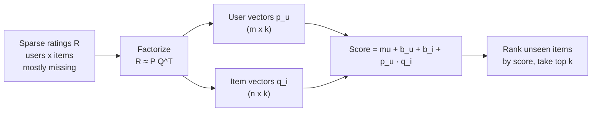
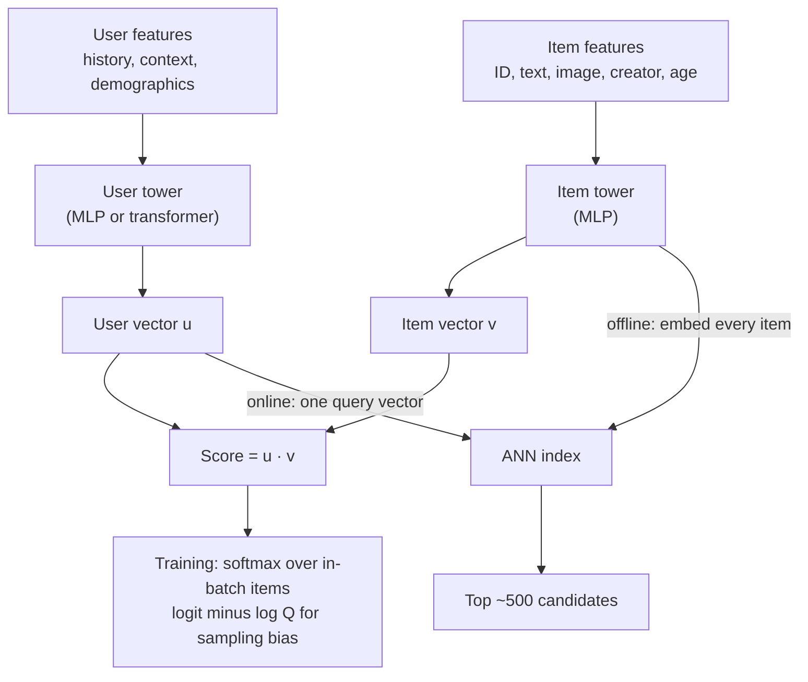
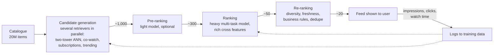
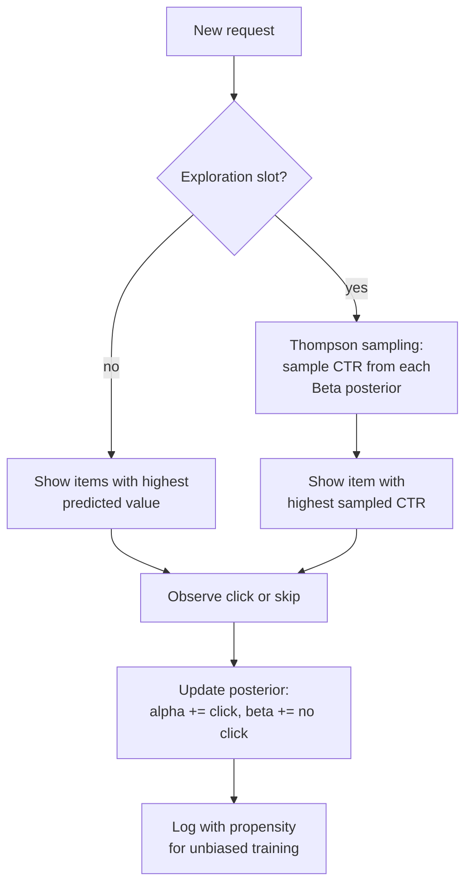
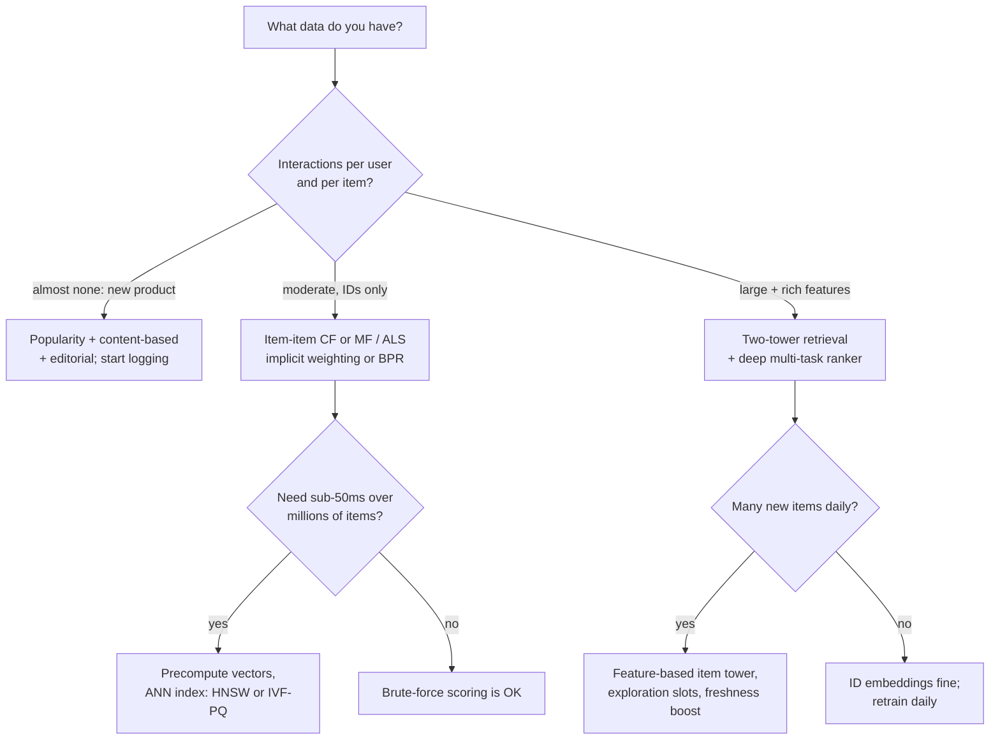

# M09 — Recommendation & Ranking

> **One-sentence big idea.** A recommender learns a vector for every user and every item so
> that "will this user like this item?" becomes a dot product, and a production system is a
> **funnel** — cheap retrieval over millions, expensive ranking over hundreds — trained on
> biased feedback that you must constantly correct for.

**Prerequisites:** [M03 Logistic regression](03-linear-and-logistic-regression.md) ·
[M04 Evaluation](04-evaluation-and-data.md) (precision/recall, leakage) ·
[M05 Gradient boosting](05-trees-and-ensembles.md) ·
[M08 Embeddings](08-embeddings-and-transformers.md) (embeddings, contrastive loss, ANN preview) ·
**Lab:** [Lab 8 — matrix factorization](../labs/08_matrix_factorization.py) ·
**Time:** 2 × 90-minute lectures

## Learning objectives

By the end of this module you will be able to:

- **Frame** a recommendation problem: explicit vs implicit feedback, sparsity, cold start, and
  the right offline metric (RMSE vs recall@k vs NDCG).
- **Derive** matrix factorization and its **SGD** and **ALS** updates, and **implement** both in
  NumPy.
- **Explain** two-tower retrieval with in-batch negatives, **derive** why popular items need a
  sampling-bias (log-Q) correction, and **describe** how HNSW and IVF-PQ make retrieval fast.
- **Design** a multi-stage funnel (candidate generation → ranking → re-ranking) with a latency
  budget, and **choose** a learning-to-rank loss (pointwise, pairwise/BPR, listwise/LambdaMART).
- **Diagnose** feedback loops, position bias and popularity bias, and **apply** exploration
  (ε-greedy, Thompson sampling) and diversity constraints.

---

## 1. The problem

A video platform has 50 million daily users and a catalogue of 20 million videos, growing by
hundreds of thousands per day. When a user opens the app, the home feed must show ~20 videos
**in under 200 ms**. The company cares about long-term satisfaction: users who come back
tomorrow, not just clicks today.

What data do you have? Very little *explicit* opinion — almost nobody rates videos. Instead you
have **implicit feedback**: impressions, clicks, watch time, skips, likes, shares, "not
interested". Each user has interacted with perhaps 200 of the 20 million videos: the user–item
matrix is **99.999% empty**. New videos have no interactions at all (**item cold start**); new
users have no history (**user cold start**). And every interaction you observe was *caused by
the previous recommender* — users can only click what they were shown.

You cannot score 20 million videos with a deep model in 200 ms. You cannot treat "not clicked"
as "disliked". And you cannot evaluate a new recommender simply by replaying old logs. This
module builds, from first principles, the toolkit that every large recommender — Netflix,
YouTube, Amazon, Spotify, TikTok — uses to deal with exactly these constraints.

---

## 2. First principles

### 2.1 The data: a sparse user × item matrix

Let $R \in \mathbb{R}^{m \times n}$ have one row per user $u$ and one column per item $i$.
Entry $r_{ui}$ is the observed feedback; $\Omega$ is the set of observed $(u,i)$ pairs.

| | Explicit feedback | Implicit feedback |
|---|---|---|
| Examples | Star ratings, thumbs up/down | Clicks, plays, purchases, dwell time |
| Volume | Scarce (users rarely rate) | Abundant (every action is logged) |
| Negative signal | Yes (1 star) | **No.** A missing entry means "didn't like" *or* "never saw it" |
| Typical loss | Squared error on observed entries | Classification/ranking over observed + sampled unobserved |
| Typical metric | RMSE | Recall@k, NDCG@k, MAP, and online engagement |

**Missing not at random (MNAR).** Entries are missing *because* of exposure and choice: popular
items are observed more often; users rate what they chose to watch, which they expected to like.
Lab 8 simulates popularity-skewed observation and shows its effect: a "most popular" baseline is
strong precisely because being observed correlates with popularity.

### 2.2 Simplest thing that works: popularity

Recommend the globally most popular items (perhaps within the last day, or per country).
Surprisingly strong (Lab 8: recall@10 = 0.27 vs 0.04 for random), zero cold-start for users,
trivial to serve. Fails at: **personalization** (everyone sees the same thing) and the **long
tail** (niche items never surface, so they never become popular — a rich-get-richer loop).
Always build it first as the baseline that every model must beat.

### 2.3 Content-based filtering

Describe each item by features (genre, text embedding, price, creator) and each user by
the aggregate of items they liked; recommend items whose features are similar to the user's
profile. *Strengths:* handles **new items** immediately (they have features), explainable
("because you watched sci-fi"). *Weaknesses:* recommends more of the same (no serendipity),
and is limited by the quality of hand-made or content features. It cannot learn that people who
like *Interstellar* tend to like a particular jazz documentary unless the features say so.

### 2.4 Collaborative filtering: let other users be the features

**Core assumption:** users who agreed in the past will agree in the future. If Alice and Bob
both loved items A, B and C, and Bob loved D, Alice probably will too — no item features
needed.

- **User–user / item–item neighbourhood methods:** compute similarity between rows (or columns)
  of $R$, e.g. cosine over co-interactions; recommend items similar to those the user liked.
  Item–item is the classic Amazon "customers who bought this also bought" approach (Linden,
  Smith & York, 2003): item similarities are stable and can be precomputed offline.
- Limitation: with 99.999% sparsity most pairs of users share *no* items, so similarities are
  noisy or undefined.

### 2.5 Matrix factorization: the low-rank assumption

Why should $R$ be predictable at all from so few entries? **Assumption: taste is
low-dimensional.** A few latent factors — how much a movie is action vs drama, serious vs
light, mainstream vs arthouse — explain most of the variation in ratings. Then

$$R \approx P Q^\top, \qquad P \in \mathbb{R}^{m \times k},\; Q \in \mathbb{R}^{n \times k},\; k \ll m, n.$$

Each user gets a vector $\mathbf{p}_u$ ("how much I like each factor") and each item a vector
$\mathbf{q}_i$ ("how much of each factor I have"); the predicted affinity is their dot product
$\mathbf{p}_u^\top \mathbf{q}_i$. Nobody labels the factors — they are learned, just like word
embeddings (M08). A $10^6 \times 10^5$ matrix ($10^{11}$ entries) is described by
$(10^6+10^5)\cdot k$ numbers: for $k=64$, ~70 M parameters. That compression *is* the
generalization: the model must explain all observed ratings with few factors, so it is forced
to discover shared structure.

Add **biases** because some users rate everything high and some items are universally loved:

$$\hat{r}_{ui} = \mu + b_u + b_i + \mathbf{p}_u^\top\mathbf{q}_i,$$

where $\mu$ is the global mean, $b_u$ the user bias, $b_i$ the item bias. In the Netflix Prize,
biases alone explained a large share of the variance that a naive model missed.



---

## 3. The algorithm(s)

### 3.1 The objective

Fit only the **observed** entries, with L2 regularization (a Gaussian prior, M02):

$$\min_{P,Q,b}\; \sum_{(u,i)\in\Omega} \left(r_{ui} - \mu - b_u - b_i - \mathbf{p}_u^\top\mathbf{q}_i\right)^2 + \lambda\left(\lVert\mathbf{p}_u\rVert^2 + \lVert\mathbf{q}_i\rVert^2 + b_u^2 + b_i^2\right).$$

Without $\lambda$, a user with one rating can get an arbitrarily large vector that fits it
perfectly — classic overfitting. The objective is **non-convex** jointly in $(P, Q)$ but
**convex in $P$ for fixed $Q$** (and vice versa) — the observation behind ALS.

### 3.2 SGD updates (derivation)

For one observed $(u, i, r)$ define the error $e_{ui} = r_{ui} - \hat{r}_{ui}$. The per-example
loss is $\ell = e_{ui}^2 + \lambda(\lVert\mathbf{p}_u\rVert^2 + \lVert\mathbf{q}_i\rVert^2 + b_u^2 + b_i^2)$.
Since $\partial \hat{r}_{ui}/\partial \mathbf{p}_u = \mathbf{q}_i$:

$$\frac{\partial \ell}{\partial \mathbf{p}_u} = -2e_{ui}\mathbf{q}_i + 2\lambda\mathbf{p}_u,\qquad \frac{\partial \ell}{\partial \mathbf{q}_i} = -2e_{ui}\mathbf{p}_u + 2\lambda\mathbf{q}_i,\qquad \frac{\partial \ell}{\partial b_u} = -2e_{ui} + 2\lambda b_u.$$

Absorbing the 2 into the learning rate $\eta$:

$$\begin{aligned}
b_u &\leftarrow b_u + \eta\,(e_{ui} - \lambda b_u), & b_i &\leftarrow b_i + \eta\,(e_{ui} - \lambda b_i),\\
\mathbf{p}_u &\leftarrow \mathbf{p}_u + \eta\,(e_{ui}\,\mathbf{q}_i - \lambda\mathbf{p}_u), & \mathbf{q}_i &\leftarrow \mathbf{q}_i + \eta\,(e_{ui}\,\mathbf{p}_u - \lambda\mathbf{q}_i).
\end{aligned}$$

(Use the *old* $\mathbf{p}_u$ in the $\mathbf{q}_i$ update.) Intuition: if the prediction is too
low ($e>0$), move the user vector towards the item vector and vice versa, so their dot product
grows.

**Worked step.** $\mu=3.5$, $b_u=0.2$, $b_i=-0.3$, $\mathbf{p}_u=(0.5, 0.2)$,
$\mathbf{q}_i=(0.4,-0.1)$, observed $r=4$, $\eta=0.1$, $\lambda=0.1$.
Prediction $= 3.5+0.2-0.3+(0.2-0.02) = 3.58$; error $e=0.42$.
Updates: $b_u \to 0.24$, $b_i \to -0.255$, $\mathbf{p}_u \to (0.5118, 0.1938)$,
$\mathbf{q}_i \to (0.4170, -0.0906)$. New prediction $= 3.681$ — moved towards 4.

### 3.3 ALS updates (derivation)

Fix $Q$. The objective splits into **independent** problems, one per user:

$$\min_{\mathbf{p}_u} \sum_{i \in \Omega_u} (r_{ui} - \mathbf{p}_u^\top\mathbf{q}_i)^2 + \lambda\lVert\mathbf{p}_u\rVert^2,$$

where $\Omega_u$ is the set of items user $u$ rated (biases folded in by augmenting vectors with a
constant 1, as in the lab). This is **ridge regression** with design matrix $Q_u$ (rows
$\mathbf{q}_i$ for $i\in\Omega_u$) and targets $\mathbf{r}_u$. Setting the gradient to zero:

$$\mathbf{p}_u = \left(Q_u^\top Q_u + \lambda I\right)^{-1} Q_u^\top \mathbf{r}_u.$$

Symmetrically $\mathbf{q}_i = (P_i^\top P_i + \lambda I)^{-1}P_i^\top\mathbf{r}_i$. Alternate.

**Worked step** ($k=1$): a user rated two items with $q_1=1, q_2=2$, ratings $2$ and $4$,
$\lambda=1$. $p_u = (1\cdot2 + 2\cdot4)/(1^2+2^2+1) = 10/6 = 1.667$. Without regularization it
would be $10/5 = 2$: the prior shrinks users with little data towards 0 (i.e. towards the
biases).

**Why ALS?** Each half-step is an *exact* minimization, so the objective never increases (Lab 8
asserts monotonic decrease) and there is no learning rate. Each user's solve is independent →
**embarrassingly parallel** (Spark MLlib's ALS). Cost per sweep: $O(|\Omega| k^2 + (m+n)k^3)$.
And for **implicit** feedback, ALS can handle the *full* matrix efficiently (§3.4), which SGD
cannot.

| | SGD | ALS |
|---|---|---|
| Hyperparameters | Learning rate, epochs, λ | λ, iterations |
| Per-iteration cost | $O(\lvert\Omega\rvert k)$ | $O(\lvert\Omega\rvert k^2 + (m+n)k^3)$ |
| Parallelism | Hogwild/asynchronous, tricky | Trivially parallel per user / item |
| Implicit full-matrix loss | Must sample negatives | Exact, via the $Q^\top Q$ trick |
| Extensible to side features / deep models | Yes (it's just gradient descent) | Awkward |

Lab 8 results (500 users × 300 items, 8% observed, true rank 4): global mean RMSE 0.904,
bias-only 0.859, **MF-SGD 0.549, MF-ALS 0.533**.

### 3.4 Implicit feedback: confidence weighting

With implicit data (Hu, Koren & Volinsky, 2008) define a **preference** $p_{ui} = 1$ if
$r_{ui} > 0$ (user interacted) else 0, and a **confidence** $c_{ui} = 1 + \alpha r_{ui}$ (more
plays = more confident). Now the loss is over **all** $m\times n$ entries:

$$\min_{P,Q} \sum_{u,i} c_{ui}\left(p_{ui} - \mathbf{p}_u^\top \mathbf{q}_i\right)^2 + \lambda(\lVert P\rVert^2 + \lVert Q\rVert^2).$$

Unobserved entries are treated as weak negatives (confidence 1), not ignored. Naively the
ALS solve touches all $n$ items per user, but $Q^\top C_u Q = Q^\top Q + Q^\top(C_u - I)Q$, and
$C_u - I$ is non-zero only on the user's observed items. Precompute $Q^\top Q$ once per sweep:
each user then costs $O(|\Omega_u|k^2 + k^3)$. This "weighted ALS" became a standard
baseline for implicit-feedback systems.

### 3.5 Two-tower models: deep retrieval

MF can only use IDs. Real systems have rich features: user history, demographics, context
(time, device), item text/image embeddings, creator, freshness. A **two-tower model**
generalizes MF: a user tower $f_\theta(\text{user features}) \to \mathbf{u}$ and an item tower
$g_\phi(\text{item features}) \to \mathbf{v}$, scored by $\mathbf{u}^\top\mathbf{v}$. MF is the
special case where each tower is a single embedding lookup.

Crucially, the towers **don't interact until the dot product**, so item vectors can be
precomputed for the whole catalogue and indexed for ANN search; at request time compute one user
vector and search. Item features (not just IDs) also solve **item cold start**: a new video's
title/thumbnail/creator give it a vector before anyone watches it.

**Training with in-batch negatives.** Training pairs are (user, item they engaged with). For a
batch of $B$ pairs, treat the other $B-1$ items as negatives and use softmax cross-entropy over
the batch (the CLIP/InfoNCE loss from M08):

$$\mathcal{L} = -\frac{1}{B}\sum_{j=1}^{B} \log\frac{\exp(s(\mathbf{u}_j,\mathbf{v}_j))}{\sum_{l=1}^{B}\exp(s(\mathbf{u}_j,\mathbf{v}_l))}.$$

**Sampling bias correction (log-Q).** In-batch negatives are sampled *proportional to
popularity* (an item appears in batches as often as it is engaged with). The model is therefore
penalized for scoring popular items highly far more often than it would be under uniform
negatives, and learns to *under-rate* them. The fix (Yi et al., 2019, from YouTube): subtract the
log of each item's sampling probability $Q_l$ from its logit during training,

$$s^c(\mathbf{u}_j, \mathbf{v}_l) = \mathbf{u}_j^\top\mathbf{v}_l - \log Q_l.$$

*Worked:* an item in 1% of batches gets $-\log 0.01 = +4.6$ added; an item in 0.001% gets $+11.5$.
Rare items get a bigger boost during training, compensating for being under-sampled as negatives,
so the learned dot product estimates the *unbiased* softmax. At serving time, use the raw dot
product. $Q_l$ is estimated with a streaming frequency counter. Complement in-batch negatives with
**uniformly sampled** and **hard** negatives (items scored high but not engaged with).



### 3.6 ANN retrieval: HNSW and IVF-PQ

Exact top-$k$ over 20 M items × 128 dims is ~2.6 GFLOP per request — too slow and too costly at
50 k requests/second. **Approximate nearest neighbour** search accepts slightly imperfect recall
for 100–1000× speed-ups.

- **IVF (inverted file):** run k-means (M06) on item vectors to get $C$ centroids (e.g.
  $C = \sqrt{N} \approx 4{,}500$). Store each item in its centroid's list. At query time, find
  the $n_{probe}$ nearest centroids (e.g. 32) and search only their lists — ~0.7% of the data.
  Recall knob: $n_{probe}$.
- **PQ (product quantization):** compress each 128-d float vector (512 bytes) by splitting it
  into 16 sub-vectors of 8 dims and replacing each with the ID of its nearest of 256 sub-centroids
  → 16 bytes per item (32× smaller). Distances are computed from small lookup tables. IVF-PQ fits
  a billion vectors in RAM on one machine (FAISS).
- **HNSW (hierarchical navigable small world):** a multi-layer proximity graph. Start at the
  sparse top layer, greedily walk to the neighbour closest to the query, drop a layer, repeat —
  like a skip list for vector space. Excellent recall/latency; higher memory (stores graph edges
  plus full vectors). Knobs: `M` (edges per node), `ef_search` (beam width).

Rule of thumb: HNSW when the index fits in memory and you want the best recall/latency; IVF-PQ when
memory is the binding constraint (billions of vectors). Always measure **recall@k against exact
search** on a sample of queries.

### 3.7 The multi-stage funnel



**Why a funnel?** Model cost × number of items scored must fit the latency budget. Each stage
uses a model whose cost is affordable for the number of items it sees:

| Stage | Items in | Model | Optimized for | Latency budget (example) |
|---|---|---|---|---|
| Candidate generation | millions | Dot product + ANN; heuristics | **Recall** (don't lose good items) | 20–40 ms |
| Ranking | hundreds–1k | GBDT or deep net with user×item cross features | **Precision** at the top, calibrated multi-objective scores | 50–80 ms |
| Re-ranking | tens | Rules + small models | Whole-page quality: diversity, freshness, fairness, policy | 5–10 ms |

The ranker can use **cross features** the two-tower model cannot (e.g. "has this user watched
this creator in the last hour?", "item's CTR for users in this country"), because it scores
only hundreds of items. It is often a deep model or GBDT (M05) trained on impression logs.

### 3.8 Learning to rank

The goal is the right **order** at the top, not accurate scores everywhere.

- **Pointwise:** predict a label per item independently (click probability via logistic
  regression; rating via regression). Simple and gives **calibrated** probabilities (needed when
  scores are combined or used for ads bidding), but the loss doesn't focus on order.
- **Pairwise:** for a user, a positive item $i$ should outscore a negative item $j$.
  **BPR** (Bayesian Personalized Ranking, Rendle et al., 2009) maximizes
  $$\sum_{(u,i,j)} \log\sigma(\hat{x}_{ui} - \hat{x}_{uj}) - \lambda\lVert\Theta\rVert^2,$$
  where $j$ is a sampled unobserved item. It directly optimizes a smooth version of AUC per user
  and is the natural loss for implicit feedback. (Same Bradley–Terry form as the RLHF reward
  model in M08.)
- **Listwise:** optimize a metric over the whole ranked list, typically **NDCG**:
  $$\text{DCG@}k = \sum_{pos=1}^{k}\frac{2^{rel_{pos}}-1}{\log_2(pos+1)},\qquad \text{NDCG@}k = \frac{\text{DCG@}k}{\text{IDCG@}k}.$$
  NDCG is non-differentiable (it depends on sorting). **LambdaRank/LambdaMART** intuition: take
  the pairwise gradient for each mis-ordered pair and **scale it by $|\Delta\text{NDCG}|$**, the
  change in NDCG if the two items swapped positions. Swapping positions 1 and 2 matters far more
  than swapping 50 and 51, so the model spends its capacity on the top of the list. LambdaMART
  plugs these "lambda" gradients into gradient-boosted trees (M05) and was the dominant
  web-search ranker for years.

**Worked NDCG.** Relevances in ranked order: $[3, 2, 0, 1]$, linear gain $rel$ for simplicity:
DCG $= 3/1 + 2/1.585 + 0 + 1/2.322 = 4.693$. Ideal order $[3,2,1,0]$: IDCG $= 3 + 1.262 + 0.5 =
4.762$. NDCG $= 0.985$. Swapping the 0 and the 1 costs only 1.5% because it happens at positions
3–4; the same mistake at positions 1–2 would cost far more.

### 3.9 Multi-task ranking

Clicks alone reward clickbait. Real rankers predict several outcomes and combine them:

$$\text{score} = w_1\,P(\text{click}) + w_2\,\mathbb{E}[\text{watch time} \mid \text{click}] + w_3\,P(\text{like}) - w_4\,P(\text{"not interested"}) + \dots$$

- **Shared-bottom** networks share lower layers across task heads; **MMoE** (multi-gate mixture
  of experts, used in YouTube's "Recommending What Video to Watch Next", 2019) lets each task
  mix shared experts with its own gate, reducing negative transfer between conflicting tasks.
- YouTube's 2016 DNN paper predicted **expected watch time** with *weighted* logistic regression:
  positive (clicked) impressions weighted by watch time, so the learned odds approximate expected
  watch time — a neat trick to turn a regression target into a classification model.
- The weights $w$ encode product strategy and are tuned with online experiments, not offline loss.

### 3.10 Exploration, diversity, freshness

**The feedback loop.** The model is trained on what it showed. Items it never shows never get
data, so their estimates never improve → they are never shown. Popular items get more popular.
Exploration breaks the loop by deliberately gathering information.

**Multi-armed bandits.** Each candidate is an "arm" with unknown reward rate (e.g. CTR).

- **ε-greedy:** with probability $1-\epsilon$ show the best-estimated item; with probability $\epsilon$
  show a random one. Simple; wastes exploration on obviously bad items.
- **Thompson sampling:** keep a posterior per arm — for clicks, $\text{Beta}(1+\text{clicks},
  1+\text{non-clicks})$ — **sample** a CTR from each posterior and show the arm with the
  highest sample. *Worked:* item A has 30 clicks / 100 impressions → Beta(31, 71), mean 0.30, narrow.
  Item B is new: 1 click / 2 impressions → Beta(2, 2), mean 0.5, very wide. B's samples
  range over roughly 0.1–0.9, so B gets shown often enough to learn its true rate; if it's bad,
  its posterior narrows and it stops winning. Exploration is automatically proportional to
  uncertainty.
- **Contextual bandits** (e.g. LinUCB) condition on user/item features — the ranker plus an
  uncertainty bonus. In practice, a small slice of traffic or a few feed slots are reserved for
  exploration (new items, new creators).



**Diversity and freshness** live in the re-ranker: e.g. **MMR** (maximal marginal relevance)
greedily picks the next item maximizing $\lambda\cdot\text{relevance} - (1-\lambda)\cdot\max
\text{similarity to items already chosen}$; limit items per creator; boost items younger than
$X$ hours; enforce category mixes.

### 3.11 Position bias

Items at the top of a list get clicked more *because* they are at the top. Training naively on
click logs teaches the model "whatever was ranked first is good" — the model learns its own past
ranking. Fixes:

1. **Position as a feature during training**, set to a constant (e.g. position 1) at serving:
   the model attributes the position effect to the feature, not the item.
2. **Inverse propensity weighting (IPW):** estimate the probability $\theta_{pos}$ that position
   $pos$ is examined (from randomization experiments, e.g. swapping adjacent results), and weight
   clicks by $1/\theta_{pos}$.
3. **Shallow tower** for position/device features whose output is added to the logit during
   training and dropped at serving (used in YouTube's 2019 ranking paper).

---

## 4. Diagrams

Diagrams sit beside the text they explain:

- **Matrix factorization data flow** (§2.5): sparse $R$ → user/item vectors → scores.
- **Two-tower training and serving** (§3.5): offline item indexing, online user vector, ANN.
- **The multi-stage funnel with the feedback loop** (§3.7).
- **Exploration decision logic with Thompson sampling** (§3.10).

And the decision logic for choosing an approach given the data you have:



---

## 5. Code

The full, self-checking version is [Lab 8](../labs/08_matrix_factorization.py). Core pieces:

```python
import numpy as np

def mf_sgd_epoch(triples, mu, bu, bi, P, Q, lr=0.02, lam=0.05, rng=np.random.default_rng(0)):
    for u, i, r in triples[rng.permutation(len(triples))]:
        u, i = int(u), int(i); pu = P[u].copy()
        e = r - (mu + bu[u] + bi[i] + pu @ Q[i])
        bu[u] += lr * (e - lam * bu[u]);  bi[i] += lr * (e - lam * bi[i])
        P[u]  += lr * (e * Q[i] - lam * pu); Q[i] += lr * (e * pu - lam * Q[i])

def als_solve_user(Q_u, r_u, lam):
    """Ridge regression for one user: (Q_u^T Q_u + lam I)^-1 Q_u^T r_u."""
    k = Q_u.shape[1]
    return np.linalg.solve(Q_u.T @ Q_u + lam * np.eye(k), Q_u.T @ r_u)

def recall_at_k(scores, seen_mask, liked_mask, k=10):
    s = np.where(seen_mask, -np.inf, scores)            # never recommend seen items
    topk = np.argpartition(-s, k, axis=1)[:, :k]
    hit = np.take_along_axis(liked_mask, topk, axis=1).sum(1)
    n = liked_mask.sum(1); ok = n > 0
    return (hit[ok] / n[ok]).mean()

def bpr_step(u, i, j, P, Q, lr=0.05, lam=0.01):        # i positive, j sampled negative
    x = P[u] @ (Q[i] - Q[j]); g = 1 / (1 + np.exp(x))   # = 1 - sigmoid(x)
    pu = P[u].copy()
    P[u] += lr * (g * (Q[i] - Q[j]) - lam * P[u])
    Q[i] += lr * (g * pu - lam * Q[i]); Q[j] += lr * (-g * pu - lam * Q[j])
```

**Lab 8 output (abridged)**

```text
[1] RMSE:  global mean 0.904 | bias-only 0.859 | MF-SGD 0.549 | MF-ALS 0.533
[2] recall@10: random 0.043 | most popular 0.273 | MF-ALS 0.176 | MF-ALS + log(popularity) 0.332
```

Notice the lesson in [2]: the RMSE-trained model ranks *worse* than popularity on its own,
because in MNAR data an item must be **exposed** before it can be liked, and RMSE only learns
"how much would they rate it *if* they watched". Blending with an exposure prior beats both.
This is why production systems train on *implicit* engagement with ranking losses and model
exposure explicitly.

**What the library hides:**

```python
implicit.als.AlternatingLeastSquares(factors=64, regularization=0.05).fit(user_items)  # weighted ALS
pyspark.ml.recommendation.ALS(rank=64, implicitPrefs=True)                              # distributed
faiss.IndexHNSWFlat(d, 32); faiss.IndexIVFPQ(quantizer, d, nlist=4096, m=16, nbits=8)   # ANN
lightgbm.LGBMRanker(objective="lambdarank")                                             # LambdaMART
```

---

## 6. Real-world applications

**1. The Netflix Prize (2006–2009).**
*Task:* predict star ratings; $1 M for a 10% RMSE improvement over Netflix's Cinematch. *What
won:* matrix factorization with biases, temporal dynamics (user biases drift; items age) and
implicit signals ("which movies did the user *rate*, regardless of value" — SVD++), blended
with hundreds of other models (Koren, Bell & Volinsky, 2009). *Lessons that outlived it:*
latent factor models + biases are a strong baseline; and **RMSE on ratings was the wrong
target** — Netflix publicly noted it never deployed the full winning ensemble, since engineering
cost outweighed the gain and the product had moved to streaming, where what users *play*
(implicit) matters more than what they rate.

**2. YouTube recommendations (Covington, Adams & Sargin, RecSys 2016).**
*Task:* recommend from millions of videos to over a billion users. *Architecture:* the funnel
in §3.7. **Candidate generation** framed as extreme multi-class classification ("which video
will this user watch next?") with a softmax over the corpus trained with sampled negatives,
user vector built from averaged watch-history and search-token embeddings plus demographics;
served by nearest-neighbour search. **Ranking** with a deep network over hundreds of features,
trained with weighted logistic regression to predict expected watch time. Notable details:
the "example age" feature to model freshness; predicting the *next* watch rather than a held-out
random watch (to avoid leaking the future). Later papers added the log-Q sampling-bias
correction for two-tower retrieval (Yi et al., 2019) and multi-task MMoE ranking with a
position-bias shallow tower (Zhao et al., 2019).

**3. E-commerce "customers who bought this also bought".**
*Task:* item-to-item recommendations on product pages and in email. *Publicly documented:*
Amazon's item-to-item collaborative filtering (Linden, Smith & York, *IEEE Internet Computing*
2003): compute item–item similarity from co-purchase vectors offline; at request time, look up
neighbours of the items in the user's cart/history — fast and scales with the catalogue, not
the user base. *Modern variants:* item embeddings from session co-occurrence (item2vec, M08),
graph-based models, and two-tower retrieval. *Constraints:* complementary vs substitute products
(after buying a TV, recommend a wall mount, not another TV), inventory and margin, and strong
seasonality.

**4. Music streaming and short-video feeds** (named generically). Session-based recommendation
with sequence models (transformers over the recent sequence of plays/swipes), heavy use of
**exploration** for new creators, and **fast feedback loops** (models updated within minutes from
streaming engagement data) because a session's intent changes quickly.

---

## 7. System-design hook

"Design a recommendation system for X" (feed, videos, products, friends, jobs, ads) is the
single most common ML system design question. A strong answer has a recognizable shape:

1. **Clarify the objective.** What does success mean — clicks, watch time, purchases, 7-day
   retention? Name the **north-star metric** and **guardrails** (e.g. "not interested" rate,
   creator diversity, latency). Warn about optimizing clicks → clickbait.
2. **Frame the ML task.** Retrieval = "which items might the user engage with" (two-tower,
   in-batch softmax). Ranking = multi-task prediction of P(click), E[watch time], P(like),
   P(hide), combined with tunable weights.
3. **Data and labels.** Impression logs joined to engagement; define positives/negatives
   (impressed-but-not-clicked is a real negative; never-impressed is unknown). Point-in-time
   correct features (no leakage of future engagement — M04).
4. **The funnel with numbers.** Multiple retrievers → ~1k candidates → ranker → re-ranker → 20
   items; latency budget per stage (table in §3.7).
5. **Cold start.** New users: popularity by locale, onboarding questions, contextual features;
   new items: content-feature towers, exploration slots, freshness boosts.
6. **Evaluation.** Offline: recall@k for retrieval, NDCG/AUC for ranking, on **time-based**
   splits. Online: A/B test on the north-star metric with guardrails; interleaving for faster
   ranker comparisons. Mention that offline–online correlation is imperfect.
7. **Biases and feedback loops.** Position bias, popularity bias, exploration, logged propensities.

**What interviewers probe:** "Why not one big model?" (cost × items scored), "How do you pick
negatives?" (in-batch + random + hard, with log-Q), "How do you handle a brand-new video?",
"How do you know the new ranker is better?" (A/B, not just offline NDCG), "How fresh must
features and models be?" (real-time user history features vs daily retraining).

---

## 8. Pitfalls & debugging

| Symptom | Likely cause | Detect | Fix |
|---|---|---|---|
| Great offline metric, no online gain | Random (not time-based) split leaks future; offline metric ≠ business goal; exposure bias in logs | Compare with a time-based split; check metric alignment | Train on past, test on future; choose metric matching the product; A/B test |
| Recommendations all popular items | Popularity bias; in-batch negatives without log-Q; un-normalized embeddings | Coverage and long-tail share of recommendations | log-Q correction; normalize; diversity constraints; exploration |
| New items never get shown | ID-only model; feedback loop | Impressions of items younger than 24 h | Content features in item tower; exploration slots; freshness feature |
| Model "learns" position | Training on raw clicks without position handling | Feature importance of position; CTR vs rank curve | Position feature set constant at serving; IPW; shallow tower |
| Training/serving skew in features | Features computed differently offline (batch) vs online (stream) | Log served features and compare with training features | Feature store with a single definition; log-and-train |
| Same item shown repeatedly / near-duplicates | No re-ranking dedupe | Duplicate rate per page | Dedupe by embedding similarity; per-creator caps |
| Clickbait rises | Ranking weighted toward P(click) | Rising CTR but falling watch time or rising "not interested" | Multi-task objective; satisfaction surveys as labels; guardrail metrics |
| ANN recall silently drops | Index built on old embeddings; parameters too aggressive | Periodic recall@k vs exact search on sampled queries | Rebuild index with each model version; tune `nprobe`/`ef` |
| MF overfits heavy users / noise for light users | λ too small; no biases | Train vs test RMSE by user activity bucket | Tune λ; add biases; frequency-aware regularization |

---

## 9. Exercises

**Conceptual**
1. ★ Why is "the user did not click item $i$" weaker evidence than "the user rated item $i$ one
   star"? Give two reasons a user might not interact with an item they would like.
2. ★ Explain why the funnel uses a dot-product model for retrieval but allows cross features in
   ranking.
3. ★★ Why do in-batch negatives over-penalize popular items? What would happen to recommendations
   without the log-Q correction?
4. ★★ Compare ε-greedy and Thompson sampling on a catalogue with 1,000 bad items and 5 good new
   items. Which wastes more impressions and why?
5. ★★ How can a recommender's own feedback loop make its offline evaluation over-optimistic?

**Derivation / math**
1. ★ Derive the SGD updates for biased MF (§3.2) including the bias terms.
2. ★★ Derive the ALS closed-form update for $\mathbf{p}_u$, and show how to fold in the user
   bias by augmenting $\mathbf{q}_i$ with a constant 1.
3. ★★ Derive the BPR gradient for $\mathbf{p}_u$, $\mathbf{q}_i$, $\mathbf{q}_j$ and show it
   matches `bpr_step` in §5.
4. ★★ Compute NDCG@3 for relevances $[0, 3, 2]$ (exponential gain $2^{rel}-1$). Which single
   swap improves it most?
5. ★★★ Show that weighted logistic regression with positives weighted by watch time $T_i$ and
   unit-weight negatives learns odds $\approx \mathbb{E}[T](1+P)\approx\mathbb{E}[T]$ when the
   click probability $P$ is small (YouTube 2016).

**Coding**
1. ★ Run Lab 8; sweep $k \in \{1,2,4,8,16,32\}$ and $\lambda$ for ALS; plot test RMSE.
2. ★★ Implement BPR on Lab 8's data treated as implicit feedback. Compare recall@10 with the
   RMSE-trained MF.
3. ★★ Implement Thompson sampling for 20 arms with Bernoulli rewards; plot cumulative regret vs
   ε-greedy with $\epsilon \in \{0.01, 0.1\}$.
4. ★★★ Implement a tiny IVF index (k-means + inverted lists) over the item vectors learned in
   Lab 8 and measure recall@10 vs exact search as a function of `n_probe`.

**Design**
1. ★★★ Design the home feed for the video platform in §1 (50 M DAU, 20 M videos, 200 ms p99).
   Specify: objective and guardrails, retrievers, ranker labels and features, negative sampling,
   cold start, exploration, position-bias handling, offline/online evaluation, retraining cadence,
   and a latency budget table.

---

## 10. Interview questions

<details>
<summary>Q1. Explain matrix factorization for recommendations and why it works.</summary>

Represent each user and item by a $k$-dimensional latent vector so the predicted affinity is
$\mu + b_u + b_i + \mathbf{p}_u^\top\mathbf{q}_i$. It works because taste is approximately
low-rank — a few latent factors explain most preferences — so a huge sparse matrix can be
described by far fewer parameters, which forces the model to share information across users
and items (collaborative filtering). Train on observed entries with L2 regularization via SGD
or ALS; for implicit feedback, use confidence-weighted ALS or a ranking loss like BPR.
</details>

<details>
<summary>Q2. SGD vs ALS for matrix factorization — when would you choose each?</summary>

ALS solves an exact ridge regression per user (then per item), so it needs no learning rate,
decreases the objective monotonically, and parallelizes trivially; it also handles the
full-matrix implicit-feedback loss efficiently via the $Q^\top Q$ precomputation. SGD is cheaper
per update, simpler to extend with side features, other losses (BPR) or deep models, and works
with streaming data. Choose ALS for large implicit-feedback MF on Spark-like infrastructure;
choose SGD-style training for anything that grows beyond pure MF.
</details>

<details>
<summary>Q3. Why do large recommenders use a multi-stage funnel?</summary>

Because cost per item × number of items must fit the latency budget. A heavy ranking model
with cross features may take ~0.1 ms per item, so it can score hundreds of items, not millions.
Candidate generation uses cheap models — precomputed item embeddings with ANN search, co-occurrence
lists, heuristics — optimized for recall to shrink millions to ~1,000; ranking optimizes precision
of the top with a rich multi-task model; re-ranking handles page-level concerns like diversity,
freshness, deduplication and business rules.
</details>

<details>
<summary>Q4. How do you train a two-tower retrieval model, and what is the sampling-bias problem?</summary>

Positives are (user, engaged item) pairs; the loss is a softmax over the batch, treating other
items in the batch as negatives (cheap, many negatives). But items appear in batches in proportion
to their popularity, so popular items are over-used as negatives and the model learns to
under-score them. Correct by subtracting $\log Q_i$ (the item's estimated sampling probability)
from its logit during training. Add random and hard negatives, normalize embeddings with a
temperature, and evaluate with recall@k on a future time window.
</details>

<details>
<summary>Q5. How do you handle cold start for new users and new items?</summary>

New users: popularity within their context (country, language, device, time), onboarding
signals (chosen topics), and fast session-based updating from their first few interactions;
two-tower user towers that use context features rather than only a user ID. New items: an
item tower that uses content features (text, image, creator, category) so the item has a vector
immediately, plus explicit exploration (reserved slots, bandits) and freshness boosts so it
collects interactions; then ID embeddings take over as data accrues.
</details>

<details>
<summary>Q6. Pointwise vs pairwise vs listwise learning to rank?</summary>

Pointwise predicts a label per item (e.g. P(click) with log loss) — simple and calibrated, which
matters when scores are combined or used in auctions, but not focused on order. Pairwise (BPR,
RankNet) learns that a preferred item should outscore a less-preferred one — matches the ranking
task and implicit feedback. Listwise (LambdaMART, softmax losses) optimizes list metrics like NDCG,
weighting mistakes at the top more heavily. In practice: pointwise multi-task with calibration in
feed/ads ranking; pairwise/listwise for search ranking where order at the top is everything.
</details>

<details>
<summary>Q7. What is position bias and how do you correct it?</summary>

Users click higher-ranked items more regardless of relevance, so click logs confound relevance
with position, and a naively trained model learns to reproduce its previous ranking. Corrections:
include position as a training feature and set it to a fixed value at serving; or a separate
shallow tower for position whose output is dropped at serving; or inverse propensity weighting
using examination probabilities estimated from randomized experiments (e.g. swapping adjacent
results).
</details>

<details>
<summary>Q8. Why do recommenders need exploration, and how would you implement it?</summary>

The model only learns about items it shows, so a pure exploit policy creates a feedback loop:
uncertain or new items are never shown and never improve, and popular items dominate. Exploration
spends a small amount of traffic to gather information. ε-greedy is simplest; Thompson sampling
explores in proportion to uncertainty by sampling each item's reward from its posterior (Beta for
CTR); contextual bandits add features. In production, reserve a few slots or a traffic slice, log
the propensity of each shown item so later training and offline evaluation can be debiased, and
monitor the cost in short-term engagement.
</details>

---

## Further reading

1. Koren, Bell & Volinsky, "Matrix Factorization Techniques for Recommender Systems",
   *IEEE Computer* (2009); Hu, Koren & Volinsky, "Collaborative Filtering for Implicit Feedback
   Datasets" (ICDM 2008).
2. Covington, Adams & Sargin, "Deep Neural Networks for YouTube Recommendations" (RecSys 2016);
   Yi et al., "Sampling-Bias-Corrected Neural Modeling for Large Corpus Item Recommendations"
   (RecSys 2019); Zhao et al., "Recommending What Video to Watch Next" (RecSys 2019).
3. Rendle et al., "BPR: Bayesian Personalized Ranking from Implicit Feedback" (UAI 2009);
   Burges, "From RankNet to LambdaRank to LambdaMART: An Overview" (Microsoft Research TR, 2010).
4. Linden, Smith & York, "Amazon.com Recommendations: Item-to-Item Collaborative Filtering",
   *IEEE Internet Computing* (2003).
5. Malkov & Yashunin, "Efficient and robust approximate nearest neighbor search using
   Hierarchical Navigable Small World graphs" (2016); Jégou, Douze & Schmid, "Product Quantization
   for Nearest Neighbor Search" (TPAMI 2011); Russo et al., "A Tutorial on Thompson Sampling" (2018).
