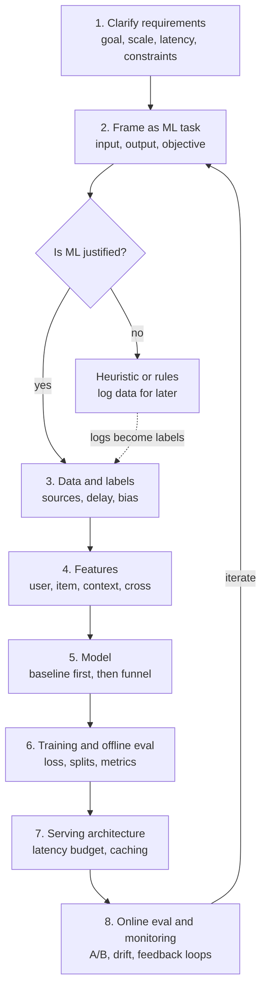
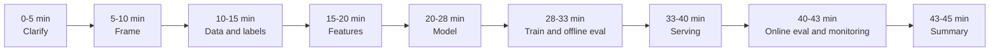
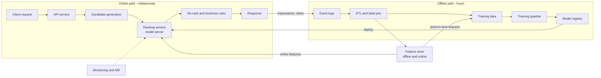
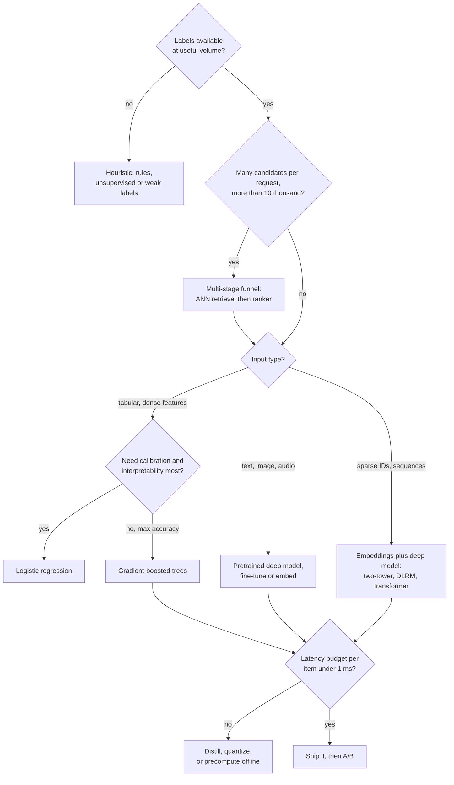
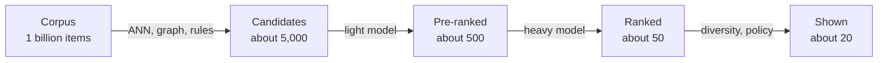
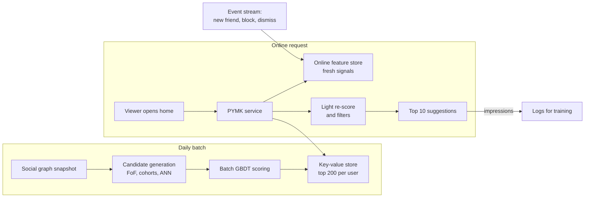

# M10 — The ML System Design Framework

> **Big idea:** An ML system design interview is not a quiz about models. It tests whether you can turn a vague business wish into a measurable ML problem, then build a system around it that is cheap enough, fast enough, and safe enough to ship and keep improving. A repeatable framework turns 45 minutes of panic into 45 minutes of steering.

**Prerequisites:** [M04 Evaluation, data & features](../modules/04-evaluation-and-data.md) · [M05 Trees & ensembles](../modules/05-trees-and-ensembles.md) · [M08 Embeddings & transformers](../modules/08-embeddings-and-transformers.md) · [M09 Recommendation & ranking](../modules/09-recommendation-and-ranking.md)
**Lab:** Design studio (no code lab): framing drills in pairs, using the [mock interview bank](../assessments/mock-interview-bank.md) and the [rubric](../assessments/ml-system-design-rubric.md)
**Time:** 2 × 90-minute lectures

## Learning objectives

- **Explain** what an ML system design interview measures and how interviewers score it (signal areas, levels, red flags).
- **Apply** an 8-step framework to any prompt, keeping to a 45-minute time budget.
- **Translate** a business objective into a proxy ML objective, a label definition, and online/offline metrics, and **diagnose** where Goodhart's law will bite.
- **Estimate** QPS, storage, embedding-index size, compute, and latency budgets with back-of-envelope arithmetic.
- **Choose** between heuristics, a simple model, and a complex model, and **justify** the multi-stage funnel when the candidate set is large.
- **Design** a complete end-to-end system ("People You May Know") under interview conditions.

---

## 1. The problem

It is 10:00 on interview day. The interviewer says:

> "We'd like to help users find people they know on our social network. How would you design that?"

Then they stop talking. There is no dataset, no metric, no latency number, no label. Every candidate in the room knows what logistic regression is. Few candidates know **what to do next**. Weak candidates do one of two things:

1. **Jump to a model.** "I'd use a graph neural network." Ten minutes later they discover they never decided what a positive example is, and the interviewer has written "no problem framing" on the scorecard.
2. **Wander.** They talk about data, then models, then data again, then run out of time before ever drawing a serving architecture. The interviewer writes "unstructured; could not drive the conversation."

Real ML teams fail in exactly the same two ways, only more expensively: a team spends a quarter building a sophisticated model that optimizes the wrong thing, or ships a model with no monitoring and quietly loses money for six months. The interview is a compressed simulation of that job. The fix, in both cases, is a **framework**: a fixed sequence of questions that forces you to make the important decisions in the right order, and makes your reasoning visible.

This module gives you that framework, the numbers you need to sanity-check designs, and a full worked example. The next two modules ([M11](11-data-and-training-infrastructure.md), [M12](12-serving-monitoring-experimentation.md)) go deep on the infrastructure that the framework's later steps refer to, and the eight case studies apply it end to end.

---

## 2. First principles

### 2.1 What is actually being tested?

An interviewer has 45 minutes to predict whether you would be a good ML engineer on their team. They cannot watch you work for six months, so they watch you **make decisions under ambiguity** and listen to **why** you make them. Most companies' rubrics (the exact wording varies; ours is in [the course rubric](../assessments/ml-system-design-rubric.md)) collapse into five signal areas:

| Signal area | What the interviewer is asking themselves | What earns credit |
|---|---|---|
| **Problem framing** | Can they turn a fuzzy goal into an ML task with a label? | Clear objective, proxy metric, label definition, explicit assumptions |
| **Data & features** | Do they know where data comes from and how it breaks? | Label sources, leakage awareness, freshness, sampling, privacy |
| **Modeling** | Do they pick models for reasons? | Baseline first, trade-offs (latency, interpretability, data size), loss choice |
| **Systems / production** | Could this run at scale? | Serving architecture, latency budget, caching, offline/online split, estimates |
| **Evaluation & iteration** | Will they know if it works, and keep it working? | Offline + online metrics, A/B design, guardrails, monitoring, feedback loops |

Two cross-cutting signals sit on top: **communication** (do you drive the conversation, summarise, and check in?) and **seniority** (do you see second-order effects: feedback loops, cost, organisational ownership, failure modes?).

How it is scored, in practice: each area gets a rating (e.g. strong no / no / yes / strong yes) and the overall decision is calibrated to a **level**. A junior candidate who covers all areas soundly passes; a senior candidate is expected to *lead* the discussion into trade-offs without being prompted. The single most common reason strong modelers fail is **an empty systems or evaluation column**: they spent 30 minutes on the model.

> **Principle 1: breadth first, then depth where the interviewer pulls.** A complete but shallow design beats a deep but half-finished one, because an empty signal area cannot be scored at all.

### 2.2 Why a fixed order of steps?

Each decision constrains the next. You cannot choose features until you know the label; you cannot choose a model until you know the latency budget and data volume; you cannot design an A/B test until you know the business metric. Doing steps out of order creates rework, and rework in an interview is visible as confusion. The framework below is simply the **dependency order** of the decisions:

1. **Clarify requirements**: business goal, users, scale, latency, constraints.
2. **Frame as an ML task**: input, output, ML objective, metric.
3. **Data & labels**: where examples come from, what is positive, how labels are delayed or biased.
4. **Features**: entities (user, item, context, cross), freshness, online vs offline computation.
5. **Model**: heuristic baseline → simple model → complex model; multi-stage if needed.
6. **Training & offline evaluation**: loss, splits, negatives, offline metrics.
7. **Serving architecture**: online path, offline path, latency budget, caching.
8. **Online evaluation & monitoring/iteration**: A/B test, guardrails, drift, feedback loops, retraining.

(Steps 6/7 and the online half of 8 map to [M11](11-data-and-training-infrastructure.md) and [M12](12-serving-monitoring-experimentation.md).)

### 2.3 Should this be ML at all?

The simplest thing that could work is usually a rule. ML earns its complexity only when **all** of the following hold:

1. **There is a pattern to learn**: the output depends on the input in a way that is stable enough to generalise (see [M01](../modules/01-ml-first-principles.md)).
2. **The pattern is too complex to write down**: rules would be numerous, interacting, or change faster than humans can maintain them.
3. **There is data**: labels exist or can be collected at reasonable cost.
4. **Mistakes are tolerable**: the system can be wrong some of the time, or there is a fallback / human in the loop.
5. **Scale justifies it**: the decision is made often enough that a 1% improvement is worth the cost of building and maintaining a model.

| Situation | Prefer | Why |
|---|---|---|
| Tax calculation, access control, legal hard rules | Rules | Must be exactly correct and auditable; no "pattern" to learn |
| Cold start: new product, no logs | Heuristics (popularity, recency) | No labels yet; heuristics also *generate* the first training logs |
| Spam / fraud with adversaries | ML **plus** rules | Patterns shift weekly; rules give instant response to new attacks |
| Ranking 10⁶ items per user | ML | Too many interacting signals for hand-tuned weights |
| Rare decision (10/day), high stakes | Human + simple score | Not enough volume to learn or to amortise cost |

> **Principle 2: in an interview, always state the non-ML baseline.** "Before ML, I'd launch with mutual-friend count ranking. It gives us a baseline to beat and the logs to train on." This one sentence signals maturity.

### 2.4 From business objective to ML objective (and Goodhart's law)

Businesses care about things like **revenue, retention, safety, user satisfaction**. None of these can be the label of a per-request model, because they are (a) delayed by weeks, (b) influenced by thousands of decisions, and (c) noisy. So we pick a **proxy**: something observable per example, quickly, that correlates with the business goal.

$$\text{business objective} \;\rightarrow\; \text{online metric (A/B)} \;\rightarrow\; \text{ML objective (loss)} \;\rightarrow\; \text{offline metric}$$

| Business objective | Online metric (measured in A/B) | ML objective (per example) | Offline metric |
|---|---|---|---|
| Long-term engagement of a feed | Daily active users, sessions/user | $P(\text{click})$, $P(\text{long dwell})$, $P(\text{hide})$, combined | AUC, log loss, NDCG |
| Ad revenue | Revenue per mille, advertiser ROI | $P(\text{click} \mid \text{impression})$, calibrated | Log loss, calibration error |
| Fraud loss | \$ fraud loss, false-decline rate | $P(\text{chargeback} \mid \text{txn})$ | PR-AUC, recall @ fixed FPR |
| Search satisfaction | Successful sessions, reformulation rate | Relevance grade, $P(\text{click})$ | NDCG@10 |

**Goodhart's law**: *"When a measure becomes a target, it ceases to be a good measure."* A proxy correlates with the goal only while nobody optimises it hard. Once a model is trained to maximise it, the model finds the cheapest way to move the proxy, which is often not the way that moves the goal:

- Optimise **clicks** → clickbait thumbnails, users feel tricked, long-term retention falls.
- Optimise **watch time** → long, low-quality videos; autoplay loops.
- Optimise **connection requests sent** (PYMK) → spammy suggestions, request fatigue, more "I don't know this person" reports.
- Optimise **moderation precision only** → model removes only obvious content, harmful content slips through.

The engineering response to Goodhart is not to give up proxies; it is to:

1. **Combine proxies**: a weighted sum of several engagement heads, including negative ones (hide, report, unfollow).
2. **Guardrail metrics**: metrics that must not degrade in an A/B (reports, unsubscribe rate, latency, revenue).
3. **Long-term holdouts**: a small slice of users kept on the old system for months to catch slow harm.
4. **Quality labels**: periodic human-rated samples ("was this suggestion useful?") as a non-gameable check.

### 2.5 Where labels come from

A supervised model is only as good as the definition of "positive". There are four sources, with very different cost/quality trade-offs:

| Label source | Example | Cost | Quality / bias | Delay |
|---|---|---|---|---|
| **Explicit** user feedback | Star rating, thumbs up, "report" button | Free | Sparse; only vocal users rate; selection bias | Minutes |
| **Implicit** feedback | Click, dwell time, purchase, request accepted | Free, abundant | Noisy; **position bias** and **exposure bias** (you only see labels for what you showed) | Seconds to weeks (chargebacks: 30–90 days) |
| **Human annotation** | Raters label content as policy-violating; search relevance grades | \$0.05–\$5+ per label | High quality if guidelines are good; expensive; rater disagreement | Days |
| **Weak supervision** | Heuristic labelling functions, distant supervision, an LLM labeller, user-report counts | Cheap at scale | Noisy, correlated errors; needs denoising / validation on a gold set | Minutes–hours |

Key questions an interviewer expects you to ask about labels:

- **Is the label observed for every example?** Fraud labels only exist for transactions you *approved* (you never learn whether a declined transaction was fraud). This is **selection bias**; fix with a small random "exploration" slice or counterfactual methods.
- **How delayed is it?** Delayed labels force a "log-and-wait" join ([M11](11-data-and-training-infrastructure.md)).
- **Is it biased by the current system?** Items shown at position 1 get more clicks regardless of relevance. Debias with position features, randomisation, or interleaving ([M12](12-serving-monitoring-experimentation.md)).

### 2.6 The multi-stage funnel

Suppose a feed must choose 20 posts from $N = 10^9$ candidates in 200 ms. Even a tiny model costing $1\,\mu s$ per item would take $10^9 \times 10^{-6} = 1000$ seconds. The only way out is to spend **cheap compute on many items and expensive compute on few items**:

| Stage | Items in → out | Model | Cost per item | Goal |
|---|---|---|---|---|
| Candidate generation (retrieval) | $10^9 \rightarrow 10^3\text{–}10^4$ | ANN over embeddings, graph walks, rules, popularity | ~ nanoseconds (amortised via index) | **Recall**: don't lose good items |
| Light ranking (pre-ranking) | $10^4 \rightarrow 500$ | Small two-tower / logistic regression | ~ $1\,\mu s$ | Cheap filter |
| Heavy ranking | $500 \rightarrow 50$ | GBDT or deep cross network, many features | ~ $50\text{–}200\,\mu s$ | **Precision** at the top |
| Re-ranking / policy | $50 \rightarrow 20$ | Rules + diversity + business constraints | trivial | Diversity, freshness, fairness, dedup, ads blending |

The funnel appears in feeds, search, ads, visual search, PYMK, and RAG (retrieve → rerank → generate). Learn to draw it in 30 seconds. Details of each stage are in [M09](../modules/09-recommendation-and-ranking.md).

### 2.7 Back-of-envelope estimation

Numbers decide architecture. You do not need precision; you need the right **order of magnitude**, and you need to say your assumptions out loud. Memorise these:

| Constant | Value |
|---|---|
| Seconds per day | $86{,}400 \approx 10^5$ |
| Peak-to-average traffic | 2–3× (plan for peak) |
| float32 / float16 / int8 | 4 / 2 / 1 bytes |
| Memory read, RAM | ~100 ns |
| Same-datacenter round trip | ~0.5 ms |
| SSD random read | ~100 µs |
| Cross-continent round trip | ~100–150 ms |
| One CPU core, GBDT with 500 trees | ~10⁴–10⁵ predictions/s |

**Worked example A — QPS.** 300 M daily active users (DAU), each opening the feed 10 times a day:

$$\text{requests/day} = 3\times10^8 \times 10 = 3\times10^9,\qquad \text{avg QPS} = \frac{3\times10^9}{86{,}400} \approx 35{,}000,\qquad \text{peak QPS} \approx 3 \times 35{,}000 \approx 100{,}000.$$

**Worked example B — ranking compute.** Heavy ranker scores 500 candidates per request at peak:

$$10^5 \text{ req/s} \times 500 = 5\times10^7 \text{ scorings/s}.$$

At $5\times10^4$ scorings/s per core, that is $10^3$ cores, so roughly 30–60 servers. This is affordable. If instead you proposed a 1-GFLOP transformer per candidate, you would need $5\times10^{16}$ FLOP/s, i.e. hundreds of GPUs, which tells you to shrink the model, reduce the candidate count, or distil.

**Worked example C — embedding index size.** $10^9$ items × 256 dims:

| Precision | Bytes per vector | Total | Fits in |
|---|---|---|---|
| float32 | $256\times4 = 1024$ | $10^9 \times 1\,\text{KB} = 1\,\text{TB}$ | Sharded across ~10–20 machines |
| int8 (scalar quantization) | 256 | 256 GB | A few large-memory machines |
| Product quantization, 32 bytes/vector | 32 | 32 GB | One machine (plus replicas) |

**Worked example D — logging storage.** Each feed request logs 50 impressions × 200 bytes:

$$3\times10^9 \times 50 \times 200\,\text{B} = 3\times10^{13}\,\text{B} = 30\,\text{TB/day} \approx 11\,\text{PB/year}.$$

This tells you to sample negatives (non-clicked impressions) before storing training data, and to set retention policies (see [M11](11-data-and-training-infrastructure.md)).

**Worked example E — latency budget.** A 200 ms end-to-end p99 budget for a feed:

| Component | Budget (p99) |
|---|---|
| Network + API gateway | 30 ms |
| Candidate generation (parallel sources) | 40 ms |
| Feature fetch (online store, batched) | 25 ms |
| Light ranking | 15 ms |
| Heavy ranking | 50 ms |
| Re-ranking, business logic, hydration | 20 ms |
| Slack | 20 ms |
| **Total** | **200 ms** |

**Worked example F — concurrency (Little's law).** In-flight requests $L = \lambda W$ (arrival rate × time in system). At $10^5$ QPS and 0.2 s latency, $L = 20{,}000$ concurrent requests must be held, which sizes thread pools and connection limits.

---

## 3. The algorithm(s)

The "algorithm" of this module is the interview procedure itself. Each step has **inputs** (what you must know), **outputs** (what you must say or draw), and **must-mention** items that earn rubric credit.

### Step 1 — Clarify requirements (≈5 min)

Ask, then **write down** answers (or state assumptions if the interviewer says "you decide"):

- **Business goal**: what does success look like? Who is the user?
- **Scope**: which surfaces, platforms, languages, regions? What is out of scope?
- **Scale**: users, items, requests/day, growth.
- **Latency & freshness**: real-time (≤100 ms) or batch? How fresh must data be?
- **Constraints**: privacy (PII, minors, regulation), fairness, explainability, cost, existing infra.
- **Existing system**: is there a heuristic in production? Logs?

Output: a short list on the whiteboard, e.g. "1B MAU, 300M DAU, suggestions on home page + after signup, p99 < 200 ms, no use of contacts without consent."

### Step 2 — Frame as an ML task (≈5 min)

- Input $x$ and output $\hat y$: e.g. $(u, v) \mapsto \hat P(\text{u sends request to v and v accepts})$.
- Task type: binary classification, regression, ranking, retrieval, generation, multi-task.
- Business objective → online metric → ML objective → offline metric (Section 2.4).
- Name the Goodhart risk and a guardrail.

### Step 3 — Data & labels (≈5 min)

- Sources: logs, entity tables, third-party, human labels.
- Positive / negative definition, label delay, selection & position bias.
- Class imbalance and sampling strategy (negative downsampling, see [M11](11-data-and-training-infrastructure.md)).
- Splits: **time-based** split for anything temporal (never random, or the future leaks into training; see [M04](../modules/04-evaluation-and-data.md)).

### Step 4 — Features (≈5 min)

Organise by **entity**, which makes the list feel systematic:

| Group | Examples | Typical freshness |
|---|---|---|
| User | demographics (coarse), activity counts, embedding | daily / hourly |
| Item / candidate | age, popularity, quality score, embedding | hourly |
| Context | time of day, device, location, surface | request-time |
| User × item (cross) | past interactions, similarity, mutual friends | hourly / real-time |

For each important feature say **where it is computed** (batch, streaming, request-time) and note leakage risk.

### Step 5 — Model (≈8 min)

Baseline first, then justify each step up in complexity:

1. **Heuristic** (popularity, mutual-friend count, rules).
2. **Simple model**: logistic regression (calibrated, cheap, interpretable) or GBDT (strong on tabular, handles missing values, little tuning).
3. **Complex model**: deep model when there is lots of data, high-cardinality IDs, text/images, or multi-task needs.

Then: multi-stage funnel? Loss function? Multi-task heads? How to handle cold start?

### Step 6 — Training & offline evaluation (≈5 min)

- Loss (log loss, pairwise/listwise ranking loss, focal loss for imbalance).
- Negatives (random, in-batch, hard negatives) for retrieval.
- Offline metrics (AUC, PR-AUC, NDCG@k, recall@k, calibration) and **slices** (new users, regions, devices).
- Retraining cadence; data freshness.

### Step 7 — Serving architecture (≈7 min)

Draw it: offline pipeline (logs → training data → training → registry) and online path (request → candidates → features → model → re-rank → response). Mark the **latency budget** and **caching / precomputation**. Details: [M12](12-serving-monitoring-experimentation.md).

### Step 8 — Online evaluation, monitoring & iteration (≈3–5 min)

- A/B test: unit of randomisation, primary metric, guardrails, duration, power.
- Monitoring: system (latency, errors), data drift, prediction drift, delayed-label performance.
- Feedback loops and how to break them (exploration).
- Next iterations: what would you do with another quarter?

### Pseudocode

```text
procedure DESIGN_ML_SYSTEM(prompt):
    reqs  ← CLARIFY(prompt)                      # scale, latency, constraints, goal
    if not NEEDS_ML(reqs): return HEURISTIC_DESIGN(reqs)
    task  ← FRAME(reqs)                           # x, y, objective, metrics, guardrails
    data  ← DATA_AND_LABELS(task)                 # sources, label def, delay, bias, splits
    feats ← FEATURES(task, data)                  # by entity; freshness; online/offline
    model ← BASELINE(task)
    while model fails reqs.quality and budget allows:
        model ← NEXT_MORE_COMPLEX(model)          # justify each step
    if reqs.num_candidates > SINGLE_STAGE_LIMIT:
        model ← FUNNEL(retrieval, light_rank, heavy_rank, rerank)
    train ← TRAINING_AND_OFFLINE_EVAL(model, data)
    arch  ← SERVING(model, feats, reqs.latency)   # draw, estimate, budget
    ops   ← ONLINE_EVAL_AND_MONITORING(arch, task)
    SUMMARISE(reqs, task, arch, tradeoffs, next_steps)
```

**"Complexity" of the procedure:** 45 minutes, $O(1)$ whiteboards. The real constraint is attention: at every step, spend time proportional to *how much that step differentiates this problem*. For fraud, spend longer on labels (delayed, biased); for feeds, on the funnel and objective; for ETA, on features and loss.

---

## 4. Diagrams

### 4.1 The framework flow

The loop-back edge matters: monitoring results feed the next iteration of framing, which is what happens in real teams.



### 4.2 The 45-minute time budget

| Step | Minutes | Cumulative | What must be on the board by then |
|---|---|---|---|
| 1. Clarify requirements | 5 | 5 | Requirement list with numbers |
| 2. Frame as ML task | 5 | 10 | $x \to \hat y$, objective chain, guardrail |
| 3. Data & labels | 5 | 15 | Label definition, delay, sampling, split |
| 4. Features | 5 | 20 | Feature table by entity |
| 5. Model | 8 | 28 | Baseline → production model, funnel |
| 6. Training & offline eval | 5 | 33 | Loss, negatives, metrics, slices |
| 7. Serving architecture | 7 | 40 | Architecture diagram + latency budget |
| 8. Online eval & monitoring | 3 | 43 | A/B design, drift, feedback loop |
| Wrap-up / summary | 2 | 45 | Trade-offs and next steps |



The interviewer may pull you deeper into one step. That is good (it is a signal they care about), but keep a mental clock: if you are at minute 30 and have not drawn the serving architecture, say so: "I want to make sure we cover serving; can I come back to loss functions?"

### 4.3 Generic architecture: offline and online

Nearly every ML system in the case studies is an instance of this picture. The **offline** half turns logs into models; the **online** half turns requests into predictions; the **feature store** and **model registry** are the bridges.



### 4.4 Decision tree: what kind of model?



### 4.5 The funnel



---

## 5. Code

A back-of-envelope calculator is the only "code" an interviewer will ever ask you to run in your head. Writing it once makes the arithmetic automatic.

```python
import numpy as np

SECONDS_PER_DAY = 86_400

def qps(dau, requests_per_user_per_day, peak_factor=3.0):
    avg = dau * requests_per_user_per_day / SECONDS_PER_DAY
    return avg, avg * peak_factor

def index_bytes(n_items, dim, bytes_per_dim=4, overhead=1.2):
    """Embedding index size; overhead covers IDs, graph links (HNSW), etc."""
    return n_items * dim * bytes_per_dim * overhead

def cores_needed(peak_qps, candidates_per_req, scorings_per_core_per_s):
    return np.ceil(peak_qps * candidates_per_req / scorings_per_core_per_s)

def tail_prob(p_fast_per_shard, n_shards):
    """P(at least one of n parallel calls is slow) -> drives tail latency."""
    return 1 - p_fast_per_shard ** n_shards

avg, peak = qps(dau=3e8, requests_per_user_per_day=10)
print(f"avg QPS {avg:,.0f}  peak QPS {peak:,.0f}")             # ~34,722 / ~104,167
print(f"index fp32 {index_bytes(1e9, 256)/1e12:.2f} TB")        # ~1.23 TB
print(f"index int8 {index_bytes(1e9, 256, 1)/1e9:.0f} GB")      # ~307 GB
print(f"cores {cores_needed(peak, 500, 5e4):,.0f}")             # ~1,042
print(f"P(slow) fan-out 100 @ p99 {tail_prob(0.99, 100):.2f}")  # 0.63
```

There is no library equivalent for estimation; the "library" is the table of constants in Section 2.7. Practise until you can do Worked Examples A–E in under two minutes, aloud.

---

## 6. Real-world applications

The framework is industry practice, not interview theatre. Publicly documented examples:

1. **Google's "Rules of Machine Learning" (Zinkevich).** Rule #1 is "Don't be afraid to launch a product without machine learning"; early rules recommend a simple, observable first objective and heuristics before models. This is Steps 1–2 and Principle 2 in written form.
2. **"Hidden Technical Debt in Machine Learning Systems" (Sculley et al., NeurIPS 2015, Google).** Shows that the model code is a small fraction of a production ML system; the rest is data collection, feature extraction, serving, and monitoring. This is why Steps 3, 4, 7, 8 exist and why interviewers punish model-only answers.
3. **Multi-stage recommenders at YouTube** ("Deep Neural Networks for YouTube Recommendations", Covington et al., RecSys 2016) describe a candidate-generation network followed by a ranking network: the funnel of Section 2.6. Our [news feed case study](../case-studies/02-news-feed-recommendation.md) and [visual search](../case-studies/08-visual-search.md) use the same shape.
4. **Facebook ads click prediction** ("Practical Lessons from Predicting Clicks on Ads at Facebook", He et al., 2014) emphasises calibration, data freshness, and negative downsampling: the proxy-objective and sampling decisions of Steps 2–3. See the [ad click prediction case study](../case-studies/04-ad-click-prediction.md).

How the framework adapts per case study (where to spend extra minutes):

| Case study | Step that differentiates the design |
|---|---|
| [Fraud detection](../case-studies/01-fraud-detection.md) | Labels (delayed chargebacks, selection bias), cost-sensitive threshold |
| [News feed](../case-studies/02-news-feed-recommendation.md) | Objective (multi-task value model), funnel, feedback loops |
| [Search ranking](../case-studies/03-search-ranking.md) | Labels (human relevance + clicks), position bias, NDCG |
| [Ad click prediction](../case-studies/04-ad-click-prediction.md) | Calibration, auction, freshness, scale |
| [Content moderation](../case-studies/05-content-moderation.md) | Human annotation pipeline, precision/recall per policy, appeals |
| [ETA prediction](../case-studies/06-eta-prediction.md) | Features (real-time traffic), regression loss, slices |
| [RAG assistant](../case-studies/07-rag-assistant.md) | Evaluation (groundedness, LLM-as-judge), retrieval, cost |
| [Visual search](../case-studies/08-visual-search.md) | Embeddings, ANN index size, freshness of index |

---

## 7. System-design hook — worked example: "People You May Know"

> **Prompt:** "Design a 'People You May Know' (PYMK) feature for a social network."

Below is what a strong 45-minute answer contains, step by step. Read it as a script.

### Step 1 — Clarify (5 min)

Questions and assumed answers:

- *Goal?* Grow a healthy social graph: users with more meaningful connections are more engaged and retained. → Business objective: **long-term engagement via meaningful connections**.
- *Scale?* 1B monthly active users (MAU), 300M DAU; median user has ~200 friends.
- *Surfaces?* A PYMK module on the home feed and a dedicated "Find friends" page; also post-signup onboarding (cold start).
- *Latency?* Page render p99 < 200 ms; suggestions can be **minutes to a day stale** (the graph doesn't change that fast), which opens the door to precomputation.
- *Constraints?* Privacy: never reveal sensitive inferred relationships; contacts import only with consent; minors get restricted suggestions; users can opt out.

### Step 2 — Frame (5 min)

- Input: (viewer $u$, candidate $v$, context). Output: score for ranking candidates.
- ML objective: $\hat P(\text{u sends request to v} \wedge \text{v accepts} \mid \text{shown})$. Why "and accepts"? Optimising **requests sent** alone is Goodhart-prone: it rewards suggesting celebrities and strangers, generating unanswered requests (bad for both users).
- Better still, add a value head: $P(\text{the two interact within 30 days} \mid \text{connected})$, so we rank meaningful connections above dormant ones.
- Ranking score: $s(u,v) = P(\text{req}) \cdot P(\text{acc} \mid \text{req}) \cdot (1 + \lambda\, \mathbb{E}[\text{interaction}])$.
- Online metrics: accepted connections per user per week (primary); guardrails: "I don't know this person" / block / report rate, notification opt-outs, request-ignore rate, page latency.

### Step 3 — Data & labels (5 min)

- **Impressions log**: (u, v, position, surface, timestamp) for every shown suggestion.
- **Actions log**: request sent, dismissed ("X"), accepted, ignored; later interactions.
- Labels: positive = request sent **and** accepted within 14 days; negative = shown, not sent (or sent and rejected). Acceptance is **delayed** by up to 14 days, so we log impressions and join labels after the window closes (log-and-wait, [M11](11-data-and-training-infrastructure.md)).
- Biases: **exposure bias** (we only have labels for candidates the old system showed) and **position bias**. Mitigate with a small exploration slice (randomly promote a lower-ranked candidate) and a position feature set to a constant at serving time.
- Imbalance: ~1–3% of impressions lead to an accepted request; downsample negatives and correct calibration.
- Split by **time**: train on weeks 1–4, validate on week 5.

### Step 4 — Features (5 min)

| Feature | Entity | Source | Freshness |
|---|---|---|---|
| # mutual friends; Adamic–Adar score | cross (graph) | batch graph job | daily |
| Same school / workplace / city | cross | profile tables | daily |
| Contacts-import match (with consent) | cross | contact hashes | hourly |
| Profile views of $v$ by $u$ (and vice versa) | cross | event stream | near real-time |
| Candidate account age, # friends, request accept rate | candidate | batch | daily |
| Viewer activity level, # friends, new-user flag | viewer | batch + stream | hourly |
| Graph embedding similarity $\langle e_u, e_v\rangle$ | cross | GNN / random-walk embeddings | daily |
| Time since $v$ joined; was $v$ suggested before (impression count) | cross | logs | real-time |

The Adamic–Adar score weights mutual friends by how selective they are: $AA(u,v)=\sum_{w \in N(u)\cap N(v)} 1/\log |N(w)|$. A mutual friend with 5,000 friends tells you less than one with 50.

### Step 5 — Model (8 min)

1. **Baseline (no ML):** rank friends-of-friends (FoF) by mutual-friend count. Launch this first; it is strong and generates logs.
2. **Candidate generation** (recall): the FoF set is huge: $200 \times 200 = 40{,}000$ two-hop paths per user, and celebrity "hubs" blow it up further. Sources, unioned:
   - FoF, keeping top ~1,000 by mutual count (sample through hubs, cap per-intermediate fan-out).
   - Same school/workplace/city cohorts.
   - Contacts import matches.
   - ANN over graph embeddings (catches 3-hop and community structure).
3. **Ranker**: GBDT on the features above (great with tabular, count-heavy features, handles missing values), predicting $P(\text{req})$ and $P(\text{acc}\mid\text{req})$ as two models or one multi-task model. Later: a deep two-tower / GNN model if GBDT plateaus.
4. **Re-ranking**: remove already-requested, blocked, and dismissed users; cap repeated impressions of the same candidate (impression fatigue); diversity across sources; privacy filters.
5. **Cold start**: new users have no graph; rely on contacts (consented), cohorts, and onboarding questions; this is a separate slice in evaluation.

### Step 6 — Training & offline eval (5 min)

- Loss: binary cross-entropy for each head; time-based split.
- Offline metrics: **recall@k of candidate generation** (did the eventual accepted connections appear in the candidate set?), AUC and **NDCG@10** for the ranker, calibration (needed because we multiply probabilities).
- Slices: new users vs established, countries, small vs large networks.
- Retrain the ranker daily (cheap); recompute graph embeddings weekly.

### Step 7 — Serving (7 min)

Key insight: freshness requirement is loose, so **precompute candidates offline** and do a light online re-score with fresh features.

Estimate: batch job for 300M DAU × 1,000 candidates = $3\times10^{11}$ candidate scorings/day. At $5\times10^4$ scorings/s/core, that's $6\times10^6$ core-seconds ≈ 1,700 core-hours/day, fine for a batch cluster. Storage of top-200 precomputed per user: $3\times10^8 \times 200 \times 12\,\text{B} \approx 720\,\text{GB}$ in a key-value store, sharded.



Online latency: KV read 5 ms + feature fetch 15 ms + re-score 200 items 10 ms + filters 5 ms ≈ 35 ms, well within budget. Freshness events (a new friendship, a block) go through the stream so a user never sees someone they just blocked.

### Step 8 — Online eval, monitoring, iteration (3–5 min)

- **A/B**: randomise by viewer. But PYMK has **network effects**: if treatment users send more requests, control users receive more, contaminating control. Mitigate with graph-cluster randomisation (randomise clusters of densely connected users) or measure on the request-sender side only. Details: [M12](12-serving-monitoring-experimentation.md).
- **Monitoring**: candidate-source coverage, score distribution drift, acceptance rate (lagged 14 days), report rate per country.
- **Feedback loop**: the model only learns from people it shows; popular users get shown more, accumulating more positive labels (rich-get-richer). Keep an exploration budget and cap per-candidate exposure.
- **Next iteration**: GNN-based candidate generation; optimise for downstream interaction value; per-surface models.

### Wrap-up (2 min)

"To summarise: we framed PYMK as ranking candidates by the probability of an accepted, meaningful connection; we generate candidates from FoF, cohorts, contacts, and embeddings; a daily GBDT scores them offline and a light online re-score adds freshness; we A/B by graph cluster with guardrails on reports and request-ignore rate. The biggest risks are spammy suggestions (Goodhart on requests) and the rich-get-richer feedback loop, which we address with the acceptance-weighted objective and exploration."

### Red flags vs green flags

| Area | Red flag | Green flag |
|---|---|---|
| Opening | Names a model in the first minute | Asks about goal, scale, latency, constraints; writes them down |
| Framing | "Predict if they're friends" with no label definition | Precise label (request + accept within 14 days) and why |
| Objective | Optimises one engagement proxy | Names Goodhart risk, adds guardrails and negative signals |
| Data | Random train/test split on temporal data | Time-based split; discusses label delay and selection bias |
| Features | Unstructured list; uses future data | Grouped by entity; states freshness and online/offline source |
| Model | Starts with the most complex model | Heuristic → GBDT → deep, with reasons at each step |
| Scale | No numbers | QPS, storage, compute estimates drive precompute vs online |
| Serving | No diagram, or a single "model" box | Offline/online split, feature store, latency budget, caching |
| Evaluation | Only offline AUC | Offline + online + guardrails + slices; A/B pitfalls |
| Operations | Nothing after launch | Drift, delayed-label metrics, feedback loops, retraining, rollback |
| Communication | Silent drawing; loses track of time | Narrates, checks in, summarises, manages the clock |

---

## 8. Pitfalls & debugging

| Pitfall (in the interview *and* in production) | How you detect it | Fix |
|---|---|---|
| **Wrong objective** (Goodhart): proxy rises, business metric falls | A/B shows CTR up, retention or guardrail down; long-term holdout diverges | Multi-objective value model, negative feedback heads, guardrails |
| **Label leakage**: a feature encodes the label (e.g. "request_accepted_count" computed *after* the impression) | Offline AUC suspiciously high (0.99), online gain vanishes | Point-in-time feature joins ([M11](11-data-and-training-infrastructure.md)); feature audit |
| **Random split on temporal data** | Offline metrics far above online | Time-based split; evaluate on the most recent period |
| **Ignoring selection/exposure bias** | Model never surfaces new kinds of items; recall of candidate gen stagnant | Exploration traffic, inverse propensity weighting |
| **Unbounded compute** (heavy model on all candidates) | Estimates show 10⁴ GPUs | Funnel; distillation; precompute |
| **No fallback** | Model server outage = blank page | Cached results / heuristic fallback, timeouts with defaults |
| **Over-scoping in the interview** | Minute 30, still on features | Follow the time budget; say "I'll come back to this" |
| **Under-specifying** "I'd use a neural network" | Interviewer asks "which, why, what loss?" | Always give architecture, loss, input, and the reason |
| **Cold-start ignored** | New users/items get no or poor results | Separate slice; content features; popularity priors; exploration |
| **No privacy thought** | Interviewer probes PII or minors | State data minimisation, consent, access controls, sensitive-inference filters |

**Debugging a "model is good offline, flat online" result** (the most common real-world mystery), in order: (1) train–serve skew in features, (2) leakage in offline evaluation, (3) offline metric not aligned with online metric, (4) A/B test underpowered or contaminated, (5) the change is real but other system parts (re-ranking rules) undo it.

---

## 9. Exercises

**Conceptual**

1. ★ For each prompt, state whether you would start with rules, a heuristic, or ML, and why: (a) blocking login attempts from a list of known-compromised passwords; (b) ranking restaurants in a food delivery app with 50,000 restaurants per city; (c) flagging expense reports over policy limits; (d) detecting fake reviews.
2. ★ Write the full objective chain (business → online → ML → offline) for a music streaming "next song" system. Name one Goodhart failure and one guardrail.
3. ★★ Explain why fraud labels exhibit selection bias and propose two ways to estimate model performance on declined transactions.
4. ★★ An interviewer says "we have no labels at all." List four ways to bootstrap labels for a content moderation system, with the bias each introduces.

**Math / estimation**

5. ★ A search engine serves 2B queries/day. Each query retrieves 1,000 documents and reranks 100 with a cross-encoder costing 5 ms of GPU time per document (batched). Estimate peak QPS (3× average) and GPU-seconds per second at peak. How many GPUs?
6. ★★ An image-search index has 500M images with 512-dim float32 embeddings. Compute raw size; size with int8; size with PQ at 64 bytes/vector. Which fits in 256 GB RAM?
7. ★★ A service fans out to 50 shards; each shard independently has a 1% chance of exceeding 50 ms. What fraction of requests see at least one slow shard? What per-shard p-value would you need for the overall rate to be 5%?

**Coding**

8. ★ Extend the Section 5 calculator with a `log_storage(requests_per_day, events_per_request, bytes_per_event, negative_sample_rate)` function and report yearly storage for PYMK.
9. ★★ Implement Adamic–Adar and mutual-friend count for all FoF pairs of a random graph (NumPy/sparse matrices). Compare their ranking of candidates for a few users.

**Design**

10. ★★★ Run the full framework, timed at 45 minutes, on: "Design a system to recommend which notifications to send to users." Pay special attention to the objective (notification fatigue, unsubscribes) and the A/B design. Grade yourself with the [rubric](../assessments/ml-system-design-rubric.md).
11. ★★★ Re-do the PYMK design for a professional network where suggestions must be explainable ("You both worked at X"). What changes in model choice and serving?

---

## 10. Interview questions

<details><summary>Q1. The interviewer asks "Design YouTube recommendations." What are your first three minutes?</summary>

Clarify, don't design. Ask: which surface (home, up-next, shorts)? What is the business goal (watch time, satisfaction, retention)? Scale (users, videos, QPS)? Latency budget? Any constraints (kids' content, creators' fairness)? Then restate: "So I'll design home-page recommendations for logged-in users, optimising long-term satisfaction, ~X QPS, p99 < 200 ms. I'll start with framing, then data, features, a multi-stage model, serving, and A/B testing." The restatement gives the interviewer a chance to redirect and shows structure.
</details>

<details><summary>Q2. Why not optimise the business metric directly?</summary>

Business metrics (retention, revenue) are delayed by weeks, are affected by many decisions at once (credit assignment is ambiguous), and are too noisy per example to provide a training signal. We instead optimise a per-example proxy (e.g. P(meaningful click)) that is observed quickly, then verify with an A/B test that moving the proxy moves the business metric. Because proxies can be gamed (Goodhart's law), we combine several, add negative-feedback heads, and enforce guardrail metrics and long-term holdouts.
</details>

<details><summary>Q3. When would you not use ML?</summary>

When the logic must be exact and auditable (tax rules, access control); when there is no data yet (start with heuristics that generate logs); when the decision volume is too low to amortise the cost; when errors are intolerable without a human; or when a simple rule already achieves nearly all the value. A good answer also says: even with ML, keep rules for hard constraints and fast response (e.g. block a newly discovered fraud pattern within minutes).
</details>

<details><summary>Q4. Explain the multi-stage funnel and why the stages optimise different metrics.</summary>

Scoring a billion items with a heavy model per request is computationally impossible, so we use cheap methods (ANN on embeddings, graph walks, rules) to reduce to thousands of candidates, then progressively heavier models on fewer items. Early stages optimise **recall**: an item lost in retrieval can never be recovered by the ranker. Late stages optimise **precision at the top** (NDCG@k), since only a few items are shown. The final re-rank stage handles non-ML concerns: diversity, deduplication, policy, ads blending.
</details>

<details><summary>Q5. Estimate the memory for an ANN index of 100M items with 128-dim embeddings, and how you would shrink it.</summary>

float32: $10^8 \times 128 \times 4 = 51.2$ GB, plus index overhead (an HNSW graph with ~32 links/node × 4 bytes ≈ 12.8 GB). To shrink: int8 scalar quantization (12.8 GB of vectors, ~1% recall loss typically), product quantization (e.g. 16 bytes/vector → 1.6 GB, larger recall loss, rerank the top hits with full vectors), reduce dimensionality (128 → 64), or shard across machines. Choice depends on recall target and QPS.
</details>

<details><summary>Q6. Your model shows +3% AUC offline but the A/B test is flat. What do you check?</summary>

In order: (1) train–serve skew: are online features computed identically to training features? Log online features and compare distributions. (2) Leakage: did offline features peek at the future? (3) Metric mismatch: does AUC correlate with the online metric (e.g. AUC improved on easy negatives that are filtered out by retrieval anyway)? (4) Experiment validity: power, sample-ratio mismatch, contamination, novelty. (5) Downstream logic (re-rank rules, caching of old scores) masking the change.
</details>

<details><summary>Q7. What are the sources of labels, and which would you use for search ranking?</summary>

Explicit feedback, implicit feedback, human annotation, weak supervision. For search ranking: human relevance grades on a sample of queries (high quality, used for evaluation and for a teacher model), plus implicit clicks/dwell at scale for training, debiased for position (position as a feature, randomisation or interleaving). Weak labels (e.g. an LLM rater) can scale annotation but must be validated against a human gold set. See the [search ranking case study](../case-studies/03-search-ranking.md).
</details>

<details><summary>Q8. What is a "guardrail metric"? Give three for a feed.</summary>

A metric the treatment must not degrade beyond a threshold, even if the primary metric wins; it protects against Goodhart failures and side effects. For a feed: hide/report rate (quality), p99 latency and error rate (system health), and ad revenue or creator-side metrics (ecosystem). Also often: notification opt-outs and app uninstalls.
</details>

---

## Further reading

- Martin Zinkevich, *Rules of Machine Learning: Best Practices for ML Engineering* (Google, developers.google.com/machine-learning/guides/rules-of-ml).
- D. Sculley et al., "Hidden Technical Debt in Machine Learning Systems," NeurIPS 2015.
- Chip Huyen, *Designing Machine Learning Systems*, O'Reilly 2022 (Chapters 1–2 on framing; Chapter 3 on data).
- P. Covington, J. Adams, E. Sargin, "Deep Neural Networks for YouTube Recommendations," RecSys 2016.
- X. He et al., "Practical Lessons from Predicting Clicks on Ads at Facebook," ADKDD 2014.
- J. Dean and L. A. Barroso, "The Tail at Scale," *Communications of the ACM*, 2013 (for latency estimation).
