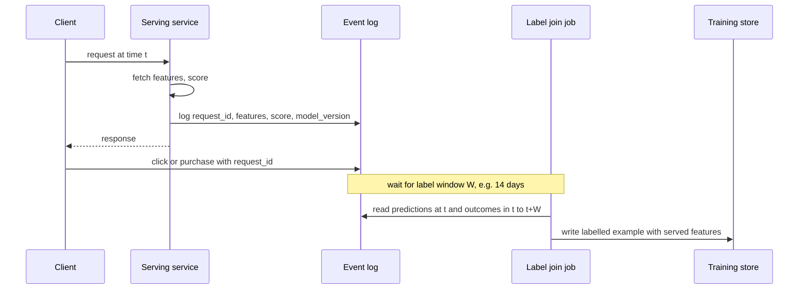
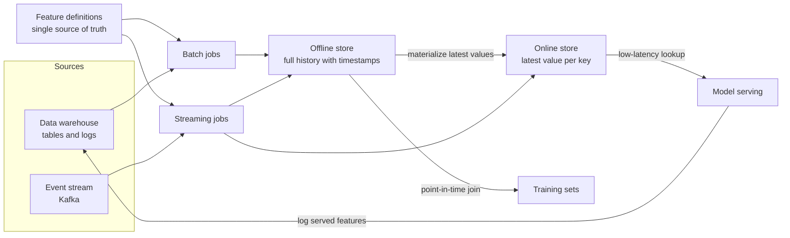
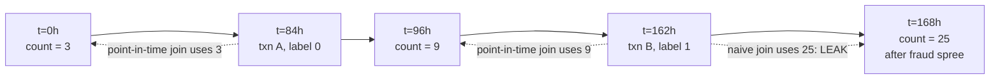
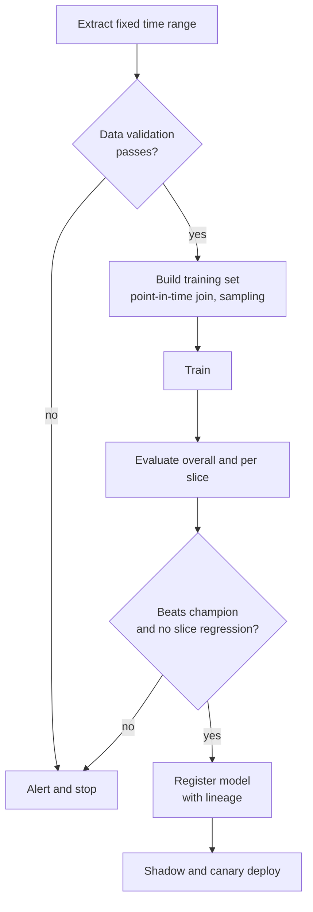
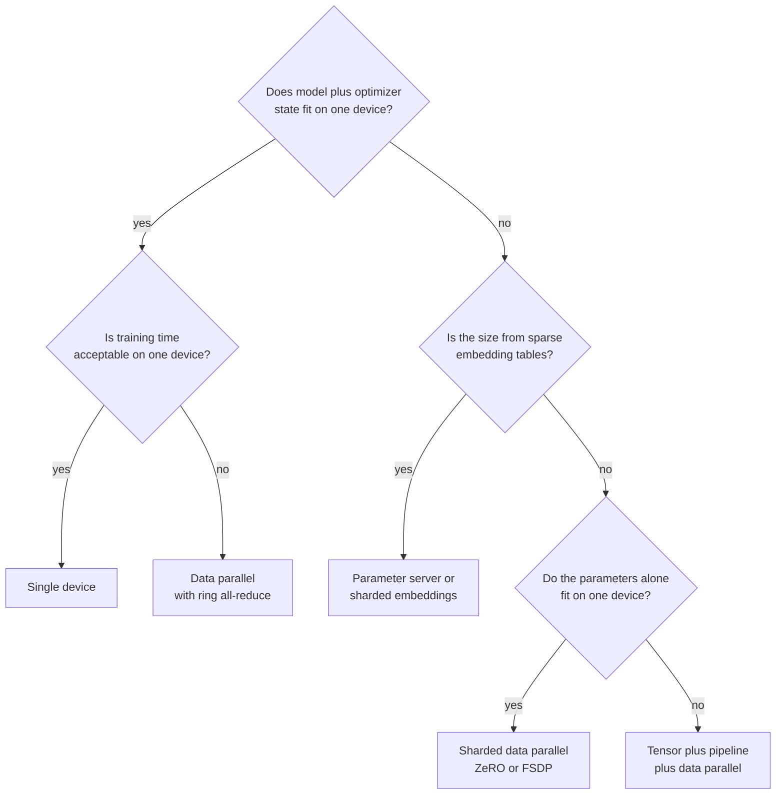
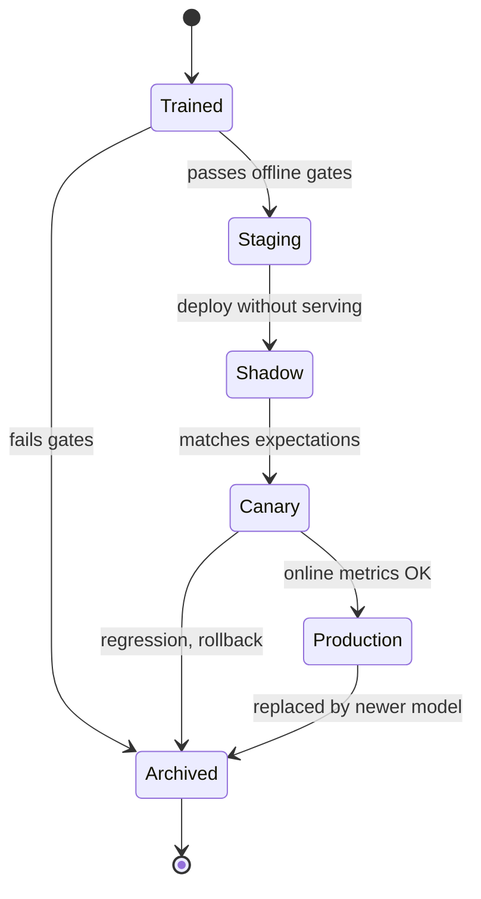

# M11 — Data & Training Infrastructure

> **Big idea:** In production, the model is the easy part. Most ML failures are **data** failures: a label joined to the wrong timestamp, a feature computed one way offline and another way online, a training set nobody can reproduce. Good infrastructure makes the correct thing the default thing: log what you served, join labels as of the moment of prediction, compute every feature from one definition, and version everything.

**Prerequisites:** [M04 Evaluation, data & features](../modules/04-evaluation-and-data.md) · [M07 Neural networks](../modules/07-neural-networks.md) · [M10 ML system design framework](10-ml-system-design-framework.md)
**Lab:** Design studio (no code lab): design a feature store and a point-in-time training-data pipeline for the [fraud detection case study](../case-studies/01-fraud-detection.md)
**Time:** 2 × 90-minute lectures

## Learning objectives

- **Design** an event-logging schema that supports delayed label joins, debugging, and reproducible training sets.
- **Derive** the calibration correction for negative downsampling and **apply** it to a worked example.
- **Explain** point-in-time correctness, **demonstrate** with a worked example how a naive join leaks the future, and **implement** a point-in-time join.
- **Diagnose** train–serve skew and **choose** architectural fixes (shared feature definitions, logged features, skew monitoring).
- **Compare** data parallelism, model parallelism, parameter servers, and all-reduce, and **choose** one for a given model size and sparsity.
- **Choose** a retraining cadence and **describe** the experiment-tracking, dataset-versioning, and model-registry practices that make it safe.

---

## 1. The problem

A payments company trains a fraud model. Offline, it achieves an astonishing PR-AUC of 0.92. It is deployed, and fraud losses do not move. Three weeks of investigation uncover three separate bugs, each of them an infrastructure bug rather than a modelling bug:

1. **Leakage through a join.** The feature `chargebacks_last_30d` for each training transaction was taken from *today's* feature table, not from the value at the time of the transaction. For fraudulent transactions it already counted the chargeback that the transaction itself caused. The model learned to read the answer key.
2. **Train–serve skew.** Offline, `merchant_avg_amount` was computed in SQL over a calendar month; online, a Java service computed it over a rolling 30 days, with a different null default. The two numbers differed by 20% for small merchants.
3. **Unreproducible data.** When the team tried to retrain the "good" model to debug it, the upstream table had been backfilled and the training set could not be recreated, so nobody could tell which bug mattered most.

Every one of these is invisible in a notebook and devastating in production. This module is about the plumbing that prevents them: logging, labels, sampling, feature stores, versioning, pipelines, and the compute infrastructure to train at scale.

---

## 2. First principles

### 2.1 The training example is a snapshot of the world at prediction time

The single most important idea in this module:

> A training example must contain **exactly the information that was available at the moment the prediction would have been made**, paired with the label that was **later** observed.

Everything else (logging design, point-in-time joins, skew prevention) follows from taking that sentence seriously. Formally, for a prediction at time $t$ about entity $e$, the feature vector is $x = f(\mathcal{D}_{<t})$, a function only of data that existed strictly before $t$, and the label $y$ is observed at some later time $t + \Delta$. If any feature uses $\mathcal{D}_{\ge t}$, the model is trained on information it will never have when serving: **leakage**.

### 2.2 Data sources and event logging

Production ML data comes from three kinds of sources:

| Source | Examples | Properties |
|---|---|---|
| **Event logs** (behavioural) | impressions, clicks, purchases, searches, app opens | Huge volume, append-only, timestamped; the source of implicit labels |
| **Entity / dimension tables** (state) | user profiles, item catalogue, merchant info | Mutable; must be **snapshotted** or kept as change logs to get historical values |
| **External / human** | annotations, third-party data, chargeback files from card networks | Delayed, sometimes noisy, often with contractual/privacy restrictions |

A good event-logging design for ML has these fields, and each one exists because of a later failure it prevents:

| Field | Why it is needed |
|---|---|
| `request_id` (unique per prediction) | Join key between the impression and every later action (click, purchase, chargeback) |
| `event_time` and `ingest_time` | Point-in-time joins use event time; late-arriving data is detected via ingest time |
| `entity_ids` (user, item, session, device) | Join to features and labels |
| `model_version`, `experiment_arm` | Attribute outcomes to the model that made the decision; A/B analysis |
| `position`, `surface`, `candidate_source` | Debias position effects; evaluate each retrieval source |
| `served_features` (or a hash + pointer) | **Log-and-reuse**: train on the exact features the model saw, eliminating skew |
| `score`, `decision` | Calibration monitoring; counterfactual / off-policy evaluation |
| `propensity` (if exploring) | Inverse propensity weighting for unbiased learning |

**Log at the decision, not at the click.** If you only log clicks, you have no negatives and no record of what the user *didn't* choose. The unit of logging is "the system showed these items in this order with these scores", and outcomes are attached later.

### 2.3 Delayed labels and log-and-wait

Labels arrive late, by very different amounts:

| Task | Label | Typical delay |
|---|---|---|
| Feed / ads CTR | click | seconds to minutes |
| E-commerce conversion | purchase after click | hours to days |
| PYMK | request accepted | days (we use a 14-day window) |
| Fraud | chargeback | 30–90+ days |
| Credit default | missed payments | months |

The **log-and-wait** pattern: log the prediction event immediately with its features, then wait a **label window** $W$, then join outcomes that occurred in $(t, t+W]$. An example becomes trainable at $t + W$.

This creates a fundamental trade-off between **freshness** and **label completeness**:

- Choose $W$ too short → late positives are recorded as negatives (**fake negatives**), biasing $\hat p$ downward.
- Choose $W$ too long → the newest data, which best reflects current behaviour, is excluded.

Worked number: suppose 80% of conversions happen within 1 day and 98% within 7 days. With $W = 1$ day, 20% of positives are mislabelled as negatives; if the true conversion rate is 5%, the observed rate is $0.8 \times 5\% = 4\%$, and an uncorrected model will under-predict by 20%. Common fixes:

1. **Wait** (fraud: train on transactions older than 90 days, accept staleness; add fast rule updates for new attack patterns).
2. **Use an early proxy label** (fraud: a "customer-reported dispute" signal arrives in days; chargeback in months).
3. **Train immediately and correct**: e.g. treat each example as negative now and re-insert it as positive when the conversion arrives, with an importance-weighted loss that accounts for the duplication (published as "fake negative weighting" by Twitter, Ktena et al., RecSys 2019), or model the delay distribution explicitly (Chapelle, KDD 2014).

### 2.4 Data quality and validation

Data bugs are silent: a pipeline that emits all-null features still trains a model; it is just a worse one. Treat data like code and **test it** at every pipeline boundary.

| Check | Example rule | Catches |
|---|---|---|
| Schema | column `amount` exists, type float | Upstream schema change |
| Completeness | null rate of `country` < 1% | Broken join, logging bug |
| Range / domain | `0 ≤ age ≤ 120`, `currency ∈ ISO list` | Unit errors (cents vs dollars), corrupt values |
| Volume | row count within ±30% of last 7-day average | Lost partitions, duplicate loads |
| Distribution | PSI vs last week < 0.2 (see [M12](12-serving-monitoring-experimentation.md)) | Upstream semantic change, drift |
| Uniqueness | `request_id` unique | Duplicate logging, fan-out joins |
| Label sanity | positive rate within expected band | Label pipeline broken |
| Freshness | latest partition < 2 h old | Stalled job |

Validation is placed **before training** (block bad data from producing a bad model) and **before serving** (compare serving features to training statistics). Google's TensorFlow Data Validation, described in Breck et al. ("Data Validation for Machine Learning", SysML 2019), infers a schema from data and flags anomalies against it in this way.

### 2.5 Sampling, negative downsampling, and calibration correction

Logs are dominated by negatives: with CTR = 2%, 98% of the 30 TB/day from [M10](10-ml-system-design-framework.md) is non-clicks. Training on all of it is expensive and mostly redundant: the 10-millionth easy negative teaches the model little. **Negative downsampling** keeps all positives and a random fraction $w$ of negatives (e.g. $w = 0.1$).

**Why this breaks calibration.** Downsampling changes the class prior, so a model trained on the sampled data predicts probabilities for the *sampled* world. This matters whenever the score is used as a probability (ads auctions multiply $p(\text{click})$ by bid; PYMK multiplies two probabilities; fraud thresholds are set in dollars).

**Derivation.** Let $p = P(y=1 \mid x)$ in the true distribution. After keeping each negative with probability $w$ (positives always kept), by Bayes' rule the probability in the sampled data is

$$p_s = \frac{p}{p + w(1-p)}.$$

Equivalently in odds: $\frac{p_s}{1-p_s} = \frac{1}{w}\cdot\frac{p}{1-p}$. Downsampling multiplies the odds by $1/w$, i.e. adds $-\log w$ to the logit. Inverting gives the **calibration correction**:

$$\boxed{\,q = \frac{p_s}{p_s + \dfrac{1 - p_s}{w}}\,}$$

where $p_s$ is the model's prediction trained on downsampled data and $q$ is the corrected true-scale probability. (This is the formula given in He et al., "Practical Lessons from Predicting Clicks on Ads at Facebook", 2014.) For a logistic model you can equivalently subtract $\log(1/w)$ from the bias term.

**Worked example.** True CTR $= 2\%$, $w = 0.1$. In the sampled data: $p_s = \frac{0.02}{0.02 + 0.1 \times 0.98} = \frac{0.02}{0.118} = 0.1695$. The model learns to predict ~17%. Correction: $q = \frac{0.1695}{0.1695 + 0.8305/0.1} = \frac{0.1695}{8.475} = 0.0200$. ✓ Data volume: we keep $0.02 + 0.098 = 11.8\%$ of rows, an 8.5× reduction.

**Alternative:** keep the sampled data but weight each negative by $1/w$ in the loss. This yields calibrated predictions directly, at the cost of higher gradient variance.

Other sampling patterns worth naming:

| Pattern | When |
|---|---|
| **Stratified sampling** | Guarantee enough examples per slice (country, new users) for training and evaluation |
| **Reservoir sampling** | Uniform sample of fixed size $k$ from an unbounded stream: keep item $i$ with probability $k/i$, replacing a random slot |
| **Importance sampling** | Over-sample rare but important cases, re-weight by $1/\text{sampling prob}$ |
| **Hard-negative mining** | Retrieval models: add negatives that the current model scores highly ([M09](../modules/09-recommendation-and-ranking.md)) |

> Rule: **never downsample the evaluation set** in a way that changes the metric you report, or report the metric on a re-weighted set. Precision and PR-AUC depend on the class prior; AUC does not.

### 2.6 Labeling pipelines and active learning

When labels need humans (content moderation, search relevance, medical images), the labeling pipeline is a product of its own:

1. **Guidelines** with examples and edge cases; versioned (a guideline change changes the label distribution).
2. **Gold set**: items with expert-agreed labels, mixed into rater queues to measure rater accuracy.
3. **Redundancy**: 3–5 raters per item for ambiguous tasks, aggregated by majority vote or a model of rater reliability (Dawid–Skene).
4. **Agreement metrics**: Cohen's kappa for two raters, $\kappa = \frac{p_o - p_e}{1 - p_e}$, where $p_o$ is observed agreement and $p_e$ is agreement expected by chance. Example: raters agree on 85% of 100 items; rater A says "violating" 30% of the time, rater B 40%. $p_e = 0.3\times0.4 + 0.7\times0.6 = 0.54$, so $\kappa = (0.85 - 0.54)/(1 - 0.54) = 0.67$ (substantial, but the guideline probably has ambiguous cases worth finding).
5. **Rater welfare and privacy**: harmful content exposure limits, PII redaction.

**Active learning** spends the labelling budget where the model learns the most. Instead of labelling random items, label those the model is **least sure** about:

- *Uncertainty sampling*: pick $x$ with $\hat p(x)$ closest to 0.5 (binary), or highest entropy $H = -\sum_k \hat p_k \log \hat p_k$.
- *Margin sampling*: smallest gap between the top two class probabilities.
- *Query by committee*: largest disagreement among an ensemble.
- *Diversity*: cluster the uncertain pool and sample across clusters so you do not label 1,000 near-duplicates.

Why it works: points far from the decision boundary barely move it; points near it define it. Typical gains: the same accuracy with a fraction of the labels. **Caveat:** actively-sampled data is not representative, so **evaluation must use a separate random sample**; otherwise precision and recall estimates are biased.

### 2.7 Batch vs streaming features

A feature's **freshness** requirement decides how it is computed:

| | Batch features | Streaming features | Request-time (on-demand) features |
|---|---|---|---|
| Computed by | Spark/SQL jobs over the warehouse | Stream processor (Flink, Spark Streaming, Kafka Streams) over event streams | The serving service, from the request payload |
| Freshness | hours to a day | seconds to minutes | instant |
| Examples | 90-day purchase count, user embedding, merchant chargeback rate | transactions in last 10 minutes, current session clicks, live traffic speed | query text, device, time of day, cart contents |
| Cost / complexity | low | high (state, exactly-once, late events) | low, but adds latency to every request |
| Backfill for training | easy | hard (must replay the stream, or compute the same logic in batch) | must be logged |

The usual rule: **use the stalest feature that doesn't hurt the metric.** Streaming is justified when freshness measurably matters: fraud velocity features ("5 cards tried in 2 minutes"), [ETA](../case-studies/06-eta-prediction.md) live traffic, in-session intent in a [news feed](../case-studies/02-news-feed-recommendation.md).

Architectures: **Lambda** runs a batch path (correct, slow) and a streaming path (fast, approximate) and merges them; **Kappa** uses one streaming engine and replays the log for backfills. Lambda's weakness is two codebases for one feature, a direct source of skew.

### 2.8 The feature store

A feature store exists to solve three problems at once:

1. **Consistency**: one feature definition produces both training values and serving values (prevents train–serve skew).
2. **Correctness**: training values are retrieved **as of** each example's timestamp (prevents leakage).
3. **Reuse**: features are discoverable and shared across teams, instead of re-implemented.

It has two storage halves with very different access patterns:

| | Offline store | Online store |
|---|---|---|
| Purpose | Generate training data; batch scoring | Serve features at low latency |
| Data | Full **history** of feature values with timestamps | **Latest** value per entity key |
| Access | Large scans and point-in-time joins | Point lookups by key, p99 ~ 1–10 ms |
| Typical tech | Data warehouse / data lake (Parquet, Hive, BigQuery, Snowflake) | Key-value store (Redis, Cassandra, DynamoDB, Bigtable) |
| Written by | Batch jobs and stream sinks | **Materialization** from offline, or directly from streams |

### 2.9 Point-in-time correctness: why it prevents leakage (worked example)

Feature: `user_txn_count_7d` for user 42, recomputed whenever it changes. The offline store keeps every version (times in hours from the start of March 1):

| entity | feature_ts (hours) | user_txn_count_7d |
|---|---|---|
| user 42 | 0 (Mar 1, 00:00) | 3 |
| user 42 | 96 (Mar 5, 00:00) | 9 |
| user 42 | 168 (Mar 8, 00:00) | 25 ← after a fraud spree |

Label events (transactions we want to train on):

| txn | user | event_ts | label |
|---|---|---|---|
| A | 42 | 84 (Mar 4, 12:00) | legit (0) |
| B | 42 | 162 (Mar 7, 18:00) | fraud (1) |

**Naive join** ("join the current feature value on user_id"): both A and B get 25. The model sees "legit with 25" and "fraud with 25"; worse, in a large dataset, fraudsters' rows get *post-spree* counts that include the fraud itself. The model learns "count ≥ 20 ⇒ fraud", but at serving time, *before* the spree, the count it sees is 9. Offline PR-AUC looks great; online, the feature is useless. That is leakage.

**Point-in-time join** ("for each label row, take the latest feature value with `feature_ts` strictly before `event_ts`"):

| txn | event_ts | feature used | value |
|---|---|---|---|
| A | 84 | version at ts 0 | **3** |
| B | 162 | version at ts 96 | **9** |

Now each training row matches exactly what the online store would have returned at that moment. Two refinements:

- **Strictly before** (`<`, not `≤`): a feature version stamped at the same instant may already include the event being predicted.
- **TTL (time-to-live)**: if the latest value is too old (e.g. older than 10 days), treat it as missing, because the online store would have expired it too. Otherwise training sees stale values that serving never shows.

Also note **availability time vs event time**: a daily batch feature for "Mar 4" may only land in the online store at Mar 5, 03:00. The point-in-time join must use the time the value **became available to serving**, or it leaks a few hours of the future.

### 2.10 Train–serve skew

Train–serve skew is any difference between what the model sees in training and in serving. Kinds:

| Kind | Example | Fix |
|---|---|---|
| **Logic skew** | Offline SQL vs online Java compute a feature differently | One definition compiled to both paths (feature store); or **log-and-reuse** served features as training data |
| **Timing skew** | Offline uses end-of-day value; online sees mid-day partial value | Point-in-time joins with availability timestamps |
| **Data/default skew** | Missing value → 0 offline, → -1 online | Shared preprocessing library inside the model artifact |
| **Distribution skew** | Training data from last month; traffic today differs | Retraining cadence; drift monitoring ([M12](12-serving-monitoring-experimentation.md)) |
| **Feedback skew** | Model trained on data generated by the previous model | Exploration; counterfactual evaluation |

**The strongest fix** is to log the features that were actually served (Section 2.2) and train on those logs. This eliminates logic and timing skew by construction for any feature that already exists; the cost is that new features cannot be backfilled from logs and must either wait for logs to accumulate or be backfilled offline with a point-in-time join. **Monitoring**: periodically recompute features offline for a sample of served requests and compare with the logged values; alert if mismatch rate exceeds a threshold.

### 2.11 Dataset versioning and lineage

To reproduce a model you need four things pinned: **code version**, **data version**, **config/hyperparameters**, **environment** (library versions, hardware). Data is the hard one because tables mutate.

- **Immutable snapshots / partitions**: training reads `events/date=2026-03-01/`, never "latest".
- **Table formats with time travel** (Delta Lake, Apache Iceberg, Apache Hudi) allow reading a table as of a version or timestamp.
- **Dataset manifests**: a list of files + content hashes saved with the model.
- **Lineage**: a graph from raw sources → transformations → features → training set → model → deployment. Lineage answers "which models are affected by this upstream bug?" and "can we delete this user's data (GDPR) from all derived datasets?"

### 2.12 Training pipelines and orchestration

A production training run is a **DAG** of steps, executed by an orchestrator (Airflow, Kubeflow Pipelines, Argo, Dagster, TFX), each step idempotent and cached:

1. Extract data (fixed time range) → 2. validate data → 3. build training set (point-in-time join, sampling) → 4. train → 5. evaluate on holdout and slices → 6. compare to the production model (**champion vs challenger**) → 7. register model with metadata → 8. deploy to shadow/canary (see [M12](12-serving-monitoring-experimentation.md)).

**Gates** stop bad models automatically: data validation fails, offline metric regressed more than $\epsilon$ against champion, a slice regressed, calibration error too high, model too large/slow for the latency budget.

### 2.13 Distributed training

Why distribute? Either the **data** is too big to train in acceptable time on one device, or the **model** is too big to fit in one device's memory. These are different problems with different solutions.

**Memory arithmetic first.** Training with Adam in mixed precision stores per parameter: fp16 weights (2 B) + fp16 gradients (2 B) + fp32 master weights (4 B) + Adam first and second moments (4 + 4 B) = **16 bytes/parameter**, plus activations. So:

| Model | Parameters | Training state at 16 B/param | Fits on one 80 GB GPU? |
|---|---|---|---|
| ResNet-50 | 25 M | 0.4 GB | Yes, easily → data parallel |
| BERT-large | 340 M | 5.4 GB | Yes → data parallel |
| 7B LLM | 7 B | 112 GB | No → shard optimizer state / parameters (ZeRO, FSDP) |
| 70B LLM | 70 B | 1.1 TB | No → sharding + tensor + pipeline parallel |
| Ads model with 10⁹-row embedding table, dim 64 | 64 B (sparse) | 256 GB in fp32 just for the table | No, but **sparse**: only a few rows touched per batch → parameter server / sharded embeddings |

**Data parallelism.** Every worker holds a full model copy, processes a different shard of the mini-batch, computes gradients, then gradients are **averaged** across workers and every replica applies the same update. Mathematically identical to a large-batch SGD step with batch size $B = N \times b$ ($N$ workers, $b$ per worker). With larger batches, the learning rate is usually scaled up (linear scaling rule) with a warm-up (Goyal et al., 2017).

**All-reduce** is the collective that averages gradients without a central server. In **ring all-reduce**, $N$ workers form a ring; the gradient (size $S$) is split into $N$ chunks; in $N-1$ *reduce-scatter* steps each worker ends up owning the full sum of one chunk, and in $N-1$ *all-gather* steps the summed chunks circulate to everyone. Each worker sends

$$2\,\frac{N-1}{N}\,S \;\approx\; 2S \text{ bytes, independent of } N,$$

which is why it scales: adding workers does not increase per-worker traffic. Worked number: a 1B-parameter model with fp16 gradients ($S$ = 2 GB) on 64 GPUs over a 25 GB/s network: $2 \times \frac{63}{64} \times 2\,\text{GB} \approx 3.9\,\text{GB}$ per step, ≈ 0.16 s. If the compute step takes 0.5 s, communication is significant but can be overlapped with the backward pass (start reducing late layers' gradients while early layers are still computing). Uber's open-source Horovod popularised ring all-reduce for TensorFlow/PyTorch data-parallel training.

**Parameter servers.** Workers pull the parameters they need from server shards and push gradients back; servers apply updates. Strengths: **sparse** models where each example touches only a few embedding rows (ads, recommendations); servers can hold huge tables sharded by key; supports **asynchronous** updates (workers don't wait for each other) at the cost of **stale gradients**, which can slow or destabilise convergence. Weakness: server bandwidth hot-spots for dense models. (Li et al., "Scaling Distributed Machine Learning with the Parameter Server", OSDI 2014.)

**Model parallelism** (when the model doesn't fit):

- **Tensor parallelism**: split each big matrix multiply across devices (e.g. columns of a weight matrix); needs very fast interconnect (within a node).
- **Pipeline parallelism**: put different layers on different devices; split the batch into micro-batches to keep all stages busy and reduce the idle "bubble".
- **Sharded data parallelism** (ZeRO / PyTorch FSDP): data parallel, but each worker stores only a $1/N$ shard of optimizer state, gradients, and/or parameters, gathering them just-in-time. The 7B model's 112 GB of state across 8 GPUs is 14 GB each.

| Situation | Choose |
|---|---|
| Model fits on one device, training too slow | Data parallel with all-reduce |
| Model fits only without optimizer state | Sharded data parallel (ZeRO/FSDP) |
| Dense model far too big, fast interconnect | Tensor parallel within node + pipeline across nodes + data parallel (3D) |
| Huge sparse embedding tables, dense tower small | Parameter server or sharded embeddings + all-reduce for the dense part |
| Small tabular data (GBDT) | Single machine, or distributed GBDT (histogram aggregation) only if > memory |

### 2.14 Hyperparameter tuning

| Method | Idea | When |
|---|---|---|
| Grid search | All combinations | ≤ 2–3 hyperparameters, cheap trials |
| Random search | Sample uniformly (log-uniform for learning rates) | Default: most hyperparameters barely matter, and random search does not waste trials on the unimportant axes (Bergstra & Bengio, 2012) |
| Bayesian optimisation | Fit a surrogate (Gaussian process / TPE) of metric vs hyperparameters, pick next trial by expected improvement | Expensive trials, < ~20 dims |
| Successive halving / Hyperband / ASHA | Start many trials, kill the worst early, give survivors more budget | Deep learning, where partial training is informative |
| Population-based training | Evolve hyperparameters during training | Large RL / deep models with schedules |

Worked number for random search: if the "good" region is the top 5% of the space, the probability that at least one of $n$ random trials lands there is $1 - 0.95^n$. With $n = 60$: $1 - 0.95^{60} \approx 0.95$. Sixty trials give a 95% chance of a top-5% configuration, regardless of dimensionality.

Always tune on a **validation** set separate from the final test set, and with the **same time-based split** as production.

### 2.15 Retraining cadence and continual learning

The world drifts, so models decay. How often to retrain is an empirical question you answer with a **staleness experiment**: train a model on data up to day $d$, evaluate it on days $d+1, d+2, \dots, d+k$, and plot the metric against model age. The slope tells you how much a day of staleness costs.

| Domain | Typical cadence | Why |
|---|---|---|
| Ads CTR, feeds | Hours to daily (sometimes online/incremental updates) | Fast-changing inventory and user intent; high revenue per 0.1% |
| Fraud | Daily–weekly, plus rules updated in minutes | Adversaries adapt; labels delayed by weeks |
| Search relevance | Weekly–monthly | Relevance is more stable |
| ETA | Daily, with real-time features carrying freshness | Traffic patterns seasonal; live features capture the rest |
| Image embeddings | Months | Visual semantics stable; re-indexing is expensive |

Approaches:

- **Retrain from scratch** on a sliding window: simple, reproducible, forgets old patterns.
- **Warm-start / fine-tune** from the previous model on new data: cheaper, fresher; risk of drift accumulating and of catastrophic forgetting.
- **Online (continual) learning**: update on streaming mini-batches within minutes; highest freshness, hardest to validate, needs automatic rollback.

Decision rule: retrain more often while $\text{value of metric gained per retrain} > \text{compute cost} + \text{operational risk}$. Every retrain still passes through the validation gates of Section 2.12.

### 2.16 Experiment tracking and the model registry

**Experiment tracking** (MLflow, Weights & Biases, Vertex AI Experiments, etc.) records for every training run: code commit, data version, hyperparameters, metrics (overall and per slice), artifacts (model file, plots), and environment. Without it, "the model from two weeks ago that was better" is unrecoverable.

**Model registry**: the system of record for trained models. Each version has metadata (lineage back to data and code, offline metrics, owner, model card), and a **stage**: `staging`, `shadow`, `canary`, `production`, `archived`. Deployment systems read from the registry, so rollback is "point production at the previous version".

---

## 3. The algorithm(s)

### 3.1 Point-in-time join

**Input:** label table $L = \{(e_i, t_i, y_i)\}$, feature history $F = \{(e_j, \tau_j, v_j)\}$ (entity, availability timestamp, value), TTL $T$.
**Output:** for each label row, $x_i = v_{j^*}$ where $j^* = \arg\max_j \{\tau_j : e_j = e_i,\ \tau_j < t_i\}$, or missing if none exists or $t_i - \tau_{j^*} > T$.

```text
for each entity e:
    sort F_e by τ
    for each label row i with entity e:
        j* ← binary_search(F_e.τ, t_i, strictly_less)      # last version before t_i
        x_i ← F_e.v[j*] if j* exists and t_i - F_e.τ[j*] ≤ T else MISSING
```

Complexity: $O(|F|\log|F| + |L|\log|F|)$ with sorting + binary search; distributed systems implement it as a sort-merge "as-of join" partitioned by entity. (pandas: `merge_asof`; Spark and warehouses: window functions or native as-of joins.)

### 3.2 Negative downsampling with calibration correction

```text
train:   keep all positives; keep each negative with prob w
         fit model on kept rows → p_s(x)
serve:   q(x) = p_s / (p_s + (1 - p_s)/w)          # or subtract log(1/w) from the logit
```

### 3.3 Ring all-reduce

```text
split each worker's gradient into N chunks
for s in 0..N-2:   (reduce-scatter)
    worker i sends chunk (i - s) mod N to worker i+1, which adds it into its copy
# now worker i holds the complete sum of chunk (i + 1) mod N
for s in 0..N-2:   (all-gather)
    worker i sends chunk (i + 1 - s) mod N to worker i+1, which overwrites its copy
```

Time: $2(N-1)$ steps, each moving $S/N$ bytes per worker → per-worker traffic $2S(N-1)/N$; latency term grows with $N$ (hierarchical/tree variants reduce it for large clusters).

### 3.4 Uncertainty-based active learning

```text
repeat until budget exhausted:
    train model on labelled set L
    score unlabelled pool U; pick batch of k items with highest uncertainty (diversified by clustering)
    send to raters; add to L
evaluate on a separate, randomly sampled, labelled test set
```

---

## 4. Diagrams

### 4.1 Logging and delayed-label join (log-and-wait)



### 4.2 Feature store architecture



### 4.3 Point-in-time correctness on a timeline



### 4.4 Training pipeline DAG with gates



### 4.5 Choosing a distributed training strategy



### 4.6 Model lifecycle in the registry



---

## 5. Code

### 5.1 Point-in-time join from scratch (NumPy)

```python
import numpy as np

def point_in_time_join(label_entity, label_ts, feat_entity, feat_ts, feat_val, ttl=None):
    """For each label row, the latest feature value with feat_ts strictly < label_ts."""
    out = np.full(len(label_ts), np.nan)
    for e in np.unique(label_entity):
        f = np.where(feat_entity == e)[0]
        rows = np.where(label_entity == e)[0]
        if len(f) == 0:
            continue
        order = np.argsort(feat_ts[f])
        ts, vals = feat_ts[f][order], feat_val[f][order]
        idx = np.searchsorted(ts, label_ts[rows], side="left") - 1   # strictly before
        ok = idx >= 0
        if ttl is not None:
            ok &= (label_ts[rows] - ts[np.maximum(idx, 0)]) <= ttl
        out[rows[ok]] = vals[idx[ok]]
    return out

# The worked example from Section 2.9 (hours since Mar 1), plus a second user
feat_entity = np.array([42, 42, 42, 7]); feat_ts = np.array([0, 96, 168, 50])
feat_val    = np.array([3., 9., 25., 1.])
label_entity = np.array([42, 42, 7]);    label_ts = np.array([84, 162, 400])

print(point_in_time_join(label_entity, label_ts, feat_entity, feat_ts, feat_val))
# [3. 9. 1.]          <- not 25, 25
print(point_in_time_join(label_entity, label_ts, feat_entity, feat_ts, feat_val, ttl=240))
# [3. 9. nan]         <- user 7's value is 350h old, expired by the 240h TTL
```

Library equivalents: `pandas.merge_asof(labels, feats, left_on="event_ts", right_on="feature_ts", by="entity", allow_exact_matches=False, tolerance=ttl)`; in Feast, `store.get_historical_features(entity_df=labels, features=[...])` performs the point-in-time join for you.

### 5.2 Negative downsampling and calibration correction

```python
rng = np.random.default_rng(0)
n, p_true, w = 2_000_000, 0.02, 0.1
y = rng.random(n) < p_true
keep = y | (rng.random(n) < w)          # keep all positives, 10% of negatives
p_s = y[keep].mean()                     # what a model learns: ~0.170
q = p_s / (p_s + (1 - p_s) / w)          # corrected: ~0.020
print(f"kept {keep.mean():.1%} of rows, sampled rate {p_s:.3f}, corrected {q:.4f}")
```

### 5.3 Ring all-reduce simulation

```python
def ring_allreduce(grads):
    """grads: list of N same-shape arrays, one per worker. Returns each worker's summed copy."""
    N = len(grads)
    chunks = [np.array_split(g.astype(float).copy(), N) for g in grads]
    for step in range(N - 1):                       # reduce-scatter
        sends = [(i, (i - step) % N, chunks[i][(i - step) % N].copy()) for i in range(N)]
        for i, c, data in sends:
            chunks[(i + 1) % N][c] += data
    for step in range(N - 1):                       # all-gather
        sends = [(i, (i + 1 - step) % N, chunks[i][(i + 1 - step) % N].copy()) for i in range(N)]
        for i, c, data in sends:
            chunks[(i + 1) % N][c] = data
    return [np.concatenate(c) for c in chunks]

grads = [rng.normal(size=10) for _ in range(4)]
assert all(np.allclose(r, sum(grads)) for r in ring_allreduce(grads))
```

Library equivalent: `torch.distributed.all_reduce(tensor, op=ReduceOp.SUM)`; in practice you wrap the model in `torch.nn.parallel.DistributedDataParallel(model)`, which buckets gradients and overlaps all-reduce with the backward pass.

---

## 6. Real-world applications

1. **Uber Michelangelo** (Uber Engineering blog, "Meet Michelangelo: Uber's Machine Learning Platform", 2017). An internal end-to-end platform covering data management, training, evaluation, deployment, prediction, and monitoring. Publicly described elements: a shared **feature store** so teams can reuse features; an offline path built on Uber's data lake (HDFS/Hive) and an online path using Cassandra for low-latency feature lookup; a DSL for selecting and transforming features so the same logic runs in training and serving; both batch and online prediction. *Why it matters for us:* it is the canonical example of standardising Sections 2.8–2.16 so that individual teams don't rebuild (and re-bug) them. Uber also open-sourced **Horovod** for ring all-reduce data-parallel training.
2. **Airbnb Zipline and Chronon.** Airbnb publicly presented Zipline (2018) as its feature-management framework, emphasising **point-in-time-correct backfills** of training data from feature definitions. Its successor, **Chronon**, was open-sourced in 2024: users declare features once, and Chronon generates both point-in-time-correct training data and online serving values from batch and streaming sources. *Constraint addressed:* leakage and skew in features built from event streams.
3. **Feast** (open-source feature store; started at Gojek with Google Cloud, 2019). Concepts map exactly to Section 2.8: *feature views* (definitions), an **offline store** (warehouse/files) used by `get_historical_features` for point-in-time joins, an **online store** (e.g. Redis, DynamoDB) populated by `materialize`, and `get_online_features` for serving.
4. **Facebook ads** (He et al., 2014): negative downsampling with the calibration correction of Section 2.5, and a demonstration that **data freshness** matters: models trained on more recent data perform measurably better, motivating frequent/online training.

How each case study stresses this module:

| Case study | Infrastructure challenge |
|---|---|
| [Fraud detection](../case-studies/01-fraud-detection.md) | 90-day delayed labels, streaming velocity features, point-in-time joins |
| [News feed](../case-studies/02-news-feed-recommendation.md) | Huge logs, negative downsampling, daily/online retraining |
| [Search ranking](../case-studies/03-search-ranking.md) | Human relevance labeling pipeline, click logs with position |
| [Ad click prediction](../case-studies/04-ad-click-prediction.md) | Calibration after downsampling, sparse embeddings on parameter servers |
| [Content moderation](../case-studies/05-content-moderation.md) | Annotation guidelines, agreement, active learning |
| [ETA prediction](../case-studies/06-eta-prediction.md) | Streaming traffic features, ground truth from completed trips |
| [RAG assistant](../case-studies/07-rag-assistant.md) | Document ingestion pipeline, index versioning, eval-set curation |
| [Visual search](../case-studies/08-visual-search.md) | Distributed embedding training, re-indexing on model updates |

---

## 7. System-design hook

What interviewers probe in this area, and what a strong answer sounds like:

| Interviewer probe | Strong answer contains |
|---|---|
| "How do you get training data?" | Log at decision time with `request_id`, served features, model version; join outcomes after a label window; time-based split |
| "Your labels are delayed by 60 days. Now what?" | Log-and-wait vs freshness trade-off; early proxy labels; fake-negative correction; rules for fast response |
| "You have 10 B impressions/day. Train on all of them?" | Negative downsampling, keep positives, calibration correction (formula), evaluate on unsampled or re-weighted data |
| "How do you avoid leakage in features?" | Point-in-time joins using availability timestamps; TTLs; strictly-before semantics |
| "Offline good, online bad?" | Train–serve skew: shared definitions, logged features, skew monitoring |
| "Which features are batch vs real-time?" | Freshness requirement per feature, stalest acceptable; streaming only where it moves the metric |
| "How would you train this 10 B-parameter / 1 B-ID model?" | Memory math (16 B/param), data vs model parallel, PS for sparse embeddings |
| "How often do you retrain?" | Staleness experiment, cost-benefit, gates, champion/challenger, rollback via registry |

A strong 60-second answer to "Walk me through your data pipeline" for the [fraud case](../case-studies/01-fraud-detection.md):

> "Every authorisation request is logged with a request ID, the features we served, the score and model version. Chargebacks arrive from the card networks up to 90 days later, so a daily job joins them by transaction ID once the window closes; for freshness we also use customer-dispute signals that arrive within days as an early label. Features come from a feature store: batch features like 90-day merchant chargeback rate and streaming velocity features like card-attempts-in-10-minutes, defined once and materialised to Redis for serving. Training sets are built with point-in-time joins, we keep all frauds and 5% of legitimate transactions and correct calibration, we validate data before training, and the model registry gates on PR-AUC and recall at a 0.1% decline rate per region before canary."

---

## 8. Pitfalls & debugging

| Pitfall | Symptom | Detection | Fix |
|---|---|---|---|
| Future leakage via joins | Offline metric far above online | Feature importance dominated by one "too good" feature; compare PIT vs naive join | Point-in-time joins with availability timestamps |
| Fake negatives from short label window | Predictions systematically low; recent data looks worse | Positive rate by event age rises as data matures | Longer window, delay modelling, fake-negative weighting |
| Downsampling without correction | Calibration plot off by a constant in log-odds | Mean predicted vs observed rate on live traffic | Apply $q = p_s/(p_s + (1-p_s)/w)$ or reweight |
| Train–serve skew | Online score distribution differs from offline | Log online features, recompute offline, diff | Single feature definition; log-and-reuse; shared preprocessing in model artifact |
| Silent upstream change | Gradual or sudden metric drop | Data validation: schema, null rate, PSI per feature | Validation gates + alerts to data owners; data contracts |
| Duplicate events | Inflated positives, overconfident model | `request_id` uniqueness check | Dedup with idempotent keys |
| Non-reproducible training set | "Can't recreate last month's model" | Retrain from recorded config gives different metrics | Immutable partitions, time-travel tables, dataset manifests |
| Evaluating on actively-sampled data | Reported precision/recall wrong | Compare with random-sample eval | Keep a random labelled eval set |
| Stale online features | Online uses last week's batch value | Feature freshness monitoring (age of value) | Alert on materialisation lag; TTLs |
| Large-batch training diverges | Loss spikes after scaling to more GPUs | Training curves vs single-GPU baseline | LR warm-up, linear scaling rule, gradient clipping |
| Async parameter-server staleness | Slow or noisy convergence | Compare sync vs async curves | Bounded staleness, sync updates for dense parts |
| Feedback-loop data | Model only learns from what it showed | Coverage of catalogue in training data shrinks | Exploration slice with logged propensities |

---

## 9. Exercises

**Conceptual**

1. ★ For each feature, say whether it should be batch, streaming, or request-time, and why: (a) user's lifetime order count; (b) number of failed logins in the last 5 minutes; (c) the search query text; (d) a restaurant's average prep time over 30 days; (e) current number of drivers within 2 km.
2. ★ Explain why AUC is unchanged by negative downsampling but precision and log loss are not.
3. ★★ Give three distinct ways train–serve skew can arise for a single feature "user's average session length", and a fix for each.
4. ★★ Why must active-learning data not be used as the evaluation set? Construct a small example where it overstates precision.

**Math**

5. ★ With $w = 0.05$, the downsampled model predicts $p_s = 0.30$. What is the corrected probability? Verify via the odds form.
6. ★★ Derive $p_s = p/(p + w(1-p))$ from Bayes' rule, and show that for logistic regression the correction is equivalent to adding $\log w$ to the intercept.
7. ★★ A 13B-parameter model is trained with mixed-precision Adam on 80 GB GPUs. Estimate the minimum number of GPUs with (a) plain data parallel, (b) full ZeRO-3/FSDP sharding, ignoring activations.
8. ★★ For ring all-reduce with $N = 16$ workers and $S = 400$ MB gradients over a 10 GB/s link, compute per-worker bytes sent and the communication time. What happens as $N \to \infty$?

**Coding**

9. ★ Extend `point_in_time_join` to support multiple features with different TTLs, and test it against `pandas.merge_asof`.
10. ★★ Simulate delayed labels: generate conversions with exponential delay (mean 2 days), train a logistic model on data with label windows of 1, 3, 7 days, and plot calibration error vs window.
11. ★★ Implement uncertainty sampling on a synthetic 2-D dataset with logistic regression; compare accuracy vs number of labels against random sampling.

**Design**

12. ★★★ Design the feature store for the [ETA prediction case study](../case-studies/06-eta-prediction.md): list 10 features with source, freshness, online/offline store, TTL, and how training data is built point-in-time correctly.
13. ★★★ Your company has five teams each computing "user 30-day spend" differently. Write a one-page proposal for a feature platform: what it standardises, migration plan, and how you'd measure success.

---

## 10. Interview questions

<details><summary>Q1. What is point-in-time correctness and why does it matter?</summary>

Each training example must use feature values as they were available at the moment of the prediction, i.e. the latest value with availability timestamp strictly before the event time (and within a TTL). A naive join that uses the current feature value leaks future information, often including the outcome itself (e.g. a chargeback count that includes this transaction's chargeback). The result is inflated offline metrics and a model that underperforms online. Feature stores implement this as an as-of join over the offline store's history.
</details>

<details><summary>Q2. You downsample negatives to 1%. How do you get calibrated probabilities?</summary>

Downsampling multiplies the odds by $1/w$. Correct with $q = p_s / (p_s + (1-p_s)/w)$ with $w = 0.01$, or equivalently subtract $\log(1/w) = \log 100 \approx 4.6$ from the logit, or train with weight $1/w$ on negatives. Then verify on live traffic: mean prediction vs observed rate, and a reliability diagram per slice.
</details>

<details><summary>Q3. What's in a feature store and what problems does it solve?</summary>

A registry of feature definitions; an offline store of timestamped history used for point-in-time training-set generation and batch scoring; an online key-value store holding the latest values for millisecond serving; materialisation jobs (batch and streaming) that populate both from one definition; plus monitoring (freshness, drift) and discovery. It solves consistency (train–serve skew), correctness (leakage), and reuse across teams. Examples: Uber Michelangelo's feature store, Airbnb Chronon, Feast.
</details>

<details><summary>Q4. How do you handle labels that arrive 90 days late?</summary>

Log predictions with features immediately (log-and-wait) and join chargebacks when the window closes; train on matured data. To regain freshness: use earlier proxy labels (disputes, manual review outcomes), model the delay or use fake-negative weighting on immature data, and rely on fast-updating rules and streaming velocity features for new attack patterns. Monitor online performance with partial labels and correct for the known maturity curve.
</details>

<details><summary>Q5. Data parallel vs model parallel vs parameter server: when do you use each?</summary>

Data parallel (all-reduce) when the model fits on one device and you need throughput; each worker holds a full replica and gradients are averaged with ring all-reduce whose per-worker traffic is about $2S$ regardless of worker count. Sharded data parallel (ZeRO/FSDP) when optimizer state doesn't fit. Tensor/pipeline model parallelism when parameters themselves don't fit (large transformers). Parameter servers (or sharded embeddings) for huge sparse embedding tables where each batch touches few rows: typical in ads and recommendations.
</details>

<details><summary>Q6. How do you decide retraining frequency?</summary>

Run a staleness experiment: evaluate a fixed model on successive future days and measure how fast the metric decays. Compare the value of the metric lost per day of staleness with the cost of retraining and the operational risk. Then automate: scheduled pipeline, validation gates, champion/challenger comparison, canary, rollback via the registry. Fast-moving domains (ads, feeds) retrain daily or online; stable ones (search relevance, image embeddings) weekly to monthly.
</details>

<details><summary>Q7. What is train–serve skew and how do you detect it?</summary>

Any difference between features/preprocessing at training and at serving: different code paths, different timing, different defaults, or different distributions. Detect it by logging served features and comparing them to offline-recomputed values for the same requests (mismatch rate per feature), and by comparing online vs offline score distributions. Prevent it with a single feature definition, preprocessing inside the model artifact, and training on logged served features.
</details>

<details><summary>Q8. What should a model registry entry contain?</summary>

Model artifact and signature (input/output schema), version, lineage (code commit, dataset version/manifest, feature definitions, hyperparameters), offline metrics overall and per slice, calibration, latency/size benchmarks, owner, model card (intended use, limitations, fairness evaluation), approval status and deployment stage, and the previous production version for rollback.
</details>

---

## Further reading

- J. Hermann and M. Del Balso, "Meet Michelangelo: Uber's Machine Learning Platform," Uber Engineering Blog, 2017.
- E. Breck, N. Polyzotis, S. Roy, S. Whang, M. Zinkevich, "Data Validation for Machine Learning," SysML 2019.
- X. He et al., "Practical Lessons from Predicting Clicks on Ads at Facebook," ADKDD 2014.
- M. Li et al., "Scaling Distributed Machine Learning with the Parameter Server," OSDI 2014; A. Sergeev and M. Del Balso, "Horovod: fast and easy distributed deep learning in TensorFlow," 2018.
- S. Rajbhandari et al., "ZeRO: Memory Optimizations Toward Training Trillion Parameter Models," SC 2020.
- Feast documentation (docs.feast.dev) and the Airbnb Chronon project (github.com/airbnb/chronon).
- Chip Huyen, *Designing Machine Learning Systems*, O'Reilly 2022, Chapters 3–6.
