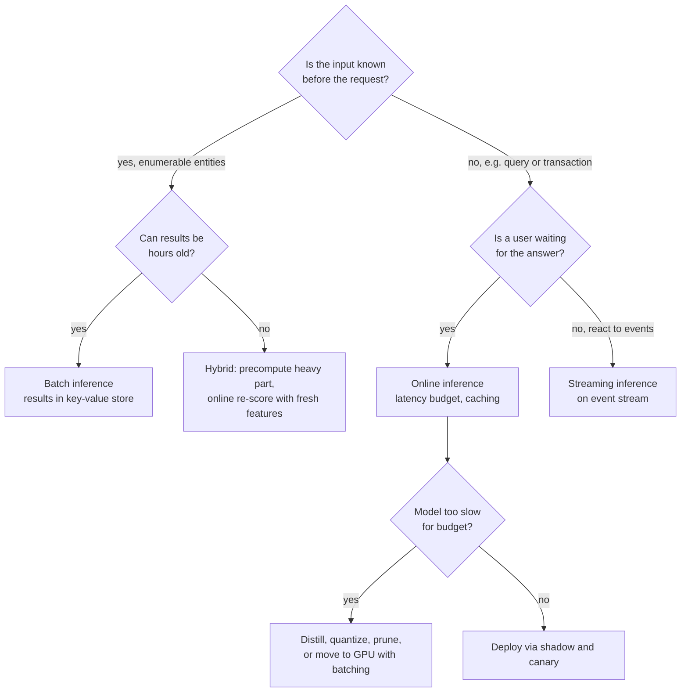
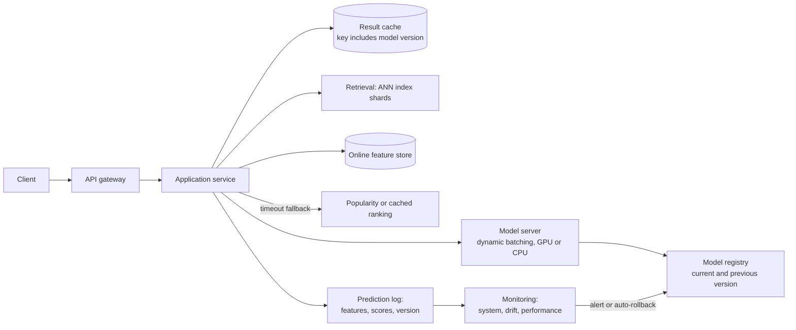
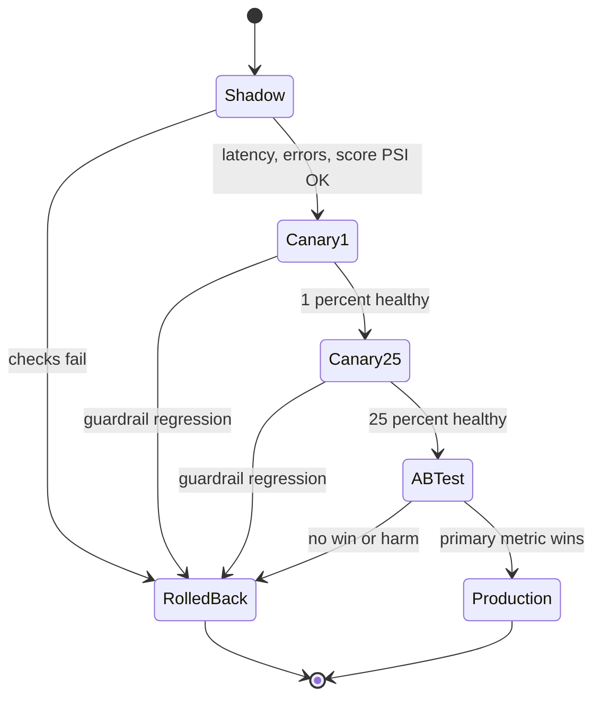
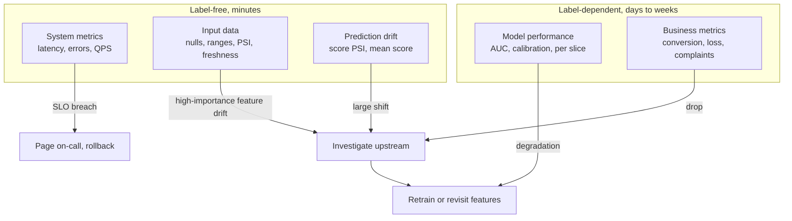
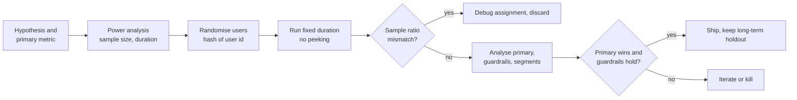
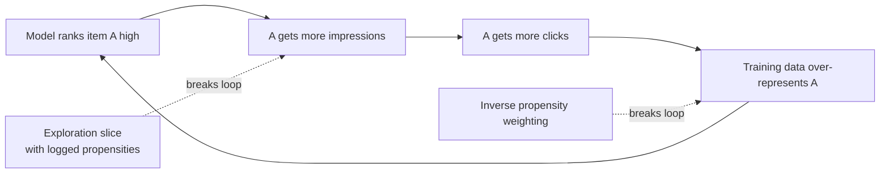
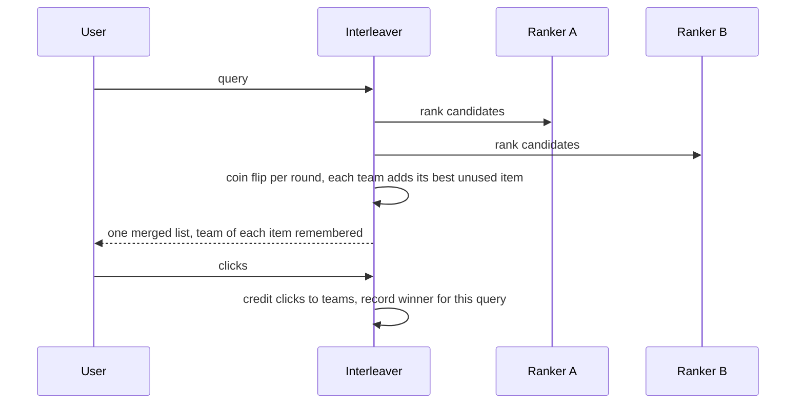

# M12 — Serving, Monitoring & Experimentation

> **Big idea:** A model creates value only while it is serving predictions **fast**, **correctly**, and **measurably better than the alternative**. Serving is a latency and cost engineering problem; monitoring is about noticing that the world changed before your users do; experimentation is applied statistics that decides whether a change actually helped. All three are about trust.

**Prerequisites:** [M04 Evaluation, data & features](../modules/04-evaluation-and-data.md) · [M09 Recommendation & ranking](../modules/09-recommendation-and-ranking.md) · [M10 Framework](10-ml-system-design-framework.md) · [M11 Data & training infrastructure](11-data-and-training-infrastructure.md)
**Lab:** Design studio (no code lab): A/B test analysis. Given experiment logs, check sample-ratio mismatch, compute lift with a confidence interval, and decide whether to ship.
**Time:** 2 × 90-minute lectures

## Learning objectives

- **Choose** between batch, online, and streaming inference, and **design** a latency budget that accounts for tail latency under fan-out.
- **Compare** serving patterns (model server, embedded, sidecar), caching, precomputation, and model compression (quantization, distillation, pruning), and **estimate** their effect on cost and latency.
- **Plan** a safe rollout (shadow, canary, blue-green) with automatic rollback.
- **Compute** drift metrics (PSI, KL) by hand and **diagnose** data drift vs concept drift vs prediction drift, including with delayed labels.
- **Derive** the A/B test sample-size formula and **apply** it; **identify** novelty effects, network effects, peeking, and multiple-testing errors; **explain** interleaving and bandits.
- **Recognise** degenerate feedback loops and **describe** fairness, privacy, and explainability checks that belong in a production ML system.

---

## 1. The problem

A team has a new ranking model for an e-commerce search page. It is 2% better in offline NDCG. The launch goes like this:

- **Day 1.** It is a 400 MB transformer. On CPU it takes 180 ms per request; the page's budget for ranking is 40 ms. Someone proposes "just use GPUs". The cost estimate comes back at 6× the current serving bill.
- **Day 10.** After distillation and int8 quantization, it fits the budget. It is deployed straight to 100% of traffic on Friday evening. Saturday, conversion is down 4%. Nobody knows whether that is the model, the weekend, or a holiday sale ending. There is no control group.
- **Day 11.** Rolled back. The team runs an A/B test properly; after three days, treatment is up 1.5% with $p = 0.04$. Ship? A colleague points out they checked the dashboard every hour and would have stopped at the first significant result. Also, the first-week lift may be novelty.
- **Month 3.** Conversion slowly declines. An upstream team changed the "price" field from dollars to cents for one country. No alert fired, because the only monitoring was CPU and latency.

Each of these failures has a well-understood engineering answer. This module covers them in the order a prediction lives: **serve it**, **ship it safely**, **watch it**, **prove it helps**, **keep it fair and private**.

---

## 2. First principles

### 2.1 Three ways to produce predictions

The fundamental question is: **when do you know the input?**

| Mode | How | Latency to user | Freshness | Cost | Use when |
|---|---|---|---|---|---|
| **Batch (offline) inference** | Score all entities on a schedule, store results in a key-value store | ~ms (a lookup) | As stale as the last batch run | Cheapest per prediction; wasted on entities never requested | Input space is enumerable and changes slowly: daily recommendations, PYMK candidates, churn scores, email campaigns |
| **Online (real-time) inference** | Score on request | Model latency + feature fetch | Fresh at request time | Pay per request; must provision for peak | Input only known at request time: search queries, fraud on a transaction, ad auctions |
| **Streaming inference** | Score events as they flow through a stream processor | Seconds | Near real-time | Moderate | Reacting to events without a user waiting: flagging uploads for moderation, updating a user's embedding after each action |

Hybrids are common and often the best answer: **precompute the expensive part, compute the cheap part online.** Item embeddings are batch; the user embedding is computed online from recent actions; the ranking dot product is online. PYMK in [M10](10-ml-system-design-framework.md) precomputes candidates daily and re-scores online.

### 2.2 Latency budgets and tail latency

Users experience the **tail**, not the average. A page that makes 50 backend calls is slow if *any* of them is slow. If each of $n$ independent parallel calls is fast with probability $p$, the probability the request is slow is

$$P(\text{slow}) = 1 - p^n.$$

Worked number: a ranking service fans out to $n = 100$ feature/model shards, each with a p99 of 10 ms (so $p = 0.99$ of calls under 10 ms). Then $1 - 0.99^{100} \approx 0.63$: **63% of requests** wait for at least one shard's tail. Your service's median is set by the shards' p99. (Dean & Barroso, "The Tail at Scale", 2013.)

Tools to control tail latency:

| Technique | Idea | Cost |
|---|---|---|
| **Timeouts with fallback** | After $T$ ms, return a default (cached score, popularity rank) | Slightly worse quality on slow requests |
| **Hedged requests** | Send a second copy of a request if the first hasn't returned by the p95; use whichever finishes first | ~5% extra load |
| **Reduce fan-out** | Fewer, larger shards; co-locate features with the model | Less parallelism |
| **Admission control / load shedding** | Reject or degrade low-priority traffic under overload | Some requests get degraded results |
| **Capacity headroom** | Run at ~50–70% utilisation; queueing delay explodes near 100% | Hardware cost |

Why headroom matters: in a simple M/M/1 queue, mean time in system is $\frac{1}{\mu - \lambda}$ (service rate $\mu$, arrival rate $\lambda$). At 50% utilisation that's $2/\mu$; at 90% it's $10/\mu$; at 99% it's $100/\mu$. Latency is not linear in load.

**Concurrency** from Little's law: in-flight requests $L = \lambda W$. At 20,000 QPS with 50 ms latency, $L = 1{,}000$ concurrent requests, which sizes worker pools and connection limits.

### 2.3 Model serving patterns

| Pattern | What it is | Pros | Cons | Typical use |
|---|---|---|---|---|
| **Model server (service)** | Dedicated service (e.g. TensorFlow Serving, NVIDIA Triton, TorchServe, KServe) exposing a predict API over gRPC/HTTP | Independent scaling and deploys; GPU pooling; dynamic batching; multi-model hosting | Extra network hop (~1 ms); another service to operate | Most deep models; GPU models; shared models |
| **Embedded (in-process)** | Model loaded as a library inside the application (e.g. ONNX Runtime, a GBDT library, a TFLite model on a phone) | Lowest latency, no network hop; works offline on device | Model deploy = app deploy; competes for app CPU/memory; language coupling | Small models with tight latency (fraud rules + GBDT in a payment path), on-device models |
| **Sidecar** | Model runs in a separate process/container on the same host as the app, called over localhost | Isolation of dependencies and resources; independent deploys; ~sub-ms hop | Per-host resource duplication; more moving parts | Polyglot stacks; when the app is in Java/Go but the model needs Python |

**Dynamic batching**: GPUs are efficient only with batches. A model server waits up to a few milliseconds to collect concurrent requests into one batch. This trades a little latency for large throughput gains; set the maximum wait inside your latency budget.

### 2.4 Caching and precomputation

Caching works when the same input recurs. Search queries follow a heavy-tailed distribution: a small fraction of distinct queries accounts for a large fraction of traffic, so caching results for the head pays off. Rules:

- **Cache key** must include everything that affects the output: query, user segment or locale, **model version** (or flush on deploy, or you serve stale model results after a rollout).
- **TTL** bounded by freshness requirements (prices, inventory).
- Cache **intermediate** results: item embeddings, candidate lists, user embeddings for the session.
- Personalised outputs rarely hit a cache, so precompute per-user results in batch only for active users (scoring 1B dormant users is waste).

### 2.5 Model compression

Three families, which compose well (distil, then prune, then quantize):

**Quantization** maps float values to low-bit integers. Affine (asymmetric) int8 quantization of a tensor with range $[x_{\min}, x_{\max}]$:

$$s = \frac{x_{\max} - x_{\min}}{255}, \qquad z = \operatorname{round}\!\left(\frac{-x_{\min}}{s}\right), \qquad q = \operatorname{clip}\!\left(\operatorname{round}\!\left(\frac{x}{s}\right) + z,\ 0,\ 255\right), \qquad \hat x = s\,(q - z).$$

Here $s$ is the scale, $z$ the zero point, $q$ the stored 8-bit integer, $\hat x$ the reconstructed value. Worked number: weights in $[-0.5, 1.0]$: $s = 1.5/255 = 0.00588$, $z = \operatorname{round}(85.0) = 85$. For $x = 0.31$: $q = \operatorname{round}(52.7) + 85 = 138$, $\hat x = 0.00588 \times 53 = 0.3118$, error $0.0018 \le s/2$. Effect: 4× smaller than fp32, 2–4× faster on hardware with int8 kernels, usually < 1% accuracy loss with **post-training quantization** (calibrate ranges on sample data), smaller still with **quantization-aware training**.

**Knowledge distillation** trains a small **student** to mimic a large **teacher**'s soft outputs, which carry more information than hard labels ("this 7 looks a bit like a 1"):

$$\mathcal{L} = \alpha\, \mathrm{CE}\big(y,\ \sigma(z_s)\big) + (1-\alpha)\, T^2\, \mathrm{KL}\big(\sigma(z_t/T)\ \|\ \sigma(z_s/T)\big)$$

where $z_s, z_t$ are student/teacher logits, $\sigma$ is softmax, $T$ is a temperature that softens distributions, and the $T^2$ factor keeps gradient magnitudes comparable (Hinton et al., 2015). In ranking, a cross-encoder teacher can be distilled into a cheaper model; in the [search case study](../case-studies/03-search-ranking.md) this is how a heavy relevance model fits the latency budget.

**Pruning** removes weights. *Unstructured* (zero out small-magnitude weights) gives high sparsity but needs sparse kernels to be faster; *structured* (remove whole neurons, attention heads, channels, or layers) gives real speedups on standard hardware. Fine-tune after pruning to recover accuracy.

| Technique | Size reduction | Speedup | Accuracy cost | Effort |
|---|---|---|---|---|
| fp16 / bf16 | 2× | 1.5–3× on GPU | ~none | Trivial |
| int8 PTQ | 4× | 2–4× | Small | Low |
| Distillation | 5–50× (smaller architecture) | Proportional | Small to moderate | Training run |
| Structured pruning | 1.5–3× | 1.5–3× | Small with fine-tune | Moderate |

### 2.6 Serving approximate nearest neighbour (ANN) retrieval

Retrieval stages ([M09](../modules/09-recommendation-and-ranking.md), [M08](../modules/08-embeddings-and-transformers.md)) need the top-$k$ items by inner product among $10^8$–$10^9$ embeddings within ~10–30 ms. Exact search is $O(Nd)$ per query: $10^9 \times 256$ multiply-adds ≈ 0.26 TFLOP per query, impossible at 10,000 QPS. ANN indexes trade a little recall for orders of magnitude speed:

| Index | Idea | Memory | Notes |
|---|---|---|---|
| **IVF** (inverted file) | k-means into $C$ cells; search only the nearest `nprobe` cells | Vectors + centroids | `nprobe` trades recall for latency |
| **PQ** (product quantization) | Split vector into $m$ sub-vectors, each encoded as a 1-byte codebook index | $m$ bytes/vector | Often combined: IVF-PQ; re-rank top hits with exact vectors |
| **HNSW** (graph) | Navigable small-world graph; greedy search from coarse to fine layers | Vectors + ~$2M$ links/node | High recall at low latency; memory-heavy; slower to build |

Serving concerns: **sharding** (each shard returns its local top-$k$, a broker merges), **replication** for QPS, **index freshness** (new items need to be inserted; HNSW supports incremental inserts, IVF needs periodic rebuilds), and **model–index consistency**: when the embedding model changes, *every* item vector must be recomputed and the index rebuilt, and the query tower must switch at the same time (version the index with the model). Measure **recall@k against exact search** on a sample of queries as a monitoring metric. See the [visual search case study](../case-studies/08-visual-search.md) and [RAG assistant](../case-studies/07-rag-assistant.md).

### 2.7 GPU vs CPU

| Factor | CPU | GPU |
|---|---|---|
| Best for | GBDTs, small MLPs, logistic regression, feature computation, low/irregular QPS | Large dense models (transformers, CNNs), high-throughput batched inference |
| Latency at batch size 1 | Often fine for small models | Underutilised; kernel launch and transfer overheads |
| Throughput | Moderate | Very high with batching |
| Cost model | Cheap per box, scales horizontally | Expensive per box; only cheaper per prediction when kept busy |
| Ops | Simple | Drivers, memory limits, bin-packing models onto devices |

Rule of thumb: GPUs pay off when the model is large enough and traffic high enough to keep batches full. A 500-tree GBDT on 200 features is almost always CPU; a BERT-base cross-encoder over 100 documents per query at 5,000 QPS is GPU.

### 2.8 Deployment strategies

New models fail in ways offline evaluation cannot see: different hardware, missing features, latency spikes, interaction with business rules. Expose them gradually:

| Strategy | How | Catches | Risk to users |
|---|---|---|---|
| **Shadow (dark launch)** | New model receives a copy of live traffic; predictions are logged, not served | Crashes, latency, feature errors, score distribution vs current model | None |
| **Canary** | Serve the new model to 1% → 5% → 25% → 100%, with automatic checks at each step | Online errors, early metric regressions | Small, bounded |
| **Blue-green** | Two full environments; switch the router from blue (old) to green (new) at once | Infrastructure-level changes; enables instant switch-back | All users at switch, but rollback is instant |
| **A/B test** | Randomised split with statistical analysis (Section 2.11) | Whether the model *improves the business metric* | Controlled |
| **Rollback** | Point the router/registry back to the previous version | — | Must be one command, tested, and fast |

Shadow and canary answer "is it safe?"; A/B answers "is it better?". You need both. Keep the previous model **warm** (loaded) during canary so rollback takes seconds.

### 2.9 Monitoring: what to watch

Monitoring has layers, from fastest-to-detect to most meaningful:

| Layer | Metrics | Label needed? | Detects |
|---|---|---|---|
| **System** | QPS, p50/p99 latency, error rate, timeouts, CPU/GPU utilisation, memory | No | Outages, overload, bad deploys |
| **Data (input)** | Per-feature null rate, range violations, PSI vs training distribution, feature freshness | No | Upstream bugs, schema changes, drift |
| **Prediction (output)** | Score distribution, mean prediction, fraction above threshold, PSI of scores | No | Model or input problems, drift |
| **Performance** | AUC, precision/recall, calibration, NDCG, computed when labels arrive | Yes (delayed) | Concept drift, true degradation |
| **Business** | CTR, conversion, revenue, fraud loss, complaints | Partly | What actually matters |

#### Kinds of drift

Write the joint distribution as $P(x, y) = P(x)\,P(y \mid x)$:

- **Data drift / covariate shift**: $P(x)$ changes, $P(y\mid x)$ stays. A new country launches; users skew younger. The model may still be right where it has data, but is extrapolating elsewhere.
- **Concept drift**: $P(y \mid x)$ changes. Fraudsters change tactics; during a pandemic, "buys 40 rolls of toilet paper" stops indicating a reseller. The same input now means something different, and **only labels reveal it**.
- **Label (prior) shift**: $P(y)$ changes, e.g. spam rate doubles during an attack.
- **Prediction drift**: the distribution of $\hat y$ changes. A cheap, label-free alarm that something upstream changed.

#### PSI and KL divergence

To compare a feature's distribution in a reference window (training data or last month) with the current window, bin the feature (deciles of the reference are common), let $e_i$ be the reference fraction and $a_i$ the current fraction in bin $i$.

KL divergence: $\mathrm{KL}(a \,\|\, e) = \sum_i a_i \ln \frac{a_i}{e_i}$, asymmetric, $\ge 0$, zero iff identical.

**Population Stability Index** (symmetric; equals $\mathrm{KL}(a\|e) + \mathrm{KL}(e\|a)$):

$$\mathrm{PSI} = \sum_i (a_i - e_i)\,\ln\frac{a_i}{e_i}.$$

Common industry rule of thumb (originating in credit scoring): PSI < 0.1 stable; 0.1–0.2 moderate shift, investigate; > 0.2 significant shift.

**Worked example.** A feature binned into quartiles of the training data, so $e = (0.25, 0.25, 0.25, 0.25)$. This week: $a = (0.10, 0.20, 0.30, 0.40)$.

| Bin | $e_i$ | $a_i$ | $a_i - e_i$ | $\ln(a_i/e_i)$ | Term |
|---|---|---|---|---|---|
| 1 | 0.25 | 0.10 | −0.15 | −0.916 | 0.1374 |
| 2 | 0.25 | 0.20 | −0.05 | −0.223 | 0.0112 |
| 3 | 0.25 | 0.30 | +0.05 | +0.182 | 0.0091 |
| 4 | 0.25 | 0.40 | +0.15 | +0.470 | 0.0705 |
| | | | | **PSI** | **0.228** |

PSI = 0.228 > 0.2 → significant shift; alert. Check: $\mathrm{KL}(a\|e) = 0.106$ and $\mathrm{KL}(e\|a) = 0.122$, which sum to 0.228. ✓ Practical details: add a small $\epsilon$ to empty bins (otherwise $\ln 0$); with very large samples, statistically significant drift is everywhere, so alert on **magnitude** (PSI) and on **features that matter** (weight by feature importance), not on p-values.

#### Performance with delayed labels

When labels take weeks ([M11](11-data-and-training-infrastructure.md)), you cannot compute AUC today. Strategies:

1. **Proxy metrics now**: prediction drift, input drift, early labels (disputes before chargebacks), human review of a daily random sample.
2. **Matured metrics later**: compute performance on cohorts once their label window closes, and compare cohort to cohort ("transactions from 90 days ago").
3. **Partial-label metrics with maturity correction**: if historically 60% of chargebacks arrive within 30 days, compare current 30-day-matured recall to past 30-day-matured recall, not to final recall.

#### Alerting

- Alert on **symptoms users feel** (latency SLO, error rate, business metric drops) with paging; alert on **causes** (single-feature drift) with tickets.
- Use **baselines with seasonality** (same hour last week) rather than fixed thresholds for traffic-dependent metrics.
- Every alert has an **owner** and a **runbook** (what to check, how to roll back).
- Avoid alert fatigue: an alert that fires daily and is ignored is worse than none.

### 2.10 Feedback loops and degenerate loops

An ML system's outputs change its future training data. A recommender shows item A; users can only click what they see; A gets clicks; the next model ranks A higher; A gets shown more. This is a **feedback loop**, and when it narrows the system's behaviour it is **degenerate**: popularity bias, filter bubbles, and "rich get richer" for creators. In fraud, declining a transaction means you never learn its true label, so the model can never correct a false positive pattern. In predictive policing, more patrols → more recorded incidents → more patrols.

Breaking loops:

| Technique | How |
|---|---|
| **Exploration** | Serve a small fraction of randomised or boosted items; log **propensities** |
| **Inverse propensity weighting** | Weight training examples by $1/P(\text{shown})$ to correct exposure bias |
| **Holdout / random traffic** | A small slice that bypasses the model (e.g. approve a tiny random sample of borderline transactions, with limits) to get unbiased labels |
| **Position features** | Train with position as an input, set to a constant at serving |
| **Diversity and exposure caps** | Re-ranking constraints on how often an item or creator appears |
| **Monitor coverage** | Fraction of catalogue receiving impressions; Gini of exposure |

### 2.11 A/B testing from first principles

**Why randomise?** Comparing before vs after confounds the model with everything else that changed (weekday, a marketing campaign, a competitor's outage). Randomly assigning users to control (A) or treatment (B) at the same time makes the two groups identical in expectation in every respect except the treatment, so a difference in outcomes is **caused** by the treatment, up to chance. Statistics quantifies "up to chance".

**Setup.**

- **Unit of randomisation**: usually the user (stable experience, independent units). Session- or request-level gives more samples but users see inconsistent behaviour and units are correlated.
- **Primary metric** (decision metric), **guardrail metrics** (must not degrade: latency, errors, revenue, complaints, unsubscribes), and **diagnostic** metrics.
- **Hypotheses**: $H_0: \mu_B - \mu_A = 0$ vs $H_1: \mu_B - \mu_A \ne 0$.
- **Significance** $\alpha$ (false-positive rate, typically 0.05) and **power** $1-\beta$ (probability of detecting a true effect of size $\delta$, typically 0.8).

**The test.** For a conversion rate with $n$ users per arm, observed rates $\hat p_A, \hat p_B$:

$$z = \frac{\hat p_B - \hat p_A}{\sqrt{\frac{\hat p_A(1-\hat p_A)}{n_A} + \frac{\hat p_B(1-\hat p_B)}{n_B}}}$$

and reject $H_0$ if $|z| > z_{1-\alpha/2} = 1.96$.

*Worked example.* $n_A = n_B = 1{,}000{,}000$, $\hat p_A = 5.00\%$, $\hat p_B = 5.12\%$. Standard error $= \sqrt{(0.05 \cdot 0.95 + 0.0512 \cdot 0.9488)/10^6} = 3.10\times10^{-4}$. Difference $= 0.0012$, so $z = 3.87$, two-sided $p \approx 0.0001$. 95% CI for the lift: $0.0012 \pm 1.96 \times 0.00031 = [0.06, 0.18]$ percentage points, i.e. a relative lift of +2.4% (CI roughly +1.2% to +3.6%). Ship, if guardrails are fine.

**Sample size (power) formula.** To detect an absolute difference $\delta$ with significance $\alpha$ and power $1 - \beta$, with per-user metric variance $\sigma^2$, each arm needs

$$n = \frac{2\,(z_{1-\alpha/2} + z_{1-\beta})^2\,\sigma^2}{\delta^2}.$$

*Where it comes from:* the difference of means has standard error $\sigma\sqrt{2/n}$. We need the threshold for significance ($z_{1-\alpha/2}$ standard errors from 0) to sit $z_{1-\beta}$ standard errors **below** the true effect $\delta$, so that the observed difference exceeds the threshold with probability $1-\beta$: $\delta = (z_{1-\alpha/2} + z_{1-\beta})\,\sigma\sqrt{2/n}$. Solve for $n$.

With $\alpha = 0.05$, power 0.8: $(1.96 + 0.84)^2 \approx 7.85$, so $n \approx 15.7\,\sigma^2/\delta^2$ (often quoted as "$16\sigma^2/\delta^2$").

*Worked example.* Baseline conversion $p = 5\%$, so $\sigma^2 = p(1-p) = 0.0475$. We want to detect a **2% relative** lift: $\delta = 0.05 \times 0.02 = 0.001$.

$$n = \frac{2 \times 7.85 \times 0.0475}{0.001^2} \approx 746{,}000 \text{ users per arm} \;\;(\approx 1.5\text{M total}).$$

With 1M eligible users/day split 50/50, that is ~1.5 days of traffic, but run **at least one or two full weeks** to cover weekly seasonality and let novelty wear off. Notice the $1/\delta^2$: halving the detectable effect quadruples the sample. Variance reduction (e.g. **CUPED**, which regresses out each user's pre-experiment metric; Deng et al., 2013) reduces $\sigma^2$ and therefore $n$ proportionally.

**Threats to validity.**

| Threat | What happens | Mitigation |
|---|---|---|
| **Peeking** (optional stopping) | Checking daily and stopping at the first $p < 0.05$ inflates false positives well above 5% | Fix duration in advance from the power calculation, or use sequential tests (alpha spending, always-valid p-values) |
| **Multiple testing** | 20 independent metrics at $\alpha = 0.05$: $P(\ge 1 \text{ false positive}) = 1 - 0.95^{20} = 64\%$ | One pre-registered primary metric; Bonferroni ($\alpha/m$) or Benjamini–Hochberg (controls false discovery rate) for the rest |
| **Sample ratio mismatch (SRM)** | Expected 50/50 but got 502,000 vs 498,000: $\chi^2 = 16$, $p \approx 6\times10^{-5}$. Something (bot filtering, crashes, redirects) is removing users non-randomly | Always run an SRM check first; if it fails, the results are untrustworthy |
| **Novelty / primacy effects** | Users click the new thing because it's new (novelty) or resist change (primacy); the effect fades or grows | Run longer; plot the effect by day; analyse new users separately |
| **Network effects / interference** | Treatment users affect control users (messages, marketplaces, PYMK requests, shared ad budgets), violating independence | Cluster randomisation (graph clusters, geographic regions), switchback tests (alternate time slots, used in marketplaces), budget-split designs for ads |
| **Long-term vs short-term** | Short-term clicks up, long-term retention down (Goodhart) | Long-term holdouts; surrogate metrics validated against long-term outcomes |
| **Simpson's paradox / mix shifts** | Ramp-up changes traffic mix between days | Analyse only the period with a fixed allocation |

**Interleaving for ranking.** For comparing two rankers, an A/B test is wasteful: each user only sees one ranker, and between-user variance is huge. **Interleaving** shows each user a single list that **merges** results from rankers A and B, then credits clicks to whichever ranker contributed the clicked item. Each user is effectively a paired comparison, removing between-user variance. **Team-draft interleaving**: like picking teams in a playground, in each round a coin flip decides which ranker picks first; each ranker adds its highest-ranked item not yet in the list. Netflix publicly described using interleaving as a fast first-stage screen that needs far fewer users than an A/B test, followed by a conventional A/B test on the winners for business metrics. Limitation: interleaving measures **preference** for the ranking, not business metrics like retention or revenue, and it does not work for whole-page or non-list changes.

### 2.12 Bandits vs A/B tests

An A/B test **explores** (equal traffic to all arms) for a fixed duration and then **exploits** (ships the winner). During the test, half the users get the worse arm: that cost is called **regret**. **Multi-armed bandits** shift traffic toward better-performing arms *during* the experiment.

- **ε-greedy**: with probability $\varepsilon$ pick a random arm, otherwise the current best.
- **Thompson sampling**: maintain a posterior over each arm's reward (for click rates, $\text{Beta}(1 + \text{clicks}, 1 + \text{non-clicks})$); each round, sample from every posterior and play the arm with the highest sample. Arms that are probably best get played most; uncertain arms still get explored.
- **Contextual bandits**: choose the arm based on context features (user, time), e.g. for news article selection or which notification to send.

| | A/B test | Bandit |
|---|---|---|
| Goal | **Learn** the effect with valid inference | **Earn**: maximise reward while learning |
| Statistical inference | Clean (fixed, equal allocation) | Harder (adaptive allocation biases naive estimates) |
| Best for | Launch decisions, long-term metrics, many guardrails | Many short-lived options: headlines, creatives, promotions, cold-start exploration |
| Regret | Higher | Lower |
| Delayed rewards | Fine | Hard (the bandit acts before rewards arrive) |

### 2.13 Responsible ML (briefly)

Responsible ML is a production requirement, not an afterthought: regulators, users, and interviewers will ask.

**Fairness metrics.** For a binary decision $\hat Y$, true label $Y$, and protected attribute $A$:

| Metric | Requirement | Intuition |
|---|---|---|
| Demographic parity | $P(\hat Y = 1 \mid A=a)$ equal across groups | Equal selection rates |
| Equal opportunity | $P(\hat Y = 1 \mid Y=1, A=a)$ equal (equal TPR) | Qualified people treated equally |
| Equalized odds | Equal TPR **and** equal FPR | Equal error rates both ways |
| Calibration within groups | $P(Y=1 \mid \hat p = s, A=a) = s$ for all groups | A score means the same thing for everyone |

When base rates differ between groups, calibration and equalized odds cannot in general both hold (Kleinberg, Mullainathan & Raghavan, 2016; Chouldechova, 2017), so choosing a fairness criterion is a **product/policy decision**, made explicitly with stakeholders. Small example: a moderation model has TPR 0.90 on English posts and 0.70 on posts in a low-resource language; equal opportunity is violated, likely due to less training data, so collect more labels for that language and report per-language metrics (see the [content moderation case study](../case-studies/05-content-moderation.md)). In practice: evaluate every metric **per slice**, set acceptable gaps, monitor them in production.

**Privacy.** Data minimisation (collect and retain only what's needed); access controls and audit logs; deletion that propagates through derived datasets and models (lineage, [M11](11-data-and-training-infrastructure.md)); avoid sensitive inferences; aggregation/k-anonymity thresholds in analytics; **differential privacy** (adding calibrated noise so any one person's data has bounded effect, parameter $\varepsilon$) for released statistics or training; **federated learning** (train on devices, send only model updates; Google has described using it for Gboard keyboard predictions). LLM systems additionally risk memorising and regurgitating training data and leaking retrieved documents across users (see the [RAG case study](../case-studies/07-rag-assistant.md)).

**Explainability.** Global (permutation importance, partial dependence) to debug and gain trust; local (SHAP values, LIME, counterfactuals: "approved if income were \$5k higher") to explain individual decisions. Lending regulations in many jurisdictions require giving reasons for adverse decisions, which pushes credit and some fraud systems toward models whose individual decisions can be explained. Explanations should be tested for faithfulness; a plausible explanation that doesn't reflect the model is worse than none.

---

## 3. The algorithm(s)

### 3.1 Safe rollout with automatic rollback

```text
deploy model M_new in SHADOW:
    compare latency, error rate, score distribution (PSI) vs M_old for 24h
    if any check fails: stop
for fraction in [1%, 5%, 25%, 50%]:
    route fraction of traffic to M_new (canary)
    wait for enough traffic; check SLOs and guardrails vs M_old
    if regression: route 100% to M_old (rollback, seconds); alert; stop
run A/B test at 50/50 for the pre-computed duration → ship or not
```

### 3.2 Drift monitoring job

```text
every hour:
    for each feature f (and the model score):
        a ← histogram of current window using reference bin edges
        psi ← Σ (a_i - e_i) ln(a_i / e_i)
        if psi > 0.2 and importance(f) high: page; elif psi > 0.1: ticket
    check null rates, ranges, freshness
when labels for cohort c mature: compute AUC, calibration per slice; compare with baseline
```

### 3.3 A/B analysis

```text
1. SRM check: chi-square of observed vs expected allocation; abort if p < 0.001
2. For primary metric: diff, SE, z, p-value, CI   (or CUPED-adjusted)
3. Guardrails: one-sided tests for degradation beyond margin
4. Secondary metrics: Benjamini–Hochberg
5. Effect by day (novelty), by key segments (pre-registered)
6. Decide: ship / iterate / kill; document
```

### 3.4 Team-draft interleaving

```text
L ← [], team_A ← {}, team_B ← {}
while |L| < k:
    first ← A if (|team_A| < |team_B|) or (|team_A| = |team_B| and coin flip) else B
    for ranker in (first, other):
        item ← highest-ranked item of ranker not in L
        append item to L; add to team_ranker
        if |L| = k: break
credit each click on L to the team that contributed the item; per query, the ranker with more credited clicks wins
over many queries, test whether win rate of B differs from 50% (sign/binomial test)
```

Complexity: $O(k)$ per query plus ranking costs of both models (you must run both rankers).

### 3.5 Thompson sampling (Bernoulli rewards)

```text
for each arm j: α_j ← 1, β_j ← 1
for each request:
    sample θ_j ~ Beta(α_j, β_j) for all j; play j* = argmax θ_j
    observe reward r ∈ {0,1}: α_j* += r; β_j* += 1 - r
```

---

## 4. Diagrams

### 4.1 Choosing an inference mode



### 4.2 Online serving architecture



### 4.3 Deployment progression



### 4.4 Monitoring layers and what triggers what



### 4.5 A/B test lifecycle



### 4.6 A degenerate feedback loop and where to break it



### 4.7 Team-draft interleaving



---

## 5. Code

### 5.1 PSI and sample size from scratch

```python
import numpy as np
from statistics import NormalDist

def psi(expected_frac, actual_frac, eps=1e-6):
    e = np.clip(np.asarray(expected_frac, float), eps, None)
    a = np.clip(np.asarray(actual_frac, float), eps, None)
    return float(np.sum((a - e) * np.log(a / e)))

def psi_from_samples(reference, current, n_bins=10):
    edges = np.quantile(reference, np.linspace(0, 1, n_bins + 1))
    edges[0], edges[-1] = -np.inf, np.inf                      # catch out-of-range values
    e = np.histogram(reference, edges)[0] / len(reference)
    a = np.histogram(current, edges)[0] / len(current)
    return psi(e, a)

print(psi([.25] * 4, [.10, .20, .30, .40]))                     # 0.228  (Section 2.9)

N = NormalDist()
def n_per_arm(p, rel_lift, alpha=0.05, power=0.8):
    delta = p * rel_lift
    z = N.inv_cdf(1 - alpha / 2) + N.inv_cdf(power)
    return int(np.ceil(2 * z**2 * p * (1 - p) / delta**2))

def two_proportion_z(x_a, n_a, x_b, n_b):
    pa, pb = x_a / n_a, x_b / n_b
    se = np.sqrt(pa * (1 - pa) / n_a + pb * (1 - pb) / n_b)
    z = (pb - pa) / se
    p_value = 2 * (1 - N.cdf(abs(z)))
    return pb - pa, (pb - pa - 1.96 * se, pb - pa + 1.96 * se), z, p_value

print(n_per_arm(0.05, 0.02))                                    # ~745,644
print(two_proportion_z(50_000, 1_000_000, 51_200, 1_000_000))   # z ~ 3.87, p ~ 1e-4
```

Library equivalents: `statsmodels.stats.power.NormalIndPower().solve_power(effect_size=..., alpha=0.05, power=0.8)` (with Cohen's $h$ as effect size for proportions); `statsmodels.stats.proportion.proportions_ztest`; `scipy.stats.chisquare` for the SRM check; drift libraries (e.g. Evidently) compute PSI per feature.

### 5.2 Team-draft interleaving

```python
def team_draft(ranking_a, ranking_b, k, rng):
    merged, team = [], {}
    count = {"A": 0, "B": 0}
    rankings = {"A": ranking_a, "B": ranking_b}
    while len(merged) < k:
        if count["A"] != count["B"]:
            order = ["A", "B"] if count["A"] < count["B"] else ["B", "A"]
        else:
            order = ["A", "B"] if rng.random() < 0.5 else ["B", "A"]
        added = False
        for t in order:
            nxt = next((d for d in rankings[t] if d not in team), None)
            if nxt is not None and len(merged) < k:
                merged.append(nxt); team[nxt] = t; count[t] += 1; added = True
        if not added:
            break                                   # both rankings exhausted
    return merged, team

def winner(clicked, team):
    a = sum(team[d] == "A" for d in clicked); b = sum(team[d] == "B" for d in clicked)
    return "A" if a > b else "B" if b > a else "tie"

rng = np.random.default_rng(0)
merged, team = team_draft(["d1", "d2", "d3", "d4"], ["d3", "d5", "d1", "d6"], k=4, rng=rng)
print(merged, team, winner(["d3"], team))
```

### 5.3 Thompson sampling vs a fixed 50/50 split

```python
def simulate(true_ctr=(0.040, 0.046), n=200_000, seed=1):
    rng = np.random.default_rng(seed)
    alpha, beta = np.ones(2), np.ones(2)
    clicks_ts = 0
    for _ in range(n):
        j = int(np.argmax(rng.beta(alpha, beta)))
        r = rng.random() < true_ctr[j]
        alpha[j] += r; beta[j] += 1 - r; clicks_ts += r
    clicks_ab = sum(rng.random() < true_ctr[i % 2] for i in range(n))
    return clicks_ts, clicks_ab, (alpha + beta - 2).astype(int)

print(simulate())   # Thompson earns more clicks and sends most traffic to the better arm
```

---

## 6. Real-world applications

1. **Experimentation platforms at scale.** Microsoft, Google, LinkedIn, and others have publicly described running thousands of concurrent online controlled experiments; Kohavi, Tang & Xu's *Trustworthy Online Controlled Experiments* (2020) documents practices from these platforms, including SRM checks, guardrail metrics, and the observation that most ideas do not improve the target metric. Microsoft researchers published **CUPED** (Deng et al., 2013) for variance reduction.
2. **Netflix interleaving** (Netflix Technology Blog, "Innovating Faster on Personalization Algorithms at Netflix Using Interleaving", 2017): a two-stage process where interleaving quickly prunes candidate ranking algorithms with small samples, followed by A/B tests on the survivors for retention-style metrics.
3. **Tail latency engineering at Google** (Dean & Barroso, "The Tail at Scale", 2013): hedged and tied requests to keep high fan-out services fast; the basis of Section 2.2.
4. **Knowledge distillation and quantization for serving**: DistilBERT (Sanh et al., 2019, Hugging Face) reports retaining about 97% of BERT's language-understanding performance with 40% fewer parameters and 60% faster inference: a standard way to fit transformer relevance models into search latency budgets.

Where each case study leans on this module:

| Case study | Key M12 concern |
|---|---|
| [Fraud detection](../case-studies/01-fraud-detection.md) | Embedded low-latency scoring in the payment path; delayed-label monitoring; unlabelled declines (feedback loop) |
| [News feed](../case-studies/02-news-feed-recommendation.md) | Multi-stage serving budget; long-term holdouts; degenerate loops |
| [Search ranking](../case-studies/03-search-ranking.md) | Distillation of cross-encoders; interleaving; caching head queries |
| [Ad click prediction](../case-studies/04-ad-click-prediction.md) | Calibration monitoring; budget-split A/B to avoid interference via shared budgets |
| [Content moderation](../case-studies/05-content-moderation.md) | Streaming inference on uploads; per-language fairness; precision/recall per policy |
| [ETA prediction](../case-studies/06-eta-prediction.md) | Switchback/geo experiments in marketplaces; concept drift (events, weather) |
| [RAG assistant](../case-studies/07-rag-assistant.md) | GPU serving cost; caching; privacy of retrieved documents; offline LLM-judge eval before A/B |
| [Visual search](../case-studies/08-visual-search.md) | ANN serving, index freshness, model–index version consistency |

---

## 7. System-design hook

In the interview, this module is Steps 7 and 8 of the [M10 framework](10-ml-system-design-framework.md): roughly the last 12 minutes. Interviewers use it to separate people who have shipped models from people who have trained them.

| Interviewer probe | Strong answer contains |
|---|---|
| "How is this served?" | Batch vs online vs hybrid with a reason; diagram; model server vs embedded; latency budget per stage; fallback on timeout |
| "Your model is too slow." | Measure first; distil/quantize/prune; reduce candidates; cache; precompute; GPU with dynamic batching; estimate gain |
| "How do you roll it out?" | Shadow → canary with automatic guardrail checks → A/B → ramp; previous model kept warm; one-command rollback |
| "How do you know it's still working in three months?" | Layered monitoring; PSI on important features and scores; matured-label performance per slice; alerts with owners and runbooks |
| "Design the A/B test." | Unit, primary metric, guardrails, power calculation with numbers, duration ≥ 1–2 weeks, SRM check, no peeking, novelty, interference |
| "What could go wrong long-term?" | Feedback loops, Goodhart, fairness gaps by slice, privacy; exploration and long-term holdouts |

A strong 60-second answer to "How would you evaluate the new ranker online?" for [search](../case-studies/03-search-ranking.md):

> "First interleaving against the production ranker for a few days: it needs far fewer users and tells us whether users prefer the new ranking. If it wins, an A/B test randomised by user, primary metric successful-search rate (a click with long dwell, no reformulation), guardrails on latency p99, zero-result rate, and revenue per search. At a 30% baseline and a 1% relative minimum effect, power analysis gives about 370,000 users per arm, so with our traffic we'd run two full weeks to cover weekly seasonality and novelty. We check sample-ratio mismatch before reading results, and keep a 1% long-term holdout to confirm the effect persists."

(Check: $\sigma^2 = 0.3 \times 0.7 = 0.21$, $\delta = 0.003$, $n = 15.7 \times 0.21 / 0.003^2 \approx 366{,}000$.)

---

## 8. Pitfalls & debugging

| Pitfall | Symptom | Detection | Fix |
|---|---|---|---|
| Designing for average latency | p99 blows the budget at peak | Latency histograms by percentile; fan-out math | Timeouts with fallbacks, hedging, fewer shards, headroom |
| Cache key missing model version | After deploy, users still see old results; A/B arms contaminated | Cache hit rate vs version; arm mismatch in logs | Version in key; flush on deploy |
| Quantization degrades a slice | Overall metric fine, rare-category recall drops | Per-slice eval of compressed vs full model | Quantization-aware training; keep sensitive layers in fp16 |
| Model and ANN index out of sync | Retrieval recall collapses after a model update | Recall@k vs exact search monitor | Version index with model; atomic switch of query tower + index |
| Straight-to-100% deploy | Can't attribute changes; slow rollback | — | Shadow, canary, A/B; warm previous model |
| Only system monitoring | Silent quality decay (the cents-vs-dollars bug) | Data validation, PSI, prediction drift | Layered monitoring; data contracts with upstream teams |
| Alerting on every drift p-value | Alert fatigue, real alerts ignored | Alert volume per week | Magnitude thresholds, importance weighting, seasonality baselines |
| Peeking | "Significant" wins that don't replicate | Simulate A/A tests with your process: false-positive rate > 5% | Fixed horizon or sequential testing |
| SRM ignored | Biased results | χ² test on allocation | Treat as a bug; find the cause before analysing |
| Underpowered test | "No significant difference" interpreted as "no effect" | Power calculation; wide CI | Larger sample, variance reduction, or accept you can't detect small effects |
| Interference | Treatment effect biased (often overstated) in marketplaces/social | Compare user-level vs cluster-level estimates | Cluster/geo/switchback randomisation |
| Novelty mistaken for lift | Effect decays over weeks | Effect by day since exposure | Run longer; analyse new users; long-term holdout |
| Degenerate feedback loop | Catalogue coverage shrinks; same items everywhere | Exposure Gini, coverage metrics | Exploration, IPW, diversity constraints |
| Fairness gaps unmeasured | Complaints or press from an affected group | Per-group TPR/FPR, calibration | Slice metrics in eval and monitoring; data collection; policy decisions documented |

**A/A test**: run an experiment where both arms get the same model. It should show "significant" differences only ~5% of the time, with no SRM. It is the cheapest way to validate your experimentation pipeline.

---

## 9. Exercises

**Conceptual**

1. ★ For each system, choose batch, online, streaming, or hybrid inference and justify: (a) weekly "you might like" emails; (b) credit-card fraud at authorisation; (c) moderation of newly uploaded videos; (d) autocomplete suggestions; (e) ETA shown before booking a ride.
2. ★ Explain the difference between data drift and concept drift with an example from fraud detection. Which one can you detect without labels?
3. ★★ Why does interleaving need fewer users than an A/B test? What can it not measure?
4. ★★ A marketplace tests a new pricing model by randomising riders. Explain why the estimate may be biased and propose a better design.

**Math**

5. ★ Compute PSI for $e = (0.2, 0.3, 0.3, 0.2)$ and $a = (0.25, 0.25, 0.25, 0.25)$. Would you alert?
6. ★★ Derive the sample-size formula from the sampling distribution of the difference in means. Compute $n$ per arm for a baseline of 10% with a 5% relative minimum detectable effect, $\alpha = 0.05$, power 0.9.
7. ★★ You test 10 metrics at $\alpha = 0.05$. What is the family-wise error rate if independent? Apply Benjamini–Hochberg at $q = 0.05$ to p-values (0.001, 0.008, 0.039, 0.041, 0.042, 0.06, 0.074, 0.205, 0.212, 0.216).
8. ★★ A service fans out to 20 shards with per-shard p99 = 30 ms. Estimate the fraction of requests exceeding 30 ms. With hedged requests after 30 ms (assume the hedge returns within 30 ms with probability 0.99), what does it become?
9. ★ Quantize the weights $(-1.2, 0.0, 0.4, 2.3)$ to uint8 with the affine scheme; report $s$, $z$, $q$, and reconstruction errors.

**Coding**

10. ★ Use `psi_from_samples` to monitor a simulated feature whose mean shifts by 0.1σ per day for 30 days. On what day does PSI exceed 0.1? 0.2?
11. ★★ Run 1,000 simulated A/A tests where you "peek" every day for 14 days and stop at the first $p<0.05$. Measure the false-positive rate.
12. ★★ Extend the Thompson sampling simulation to 5 arms and plot cumulative regret against ε-greedy with ε = 0.1.

**Design**

13. ★★★ Design the full rollout, monitoring, and experimentation plan for a new [ad click prediction](../case-studies/04-ad-click-prediction.md) model: shadow checks, calibration monitoring, how to avoid interference through shared advertiser budgets, guardrails (advertiser ROI, revenue), and the rollback criteria.
14. ★★★ Your [content moderation](../case-studies/05-content-moderation.md) model's recall is 15 points lower on one language. Propose a plan covering measurement, data, modelling, and monitoring, and state which fairness metric you're targeting and why.

---

## 10. Interview questions

<details><summary>Q1. How would you reduce inference latency for a large ranking model by 5×?</summary>

Profile first (feature fetch vs model vs network). Then: reduce work (fewer candidates via a better light ranker; cache embeddings and head queries; precompute item-side computation offline), make the model cheaper (distil into a smaller student, int8 quantization, structured pruning), make hardware efficient (GPU with dynamic batching, or optimised CPU runtime like ONNX Runtime), and fix the tail (parallel feature fetches, timeouts with fallbacks, hedging). Validate each step's accuracy cost per slice and confirm with an A/B test.
</details>

<details><summary>Q2. Shadow vs canary vs A/B: what does each tell you?</summary>

Shadow mode runs the new model on mirrored traffic without serving it: it validates operational health (latency, errors, missing features) and the score distribution with zero user risk, but cannot measure user response. Canary serves real users at a small, growing fraction with automatic guardrail checks: it limits blast radius for bugs that only appear when users interact. A/B testing is a properly randomised, powered comparison that measures whether the business metric improved. Typically you do all three, in that order.
</details>

<details><summary>Q3. Compute PSI for expected (0.25, 0.25, 0.25, 0.25) and actual (0.1, 0.2, 0.3, 0.4) and interpret it.</summary>

$\sum (a_i - e_i)\ln(a_i/e_i) = 0.137 + 0.011 + 0.009 + 0.071 = 0.228$. By the common rule of thumb (> 0.2 = significant), this is a large shift. Next: check whether the feature is important to the model, whether it's an upstream bug (schema/unit change, broken join) or real population change, look at prediction drift and matured-label performance, and retrain or fix upstream accordingly.
</details>

<details><summary>Q4. How many users do you need to detect a 2% relative lift on a 5% conversion rate?</summary>

$n = 2(z_{0.975} + z_{0.8})^2\, p(1-p)/\delta^2 = 2 \times 7.85 \times 0.0475 / 0.001^2 \approx 746{,}000$ per arm, ~1.5M total. I'd still run at least a full week or two for weekly seasonality and novelty, and use CUPED to reduce variance if traffic is limited.
</details>

<details><summary>Q5. Your A/B test shows +3% on day 2 and you're asked to ship. What do you say?</summary>

Not yet. Checking repeatedly and stopping at the first significant result inflates false positives (peeking). Early lifts often include novelty effects. The pre-registered duration from the power analysis should be respected (or a sequential test used). Also check SRM, guardrails, and the effect's stability by day and by segment before deciding.
</details>

<details><summary>Q6. How do you A/B test a change in a two-sided marketplace or social network?</summary>

User-level randomisation violates independence (treatment users compete with or message control users), biasing the estimate. Use cluster randomisation (graph clusters for social, cities/regions for marketplaces), switchback experiments (alternate the whole market between treatment and control in time slots), or budget-split designs for ads. Accept fewer effective units (lower power) in exchange for unbiasedness, and compare against a user-level estimate to gauge interference.
</details>

<details><summary>Q7. When would you use a bandit instead of an A/B test?</summary>

When the goal is to maximise reward during learning rather than to estimate an effect precisely: many short-lived variants (headlines, creatives, promotions), cold-start exploration of new items, or personalisation via contextual bandits. Prefer A/B for launch decisions on long-term metrics, multiple guardrails, delayed rewards, and when unbiased effect estimates are needed.
</details>

<details><summary>Q8. What is a degenerate feedback loop and how do you mitigate it?</summary>

The model's outputs determine its future training data, and the loop narrows behaviour: popular items get shown, so they get clicks, so they get ranked higher; declined transactions never get labels. Mitigate with exploration traffic and logged propensities, inverse propensity weighting, position-debiasing, diversity/exposure caps, random holdouts for unbiased labels, and monitoring catalogue coverage and exposure concentration.
</details>

<details><summary>Q9. Which fairness metric would you use for a loan approval model?</summary>

It depends on the policy goal, and it should be chosen explicitly with legal and policy stakeholders. Equal opportunity (equal TPR among creditworthy applicants) is a common choice because it focuses on qualified applicants being treated equally; calibration within groups ensures a score means the same risk for everyone. With different base rates, these can conflict with equalized odds, so you document the trade-off, evaluate all metrics per group, monitor them in production, and provide reasons for adverse decisions as many lending regulations require.
</details>

---

## Further reading

- R. Kohavi, D. Tang, Y. Xu, *Trustworthy Online Controlled Experiments: A Practical Guide to A/B Testing*, Cambridge University Press, 2020.
- J. Dean and L. A. Barroso, "The Tail at Scale," *Communications of the ACM*, 2013.
- A. Deng, Y. Xu, R. Kohavi, T. Walker, "Improving the Sensitivity of Online Controlled Experiments by Utilizing Pre-Experiment Data" (CUPED), WSDM 2013.
- G. Hinton, O. Vinyals, J. Dean, "Distilling the Knowledge in a Neural Network," 2015; B. Jacob et al., "Quantization and Training of Neural Networks for Efficient Integer-Arithmetic-Only Inference," CVPR 2018.
- Netflix Technology Blog, "Innovating Faster on Personalization Algorithms at Netflix Using Interleaving," 2017.
- R. Jiang et al., "Degenerate Feedback Loops in Recommender Systems," AIES 2019.
- S. Barocas, M. Hardt, A. Narayanan, *Fairness and Machine Learning*, fairmlbook.org.
