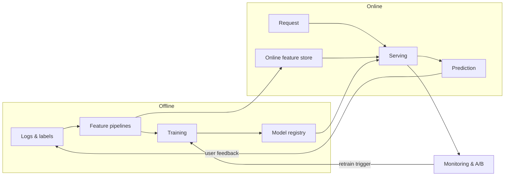

# Part III: ML systems

| # | Module | Big idea |
|---|---|---|
| M10 | [The ML system design framework](10-ml-system-design-framework.md) | A repeatable path from a vague business ask to a shipped, monitored model |
| M11 | [Data & training infrastructure](11-data-and-training-infrastructure.md) | Most production ML bugs are data bugs, so make the data pipeline correct by construction |
| M12 | [Serving, monitoring & experimentation](12-serving-monitoring-experimentation.md) | A model is not done until it is fast, watched, and proven in an A/B test |

Then apply it all in the [case studies](../case-studies/README.md).
